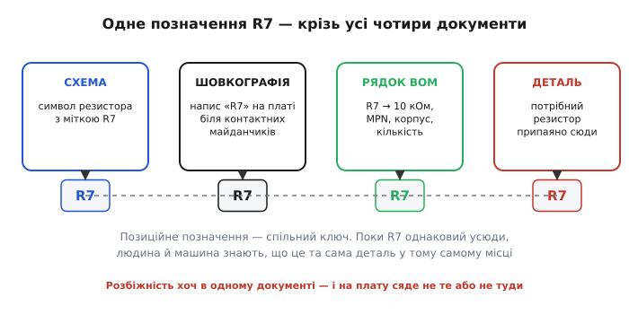
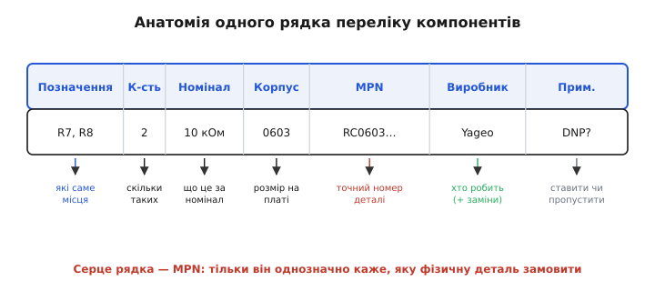

# Перелік компонентів (BOM)

Уявіть, що ви намалювали бездоганну схему й розвели ідеальну плату. Усе сходиться: кожен сигнал має свій шлях, кожна доріжка лягла гарно. Ви відсилаєте це на завод — і за тиждень отримуєте запитання: «А який саме конденсатор ставити в позицію C12? Скільки штук резисторів на 10 кОм замовляти? Цей мікроконтролер у корпусі на 48 чи на 64 виводи?» Схема цього не каже. Плата цього не каже. Бо їхня робота — показати **як з'єднано** й **де лежить**, а не **що саме купити**. Цю діру закриває окремий документ — **перелік компонентів** (англ. *bill of materials*, дослівно «рахунок матеріалів»; звідси скорочення BOM).

BOM — це міст від задуму до коробки реальних деталей. З одного боку міста — креслення, повне зв'язків і геометрії, але абстрактне: «тут резистор на 10 кілоом». З іншого боку — фізична деталь конкретного виробника, з конкретним номером, у конкретному корпусі, яку складальний автомат візьме пінцетом і притисне до плати. Без переліку компонентів з найкращого у світі креслення не вийде жодної плати: нема що паяти.


*Перелік компонентів стоїть між абстрактним задумом і коробкою фізичних деталей. [Схема](book:electronics/schematic-purpose) показує зв'язки, [плата](book:electronics/pcb-layout) — розташування, але жодна з них не каже, який саме виріб якого виробника замовити. Це й робить BOM.*

## Навіщо окремий документ, якщо все вже є на схемі

Здавалося б, на схемі вже написано «10 кОм» біля резистора — хіба цього мало? Мало, і причина проста: **«10 кОм» — це не деталь, це властивість**. Резисторів на 10 кілоом у світі тисячі: різних розмірів, різної точності, різних виробників, у різних корпусах для ручного чи машинного паяння. Завод не може «купити 10 кОм» — він може купити конкретний артикул конкретної фірми. Схема навмисне не вантажиться цими подробицями: її задача — думка про коло, а не закупівля. Якби в кожен символ на схемі вписували повний артикул, точність, корпус і виробника, креслення стало б нечитанним.

Тому подробиці закупівлі виносять в окрему таблицю. Схема лишається чистою думкою про коло; перелік компонентів бере на себе все приземлене — **що, скільки, від кого, у якому вигляді**. Це поділ обов'язків: одне креслення відповідає за ідею, інше — за матеріальне втілення.

> 🔧 **Навіщо це.** Перелік компонентів — це те, за чим **реально витрачають гроші й роблять плату**. Інженер віддає на виробництво три речі: схему (щоб розуміти задум), файли плати (щоб витравити мідь і просвердлити отвори) і BOM (щоб закупити й розставити деталі). Помилка в схемі — неправильна робота; помилка в BOM — **неправильна або порожня плата на руках** після того, як гроші вже сплачено. Тому до переліку компонентів ставляться так само прискіпливо, як до самої схеми: це не бюрократія, а робочий документ, від якого залежить, чи буде у вас працездатний пристрій.

## Спільний ключ: позиційне позначення

Щоб міст тримався, потрібен спосіб **однозначно прив'язати** рядок у таблиці до конкретного місця на схемі й на платі. Цей зв'язок несе **позиційне позначення** (англ. *reference designator* — «опорна позначка»): коротка мітка на кшталт `R7`, `C12`, `U3`. Перша літера каже **клас** деталі, число — **порядковий номер** усередині класу.

Літери ці не випадкові — їх задає стандарт (історично IEEE 315 / ANSI Y32.2 на графічні символи й позначки, а спосіб їх будувати — IEEE 200, нині [ASME Y14.44](book:electronics/component-symbols)). Кілька, що трапляються чи не на кожній платі:

```
R — резистор          C — конденсатор       L — котушка/дросель
D — діод              Q — транзистор        U — мікросхема
J — рознім (гніздо)   K — реле              Y — кварц/резонатор
```

Чому транзистор — `Q`, а не `T`? Бо `T` історично зайняли трансформатори, тож для транзисторів узяли вільну `Q`. А чому мікросхема — `U` (від англ. *unit* — «вузол»), а не очевидніше `IC`? Бо одна літера в позначці зручніша, і `U` прижилася як стандартна для будь-якої [інтегральної схеми](book:electronics/integrated-circuit) — від простого логічного вентиля до процесора. Ці дрібні домовленості й роблять схеми різних людей читанними одне для одного: побачивши `U`, ви відразу знаєте, що йдеться про мікросхему, ще не дивлячись, яку саме.

Уся сила позиційного позначення в тому, що воно **те саме в усіх чотирьох документах** одразу. `R7` на схемі — це той самий `R7`, що написаний на шовкографії плати біля контактних майданчиків, той самий `R7` у рядку переліку компонентів і та сама фізична деталь, яку зрештою туди припаяють. Один ключ зшиває весь ланцюжок «задум → виробництво → готова плата».


*Позиційне позначення — спільний ключ, що поєднує чотири документи. Поки `R7` однаковий усюди, і людина, і складальний автомат знають: це та сама деталь у тому самому місці. Варто розійтися хоч в одному документі — і на плату сяде не те або не туди.*

Звідси найважливіше правило гігієни: **позначення мусять збігатися всюди**. Якщо на платі шовкографія каже `R7`, а перелік компонентів називає це місце `R8` — складальник або поставить не ту деталь, або зупиниться й чекатиме пояснень. Тому позначення на платі звіряють із позначеннями в BOM один-до-одного: кількість і назви мають точно зійтися. Це найдешевша перевірка, що рятує від найдорожчих помилок.

## З чого складається рядок

Один рядок переліку компонентів описує **одну позицію** — тобто одну деталь, повторену стільки разів, скільки однакових місць на платі. Розгляньмо, що несе кожна колонка й чому вона там.


*Рядок переліку компонентів і призначення кожної колонки. Серце рядка — номер деталі (MPN): тільки він однозначно каже, яку фізичну річ замовити; усе решта — це опис і зручність.*

- **Позиційні позначення** — які саме місця на платі заповнює ця деталь, через кому: `R7, R8, R12`. Звідси видно, скільки разів вона трапляється.
- **Кількість** — скільки штук на одну плату; це просто число позначень у попередній колонці. Колонка ніби надлишкова, але саме за нею рахують закупівлю, тож її тримають окремо й звіряють із переліком позначень.
- **Номінал або значення** — `10 кОм`, `100 нФ`, `STM32F103`. Те, що читач упізнає змістовно. Для резистора це опір, для конденсатора — ємність, для мікросхеми — її назва.
- **Корпус** — фізичний типорозмір: `0603`, `SOT-23`, `LQFP-48`. Та сама за номіналом деталь буває в десятку корпусів, і складальному автомату важливий саме корпус — бо це геометрія, яку треба зіставити з [контактними майданчиками плати](book:electronics/pcb-layout).
- **Номер деталі виробника (MPN, *manufacturer part number*)** — точний артикул на кшталт `RC0603FR-0710KL`. Оце **серце рядка**: тільки MPN однозначно визначає фізичну річ. Усе попереднє — опис для людини; MPN — адреса для закупівлі.
- **Виробник** — чия це деталь. Разом із MPN дає повну однозначність, бо номери в різних фірм можуть випадково збігтися.

> 🔧 **Навіщо це.** Розрізняйте **опис** і **номер деталі**. «Резистор 10 кОм 0603» — це опис: за ним людина зрозуміє, про що мова, але купити за ним не можна, бо таких десятки. `RC0603FR-0710KL` від Yageo — це конкретна річ із конкретного складу. Початківці часто здають перелік компонентів із самими лише номіналами — і отримують від заводу або потік уточнень, або, гірше, деталі «на власний розсуд складальника», що можуть не зійтися за точністю, напругою чи розміром. Правило просте: **кожен рядок, що йде на виробництво, мусить мати MPN і виробника.**

## Дві колонки, що рятують реальні проєкти

Двох колонок немає в навчальних прикладах, але без них не обходиться жодне справжнє виробництво.

**Дозволені заміни (AVL, *approved vendor list* — «перелік схвалених постачальників»).** Конкретного резистора може просто не виявитися на складі — закінчився, зняли з випуску, виросла ціна. Якщо ви назвали **рівно один** MPN, виробництво стає: складальнику нема з чого вибрати. Тому поряд із основним номером перелічують **рівноцінні заміни** — інші артикули (часто й інших фірм), які за всіма важливими властивостями підходять. Тоді постачання має свободу взяти те, що є зараз, не зупиняючи складання. AVL — це ваш свідомий дозвіл: «ось ці деталі я теж вважаю прийнятними тут».

**Не встановлювати (DNP / DNI, *do not populate* / *do not install* — «не монтувати»).** Дуже часто на платі навмисно лишають місця **порожніми**. Скажімо, ви розвели майданчик під додатковий конденсатор «про всяк випадок» або під резистор, що задаватиме режим, але в цьому варіанті виробу він не потрібен. Місце на платі є, у схемі позиція є — а деталь ставити **не треба**. Якщо це чітко не позначити, складальник побачить порожній майданчик і або «дбайливо» щось туди впаяє, або зупиниться з питанням. Тому такі позиції в переліку компонентів виразно мітять: `DNP`, `DNI`, або й просто словами «не ставити». Це не недогляд — це навмисний пропуск, і його треба проголосити вголос.

**Worked-приклад: чому DNP — це не «забув вписати».** Припустимо, на платі є позиція `R20`, що вибирає адресу мікросхеми на шині. У вашому варіанті адреса задається інакше, тож `R20` має лишитися порожнім. У переліку компонентів це окремий рядок:

```
Позначення  К-сть  Номінал  Корпус  MPN          Примітка
R20         1      —        0603    —            DNP — не монтувати
```

Складальник, дійшовши до `R20`, прочитає «DNP» і свідомо **пропустить** це місце. Якби рядка не було взагалі, виник би розрив: на платі майданчик є, а в переліку про нього мовчок — і це привід зупинитися й перепитати. Порожнє місце треба не «не згадувати», а **явно оголосити порожнім**. Різниця між мовчанням і явним «не ставити» — це різниця між зупиненою лінією та плавним складанням.

## Машина теж читає цей файл

Перелік компонентів — не лише папірець для людини. Його читає **складальний автомат**, що розставляє деталі, і програми закупівлі, що замовляють їх сотнями. Тому формат має бути **строгим і однозначним**: зазвичай це проста таблиця (часто звичайний CSV — текст із комами-роздільниками), де кожен рядок — позиція, а колонки названі так, як очікує приймальна сторона. Жодних вільних приміток на пів-сторінки: машина їх не зрозуміє.

Звідси випливає корисна звичка — **перевіряти перелік компонентів автоматично**, ще до відправлення. Найпростіша й найцінніша перевірка: чи збігається сумарна кількість позначень із заявленою кількістю в кожному рядку, і чи має кожна позиція, що йде на монтаж, свій MPN. Це ловить дві найчастіші помилки — загублену деталь і рядок без артикула — за частку секунди.

:::tabs
```cpp
// Перевірка одного рядка BOM перед відправленням на виробництво.
// refdes_count — скільки позначень фактично перелічено (R7,R8 → 2);
// qty — заявлена кількість; has_mpn — чи вказано номер деталі; dnp — чи це «не монтувати».
// Повертає 0, якщо рядок чистий, або код проблеми.
int bom_check_row(int refdes_count, int qty, bool has_mpn, bool dnp)
{
    if (refdes_count != qty)
        return 1;                 // кількість не сходиться з переліком позначень
    if (!dnp && !has_mpn)
        return 2;                 // монтуємо, але немає MPN — закупити нічим
    return 0;                     // рядок придатний
}
// bom_check_row(2, 2, true,  false) -> 0   (R7,R8 — два, MPN є: чисто)
// bom_check_row(2, 3, true,  false) -> 1   (перелічено двоє, а написано «3»: розбіжність)
// bom_check_row(1, 1, false, false) -> 2   (монтуємо без MPN: нічого замовити)
```
```python
# Перевірка одного рядка BOM перед відправленням на виробництво.
# refdes_count — скільки позначень фактично перелічено (R7,R8 → 2);
# qty — заявлена кількість; has_mpn — чи вказано номер деталі; dnp — чи це «не монтувати».
# Повертає 0, якщо рядок чистий, або код проблеми.
def bom_check_row(refdes_count, qty, has_mpn, dnp):
    if refdes_count != qty:
        return 1                  # кількість не сходиться з переліком позначень
    if not dnp and not has_mpn:
        return 2                  # монтуємо, але немає MPN — закупити нічим
    return 0                      # рядок придатний

# bom_check_row(2, 2, True,  False) -> 0   (R7,R8 — два, MPN є: чисто)
# bom_check_row(2, 3, True,  False) -> 1   (перелічено двоє, а написано «3»: розбіжність)
# bom_check_row(1, 1, False, False) -> 2   (монтуємо без MPN: нічого замовити)
```
:::

Така дрібна перевірка, прогнана по всіх рядках, заощаджує дні: краще побачити червоний рядок на екрані за секунду, ніж дізнатися про нього з листа заводу за тиждень. Повніший інструмент — який ще й звіряє позначення між схемою, платою та переліком і ловить «осиротілі» позиції — зібрано окремо в [перевірці узгодженості BOM](book:electronics/bom/proj-bom-consistency.md): там показано, як прочитати CSV, зіставити три списки позначень і виявити кожну розбіжність, перш ніж вона стане дорогою.

## Звідки взявся сам перелік компонентів

Перелік матеріалів — не винахід електроніки. Він прийшов із загального **виробництва**, де ще на початку XX століття інженери виписували в кресленнях, із чого складається виріб, щоб закупити й порахувати потрібне. Поштовх дала нестача матеріалів під час Першої світової війни: великі замовлення треба було виконувати швидко й без марнування, і точний облік «що з чого зроблено» став питанням виживання заводу.

Справжньої сили перелік компонентів набув, коли за нього взялися комп'ютери. Із появою перших обчислювальних машин у 1950-х на заводах почали писати програми, що тримали переліки матеріалів, запаси й розклад виробництва разом. У 1960-х це оформилося в **планування потреби в матеріалах** (англ. *material requirements planning*, MRP) — підхід, де перелік компонентів став центральним документом, від якого рахують усю закупівлю й виробництво. Його першими впровадили на заводах Black & Decker (1964), а основоположниками методу називають трьох інженерів — Джозефа Орлики, Олівера Вайта й Джорджа Плоссла; книга Орлики 1975 року рознесла ці ідеї по всій промисловості. Це усталений факт історії техніки. Електроніка успадкувала готову ідею й додала своє — позиційні позначення, корпуси, MPN, — але кістяк лишився тим самим: **таблиця, що каже, з чого зроблено виріб**.

## Як це тримати в голові

Перелік компонентів — це переклад задуму на мову закупівлі та складання. Схема й плата живуть в абстракції зв'язків і геометрії; перелік компонентів спускає це на землю, називаючи кожну деталь конкретним артикулом, у конкретному корпусі, у потрібній кількості, від конкретного виробника — і прив'язуючи кожну до її місця через спільний ключ, позиційне позначення.

Усе тримається на трьох звичках. Перша: **позначення збігаються всюди** — на схемі, на платі, у переліку, на готовій деталі; це наскрізна нитка, і рватися їй не можна. Друга: **кожен монтований рядок має MPN і виробника** — бо опис «10 кОм» купити неможливо, а конкретний артикул — можна. Третя: **порожні місця оголошуються явно** через DNP, а можливі заміни — через AVL, щоб ні людина, ні машина не гадали, а діяли напевно. Дотримайтеся цих трьох — і ваше бездоганне креслення нарешті перетвориться на бездоганну плату, а не на тиждень листування із заводом.

> 🔧 **Навіщо це.** Коли ви вперше замовлятимете виготовлення й складання плати, від вас попросять рівно три речі: схему, файли плати й перелік компонентів. Перші дві ви, найімовірніше, зробите ретельно — а на BOM зекономите час, і саме він стане причиною затримки. Запам'ятайте перелік компонентів як **окремий повноцінний документ**, не як додаток до схеми: у ньому живе вся приземлена правда про те, що фізично сидітиме на платі. Зробите його охайно з першого разу — і виробництво піде гладко.
