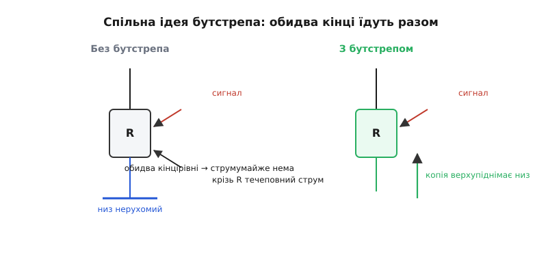
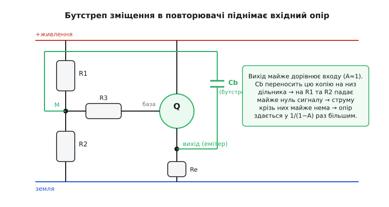
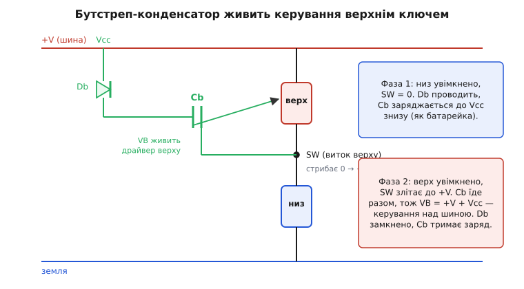

# Бутстреп-каскад

Назва каже все, тільки спершу здається жартом. «Bootstrap» (англ.) — це петелька-вушко ззаду на халяві чобота, за яку зручно натягувати взуття. А ідіома «підняти себе за власні петельки» (англ. *pull yourself up by your bootstraps*) — старий приклад фізично неможливого: не можна злетіти, тягнучи себе вгору за власні шнурки, бо рука й чобіт — одне тіло, сили взаємно гасяться. У схемотехніці цей самий образ позичили для **геть реального** трюку: вузол кола **піднімають, подаючи на нього копію його ж виходу**, і завдяки тому, що обидва кінці їдуть разом, відбувається те, що окремо здавалося б неможливим. (Сама ідіома й те, як вона перекочувала в електроніку приблизно в середині 1940-х, — [окрема невелика історія](book:electronics/bootstrap-circuit/hist-bootstrap-name.md).)

У чому ж фокус, якщо в механіці так не виходить? У механіці немає «другого джерела». А в підсилювачі є: вихід уже **відтворює** вхід (з підсиленням, близьким до одиниці) — і цю готову копію ми безкоштовно беремо й «підставляємо знизу» під той вузол, який хочемо підняти. Тіло не одне: працює зовнішнє джерело енергії підсилювача. Тому петелька раптом тримає.

Звідси два класичні застосування, що на вигляд різні, а в основі — той самий рух. Перше: **підняти вхідний опір** повторювача, змусивши коло зміщення «їхати» разом із сигналом, щоб воно перестало навантажувати джерело. Друге: **підняти напругу керування над шиною живлення** — дати верхньому ключеві півмоста потрібні вольти на затворі, яких «згори» взяти нема звідки. Розберімо спільну ідею, тоді обидва випадки, і де трюк ламається.


*Суть бутстрепа в одному кадрі. Якщо нижній кінець елемента стоїть на місці, по ньому тече повний сигнальний струм. Якщо ж нижній кінець «підняти» копією того, що на верхньому, обидва кінці рухаються однаково — різниця напруг на елементі майже нульова, струму крізь нього майже нема. Елемент ніби «зник» для сигналу.*

## Спільна ідея: різниця напруг вирішує все

Через будь-який двополюсник струм визначає **різниця** напруг на його кінцях, а не самі напруги. Резистор: `I = (U_верх − U_низ) / R`. Конденсатор реагує на швидкість зміни тієї ж різниці. Тож якщо ви якимось чином зробите так, що **обидва кінці гойдаються синхронно**, різниця стане майже сталою — і для змінного сигналу елемент поводитиметься так, ніби його опір величезний (резистор) або ніби він тримає на собі сталу напругу, як заряджена батарейка (конденсатор).

Ось і весь бутстреп. Ми не змінюємо сам елемент — ми **рухаємо його «нерухомий» кінець** так, щоб він повторював «робочий» кінець. А готову копію руху беремо з виходу підсилювача, бо вихід для того й існує, щоб відтворювати вхід.

> 🔧 **Навіщо це.** Дешевими, маленькими деталями домогтися характеристик, які «чесно» вимагали б дорогих або взагалі недосяжних. Одним резистором і конденсатором підняти вхідний опір каскаду з десятків кілоом до десятків мегаом — без польового транзистора. Або одним діодом і конденсатором живити керування верхнім n-канальним ключем замість окремого ізольованого джерела на кожен ключ. У прошивці-керуванні мостом саме від справної роботи бутстрепа залежить, чи відкриється верхнє плече взагалі.

Тепер той самий принцип у двох його найважливіших втіленнях.

## Втілення перше: підняти вхідний опір повторювача

[Емітерний повторювач](book:electronics/voltage-follower) — каскад, що віддає на виході майже точну копію входу (коефіцієнт передачі A ≈ 0.99), має низький вихідний опір і нібито високий вхідний. Біда в тому, що високий вхідний опір **самого транзистора** псує дільник зміщення на його базі. Щоб задати робочу точку, на базу вішають два резистори від живлення й до землі — R1 і R2. Для сигналу вони стоять паралельно й «дивляться» одним кінцем на базу, другим — на нерухомі шини (живлення й земля для змінного струму однаково «земля»). Цей паралельний опір R1∥R2 сидить просто на вході й садить його: хоч би яким високим був опір транзистора, джерело сигналу бачить насамперед ці кількадесят кілоом.

Знизити їх не можна — інакше попливе зміщення. А підняти **для сигналу**, не чіпаючи постійного струму, — можна. Саме тут бутстреп.


*Класичний бутстреп вхідного опору. Дільник R1–R2 задає зміщення; його середній вузол M під'єднано до бази не напряму, а через резистор R3. Конденсатор Cb переносить вихід (емітер) назад на вузол M. Оскільки вихід майже дорівнює входу, M гойдається майже синхронно з базою — і на R3 (а через нього й на дільник) сигнальної напруги падає крихта. Через що крізь дільник тече крихта струму — отже, для джерела він здається у багато разів «більшим».*

Простежмо механізм. Вхід (сигнал) приходить на базу. Вихід знімаємо з емітера; він повторює базу з коефіцієнтом A ≈ 0.99. Конденсатор Cb бере цей вихід і подає на вузол M — точку, з якої через R3 живиться база. Для постійного струму Cb — розрив, тож зміщення дільник задає як завжди, чесно. А для сигналу Cb — майже коротке, тож на M з'являється напруга, що дорівнює виходу, тобто майже дорівнює напрузі на базі.

Тепер дивимось на резистор R3 між M і базою. На одному його кінці — напруга бази `u`, на другому — напруга M, що дорівнює `A·u`. Різниця на R3 — лише `u − A·u = u·(1 − A)`. При A = 0.99 це **одна сота** вхідного розмаху. Струм крізь R3 (а отже й уся «вимога» до джерела з боку кола зміщення) — у сто разів менший, ніж був би без бутстрепа. А менший струм за тієї самої напруги — це за визначенням **більший опір**. Каже формула:

```
Z_видимий = R3 / (1 − A)
A = 0.99   →   Z_видимий = R3 / 0.01 = 100 · R3
```

Та сама логіка діє й на сам дільник R1∥R2, який тепер «висить» на вузлі M, що гойдається разом з виходом: на ньому теж падає лише частка `(1 − A)` сигналу, тож його видимий опір зростає в стільки ж разів. Звідки точно береться `1/(1−A)`, що буває з цим виразом на низьких і високих частотах і де він перестає рятувати — у [виведенні видимого опору](book:electronics/bootstrap-circuit/math-bootstrap-impedance.md): там і формула з частиною від ємності, і чому занадто мала Cb «з'їдає» баси, і чому A < 1 ставить стелю.

**Worked-приклад: який вийде вхідний опір.** Маємо повторювач із A = 0.99, дільник R1 = R2 = 47 кОм (тобто R1∥R2 = 23.5 кОм) і розв'язувальний R3 = 47 кОм. Без бутстрепа джерело бачило б приблизно R1∥R2 = 23.5 кОм. З бутстрепом:

```
R3 та дільник для сигналу множаться на 1/(1−A):
коефіцієнт = 1 / (1 − 0.99) = 100

R3 видимий       = 47 кОм · 100        = 4.7 МОм
(R1∥R2) видимий  = 23.5 кОм · 100      = 2.35 МОм
вхідний опір ≈ паралель цих гілок з опором самого транзистора (теж мегаоми)
```

З десятків кілоом — у мегаоми, самим лише конденсатором. Перевіримо передбачення опору простою функцією — її зручно тримати поряд, щоб під час налаштування каскаду одразу бачити, куди веде вибір A:

```c
// Оцінка видимого вхідного опору бутстрепованого повторювача.
// r_bias — паралель резисторів зміщення (Ом), a — коефіцієнт передачі (0..1).
// Повертає видимий опір у омах; що ближче a до 1, то різкіше зростання.
float bootstrap_zin(float r_bias, float a)
{
    if (a >= 1.0f) return 1.0e12f;       // ідеал недосяжний — захист від ділення на нуль
    return r_bias / (1.0f - a);          // Z = R / (1 − A)
}
// bootstrap_zin(23500.0f, 0.99f) -> 2.35e6 Ом (2.35 МОм)
// bootstrap_zin(23500.0f, 0.995f) -> 4.7e6 Ом — піврозмаху ближче до 1 вдвічі підняло опір
```

Остання строчка показує підступ: виграш росте лавиноподібно, коли A підповзає до одиниці, але саме там він і **найкрихкіший** — будь-яка втрата підсилення (навантаження, температура, частота) обвалює `1 − A` у знаменнику, і опір стрибає туди-сюди. Тому реально цілять у скромні, **передбачувані** A ≈ 0.98…0.99 й не женуться за останніми частками.

Зверніть увагу, чому це той самий рух, що в загальній ідеї: ми взяли «нерухомий» нижній кінець кола зміщення (раніше прив'язаний до шин) і **підняли його копією виходу**. Коло зміщення поїхало разом із сигналом — і перестало його навантажувати.

## Втілення друге: підняти керування над шиною живлення

Другий випадок виглядає геть інакше, а серце те саме. Уявіть напівміст: два n-канальні MOSFET-ключі один над одним між шиною +V і землею, а їхня спільна точка SW годує навантаження (мотор, обмотку, фільтр). Нижній ключ простий: щоб його відкрити, треба подати на затвор напругу вище за виток, а виток у нього на землі — отже досить кількох вольтів від звичайного джерела керування.

А верхній ключ — головний біль. [Польовий ключ](book:electronics/mosfet-switch) відкривається напругою затвор-виток: треба, щоб затвор був приблизно на 10 В **вище за виток**. Але виток верхнього ключа — це і є точка SW, яка, коли ключ відкритий, **сама піднімається аж до +V**. Виходить, щоб тримати верхній ключ відкритим, на затвор треба подати щось на 10 В **вище за саму шину живлення**. Звідки взяти напругу, вищу за «найвищу» напругу в схемі? Згори її нема.

> 🔧 **Навіщо це.** n-канальні ключі дешевші, швидші й мають менший опір у відкритому стані, ніж рівноцінні p-канальні. Поставити n-канальний і вгорі, і внизу — спокуса для будь-якого драйвера мотора, перетворювача, класу-D. Але верхній n-канальний вимагає керування над шиною, і отут бутстреп-конденсатор замінює окреме ізольоване джерело живлення на затвор — копійчаним діодом і конденсатором. Альтернатива (p-канальний угорі) розібрана у [ключі верхнього плеча на p-канальнику](book:electronics/pnp-high-side-driver); бутстреп — те, що дає лишити n-канальний.

Рішення — той самий принцип у новій одежі: візьмемо конденсатор, **зарядимо його заздалегідь** до потрібних 10 В тоді, коли це легко, і потім дамо йому **поїхати разом із витоком** угору. Заряджений конденсатор тримає на собі сталу напругу — він і є «батарейка», що завжди на 10 В вища за свій нижній вивід. Чіпляємо нижній вивід до SW (до витоку верхнього ключа), верхній — до затвора через драйвер: і хоч би куди поліз виток, затвор завжди буде на 10 В вище. Петелька знову тримає.


*Бутстреп-живлення верхнього ключа за дві фази. Фаза 1: відкрито нижній ключ, точка SW притиснута до землі; діод Db проводить, і конденсатор Cb заряджається від джерела керування Vcc майже до повних Vcc. Фаза 2: відкривають верхній ключ, SW злітає до +V; діод Db замикається (бо його катод тепер вище за анод), а Cb «їде» вгору разом із SW, тримаючи на вузлі VB напругу +V + Vcc. Драйвер верхнього ключа живиться від цих VB — і має чим відкрити затвор над шиною.*

Розберімо цикл по фазах, бо в ньому вся краса.

**Фаза заряджання.** Нижній ключ відкрито, верхній — закрито. Точка SW притиснута майже до землі. Тепер верхній вивід Cb через діод Db з'єднаний із джерелом керування Vcc (типово 10–15 В), нижній — на SW, тобто майже на землі. Діод відкритий, струм тече, **Cb заряджається** майже до Vcc. Це робиться щоразу, коли низ увімкнено, — конденсатор «доливається».

**Фаза роботи.** Тепер закриваємо низ і відкриваємо верх. Виток верхнього ключа (а з ним і нижній вивід Cb) **злітає до +V**. Конденсатор заряду не загубив — він жорстко тримає на собі ту саму різницю Vcc. Тож його верхній вивід стає `+V + Vcc`: на цілих Vcc вище за шину живлення. Звідси й живиться драйвер верхнього ключа, і затвор отримує свої вольти над витоком. А діод Db у цю мить **замикається** — його катод (бік Cb) тепер вище за анод (бік Vcc), тож заряд назад у джерело не витікає. Конденсатор працює як ізольована «летюча» батарейка рівно стільки, скільки відкрито верх.

І слабке місце видно одразу з цієї картини: поки верх відкритий, Cb **ніхто не доливає**, а драйвер потроху висмоктує з нього струм (на власне споживання й на витоки). Напруга на Cb помалу просідає. Якщо тримати верхній ключ відкритим **надто довго**, бутстреп «висихає»: напруга затвор-виток падає, ключ виходить із повного відкриття, гріється, у важкому разі гине. Тому бутстреп вимагає, щоб низ **періодично вмикався** й давав Cb перезарядитися — звідси нелюбов бутстрепа до 100% заповнення й потреба в мінімальній паузі.

**Worked-приклад: яку ємність ставити.** Хай драйвер верхнього ключа за час відкриття висмоктує сумарний заряд Q_заг (заряд на затвор ключа Q_g плюс струм спокою драйвера за час відкриття). Допустима просадка на Cb — скажімо, ΔV = 0.5 В (більше — і ключ почне закриватися). Заряд ключа Q_g = 20 нКл, струм спокою I_q = 1 мА, найдовший час відкриття t = 50 мкс:

```
Q_заг = Q_g + I_q · t
Q_заг = 20·10⁻⁹ + 0.001 · 50·10⁻⁶
Q_заг = 20·10⁻⁹ + 50·10⁻⁹ = 70·10⁻⁹ Кл

C_min = Q_заг / ΔV
C_min = 70·10⁻⁹ / 0.5 = 140·10⁻⁹ Ф = 0.14 мкФ
```

На практиці беруть із запасом у 5–10 разів (тут ~1 мкФ), бо ємність плаває, заряд ключа в даташиті оптимістичний, а просадку хочемо ще меншу. Полічимо мінімум у коді — таку перевірку зручно мати під рукою, бо вибір ємності зав'язаний на найдовший час відкриття, який задає прошивка:

```c
// Мінімальна ємність бутстреп-конденсатора верхнього ключа.
// q_gate — заряд затвора (Кл), i_q — струм спокою драйвера (А),
// t_on_max — найдовший час відкриття верху (с), dv_droop — допустима просадка (В).
float bootstrap_cap_min(float q_gate, float i_q, float t_on_max, float dv_droop)
{
    float q_total = q_gate + i_q * t_on_max;   // увесь заряд, що піде з Cb
    return q_total / dv_droop;                  // C = Q / ΔV
}
// bootstrap_cap_min(20e-9f, 1e-3f, 50e-6f, 0.5f) -> 1.4e-7 Ф; ставимо ~1 мкФ із запасом
```

Останній доданок `i_q · t_on_max` пояснює, чому **довге** відкриття небезпечне: що більший t_on_max, то більший заряд треба тримати, то більша ємність — або, за фіксованої ємності, то глибша просадка. Прошивка, яка дозволяє верхньому ключу лишатися відкритим без межі, рано чи пізно «висушить» бутстреп.

## Чому це той самий трюк — і де він не той

Два випадки виглядають далеко один від одного: там підсилювач, тут силовий міст; там виграємо опір, тут — напругу. Але обидва роблять одне: **беруть кінець елемента, який «мав би стояти», і змушують його їхати разом із виходом**. У повторювачі нижній кінець кола зміщення їде за сигналом — і коло перестає навантажувати вхід. У мості нижній кінець конденсатора їде за витоком — і конденсатор тримає керування над шиною. Спільне ядро: **синхронний рух обох кінців гасить різницю**, а різниця — це те, що визначає або струм (резистор), або «втрату» напруги (конденсатор).

Аналогія з петелькою на чоботі точна рівно доти, доки пам'ятаємо, **звідки енергія**. У механіці підняти себе за шнурки не вийде, бо рука й чобіт — одне тіло без зовнішньої опори. У схемі «друга рука» — це джерело живлення підсилювача (для повторювача) чи попередньо запасений у конденсаторі заряд (для мосту). Прибери це зовнішнє джерело — і бутстреп миттю стає тією самою неможливістю, що в ідіомі. Саме тому A < 1 ставить стелю опору (підсилювач не може віддати **більше**, ніж узяв), а конденсатор без доливання неминуче просідає (запас скінченний). Трюк не порушує законів — він спритно користується тим, що поряд **є** незалежне джерело сили.

І ще одне споріднене явище варто назвати, бо воно — та сама ідея, обернена знаком. Якщо два кінці елемента їдуть **назустріч** (протифазно), різниця не гаситься, а **подвоюється** — і елемент здається в рази «важчим». Це [ефект Міллера](book:electronics/miller-effect): паразитна ємність між входом і виходом інвертувального каскаду виглядає для входу набагато більшою, ніж є, бо її кінці гойдаються в протифазі. Бутстреп — дзеркальний бік тієї самої монети: там кінці зводять синфазно, щоб елемент **зник**; у Міллері вони розходяться протифазно, і елемент **роздувається**. Один механізм, два знаки.

Підсумок простий і працює в обидва боки. Хочеш, щоб двополюсник перестав заважати для сигналу, — зроби так, щоб обидва його кінці рухалися однаково; готову копію руху бери з виходу, який однаково для того й існує. Назвали це жартома — на честь неможливого подвигу з петельками, — але в електроніці підняти себе за власне вушко якраз **можна**, бо тягне зовнішнє джерело, а петелька лиш передає рух туди, де він потрібен.
