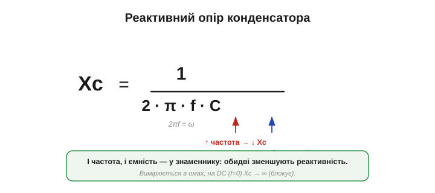
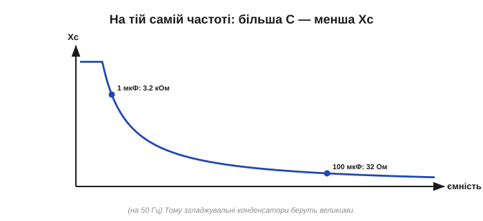
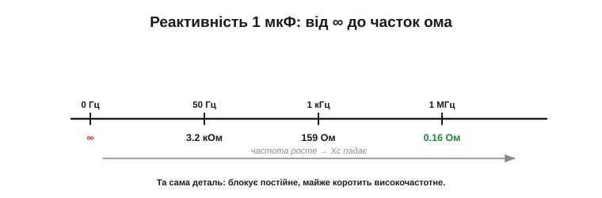

# Реактивний опір конденсатора Xc = 1/(2·π·f·C)

Сам **напрямок** уже відомий із поняття [реактивності](topic:electronics/reactance): реактивний опір конденсатора Xc спадає з частотою. Лишається точна формула, яка каже **наскільки**. Вона проста й варта запам'ятовування, бо знадобиться щоразу, коли треба порахувати, як конденсатор поводиться на змінному струмі. Гарна новина: формула коротка й працює для **ідеального** конденсатора (а реальний слухається її аж до своєї власної резонансної частоти). Підставив частоту й ємність — дістав відповідь. «Погана» (якщо це можна так назвати) — доведеться звикнути, що «опір» конденсатора прив'язаний до частоти й без неї не має сенсу.

### Формула

Реактивний опір конденсатора з ємністю C на частоті f:

```
Xc = 1 / (2 · π · f · C)
```


*Xc = 1/(2πfC). І частота f, і ємність C стоять у **знаменнику** — тож більша частота **або** більша ємність дають **меншу** реактивність. Множник 2π перетворює частоту в герцах на кутову частоту.*

Прочитаймо її. І f, і C — у знаменнику, тож обидва діють однаково: **що більша частота — то менша Xc**, і **що більша ємність — то менша Xc**. Зростання частоти знижує Xc — це сама природа [реактивності](topic:electronics/reactance); а більша ємність діє так само, бо більший конденсатор пропускає легше (йому є куди прийняти більше заряду на кожен вольт — у цьому й суть [ємності](topic:electronics/capacitance)). Подвоїте частоту — Xc удвічі менша; подвоїте ємність — те саме. А спрямуйте частоту до нуля — Xc злітає до нескінченності: ось чому конденсатор намертво блокує постійний струм, хоч би яким великим той був. І навпаки, на дуже високій частоті Xc прямує до нуля — **ідеальний** конденсатор стає майже дротом. (Реальний — лише до своєї **власної резонансної частоти**: вище за неї бере гору паразитна індуктивність виводів та обкладок, і конденсатор поводиться вже не як ємність, а як **котушка** — точне дзеркало SRF, що його мають [реальні котушки](topic:electronics/inductor-types). Тому розв'язку на дуже високих частотах роблять кількома конденсаторами різного номіналу.) Усе те «блокує постійне, пропускає швидке», закладене в самій [роботі конденсатора](topic:electronics/capacitor), тепер уміщається в один рядок формули.

### Звідки 2π: кутова частота

Чому у формулі стоїть саме 2π·f, а не просто f? Це данина синусоїді. Одне повне коливання — це повний оберт «фазового кола» на 2π радіан. Тому зручно ввести **кутову частоту** (*angular frequency*) ω = 2π·f (омега, у радіанах за секунду): вона каже, як швидко «крутиться» фаза.

Чому «крутиться»? Синусоїду найзручніше уявляти як проєкцію точки, що рівномірно біжить по колу: один повний оберт (2π радіан) дає одне коливання. Якщо за секунду таких обертів f, то фаза намотує 2π·f радіан за секунду — це й є ω. Радіани, а не герци, — «рідна» міра швидкості для синусоїд, тому ω природно виринає в усіх формулах змінного струму. Рівність ω = 2πf варто тримати в голові — це базова заміна, спільна для всієї реактивної техніки. Через неї формула стає геть лаконічною:

```
ω = 2 · π · f          (кутова частота)
Xc = 1 / (ω · C)
```


*Для синусоїди V = V₀·sin(ωt) швидкість зміни (dV/dt) у ω разів більша за саму амплітуду. А струм конденсатора i = C·dV/dt, тож його амплітуда — це C·ω·V₀. Відношення напруги до струму V₀/I₀ = 1/(ωC) — це й є Xc. Звідси і 2π, і обернена залежність від f та C.*

Коротко, звідки взялася формула (не лякаючись похідної): для синусоїдної напруги V = V₀·sin(ωt) швидкість її зміни тим більша, чим швидше «крутиться» фаза, тобто пропорційна ω. А струм конденсатора i = C·dV/dt (саме ця залежність струму від швидкості зміни напруги й породжує [реактивний характер](topic:electronics/reactance) конденсатора) дорівнює цій швидкості, помноженій на C. Тож амплітуда струму виходить I₀ = C·ω·V₀, а відношення «напруга на струм» (тобто реактивність) — Xc = V₀/I₀ = 1/(ωC) = 1/(2πfC). Усі три риси — обернена залежність від f, від C і множник 2π — складаються самі собою.

### Одиниці — оми

Реактивність, як і опір, вимірюється в **омах** — і це не випадковість, а необхідність, бо нею ми користуватимемося замість опору. Перевірмо розмірність:

```
[1/(f·C)] = 1 / ( (1/с) · (Кл/В) ) = (В·с)/Кл = В / (Кл/с) = В/А = Ом   ✓
```

(тут ампер — кулон за секунду). Оми сходяться. Тепер Xc можна підставляти в закон Ома замість R — для **амплітуд** (чи діючих значень) напруги й струму:

```
V = I · Xc
```


*Знаючи Xc на заданій частоті, конденсатор рахують точно як резистор: амплітуда напруги = амплітуда струму × Xc. Різниця лише в тому, що Xc треба перерахувати для кожної частоти (і що тут є [зсув фаз](book:electronics/phase-shift) між струмом і напругою).*

**Приклад (струм крізь конденсатор).** На конденсатор 1 мкФ подали змінну напругу амплітудою 5 В і частотою 1 кГц. Який струм потече? Спершу реактивність: Xc = 1/(2π·1000·1×10⁻⁶) ≈ 159 Ом. Тоді амплітуда струму:

```
I = V / Xc = 5 В / 159 Ом ≈ 31 мА
```

Підніміть частоту до 10 кГц — Xc упаде вдесятеро (≈ 16 Ом), а струм виросте вдесятеро (≈ 0.31 А). Той самий конденсатор, та сама напруга — удесятеро більший струм лише тому, що сигнал швидший.

Тут варто згадати тонкість, властиву [реактивності](topic:electronics/reactance) загалом: хоч крізь конденсатор тече струм і на ньому є напруга, активної потужності він **не споживає**. Струм і напруга [зсунуті в часі](topic:electronics/phase-shift): коли одне максимальне, інше — нуль, тож їхній добуток у середньому за період дає нуль. Конденсатор то бере енергію (заряджаючись), то віддає (розряджаючись), майже не нагріваючись (ідеальний — зовсім; реальний трохи гріє свій [ESR](topic:electronics/capacitor-parasitics)). Тому Xc — це «опір» лише в сенсі обмеження струму, а не втрат: реактивний елемент обмежує струм, майже не перетворюючи енергію на тепло.

### Як це виглядає на графіку

Оскільки Xc ∝ 1/f, графік реактивності від частоти — спадна крива (гіпербола): круто падає від нескінченності біля нуля й полого тягнеться вниз на високих частотах.


*Xc(f) для конкретного конденсатора. На f → 0 (постійний струм) Xc прямує до нескінченності — конденсатор блокує. З ростом частоти Xc стрімко спадає. На графіку відмічено кілька порахованих точок для 1 мкФ.*

На практиці реактивність частіше малюють у **подвійно-логарифмічних** осях — тоді гіпербола Xc ∝ 1/f перетворюється на просту **пряму**, що спадає, і її легко читати на око. Саме такими графіками рясніють даташити конденсаторів і дроселів: пряма, що йде **вниз** із частотою, — це конденсатор; пряма **вгору** — котушка. Один погляд на нахил — і ясно, з якою деталлю маєш справу.

А якщо зафіксувати частоту й міняти ємність — Xc так само спадає (бо C теж у знаменнику): більший конденсатор має меншу реактивність на тій самій частоті.


*На фіксованій частоті більший конденсатор дає меншу Xc. Тому для відведення низькочастотних пульсацій беруть великі ємності (мала Xc навіть на низьких f), а для високочастотних завад вистачає дрібних.*

Порахуймо для відчуття: на 50 Гц конденсатор 1 мкФ має Xc ≈ 3.2 кОм, а 100 мкФ — лише ≈ 32 Ом (у сто разів менша, бо ємність у сто разів більша). Тому згладжувальні конденсатори в живленні беруть великими: щоб на низькій частоті пульсацій їхня реактивність була мізерною й вони впевнено «закорочували» ту пульсацію.

### Приклади

Найкраще формула відчувається на числах. Візьмімо конденсатор 1 мкФ і подивімося, як його реактивність змінюється з частотою.

**Приклад (Xc на різних частотах).** C = 1 мкФ = 1×10⁻⁶ Ф.

```
на 50 Гц:    Xc = 1/(2π · 50 · 1×10⁻⁶)    ≈ 3 183 Ом   (≈ 3.2 кОм)
на 1 кГц:    Xc = 1/(2π · 1000 · 1×10⁻⁶)  ≈ 159 Ом
на 1 МГц:    Xc = 1/(2π · 1×10⁶ · 1×10⁻⁶) ≈ 0.16 Ом
на 0 Гц (DC):                              Xc → ∞   (блокує)
```

Той самий конденсатор: на мережевій частоті — кілька кілоом (помітна протидія), на радіочастоті — частки ома (майже коротке замикання), а для постійного струму — нескінченність. Одна деталь, чотири порядки різниці — і все за однією простою формулою.


*Xc конденсатора 1 мкФ: від нескінченності на постійному струмі — до часток ома на радіочастотах. Та сама деталь по-різному «бачить» різні частоти.*

Зручне правило для прикидки в голові: щоразу, як частота **подвоюється**, Xc **зменшується вдвічі** (і навпаки). Тож, знаючи реактивність на одній частоті, легко оцінити її на сусідніх без калькулятора: на 100 Гц проти 50 Гц — удвічі менша, на 500 Гц — удесятеро. Це той самий обернений зв'язок 1/f, лише в зручній для пам'яті формі «октава вгору — удвічі менше».

> 🔧 **Навіщо це.** Тепер видно числами, чому працює [розв'язувальний конденсатор](topic:electronics/capacitor-uses). Керамічний 100 нФ на високій частоті шуму має реактивність у частки ома — тобто майже **коротке замикання** для завад, які він відводить у землю; а для постійного живлення (Xc нескінченна) він невидимий. Те саме й з розділовим конденсатором: великий номінал ставлять туди, де треба пропустити й низькі частоти (бо Xc мала лише коли C велике). Формула Xc = 1/(2πfC) — це робочий інструмент добору номіналу.

**Приклад (добір розв'язки).** Хочемо, щоб на частоті завади 1 МГц реактивність була не більша за 0.1 Ом. Яка потрібна ємність?

```
Xc = 1/(2πfC)   →   C = 1/(2πf·Xc)
C = 1 / (2π · 1×10⁶ · 0.1) ≈ 1.6×10⁻⁶ Ф ≈ 1.6 мкФ
```

Тобто для дуже низької реактивності на 1 МГц вистачає мікрофарадного конденсатора. На практиці ставлять кілька паралельно (велика ємність низом, дрібна керамічна — для найвищих частот, де велика «пливе» через [ESL](topic:electronics/capacitor-parasitics)).

Ще одне щоденне застосування формули — **розділовий конденсатор** на вході підсилювача. Разом з опором навантаження він утворює частотно-залежний дільник: на низьких частотах Xc велика — сигнал слабшає; на високих Xc мала — сигнал проходить майже без втрат. Виходить **фільтр верхніх частот**, що пропускає корисний сигнал, але зрізає найнижчі частоти й постійне зміщення (саме те «блокує постійне, пропускає зміну», властиве [конденсаторові](topic:electronics/capacitor), тепер кількісно). Де проходить межа — частота зрізу — задають C і опір кола; це найпростіший приклад того, як реактивність формує частотну характеристику кола.

### Частота, де Xc дорівнює опору

Особлива точка настає там, де реактивність конденсатора **зрівнюється** з опором кола: Xc = R. Прирівнявши 1/(2π·f·C) = R, дістаємо **частоту зрізу**:

```
f_c = 1 / (2π · R · C)
```

Нижче за неї переважає Xc (конденсатор «командує» поведінкою), вище — опір. І ось краса: у знаменнику стоїть рівно той самий добуток R·C, що й **стала часу** τ у [RC-колі](topic:electronics/rc-time-constant)! Тобто f_c = 1/(2π·τ): швидкому RC-колу (мала τ) відповідає висока частота зрізу, повільному — низька. Часовий погляд (як швидко заряджається) і частотний (які частоти проходять) виявляються двома боками однієї монети — і це не випадковість, а глибокий зв'язок між сталою часу й частотою зрізу. Той самий процес, який у часовій картині міряють секундами заряджання, у частотній читається в герцах.

> 🔧 **Навіщо це.** Частота зрізу f_c = 1/(2πRC) — одна з найуживаніших формул в усій електроніці. За нею рахують межу будь-якого RC-фільтра: вхідного фільтра живлення, антибрязкоту, частотної корекції, простого фільтра низьких чи високих частот. Запам'ятавши, що в ній той самий R·C, що й стала часу, ви вільно переходите між «скільки мілісекунд» і «до якої частоти» — а це дві мови, якими говорить уся аналогова схемотехніка.

Отже, реактивний опір конденсатора **Xc = 1/(2πfC)** (в омах): обернено пропорційний і частоті, і ємності. Множник 2π — це перехід до кутової частоти ω = 2πf. Із Xc конденсатор рахують за законом Ома для амплітуд (V = I·Xc). На постійному струмі Xc нескінченна (блокує), на високих частотах — мала (пропускає). А де Xc зрівнюється з опором кола, настає частота зрізу **f_c = 1/(2πRC)** — той самий добуток R·C, що й [стала часу RC-кола](topic:electronics/rc-time-constant). Дзеркальну роль для котушки відіграє її [індуктивний опір](topic:electronics/inductive-reactance), що, навпаки, зростає з частотою.

> 🔌 **Компонентна вставка:** [ємнісний баласт — реактивність як «резистор без тепла»](topic:electronics/capacitive-reactance/comp-capacitive-dropper.md). Як кілооми Xc живлять копійчані LED-лампи без жодного вата втрат, як упізнати цю схему за конденсатором X2 — і чому вона з'єднана з розеткою кожною своєю точкою, тож відкривати її ввімкненою не можна ніколи.

---
