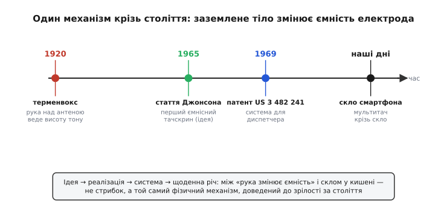

# 📜 Від терменвокса до скла в кишені: родовід дотику без дотику

Коли ви ведете пальцем по екрану смартфона, ви повторюєте жест, якому понад сто років. Тільки робили той жест не над склом, а над металевим прутиком, що стирчав із дерев'яної скриньки, — і не задля картинки, а задля звуку. Музикант підносив руку, не торкаючись прутика, і повітря між рукою та прутиком наповнювалося співом: тон повз угору, коли долоня наближалася, і вниз, коли віддалялася. Той прилад звався терменвокс, а фізичний фокус, на якому він стояв, — рівно той самий, що оживляє скло у вашій кишені. Заземлене людське тіло, наблизившись до електрода, змінює його ємність. Усе ємнісне зондування виросло з цього одного спостереження; варто простежити, як воно мандрувало від музики до радара й далі до телефону, бо в цій мандрівці добре видно, чим **ідея** відрізняється від **робочої речі**, а робоча річ — від **системи**, якою користуються щодня.


*Один механізм крізь століття. Між «рука над антеною змінює ємність» (1920) і мультитачем крізь скло (наші дні) — не стрибок, а той самий фізичний принцип, що поступово дозрівав: спершу ідея в музиці, потім перша робоча реалізація для комп'ютера, потім патент і система для диспетчера, нарешті — щоденна річ у кожній кишені.*

## Прилад, що народився з помилки приладу

1920 рік, Петроград (так тоді звався Петербург). У Фізико-технічному інституті, який щойно заснував фізик Абрам Іоффе, працював молодий співробітник — Лев Сергійович Термен. Завдання його було суто технічне й нітрохи не музичне: будували високочастотний генератор, щоб точно міряти діелектричну проникність газів. По суті це був вимірювальний прилад, де частота коливань залежала від того, що опинялося всередині вимірювальної ємності, — а отже, той самий прилад чутливо реагував і на наближення сторонніх предметів, тобто був і давачем наближення. Усе як годиться в інституті прикладної фізики: давачі, виміри, прилади для держави.

> Статус доказовості: усталено. Що Термен працював саме в Іоффе над високочастотним вимірюванням діелектричної проникності газів і що терменвокс став **побічним продуктом** цієї роботи — збігаються і його власні спогади, і незалежні історичні описи. Дата (1920) і місце (Петроград) теж усталені; перший публічний показ датують листопадом 1920 року.

І ось тут сталося те, з чого починаються гарні історії в науці: прилад «помилявся» цікавим чином. Термен — за фахом фізик, а до того ще й віолончеліст — помітив, що коли він підносить руку до схеми, вона змінює тон. Не вмикає, не вимикає, а **плавно веде** його вгору-вниз, як палець на грифі. Більшість людей списала б це на заваду, яку треба прибрати. Термен почув музику.

Механізм, який він підгледів, для нас уже знайомий до банальності, а тоді був тонким спостереженням. Прилад мав коливальний контур — генератор, чия частота задається ємністю та індуктивністю. Рука, піднесена до металевого вивода контуру, стає **другою обкладкою конденсатора**: між долонею та антеною з'являється невелика ємність, а оскільки тіло заземлене (через ноги, підлогу, ємність на саму планету), ця ємність додається до ємності контуру. Більше ємності в контурі — нижча частота коливань. Долоня ближче — ємність більша — тон нижчий; долоня далі — ємність менша — тон вищий. Музикант грає, керуючи відстанню в повітрі, не торкаючись нічого.

> 🔧 **Навіщо це.** Тут варто спинитися, бо в одному цьому абзаці схована вся суть пізнішого ємнісного зондування. Рука **не замикає** жодного контакту — між нею і схемою лишається повітря. Вона лише **добудовує конденсатор**, якого доти бракувало, і змінює тим електричну величину. Рівно те саме робить ваш палець над склом смартфона: не торкається схеми (між ними шар скла), а додає ємність на землю, яку схема ловить. Музичний інструмент 1920 року і сенсор телефона 2020-х читають **той самий сигнал** — приріст ємності від заземленого тіла поряд з електродом.

Термен спершу назвав прилад етерофоном (від «етер» — гіпотетичне середовище, що нібито переносить хвилі; звук буцімто народжувався «з повітря»). Пізніше, за прізвищем винахідника, у світі прижилася назва «терменвокс» — «голос Термена». Прилад справив фурор: 1922 року Термен показував його у Кремлі, грали навіть «Жайворонка» Глінки; згодом інструмент демонстрували по всій Європі — Лондон, Париж, німецькі міста, — а наприкінці 1927 року Термен привіз його до США, де 1928 року дістав на нього американський патент і виступав із Нью-Йоркським філармонічним оркестром.

> 🔧 **Навіщо це.** Зверніть увагу, що між **ідеєю** (рука над антеною веде тон) і **системою** (запатентований інструмент, який везуть світом і за яким стоїть виробництво) минуло вісім років. Ідея спалахнула 1920-го; патент і визнання — 1928-го. Це типова дистанція. Спостереження «о, рука змінює тон» — це ще не винахід, яким можна користуватися; між ними лежить уся робота зробити прилад надійним, керованим і відтворюваним. Цю дистанцію — від спалаху до зрілої речі — ми побачимо ще раз, коли дійдемо до тачскрина.

## Чия це робота: розрізняємо виміри ідентичності

Тут варто бути точним, бо історії техніки часто псує імперський наратив, що ліпить усе під один національний ярлик. Лев Термен — кого слід тут назвати?

Сам прилад народився в Петрограді, у радянській державній лабораторії, як побічний продукт державного дослідницького завдання, — це факт, і його не варто ні роздувати, ні ховати. Самого ж Термена джерела **послідовно описують як фізика з Петербурга**: він народився 1896 року в Петербурзі, навчався і працював там, у школі Іоффе. За походженням рід Терменів — французькі гугеноти й німці, що осіли в Російській імперії; тобто це не етнічний ярлик, а петербурзький фізик змішаного європейського кореня. Жодного «приховування» тут нема: ані української, ані іншої прихованої ідентичності в його випадку джерела не дають — на відміну від багатьох інших постатей, яких радянська кампанія першості 1948–53 років і пізніший наратив справді намагалися «дописати» в російську історію. У випадку Термена точний опис простий: **петербурзький фізик, винахід зроблено в радянському Петрограді**, і саме так його тут і подаємо — без додаткових ярликів і без приниження.

> Статус доказовості: усталено щодо місця, дати, інституції та змішаного гугенотсько-німецького кореня роду. Будь-які пізніші «національні» загострення навколо постаті Термена джерелами не підтверджуються — тож ми їх не вигадуємо.

Що тут справді цікаве для нашого предмета — це не паспорт винахідника, а **родовід ідеї**. Бо ідея «заземлене тіло змінює ємність електрода» виявилася куди довговічнішою за будь-яку державу й помандрувала далеко за межі музики.

## Сорок років тиші — і радар у Малверні

Терменвокс лишився дивовижею для концертних залів і саундтреків (його неземний голос пізніше звучатиме в кіно жахів і фантастиці). Сама ж фізика — «наближення тіла зсуває ємність» — на десятиліття немовби заснула як основа чогось практичнішого за музику. Її, звісно, використовували в давачах наближення й сигналізаціях, але думка зробити з неї **спосіб говорити з машиною**, тобто пристрій вводу, дозріла аж у 1960-х — і зовсім в іншому місці.

Місце це — Королівський радарний заклад (англ. Royal Radar Establishment, RRE) у містечку Малверн, Велика Британія. Це була державна лабораторія, де під час і після Другої світової війни доводили до пуття радіолокацію. А радіолокація породжує проблему, якої доти просто не існувало: на екрані перед оператором — десятки рухомих позначок (літаки), і оператору треба швидко **вказати машині, про яку саме позначку йдеться**. Тицьнути пальцем у точку на екрані — найприродніший жест на світі. Але як зробити, щоб скло екрана **відчуло** цей тик?

Над цим думав інженер RRE на ім'я Ерік Артур Джонсон (англ. Eric Arthur Johnson). Його цікавив дуже конкретний клопіт: керування повітряним рухом — диспетчерові на екрані радара треба обрати літак не через пульт із купою клавіш, а просто торкнувшись його позначки. І Джонсон узяв до рук рівно ту саму фізику, що колись заспівала в Термена.

> Статус доказовості: усталено. Що Джонсон працював у RRE (Малверн) і що його цікавило застосування до керування повітряним рухом — згадують і його публікації, і незалежні описи історії тачскринів. Нижче кожну дату й назву ми звіряємо окремо.

## Стаття 1965 року: ідея тачскрина на папері

У жовтні 1965 року Джонсон опублікував коротку статтю в журналі «Electronics Letters». Назва — «Touch Display — A Novel Input/Output Device for Computers» («Сенсорний дисплей — новий пристрій вводу-виводу для комп'ютерів»), том 1, випуск 8, сторінки 219–220. Дві сторінки — а в них уперше викладено принцип ємнісного тачскрина.

> Статус доказовості: усталено. Назва, журнал, том/випуск/сторінки й рік (1965) збігаються в кількох незалежних джерелах, зокрема в бібліографічних описах.

Що саме він запропонував? Поверх екрана (тоді — електронно-променева трубка) кладеться набір провідних електродів — мідних смужок чи площадок. Кожен електрод має невелику власну ємність. Палець оператора, наблизившись до конкретного електрода, **додає ємність** (те саме заземлене тіло, та сама добавка) — і схема, помітивши, на якому саме електроді ємність підскочила, розуміє, куди тицьнули. Жодного механічного натиску: контакт **ємнісний**, через поле, а не через замикання.

Тут варто чесно зважити, чим це було, а чим — ще ні. Стаття 1965 року — це **ідея, доведена до робочого зразка й описана**: Джонсон не просто помріяв, а показав, що ємнісний дотик до електрода поряд з екраном справді можна надійно зчитати. Але це ще не той мультитач крізь суцільне скло, що у вашому телефоні. Електроди були грубі (палець вибирав цілу позначку, не точку з точністю до пікселя), дисплей — громіздка трубка, а «екран» бачив, по суті, натискання на одну з небагатьох наперед заданих зон. Це перший ємнісний тачскрин — як **принцип і робочий зразок**, — але ще не зріла система.

> 🔧 **Навіщо це.** Розрізнення тут не педантичне, а суттєве для того, хто пише чи читає історію техніки. «Перший ємнісний тачскрин» — правда, якщо мати на увазі **принцип і опис робочого пристрою**. Але якби хтось сказав «у 1965-му вже був тачскрин, як у смартфоні» — це була б неправда: між робочим зразком на дві наперед задані зони і прозорим мультитач-склом лежать десятиліття інженерної праці (прозорі провідники, дрібна сітка електродів, взаємна ємність для багатьох пальців, боротьба з паразитами й дрейфом). Ідея 1965-го — фундамент; будинок на ньому зводили ще довго.

Через два роки, 1967-го, Джонсон виклав свою думку повніше — зі світлинами й схемами — у статті «Touch Displays: A Programmed Man-Machine Interface» («Сенсорні дисплеї: програмований інтерфейс людина-машина») у журналі «Ergonomics». Уже з самої назви видно поворот думки: він говорить не про залізячку, а про **інтерфейс** — про новий спосіб людині й машині спілкуватися. Це той рідкісний момент, коли інженер бачить не лише прилад, а й майбутній звичай: пальцем по екрану.

## Патент 1969 року: від статті до права

Стаття описує ідею; патент її **закріплює як власність і фіксує конструкцію**. 2 грудня 1969 року Бюро патентів США видало Джонсонові патент номер US 3 482 241 під назвою «Touch displays» («Сенсорні дисплеї»). Заявку було подано 2 серпня 1966 року; власником (правонаступником) у патенті зазначено британську авіаційну організацію — що прямо перегукується із застосуванням, заради якого все й починалося: керування повітряним рухом.

> Статус доказовості: усталено за первинним джерелом — текстом самого патенту. Номер US 3 482 241, назва «Touch displays», винахідник Eric Arthur Johnson, дата подання 2.08.1966, дата видачі 2.12.1969, правонаступник — авіаційна організація (Велика Британія). Усе це читається безпосередньо в патенті.

Цікава деталь: у самому патенті описано **обидва** способи зчитати дотик — і за зміною ємності, і за зміною опору. Тобто документ, який ми згадуємо як віху ємнісного тачскрина, насправді охоплює ширше: і ємнісний, і резистивний підходи до того, «як зробити, щоб контакт біля екрана дав сигнал». Це теж типово для патентів: винахідник прагне закрити поняття якнайширше, не лише ту реалізацію, що зробив першою.

Складімо тепер усю драбину для Джонсона, бо вона рівно та сама, що ми вже бачили в Термена:
- **ідея** — наближення пальця змінює ємність електрода біля екрана (думка, яку треба було ще довести);
- **реалізація** — робочий зразок і опис у статті 1965 року (принцип доведено залізом);
- **система/осмислення** — стаття 1967 року про інтерфейс людина-машина (не прилад, а спосіб взаємодії);
- **патент** — US 3 482 241, 1969 рік (право й зафіксована конструкція).

Між першою думкою і патентом — приблизно той самий проміжок у кілька років, що й у терменвокса. Це не випадковість: стільки часу зазвичай і потрібно, щоб спостереження дозріло до речі, якою можна володіти й користуватися.

## Та сама фізика, інше застосування — і чому це не випадковий збіг

Чому терменвокс і тачскрин Джонсона стоять на **тотожному** принципі, хоч один грає музику, а другий слухає палець? Бо обидва читають одну й ту саму подію: **заземлене тіло наблизилося до електрода і змінило його ємність**. Уся різниця — у тому, що з цією зміною робити далі.

```
Терменвокс:   рука → змінює ємність контуру → змінює частоту генератора → змінює тон
Тачскрин:     палець → змінює ємність електрода → схема ловить приріст → визначає, де торкнулися
```

В обох випадках вхід один — приріст ємності від руки; різниться лише вихід. Терменвокс перетворює зміну ємності на **висоту звуку** (бо ємність сидить у коливальному контурі й тягне за собою частоту). Тачскрин перетворює ту саму зміну на **координату** (бо схема знає, який саме електрод відчув добавку). Природа сигналу тотожна; різні тільки «споживачі» цього сигналу.

Саме тому коректно казати, що ємнісне зондування має **єдиний родовід**, який тягнеться від музичного інструмента 1920 року до скла смартфона. Це не поетична вільність і не натяжка — це буквально один і той самий фізичний механізм, описаний тими самими формулами, лише запряжений у різну роботу. Музикант 1920-го і ваш палець над екраном змінюють ту саму величину тим самим способом.

> 🔧 **Навіщо це.** Для інженера ця спадкоємність — не лише історія, а й практична підказка. Якщо вам колись доведеться будувати ємнісний давач, корисно пам'ятати, що той самий «приріст ємності від тіла» можна повісити на будь-який зручний вихід: на частоту (як терменвокс — і саме так працює найпростіша ємнісна кнопка на релаксаційному генераторі), на час заряду, на координату, на рівень напруги. Принцип один; вибір виходу диктує задача. Сто років тому з нього зробили музику; сьогодні — карту дотиків; завтра, можливо, щось, чого ми ще не уявляємо.

## Куди це вело далі

Між патентом Джонсона і склом у кишені були ще важливі кроки, які варто бодай назвати, щоб родовід не обірвався на 1969-му.

На початку 1970-х у ЦЕРН (Європейська організація ядерних досліджень) інженери Бент Стумпе (дан. Bent Stumpe) і Френк Бек (англ. Frank Beck) зробили **прозорий** ємнісний тачскрин — щоб керувати прискорювачем; його ввели в роботу близько 1973 року. Прозорість — крок не дрібний: одна річ — непрозорі мідні площадки поверх трубки, інша — провідники, крізь які видно сам екран. Це наблизило тачскрин до того вигляду, який ми знаємо.

> Статус доказовості: усталено щодо ЦЕРН, імен Стумпе й Бека та застосування для прискорювача на початку 1970-х; точні дати в різних джерелах трохи різняться, тож подаємо обережно («близько 1973»).

А головний стрибок до сучасного скла стався вже у 2000-х, коли дозріли дві речі: **прозорі провідники** (тонкі плівки, крізь які видно дисплей) і **взаємна ємність** замість простої власної. Взаємна ємність — вимірювання не «електрод на землю», а «електрод проти сусіднього електрода» — дала змогу читати кожен перетин сітки окремо, а отже, бачити **багато пальців одночасно** без двозначності. Саме це перетворило тачскрин із «однієї кнопки під пальцем» на повноцінний мультитач, на якому будується вся теперішня взаємодія зі смартфоном. Але фізична серцевина навіть там лишилася незмінною: заземлений палець ворушить ємність електрода — рівно те, що сто років тому заспівало під рукою петербурзького фізика в Петрограді.

Ось чому варто знати цю історію. Не заради дат і прізвищ самих собою, а заради того, щоб побачити: за «магією» скла, яке відчуває дотик, стоїть не якесь нове відкриття XXI століття, а одне давнє, просте й глибоке спостереження — **присутність заземленого тіла змінює ємність провідника поряд**. Його випадково підгледіли у вимірювальному приладі, спершу зробили з нього музику, потім — спосіб говорити з машиною, і лише згодом — щоденну річ у кожній кишені. Ідея, реалізація, система, звичай: чотири різні речі, і між ними — десятиліття роботи, яку легко не помітити за гладеньким склом.
