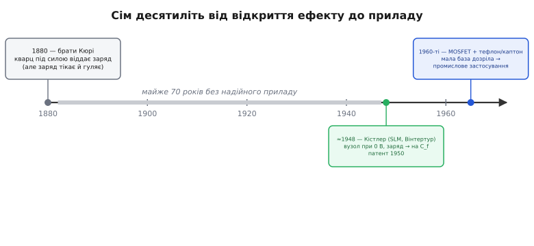

# 📜 Як заряд навчилися читати: Кістлер і п'єзовимірювання

П'єзоелектрику відкрили 1880 року — і майже сімдесят років вона лишалася лабораторною дивиною, з якої не вдавалося зробити надійного приладу. Не тому, що ефект був слабкий чи незрозумілий: брати П'єр і Жак Кюрі (Pierre, Jacques Curie) ще тоді показали, що стиснутий кварц виштовхує на свої грані заряд, пропорційний до сили. Проблема була в іншому, прозаїчнішому й тому особливо впертому — **цей заряд не вдавалося прочитати, не зіпсувавши**. Історія зарядового підсилювача — це історія про те, як один швейцарський фізик наприкінці 1940-х нарешті знайшов спосіб зчитати крихітну порцію кварцового заряду чесно, і тим самим перетворив наукову цікавинку на цілу галузь вимірювальної техніки.

## Що насправді бентежило: заряд, який тікає й гуляє

Щоб відчути масштаб проблеми, треба уявити, з чим мали справу. Кварцова пластинка під ударом сили віддає заряд порядку пікокулонів — мільярдні частки мікрокулона, жменьку електронів. Сама пластинка при цьому поводиться як крихітний конденсатор. І тут на експериментатора 1930-х навалювалися одразу дві біди, кожна з яких сама по собі вбивала вимірювання.

Перша — **заряд тікав**. Будь-який реальний ізолятор трохи проводить: волога на поверхні кварцу, недосконалий діелектрик кабелю, вхідний опір приладу. Для звичайного сигналу ці витоки несуттєві, але для жменьки електронів на високоомному вузлі вони згубні: заряд стікав за частки секунди, ще до того, як стрілка встигала ворухнутися. Виміряти статичну силу п'єзодавачем було просто неможливо — заряд випаровувався в руках.

Друга — **покази гуляли від проводки**. Напруга, яку давав кварц, дорівнювала його заряду, поділеному на сумарну ємність усього, що висіло на тому вузлі: самої пластинки **плюс кабелю** до приладу. А ємність кабелю — це десятки пікофарад на кожен метр. Замінив метровий провід на трьохметровий — і той самий удар по давачу дав утричі меншу напругу. Зігнув кабель, нагрів його, поворушив — ємність попливла, а з нею попливла й чутливість. Людина думала, що міряє силу, а насправді міряла ще й те, як сьогодні лежить дріт.

> 🔧 **Навіщо це.** Обидві біди — це не історична екзотика, а той самий фізичний бар'єр, об який і досі розбився б кожен, хто спробував би причепити п'єзодавач прямо до вольтметра. Розуміючи, *що* саме бентежило Кюрі та їхніх наступників, ви розумієте, навіщо взагалі існує зарядовий підсилювач: він прицільно знімає рівно ці дві проблеми — стікання заряду й залежність від ємності кабелю.

Інструмент тієї епохи — **електрометр** (гр. *ḗlektron* — бурштин, + *métron* — міра), а згодом ламповий електрометр на спеціальній лампі з мізерним сітковим струмом — міг виміряти струми аж до 10⁻¹⁵ ампера, тобто лічені тисячі електронів за секунду. Звучить достатньо. Але ламповий електрометр був приладом **прямого підсилення напруги**: він мав власний дрейф, був вередливий, потребував надчистої ізоляції на вході й однаково не рятував від ємності кабелю. Кварц і електрометр поряд існували, та зробити з них **промисловий** давач, який можна повісити на двигун за кілька метрів від приладу й довіряти його показам, не виходило. Бракувало однієї ідеї.

## Вальтер Кістлер і лабораторія в локомотивному заводі

Цю ідею вніс **Вальтер Кістлер** (нім. *Walter P. Kistler*, 1918–2015) — швейцарський фізик, народжений у Білі (нім. *Biel*, фр. *Bienne*) у двомовному кантоні Берн. Природничі науки він студіював в Університеті Женеви, а ступінь магістра з фізики здобув у Вищій технічній школі Цюриха (нім. *ETH Zürich*) — тій самій, де колись навчався Айнштайн. Швейцарець за громадянством і походженням — це усталений факт, у джерелах сумнівів немає.

1944 року, маючи двадцять шість років, Кістлер прийшов працювати на **Швейцарський локомотиво- і машинобудівний завод** (нім. *Schweizerische Lokomotiv- und Maschinenfabrik*, скорочено SLM) у Вінтертурі — велике підприємство, засноване ще 1871 року, що будувало паротяги й гірські зубчасті локомотиви для альпійських залізниць. Згодом він очолив у заводі **лабораторію вимірювальних приладів** (англ. *Instrumentation Lab*). Місце промовисте: тут вимірювали тиск у циліндрах двигунів, сили й вібрації в металі — рівно ті задачі, де п'єзоелектричний кварц обіцяв надзвичайну швидкодію й точність, якби тільки вдалося надійно зчитати його заряд.

Саме в цій лабораторії, **близько 1948 року**, Кістлер придумав схему, яку ми тепер звемо зарядовим підсилювачем. Патент на принцип він отримав **1950 року**. Тут варто бути чесним зі статусом доказовості: дата патенту — 1950-й — наводиться в джерелах твердо й узгоджено, а от «1948» як рік винаходу трапляється переважно в біографічних довідках і трохи плаває (винахід цілком міг визрівати кілька років до подання заявки). Тому коректно казати так: **задумано наприкінці 1940-х (близько 1948), запатентовано 1950-го** — без удаваної точності до місяця.

## У чому полягав здогад: тримати вузол при нулі

Геній Кістлерового ходу — у тому, що він перестав боротися з ємністю кабелю й стіканням заряду поодинці, а **усунув першопричину обох бід одним прийомом**. Замість того, щоб дати кварцовому заряду осісти на вузлі й тоді ловити напругу (а вона гуляє від усіх ємностей і тікає крізь усі витоки), він поставив на вході підсилювач із негативним зворотним зв'язком через **конденсатор** і змусив його тримати вхідний вузол **силоміць при нулі вольтів**.

Наслідок виходить майже фокусницький. Якщо вузол давача завжди при нулі, то ємність кабелю, яка висить між цим вузлом і землею, опиняється **між нулем і нулем** — на ній немає різниці потенціалів, вона не набирає заряду й узагалі випадає з гри. Довжина кабелю більше нічого не важить. А заряд, який кварц виштовхує, не може ні осісти на вузлі (його там не пускають рости), ні розтектися: єдиний шлях для нього — на той самий зворотний конденсатор. Скільки заряду давач уганяє — стільки лягає на відомий конденсатор, і вся вихідна напруга народжується **тільки** на ньому, за формулою, у яку ні кабель, ні власна ємність кварцу не входять. Те, що тридцять років губило вимірювання, просто зникло з рівняння.

Цю серцевину — віртуальну землю, баланс заряду й вихід, що залежить лише від одного конденсатора, — докладно розбирає сама стаття [зарядовий підсилювач](topic:electronics/charge-amplifier). Тут важливе інше: **який саме біль** ця ідея зняла. Не «підсилити слабкий сигнал» (це вміла й лампа), а зробити так, щоб результат не залежав ні від проводки, ні від витоків, — рівно ті дві біди, через які п'єзоелектрика сімдесят років не йшла в прилади.

*Сім десятиліть між відкриттям ефекту й практичним приладом. Кварц під силою віддавав заряд уже 1880-го, але заряд тікав і покази гуляли від кабелю. Здогад Кістлера наприкінці 1940-х (патент 1950) зняв обидві біди; широке промислове застосування прийшло у 1960-х, коли підросла елементна база.*

## Чому «вистрілило» аж у 1960-х

Цікава деталь, яку легко проґавити: запатентувавши принцип 1950 року, Кістлер **не одразу** перевернув галузь. Широкого практичного значення зарядовий підсилювач набув лише у 1960-х. Причина не в ідеї, а в **елементній базі**. Сама схема вимагає на вході активного елемента з украй малим власним струмом (інакше він сам заряджає зворотний конденсатор і вихід «вповзає» в насичення) і дуже чистої, високоомної ізоляції навколо вхідного вузла. У 1950-х це означало вередливі електрометричні лампи; по-справжньому зручним усе стало, коли підросли два сусідні напрямки техніки: **польові транзистори** (англ. *MOSFET*) з мізерним вхідним струмом і **надякісні ізоляційні матеріали** — тефлон і каптон, що тримали заряд, не даючи йому стікати. Тільки тоді зарядовий підсилювач із лабораторної схеми перетворився на буденний вхідний каскад приладу.

Це типова й повчальна риса історії техніки: **правильна ідея випереджає матеріали, на яких вона зможе ожити**. Кістлерів принцип не змінився від 1950 року до сьогодні — змінилося лише те, на чому його стало вигідно будувати.

## Що було далі з Кістлером

Свою схему Кістлер привіз із собою за океан. 1951 року він переїхав до США й працював у компанії Bell Aircraft у Баффало (штат Нью-Йорк), де далі вдосконалював точні вимірювальні прилади — зокрема серво-акселерометр, що згодом служив у наведенні ракети-носія «Аджена» (англ. *Agena*). 1954 року він заснував власну **Kistler Instrument Company**, аби довести до промисловості кварцову вимірювальну техніку; деякі її прилади працювали в програмі «Аполлон». До кінця життя Кістлер тримав патенти на понад п'ятдесят винаходів у галузі науково-промислового приладобудування.

Але саме той перший, наприкінці 1940-х, лишився найважливішим: без перетворювача заряду на напругу всі п'єзоелектричні акселерометри, давачі сили й тиску, гідрофони й давачі акустичної емісії так і лишилися б лабораторною дивиною Кюрі. Кістлер не відкрив п'єзоефект і не винайшов операційний підсилювач — він зробив тихішу, але вирішальну річ: **знайшов, як прочитати кварцовий заряд так, щоб число не залежало від проводки й не тікало крізь витоки**. І відтоді в самій ідеї міняти, по суті, нічого не довелося.
