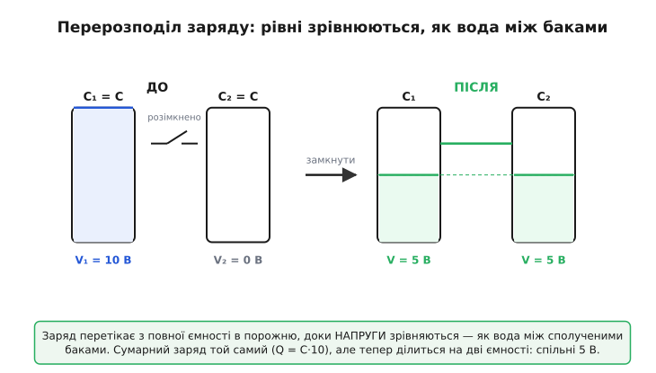
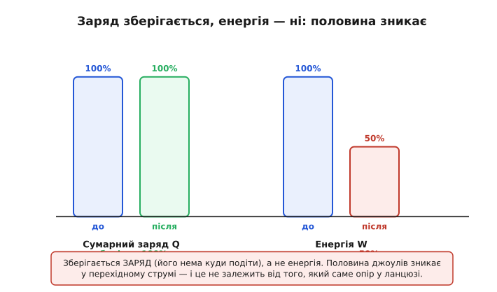
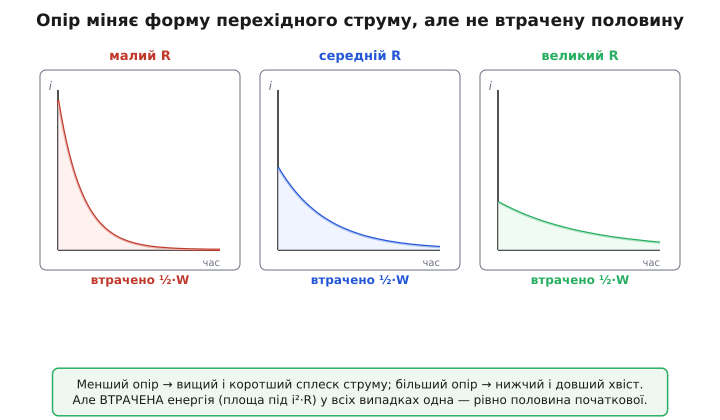
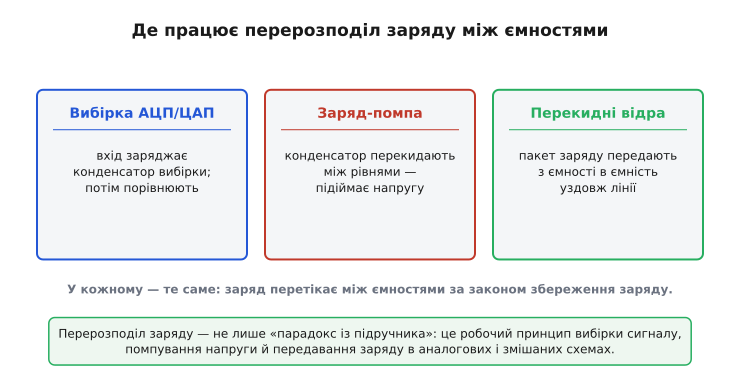

# Перерозподіл заряду між ємностями

З'єднайте два конденсатори — заряджений і порожній — і заряд почне перетікати з одного в другий, доки на обох не встановиться **спільна напруга**. Звучить просто, майже нудно. Але варто порахувати енергію до й після, як випливає річ, що збиває з ніг кожного, хто бачить її вперше: **половина енергії зникла**. Не «трохи розсіялось», а рівно половина — і, що геть дивно, **байдуже, який опір у дроті**. Хоч надпровідник, хоч іржавий цвях між обкладками — втрата та сама.

Це не математична помилка й не парадокс у строгому сенсі. Це вікно в те, як насправді поводиться заряд у колах із кількома ємностями — і саме цей механізм лежить в основі вибірки сигналу в АЦП, помп напруги й цілого класу схем на перемикуваних конденсаторах. Розберімося, **чому** напруги зрівнюються, **чому саме спільна напруга**, а не спільний заряд порівну, і куди дівається та половина джоулів.

### Чому взагалі щось перетікає

Конденсатор тримає заряд, бо між його обкладками — різниця потенціалів. Напруга на ньому — це міра «тиску» накопиченого заряду: що більше заряду на пластинах, то вища напруга, і зв'язок прямий — [Q = C·V](book:electronics/capacitance), де C — ємність, стала геометрії конденсатора.

Тепер уявіть два конденсатори, з'єднані дротом, але з **різними** напругами: один заряджений до 10 В, другий порожній, 0 В. Дріт — це шлях для заряду, а різниця потенціалів на його кінцях — це сила, що жене заряд. Поки напруги різні, у колі є **рушій**: заряд штовхається з вищого потенціалу до нижчого, точно як вода тече з вищого бака в нижчий, поки рівні різні. Струм тектиме доти, доки різниця напруг не впаде до нуля — а нуль різниці означає, що на обох конденсаторах напруга **однакова**.

> 🔧 **Навіщо це.** Та сама логіка пояснює, чому не можна просто паралелити два заряджені до різних напруг конденсатори в схемі (наприклад, два блоки живлення через спільну шину): у мить з'єднання між ними пробігає величезний короткий струм, що вирівнює напруги. Цей кидок струму псує контакти, наводить завади й може пробити доріжку. Розуміння перерозподілу — це розуміння, чому між такими вузлами ставлять резистор або керований ключ, а не голий дріт.

Ось перша інтуїція: **зрівнюється напруга, а не заряд**. Заряд розподілиться нерівно, якщо ємності різні — більша ємність при тій самій напрузі тримає більше заряду. Спільне в кінці — саме напруга, бо саме різниця напруг була тим, що гнало струм, і зникнення цієї різниці — умова зупинки.


*Заряд перетікає з повної ємності в порожню, доки напруги зрівняються — як вода між сполученими баками. Сумарний заряд той самий, але тепер ділиться на дві ємності, тож спільна напруга — посередині.*

### Куди стає заряд: закон збереження

Куди дівається заряд під час перетікання? Нікуди не зникає й нізвідки не береться — **сумарний заряд зберігається**. Заряд не можна знищити чи створити з нічого; його можна лише перемістити. Усе, що пішло з однієї обкладки, прийшло на іншу. Це прямий наслідок [закону збереження заряду у вузлі](book:electronics/kcl): скільки заряду втекло звідкись, стільки прибуло деінде.

Саме збереження заряду — а не якесь «збереження енергії» — дає нам рівняння для фінальної напруги. Запишемо. Початковий заряд сидить лише на першому конденсаторі:

```
Q_поч = C₁ · V₁ + C₂ · V₂
```

Після з'єднання обидва мають одну спільну напругу V_спіл, але заряд тепер розподілений по обох:

```
Q_кін = C₁ · V_спіл + C₂ · V_спіл = (C₁ + C₂) · V_спіл
```

Заряд зберігся, тож Q_поч = Q_кін. Прирівнюємо й виражаємо спільну напругу:

```
V_спіл = (C₁·V₁ + C₂·V₂) / (C₁ + C₂)
```

Це **зважене середнє** початкових напруг, де вагами є самі ємності. Більша ємність «перетягує» спільну напругу ближче до своєї — логічно, бо вона тримає більше заряду й диктує умови. Якщо ємності рівні (C₁ = C₂ = C), формула спрощується до простого середнього:

```
V_спіл = (V₁ + V₂) / 2
```

**Умова: конденсатор C = 100 мкФ заряджений до 10 В з'єднують із порожнім таким самим C = 100 мкФ.**

```
V_спіл = (100µ·10 + 100µ·0) / (100µ + 100µ)
       = (1000µ + 0) / 200µ
       = 1000µ / 200µ
       = 5 В
```

Заряд, що сидів на одному конденсаторі під 10 В, тепер розподілився на дві однакові ємності — і напруга на кожному впала до половини, 5 В. Заряд цілий: спершу Q = 100µ·10 = 1 мКл, після — 200µ·5 = 1 мКл. Усе зійшлося.

У прошивці таку оцінку роблять, наприклад, прикидаючи, до якої напруги «просяде» накопичувальний конденсатор, коли його під'єднають до більшої розрядженої ємності:

```c
// Спільна напруга двох ємностей після з'єднання (закон збереження заряду).
// C у фарадах, V у вольтах.
float shared_voltage(float c1, float v1, float c2, float v2) {
    return (c1 * v1 + c2 * v2) / (c1 + c2);
}

// Приклад: накопичувач 100 мкФ@10 В на порожній буфер 100 мкФ
float v = shared_voltage(100e-6f, 10.0f, 100e-6f, 0.0f);   // = 5.0 В
```

### Зникла половина: рахуємо джоулі

Тепер — головне диво. Порахуймо **енергію** до й після. Енергія в конденсаторі — це [½·C·V²](book:electronics/capacitor-energy): половина добутку ємності на квадрат напруги. Множник ½ і квадрат тут вирішують усе.

**До з'єднання** заряджений лише перший конденсатор (беремо C₁ = C₂ = C, V₁ = 10 В, V₂ = 0):

```
W_поч = ½·C·V₁²  +  ½·C·0²
      = ½·C·(10)²
      = ½·C·100
      = 50·C   Дж
```

**Після з'єднання** обидва під спільною напругою V_спіл = 5 В:

```
W_кін = ½·C·(5)²  +  ½·C·(5)²
      = ½·C·25 + ½·C·25
      = 25·C
```

Порівнюємо:

```
W_кін / W_поч = 25·C / 50·C = 0.5
```

Лишилась **рівно половина**. Половина енергії зникла, хоча жодного заряду ми не загубили. Звідки розрив? Бо енергія залежить від напруги **квадратично**, а заряд — лінійно. Заряд просто поділився навпіл за рівнями (по 5 В на кожному), а от енергія кожної половинки впала в **чотири** рази (бо 5² проти 10² — це вчетверо менше), і дві такі чверті дають разом половину. Квадрат — ось чому збереження заряду не тягне за собою збереження енергії.


*Зберігається саме заряд — його нема куди подіти. Енергія ж залежить від квадрата напруги, тож, коли напруга падає вдвічі, енергія кожної ємності падає вчетверо: разом лишається половина.*

### Куди ділась енергія — і чому опір тут ні до чого

Енергія не зникає по-справжньому — закон збереження енергії ніхто не скасовував. Вона **розсіюється в перехідному струмі**. У мить з'єднання різниця напруг 10 В прикладена до дроту, і крізь нього пробігає короткий, але потужний імпульс струму, що переносить заряд із одного конденсатора в другий. Цей струм тече крізь опір дроту й перетворює половину початкової енергії на тепло.

І ось найдивовижніше, що й робить цю задачу класичною: **частка втраченої енергії не залежить від величини опору**. Поставте малий опір — струм буде величезний і дуже короткий; поставте великий — струм буде кволий і довгий. Але **втрачені джоулі однакові** в обох випадках, рівно половина. Опір керує *формою* перехідного процесу (наскільки високий пік струму, як довго він триває), та не його *підсумком*. Підсумок задано лише початковим і кінцевим станом ємностей, а він від опору не залежить.


*Менший опір дає вищий і коротший сплеск струму, більший — нижчий і довший хвіст. Та повна розсіяна енергія (площа під добутком i²·R за весь час) у всіх випадках одна — рівно половина початкової.*

Чому так? Бо повне тепло — це інтеграл i²·R за весь час перехідного процесу. Зменшите R удвічі — струм у кожну мить стане більший (приблизно вдвічі), але триватиме рівно вдвічі коротше. У добутку i²·R один множник падає (R), інший росте (i² — учетверо), а час стискається — і все це точно компенсується так, що інтеграл лишається сталим. Алгебру цього взаємознищення — як перехідний струм спадає за експонентою і чому площа під i²·R виходить незмінною — детально розписано у [виведенні через перехідний процес RC-кола](book:electronics/charge-redistribution/math-rc-transient-loss.md).

А якщо опору **немає зовсім** — ідеальний надпровідний дріт? Тоді задача стає по-справжньому цікавою. Втрачена половина нікуди не дівається й тут: енергію забирає **електромагнітне випромінювання**. Контур із нульовим опором, але ненульовою індуктивністю дроту, починає коливатися — заряд перехлюпується туди-сюди, як маятник, — і ці коливання струму випромінюють радіохвилі, поки не згасять рівно ту саму половину енергії. Тобто [навіть у межі нульового опору половина зникає неминуче](book:electronics/charge-redistribution/hist-two-capacitor-paradox.md) — змінюється тільки *механізм* (тепло чи випромінювання), але не *частка*. Цей результат добре встановлений у літературі з теорії кіл.

Звідси практичний висновок, що шокує новачків у силовій електроніці: **перекладати заряд із конденсатора в конденсатор напряму — енергетично марнотратно**. Хоч би які чисті ваші дроти, ви втрачаєте до половини на самому перенесенні. Саме тому помпи напруги й перетворювачі, де треба зберегти ефективність, **не** просто паралелять ємності, а додають [котушку індуктивності](book:electronics/inductance), що накопичує енергію в проміжку й віддає її без цієї половинної данини — або переносять заряд малими порціями за дуже малої різниці напруг, де втрата мізерна.

### Те саме з кількома ємностями

Двома конденсаторами картина не вичерпується. З'єднайте паралельно скільки завгодно ємностей із різними напругами — і та сама логіка дає спільну напругу як зважене середнє по **всіх** них. Закон збереження заряду незмінний: сума всіх початкових зарядів дорівнює сумі кінцевих, а кінцеві всі під однією напругою:

```
V_спіл = (C₁·V₁ + C₂·V₂ + … + Cₙ·Vₙ) / (C₁ + C₂ + … + Cₙ)
```

Чим більша ємність, тим сильніше вона «тягне» спільну напругу до свого значення — найбільший «бак» диктує рівень. Якщо одна з ємностей **набагато** більша за решту (скажімо, велика буферна ємність проти крихітного конденсатора вибірки), спільна напруга практично дорівнюватиме напрузі цього великого конденсатора: дрібний майже не зрушить великий. Це й використовують, коли треба «зчитати» напругу великої ємності маленьким пробником, не збуривши її.

### Де це працює: перерозподіл як інструмент

Перерозподіл заряду — далеко не лише курйоз із підручника. Це **робочий принцип** цілого пласту аналогових і змішаних схем, де заряд свідомо ганяють між ємностями, щоб дістати корисний результат.


*Вибірка сигналу, помпування напруги, передавання заряду вздовж лінії — у кожному випадку працює один і той самий механізм: керований перерозподіл заряду між ємностями за законом його збереження.*

**Вибірка сигналу** в аналого-цифрових і цифро-аналогових перетворювачах. У поширеному типі АЦП — на перерозподілі заряду (саме так він і зветься) — вхідну напругу спершу «запам'ятовують», зарядивши нею конденсатор вибірки, а потім крок за кроком перерозподіляють цей заряд між набором двійково зважених ємностей, порівнюючи на кожному кроці. Уся логіка перетворення — це послідовність керованих перерозподілів заряду. Те саме у схемі [вибірки-зберігання](book:electronics/charge-redistribution/comp-switched-capacitor.md): ключ на мить з'єднує вхід із конденсатором, заряд перетікає, ключ розмикається — і конденсатор тримає «знімок» напруги, поки його оцифровують. Скільки саме тактів тримати ключ вибірки замкненим, щоб конденсатор устиг набрати заряд до потрібної точності, рахують із RC-сталої вхідного кола — [покроковий розрахунок часу вибірки з кодом для прошивки](book:electronics/charge-redistribution/proj-switched-capacitor.md); а як такий вузол пінується й розводиться на платі, зібрано окремо — [типова цоколівка й обв'язка вузла SC/вибірки-зберігання](book:electronics/charge-redistribution/api-switched-capacitor.md).

**Помпи напруги** (заряд-помпи). Щоб дістати напругу, вищу за живлення, конденсатор заряджають від джерела, а тоді «перекидають» його ключами так, щоб він додався послідовно до іншого, — і напруги складаються. По суті це той самий перерозподіл заряду, тільки організований у такт, щоб напруга накопичувалась, а не вирівнювалась. Деталі такого помпування — окрема тема: [заряд-помпа](book:electronics/charge-pump).

**Схеми на перемикуваних конденсаторах** (switched-capacitor). Якщо конденсатор швидко перемикати між двома вузлами, переносячи за кожен такт порцію заряду, то в середньому він **поводиться як резистор**: чим швидше перемикання, тим більший «струм» переносу за тих самих напруг, тобто тим менший еквівалентний опір. На цьому будують фільтри й підсилювачі, де роль резисторів грають ємності та ключі — зручно для інтегральних схем, де точний конденсатор зробити легше, ніж точний резистор. Цей клас схем спирається саме на кероване перетікання заряду між ємностями.

У всіх трьох випадках працює одне й те саме, що ми розібрали на двох конденсаторах: заряд перетікає між ємностями, зберігаючись у сумі, а напруги перерозподіляються за ємностями. Різниця лише в тому, що тут перетікання не пускають на самоплив до простого вирівнювання, а **керують** ним ключами в потрібний момент — і з безневинного «парадокса про зниклу енергію» виходить точний інструмент обробки сигналу.
