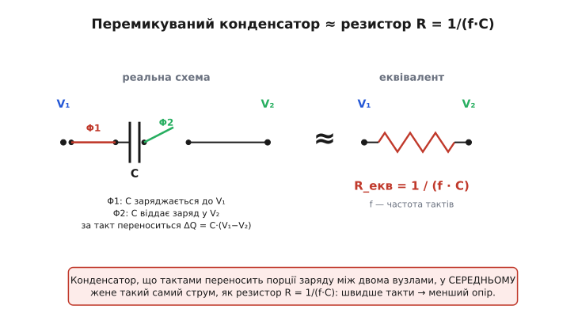
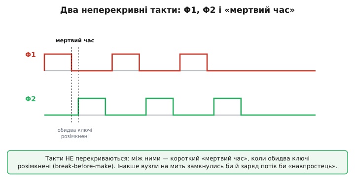
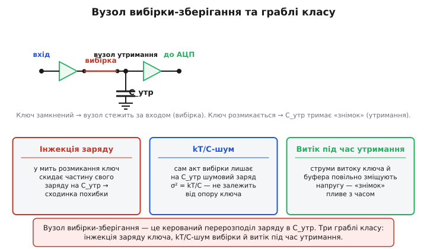

# 🔌 Схеми на перемикуваних конденсаторах і вузол вибірки-зберігання

Є один трюк, що його варто зрозуміти раз — і він відмикає цілий поверх аналогової техніки. Трюк такий: **конденсатор, який швидко перемикають туди-сюди, поводиться як резистор.** Не «схожий на резистор», не «приблизно як резистор у певному режимі» — а в усередненому сенсі *є* резистором, з опором, який ви задаєте частотою такту. Звучить як фокус, але за ним немає нічого, крім того самого перерозподілу заряду між ємностями: ключ під'єднує конденсатор до одного вузла, заряд перетікає; ключ перекидає його до іншого вузла, заряд перетікає назад; повторити багато разів за секунду. Кожне таке перетікання — порція заряду, а порція заряду за одиницю часу — це і є струм.

Цей клас схем (англ. *switched-capacitor*, скорочено SC — «перемикуваний конденсатор») — узагальнений, не якась конкретна мікросхема з партномером. Він живе всередині сигма-дельта АЦП, активних фільтрів, програмованих підсилювачів, опорних джерел, помп напруги. Усюди, де треба точно дозувати заряд або зробити «резистор», якого складно виготовити в кремнії, інженер ставить ключ і конденсатор замість резистора. А базовий, найпростіший представник цього класу — **вузол вибірки-зберігання** (англ. *sample-and-hold*, S/H): один ключ, один конденсатор, що на мить «запам'ятовує» напругу. З нього й почнемо будувати інтуїцію, бо все інше — це той самий вузол, тільки повторений і організований у такт.

> 🔧 **Навіщо це.** Коли ви читаєте даташит на АЦП і бачите рядок «вхідний імпеданс залежить від частоти вибірки» або «рекомендований зовнішній конденсатор на вході», — за цим стоїть саме SC-вузол. Зрозумівши клас, ви перестаєте боятися таких рядків: ви знаєте, *чому* вхід АЦП «смикає» заряд із вашого джерела пакетами, чому між давачем і входом часто ставлять буфер, і як порахувати, чи встигне ваше джерело перезарядити вхідний конденсатор за відведений час.

## Клас пристрою: «резистор», зроблений із ключа й конденсатора

Почнімо з питання, яке мучило конструкторів інтегральних схем у 1970-х. Активний фільтр чи підсилювач потребує точних резисторів — точніше, точних **відношень** опорів, бо саме відношення задають коефіцієнти підсилення й частоти зрізу. На дискретній платі це не біда: береш резистори з потрібним допуском. Але в кремнії резистор — це смужка легованого матеріалу, і її абсолютний опір «гуляє» на ±20–40 % від партії до партії, від температури, від напруги. Зробити інтегральний резистор із точністю кращою за кілька відсотків майже неможливо.

А от **відношення двох конденсаторів** на одному кристалі тримається з точністю до соті частки відсотка. Конденсатор у кремнії — це площа двох пластин, а площу можна задати геометрією фотошаблону дуже точно; навіть якщо абсолютна ємність попливе, *відношення* двох сусідніх ємностей лишиться майже ідеальним, бо обидві пливуть однаково. Звідси й народилася ідея: а що, як замінити незручний резистор на щось, зроблене з конденсаторів, точність яких ми вміємо тримати?

Відповідь — перемикуваний конденсатор. Уявіть конденсатор C і два ключі. Перший такт: лівий ключ замкнений, конденсатор заряджається до напруги вузла A, тобто V₁. Другий такт: лівий ключ розмикається, правий замикається, і конденсатор віддає свій заряд у вузол B з напругою V₂. За один повний цикл «зарядити від A — віддати в B» з вузла A у вузол B перенеслася порція заряду:

```
ΔQ = C · (V₁ − V₂)
```

Тепер ключі клацають із частотою f — f повних циклів за секунду. Значить, за секунду переноситься заряд f·ΔQ, а перенесений заряд за час — це усереднений струм:

```
I_сер = f · ΔQ = f · C · (V₁ − V₂)
```

Подивіться на цю формулу очима людини, що знає закон Ома. Струм пропорційний різниці напруг, а коефіцієнт пропорційності — f·C. Але ж I = (V₁ − V₂)/R — це і є закон Ома, якщо

```
R_екв = (V₁ − V₂) / I_сер = 1 / (f · C)
```

Ось воно. **Перемикуваний конденсатор у середньому еквівалентний резистору з опором R_екв = 1/(f·C).** Хочете менший опір — пускайте такт швидше. Хочете точне *відношення* двох «резисторів» — зробіть його відношенням двох ємностей (бо R₁/R₂ = (1/f·C₁)/(1/f·C₂) = C₂/C₁ — частота скоротилась, лишилося відношення ємностей, яке кремній тримає прекрасно). Саме тому SC-техніка завоювала інтегральну аналогову схемотехніку: вона міняє те, що в кремнії робиться погано (точний резистор), на те, що робиться добре (точне відношення ємностей плюс цифровий такт).


*Зліва — реальна схема: два ключі й конденсатор. На такті Φ1 конденсатор заряджається до V₁, на Φ2 віддає заряд у V₂; за повний цикл переноситься ΔQ = C·(V₁−V₂). Праворуч — еквівалент: усереднений струм такий самий, як крізь резистор R = 1/(f·C). Швидші такти означають менший опір.*

Варто одразу окреслити, де аналогія **ламається**, бо точні аналогії корисні лише разом зі своїми межами. Перемикуваний конденсатор — це резистор **тільки в усередненому, дискретному сенсі**: заряд переноситься не плавним струмом, а порціями, поштовхами в ритмі такту. Між тактами струму немає взагалі. Тому SC-«резистор» працює як резистор лише для сигналів, набагато повільніших за частоту такту: якщо сигнал змінюється так само швидко, як клацають ключі, усереднення розвалюється й починаються ефекти дискретизації (накладання спектрів, англ. *aliasing*). Класичне правило: частота такту має бути в багато разів вищою за найвищу частоту сигналу. Поки воно виконане — конденсатор-«резистор» чесний.

> 🔧 **Навіщо це.** Та сама природа «резистора пакетами» пояснює, чому вхід багатьох АЦП не можна живити з джерела з високим вихідним опором без буфера. Вхідний конденсатор АЦП на кожному такті вибірки відкушує від вашого джерела порцію заряду, і джерело мусить встигнути її поповнити за час такту. Слабке джерело (давач із кілоомним виходом) просто не встигне дозарядити конденсатор — і ви отримаєте систематичну похибку, що росте з частотою вибірки. Звідси буфер (операційний підсилювач-повторювач) між давачем і входом АЦП. Що таке операційний підсилювач і чому з нього роблять повторювач напруги — коротко: [це підсилювач різниці з величезним коефіцієнтом, охоплений від'ємним зворотним зв'язком так, що вихід точно повторює вхід при майже нульовому вхідному струмі](book:electronics/opamp).

## Блок-схема: два неперекривні такти й конденсатор вибірки

Серце будь-якої SC-схеми — **дві фази такту, що ніколи не перекриваються**, і конденсатор, який між ними перевозить заряд. Назвемо фази Φ1 і Φ2 (від грецької phásis — поява, фаза). У першій фазі замкнений один набір ключів, у другій — інший, і — це принципово — **між фазами є короткий проміжок, коли розімкнені всі ключі**. Цей проміжок зветься «мертвим часом», а сам принцип — *break-before-make*, «розімкни перш ніж замкнути».

Чому не можна без мертвого часу? Уявіть, що Φ1 ще не до кінця розімкнувся, а Φ2 уже почав замикатися. На цю коротку мить обидва ключі провідні — і вузол A напряму з'єднаний із вузлом B крізь конденсатор і два відкриті ключі. Заряд потече «навпростець», не дозованою порцією, а неконтрольованим сплеском, і весь точний баланс заряду, на якому тримається схема, зруйнується. Мертвий час гарантує, що конденсатор завжди під'єднаний **або** до A, **або** до B, **ніколи до обох**. Він возить заряд як відро: набрав з одного бака, *відірвався*, переніс, вилив у другий. Відро, що торкається обох баків одночасно, — це вже не дозування, а просто діра між баками.


*Фази такту не перекриваються: між спадом однієї та наростанням іншої лишається короткий «мертвий час», коли розімкнені всі ключі. Це принцип break-before-make. Без нього вузли на мить замкнулися б навпростець і дозована порція заряду перетворилася б на неконтрольований сплеск.*

Ключі в кремнії — це польові транзистори (найчастіше [МОН-транзистор у режимі ключа](book:electronics/mosfet-switch): подаєш на затвор напругу — канал відкривається, прибираєш — закривається). Фази Φ1 і Φ2 — це просто два цифрові сигнали з генератора неперекривного такту, який легко зробити з пари логічних вентилів. Тобто аналогова точність схеми керується **цифровим** тактом, і це ще одна причина любити SC: цифру в кремнії робити легко й дешево, а тут вона диригує аналоговим зарядом.

Конденсатор, що возить заряд, залежно від ролі зветься по-різному: **конденсатор вибірки** (sampling capacitor), коли він запам'ятовує вхідну напругу; **конденсатор переносу** (flying capacitor — «летючий», бо він ніби «літає» між вузлами), коли він просто перевозить порцію заряду в помпі чи фільтрі; **конденсатор інтегрування**, коли заряд на ньому накопичується циклами. Фізика одна — конденсатор, що тактами міняє підключення; назви відбивають лише задачу.

## Найпростіший представник: вузол вибірки-зберігання

Тепер зведімо клас до його атома. Заберіть з SC-схеми все зайве, лишіть один ключ і один конденсатор на землю — і отримаєте вузол вибірки-зберігання. Його робота — **зловити миттєве значення напруги й тримати його незмінним**, поки хтось (зазвичай АЦП) встигає це значення виміряти. Без такого «фотознімка» оцифрувати швидкий сигнал неможливо: поки перетворювач крок за кроком зважує напругу, вона б уже втекла, і результат був би розмазаний.

Працює вузол у двох станах, точно за логікою двох фаз:

**Вибірка (track / sample).** Ключ замкнений. Конденсатор C_утр під'єднаний до входу й заряджається до вхідної напруги — точніше, *стежить* за нею: поки ключ замкнений, напруга на конденсаторі повторює вхід із невеликим запізненням (його задає стала часу — добуток опору відкритого ключа на ємність). У цій фазі вузол «дивиться» на сигнал.

**Утримання (hold).** Ключ розмикається. Конденсатор відрізаний від входу й тримає той заряд, який був на ньому в мить розмикання. Напруга «застигає» — це і є знімок. Тепер скільки б не смикався вхід, на конденсаторі стоїть зафіксоване значення, і АЦП спокійно його оцифровує.

Щоб знятий заряд не витікав крізь те, що вимірює напругу, після конденсатора ставлять **буфер із дуже високим вхідним опором** — повторювач напруги, який «зчитує» напругу на C_утр, майже не відбираючи з нього струму. Часто й до конденсатора, на вхід, ставлять буфер — щоб під час фази вибірки джерело сигналу могло швидко зарядити конденсатор, не просівши саме. Виходить ланцюжок: джерело → вхідний буфер → ключ → конденсатор утримання → вихідний буфер → АЦП.


*Угорі — структура: вхідний буфер, ключ вибірки, конденсатор утримання C_утр на землю, вихідний буфер до АЦП. Замкнений ключ — вузол стежить за входом; розімкнений — C_утр тримає знімок. Унизу — три типові граблі: інжекція заряду ключа, kT/C-шум вибірки й витік під час утримання.*

Це і є той самий перерозподіл заряду, тільки керований: ми свідомо обираємо мить, коли «заморозити» заряд на конденсаторі. Уся премудрість вузла — не дати цьому замороженому заряду спотворитися між тим, як ми його зловили, і тим, як його виміряли. Тут і починаються граблі класу.

## Типові граблі класу

Цей клас схем має набір характерних слабких місць, спільних для всіх реалізацій — від дискретного вузла на платі до SC-секції в АЦП. Знаючи їх, ви впізнаєте їх у будь-якій схемі.

**Інжекція заряду ключа (charge injection).** Польовий транзистор-ключ — це не ідеальний контакт. Поки він відкритий, у його каналі сидить рухомий заряд, а на ємності «затвор-канал» — ще трохи. У мить, коли ви розмикаєте ключ (фіксуєте знімок), цей заряд мусить кудись подітися — і частина його стрибає просто на конденсатор утримання. Результат — невелика **сходинка** напруги в момент захоплення (англ. *hold step*, *pedestal*): знятий знімок зміщений на сталу величину. Зміщення тим помітніше, чим менший конденсатор утримання (та сама порція заряду на меншій ємності дає більший стрибок напруги, бо ΔV = ΔQ/C). Борються з цим більшим C_утр, спеціальними «компенсаційними» ключами (англ. *dummy switch*), що вкидають рівний і протилежний заряд, та диференційною побудовою, де однакова інжекція в обидва плеча взаємно віднімається.

**kT/C-шум вибірки.** Це найфундаментальніша й найкрасивіша грабля, бо її не можна обійти схемним трюком — вона випливає просто з фізики тепла. Ключ у відкритому стані — це резистор, а будь-який резистор «шумить»: його носії заряду хаотично смикаються від теплового руху, наводячи на конденсаторі випадкову напругу (це [тепловий, або джонсонівський, шум](book:electronics/resistor-noise) — невпорядкований рух носіїв при ненульовій температурі породжує флуктуації напруги). Коли ви розмикаєте ключ, ви «заморожуєте» не лише корисний сигнал, а й випадкове значення цього шуму — і воно стає частиною знімка. Дивовижне те, **наскільки** воно стає: розкид (дисперсія) захопленої шумової напруги дорівнює

```
σ²_шуму = k · T / C
```

де k — стала Больцмана (1.38·10⁻²³ Дж/К), T — абсолютна температура (К), C — ємність утримання. Подивіться, чого тут **немає**: опору ключа. Зробіть ключ удесятеро «гіршим» (більший опір) — і нічого не зміниться. Чому? Бо більший опір дає більший шум *на одиницю смуги*, але водночас звужує смугу пропускання RC-кола рівно настільки, що добуток лишається сталим — точнісінько як у двоконденсаторному парадоксі, де менший опір не міняв втрачену половину енергії. Природа дала однаковий результат із тих самих міркувань: **шумовий заряд на конденсаторі задано лише ємністю й температурою, не опором.** Єдиний спосіб зменшити kT/C-шум — **збільшити ємність** (або охолодити схему). Звідси нижня межа на малість конденсатора вибірки в точних АЦП: хочете 16 чесних розрядів — конденсатор не може бути крихітним, хоч би як вам хотілося швидкості.

**Умова: оцінити середньоквадратичну шумову напругу вибірки на конденсаторі C = 1 пФ при кімнатній температурі T = 300 К.**

```
σ²  = k·T / C = (1.38·10⁻²³ · 300) / 1·10⁻¹²
    = 4.14·10⁻²¹ / 1·10⁻¹²
    = 4.14·10⁻⁹  В²
σ   = √(4.14·10⁻⁹)
    ≈ 64·10⁻⁶ В  ≈ 64 мкВ (середньоквадратичних)
```

64 мікровольти шуму — на повній шкалі, скажімо, 1 В це межа десь біля 14 чесних розрядів. Хочете більше — беріть більший конденсатор: на 16 пФ шум упаде вчетверо (бо σ ∝ 1/√C), до ~16 мкВ. Це не теоретична причепка — це число, яке прямо стоїть між вами й роздільністю.

**Витік під час утримання (hold-mode droop).** Знятий знімок мав би стояти незмінно — але жоден ключ не вимикається ідеально, і жоден буфер не має нескінченного вхідного опору. Крізь закритий ключ і вхід буфера тече крихітний струм витоку, і він повільно зміщує напругу на конденсаторі: знімок «пливе» (англ. *droop*). Швидкість сповзання — це той самий закон конденсатора: dV/dt = I_витоку / C. Тут більший конденсатор знову допомагає (повільніше пливе), а ще — короткий час утримання (швидше виміряли — менше встигло втекти) і малострумні ключі/буфери. У спеку витік зростає експоненційно — тому в точних вузлах витоком при максимальній робочій температурі цікавляться окремо.

**Затримка апертури й її дрижання (aperture jitter).** Ключ розмикається не миттєво й не точно «коли наказали»: є невелика стала затримка (апертура) і, гірше, її **випадкове коливання** від циклу до циклу (джитер). Для постійного сигналу це байдуже, але для швидкого — фатально: якщо мить захоплення «гуляє» на δt, а сигнал у цей момент має крутість dV/dt, то знятий знімок гуляє на δV = (dV/dt)·δt. На високих частотах це окреме джерело шуму, що обмежує, наскільки швидкий сигнал ви взагалі можете чесно оцифрувати. Звідси вимога до дуже стабільного такту вибірки в швидкісних АЦП.

**Накладання спектрів (aliasing).** SC-вузол за визначенням дискретизує — бере знімки в окремі миті. А дискретизація має залізне обмеження: складники сигналу, вищі за половину частоти вибірки, «складаються» вниз і прикидаються низькочастотними, незворотно псуючи дані. Тому **перед** SC-входом майже завжди стоїть аналоговий згладжувальний фільтр (англ. *anti-aliasing*), що прибирає все вище за половину частоти вибірки ще до того, як його зловить ключ. Забути цей фільтр — класична помилка, через яку у виміри лізе несправжній низькочастотний сигнал, народжений накладанням.

## Варіації класу

З того самого «ключі плюс конденсатор» виросло кілька різних родин — корисно бачити, що це варіації одного мотиву, а не окремі дива.

**SC-інтегратор і SC-фільтр.** Якщо заряд із перемикуваного конденсатора зливати не назад у джерело, а в **інтегрувальний** конденсатор, охоплений операційним підсилювачем, то заряд накопичується циклами — виходить інтегратор, у якому «резистор» зроблено з ключів. А інтегратор — будівельний блок будь-якого активного фільтра. Так роблять SC-фільтри: частота зрізу в них задається не RC-добутком (який у кремнії неточний), а добутком частоти такту на відношення ємностей — тобто керується **цифровим тактом** і тримається з кремнієвою точністю відношень. Перебудувати фільтр стає так само просто, як змінити частоту такту. Саме цей клас і дав поштовх усій техніці: перші працездатні інтегральні SC-фільтри на МОН-структурах з'явилися наприкінці 1970-х (про коротку історію — нижче).

**Конденсаторний ЦАП із перерозподілом заряду.** Якщо взяти набір конденсаторів із ємностями, що подвоюються (C, 2C, 4C, 8C…), і вмикати їх ключами до опорної напруги за бітами числа, заряд перерозподіляється так, що на спільному вузлі виходить напруга, пропорційна цьому числу, — це цифро-аналоговий перетворювач на перемикуваних конденсаторах. Він же — ядро АЦП послідовного наближення: перетворювач крок за кроком «зважує» вхідний заряд проти двійково-зважених ємностей. Уся логіка такого [перетворення аналог-у-цифру](book:electronics/adc) — це послідовність керованих перерозподілів заряду між цими ємностями.

**Заряд-помпа.** Якщо перемикуваний конденсатор не зрівнювати з вузлом, а **перекидати** його ключами так, щоб він додавався послідовно до іншого джерела, напруги складаються — і на виході можна отримати більше за живлення (або від'ємну напругу). Це той самий перенос заряду, тільки організований не на вирівнювання, а на накопичення. Деталі такого помпування — окрема тема: [заряд-помпа](book:electronics/charge-pump).

**Кореляційна подвійна вибірка (CDS).** Тонкий, але вартий згадки прийом: щоб прибрати інжекцію заряду й повільні дрейфи, роблять **два** знімки — один із корисним сигналом, другий «порожній» (опорний) — і віднімають. Спільне зміщення (інжекція, дрейф буфера, низькочастотний шум) у різниці взаємно знищується, лишається чистий сигнал. Цей трюк — основа малошумних давачів зображення й точних SC-підсилювачів; він показує, як саму ваду класу (інжекцію) обертають на керовану, віднімну величину.

## Коротка історія: від Максвелла до кремнію

Ідея, що перемикуваний конденсатор еквівалентний резистору, набагато старша за інтегральні схеми. Її описав ще **Джеймс Клерк Максвелл** (шотландський фізик, той самий, чиї рівняння описують усю класичну електромагнетику) у трактаті з електрики й магнетизму близько 1873 року — як спостереження теорії кіл, без жодної гадки про майбутні застосування. Це усталений факт із історії техніки: зв'язок R = 1/(f·C) лежав «на полиці» майже сторіччя.

Практичним його зробила кремнієва технологія. Поштовх дала проблема, з якої ми почали: інтегральні резистори неточні, а відношення інтегральних конденсаторів — точні. Наприкінці 1970-х кілька груп майже одночасно показали перші працездатні **інтегральні SC-фільтри на МОН-структурах**. Два ключові звіти вийшли в грудні 1977 року в журналі IEEE з твердотільних схем: одна група — Дж. Кейвз, М. Коуплендта співавтори (Reticon / Карлтонський університет), друга — Б. Гостіцка, Р. Бродерсен і П. Ґрей (Каліфорнійський університет у Берклі); услід, 1978-го, з'явилися SC-фільтри-драбинки (Д. Оллстот, Р. Бродерсен, П. Ґрей). Це класичний приклад **колективного, майже паралельного** винаходу: ідея давня (Максвелл), а робоча реалізація народилася в кількох лабораторіях разом, коли дозріла МОН-технологія з точними конденсаторами на двох шарах полікремнію. (Статус: добре задокументовано в фаховій літературі з історії аналогових інтегральних схем.)

З того моменту SC-техніка стала стандартним інструментом аналогової інтеграції. Сьогодні вона працює в кожному сигма-дельта АЦП, у незліченних фільтрах і опорних джерелах — і за всім цим стоїть та сама проста думка, з якої починається ця тема: заряд, що перетікає між ємностями, зберігається в сумі, а керований у такт — стає точним інструментом.
