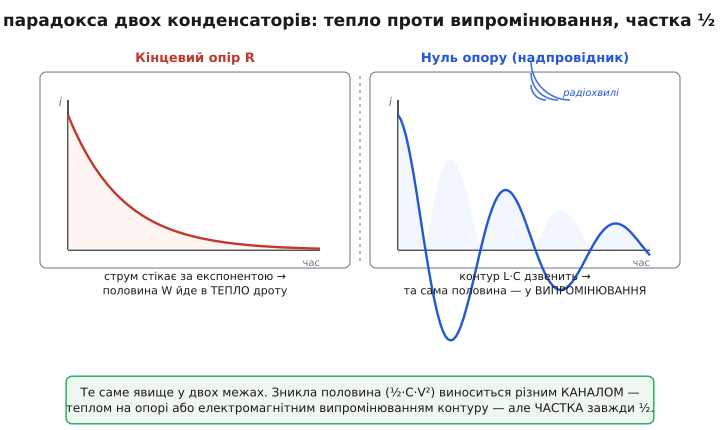

# 📜 Парадокс двох конденсаторів: куди втекла половина

Є задачі, які десятиліттями кочують зі сторінки на сторінку підручників не тому, що складні, а тому, що **зачіпають за живе**. Студент розв'язує її за п'ять хвилин, дістає відповідь — і завмирає, бо відповідь не може бути правдою. Половина енергії зникла. Не загубилася в наближенні, не «пішла в нагрів десь там», а рівно, чесно, дзеркально — половина. І найгірше: хоч би як ти крутив опір дроту, відповідь не міняється. Поставиш надпровідник — половина однаково зникає.

Це і є **парадокс двох конденсаторів** — мабуть, найвідоміший «парадокс зниклої енергії» в усій теорії кіл. Він не парадокс у строгому сенсі (ніякої логічної суперечності в природі немає), але слово прижилося, бо ефект, який він викриває, справді спершу здається неможливим. Варто простежити, як ця задача народилася, чому пережила пів століття суперечок і яка фізика ховається в найхитрішому її куточку — у межі ідеального дроту без опору, де нагріватися просто **нічому**.

> 🔧 **Навіщо це.** Це не суто академічна забавка. Той самий «зниклий ½» — це реальна стеля ефективності, об яку б'ється кожен, хто переливає заряд із ємності в ємність: заряд-помпи, балансири банок акумулятора, ключі живлення на спільній шині. Зрозуміти, **куди** дівається половина і **чому частка не залежить від опору**, — означає зрозуміти, чому інженери не паралелять конденсатори голим дротом, а ставлять між ними котушку або переносять заряд дрібними порціями. Історія парадокса — це історія того, як фізики поступово вистежували втікача аж до випромінювання радіохвиль.

## Що саме бентежить: рахунок, який не сходиться

Постановка елементарна, і саме в цьому її підступність. Беремо два однакові конденсатори ємністю C. Перший заряджений до напруги V, другий порожній. З'єднуємо їх дротом. Заряд перетікає, доки напруги не зрівняються; за [законом збереження заряду](topic:electronics/charge-redistribution) спільна напруга стає V/2 на кожному.

Тепер енергія. До замикання вся вона сидить у першому конденсаторі:

```
W_поч = ½·C·V²
```

Після замикання заряд розподілений на дві однакові ємності, кожна під напругою V/2:

```
W_кін = ½·C·(V/2)²  +  ½·C·(V/2)²
      = ½·C·V²/4 + ½·C·V²/4
      = ¼·C·V²
      = ½ · W_поч
```

Лишилась рівно половина. Заряд при цьому **цілий** — його ніде не загубили, він просто розтікся ширше. А енергія впала вдвічі. Студент перечитує умову, шукає арифметичну помилку — її немає. Закон збереження заряду виконано бездоганно, а закон збереження енергії наче зламано.

Корінь розриву — в тому, що заряд залежить від напруги лінійно (Q = C·V), а енергія — **квадратично** (W = ½·C·V²). Поділили напругу навпіл — заряд кожної ємності впав удвічі (це й має бути за збереженням), а енергія кожної впала **вчетверо**, бо (V/2)² = V²/4. Дві такі чверті дають половину. Квадрат — ось де ховається пастка. Збереження заряду ніяк не тягне за собою збереження енергії, бо вони по-різному залежать від напруги.

Але це лише пояснює, **звідки** береться число ½. Воно не пояснює фізику: енергія ж не може просто розчинитися. Куди вона дівається? І ось тут починається справжня історія — бо коротка відповідь «у тепло на опорі дроту» правильна тільки наполовину, а друга половина відповіді заводить у напрочуд глибокі води.

## Звідки задача взялася: загадка без єдиного автора

Хто перший сформулював цей парадокс? Чесна відповідь: **точно не відомо**, і це той випадок, коли красива легенда про «винахідника» була б брехнею. Задача належить до фольклору фізики — таких, що з'являються в підручниках без посилання, бо «всі їх знають». Її знаходять у класичних курсах фізики середини XX століття: у «Physics» Голлідея й Резніка (Halliday, Resnick), у «University Physics» Сірза й Земанського (Sears, Zemansky) — як задачку наприкінці розділу про конденсатори, часто з лукавим питанням «куди поділась енергія?».

> 🔧 **Навіщо це.** Розрізняти «задача давня й безіменна» від «задачу придумав такий-то» — частина чесності. Спокусливо приписати яскравий парадокс конкретній людині, але тут джерела єдиного імені не дають, і вигадувати його було б фальшуванням історії. Статус чесніше позначити як **усталений навчальний сюжет невідомого походження**.

Що **можна** датувати — це перші друковані обговорення саме енергетичного боку. Найраніша відстежувана публікація, де парадокс розбирають як проблему, а не просто задають, — це коротка нотатка Чарлза Цукера (Charles Zucker) «Condenser problem» в *American Journal of Physics* за жовтень 1955 року (т. 23, № 7, с. 469). Слово «condenser» («конденсатор» за старою термінологією) видає епоху. *(Доказовий статус: бібліографічно підтверджено за переліком посилань у пізнішій літературі; самого тексту 1955 року я не звіряв дослівно.)*

Дванадцять років по тому, у грудні 1967-го, Річард Левін (Richard C. Levine) присвятив задачі окрему статтю з промовистою назвою «Apparent Nonconservation of Energy in the Discharge of an Ideal Capacitor» («Здавана незбереженість енергії при розряді ідеального конденсатора») в *IEEE Transactions on Education* (т. 10, № 4, с. 197–202). Сама назва — діагноз: енергія **здається** незбереженою, і завдання статті — показати, де ховається втрата.

Помітьте характерну рису цієї історії: парадокс не «розв'язали раз і назавжди» якоюсь однією статтею. Його розв'язували **знову й знову**, кожне покоління по-своєму, і щоразу хтось знаходив у попередньому розв'язку незакритий куток. Саме ця нескінченна доразв'язуваність і зробила задачу класикою — вона виявилася значно глибшою, ніж її скромна постановка.

## Перша відповідь: тепло на опорі — і дивина незалежності від R

Найприродніший розв'язок приходить, щойно згадуєш, що ідеальних дротів не буває. У будь-якого дроту є опір R. У мить замикання вся різниця напруг V прикладена до цього опору, крізь нього летить короткий потужний імпульс струму, і цей струм гріє дріт. Порахуйте розсіяне тепло — інтеграл i²·R за весь час перехідного процесу — і дістанете рівно ½·C·V². Рахунок сходиться: зникла половина перетворилася на тепло у дроті.

Поки що нічого парадоксального. Парадоксальне — **наступне** спостереження, і саме воно перетворює задачу з нудної на знамениту. Розсіяне тепло **не залежить від того, який саме опір** у дроту.

```
W_втрач = ½·C·V²     ← незалежно від R
```

Візьміть товстий мідний провід з мізерним опором — струм буде шалений, але дуже короткий. Візьміть тонкий ніхром з великим опором — струм буде кволий, зате тягтиметься довго. А тепла виділиться **порівну** — рівно половина в обох випадках. Опір керує тільки *формою* перехідного процесу: висотою піку струму й тривалістю. Підсумкове тепло задане лише початковим і кінцевим станом конденсаторів, а він від опору не залежить ні на йоту.

Алгебру цього взаємознищення — як зменшення R удвічі рівно вдвічі вкорочує процес і точно компенсує зростання струму, так що інтеграл i²·R лишається сталим, — детально розписано у [виведенні втрати через перехідний процес RC-кола](topic:electronics/charge-redistribution/math-rc-transient-loss.md). Тут важливе саме якісне відкриття: **частка ½ — інваріант**. Хоч би що ти робив з опором, втрачається половина.

І саме ця інваріантність ставить пастку, на якій століттями спотикаються. Якщо втрата не залежить від R, то спокусливо спитати: а спрямуймо R **до нуля**. Дріт без опору. Надпровідник. Куди тепер дінеться половина, якщо гріти **нічого**?

## Найхитріший куток: дріт без опору

Ось межа, де парадокс із навчального стає справжнім. Опір нуль — теплу взятися нізвідки, бо i²·R = 0 у кожну мить. А половина енергії, за всіма попередніми викладками, мусить кудись подітися: початковий і кінцевий стан конденсаторів ті самі, що й раніше, отже різниця в ½·C·V² нікуди не поділася з рахунку.

Спершу спокуса сказати: «у межі R→0 втрата прямує до нуля, бо немає на чому гріти». Але це хибно, і хибність легко побачити. Втрата ½·C·V² **не залежала** від R на всьому шляху наближення до нуля — вона стала такою однаково для R = 1 Ом, для R = 0.001 Ом, для R = 10⁻⁹ Ом. Стала, що не залежить від параметра, не може раптом стрибнути до іншого значення в самій граничній точці. Якщо для будь-якого як завгодно малого опору втрачається рівно половина, то фізика зобов'язана знайти, **куди** цю половину подіти й тоді, коли опору немає зовсім.

Розгадка в тому, що «дріт без опору» — це ще не «дріт без фізики». У реального дроту, окрім опору, є **індуктивність** (topic:electronics/inductance) — а в неї заряд, що влітає й вилітає, неминуче запасає енергію в магнітному полі. І щойно в колі є ємність і індуктивність, воно перестає бути простим RC-стіканням і стає **коливальним контуром** (topic:electronics/lc-resonance). Заряд не перетікає тихо й один раз — він **перехлюпується** туди-сюди, як маятник: перелетів у другий конденсатор, проскочив рівновагу, повернувся, знову проскочив. Контур дзвенить.

А коливний струм, що метається в петлі дроту, — це **антена**. Змінний струм у замкненому контурі неминуче випромінює електромагнітні хвилі. І ці хвилі забирають енергію. Контур дзвенить — і з кожним коливанням трохи енергії втікає в простір радіохвилею, поки коливання не згасне. Куди втекла половина в ідеальному надпровідному колі? Її **випромінило**.


*Зліва — кінцевий опір: заряд стікає за експонентою, половина енергії йде в тепло дроту. Праворуч — нуль опору: контур із ємністю та індуктивністю дроту дзвенить, а коливний струм у петлі випромінює радіохвилі, що забирають ту саму половину. Механізм інший — частка ½ та сама.*

## Чому саме половина — і звідки це відомо

Найкрасивіше тут — що **частка не залежить від механізму**. Чи виносить половину тепло на опорі, чи її випромінює надпровідний контур, чи якась суміш обох — забирається завжди рівно ½·C·V². Чому?

Бо цю половину диктують **тільки кінці процесу**, а не його нутрощі. Енергія, що мусить зникнути, — це різниця між початковим станом (½·C·V²) і кінцевим (¼·C·V²). Обидва стани задані суто конденсаторами: скільки заряду, на яких ємностях, під якою напругою. Шлях від одного стану до іншого — експоненційне стікання, згасальні коливання, будь-що — впливає на те, **як** виноситься енергія й **за який час**, але не на те, **скільки** її треба винести. Скільки — задано різницею рівнів, а вона завжди ½·C·V². Тому хоч тепло, хоч випромінювання — частка прибита цвяхом: половина.

Це не самовпевнена заява автора курсу, а **встановлений у фаховій літературі** результат. Радіаційний бік розрахували й опублікували Тімоті Бойкін, Денніс Гайт і Нагендра Сінг (Timothy B. Boykin, Dennis Hite, Nagendra Singh) зі School of Electrical and Computer Engineering Алабамського університету в Гантсвіллі у статті «The two-capacitor problem with radiation» в *American Journal of Physics* (т. 70, № 4, с. 415–420, квітень 2002). Їхній висновок прямий: у колі з нульовим опором уся «зникла» енергія **виноситься електромагнітним випромінюванням**, а сам парадокс — наслідок того, що до задачі неправомірно прикладають модель зосереджених параметрів (lumped-parameter), яка не знає ні про випромінювання, ні про скінченність швидкості світла. *(Доказовий статус: рецензована публікація в профільному фізичному журналі; цитата за переліком джерел і реферативними базами.)*

> 🔧 **Навіщо це.** «Випромінити половину енергії дротом між двома конденсаторами» звучить дико — це ж не радіопередавач. Але саме тут ламається інтуїція про «ідеальне коло». Модель зосереджених параметрів (ємність — тут, опір — там, дріт — ідеальна перемичка без властивостей) — це зручне наближення, не реальність. Викинувши опір, ви не отримали «коло без втрат» — ви лишилися з контуром, у якого індуктивність і випромінювання нікуди не поділися. Парадокс — це покарання за надмірну ідеалізацію: природа знаходить, куди подіти енергію, навіть коли ваша спрощена модель такого каналу не передбачає.

## Суперечка триває: тепло чи рух зарядів?

Було б нечесно подати радіаційний розв'язок як останнє слово й замовкнути — бо фахівці **досі сперечаються** про деталі механізму в межі нульового опору, і ця незгода реальна, а не вигадана для драматизму.

Найпомітніший опонент радіаційного пояснення — Ашок Сінгал (Ashok K. Singal) з Physical Research Laboratory в Ахмедабаді (Індія). У роботі «The Paradox of Two Charged Capacitors — A New Perspective» (2013) він заперечує, що випромінювання здатне винести половину. Його арґумент технічний: за формулою Лармора для потужності випромінювання, щоб радіохвилі забрали саме ½·C·V², перехід заряду мав би відбутися за нереально короткий час; за реалістичних часів випромінена частка мізерна. Натомість Сінгал доводить, що в ідеальному колі без опору зникла половина йде в **кінетичну енергію самих зарядів**: вільні заряди, яких ніщо не гальмує, розганяються, набирають кінетичну енергію рівно в половину початкової, а долетівши до пластин другого конденсатора, віддають її в непружних зіткненнях — тобто зрештою однаково в тепло, але вже не через омічний опір дроту, а через гальмування зарядів на пластинах.

То хто має рацію? Чесна відповідь: залежить від того, що саме ідеалізувати й наскільки строго моделювати дріт. У реальному дроті є і опір, і індуктивність, і випромінювання, і скінченна рухливість зарядів — і всі канали працюють разом, поділяючи між собою ту саму незмінну половину. Суперечка точиться навколо **гранично ідеалізованих випадків** (рівно нульовий опір, точкові заряди, та чи та геометрія), де домінантним стає різний механізм. Саме тому в підручниках і в авторитетних оглядах радіаційне пояснення подають як **канонічний розв'язок межі нульового опору** — але сумлінні джерела згадують і кінетичну альтернативу.

> 🔧 **Навіщо це.** Для практика-електронника обидва табори дають однаковий висновок: **переливати заряд із ємності в ємність напряму завжди коштує до половини енергії**, і яким каналом вона тікає — тепло, випромінювання чи розгін зарядів — справи не міняє. Інженерна мораль інваріантна щодо фізичної суперечки. А ось чого ця історія вчить ширше: «усталений результат» і «закрите питання» — не одне й те саме. Частка ½ усталена залізно (її дає сама арифметика станів); конкретний мікроскопічний механізм у граничному випадку — досі предмет фахової дискусії. Розрізняти ці два рівні впевненості — ознака зрілого читання науки.

## Що лишається після парадокса

Парадокс двох конденсаторів живе в підручниках не тому, що хтось не може його розв'язати, а тому, що кожен його розв'язок **викриває щось справжнє** про фізику кіл.

Перший шар — арифметика: збереження заряду й збереження енергії — **різні** закони, і квадратична залежність енергії від напруги розводить їх урізнобіч. Хто це засвоїв, той більше ніколи не сплутає «заряд зберігся» з «енергія зберіглася».

Другий шар — інваріантність втрати: частка ½ не залежить від опору, бо її диктують лише кінці процесу. Це привчає шукати відповідь у початковому й кінцевому станах, а не загрузати в деталях перехідного.

Третій, найглибший шар — про межі ідеалізації. «Ідеальне коло без опору» — не існує як «коло без втрат»; викинувши опір, ви оголюєте інші канали, які ваша спрощена модель просто не бачила: індуктивність, коливання, випромінювання, інерцію зарядів. Природа завжди знаходить, куди подіти енергію — і парадокс зниклої половини є тихим нагадуванням, що зосереджена модель кола є зручною мапою, а не самою територією.

Тому з безневинної задачки наприкінці розділу виростає те, заради чого взагалі варто вчити фізику: уміння довіряти законам збереження настільки, щоб **гнатися за втікачем**, поки не знайдеш, де він сховався, — хай навіть він утік у простір радіохвилею з двох звичайних конденсаторів, з'єднаних шматком дроту.
