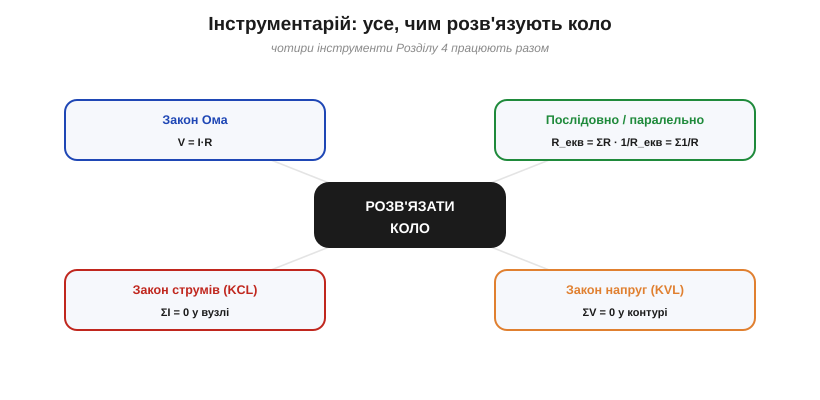
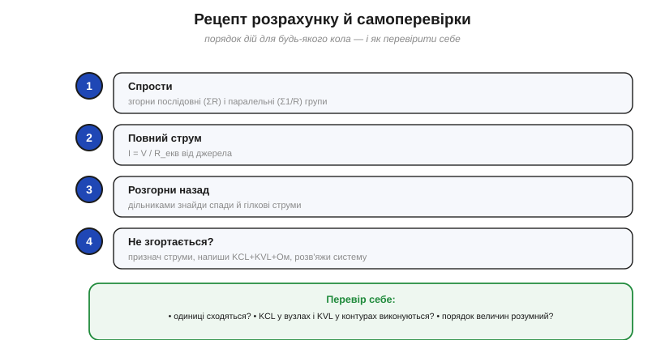

# Як розв'язувати коло: метод і приклади

Маючи на руках повний набір інструментів, лишається навчитися **застосовувати їх у системі** — за чітким порядком, що працює для будь-якої схеми. Це практична серцевина аналізу кіл: те, заради чого вивчають окремі закони.

### Інструментарій: що ми маємо


*Рис. Чотири інструменти аналізу кіл, що працюють разом: закон Ома (зв'язок V–I на елементі), послідовне/паралельне зведення (R_екв), закон струмів (вузли) і закон напруг (контури). Будь-яке коло розв'язують їхньою комбінацією.*

У роботі чотири знаряддя: **закон Ома** (V = I·R на кожному елементі), **зведення** послідовних і паралельних груп (R_екв), **закон струмів** (ΣI = 0 у вузлі) і **закон напруг** (ΣV = 0 у контурі). Уся майстерність — у тому, щоб у правильному порядку пускати їх у хід. Є дві основні стратегії.

### Стратегія 1: згортання

Для більшості повсякденних схем (де елементи складаються в послідовно-паралельні групи) найшвидший шлях — **згортання**.


*Рис. Стратегія згортання: паралельні й послідовні групи по черзі замінюють еквівалентом, доки від схеми не лишиться один R_екв. Тоді знаходять повний струм, а далі «розгортають» назад — дільниками шукають спади й гілкові струми.*

Ідея проста: **поетапно спрощуй**. Знайшов [паралельну групу](book:electronics/parallel-connection) — заміни її одним опором; знайшов [послідовну](book:electronics/series-connection) — склади; і так, доки від цілої схеми не лишиться **один** R_екв. Тоді одним діленням знаходиш повний струм від джерела (I = V/R_екв), а далі рухаєшся **назад**, «розгортаючи» схему: [дільником напруги](book:electronics/voltage-divider) знаходиш спади на групах, [дільником струму](book:electronics/current-divider) — як струм розділився по гілках.

На практиці зручно щоразу **перемальовувати** спрощену схему: побачив пару паралельних резисторів — закреслив, намалював замість них один; знайшов послідовну низку — згорнув у один. І так крок за кроком, аж поки на папері не лишиться джерело та єдиний R_екв. Така «драбинка» спрощень майже не лишає місця для помилки, і нею розв'язується більшість навчальних та побутових задач.

### Приклад згортанням


*Рис. Приклад: R₁ послідовно з парою R₂∥R₃. Спершу пара → 100 Ω, тоді R_екв = 200 Ω, повний струм 60 мА; на R₁ спадає 6 В, на парі — теж 6 В, і кожна гілка бере по 30 мА. Перевірка KCL: 30+30 = 60 мА.*

**Приклад 1 (згортанням). V = 12 В; R₁ = 100 Ω послідовно з парою R₂ = 200 Ω ∥ R₃ = 200 Ω.**

```
1. Згортаємо пару:  R₂∥R₃ = 200·200/400         = 100 Ω
2. Послідовно:      R_екв = R₁ + 100 = 100 + 100 = 200 Ω
3. Повний струм:    I = V/R_екв = 12/200         = 60 мА
4. Спад на R₁:      V₁ = I·R₁ = 0.06·100         = 6 В
5. Спад на парі:    V_пара = 12 − 6              = 6 В
6. Гілкові струми:  I₂ = I₃ = 6/200              = 30 мА
   перевірка KCL:   30 + 30                      = 60 мА  ✓
```

Зверніть увагу на хід: **уперед** — спрощуємо до R_екв і знаходимо повний струм; **назад** — розподіляємо напругу й струм по частинах. Цим способом розв'язується величезна частина реальних схем.

Фізично відповідь читається легко: повне коло на 200 Ω при 12 В пропускає 60 мА; половина напруги (6 В) гине на R₁, друга половина — на парі; а оскільки гілки пари однакові, 60 мА діляться між ними **порівну**, по 30 мА. Кожне число має зрозумілий сенс — добра ознака, що розв'язок правильний.

### Стратегія 2: систематичні рівняння

Та не всі кола згортаються. Якщо в схемі **кілька джерел** або «місткове» з'єднання (як-от [міст Вітстона](book:electronics/wheatstone-bridge)), послідовно-паралельне спрощення заходить у глухий кут. Тоді діють **напряму** — так, як замислив Кірхгоф.


*Рис. Коли коло не зводиться (два джерела, міст тощо), діють напряму: призначають контурні (чи гілкові) струми й пишуть рівняння KVL/KCL. Тут дві рівності контурів дають систему на два невідомі струми.*

Рецепт систематичний і завжди працює: познач невідомі струми (по гілках або по контурах), напиши **по одному рівнянню KCL** на кожен незалежний вузол і **по одному KVL** на кожен незалежний контур, додай V = I·R для резисторів — і дістанеш рівно стільки рівнянь, скільки невідомих. Тонкість «незалежності»: на зв'язній схемі незалежних рівнянь KCL рівно **N − 1** (останній вузол нового не дає), а незалежних KVL — **B − N + 1** (стільки незалежних [контурів](book:electronics/nodes-branches-loops) має схема). На практиці зазвичай беруть **один** систематичний метод — вузловий (потенціали вузлів) **або** контурний (контурні струми), — щоб не плодити зайвих залежних рівнянь. Лишається розв'язати систему. Для кола з рисунка це дві контурні рівності:

```
контур A:  V₁ = Iₐ·R₁ + (Iₐ − I_b)·R₃
контур B:  V₂ = I_b·R₂ + (I_b − Iₐ)·R₃
```

Дві рівності, дві невідомі (Iₐ, I_b) — звичайна шкільна система, що береться підстановкою. А коли невідомих три й більше, до неї застосовують [метод Гаусса: систему зводять до трикутної й підставляють знизу вгору](book:math/gauss-elimination) — те саме, що робить SPICE усередині. Спосіб не такий швидкий, як згортання, зате **універсальний**: ним береться будь-яке лінійне коло без винятку.

> 📜 Чому беруть саме **контурні** струми (Iₐ, I_b), а не гілкові? Бо так KCL виконується сам собою й рівнянь виходить менше — цю хитрість ще 1873 року вигадав Джеймс Клерк Максвелл: [Контурні струми Максвелла](hist-maxwell-mesh.md).

Є й рідна альтернатива — **метод вузлових напруг**: замість струмів за невідомі беруть **потенціали вузлів** (один вузол оголошують нульовим — «землею»), пишуть KCL у кожному вузлі через ці потенціали й розв'язують систему. Багатьом він зручніший, надто коли вузлів небагато. Контурний і вузловий методи дають ту саму відповідь — це лише два способи систематично застосувати ті самі закони Кірхгофа. Записана коротко, така система — це [матриця, що множиться на вектор невідомих](book:math/matrices-as-operations), і саме її комп'ютер зводить до трикутної форми.

> ⚙️ **Як це робить комп'ютер.** Саме вузловий метод (із хитрою «модифікацією» під джерела напруги) автоматизує SPICE: зі списку з'єднань він **штампує** матрицю й розв'язує її Гауссом. Покроково — у вставці [Як SPICE розв'язує кола: MNA](proj-mna-spice.md).

### Рецепт і самоперевірки


*Рис. Рецепт: 1) спрости, 2) повний струм, 3) розгорни назад дільниками; 4) якщо не згортається — система рівнянь. І завжди три самоперевірки: одиниці, KCL/KVL, порядок величин.*

Зведімо порядок дій: **(1)** спрости послідовні й паралельні групи; **(2)** знайди повний струм I = V/R_екв; **(3)** розгорни назад — дільниками знайди спади й гілкові струми; **(4)** якщо коло не згортається, переходь до системи рівнянь KCL+KVL+Ом. І наприкінці — три обов'язкові **самоперевірки**.

> 🔧 **Навіщо це.** Звичка перевіряти себе економить години. Три перевірки на кожен розрахунок: **одиниці** (вольти з вольтами, ампери з амперами — чи не загубився множник?); **закони Кірхгофа** (сума гілкових струмів = повному, сума спадів = напрузі джерела — мусять сходитися!); **порядок величин** (чи розумна відповідь — міліампери, а не кілоампери?). Якщо щось не сходиться — шукайте помилку, не йдіть далі. До речі, симулятори кіл (як-от SPICE) усередині роблять рівно те саме, що ми тут вручну: складають рівняння Кірхгофа й розв'язують систему. Опанувавши метод, ви розумієте, **що** саме рахує машина — і чому їй можна (чи не можна) вірити.

---
