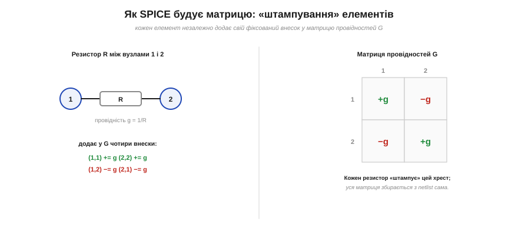
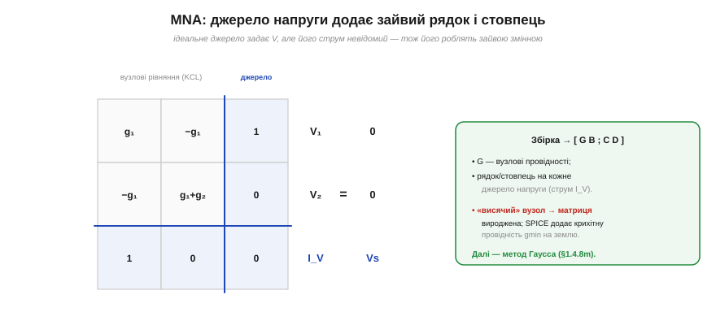

# ⚙️ Як SPICE розв'язує кола: модифікований вузловий аналіз (MNA)

> Систематичний шлях розв'язати коло — це [рівняння Кірхгофа](book:electronics/circuit-analysis), а метод Гаусса (послідовне виключення невідомих) їх розв'язує. Лишається питання: як програма **автоматично** перетворює схему на ту систему? Відповідь — **модифікований вузловий аналіз** (*Modified Nodal Analysis*, MNA), серце будь-якого SPICE.

### Задача

Зі списку з'єднань (*netlist*) — «резистор R1 між вузлами 1 і 2», «джерело V між 1 і землею» — треба **самотужки**, без людської алгебри, скласти матричне рівняння для невідомих. За основу беруть **вузловий аналіз**: невідомі — це **потенціали вузлів** (один вузол, землю, оголошують нульовим), а рівняння — [KCL у кожному вузлі](book:electronics/kcl). Та чистий вузловий аналіз спотикається об **ідеальне джерело напруги**: воно задає різницю потенціалів, але його струм невідомий, а провідність «нескінченна» (R=0) у матрицю не влазить. MNA це лагодить.

### Ідея: штампування + зайві рядки

Перша половина MNA — **штампування** (*stamping*). Кожен елемент **незалежно** додає свій фіксований внесок у матрицю провідностей G, ніби ставить штамп.


*Рис. Резистор провідністю g = 1/R між вузлами 1 і 2 додає у G чотири внески: +g на діагональ (1,1) і (2,2), −g поза діагоналлю (1,2) і (2,1). Кожен елемент штампує свій хрест незалежно — і вся матриця збирається з netlist сама собою, без алгебри.*

Резистор між вузлами a і b додає +g у (a,a) та (b,b) і −g у (a,b) та (b,a); джерело струму додає свій струм у праву частину. Так уся матриця G збирається автоматично простим проходом по netlist.

Друга половина — **модифікація** заради джерел напруги. Струм джерела роблять **новою невідомою**, а його рівність V(a)−V(b)=Vs — **новим рядком**. Матриця обростає рамкою:


*Рис. Структура MNA: блок G — вузлові провідності; на кожне джерело напруги додається зайвий рядок і стовпець (його струм I_V як невідома, і рівняння V₁=Vs). Виходить облямівкова матриця [G B; C D]·[V; I] = [Iдж; Eдж], яку далі розв'язує Гаусс.*

### Псевдокод (збірка матриці)

```
G ← 0 (нулі);  rhs ← 0;  k ← число вузлів
для кожного елемента в netlist:
    якщо R між (a, b):
        g ← 1/R
        G[a][a] += g;  G[b][b] += g
        G[a][b] −= g;  G[b][a] −= g
    якщо джерело струму I з a в b:
        rhs[a] −= I;  rhs[b] += I
    якщо джерело напруги V між (a, b):     # модифікація
        k ← k+1                            # новий індекс (струм джерела)
        G[a][k] += 1;  G[k][a] += 1
        G[b][k] −= 1;  G[k][b] −= 1
        rhs[k] += V
викинути рядок і стовпець землі (вузол 0)
розв'язати  G · x = rhs                     # метод Гаусса
```

Краса в тому, що жоден елемент не «знає» про інші — кожен лише ставить свій штамп, а система складається сама.

### Складність і пастки на МК

- **Складність.** Збірка — O(числа елементів), а розв'язок — O(N³) методом Гаусса; саме розв'язок і коштує найдорожче. Та реальна матриця кола **розріджена** (кожен вузол зв'язаний із кількома сусідами), тож SPICE бере **розріджені** розв'язувачі й виграє на порядки. На МК для малих кіл згодиться й повний Гаусс.
- **Вироджена матриця.** Якщо вузол **«висить»** (не має шляху до землі по постійному струму), система не має розв'язку. SPICE підстраховується, додаючи між кожним вузлом і землею крихітну провідність **gmin**, — і матриця перестає бути виродженою.
- **Суперечлива топологія.** Контур із самих джерел напруги чи розрив із самих джерел струму переозначує систему — теж виродження; це помилка схеми, а не методу.
- **Земля обов'язкова.** Має бути опорний вузол 0; його рядок і стовпець викидають (бо потенціали відлічують саме від нього, тож одне рівняння стає зайвим).
- **Нелінійні елементи.** Діод чи транзистор не лінійні, тож MNA обертають у цикл **Ньютона–Рафсона**: лінеаризують елемент у поточній точці, розв'язують, уточнюють — і так до збіжності. Але це вже наступний рівень.

Отак банальний netlist силою штампування й однієї «модифікації» перетворюється на матрицю, яку Гаусс розв'язує за один прохід. Знаючи це, ви розумієте і чому SPICE іноді скаржиться на «singular matrix», і чому велике коло рахується довше, — бо тепер бачите машину зсередини.
