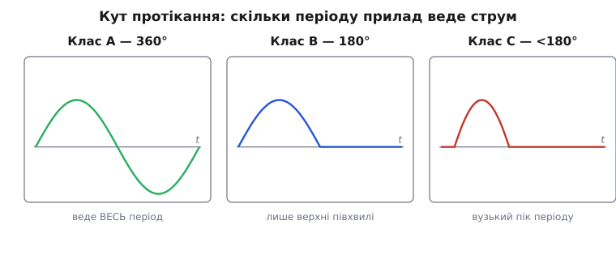
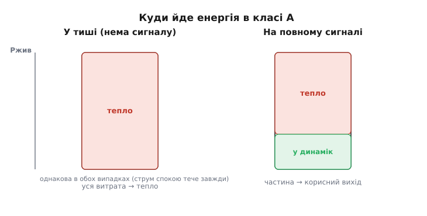
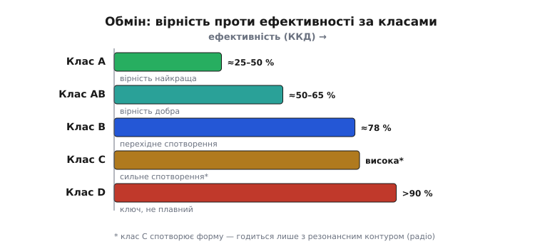

# Клас A: постійне зміщення й ефективність

Підсилювач має зробити з кволого сигналу велику, але **вірну** копію. Найпрямолінійніший спосіб домогтися вірності — тримати підсилювальний прилад **увесь час** у його лінійній, активній зоні: щоб він ніколи не закривався, ніколи не впирався в стелю, а просто плавно йшов за входом туди й назад. Саме це й робить **клас A** (англ. *class A* — перша, найстарша літера в абетці класів підсилення). Це не схема й не конкретний транзистор, а **режим роботи**: правило, як виставити робочу точку й наскільки великий сигнал на неї накладати. За цю чисту вірність клас A платить дорого — теплом і марнотратним споживанням. Розберімо, звідки береться і вірність, і ця ціна.

### Що означає «клас» підсилювача

Коли кажуть «клас A», «клас B», «клас C», ідеться про одне-єдине число: **яку частку періоду сигналу підсилювальний прилад пропускає струм**. Цю частку зручно міряти кутом, бо синусоїда — це обертання: повний період — 360°. Скільки градусів цього кола прилад **відкритий** і веде струм, звуть **кутом протікання** (англ. *conduction angle* — кут, протягом якого тече струм).

Клас A — це випадок, коли кут протікання дорівнює **повним 360°**. Прилад відкритий **завжди**, увесь період, без жодної миті відсічки. Що б не робив сигнал — гойдався вгору, вниз, проходив через нуль, — струм крізь транзистор тече безперервно й лише то більший, то менший. Інші класи відрізняються лише цим кутом: у класі B прилад відкритий рівно пів періоду (≈180°), у класі C — менше за половину. Звідси й уся їхня різниця в поведінці та ефективності, але стрижень класифікації один — кут протікання.

Самі літери — спадок лампової доби, а не імена винахідників: вони йдуть за абеткою в порядку **зменшення** кута протікання (A — весь період, далі менше й менше).

> 📜 **Історична вставка:** [звідки взялися літери класів підсилення](book:electronics/class-a-amplifier/hist-amplifier-classes.md). Чому A, B, C і чому в цьому порядку; раннє застосування класу A в лампових модуляторах ще в 1920-х; перша строга теорія класів (Bell System, 1932) — і чому «винаходження класу A» не приписують жодній окремій людині чи нації.

*Що відрізняє класи підсилення — частка періоду, протягом якої прилад пропускає струм. Клас A відкритий усі 360° (струм ніколи не падає до нуля), тому веде сигнал без розриву. Клас B проводить лише півхвилі, клас C — ще менше: вони ощадніші, але самотужки спотворюють форму.*

> 🔧 **Навіщо це.** Кут протікання — перше, що варто спитати про будь-який вихідний каскад: «скільки часу транзистор узагалі ввімкнений?». Відповідь одразу каже і про якість (360° → жодного розриву сигналу), і про нагрів (360° → струм тече навіть коли користі нема). Дивлячись у даташит підсилювача чи на чужу схему, ви читаєте не назву літери, а саме це число — і вже знаєте, чого чекати від тепла й живлення.

### Чому 360° — це найвірніше

Повертаючись до вірності: чому безперервне протікання дає найчистіший сигнал? Бо прилад **ніколи не перетинає своїх власних зламів**. У транзистора є дві небезпечні межі: знизу — **відсічка** (база перестає проводити, струм падає в нуль), згори — **насичення** (колектор «сів», далі тиснути нікуди). Обидві межі — це різкі злами характеристики, і щойно сигнал на них наскочить, його верхівку **зріже** — вийде [кліпування](book:electronics/bjt-amplifier), грубе спотворення.

Клас A влаштовано так, щоб сигнал жив **посередині**, далеко від обох зламів, і весь розмах — і вгору, і вниз — лишався в гладкій, лінійній частині. Прилад працює, як гойдалка, підвішена на «помості» постійного струму: легкий сигнал лише трохи розгойдує її туди-сюди, але вона ніколи не б'ється ні об землю (відсічку), ні об стелю (насичення). Тому копія виходить точна.

Цей «поміст» і є **постійне зміщення** (англ. *bias* — попереднє зміщення робочої точки). Спершу задають **сталий** струм, що тримає транзистор приблизно посередині активної зони, — це [**робоча точка**, її ще звуть Q-точкою](book:electronics/bjt-amplifier). Лише **поверх** неї накладають змінний сигнал. Тепер струм гойдається навколо робочої точки, та ніколи не падає до нуля й не впирається в межу — ось і всі 360° протікання.

Те, як саме виставляють і утримують цю робочу точку в каскаді зі спільним емітером (дільник на базі, резистор Rc, стабілізувальний Re), — окрема й важлива історія; клас A лише вимагає, щоб точка стояла так, щоб **увесь** сигнал лишався в активній зоні.

> Щоб клас A мав де розгойдатися, робочу точку ставлять приблизно **посередині** між живленням і нулем, а підсилення задають **зовнішніми резисторами**, а не примхливим коефіцієнтом β транзистора. Як це робить каскад зі спільним емітером — від зміщення дільником до стабілізувального емітерного резистора — розібрано в темі [BJT як підсилювач](book:electronics/bjt-amplifier).

### Прихована ціна: струм тече завжди

Ось ключовий наслідок 360°, через який клас A і славиться, і лається. Якщо прилад відкритий **увесь час**, то струм від джерела живлення тече **завжди** — навіть тоді, коли сигналу **немає взагалі**. Підсилювач у цілковитій тиші все одно жадібно споживає той самий постійний струм робочої точки.

Куди ж іде ця енергія в тиші? Сигналу на виході нема, корисної роботи нема — отже, вся вона перетворюється на **тепло** в транзисторі й резисторах. Це не дрібниця, а визначальна риса класу A: він **гарячий у спокої**. Поставте долоню на радіатор підсилювача класу A, що грає тиху музику, — він буде теплим не попри тишу, а **через** неї.

Звідси випливає правило, що спершу здається неможливим: **найбільше тепла клас A виділяє не на гучних місцях, а в тиші**. На повній гучності частина енергії таки йде в навантаження (динамік) корисним сигналом, тож транзистору лишається трохи менше. А в тиші **вся** спожита енергія осідає теплом. Тому теплові розрахунки для класу A роблять за **найгірший** випадок — спокій без сигналу, — і саме під нього добирають радіатор.

*Постійна потужність від живлення в класі A та сама завжди. У тиші (ліворуч) корисного виходу нема — уся вона осідає теплом у транзисторі. На повному сигналі (праворуч) частина нарешті доходить до навантаження, тож транзистор гріється навіть трохи менше. Тому найгірший тепловий режим класу A — саме спокій.*

> 🔧 **Навіщо це.** Це переставляє з ніг на голову звичну інтуїцію «гучніше → гарячіше». Проєктуючи охолодження для класу A, рахуйте радіатор під **тишу**, а не під максимум гучності, інакше підсилювач спокійно перегріється на паузі між піснями. І навпаки: якщо чужа схема класу A ледь тепла в спокої — робочу точку, найпевніше, виставили заслабко, і на сигналі вона почне кліпувати.

### Скільки користі з витрат: ефективність

Раз стільки енергії йде в тепло, природно спитати: **яку частку** спожитої від джерела потужності клас A узагалі здатен віддати в навантаження корисним сигналом? Це й є **коефіцієнт корисної дії** (ККД, англ. *efficiency*) — відношення корисної вихідної потужності до повної спожитої від живлення.

Відповідь для класу A на диво скромна, і вона **принципова**, а не від недбалості схеми. Для звичайного каскаду, де навантаження живиться **через резистор** у колекторі (так зване послідовне живлення, англ. *series-fed*), теоретична **стеля ККД — лише 25 %**. У найкращому, ідеальному разі чверть енергії стає звуком, а **три чверті — теплом**. На практиці виходить ще менше.

Звідки взялася саме чверть, добре видно з простого міркування. Постійна потужність від живлення тече **завжди** й приблизно стала (її задає робоча точка). Корисна ж потужність — це лише потужність **змінного** сигналу, і вона максимальна тоді, коли сигнал гойдається на повний можливий розмах. Та навіть на повному розмаху середня потужність синусоїди — невелика частка від тієї постійної «данини», яку каскад платить безперервно. Точний підрахунок дає рівно ¼.

> 🧮 **Математична вставка:** [звідки в класі A беруться 25 % і 50 %](book:electronics/class-a-amplifier/math-class-a-efficiency.md). Покроково, на формулах: чому послідовне живлення впирається у 25 %, як середня потужність синусоїди (Vₚ²/2R) ділиться на сталу Vcc·I₀, і чому **трансформаторний** (чи дросельний) зв'язок піднімає стелю рівно вдвічі — до 50 %. Розібрано також, чому реальний ККД завжди нижчий за стелю й чому навіть теоретичні 50 % програють класу B.

Чому так мало? Бо безперервний струм робочої точки — це **постійна данина**, яку каскад платить незалежно від сигналу. Корисний сигнал — лише невелике гойдання поверх неї, і його середня потужність мала проти тієї данини. Клас A купує вірність, **платячи живленням за саму готовність** підсилювати щомиті, незалежно від того, є зараз сигнал чи нема.

Є й хитріший спосіб увімкнення, що піднімає стелю вдвічі — до **50 %**. Якщо навантаження під'єднати не через резистор, а через **трансформатор або дросель** (індуктивний зв'язок), то на постійному струмі котушка майже не марнує напруги (її опір постійному струму близький до нуля), а змінному сигналу віддає вдвічі більший розмах. Половина енергії в навантаження — теж небагато, та вже вдвічі краще за резистивний варіант. Саме так будували вихідні каскади старих лампових приймачів і радіостанцій.

### Чому ж клас A досі живий

Логічне питання: якщо клас A марнує три чверті (а в кращому разі половину) енергії на тепло, навіщо він узагалі потрібен — є ж ощадніші класи? Відповідь — у тому, **що саме** він робить ідеально й чого позбавлені ощадні класи.

Ощадність інших класів походить із того, що прилад там частину періоду **закритий**. Але щойно прилад закривається й знову відкривається, біля точки переходу через нуль виникає крихітний **злам** — момент, коли жоден із приладів ще не взявся вести струм. Цей злам чути як [перехідне спотворення](book:electronics/push-pull-output) — характерну «пісковість» тихих, делікатних звуків. Клас A від нього **вільний за побудовою**: його прилад **ніколи не закривається**, тож нуля переходити нічому — сигнал іде суцільною, гладкою лінією. Вірність без жодного зламу — це те, за що клас A досі цінують у якісному звуковідтворенні й у точних вимірювальних колах, де спотворення неприпустиме навіть ціною тепла.

> Ощадні класи (B, AB) ділять сигнал між двома приладами — один веде верхні півхвилі, другий нижні. Економія велика, але на стику півхвиль, біля нуля, виникає **перехідне спотворення**. Як саме воно народжується і як його приборкують малим зміщенням (клас AB), розібрано в темі [Push-pull вихід](book:electronics/push-pull-output).

> 🔧 **Навіщо це.** Вибір класу — це завжди свідомий обмін: **вірність проти ефективності**. Потрібен бездоганний, лінійний підсилювач для слабкого сигналу, давача чи якісного звуку, і тепло та апетит до живлення стерпні — беруть клас A. Потрібно живити потужне навантаження від батареї, де кожен ват на рахунку, — клас A відпадає, бо спалить заряд на обігрів кімнати. Не буває «найкращого» класу взагалі — буває доречний для конкретної задачі.

### Де клас A на своєму місці, а де ні

Клас A природно живе там, де сигнал **малий**, а вірність важлива. Перший, **попередній** каскад підсилювача (англ. *preamplifier*), що бере мікровольти з давача чи мікрофона, майже завжди працює в класі A: струми там крихітні, тож і тепла дрібниці, зате жодного спотворення на найслабшому, найвразливішому сигналі. Так само — вхідні каскади вимірювальних приладів, де викривлення зіпсувало б точність.

А от **силовий**, вихідний каскад, що мусить розгойдати динамік чи передавач на ватах і десятках ватів, у класі A роблять рідко й свідомо: лише в дорогій аудіотехніці, де заради бездоганного звуку миряться з пічкою на радіаторі й рахунком за електрику. Для всього іншого — від кишенькової колонки до радіопередавача — беруть ощадніші класи (B, AB), а для найвищої ефективності, де прилад працює вже не як плавний підсилювач, а як [ключ](book:electronics/class-d-amplifier), — клас D із ККД під 90 %.

Корисно тримати в голові всю шкалу обміну. Клас A: вірність найкраща, ефективність найгірша (≈25–50 %). Класи B та AB: компроміс — добра вірність (AB прибирає перехідне спотворення малим зміщенням) при значно вищій ефективності. Клас C: ефективний, але сильно спотворює, тож годиться лише там, де форму потім відновлює резонансний контур (радіопередавачі). Клас D: прилад уже не підсилює плавно, а швидко **клацає**, тож майже не гріється — найвища ефективність ціною складнішої схеми. Клас A — це один полюс цієї шкали: полюс чистоти, куплений теплом.

*Уся шкала класів як один обмін. Клас A стоїть на лівому, «вірному» краю: найчистіший сигнал ціною найнижчої ефективності. Що далі вправо (B → AB → C → D), то ощадніший режим — і то більше доводиться дбати про спотворення (перехідне в B, грубе в C) або складність схеми (D).*

### Коротко про суть

Клас A — це режим, у якому підсилювальний прилад пропускає струм **усі 360°** періоду, ніколи не закриваючись. Звідси його дві визначальні риси, що ростуть з одного кореня. **Перша — найвища вірність:** сигнал увесь час лишається в гладкій активній зоні, далеко від зламів відсічки й насичення, тож копія виходить без кліпування і без перехідного спотворення. **Друга — низька ефективність і постійний нагрів:** струм робочої точки тече завжди, незалежно від сигналу, тож стеля ККД — лише 25 % (резистивне живлення) чи 50 % (трансформаторне), а найбільше тепла припадає парадоксально на **тишу**. Клас A купує бездоганну лінійність ціною енергії — і саме тому його ставлять там, де вірність дорожча за ват: у попередніх каскадах, вимірювальних колах і добротному звуці.
