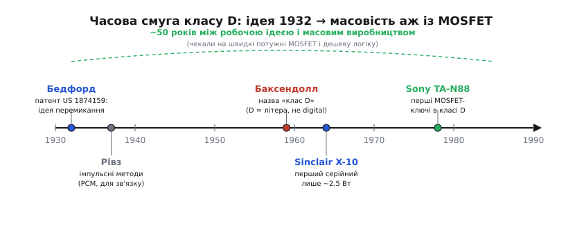

# 📜 Звідки взявся клас D і чому «D» — не «digital»

Майже кожна стаття про підсилювач класу D мусить почати з відмагання: ні, «D» не означає «цифровий». І це не випадкова прискіпливість — плутанина настільки чіпка, що з нею борються вже понад півстоліття, а вона все одно повертається. Тож варто розібратися не лише в тому, **що** означає ця літера, а й у тому, **звідки** взялася сама ідея підсилювати перемиканням, хто її придумав, хто дав їй назву — і чому між робочою ідеєю та масовим виробництвом минуло близько п'ятдесяти років. Історія тут повчальна не датами, а тим, як добра ідея чекає десятиліттями, поки під неї дозріє залізо.

## Дивина, яку важко було прийняти

Спершу про те, **що бентежило**. У 1930-х підсилення означало одне-єдине: лампа (а згодом транзистор) сидить у лінійній зоні й плавно копіює форму сигналу. Усе мистецтво схемотехніки крутилося навколо того, як зробити це копіювання вірнішим — менше спотворень, ширша смуга, рівніша характеристика. І от хтось каже: а давайте прилад не триматимемо посередині взагалі — хай він **клацає**, повністю відкриваючись і закриваючись, а плавний звук народиться вже потім, із ширини імпульсів. Для людини, вихованої на лінійному підсиленні, це звучало майже як шахрайство. Як із грубого «увімкнено-вимкнено» може вийти тонкий звук?

Парадокс у тому, що відповідь була зрозуміла з самого початку — її дає проста арифметика. Тепло на приладі — це добуток напруги на ньому й струму крізь нього, P = U · I. У лінійного приладу обидва множники середні водночас, тож він гріється безперервно. У ключа ж завжди притиснутий до нуля **бодай один** множник: увімкнено — напруга майже нуль, вимкнено — струм майже нуль. Виграш в ефективності лежав на поверхні. Складність ховалася не в **ідеї**, а в **реалізації**: щоб клацання дало чистий звук, ключ мусить перемикатися дуже швидко й дуже різко, а тодішні прилади цього не вміли. Саме цей розрив — між простою ідеєю та неготовим залізом — і визначив усю подальшу історію.

> 🔧 **Навіщо це знати.** Історія класу D — це майже ідеальний приклад того, як працює інженерний прогрес узагалі: ідею висловлюють рано, вона лежить «на полиці» десятиліттями, а вистрілює аж тоді, коли під неї з'являється дешевий і швидкий компонент. Хто розуміє цю закономірність, той інакше дивиться на «нові» технології — часто це старі ідеї, які нарешті дочекалися свого транзистора.

## 1932: Бедфорд малює перемикач, що підсилює

Першим **робочим** описом того, що сьогодні звуть класом D, прийнято вважати патент американського інженера Бернайса Бедфорда (Burnice D. Bedford) — **US 1 874 159**, виданий **30 серпня 1932 року** й приписаний компанії General Electric. *(Статус: усталено — патент відкрито доступний, дата й номер однозначні.)*

Цінне в цьому патенті не сама дата, а те, **наскільки повно** Бедфорд бачив картину. У його схемі пара тріодів працює одночасно і як силові ключі, і як порівнювачі: на них подається **сума** трикутної напруги й корисного звукового сигналу, і прилади перемикаються залежно від того, що зараз більше. Це рівно той самий принцип «трикутник плюс компаратор», на якому клас D стоїть і досі. Більше того, на кресленнях видно деталі, які **вигадати з голови майже неможливо**: викид на фронті ШІМ-сигналу, залишок перемикання на відфільтрованій хвилі. Такі дрібниці помічає лише той, хто справді складав схему й дивився на її осцилограми, а не фантазував біля столу. Тож є вагома підстава вважати, що Бедфорд свій підсилювач **будував**, а не лише уявляв.

І все ж далі цієї точки справа тоді не пішла. Тріоди 1930-х перемикалися повільно й м'яко, через них ішли помітні втрати, а сама потреба в надшвидкому чистому клацанні не мала чим задовольнитися. Ідея виявилася передчасною — правильною, але без елементної бази під неї.

## Рівз: імпульси приходять у зв'язок, але не в підсилення

Майже водночас із Бедфордом імпульсними методами впритул зайнявся англійський інженер Алек Гарлі Рівз (Alec Harley Reeves, 10 березня 1902 — 13 жовтня 1971), народжений у Редгіллі, графство Суррей. *(Етнічна/державна атрибуція: усталено — англієць, британський підданий; працював у французькій лабораторії ITT.)* Рівз — постать в історії зв'язку величезна: саме він **придумав імпульсно-кодову модуляцію** (англ. *pulse-code modulation*, PCM) — спосіб передавати звук не безперервною хвилею, а потоком чисел-імпульсів, які на кожному вузлі лінії **відновлюють заново**, а не підсилюють зі шумом разом. Ідею PCM Рівз сформулював **1937 року**, працюючи в паризькій лабораторії ITT, і запатентував її у Франції **1938-го** (французький патент 852 183); американський патент видали аж 1943-го. *(Статус: усталено — широко задокументовано, зокрема IEEE.)*

PCM стала фундаментом усього цифрового зв'язку, і за неї Рівза заслужено шанують. Але тут треба бути точним, бо саме звідси й росте половина плутанини навколо назви «клас D». Рівз розвивав **широтно-імпульсну та фазо-імпульсну модуляцію для передавання сигналів** — для телефонії, для зв'язку. Він **не** будував із цього силовий підсилювач звуку й **не** давав назви «клас D». Його робота йшла паралельною колією: ту саму ідею «закодуємо рівень у часові параметри імпульсу» він застосовував не для того, щоб гнати ват у динамік, а для того, щоб тягти розмову через сотні кілометрів дроту без накопичення шуму.

Чому це важливо розділяти? Бо існує поширене твердження, ніби саме Рівз близько **1955 року** першим назвав підсилення перемиканням «класом D». Воно трапляється в популярних оглядах, але **гірше задокументоване** за альтернативу й суперечить кращим джерелам. *(Статус: спірно — одиничне джерело проти ширшої згоди.)* Чесніше сказати так: Рівз — один із батьків **імпульсних методів** загалом, і його PCM-роботи живили загальну атмосферу, у якій клас D зрештою визрів; але **приписувати йому назву** «клас D» підстав замало.

## 1959: Баксендолл і літера, що нічого не означає

Звідки ж узялася сама назва? Найкраще задокументований слід веде до англійського інженера Пітера Баксендолла (Peter J. Baxandall), якого аудіофіли знають за тон-регулятором його імені. У праці **1959 року** про транзисторні генератори Баксендолл запропонував термін **«клас D»** для режиму, у якому активний прилад проводить струм лише тоді, коли напруга на ньому мінімальна, — тобто саме для перемикального, а не лінійного режиму роботи. *(Статус: усталено — згадано в довідкових джерелах як походження терміна.)*

І ось головне, заради чого вся ця історія й розповідається. Літера **«D» — це просто наступна літера абетки** після вже наявних класів A, B і C. Так само, як ці три не означають нічого, крім порядку, у якому їх описали, «D» не несе жодного прихованого змісту. Вона **не** від *digital*. Її обрали тому, що A, B і C уже були зайняті, — а п'ята до неї за тим самим принципом стала «класом E», шоста «класом F», і ніхто ж не думає, ніби клас E «електронний», а клас F «фазовий».

```
A → B → C → D → E → F …
              ↑
        просто наступна літера,
        НЕ "digital"
```

Чому ж плутанина така живуча? Через зовнішню оманливу схожість. Вихід ключа в класі D — це потік прямокутних імпульсів, що **виглядає** як низка «нулів та одиниць». Око бачить «цифру». Але це двійка станів **силового ключа** (повністю відкритий або повністю закритий), а не двійкове число в пам'яті. Усередині класичного класу D немає ні бітів, ні такту процесора, ні аналого-цифрового перетворення: трикутна несівна аналогова, компаратор аналоговий, а ширина імпульсу набуває **будь-якого** значення з неперервної шкали, а не лише позицій із сітки. Подвійна іронія в тому, що Баксендолл увів термін узагалі для **генераторів**, а не підсилювачів, — а народна етимологія за десятиліття дотягла «D» до «digital», якого там ніколи не було.

> 🔧 **Навіщо це знати.** Розрізняти «послідовність імпульсів» і «цифровий сигнал» — навичка, що далеко виходить за межі підсилювачів. Імпульсне джерело живлення, ШІМ-керування мотором, димер світлодіода — усі вони клацають ключем і видають «прямокутники», лишаючись при цьому суто аналоговими за керуванням. Той, хто плутає «клацає» з «цифровий», робить хибні висновки про шум, точність і завади; той, хто їх розрізняє, бачить справжню природу схеми.

## 1964: перший серійний — і повчальний провал

Від ідеї до полиці магазину клас D дістався аж у 1960-х, і дорогою стала Британія. **Першим серійним** виробом класу D вважають набір-модуль **X-10**, який **1964 року** випустила компанія Sinclair Radionics — та сама фірма молодого Клайва Сінклера, що згодом прославиться кишеньковими калькуляторами й домашніми комп'ютерами. *(Статус: усталено.)*

Цифри X-10 чудово показують, наскільки сирою була тоді технологія. Модуль віддавав усього близько **2.5 Вт** — мізер навіть за мірками того часу. До того ж навколо його потужності вийшла кумедна, але показова плутанина: схему спроектували консультанти (Cambridge Consultants) на 2.5 Вт середньоквадратичної потужності, що відповідає 5 Вт пікової; Сінклеру назвали 5, він сприйняв їх як середньоквадратичні й подвоїв ще раз — так у рекламі виникли неіснуючі «10 ват». Реальність була значно скромнішою.

Технічно ж X-10 спіткало майже все, чим клас D карає недбалість. Як ключі та модулятори в ньому стояли повільні **германієві** транзистори — а вони перемикалися надто м'яко для чистого класу D. Фільтра нижніх частот як окремого вузла фактично не було: схема покладалася на власну **індуктивність гучномовця**, щоб та сама згладила імпульси в звук. На практиці це раз у раз призводило до того, що вихідні транзистори просто **закорочувало** й палило. А різкі фронти, які все ж проривалися, щедро **випромінювали радіозавади** — настільки, що журнал Wireless World, головний рекламний майданчик Сінклера, нібито захлинувся скаргами читачів. Повна потужність майже ніколи не досягалася, надійність кульгала. *(Статус: усталено — задокументовано в кількох ретроспективах.)*

Цей провал важливіший за будь-який успіх, бо він **точно** показав, чого класу D бракує. Не ідеї — її ще Бедфорд мав справною. Бракувало **швидких, потужних і живучих ключів** та притомного фільтра. Поки ключі лишалися повільними германієвими, клас D приречений був програвати лінійним підсилювачам за всіма параметрами, окрім теоретичного ККД.

## Чому масовим клас D став аж із MOSFET

Розв'язанням стала не нова ідея підсилення, а новий **прилад-ключ**. Коли визріли кремнієві польові транзистори з ізольованим затвором — **MOSFET** (англ. *metal-oxide-semiconductor field-effect transistor*), — клас D нарешті дістав те, чого чекав від 1932-го: ключ, що перемикається за наносекунди, тримає великий струм і не згоряє від цього.

Чому саме MOSFET усе змінив, видно з тієї ж арифметики втрат. У класі D тепло народжується у дві миті. Перша — поки ключ замкнений: струм тече крізь опір каналу Rds(on), і що той опір нижчий, то менше гріє. Друга — у саму **мить перемикання**: ключ мусить щоразу перезаряджати власні паразитні ємності, і кожне клацання губить енергію приблизно за законом

```
Pперем ≈ ½ · C · V² · f
```

де f — частота перемикання. Германієві біполярні прилади програвали тут двічі: вони перемикалися повільно (довга мить «середини», де U і I великі разом) і вимагали керування струмом у базу. MOSFET же має низький Rds(on), перемикається стрімко й керується **напругою** на затворі — тобто майже без витрат на саме керування. Раптом обидва доданки втрат стиснулися, мить «середини» вкоротшала, і теоретичний ККД класу D нарешті почав справджуватися на залізі.

Першою ластівкою став підсилювач **Sony TA-N88** **1978 року** — перший серійний клас D на потужних польових ключах і з імпульсним блоком живлення. *(Статус: усталено.)* Він був ще недосконалий і недовговічний (його V-FET-и сумно прославилися ненадійністю), але напрям був заданий. Далі, приблизно між **1979 і 1985 роками**, MOSFET-технологія розвивалася стрімко, прилади дешевшали й кращали — і вже **в середині 1980-х** клас D почав по-справжньому здобувати ринок.

Друга половина рівняння — **дешева керувальна логіка**. Швидкий силовий ключ сам собою нічого не вартий без точного й дешевого «мозку», що формує трикутну несівну, керує компаратором, витримує мертвий час між ключами й накладає зворотний зв'язок проти спотворень. У 1980-90-х саме інтегральна схемотехніка зробила ці функції копійчаними: те, що колись потребувало стійки приладів, умістилося в одну мікросхему-драйвер. Швидкий MOSFET плюс дешева логіка керування — і клас D із лабораторної дивини перетворився на стандартну начинку портативних колонок, автопідсилювачів і концертних кіловатних апаратів.


*Робочу ідею перемикального підсилення Бедфорд описав ще 1932-го, назву «клас D» Баксендолл дав 1959-го, перший серійний модуль вийшов 1964-го — а справжня масовість почалася лише з кінця 1970-х, коли під ідею нарешті визріли швидкі потужні MOSFET і дешева керувальна логіка. Між робочою ідеєю та масовим виробництвом — близько півстоліття.*

## Що насправді каже ця історія

Якщо стиснути всю розповідь до однієї думки, вона буде така: **клас D запізнився не з ідеєю, а з компонентом**. Принцип «хай прилад клацає, а звук народиться з ширини імпульсів» був справний уже 1932 року в патенті Бедфорда — повний, з трикутником, компаратором і фільтром, ба навіть із правильними дрібницями осцилограм. Алек Рівз тими ж роками довів імпульсні методи до досконалості, але в **зв'язку**, а не в силовому підсиленні, — і приписувати йому назву «клас D» підстав бракує. Саму назву найвірогідніше дав Пітер Баксендолл 1959-го, і вона означає рівно одне: **наступна літера після A, B, C** — без жодного «digital» усередині. Перший серійний виріб, Sinclair X-10 1964-го, із його жалюгідними 2.5 ватами й германієвими ключами, що горіли від власних завад, був не так успіхом, як точним діагнозом: ідея є, ключів нема. І щойно дозріли швидкі потужні MOSFET (Sony 1978-го, далі вибух 1979-1985) і дешева логіка керування — той самий клас D, нічим не змінившись у принципі, за десятиліття витіснив гарячі лінійні підсилювачі майже звідусіль, де треба багато звуку за малих втрат.
