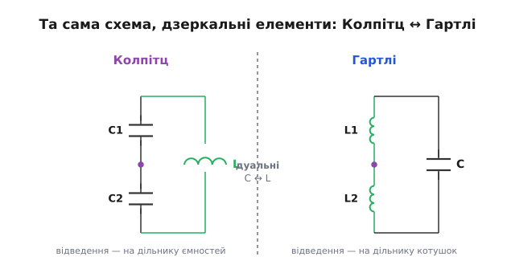
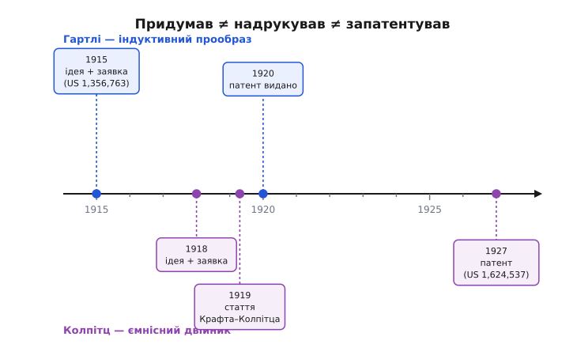

# 📜 Як народився ємнісний двійник: Колпітц і Гартлі

Коли тримаєш у руках сучасну радіосхему й бачиш у ній два конденсатори, що повертають сигнал на вхід транзистора, легко подумати, що так було завжди — мовляв, інженери просто взяли найзручніше рішення. Насправді ця конкретна форма генератора з'явилася не сама собою й не першою. Їй передувала майже дзеркальна схема — на котушках, а не на конденсаторах, — і двох інженерів, що працювали майже пліч-о-пліч в одній лабораторії, розділяють лише три роки. Історія тут варта уваги не датами, а тим, **як саме** одна гарна ідея породжує свою протилежність, і чому протилежність зрештою перемагає оригінал. А ще — тим, як легко в таких історіях сплутати три різні речі: коли щось **придумали**, коли про це **розповіли всім**, і коли на нього видали **патент**. Для Колпітца ці три дати розкидані аж на дев'ять років, і кожна означає щось своє.

## Лабораторія, де все відбувалося

Щоб зрозуміти, чому обидві схеми народилися в одному місці й майже в один час, треба знати, що це було за місце. На початку 1910-х компанія Western Electric — виробниче й дослідницьке крило американської телефонної системи Bell — узялася за задачу, що тоді здавалася на межі можливого: передати людський голос **без дроту** через океан. Телефоном уже говорили через увесь континент по мідних лініях; наступним рубежем була радіотелефонія — голос на радіохвилі.

Ця задача була не про один винахід, а про цілий букет нових інженерних проблем одразу. Треба було навчитися робити **електронну лампу** (тоді ще новинку) надійним підсилювачем; треба було будувати передавачі, що дають чисту несійну хвилю потрібної частоти; треба було робити приймачі, чутливі настільки, щоб вихопити кволий сигнал з-за океану. Саме під цю програму Western Electric зібрала в своїй дослідницькій лабораторії сильних інженерів — і саме звідти, з потреби мати **джерело чистого синусоїдального сигналу на радіочастоті**, виросли обидві схеми, про які йдеться.

> 🔧 **Навіщо це.** Майже всі класичні схеми аналогової електроніки народилися не з абстрактного інтересу, а з конкретної інженерної потреби, яку хтось мусив закрити «вчора». Генератор Колпітца — не виняток: за ним стоїть цілком прозаїчна задача дати передавачеві й приймачеві стабільну несійну частоту. Коли бачиш у схемі дивну на перший погляд деталь, майже завжди корисно спитати: «яку реальну проблему це закривало в ту мить, коли його придумали».

## Гартлі та індуктивний прообраз

Першим був **Ральф Гартлі** (англ. Ralph Vinton Lyon Hartley; американець, народився 1888 року в містечку Спрус у штаті Невада, помер 1970-го). Освіту здобув незвичну для радіоінженера того часу: спершу університет штату Юта, далі — як стипендіат Родса — Оксфорд, де отримав ще два дипломи. До Western Electric прийшов 1913 року дослідником, і вже 1915-го відповідав за приймальну частину тих самих трансатлантичних радіотелефонних випробувань Bell.

Саме під цю роботу Гартлі й винайшов свій генератор. Ідея, яку він заклав, дуже фізична. Щоб коливання трималося само собою, треба повертати частину сигналу з виходу підсилювача назад на вхід — і повертати **в потрібній фазі**. Гартлі взяв котушку коливального контуру й зробив від неї **відведення** десь посередині — фактично розділив котушку на дві частини. Точка-відведення стає спільною опорою; відносно неї один кінець котушки гойдається вгору саме тоді, коли другий гойдається вниз. Ось вам потрібна протифаза, узята «безплатно» з самої геометрії котушки. Знімаєш сигнал з одного кінця, повертаєш на вхід — і петля замикається синфазно.

> 🔧 **Навіщо це.** Тут уже видно головний прийом, спільний для обох схем: **дільник напруги, у якого два виходи в протифазі**. Розрізати реактивний елемент навпіл і взяти середню точку за опору — ось і весь фокус, з якого складається зворотний зв'язок генератора. Гартлі зробив це на котушці; усе подальше — це та сама думка, перенесена на інший елемент.

Гартлі додав до цього ще одну важливу річ — схему **нейтралізації**, що гасила паразитне «спів» (англ. singing) тріода через його внутрішню ємність між електродами. Лампа того часу мала прикру властивість самозбуджуватися там, де не треба, і вміння це приборкати було не менш цінним, ніж сам генератор. Під час Першої світової Гартлі заклав і основи звукових пеленгаторів напрямку — але це вже інша гілка його роботи.

Патентну заявку на генератор Гартлі подав **1 червня 1915 року**; патент США № 1 356 763 видали йому аж **26 жовтня 1920-го**. Зверніть увагу на цей розрив у п'ять років між заявкою й видачею — він нам ще знадобиться, бо в Колпітца історія з датами виявиться ще заплутанішою.

## Колпітц і ємнісний двійник

Другий герой — **Едвін Колпітц** (англ. Edwin Henry Colpitts). Тут варто бути точним щодо походження, бо його легко записати просто в «американці»: Колпітц народився 1872 року в містечку Пойнт-де-Б'ют у канадській провінції Нью-Брансвік, тобто за громадянством він був **канадець, що став американцем** — джерела прямо подають подвійне, канадо-американське громадянство. До американської телефонної компанії він прийшов ще 1899 року, а з 1907-го працював у Western Electric, де доріс до керівника дослідницького напряму (а згодом, коли дослідні підрозділи Western Electric улилися в Bell Labs, — до високих посад уже там). Помер 1949 року в Нью-Джерсі.

Колпітц подивився на схему Гартлі й поставив природне запитання інженера, що любить симетрію. Якщо протифазне відведення можна взяти з **розрізаної котушки**, то чому не взяти його з **розрізаного конденсатора**? Адже конденсатор і котушка — у певному сенсі протилежності: там, де один накопичує енергію в електричному полі, другий накопичує її в магнітному; там, де через один струм випереджає напругу, через другий — відстає. Якщо поміняти місцями всі котушки й конденсатори в схемі Гартлі, мала б вийти схема, що робить **те саме**, тільки навпаки.

І вона вийшла. Замість однієї розрізаної котушки — **два послідовні конденсатори** з відведенням між ними; замість двох частин котушки й одного конденсатора в контурі — одна котушка й ємнісний дільник. Так народився **ємнісний двійник** генератора Гартлі — те, що ми тепер звемо генератором Колпітца.

> 🔧 **Навіщо це.** Прийом «узяти готову схему й замінити в ній усі C на L та всі L на C» — не випадковий трюк, а вияв глибокої симетрії в самій теорії кіл, що зветься **дуальністю**. Котушка й конденсатор у рівняннях поводяться як дзеркальні відображення одне одного, тож майже до кожної схеми на реактивних елементах існує її двійник, що працює за тією самою логікою з переставленими ролями. Уміння побачити двійник — потужний інженерний інструмент: іноді саме дзеркальна версія виявляється практичнішою, як тут і сталося.

Те, що ці дві схеми — електричні двійники, не пізніша вигадка істориків: це впізнавана математична властивість, і в довідниках їх так і подають парою. У статті про сам генератор ця дуальність розписана детально — [чому переставлені C і L дають ту саму поведінку](topic:electronics/colpitts-oscillator). Тут важливе інше: двійник не просто повторив оригінал, а виявився **кращим** для головного застосунку. Розберімо чому.

## Чому ємнісна версія витіснила індуктивну

На перший погляд обидві схеми рівноправні — роблять те саме, лише різними елементами. Але інженерна практика їх розсудила досить однозначно: на радіочастоті майже скрізь перемогла версія Колпітца. Причина не в красі ідеї, а в дуже приземлених властивостях реальних деталей.

**Конденсатор зробити точним легше, ніж котушку.** Це ключове. Конденсатор — пара провідників із діелектриком між ними; його ємність задається геометрією, яку легко витримати, і він буває дуже стабільним та дешевим. Котушка ж — деталь капризна: її індуктивність залежить від того, як саме намотано дріт, від осердя, від температури, від близькості сусіднього металу, що наводить вихрові струми. А Гартлі потребує **двох спарених** котушок (точніше, однієї з точним відведенням) — і зробити їх однаковими та передбачуваними ще важче, ніж одну. Колпітцу ж потрібні дві котушки не треба зовсім: котушка одна, а ділиться натомість пара конденсаторів, з якими таких клопотів немає.

**Паразитні ємності монтажу грають за Колпітца й проти Гартлі.** Це тонший, але дуже практичний момент. На високій частоті будь-яке з'єднання, будь-який вивід транзистора, будь-яка доріжка має власну **паразитну ємність** — небажану, але неминучу. Питання в тому, **куди** вона потрапляє в схемі. У Колпітці контур і так визначається конденсаторами C1 і C2; паразитна ємність монтажу просто **додається** до них, стаючи частиною того ж дільника. Вона трохи зсуває частоту — і все; її можна врахувати або підстроїти. У Гартлі ж контур визначається котушками, а паразитні ємності виявляються **чужорідним** елементом, що сидить там, де його не планували, і псує роботу контуру непередбачувано. Іншими словами, на радіочастоті паразити в Колпітці **вбудовуються** в схему, а в Гартлі **заважають** їй.

```
Колпітц:   Cконтуру = C1, C2  +  Cпаразитна   → паразит ДОДАЄТЬСЯ до того,
                                                  що й так задає частоту
Гартлі:    Lконтуру = L1, L2,  а Cпаразитна    → паразит сидить ОКРЕМО й
                                                  псує те, що задано котушками
```

З цих двох причин — простіші й стабільніші деталі плюс «дружні» паразити — ємнісний двійник і витіснив оригінал там, де йдеться про десятки й сотні мегагерц: гетеродини приймачів, несійні частоти передавачів, тактові джерела радіоканалу. Гартлі не зник — він і досі трапляється, особливо там, де зручніше мати одну котушку з відведенням, — але «робочим конем» радіочастоти став саме Колпітц.


*Дзеркальна пара. У Гартлі відведення беруть із дільника двох котушок, а паралельно стоїть конденсатор; у Колпітца все навпаки — дільник із двох конденсаторів, паралельно одна котушка. Та сама логіка зворотного зв'язку, переставлені ролі C і L. Саме «ємнісний» бік пари виявився практичнішим, бо точні конденсатори зробити легше за спарені котушки, а паразитні ємності монтажу в ньому стають частиною контуру, а не завадою.*

## Три дати, які не можна плутати

Тепер — та частина історії, заради якої її варто розповідати уважно. Коли кажуть «Колпітц винайшов свій генератор», за цим ховаються **три різні події**, рознесені в часі, і кожна означає щось своє. Сплутати їх — типова пастка будь-якої історії техніки.

Перша подія — **ідея й патентна заявка**. Колпітц подав заявку на свій генератор **1 лютого 1918 року**. Це момент, коли схема вже існувала на папері й він застовпив на неї пріоритет. Уже тут видно, що ємнісна версія з'явилася лише на три роки пізніше за індуктивну Гартлі (заявка 1915-го) — не покоління, а кілька років роботи в сусідніх кабінетах однієї лабораторії.

Друга подія — **перша публікація**, тобто момент, коли про схему дізналася ширша інженерна спільнота. Уперше генератор Колпітца описано не в патенті, а в **статті, яку Колпітц написав разом з Едвардом Крафтом** (англ. Edward B. Craft) **1919 року**. Стаття звалася «Радіотелефонія» (англ. "Radio Telephony") і вийшла в Transactions of the American Institute of Electrical Engineers — її доповіли на зимовій конференції Інституту в Нью-Йорку **21 лютого 1919 року**. Це був широкий огляд того, чого досягли в радіотелефонії за попередні роки, зокрема й під час війни; схема-генератор фігурувала там як один із технічних елементів цієї роботи, а не як гучно проголошений окремий винахід.

Третя подія — **видача патенту**. Патент США № 1 624 537 «Oscillation Generator» Колпітцу видали лише **12 квітня 1927 року** й передали (за звичаєм того часу для працівників) компанії Western Electric. Між заявкою 1918-го та видачею 1927-го минуло аж **дев'ять років** — патентне відомство розглядало справу довго, як це нерідко бувало з фундаментальними заявками тієї епохи.


*Три різні події на одній шкалі. У Гартлі ідея й заявка (1915) відділені від видачі патенту (1920) п'ятьма роками. У Колпітца розрив іще промовистіший: заявку подано 1918-го, перша публікація (стаття Крафта–Колпітца) — 1919-го, а патент видано аж 1927-го. «Придумав», «розповів усім» і «отримав патент» — це три окремі дати, і змішувати їх не можна.*

Чому це не дрібниця? Бо залежно від того, **яку** з трьох дат узяти, історія звучить по-різному. Скажеш «Колпітц винайшов генератор 1927 року» — і вийде, ніби ємнісна версія з'явилася на дванадцять років пізніше за Гартлі, мало не в іншу епоху; а насправді він її придумав ще 1918-го, лише за три роки після колеги. Скажеш «1919 року» — і сплутаєш появу схеми з її першим публічним описом. Точна відповідь: **придумав і подав заявку 1918 року, уперше описав публічно 1919-го, отримав патент 1927-го**. Кожна дата правдива, але про різні речі.

> 🔧 **Навіщо це.** Ця трійця — ідея / публікація / патент — спливає в історії майже кожного винаходу, і плутанина між ними породжує безліч хибних тверджень про «хто перший». Патент фіксує **пріоритет ідеї** (за датою заявки, не видачі!); публікація фіксує **момент, коли знання стало спільним**; а сам факт, що схема запрацювала, може передувати обом. Коли наступного разу читатимеш «винайдено в такому-то році», варто спитати: рік **чого саме** — задуму, статті чи папірця з печаткою? Відповіді часто розходяться на роки.

## Що тут легенда, а що факт

Наостанок варто чесно відмежувати тверде від хисткого, бо історія техніки рясніє приписуваннями «з пам'яті».

**Тверді факти** (підтверджені патентними документами й довідниками): обидва інженери працювали в дослідницькій лабораторії Western Electric; Гартлі подав заявку на індуктивний генератор 1 червня 1915 року (патент США 1 356 763, виданий 26 жовтня 1920-го); Колпітц подав заявку на ємнісну версію 1 лютого 1918 року (патент США 1 624 537 «Oscillation Generator», виданий 12 квітня 1927-го, переданий Western Electric); схему вперше описано публічно в статті Крафта й Колпітца «Радіотелефонія» 1919 року. Те, що дві схеми є електричними двійниками, — не переказ, а впізнавана математична властивість.

**Слизьке місце, де джерела розходяться.** У деяких популярних довідках трапляється, ніби Колпітц «запатентував генератор 1920 року». Це майже напевно помилка: сам патентний документ і патентні бази однозначно дають дату видачі **1927**, а заявку — **1918**. Звідки взялося «1920», сказати важко — можливо, переплутали з датою патенту Гартлі (теж 1920) або з якоюсь проміжною подією. У такому випадку віримо **первинному джерелу** — самому патенту, — а не вторинному переказу: 1918 (заявка) і 1927 (видача).

**Чого не варто домислювати.** Спокусливо уявити драматичну сцену — мовляв, Колпітц побачив схему Гартлі й тут-таки, за вечір, накреслив дзеркальну версію. Документи такої сцени не підтверджують; вони фіксують лише дати заявок. Що між цими датами справді відбувалося в головах і на дошках двох інженерів, ми точно не знаємо, тож подавати красиву реконструкцію за факт не будемо. Достеменно відоме інше — і цього достатньо: дві дуальні схеми народилися в одній лабораторії з різницею в три роки, і практичніший із двійників, ємнісний, зрештою став стандартом радіочастоти.
