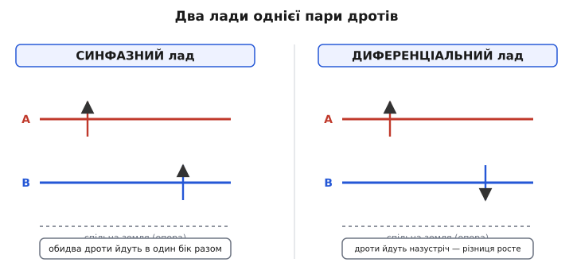
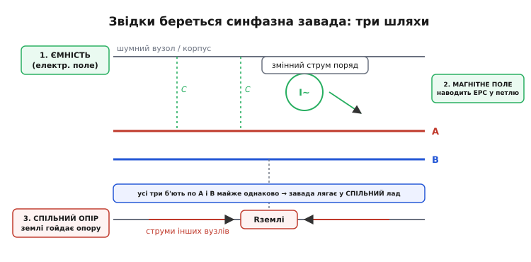
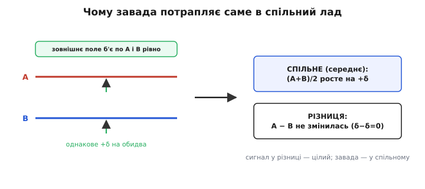
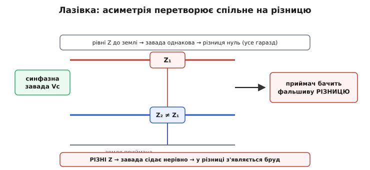

# Синфазна і диференціальна завади

Поставте простий дослід уявою. Той самий шматок бруду — наведений на пару дротів вольт завади — в одному колі не псує нічого, а в сусідньому знищує вимірювання вщент. Деталі однакові, завада однакова, а наслідок протилежний. Уся точна аналогова техніка тримається на розумінні, **чому** так, і зводиться це до одного питання: яким саме чином завада сидить на двох дротах — **разом** чи **назустріч**? Бо завада на парі проводів буває двох цілком різних сортів, і боротися з ними доводиться по-різному.

Ці два сорти й мають імена: **синфазна завада** (англ. *common-mode* — «спільного ладу», від лат. *communis* — спільний) і **диференціальна завада** (англ. *differential-mode*, від лат. *differentia* — різниця). Один сорт майже завжди можна викинути дешево й начисто; другий — лише важко й не до кінця. Тож перше, що треба навчитися робити з будь-якою завадою на двох дротах, — це впізнати, до якого ладу вона належить.

### Два лади однієї пари

Візьмемо пару проводів — A і B — і дві напруги на них, V_A і V_B, відлічені від спільної землі. Здавалося б, це дві окремі величини, і все. Та для пари проводів природніше дивитися інакше: розкласти ці дві напруги на дві **інші**, кожна зі своїм фізичним змістом.

Перша — **синфазна** складова: спільний для обох рівень, тобто їхнє середнє. Це те, наскільки **обидва** проводи разом підняті над землею:

```
Vс = (V_A + V_B) / 2
```

Друга — **диференціальна** складова: різниця проводів, тобто наскільки вони розійшлися **один від одного**:

```
Vд = V_A − V_B
```

Будь-яку пару (V_A, V_B) можна точно розкласти на ці дві частини й скласти назад. Якщо обидва проводи піднялися на 1 В, а різниці між ними немає — це чистий синфазний стан. Якщо A піднявся на 5 мВ, а B на стільки ж опустився — різниця є, а спільне середнє не зрушилось: це чистий диференціальний стан. У житті завжди намішано і те, й те: маленька різниця гойдається на великому спільному тлі.


*Зліва — синфазний лад: A і B рухаються в один бік разом, їхня різниця стоїть. Справа — диференціальний: дроти йдуть назустріч, спільне середнє стоїть, а різниця росте. Це не два різні кола, а два погляди на одну й ту саму пару напруг.*

Тепер ключове, заради чого весь цей розклад затівався. **Завада — це теж напруга на тих самих двох дротах, тож вона теж належить до котрогось ладу.** Наводка, що підняла обидва дроти однаково, — синфазна: вона вся пішла у Vс і не зачепила Vд. Наводка, що штовхнула A в один бік, а B в інший, — диференціальна: вона сіла у Vд. І ось чому ця класифікація — не формальна гра: переважна більшість приймачів слухає **тільки різницю** Vд і не зважає на спільне Vс. Тому синфазна завада для такого приймача невидима, а диференціальна — сідає просто поверх корисного сигналу. Один сорт бруду проходить повз, другий влучає в ціль.

> 🔧 **Навіщо це.** Перше, що варто зробити з будь-яким «незрозумілим» шумом у вимірюванні, — спитати, у якому він ладі. Гудіння 50 Гц, що однаково на обох входах, і голка від імпульсного перетворювача, що б'є по входах нерівно, — це дві різні задачі з різними ліками. Плутати їх — значить лікувати не ту хворобу: ставити фільтр там, де потрібна симетрія, чи навпаки.

### Чому завада майже завжди синфазна

Тут і ховається перша добра новина. Якби природа сипала заваду навмання — то в спільне, то в різницю, — рятунку не було б. Але вона так не робить: **переважна частина наведеного бруду сідає саме у синфазний лад**, і то не випадково, а через сам спосіб, у який завада потрапляє на дроти. Шляхів цих три, і всі троє б'ють по обох дротах **майже однаково**.


*Три механізми наводки: ємність до шумного вузла чи корпусу (електричне поле), магнітне поле сусіднього змінного струму й падіння напруги на спільному шматку землі. Спільне в усіх трьох — вони впливають на A і B приблизно однаково, тож завада лягає у спільний лад.*

Перший шлях — **ємнісний**. Між нашими дротами й будь-яким шумним вузлом поряд (силова шина, корпус, тактова доріжка) є паразитна [ємність](topic:electronics/capacitive-reactance): дроти й сусід поводяться як обкладки крихітного конденсатора. Змінна напруга на сусідові «штовхає» крізь цю ємність струм у наші дроти — це [ємнісна наводка](topic:physics/capacitive-coupling). А оскільки обидва наші дроти лежать поряд, на майже однаковій відстані від джерела, ємність до кожного майже однакова — і наводка сідає на A і B рівно. Спільне зросло, різниця ні.

Другий шлях — **магнітний**. Поряд тече змінний струм (двигун, перетворювач, інша лінія). Його змінне магнітне поле пронизує петлю, яку утворюють наші дроти, і за законом індукції наводить у ній напругу — це [індуктивна наводка](topic:physics/inductive-coupling). Тут уже тонше: магнітне поле наводить різницю по петлі, тож само по собі воно дає радше диференціальну добавку. Та якщо вести дроти щільно поряд, а ще краще [витою парою](topic:electronics/twisted-pair), петля між ними стискається майже в нитку, охоплений нею потік падає майже до нуля — і магнітна наводка теж зводиться до спільної. Саме тому вита пара — не забаганка, а спосіб **загнати** магнітну заваду в синфазний лад, де її потім легко відкинути.

Третій шлях — **спільний опір землі**. Корисний сигнал відлічують від землі, а земля — той самий провід, яким течуть зворотні струми всіх інших вузлів: цифри, що клацає мільйони разів на секунду, реле, силового каскаду. Цей провід має ненульовий опір та індуктивність, тож чужі струми створюють на ньому падіння напруги — земля приймача гойдається відносно землі давача (споріднене явище — [петля по землі](topic:electronics/ground-loop)). А раз гойднулась опора, від якої відлічують **обидва** дроти, то піднялись обидва разом: знову синфазно.

Підсумуємо причину одним реченням: **завада сідає у спільний лад тому, що всі головні механізми наводки діють на обидва дроти однаково** — вони ж поряд, в одному полі, з однаковою опорою. Це не закон природи, а наслідок геометрії, і саме тому ним можна керувати: тримай дроти симетрично — і бруд лишатиметься спільним.

### Чому це й рятує: приймач, що бачить лише різницю

Тепер з'єднаймо два спостереження, і вийде вся суть. Завада майже вся — у спільному ладі. А приймач для пари дротів — диференційний: він читає **різницю** V_A − V_B і не зважає на спільне середнє. Що тоді стається із синфазною завадою?

Хай на обидва дроти сіла однакова наводка δ. Тоді

```
провід A несе:  V_A + δ
провід B несе:  V_B + δ
різниця:   (V_A + δ) − (V_B + δ) = V_A − V_B
```

Завада **зникла** — не послабла, а скоротилася тотожно, бо однакове δ при відніманні зійшло нанівець. Корисна різниця V_A − V_B лишилась цілою. Ось чому розклад на лади — не абстракція: він прямо каже, яка частина бруду викинеться сама. Усе, що в спільному ладі, зникає на відніманні; усе, що в різницевому, лишається.


*Однакове +δ на обидва дроти підіймає лише спільне середнє (A+B)/2, а різниця A−B не змінюється (δ−δ=0). Корисний сигнал, що сидить у різниці, лишається цілим; завада, що осіла у спільному, відкидається приймачем.*

Це повертає весь принцип з ніг на голову порівняно з наївним очікуванням. Не треба **не пускати** заваду на дроти — це майже неможливо у брудному світі. Треба зробити так, щоб завада сідала у спільний лад, а корисне жило в різницевому, — і тоді диференційний приймач сам відділить одне від одного. Боротьба переноситься з «екранувати від бруду» на «тримати дроти симетричними, щоб бруд лишався спільним» — а це задача геометрії, і розв'язується вона куди надійніше. Саме на цьому стоїть [диференційна передача сигналу](topic:electronics/differential-signaling): сигнал навмисне кладуть у різницю двох дзеркальних проводів, а заваду лишають спільною.

Наскільки **повно** реальний приймач викидає спільне — то вже його власна чеснота, яку міряють одним числом, [коефіцієнтом придушення синфазного сигналу](topic:electronics/cmrr) (CMRR): у скільки разів він глушить спільне сильніше за різницю. Ідеальний приймач мав би CMRR нескінченний — геть не бачити спільного; реальний має велике, але скінченне, тож крихітна цівка синфазної завади все ж просочується на вихід. Але це вже про якість віднімання в конкретній мікросхемі; нас тут цікавить інше, тонше джерело біди, яке псує сигнал ще **до** того, як він дійде до приймача.

### Підступна лазівка: коли спільне перетворюється на різницю

Якщо синфазна завада така безпечна, звідки ж тоді береться бруд у добре зробленій диференційній лінії? Відповідь у тому, що «синфазна» вона лише доти, доки система **симетрична**. Будь-яка асиметрія перетворює частину спільного на різницю — а різницю приймач відрізнити від сигналу вже не може. Це явище зветься **перетворення ладів** (англ. *mode conversion*), і саме воно — головний прихований ворог.

Подивимось, як це працює. Синфазна завада тисне на обидва дроти однаково. Але «тисне однаково» ще не означає «наводить однаково»: скільки напруги осяде на кожному дроті, залежить від того, через який **опір** завада на нього потрапляє. Уявімо, що один дріт має опір до землі Z₁, а другий — інший, Z₂. Тоді та сама синфазна завада розділиться між дротами **по-різному**: на дроті з меншим опором осяде більше, на іншому менше. А різні напруги на двох дротах — це вже **різниця**. Спільна завада перетекла у диференціальну й сіла поверх сигналу.


*За рівних опорів до землі (Z₁ = Z₂) синфазна завада сідає на обидва дроти однаково й у різницю не потрапляє. Щойно опори розходяться, та сама завада ділиться нерівно — і приймач бачить фальшиву різницю, яку не відрізнить від корисного сигналу.*

Ось чому в диференційній лінії важлива не дзеркальність сигналу, а **рівність опорів обох дротів до землі** — те, що називають **балансом** (англ. *balanced* — урівноважений). Придушення завади дає саме баланс: поки обидва дроти однаково «бачать» землю, спільне лишається спільним і скорочується на відніманні. Розбалансуй лінію — нерівні опори, кепський контакт, несиметричне розведення на платі — і відкриється лазівка, якою синфазна завада потече в різницю. Тому добрий монтаж диференційної пари — це насамперед гонитва за симетрією: однакова довжина, однакові опори, однакові ємності обох дротів до всього довкола.

Найгидкіше тут — підступність ефекту. Завада може бути ідеально синфазною, лінія — диференційною, приймач — з чудовим CMRR, а сигнал усе одно брудний, бо мікроскопічна асиметрія опорів злила частину спільного у різницю **ще до приймача**, де його CMRR уже безсилий. Скільки саме завади перетвориться — прямо рахується через відносний розбаланс опорів; точну формулу й живий приклад («розбаланс у 1% перетворює вольт синфазного на десяток мілівольтів диференціального бруду») розібрано в [🧮 вставці про перетворення ладів](topic:electronics/common-mode-noise/math-mode-conversion.md).

### Друга завада — диференціальна, яку так просто не викинеш

Досі ми тішилися, що завада майже завжди синфазна. «Майже» — бо буває й по-іншому. Частина бруду народжується одразу в **диференціальному** ладі: наведеною різницею, а не спільним підйомом. І ось ця завада — справді небезпечна, бо вона сидить у тій самій координаті, що й корисний сигнал, тож приймач, який бере різницю, відрізнити її не здатен у принципі. Для нього диференціальна завада **невідмінна** від сигналу.

Звідки вона береться? Здебільшого — з двох джерел. Перше — уже знайоме перетворення ладів: асиметрія перелила частину великої синфазної завади у різницю. Друге — пряма магнітна наводка на петлю пари, коли дроти розведені (не звита пара): змінне поле наводить по контуру саме різницеву напругу. Спільне для обох джерел те, що ні CMRR приймача, ні баланс лінії проти готової диференціальної завади вже не діють — вони працюють **до** того, як завада стала різницевою, а не після.

Тому ліки тут інші, і їх теж два. Перше — **не дати заваді стати диференціальною**: тримати лінію симетричною (щоб не було перетворення) і витою (щоб петля не ловила магнітне поле). Друге, якщо завада вже диференціальна, — давити її **за частотою**: ставити [фільтр](topic:electronics/rc-filter), що пропускає смугу корисного сигналу й ріже все поза нею. Це працює лише тоді, коли завада й сигнал розведені по частоті (повільне вимірювання — швидка голка-перешкода); якщо ж вони в одній смузі, фільтр викине разом із брудом і частину сигналу. Звідси простий висновок: **синфазну заваду перемагають симетрією, диференціальну — частотою**, і обидві лінії оборони потрібні водночас.

> 🔧 **Навіщо це.** Коли вимірювання шумить, перевіряйте оборону в правильному порядку. Спершу — чи синфазна завада справді лишається синфазною: вита пара, однакові опори, симетричне розведення (бо тут найбільший виграш найдешевше). Лише потім — фільтр проти того, що таки просочилось у різницю. Почати з фільтра, не закривши лазівку перетворення, — значить ловити заваду, яку легше було не впустити.

### Як заваду тримають у спільному ладі

Зведемо практику докупи — це лічені прийоми, і кожен б'є в один із трьох механізмів наводки чи в лазівку перетворення.

**Вита пара.** Скручені дроти стискають петлю між собою майже в нитку, тож магнітне поле наводить на обидва майже однаково — заганяє магнітну заваду у спільний лад. Заразом скрутка робить ємності обох дротів до всього довкола однаковими, тобто **балансує** лінію й закриває лазівку перетворення. Один дешевий прийом лікує одразу два механізми.

**Баланс опорів.** Свідомо роблять опори обох дротів до землі рівними — однакові резистори на кінцях, симетричне розведення доріжок, однакові навантаження. Це не дає синфазній заваді перетекти в різницю, хоч би якою великою вона була.

**Екранування.** Обплетення-екран навколо пари перехоплює електричне поле й відводить ємнісну наводку на землю, не пускаючи її на сигнальні дроти; деталі — у статті [екранування](topic:electronics/shielding). Проти магнітного поля голий екран майже безсилий — там рятує саме скрутка.

**Синфазний дросель.** Окрема й розумна штука: на спільний магнітопровід намотують **обидва** дроти пари так, що корисний (диференціальний) струм їхні поля гасить — і дросель його пропускає вільно, — а синфазний струм (що тече по обох дротах в один бік) їхні поля складає, і для нього дросель стає великою індуктивністю-перепоною. Виходить деталь, що **душить лише синфазну** заваду, не чіпаючи сигналу. Як це влаштовано, як його вмикають у лінію й де його межі — в [🔌 вставці про синфазний дросель](topic:electronics/common-mode-noise/comp-common-mode-choke.md).

Спільна нитка всіх прийомів одна: вони або **тримають** заваду в нешкідливому спільному ладі (вита пара, баланс, дросель), або **відводять** її ще до того, як вона сяде на сигнал (екран). Жоден не намагається героїчно витягти корисне з-під уже намішаного бруду — бо це програшна гра, і весь сенс розкладу на лади саме в тому, щоб до неї не дійшло.

### Worked-приклад: розпізнати лад завади в коді

Покажемо найпрактичніше — як мікроконтролер, що бере **два** канали АЦП (обидва дроти пари), сам розкладає виміряне на лади й одразу бачить, який бруд синфазний, а який диференціальний. Це не лише дає корисний сигнал, а й слугує діагностикою: якщо синфазне раптом велике — лізе наводка по спільному; якщо стрибнула різниця — або сигнал, або диференціальна завада.

**Умова.** Прямий канал виміряв 2.040 В, інверсний 1.960 В — корисна різниця 80 мВ. Аж тут поряд увімкнувся перетворювач і підняв **обидва** канали на 0.500 В наводки. Перевірмо, що різницеве читання її не помітить, а синфазний рівень її впіймає.

:::tabs
```cpp
#include <cstdio>

// Два канали АЦП міряють обидва дроти пари.
// Корисний сигнал — РІЗНИЦЯ; синфазний рівень рахуємо як середнє — для діагностики.
static float v_diff(float a, float b) { return a - b; }            // різницева складова
static float v_comm(float a, float b) { return (a + b) * 0.5f; }   // синфазна складова

int main() {
    float a = 2.040f, b = 1.960f;          // дроти A і B, В

    float d0 = v_diff(a, b);               // = 0.080 В — корисний сигнал
    float c0 = v_comm(a, b);               // = 2.000 В — спільний рівень

    // На ОБИДВА дроти сіла однакова синфазна наводка 0.500 В:
    float noise = 0.500f;
    float a1 = a + noise;                  // 2.540 В
    float b1 = b + noise;                  // 2.460 В

    float d1 = v_diff(a1, b1);             // (2.540 − 2.460) = 0.080 В — без змін!
    float c1 = v_comm(a1, b1);             // (2.540 + 2.460)/2 = 2.500 В — уся наводка ТУТ

    std::printf("сигнал (різниця): %.3f -> %.3f В\n", d0, d1);   // 0.080 -> 0.080
    std::printf("спільне (середнє): %.3f -> %.3f В\n", c0, c1);  // 2.000 -> 2.500
    return 0;
}
```
```python
# Два канали АЦП міряють обидва дроти пари.
# Корисний сигнал — РІЗНИЦЯ; синфазний рівень рахуємо як середнє — для діагностики.
def v_diff(a, b):
    return a - b                           # різницева складова

def v_comm(a, b):
    return (a + b) * 0.5                    # синфазна складова

a, b = 2.040, 1.960                        # дроти A і B, В

d0 = v_diff(a, b)                          # = 0.080 В — корисний сигнал
c0 = v_comm(a, b)                          # = 2.000 В — спільний рівень

# На ОБИДВА дроти сіла однакова синфазна наводка 0.500 В:
noise = 0.500
a1 = a + noise                             # 2.540 В
b1 = b + noise                             # 2.460 В

d1 = v_diff(a1, b1)                        # (2.540 − 2.460) = 0.080 В — без змін!
c1 = v_comm(a1, b1)                        # (2.540 + 2.460)/2 = 2.500 В — уся наводка ТУТ

print(f"сигнал (різниця): {d0:.3f} -> {d1:.3f} В")    # 0.080 -> 0.080
print(f"спільне (середнє): {c0:.3f} -> {c1:.3f} В")   # 2.000 -> 2.500
```
:::

**Висновок.** Корисне читання `d1` лишилось рівно 0.080 В — синфазна наводка на нього не вплинула, бо при відніманні однакове δ скоротилось. Уся завада осіла у `c1`, піднявши спільний рівень з 2.000 до 2.500 В. Мало того, що сигнал уцілів, — підстрибле синфазне число одразу **показує**, що лізе наводка по спільному ладу, ще й вимірює її. Єдина умова справності — щоб обидва канали лишались у вікні, яке АЦП здатен виміряти (тут до 3.3 В): 2.540 В усередині, тож усе чесно. Підстрибни наводка до 1.5 В — прямий канал уперся б у стелю АЦП, симетрія зламалася б, і та сама завада перетворилась би на фальшиву різницю — рівно той ефект перетворення ладів, проти якого не допомагає вже жодне віднімання.

### На чому це тримається

Синфазна й диференціальна — це не два різні сигнали, а два **лади**, на які розкладають будь-яку пару напруг на двох дротах: спільне середнє Vс = (V_A + V_B)/2 і різниця Vд = V_A − V_B. Завада теж належить до котрогось ладу, і в цьому вся справа. Майже весь наведений бруд сідає у синфазний лад — бо три головні механізми наводки (ємнісний, магнітний, спільний опір землі) б'ють по обох дротах однаково, — а тому диференційний приймач, що читає лише різницю, викидає його сам. Наскільки повно викидає — каже [CMRR](topic:electronics/cmrr); чому навмисне кладуть сигнал у різницю — [диференційна передача](topic:electronics/differential-signaling).

Уся хитрість — у двох межах. Перша: спільне лишається спільним лише доти, доки лінія **симетрична**; найменша асиметрія опорів перетворює частину синфазної завади на диференціальну, проти якої віднімання вже безсиле. Друга: диференціальну заваду — хоч народжену перетворенням, хоч прямою магнітною наводкою — приймач не відрізнить від сигналу, і давити її доводиться вже за частотою, фільтром. Звідси й увесь практичний підсумок: **тримай дроти симетричними й витими, щоб завада лишалась нешкідливо спільною, а що таки просочилось у різницю — ріж фільтром.** Хто бачить лади, той бачить і де чекати біду, і яким із кількох дешевих прийомів її спинити.
