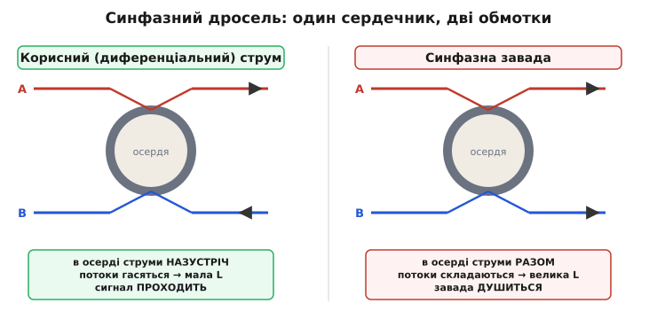
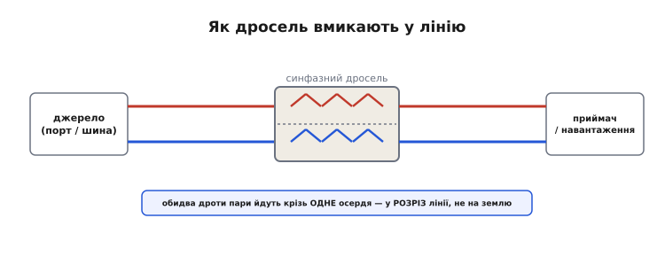
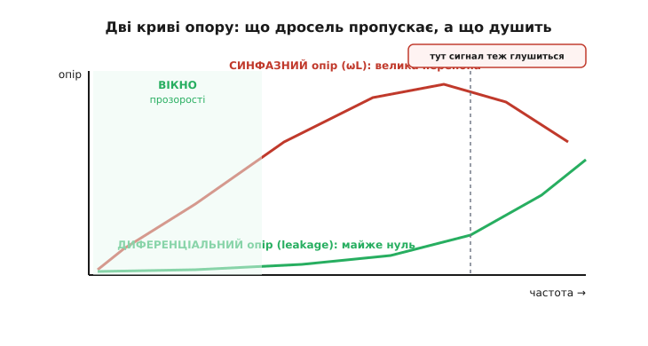

# 🔌 Синфазний дросель

Уявіть, що вам треба збудувати ворота, які пропускають своїх і затримують чужих, але «свій» і «чужий» виглядають однаково — це той самий струм, ті самі два дроти, та сама напруга. Розрізнити їх, здавалося б, ніяк. І все ж є деталь, яка робить рівно це: пропускає корисний струм майже без опору, а заваду зустрічає стіною. Вона не вимірює частоту, не дивиться на форму, не має ні живлення, ні розуму — лише шматок феритового кільця з двома дротами на ньому. І весь фокус — у тому, як саме ці два дроти намотані.

Деталь зветься **синфазний дросель** (англ. *common-mode choke* — «дросель спільного ладу»; *choke* — буквально «душитель», бо він душить заваду; від лат. *communis* — спільний). Розберемо її як клас: що це за пристрій, як він улаштований, як його вмикають у лінію, що́ читати в його паспорті й де ховаються типові граблі, через які добра на вигляд деталь раптом перестає працювати.

## Що це за клас пристрою

Синфазний дросель — це **пасивний двопровідний фільтр**, який стоїть прямо в розрізі пари дротів (живлення чи даних) і по-різному поводиться з двома сортами струму, що тими дротами течуть. Корисний струм він пропускає, ніби його там і немає; синфазну заваду зустрічає великою індуктивністю й глушить. Жодного джерела живлення, жодного активного елемента — уся «розумність» захована в геометрії намотування.

Щоб зрозуміти, як одна деталь розрізняє два струми, треба спершу твердо тримати в голові, що це за два струми. По парі дротів A і B будь-який струм можна розкласти на дві складові — рівно як напругу розкладають на спільну й різницеву. **Диференціальний** (корисний) струм тече по A в один бік і повертається по B у протилежний — це нормальний робочий струм петлі «туди-назад». **Синфазний** струм тече по обох дротах **в один і той самий бік** одночасно, а повертається десь стороною — через землю, через паразитні ємності, через корпус. Саме синфазний струм і є тим брудом, що його наводить зовнішнє поле на обидва дроти однаково.

> Глибше про те, чому завада майже завжди сідає саме у спільний лад і чому диференційний приймач її не помічає, — у статті-власниці [Синфазна і диференціальна завади](book:electronics/common-mode-noise). Коротко: три головні механізми наводки (ємнісний, магнітний, спільний опір землі) б'ють по обох дротах однаково, тож завада лягає у спільну складову, а корисний сигнал навмисне кладуть у різницеву.

Ось ключ до всього пристрою: **диференціальний і синфазний струми течуть по парі дротів у різній геометрії** — один туди-назад, другий разом в один бік. А раз геометрія різна, то й магнітне поле, яке вони створюють, різне. І якщо намотати обидва дроти на спільний магнітопровід **правильно**, цю різницю в полях можна перетворити на різницю в опорі. Саме це дросель і робить.

## Серце фокусу: біфілярне намотування

Уся хитрість — у способі намотування, який зветься **біфілярним** (від лат. *bi-* — два + *filum* — нитка): обидва дроти пари кладуть на одне спільне осердя (зазвичай феритове кільце-тороїд) **однаково й поряд**, виток до витка, так що вони утворюють дві ідентичні дзеркальні обмотки. Важлива не просто «два дроти на кільці», а їхня **взаємна орієнтація**: намотані вони так, щоб поля від двох сортів струму складалися протилежно.

Розглянемо два струми по черзі — і подивимось, що кожен робить із магнітним потоком в осерді.

**Диференціальний (корисний) струм.** Він входить по дроту A в один бік і виходить по дроту B у протилежний. Через біфілярне намотування це означає, що в осерді два витки женуть магнітний потік **назустріч один одному**. Потоки рівні за величиною (струм-бо той самий, він просто оббіг петлю) й протилежні за напрямом — тож вони **гасяться** майже до нуля. А раз результуючого потоку в осерді немає, то немає й індуктивності, яку цей струм відчув би: для диференціального струму дросель — майже голий дріт. Корисний сигнал проходить вільно, ніби осердя там і не лежить.

**Синфазний (завадний) струм.** Він тече по обох дротах **в один бік разом**. Тепер два витки в осерді женуть потік **в одну сторону** — і потоки **складаються**, подвоюючись. З'являється великий результуючий потік, а отже й велика індуктивність. Для синфазного струму дросель раптом перетворюється на серйозну перепону — індуктивний опір ωL, що росте з частотою. Чим швидша завада, тим сильніше її душить.


*Зліва — диференціальний струм: у спільному осерді його два потоки течуть назустріч і гасяться, тож індуктивність майже нульова й сигнал проходить. Справа — синфазний струм: потоки складаються, індуктивність велика, завада душиться. Одна й та сама деталь, два протилежні наслідки — усе вирішує, у який бік тече струм.*

Ось і весь фокус, розкритий до дна. Деталь не «вимірює» нічого й не «вирішує», кого пропускати. Вона просто додає магнітні потоки за законом фізики — а потоки самі складаються чи гасяться залежно від того, в якій геометрії тече струм. Корисний струм будує собі **нуль** індуктивності, завадний — **максимум**. Це не розумна фільтрація за частотою; це геометричне розрізнення за **ладом**, і саме тому воно таке надійне й дешеве.

> 🔧 **Навіщо це.** Звичайний дросель (одна котушка) на лінії живлення душив би все підряд — і заваду, і робочий струм, на якому падала б напруга й виділялося тепло. Синфазний дросель розв'язує саме цю проблему: він пропускає повний робочий струм без падіння (бо для диференціального струму його індуктивність майже нульова), а перепоною стає лише для синфазної завади. Тому його можна поставити навіть на сильнострумну шину живлення — він не «з'їсть» струм навантаження.

Точна аналогія — два веслярі в каное. Коли вони гребуть **назустріч** (один уперед, другий назад — диференціальний лад), човен крутиться на місці й нікуди не пливе: зусилля гасяться. Коли гребуть **в один бік разом** (синфазний лад), човен потужно йде вперед: зусилля складаються. Осердя — це «човен»: він сильно реагує на спільне веслування й майже не реагує на зустрічне. Аналогія ламається в одному: у каное зустрічне веслування марнує силу, а в дроселі зустрічні потоки нічого не марнують — корисна енергія сигналу спокійно проходить далі по дроту, повз осердя.

## Блок-схема: де він стоїть у тракті

Місце синфазного дроселя в системі — **на самому вводі**, там, де пара дротів заходить у пристрій (чи виходить із нього). Думайте про нього як про митницю на кордоні: усе, що в'їжджає по парі дротів, проходить крізь нього, і синфазний бруд тут затримують, ще до того як він розповзеться по платі.

```
   зовнішня пара                 ┌───────────────┐
   (живлення / дані)             │  СИНФАЗНИЙ     │        внутрішня
   A ───────────────────────────┤  ДРОСЕЛЬ       ├──────── схема
   B ───────────────────────────┤  (2 обмотки    ├──────── (приймач /
                                 │   на 1 осерді) │         навантаження)
        синфазна завада  ╳ ──────┤  душить CM,    │
        тут її глушить           │  пропускає DM  │
                                 └───────────────┘
```

Логіка розташування проста: заваду треба ловити **на вході**, поки вона ще зосереджена в парі дротів і не встигла розповзтися ємнісними зв'язками по всій платі. Тому синфазний дросель майже завжди — перший або один із перших елементів вхідного фільтра, поряд із роз'ємом. У ланцюжку EMC-фільтра живлення він зазвичай працює в парі з конденсаторами на землю: дросель піднімає синфазний опір лінії, а конденсатори дають синфазному струму куди стекти — разом вони утворюють синфазний LC-фільтр. Докладніше про повний вхідний фільтр — у статті [ЕМС-фільтрація на вводах живлення](book:electronics/emc-filtering).

## Типова розпіновка: чотири виводи, дзеркальна пара

Фізично клас має **чотири виводи** — по два на кожну обмотку, бо обмоток дві. Маркують їх так, щоб видно було, який вивід якій обмотці належить і де в кожної «початок»:

```
        обмотка 1
   1 ●───⊃⊃⊃⊃⊃───● 4        ← дріт A: вхід (1) → вихід (4)
                            
   2 ●───⊃⊃⊃⊃⊃───● 3        ← дріт B: вхід (2) → вихід (3)
        обмотка 2
        (на тому самому осерді)
```

Ключове в розпіновці — **фазування** обмоток (де в кожної початок), бо саме від нього залежить, складатимуться потоки від синфазного струму чи гаситимуться. Якщо переплутати фазу однієї обмотки — увімкнути її «навиворіт», — деталь почне робити рівно протилежне: гасити корисний диференціальний струм і пропускати синфазну заваду. Тому на корпусі чи в паспорті завжди є позначка початку обмоток — крапка біля одного виводу кожної пари, риска чи інша мітка. Виводи **1–4** йдуть однією обмоткою (дріт A крізь осердя), **2–3** — другою (дріт B), а мітки кажуть, які кінці вважати «входами», щоб фази збіглися правильно.

Бувають і складніші корпуси: на одному осерді намотують не дві, а три чи чотири обмотки — для трифазного живлення чи для двох незалежних пар (наприклад, у мережевих трансформаторах розв'язки). Принцип той самий, лише обмоток і виводів більше.

## Перший байт: як його вмикають

«Перший байт» для пасивної деталі — це не код ініціалізації, а правильне фізичне ввімкнення. І тут є одне залізне правило, через яке найчастіше помиляються початківці.

**Синфазний дросель вмикають у РОЗРІЗ пари дротів — обидва дроти проходять крізь нього послідовно — а не між дротом і землею.** Дріт A заходить в обмотку 1 і виходить далі по лінії; дріт B заходить в обмотку 2 і виходить далі. Деталь стоїть **поперек тракту**, як ворота, через які мусять пройти обидва дроти. Це принципово відрізняє його від конденсатора-фільтра, який вмикають **між** дротом і землею (упоперек, шунтом). Дросель — послідовний елемент у лінії; конденсатор — паралельний на землю.


*Синфазний дросель стоїть у розріз лінії: обидва дроти пари йдуть крізь спільне осердя послідовно, між джерелом і навантаженням. Він не з'єднується із землею — на відміну від конденсатора-фільтра, який вмикають шунтом між дротом і землею.*

Звідси випливає практика монтажу. По-перше, **обидва дроти пари мають іти крізь дросель разом**, в одній деталі — інакше весь фокус зі складанням/гасінням потоків не спрацює; не можна намотати лише один дріт. По-друге, **напрям має збігтися з фазуванням**: вхід кожної обмотки — з боку джерела, вихід — до навантаження, за мітками початку. По-третє, дросель ставлять **якомога ближче до роз'єму** — там, де пара заходить у плату, поки завада ще не розповзлася.

А ось чого від нього **не** треба чекати: синфазний дросель не «прибирає шум узагалі». Він давить лише **синфазну** складову. Якщо завада вже диференціальна — сидить у різниці дротів, поверх корисного сигналу, — дросель її пропустить разом із сигналом, бо для диференціального струму він прозорий. Проти диференціальної завади потрібен інший засіб: або симетрія лінії (щоб синфазне не перетворювалось на диференціальне), або частотний [фільтр](book:electronics/rc-filter). Дросель — спеціаліст вузького профілю, і знати межу його профілю не менш важливо, ніж його силу.

## Як читати номінал: синфазна індуктивність

Головне число в паспорті класу — **індуктивність синфазного ладу** (англ. *common-mode inductance*), позначувана зазвичай як L_CM. Це та індуктивність, яку відчуває синфазний струм — тобто висота тієї перепони, що деталь ставить заваді. Чим вона більша, тим нижчу частоту дросель уже починає душити.

```
типові порядки L_CM:
  живлення мережі (50/60 Гц):   1 … 50 мГ   — глушити низькочастотний бруд
  лінії даних (USB, Ethernet):  10 … 200 мкГ — не зіпсувати швидкі фронти
```

Чому для повільного живлення індуктивність велика (мілігенрі), а для швидких даних — мала (мікрогенрі)? Бо синфазний опір — це ωL, він **росте з частотою**. На лінії даних завада високочастотна, тож і малої L досить, щоб дати велике ωL; а от велика L там лише зашкодила б — вона з'їла б і корисні швидкі фронти сигналу через leakage та паразитну ємність (про це нижче). На мережевому живленні навпаки: завада може бути порівняно низькочастотною, тож L беруть велику, щоб і на сотнях кілогерц мати помітне ωL.

Але самої L_CM мало. Те, що насправді характеризує деталь, — це **імпеданс синфазного ладу як функція частоти**, Z_CM(f), і його часто наводять графіком чи однією точкою «імпеданс на частоті X». Чому не досить однієї L? Бо в реального дроселя є паразитна ємність обмоток, і на високих частотах він поводиться вже не як індуктивність. Криву Z_CM(f) розберемо далі, бо саме вона ховає головні граблі класу.

Окрім L_CM, у паспорті дивляться:
- **робочий струм** (rated current) — який диференціальний струм деталь витримує без перегріву й насичення;
- **опір обмотки постійному струму** (DCR) — на сильнострумній шині на ньому впаде напруга й виділиться тепло;
- **імпеданс на заданій частоті** Z_CM @ f — практична міра «скільки душить»;
- **leakage-індуктивність** (диференціального ладу) — про неї окремо, це межа прозорості.

## Криву треба читати: де дросель перестає бути прозорим

Найважливіше, що відрізняє інженера від новачка в цьому класі, — розуміти, що **дросель прозорий для сигналу лише в певному вікні частот**, а поза ним перестає бути прозорим і починає псувати корисне. Подивимось на дві криві імпедансу — синфазного й диференціального ладу — і знайдемо межі цього вікна.


*Синфазний опір (для завади) росте як ωL, дає горб і завалюється після самрезонансу — бо паразитна ємність обмоток перебиває індуктивність. Диференціальний опір (для сигналу) майже нульовий у вікні прозорості, але повзе вгору на високих частотах через leakage-індуктивність. Дросель «прозорий» лише там, де нижня крива притиснута до нуля.*

**Синфазна крива (для завади) не росте без кінця.** Спершу Z_CM іде вгору як ωL — добре, заваду душить дедалі сильніше. Але в кожної обмотки є **паразитна ємність** між витками й між обмотками, і на якійсь частоті індуктивність із цією ємністю входять у резонанс — це **частота власного резонансу** (англ. *self-resonant frequency*, SRF). На SRF імпеданс максимальний (горб кривої), а **вище** SRF деталь поводиться вже не як котушка, а як конденсатор: Z падає з частотою. Тобто на дуже високих частотах синфазний дросель глушить **гірше**, ніж посередині діапазону. Звідси висновок: під свою заваду треба добирати дросель так, щоб горб імпедансу припав саме на її частоту, а не лежав нижче. (Спорідненим чином власний резонанс обмежує будь-яку котушку — докладніше у [паразитах котушки](book:electronics/inductor-parasitics).)

**Диференціальна крива (для сигналу) не лежить рівно на нулі.** В ідеалі для корисного струму Z = 0 — повна прозорість. Та зв'язок двох обмоток ніколи не буває 100-відсотковим, тож лишається маленька непогашена індуктивність — **leakage-індуктивність** (англ. *leakage inductance* — індуктивність розсіювання). Це той потік, що замкнувся повз спільне осердя й не погасився зустрічним. Для диференціального струму leakage — це послідовна паразитна індуктивність прямо в сигнальному тракті. На низьких частотах вона дрібна й не заважає, але з частотою її опір ωL_leak росте — і на швидких лініях даних ця крихітна індуктивність уже псує фронти: завалює їх, звужує «око» сигналу. Ось де закінчується вікно прозорості: **leakage-індуктивність — це межа, вище якої дросель перестає бути прозорим для сигналу й починає його калічити.**

Складемо обидві межі в одну картину. Вікно, у якому дросель робить рівно те, що треба, — це смуга частот, де синфазний опір уже великий (заваду давить), а диференціальний ще малий (сигнал не чіпає). Знизу вікно обмежує те, що на надто низьких частотах ωL_CM ще замале (заваду не давить); зверху — або самрезонанс (синфазний опір завалюється), або зростання leakage (сигнал псується). Добрий дросель для конкретної задачі — той, у якого це вікно накриває **і** смугу завади, **і** смугу корисного сигналу, не зачепивши останню.

> 🔧 **Навіщо це.** Класична помилка на швидкій лінії даних: узяли дросель із завеликою синфазною індуктивністю «щоб точно задушити», а він через leakage завалив фронти, і лінк перестав підніматися на повній швидкості. Для даних дросель добирають не за «чим більше L, тим краще», а за двома числами: достатнім Z_CM на частоті завади **і** достатньо малою leakage-індуктивністю, щоб не зачепити смугу сигналу. Перевіряти це треба не на око, а за кривими S-параметрів у паспорті.

## Типові граблі класу

Зберемо пастки, на яких добра на вигляд деталь раптом не працює, — і механізм кожної, бо без механізму це просто список.

**Насичення осердя.** Феритове осердя має межу: понад певну напруженість поля воно **насичується** — магнітна проникність різко падає, а з нею падає й уся індуктивність. Насичений дросель перестає душити заваду: він стає просто шматком дроту. Тонкість у тому, **який** струм насичує осердя. Збалансований диференціальний (робочий) струм осердя **не** насичує — його потоки гасяться, поля в осерді від нього майже немає, тож хоч скільки робочого струму проганяй, осердя лишається ненасиченим. Це і є та властивість, завдяки якій дросель ставлять на сильнострумну шину. Насичує осердя інше: **синфазний** струм (його потоки складаються) і **дисбаланс** пари — якщо струм по A і B не зовсім рівний (різні навантаження, витоки), різниця тече як неврівноважений потік і підмагнічує осердя. Тому грабля формулюється точніше, ніж «робочий струм насичує»: насичує **незбалансована** частина струму й синфазна складова; а ще leakage-шлях має свій, нижчий струм насичення. Споріднено з нелінійністю будь-якого осердя — [нелінійна індуктивність і насичення](book:electronics/nonlinear-inductor). На практиці: якщо дросель раптом «перестав фільтрувати» під навантаженням — перша підозра — насичення від дисбалансу чи від синфазного струму.

**Паразитна ємність обмоток.** Уже бачили: ємність між витками й між обмотками дає самрезонанс, вище якого деталь глушить гірше. Але є й другий бік цієї ємності — вона ж **пропускає** високочастотну заваду в обхід індуктивності. Те, що індуктивність не пускає по «проводу», ємність проводить «по повітрю» між витками. Тому на дуже високих частотах синфазний дросель сам собою тече: завада просочується крізь паразитну ємність, минаючи весь механізм. Лікують це або добором деталі з меншою міжобмотковою ємністю (більший розніс обмоток — але це піднімає leakage, отут компроміс), або доданням конденсаторів-шунтів, що перехоплюють те, що просочилось.

**Leakage-індуктивність як межа прозорості.** Розібрали вище: непогашений потік розсіювання — послідовна паразитна індуктивність у сигнальному тракті, що псує швидкі фронти. Грабля підступна тим, що на низьких частотах деталь здається ідеально прозорою, а біда вилазить лише на швидкості. Хто міряє лише на постійному струмі чи на низькій частоті, leakage не побачить — і здивується, чому швидкий лінк не працює. Між іншим, leakage й насичення тягнуть деталь у різні боки: щоб leakage була мала, обмотки треба класти щільно поряд (тісніший біфіляр) — але тісні обмотки мають вищу міжобмоткову ємність і нижчий пробій; рознесеш обмотки задля ізоляції — виросте leakage. Тому конструкція дроселя — завжди компроміс між малою leakage, малою ємністю і вимогами електробезпеки до зазору між обмотками.

**Переплутане фазування.** Найприкріша й найбанальніша грабля: обмотку ввімкнули «навиворіт» (переплутали початок-кінець). Тоді потоки складаються для **диференціального** струму й гасяться для **синфазного** — деталь робить точно протилежне задуманому: душить сигнал, пропускає заваду. Зовні все спаяно, деталь та сама — а працює навпаки. Тому мітки початку обмоток на платі звіряють особливо прискіпливо.

**Не той сорт завади.** Не грабля деталі, а грабля очікувань: синфазний дросель не допоможе проти **диференціальної** завади, бо для неї він прозорий. Якщо після встановлення дроселя шум не впав — можливо, завада з самого початку була диференціальна (наведена різниця, перетворення ладів через асиметрію), і ловити її треба іншим. Перш ніж ставити дросель, варто впевнитися, що завада таки синфазна.

## Варіації класу

Той самий принцип — два сорти струму, різна геометрія поля, спільне осердя — породжує кілька різновидів під різні задачі.

**За осердям.** Низькочастотні синфазні дроселі (мережеве живлення) намотують на осердя з **великою проникністю** — щоб дати велику L_CM при небагатьох витках; це фериті (марганцево-цинкові) чи нанокристалічні стрічкові осердя. Високочастотні (лінії даних) — на дрібніші феритові кільця з нижчою проникністю, але кращою поведінкою на високих частотах. Вибір осердя — це насамперед вибір, де лежатиме робоче вікно за частотою. Глибше про матеріал і його втрати — у [фериті й втратах в осерді](book:electronics/core-losses).

**За числом ліній.** Базовий клас — двопровідний (одна пара). Для трифазного живлення роблять трипровідні (три обмотки на одному осерді), де синфазним вважається струм, спільний для всіх трьох фаз. Для багатопарних інтерфейсів — складанки з кількох незалежних дроселів чи багатообмоткові осердя.

**За способом гасіння саме синфазного.** Близький родич за принципом — **феритова намистина** (англ. *ferrite bead*), яку надівають на пару дротів (або на джгут): вона теж дає синфазну індуктивність-перепону, але працює радше як **втратний** елемент — не стільки відбиває заваду назад, скільки перетворює її на тепло в осерді. Намистина простіша й дешевша, але слабша і працює лише на високих частотах; докладніше — [феритова намистина](book:electronics/ferrite-bead). Синфазний же дросель із двома повноцінними обмотками дає більший і керованіший імпеданс у ширшій смузі.

**Дросель плюс конденсатори — синфазний фільтр.** Сам по собі дросель лише **піднімає опір** синфазному струму, але нікуди його не зливає. Тому в реальному вхідному фільтрі його майже завжди ставлять разом із конденсаторами на землю (так званими Y-конденсаторами): дросель не пускає синфазний струм уперед, а конденсатори дають йому стекти на землю назад — разом виходить синфазний LC-фільтр із куди крутішим спадом, ніж сам дросель. Це вже композиція кількох деталей, і живе вона в темі [ЕМС-фільтрації на вводах живлення](book:electronics/emc-filtering).

## Підсумок класу

Синфазний дросель — це деталь, яка розрізняє корисний струм і заваду не за частотою й не за формою, а за **геометрією**: за тим, в якому ладі — спільному чи різницевому — тече струм по парі дротів. Біфілярне намотування обох дротів на спільне осердя робить так, що поля від диференціального (корисного) струму гасяться — і для нього дросель майже голий дріт, — а поля від синфазного струму складаються, даючи велику індуктивність-перепону, що душить заваду. Вмикають його **в розріз** пари (обидва дроти послідовно крізь одне осердя), не на землю, і якомога ближче до вводу. Головне число паспорта — синфазна індуктивність L_CM, але читати треба криву імпедансу Z_CM(f), бо в неї є горб і самрезонанс. А межі деталі тримають три паразити: **насичення** осердя (від дисбалансу й синфазного струму, не від збалансованого робочого), **паразитна ємність** обмоток (самрезонанс і просочування завади на високих) і **leakage-індуктивність** (та межа, вище якої дросель уже не прозорий для сигналу й псує фронти). Хто тримає в голові ці три межі, той добере дросель, що накриє і заваду, і сигнал, не зачепивши останнього.
