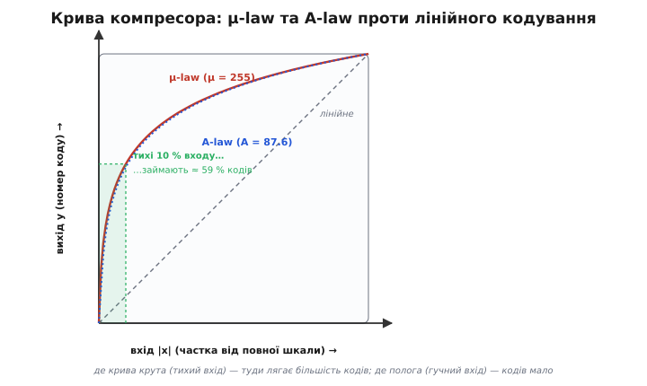
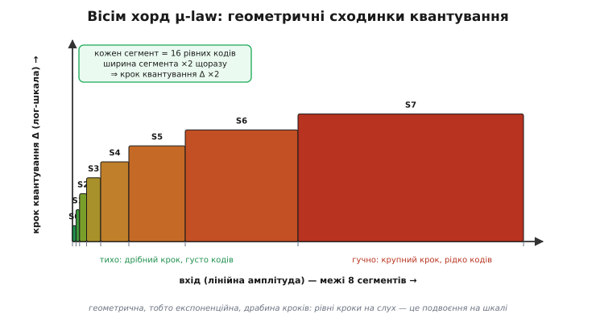

# Логарифмічне компандування: як 8 біт несуть діапазон чотирнадцяти

<preknowlist>
- [Логарифми](topic:math/logarithms) — що ln перетворює множення на додавання, а рівні кроки логарифма відповідають рівним множникам аргументу.
- [Закон Вебера–Фехнера](topic:physics/weber-fechner) — відчуття росте як логарифм подразника: вухо чує рівні множники гучності як рівні щаблі.
- [Динамічний діапазон](topic:electronics/dynamic-range) — відношення найгучнішого сигналу до найтихішого, який шкала ще розрізняє від нуля.
- [Децибели](topic:electronics/decibels) — логарифмічна одиниця відношення; кожні ≈ 6 дБ — це один двійковий розряд шкали.
- [Квантування та шум АЦП](topic:electronics/adc-quantization) — як неперервний сигнал розкладають на дискретні рівні й звідки береться похибка кроку.
</preknowlist>

Один відлік звуку несе на собі величезний розмах гучностей — від ледь чутного шепоту до крику, майже 84 [децибели](topic:electronics/decibels) [динамічного діапазону](topic:electronics/dynamic-range). Щоб укласти цей розмах чесно, з рівним кроком, потрібно чотирнадцять двійкових розрядів на кожен відлік. А що, як розрядів лише вісім, і ужати треба **кожен окремий відлік сам по собі** — не пам'ятаючи ні попереднього, ні наступного, — так, щоб будь-який байт можна було прочитати з середини потоку, не програючи його спочатку?

Восьми лінійних біт вистачає ледь на 48 децибелів: тихі приголосні тонуть у нулі, гучні голосні впираються в стелю. Здавалося б, глухий кут — без пам'яті про сусідів немає різниць, а без різниць немає на чому економити. І все ж вихід є. Він у тому, щоб економити не на **зв'язку між відліками**, а на **самій шкалі**, якою ми міряємо один відлік.

Ця стаття — про логарифмічне **компандування** (англ. *companding*, зрощене з *compressing* + *expanding* — «стиснути й розтягнути»): два закони, μ-law і A-law, які ужимають чотирнадцятибітний (а насправді 13–14-бітний) відлік у вісім біт **без жодного стану**, миттєво, відлік за відліком. Це найстарша й найпростіша дорога цифрового стиснення звуку — телефонні лінії возять нею голос із початку 1970-х, — і вона й досі незамінна там, де важить довільний доступ: у наскрізному записі, який мусить відтворюватися з будь-якого місця. Розберімо, **чому** логарифм тут не примха, а єдина правильна форма шкали, і як із неї виходить те магічне «вісім біт несуть діапазон чотирнадцяти».

## Означення: стиснути шкалу, а не потік

Домовимося точно, що робить компандер, бо слово плутане. Він **не викидає** відліки й **не кодує різниці** між сусідами. Він бере один лінійний відлік — скажімо, 14-бітне число зі знаком, від −8192 до +8191 — і **перерозподіляє** його по 8-бітній шкалі так, що малі значення дістають **густу** сітку кодів, а великі — **рідку**. На виході — ті самі вісім біт (256 рівнів), але розставлені по амплітуді **нерівномірно**: біля нуля вони тісні, ближче до країв — розкидані.

Формально компандування — це пара функцій, дзеркальних одна одній:

```
компресор (при кодуванні):   y = C(x)      x ∈ [−1, +1] лінійний вхід
                                            y ∈ [−1, +1] стиснений вихід
експандер (при декодуванні): x = C⁻¹(y)     точне обернення
```

Вхід `x` — це амплітуда, унормована в діапазон [−1, +1] (щоб не тягати конкретну розрядність). Компресор `C` — **монотонна** крива, що круто здіймається біля нуля й полого йде до країв: саме ця кривина й перекидає роздільність із гучного в тихе. Далі стиснений `y` квантують **рівномірно** у вісім біт — і оце поєднання «крива плюс рівна сітка» дає на виході нерівномірну сітку по вихідній амплітуді. Декодер робить зворотне: бере 8-бітний код, розтягує його експандером `C⁻¹` назад у широкий лінійний діапазон.

> 🔧 **Навіщо це.** У реалізації компандер — це **дві таблиці по 256 записів** (кодування й декодування) або кілька рядків з логарифмом, і жодного стану між викликами. Це дає те, чого стиснення з пам'яттю дати не може: **довільний доступ**. Хочеш програти запис із середини карти пам'яті — читай будь-який байт, він самодостатній. Одна зіпсована комірка псує рівно один відлік, а не тягне похибку далі, бо тягти нема через що — сусіди не пов'язані. Для реєстратора, що пише годинами й мусить перемотуватися, ця незалежність важливіша за зайвий коефіцієнт стиснення.

## Інтуїція: чому саме логарифм, а не будь-яка інша крива

Крива могла б бути якою завгодно — чому неодмінно логарифм? Відповідь не в математиці, а **у вусі**. І щоб її відчути, поставмо просте питання: коли ти помічаєш зміну гучності?

Ось тихий шепіт — 20 одиниць амплітуди. Додай іще 20 — шепіт помітно погучнішав, різниця очевидна. Тепер гучна музика — 20 000 одиниць. Додай ті самі 20 — **ти не почуєш нічого**. Двадцять одиниць на тлі двадцяти — це подвоєння; двадцять на тлі двадцяти тисяч — це одна тисячна, загублена в реві. Вухо реагує **не на абсолютний приріст сигналу, а на його частку від того, що вже звучить**. Щоб шепіт і рев здавалися «на щабель гучніше», до шепоту треба додати одиниці, а до реву — тисячі. Крок, помітний на слух, **росте пропорційно до самого сигналу**.

А функція, у якої однакові кроки виходу відповідають однаковим **множникам** входу, — це рівно логарифм. Це закон Вебера–Фехнера: [суб'єктивне відчуття росте як логарифм від фізичного подразника](topic:physics/weber-fechner) — удвічі гучніший звук дає не вдвічі більше відчуття, а один сталий «щабель». Той самий закон, до речі, живе в [децибелах](topic:electronics/decibels): ми міряємо звук у логарифмічних одиницях саме тому, що так його чує вухо.

Звідси — головний висновок усієї теми, і він звучить майже нахабно просто. Якщо вухо міряє сигнал **логарифмічно**, то й кодувати сигнал треба **логарифмічно** — розставити коди так, щоб рівні проміжки між ними по амплітуді відповідали рівним проміжкам **на слух**, а не рівним крокам напруги. Тоді кожен код «важить» для вуха однаково: і тихий, і гучний квантуються з однаковою **відносною** точністю. Лінійна ж 8-бітна сітка витрачає половину своїх кодів на верхню октаву гучності, яку вухо й так ледве розрізняє, і лишає тихому шепоту дві-три грубі сходинки, на яких він розсипається в тріск. Логарифм цю несправедливість виправляє точно.



*Компресор перекидає роздільність із гучного в тихе. Діагональ — лінійне кодування: коди рівномірні на весь діапазон. Крива μ-law круто здіймається біля нуля: найтихіші 10 % вхідної амплітуди розтягуються майже на 60 % вихідної шкали — туди й лягає більшість із 256 кодів. Де крива крута, там коди густі; де полога — рідкі. A-law поруч, лише біля самого нуля йде прямою ланкою.*

## Формальний апарат: виводимо криву μ-law

Тепер зробимо цю інтуїцію точною. Нам потрібна крива `C(x)`, що:

- проходить через нуль (`C(0) = 0`) і через край (`C(1) = 1`) — щоб діапазон лягав у діапазон;
- **непарна** (`C(−x) = −C(x)`) — бо звук симетричний, плюс і мінус рівноправні;
- **логарифмічна** в тілі — щоб рівні кроки виходу відповідали множникам входу;
- але **скінченна біля нуля** — і ось де чиста математика спотикається, бо `ln(0) = −∞`.

Останнє — не дрібниця. Справжній логарифм біля нуля провалюється в мінус нескінченність: `ln(x)` при малому `x` не має дна. Кодувати ним не можна — найтихіший сигнал вимагав би нескінченної роздільності. Тому беруть не голий логарифм, а **зсунутий**: `ln(1 + щось)`. Одиниця під логарифмом дає йому дно — при `x = 0` вираз `ln(1 + 0) = 0`, крива стартує з нуля рівно й гладко. Це і є той хід, що робить логарифм придатним для кодування. Лишається вставити параметр, який керує **крутизною** — наскільки сильно ми жертвуємо гучним заради тихого, — і пронормувати, щоб край сходився в одиницю.

Так народжується закон μ-law у його точній, неперервній формі:

```
             ln(1 + μ·|x|)
y = sgn(x) · ─────────────       −1 ≤ x ≤ 1,   μ = 255
              ln(1 + μ)
```

Розберемо його по частинах, бо кожна несе сенс:

- `sgn(x)` — знак входу. Виносимо його наперед і далі працюємо з модулем `|x|`: крива будується для додатних значень, а на від'ємні дзеркалиться. Оце й забезпечує непарність.
- `ln(1 + μ·|x|)` — тіло: зсунутий логарифм, що дає дно біля нуля й логарифмічну форму в тілі.
- `ln(1 + μ)` у знаменнику — **нормувальник**. При `|x| = 1` чисельник стає `ln(1 + μ)`, дріб — рівно 1, вихід упирається в край шкали. Ділення на цю сталу просто масштабує всю криву в діапазон [0, 1].
- `μ = 255` — параметр крутизни, стандартне значення. Чому саме 255, а не кругліше — побачимо за хвилину, коли порахуємо діапазон; це число не випадкове.

Експандер — точне обернення, і його теж корисно мати перед очима, бо саме він працює в декодері:

```
             (1 + μ)^|y| − 1
x = sgn(y) · ───────────────      декодування: 8-бітний код → лінійний відлік
                    μ
```

Тут логарифм обертається на степінь `(1 + μ)^|y|`: розтягуємо стиснений код назад. Підстав `y = 1` — і чисельник стане `(1 + μ) − 1 = μ`, дріб дасть 1: край повертається в край. Підстав `y = 0` — чисельник `1 − 1 = 0`: нуль у нуль. Обернення точне на кінцях і гладке всередині.

**Скільки додає крутизна μ = 255 — конкретно.** Візьмімо два входи: найтихіший помітний, `|x| = 1/8192` (одна сходинка 14-бітної шкали), і повний, `|x| = 1`. Порахуймо, куди їх кладе μ-law:

```
найтихіший:  y = ln(1 + 255·(1/8192)) / ln(256)
               = ln(1 + 0.0311) / 5.5452
               = ln(1.0311) / 5.5452
               = 0.03066 / 5.5452
               ≈ 0.00553
                 → у 8-бітній сітці це код номер ≈ 0.00553·128 ≈ 0.71,
                   тобто найтихіший сигнал уже дістає власний код

для порівняння — лінійне кодування 8 біт:
   найтихіший 14-бітний вхід 1/8192 у лінійній 8-бітній сітці — це
   1/8192 · 128 ≈ 0.0156 коду → округлюється в НУЛЬ, сигнал зникає
```

Ось воно, коротко й безжально: те, що лінійні вісім біт округлюють у тишу, μ-law зберігає окремим кодом. Логарифм не «покращує» кодування на кілька відсотків — він **рятує весь нижній поверх динаміки**, який лінійна шкала просто викидає.

## Звідки береться «8 логарифмічних біт ≈ 14 лінійних»

Тепер — центральне твердження, заради якого й затіяно компандування. Порахуймо чесно, наскільки широкий діапазон гучностей несуть вісім логарифмічних біт, і чому це дорівнює чотирнадцяти лінійним.

Спершу — про [динамічний діапазон](topic:electronics/dynamic-range): це відношення найгучнішого сигналу, який шкала ще вміщає, до найтихішого, який вона ще розрізняє від нуля. Для лінійної N-бітної шкали найтихіший помітний крок — це одна одиниця молодшого біта, найгучніший — повна шкала `2^N`, тож діапазон становить `2^N` разів, або в децибелах:

```
динамічний діапазон лінійної N-бітної шкали ≈ 6.02·N дБ
     (кожен біт подвоює діапазон, а подвоєння — це 20·lg2 ≈ 6.02 дБ)
```

Для восьми лінійних біт це жалюгідні `6.02·8 ≈ 48 дБ`. Для голосу мало: тихі приголосні тонуть, гучні голосні впираються в стелю. Щоб узяти повний діапазон мовлення — від ледь чутного до крику — треба десь `84 дБ`, тобто **14 лінійних біт** (`6.02·14 ≈ 84`). Ось звідки в умові беруться ці 14: стільки лінійних біт потрібно, щоб чесно, з рівним кроком, укласти весь голос.

А тепер фокус логарифма. Коли ми міряємо сигнал **логарифмічно**, роздільність, яку ми йому даємо, — теж логарифмічна: не «стільки-то одиниць напруги», а «стільки-то **відсотків** від сигналу». І виявляється, що вісім логарифмічних біт покривають той самий діапазон гучностей, що й 14 лінійних, бо витрачають свою точність не на абсолютну шкалу, а на **відносну**. Стандарт μ-law підібрано саме так, щоб цей виграш становив:

```
виграш логарифмічної шкали над лінійною при μ = 255:
     ≈ 33 дБ  ≈  5.5 біта

отже, 8 логарифмічних біт несуть діапазон:
     8 біт (сама шкала)  +  5.5 біта (виграш кривизни)  ≈  13.5 біта
                                                         → округлюємо до 14
```

Ось і відповідь. Число `μ = 255` не кругле й не випадкове: його дібрано так, щоб крива додавала рівно ті `~5.5` біта динаміки, яких бракує 8-бітній шкалі до повних 14. Візьми `μ` більше — крива стане крутішою, тихе виграє ще, але гучне почне грубіти; візьми менше — навпаки. `255` — це та точка рівноваги, де вісім біт логарифму несуть діапазон 14 біт лінійної шкали, а спотворення рознесені по всій динаміці порівну. Саме тому μ-law кодек бере на вхід **13.5-, округлено 14-бітний** сигнал: більша розрядність йому нічого не дасть, бо крива й так вичавлює зі своїх 256 кодів усе, що вухо здатне розрізнити.

Порахуймо цей виграш і в грубих величинах, щоб він відклався. Лінійні вісім біт дають 256 рівнів **на весь** діапазон амплітуд. μ-law дає ті самі 256 рівнів, але біля нуля сусідні коди відрізняються на **одну** одиницю 14-бітної шкали, а біля краю — на **сотні**. Найдрібніший крок і найкрупніший різняться приблизно в `2^5.5 ≈ 45` разів. Тобто логарифмічна сітка **розтягнута по амплітуді у 45 разів нерівномірно** — і кожен її код влучає туди, де вухо його оцінить.

## A-law: той самий задум, лише з прямою ланкою біля нуля

Європа пішла тим самим шляхом, але з іншою кривою — і причина повчальна. У μ-law є одна незручність: зсунутий логарифм `ln(1 + μ|x|)` біля самого нуля все ще **нелінійний**, а це ускладнює точну апаратну реалізацію на найтихіших сигналах, де сходинки найдрібніші. Європейський стандарт (тодішній CCITT, нині ITU-T) вирішив: у тілі — той самий логарифм, а **біля нуля** — просто пряму лінію, де крива поводиться передбачувано. Так народився A-law:

```
              A·|x|
y = sgn(x) · ───────────           0 ≤ |x| < 1/A       (лінійна ланка біля нуля)
             1 + ln A

              1 + ln(A·|x|)
y = sgn(x) · ───────────────       1/A ≤ |x| ≤ 1        (логарифмічне тіло)
              1 + ln A

              A = 87.6
```

Придивімося до злуки. Поки `|x|` менше за `1/A`, працює **верхній** рядок — чиста пряма `A·|x|/(1 + ln A)`: найтихіша ділянка кодується рівномірно, як у лінійної шкали, тільки густо. Щойно `|x|` переходить `1/A`, вмикається **нижній** рядок — той самий логарифм, що й у μ-law. Множник `A = 87.6` дібрано так, щоб на межі `|x| = 1/A` обидві формули дали **однакове** значення й **однаковий нахил** — крива склеюється гладко, без зламу. Знаменник `1 + ln A` — нормувальник, аналог `ln(1 + μ)` у μ-law: підстав `|x| = 1`, і нижній рядок дасть `(1 + ln A)/(1 + ln A) = 1`, край сходиться в край.

Наслідки цієї підміни — тонкі, але реальні, і телефоністи їх знали напам'ять. **A-law дає трохи ширший динамічний діапазон** (13 біт замість чотирнадцяти на вході — бо пряма ланка біля нуля витрачає кодів на найтихіше ощадливіше), зате **грубіше квантує найтихіші сигнали**: на прямій ланці немає логарифмічного згущення, тож поріг чутного шуму там трохи вищий. **μ-law навпаки** — краще тримає найтихіше (логарифм працює аж до нуля), тому дає дещо кращий сигнал-шум на слабких сигналах, ціною трохи меншого діапазону. Різниця мала й на практиці її чути хіба на межі, але вона пояснює, **чому** дві половини світу розійшлися: μ-law цілив у найкращий тихий сигнал, A-law — у найпростішу апаратуру й трохи ширший діапазон. Обидва беруть вісім біт і носять ними діапазон, який лінійно вимагав би тринадцяти-чотирнадцяти.

## Вісім хорд: як залізо наближає криву

У залізі ніхто не бере `ln` на кожен відлік: логарифм — дорога операція, а телефонний кодек мусив крутитися на апаратурі 1970-х без жодного процесора з плаваючою комою. Тому неперервну криву μ-law **наближають ламаною** — вісьмома прямими **хордами** (сегментами) на кожну полярність. Кожен сегмент — це шматок кривої, замінений прямою; на його довжині кодек працює **лінійно**, а логарифмічну форму цілого дає **розкладка самих сегментів** по амплітуді.

І ось у чому суть. Перший сегмент (біля нуля) вузький; кожен наступний **удвічі ширший** за попередній по вхідній амплітуді. А кодів у кожному — порівну, по 16 (4 біти всередині сегмента). Отже: сегмент удвічі ширший, а кодів стільки ж — **крок квантування в ньому вдвічі крупніший**. Вісім сегментів — і крок квантування подвоюється сім разів, від найдрібнішого біля нуля до найгрубішого біля краю.



*Реальний кодек наближає логарифм вісьмома прямими сегментами. Кожен несе однакові 16 кодів, але вдвічі ширший за попередній по входу — тож крок квантування Δ подвоюється щосегмента. Тихі сегменти (ліворуч) — дрібний крок, густо кодів; гучні (праворуч) — крупний крок, рідко. Це геометрична, тобто експоненційна, драбина кроків.*

Придивися до цієї драбини. Крок квантування росте не лінійно, а **геометрично** — подвоєнням. І це рівно те, чого вимагає вухо: рівні кроки на слух — це рівні **множники** сигналу, тобто геометрична прогресія. Неперервна логарифмічна крива й ламана з восьми подвійних сегментів — це два обличчя однієї думки: перша задає закон точно, друга наближає його так, щоб лічити самими зсувами. Ту саму геометричну драбину кроків незалежно знаходять і адаптивні кодеки, що підстроюють крок квантування під сигнал у часі: [ADPCM](root:embedded/audio-compression-mcu) робить її динамічною, μ-law зашиває статично й наперед — а закон Вебера–Фехнера під сподом той самий.

## Реалізація: таблиця, а не логарифм

У коді компандер зводиться до найдешевшого, що взагалі буває, — **пошуку в таблиці**. Оскільки вхід (навіть 13-бітний) і вихід (8-бітний) невеликі, обидва напрямки — це просто масиви. Декодування — 256 записів (кожен 8-бітний код → 16-бітний відлік), кодування — трохи більша таблиця або кілька рядків побітової логіки. Жодного `ln`, жодної коми, [жодного переповнення](topic:programming/overflow-wraparound), якщо тримати проміжні в `int32_t`.

Ось декодер μ-law — серце того, що працює при відтворенні. Він розбирає 8-бітний код на знак, сегмент (експоненту) і мантису й складає лінійний відлік точно за формулою експандера, але **без степеня** — самими зсувами:

```c
#include <stdint.h>

// Декодує один 8-бітний код μ-law у 14-бітний лінійний відлік.
// Формат байта (стандарт G.711): біти зберігаються ІНВЕРТОВАНО
// (так робить стандарт — для кращої стійкості лінії), тому спершу ~code.
int16_t ulaw_decode(uint8_t code) {
    code = ~code;                          // стандарт зберігає код інвертованим
    int32_t sign     =  code & 0x80;       // старший біт — знак
    int32_t exponent = (code >> 4) & 0x07; // 3 біти — номер сегмента (0..7)
    int32_t mantissa =  code & 0x0f;       // 4 біти — код усередині сегмента

    // відновлюємо величину: мантиса зсувається на (exponent+3),
    // це і є геометрична драбина — крок подвоюється щосегмента
    int32_t magnitude = ((mantissa << 3) + 0x84) << exponent;
    magnitude -= 0x84;                     // прибираємо зсув-п'єдестал (bias)

    return (int16_t)(sign ? -magnitude : magnitude);
}
```

Дивись, як зникає логарифм. Степінь `(1 + μ)^|y|` з формули експандера перетворився на `<< exponent` — **зсув** на номер сегмента. Це можливо саме тому, що сегменти йдуть подвоєнням: помножити на `2^exponent` — то й є зсув на `exponent` біт. Уся «логарифмічність» захована в тому, що номер сегмента входить **у показник зсуву**, а не в множник. Стала `0x84` (десяткове 132) — це п'єдестал (англ. *bias*), технічний зсув μ-law, що робить перший сегмент трохи ширшим і забирає нелінійність біля нуля; його додають перед зсувом і віднімають після. Жодного множення в гарячому шляху немає — лише зсув, додавання, віднімання. Тому декодер μ-law летить навіть на восьмибітному ядрі.

Кодер — дзеркало: береш лінійний відлік, знаходиш, у який **сегмент** він потрапляє (це номер старшого ненульового біта величини — по суті цілочисловий логарифм за основою 2), а всередині сегмента квантуєш у чотири біти мантиси. Знову лінійно всередині, геометрично між сегментами.

```c
// Кодує один 14-бітний лінійний відлік у 8-бітний код μ-law.
uint8_t ulaw_encode(int16_t sample) {
    int32_t sign = 0;
    int32_t mag  = sample;
    if (mag < 0) { sign = 0x80; mag = -mag; }   // знак окремо, далі — модуль
    if (mag > 32635) mag = 32635;               // обрізаємо в межу μ-law
    mag += 0x84;                                // той самий п'єдестал (bias)

    // сегмент = позиція старшого біта величини (цілочисловий log2):
    // це і є "у яку хорду драбини лягає відлік"
    int32_t exponent = 7;
    for (int32_t mask = 0x4000; (mag & mask) == 0 && exponent > 0; mask >>= 1)
        exponent--;

    int32_t mantissa = (mag >> (exponent + 3)) & 0x0f;   // 4 біти всередині сегмента
    uint8_t code = (uint8_t)(sign | (exponent << 4) | mantissa);
    return ~code;                               // стандарт зберігає інвертованим
}
```

Обидві функції — **без стану**: викликаєш на будь-який відлік у будь-якому порядку, результат залежить тільки від входу. Саме це й робить компандування придатним туди, де стан був би тягарем. У WAV-файлі μ-law (формат `0x07`) і A-law (`0x06`) кожен байт самодостатній — плеєр стартує з будь-якого місця, перемотка миттєва, збій однієї комірки коштує одного відліку. Ціна за цю зручність — стале **2:1** (16 біт → 8, або чесніше 14→8), без гнучкості: більше не ужмеш, менше якості не виміняєш. Але коли треба саме «вдвічі, миттєво, без пам'яті, з будь-якого місця» — це найпряміша дорога, яку знає цифровий звук.

## Історія: G.711, дві половини світу й один рік

Тепер звірені факти, бо тут легко наплутати з датами й регіонами. Компандування — не чиясь недавня вигадка: це один із найстаріших цифрових стандартів звуку взагалі, і він досі чинний.

Обидва закони, μ-law і A-law, живуть в одному документі — **рекомендації G.711**, яку ухвалив **CCITT** (Міжнародний консультативний комітет з телеграфії та телефонії, нині ITU-T) на своїй **V Пленарній асамблеї в Женеві** й видав у «Зеленій книзі» **1972 року** (асамблея засідала 4–15 грудня). G.711 задає імпульсно-кодову модуляцію голосу зі смугою 300–3400 Гц, частотою дискретизації 8000 відліків за секунду й вісьмома бітами на відлік — звідси канонічні **64 кілобіти за секунду** (8000 × 8), той самий «телефонний» бітрейт, що півстоліття возив голос цифровими лініями. *(Номер стандарту, орган, рік «Зеленої книги» й бітрейт — усталений факт, звірений за матеріалами ITU-T.)*

Розкол на два закони — географічний, і кожен має своє коріння:

- **μ-law (μ = 255)** — Північна Америка та Японія. Він старший за сам стандарт: логарифмічне стиснення возила ще система T1, яку Bell Labs увела в 1962 році для передачі 24 голосових каналів звичайними мідними парами. G.711 лише закріпив те, що вже працювало в американській мережі. Крива μ-law бере **14-бітний** лінійний вхід і кладе його у вісім біт, цілячи в найкращий сигнал-шум на тихих сигналах.
- **A-law (A = 87.6)** — Європа та більшість решти світу, де цифровий голос ішов каналами E1. Європейський CCITT обрав криву з прямою ланкою біля нуля: **13-бітний** вхід у вісім біт, простіша апаратна реалізація й трохи ширший динамічний діапазон ціною грубішого найтихішого сигналу.

*(Регіони, параметри μ = 255 і A = 87.6, розрядності 14→8 для μ-law і 13→8 для A-law — усе звірено за описом G.711; μ-law — Bell/Північна Америка та Японія, A-law — CCITT/Європа.)*

Одна тонкість, яку варто назвати чесно, щоб не творити хибного «хто перший». Логарифмічне компандування **не має єдиного винахідника** — це поступове інженерне рішення, що визріло в Bell Labs довкола робіт зі стиснення динамічного діапазону мовлення в 1950–60-х і кристалізувалося в системі T1. Приписувати μ-law одному імені було б неправильно: це колективна, поетапна робота телефонної інженерії, а не разовий винахід. Що справді має точну дату й авторство — це **стандарт** G.711, який звів обидва закони в один документ і зробив їх спільною мовою світової телефонії.

Тому, коли програвач розбирає μ-law чи A-law із WAV-файлу, він говорить діалектом, якому за півстоліття: тим самим, що народився в американських T1-лініях, розділився на два береги Атлантики й дожив незмінним до мікрофона за долар. Логарифм у цьому коді — не оптимізація, а прямий відбиток того, як улаштоване вухо: вісім біт, розставлених по кривій Вебера–Фехнера, несуть діапазон чотирнадцяти — бо саме стільки динаміки вухо здатне почути, і саме туди кодек кладе кожен зі своїх 256 кодів.
