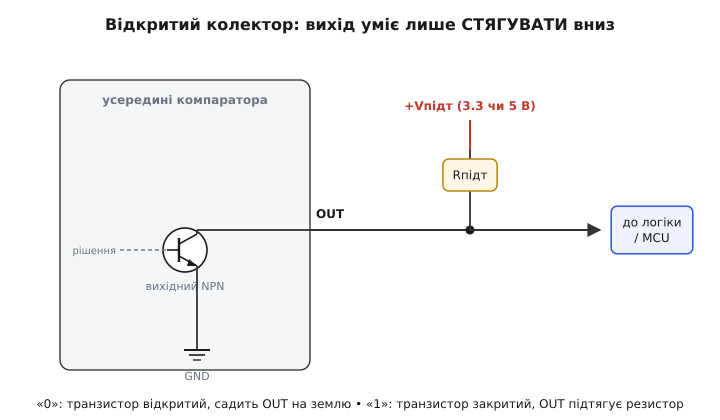
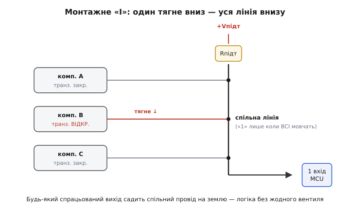
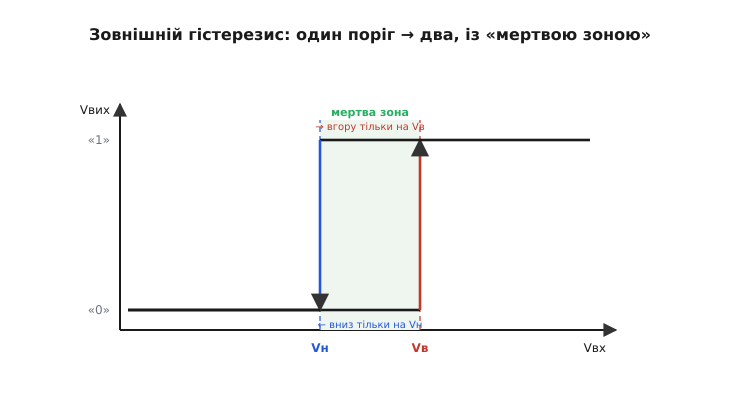

# 🔌 Компаратор-мікросхема: LM393-клас

> Компонентна вставка до теми [«Компаратор»](book:electronics/comparator). Операційний підсилювач [можна вжити як компаратор](book:electronics/comparator), та для серйозної роботи беруть **спеціальну мікросхему-компаратор**. Найвідоміший клас — **LM393** (здвоєний), його чотиривходовий брат **LM339** і трохи інакший **LM311**. Усі вони порівнюють дві напруги — але влаштовані й заводяться інакше, ніж ОП. Розберемо чому: чому в них на виході дивний «відкритий колектор», навіщо йому зовнішній резистор, які дві безкоштовні вигоди він дарує — і чому компаратор не можна просто «взяти замість ОП» наосліп.

### Що це за клас

Це **інтегральний компаратор** (*comparator IC*) — мікросхема, чия єдина робота: порівняти дві вхідні напруги й кинути вихід у один із двох станів, залежно від того, котрий вхід переважив. Усередині — той самий принцип, що й в [ОП без зворотного зв'язку](book:electronics/comparator): величезне підсилення різниці входів. Але кремній спроєктований під цю роль навмисне, тож поводиться інакше.

«LM393» — це **клас**, а не один чип: під цим номером (і його ріднею **LM193**/**LM293** — різняться лише робочим діапазоном температур) десятки виробників випускають сумісні мікросхеми з однаковою цоколівкою й логікою. Родина:

```
LM393  — два компаратори в корпусі (DIP-8 / SO-8)
LM339  — чотири компаратори (DIP-14 / SO-14)
LM311  — один компаратор, окремий клас: швидший, із виводом стробування
```

LM393 і LM339 — це **той самий компаратор**, просто два або чотири в одному корпусі; усе сказане нижче про один із них стосується кожного. LM311 стоїть трохи осторонь — про його відмінності наприкінці.

### Цоколівка LM393

LM393 — це два **незалежні** компаратори, що ділять лише живлення. Корпус DIP-8, вивід 1 — у кутку біля позначки-крапки, далі проти годинникової стрілки:

```
            ┌───────U───────┐
   OUT1  1 ─┤●              ├─ 8  VCC  (+живлення)
   IN1−  2 ─┤   компаратор  ├─ 7  OUT2
   IN1+  3 ─┤      1        ├─ 6  IN2−
   GND   4 ─┤   компаратор  ├─ 5  IN2+
            │      2        │
            └───────────────┘
```

Звернімо увагу на одну дрібницю, що збиває новачків: **живлення тут несиметричне в нумерації** — VCC на ніжці 8, GND на ніжці 4, а між ними розкидані входи й виходи двох окремих компараторів. Кожен компаратор має свою трійку: два входи (`IN+`, `IN−`) і вихід (`OUT`). У LM339 та сама ідея, лише компараторів чотири й корпус ширший.

Живиться LM393 від **2 … 36 В** одного полюса (або ±1 … ±18 В двополярно). Власний струм споживання — лише **близько 0.4 мА**, причому майже не залежить від напруги живлення: компаратор економний.

> 🔧 **Навіщо це.** Найкорисніша риса входів LM393/LM339 захована в дрібному шрифті даташита: їхній **спільний діапазон входів сягає самої землі** (V−). Тобто компаратор коректно порівнює напруги аж від 0 В — можна подати на вхід сигнал, що лежить біля землі, і не городити окреме від'ємне живлення. Саме тому ця родина така зручна в **однополярних** схемах на 5 чи 3.3 В: і живлення одне, і входи «дістають» до нуля.

### Головна особливість: відкритий колектор на виході

Ось де компаратор найдужче різниться від ОП. Вихід ОП — **двотактний**: він уміє і притягувати вихід угору (до плюса), і стягувати вниз (до мінуса) сам. Вихід LM393 — **відкритий колектор** (*open collector*): усередині сидить один-єдиний NPN-транзистор, чий емітер на землі, а колектор виведений просто на ніжку `OUT`. Усе, що цей транзистор уміє, — **притягувати вихід до землі** (коли компаратор хоче «0»). Підняти вихід угору він не може **взагалі** — у стані «1» транзистор просто закритий, і ніжка `OUT` висить у повітрі.


*Вихід LM393 — голий колектор NPN-транзистора. Хоче «0» — транзистор відкривається й садить вихід на землю. Хоче «1» — транзистор закривається й відпускає вихід; підняти напругу нема чим. Високий рівень задає лише зовнішній підтяжний резистор до обраної шини.*

Звідси прямий наслідок: **без зовнішнього резистора компаратор не працює як слід**. Поки вихідний транзистор закритий («1»), ніжка `OUT` ні до чого не під'єднана — і напруга на ній невизначена, ловить наводки. Щоб у стані «1» на виході була чітка висока напруга, ставлять **підтяжний резистор** (*pull-up*) від `OUT` до тієї шини, яку хочемо бачити як «1»:

```
              +Vpull (напр. 3.3 В)
                 │
                Rpull  (1…10 кОм)
                 │
   OUT ──────────┴────────→  до логіки / MCU
   (усередині — колектор NPN на землю)
```

Тепер усе працює так: компаратор хоче «0» — транзистор відкривається, садить `OUT` майже на 0 В (резистор просто гасить струм від шини на землю); хоче «1» — транзистор закривається, і резистор **підтягує** `OUT` до `+Vpull`. На вигляд «зайва» деталь насправді **дає змогу самому обрати, якою буде висока напруга** — а в цьому й уся сила відкритого колектора.

### Який резистор підтяжки брати

Номінал підтяжки — це завжди компроміс, той самий, що в будь-якому відкритому колекторі. Тягни логіку двома силами:

- **Замалий резистор** (сотні ом) — у стані «0» через нього з шини на землю тече зайвий струм (`Vpull/Rpull`), компаратор гріється й марно їсть струм. Зате фронт «вгору» крутий.
- **Завеликий резистор** (сотні кОм) — струм мізерний, але «1» наростає **мляво**: підтяжка мусить зарядити паразитну ємність дроту й входу через великий опір, і фронт розпливається.

Золота середина для звичайних задач — **1 … 10 кОм**. Менше беруть, коли треба швидший фронт або довгі/ємнісні дроти; більше — коли над усе економія струму (батарейний пристрій). Прикинемо струм у стані «0» для 4.7 кОм від 5 В:

```
I = Vpull / Rpull = 5 / 4700 = 1.06 мА
```

Близько міліампера — для LM393 (що сам бере 0.4 мА) дрібниця, а вихідний транзистор спокійно тягне десятки міліампер донизу. Якщо потрібен швидший фронт, ставлять 1 кОм — і платять ~5 мА у стані «0». Здебільшого 4.7 кОм — безпрограшний стандарт.

### Безкоштовна вигода №1: узгодження рівнів

А тепер найприємніше у відкритому колекторі. Підтяжку можна вести **до будь-якої шини** — і компаратор сам віддасть «1» саме тієї висоти. Хай сам компаратор живиться від 5 В (бо так зручно його входам), а сигнал треба завести на **3.3-вольтовий** мікроконтролер, чиї входи 5 вольтів **не терплять**. З двотактним виходом це була б біда: він видав би «1» = 5 В і спалив би вхід MCU. А відкритий колектор байдужий до власного живлення — він лише стягує вниз. Тягнемо підтяжку до шини **3.3 В** — і високий рівень виходу стає рівно 3.3 В:

```
   компаратор живиться 5 В
   підтяжка OUT → 3.3 В
   ──────────────────────
   "0" = 0 В,  "1" = 3.3 В   →  прямо на 3.3-В вхід MCU
```

Жодного дільника, жодного «перекладача рівня» — **зсув рівня дістається задарма**, самим вибором, куди тягне резистор. Це класична причина любити LM393 у змішаних схемах, де поруч живуть 5-вольтова й 3.3-вольтова логіка.

### Безкоштовна вигода №2: монтажне «АБО»

Друга дармова вигода — кілька відкритих колекторів можна **з'єднати на один спільний провід** через **одну** підтяжку:


*Виходи кількох компараторів зведено на одну лінію з єдиним підтяжним резистором. Лінія висока, лише поки ВСІ транзистори закриті; досить одному відкритися — і він садить спільний провід на землю. Дріт сам виконує логіку, без жодного вентиля.*

Логіка тут виходить сама собою з фізики: спільний провід буде високим, **лише коли жоден** із транзисторів його не стягує; досить **одному** компаратору захотіти «0» — і він садить усю лінію на землю, хоч би що казали інші. На рівні напруги це **монтажне І** (*wired-AND*): лінія = «1» тільки якщо вихід1 І вихід2 І … усі = «1». А якщо домовитися, що дія — це низький рівень («спрацював = стягнув лінію вниз»), та сама схема читається як **АБО**: «спрацював хоч хтось». Жодного логічного вентиля — провід і резистор виконують логіку самотужки.

> 🔧 **Навіщо це.** Звідси типовий трюк: кілька порогових датчиків (перегрів, просідання живлення, відкрита кришка) вішають на **одну** лінію «тривога» через спільну підтяжку. Будь-який, спрацювавши, стягує лінію вниз — і MCU бачить тривогу одним входом, не розбираючи поки, хто саме. Дешево, надійно й без зайвих ніжок.

### Чому компаратор — не операційний підсилювач

Ззовні LM393 і ОП — близнюки: той самий трикутник із двома входами. Та всередині кремній заточений під протилежні задачі, і плутати їх не можна.

**По-перше, швидкість.** Компаратор спроєктований **миттєво** вистрибувати з одного стану в інший. ОП у ролі компаратора, упершись у рейку, заходить у глибоке насичення, і щоб «висмикнути» його транзистори назад, потрібен час — звідси млявість на швидких сигналах. У компаратора цього немає: його вихідний транзистор не заганяють так глибоко, і він перемикається за частки мікросекунди. Порядок величини: LM393 відповідає приблизно за **0.3 … 1.3 мкс** (тим швидше, чим більший «перебір» сигналу за поріг); ОП у тій самій ролі — помітно повільніше й непередбачувано.

**По-друге — і це підступніше — нема внутрішньої компенсації.** Операційний підсилювач навмисне роблять **повільним усередині** (ставлять компенсаційний конденсатор), щоб він був **стійкий** під [від'ємним зворотним зв'язком](book:electronics/negative-feedback) — інакше схема з ним самозбуджувалася б. Компаратор такого конденсатора **не має** зовсім: його ж не призначено для лінійних схем зі зворотним зв'язком, тож гальмувати його нема навіщо. Звідси два висновки. Добре: без компенсації компаратор **набагато швидший**. Погано: спроба замкнути компаратор **від'ємним** зворотним зв'язком, щоб зробити з нього «підсилювач», майже напевно дасть **генератор** — він почне дзвеніти. Компаратор живе **без** петлі (чисте порівняння) **або** з петлею на «+» (додатний зв'язок, гістерезис) — але не з від'ємною.

```
ОП:         є внутр. компенсація → повільний, але стійкий у НЕГ. ЗЗ
Компаратор: компенсації НЕМА     → швидкий, але НЕГ. ЗЗ = генерація
```

Звідси правило вибору: треба **лінійно підсилювати** зі зворотним зв'язком — бери ОП; треба **швидко й чисто порівнювати** на рейках — бери компаратор. Інструмент під задачу.

### Гістерезис: його тут немає — додай ззовні

Ще одна риса, що випливає з «нема зворотного зв'язку всередині»: у голого LM393 **один** нескінченно гострий поріг — отже, він уразливий до [брязкоту](book:electronics/comparator) біля межі. Коли сигнал завис рівно на порозі, найменший шум перекидає вихід туди-сюди десятки разів. Усередині мікросхеми ліку від цього немає — його **додають ззовні**, парою резисторів додатного зворотного зв'язку, перетворюючи компаратор на [тригер Шмітта](book:electronics/schmitt-trigger):


*Резистор зворотного зв'язку з виходу на «+» додає крихту виходу до порога. Вихід унизу — поріг трохи нижчий; перекинувся вгору — поріг підскочив вище. Замість одного «слизького» рівня — два, із «мертвою зоною» між ними; шум уже не розгойдує вихід.*

Працює так: частка вихідного рівня через резистор зворотного зв'язку **додається до порога**. Поки вихід унизу, поріг трохи занижений; щойно вихід стрибнув угору — поріг сам **підскакує** вище, тож вертатися сигналові доводиться помітно нижче. Виходить **два** пороги з проміжком («мертвою зоною») між ними: шум, менший за цей проміжок, уже не здатен перекинути вихід назад. Прикинемо для підтяжки на 5 В: щоб дістати гістерезис близько 50 мВ навколо порога 2.5 В, беруть резистор зворотного зв'язку приблизно у сто разів більший за резистори дільника порога:

```
ширина гістерезису ≈ Vрейки · (Rділ / Rзв.зв)
0.05 В ≈ 5 В · (Rділ / Rзв.зв)   →   Rзв.зв ≈ 100 · Rділ
напр.  Rділ = 10 кОм  →  Rзв.зв ≈ 1 МОм
```

> 🔧 **Навіщо це.** Голий компаратор у реальну схему майже не ставлять — майже завжди додають **дрібний** гістерезис (одиниці–десятки мВ), щоб вихід був чистий. Це той випадок, коли «один резистор зайвий» рятує від мерехтливої лампи, тріскотливого реле й хибних спрацювань лічильника. Деталі того, як гістерезис рахується й проєктується, — у [тригері Шмітта](book:electronics/schmitt-trigger).

### Реальний приклад: поріг температури на LM393

Зберімо типову схему — вентилятор, що вмикається, коли термістор нагрівся, з невеликим гістерезисом, щоб на межі не торохтів. Живлення одне, 5 В; на MCU потрібен чистий цифровий сигнал.

```
   +5 В ──┬──────────┬───────────── Rpull(4.7к) ──┐
          │          │                            │
        Rfix(10к)  термістор(10к@25°C)           OUT ── на вхід MCU (5 В)
          │          │                            │
   IN−(2)─┤        IN+(3)──── від дільника        └─ (відкритий колектор усередині)
          │          
   опорний дільник 2.5 В на IN−       Rзв.зв(1М): OUT → IN+  (гістерезис)
          │
         GND
```

Логіка: термістор у верхньому плечі дільника, його напруга падає з нагрівом; коли вона переходить опорні 2.5 В на `IN−`, компаратор перекидає вихід. Підтяжка 4.7 кОм до 5 В дає чисту «1» = 5 В на вхід MCU; резистор зворотного зв'язку ~1 МОм із виходу на `IN+` додає кількадесят мілівольтів гістерезису, тож на самій межі вихід не брязкотить. Порахуймо струм підтяжки у спрацьованому стані («0»):

```c
// перевірка номіналу підтяжки для LM393
const float Vpull = 5.0f;       // шина підтяжки, В
const float Rpull = 4700.0f;    // підтяжний резистор, Ом
float I_sink = Vpull / Rpull;   // струм крізь вихідний транзистор у стані "0"
// I_sink = 5.0 / 4700 = 0.00106 А = 1.06 мА  → транзистор LM393 тягне легко
```

Трохи більше за міліампер — вихідний транзистор LM393 тримає десятки міліампер, тож запас величезний. На боці мікроконтролера нічого особливого не потрібно: це звичайний цифровий рівень, тож будь-який MCU лише налаштовує ніжку як **вхід без внутрішньої підтяжки** (високий рівень уже задає зовнішній `Rpull`) і читає її стан — високий означає «гаряче», низький — «холодно». Різняться самі лише назви в конкретному середовищі:

:::tabs
```arduino
// вихід компаратора на ніжці D2 (підтяжка до 5 В на платі компаратора)
pinMode(2, INPUT);                // саме INPUT, не INPUT_PULLUP: «1» дає зовнішній Rpull

if (digitalRead(2) == HIGH) {     // вихід відпущений підтяжкою → перейдено поріг
    fan_on();                     // гаряче: вмикаємо вентилятор
} else {                          // вихід стягнено вниз → нижче порога
    fan_off();                    // холодно
}
```
```esp-idf
#include "driver/gpio.h"
// вихід компаратора на GPIO4; підтяжку на платі ведемо до 3.3 В (вигода №1)
gpio_config_t io = {
    .pin_bit_mask = 1ULL << GPIO_NUM_4,
    .mode         = GPIO_MODE_INPUT,
    .pull_up_en   = GPIO_PULLUP_DISABLE,   // «1» дає зовнішній Rpull
    .pull_down_en = GPIO_PULLDOWN_DISABLE,
    .intr_type    = GPIO_INTR_DISABLE,
};
ESP_ERROR_CHECK(gpio_config(&io));

if (gpio_get_level(GPIO_NUM_4)) {          // вихід відпущений → перейдено поріг
    fan_on();                              // гаряче: вмикаємо вентилятор
} else {
    fan_off();                             // холодно
}
```
```stm32
// вихід компаратора на PB0; підтяжку на платі ведемо до 3.3 В (вигода №1)
GPIO_InitTypeDef io = {0};
__HAL_RCC_GPIOB_CLK_ENABLE();
io.Pin  = GPIO_PIN_0;
io.Mode = GPIO_MODE_INPUT;
io.Pull = GPIO_NOPULL;                     // «1» дає зовнішній Rpull
HAL_GPIO_Init(GPIOB, &io);

if (HAL_GPIO_ReadPin(GPIOB, GPIO_PIN_0) == GPIO_PIN_SET) {  // перейдено поріг
    fan_on();                              // гаряче: вмикаємо вентилятор
} else {
    fan_off();                             // холодно
}
```
:::

### LM311: коли треба швидше й гнучкіше

Окремо — про **LM311** (рідня: **LM111**/**LM211**). Це поодинокий компаратор, але **швидший** і **гнучкіший** за LM393, бо його вихід виведено інакше.

У LM311 назовні виведено **і колектор, і емітер** вихідного транзистора окремо. Це теж відкритий колектор, але «розкритіший»: під'єднавши емітер до землі, дістаєш звичну поведінку «стягує вниз»; а можна прив'язати емітер до іншого рівня й комутувати навантаження, прив'язане не лише до землі, а й до плюса чи навіть до іншого потенціалу. Вихід LM311 здатен комутувати напруги **до 50 В** при струмі **до 50 мА** — помітно міцніший за LM393. Відповідає він теж швидше — близько **150 … 165 нс**, тобто в кілька разів спритніше за LM393.

Ще LM311 має вивід **стробування** (*strobe*): підтягнувши його, вихід можна примусово **вимкнути** (перевести транзистор у закритий стан) незалежно від входів — зручно, коли порівняння треба «заморозити» в певні моменти. Ціна гнучкості — трохи **гірша точність** входів: вхідний зсув LM311 сягає ~7.5 мВ, тоді як у LM393 він лише до ~2 мВ. Тож вибір простий:

```
LM393 / LM339 — дешево, точно (зсув ~2 мВ), 2 чи 4 в корпусі,
                вхід до землі, живлення 2…36 В; швидкість середня (~0.3…1.3 мкс).
LM311        — швидший (~150 нс), потужніший вихід (50 В/50 мА),
                окремий емітер + строб; зсув більший (~7.5 мВ), один у корпусі.
```

Для порогів світла, температури, заряду батареї майже завжди досить LM393/LM339. LM311 беруть, коли потрібні **швидкість**, **сильніший чи нестандартно прив'язаний вихід** або **стробування**.

### Спільні граблі класу

- **Забута підтяжка.** Найчастіша помилка: зібрали схему, а вихід «не дає одиниці». Бо відкритий колектор сам «1» не видає — **завжди** потрібен підтяжний резистор до обраної шини «1».
- **Голий вихід без гістерезису.** На межі порога вихід брязкотить. Дрібний додатний зворотний зв'язок (резистор з виходу на «+») лікує це; деталі — [тригер Шмітта](book:electronics/schmitt-trigger).
- **Спроба замкнути від'ємний ЗЗ.** Компаратор не має внутрішньої компенсації — у схемі з від'ємним зворотним зв'язком він почне генерувати. Хочеш лінійного підсилення зі зворотним зв'язком — це задача [ОП](book:electronics/comparator), не компаратора.
- **Гола ніжка живлення.** Як і будь-якій мікросхемі, поставте керамічний **0.1 мкФ** упритул між VCC і GND — швидкі фронти компаратора інакше «дзвенять» шиною живлення.
- **Підтяжка не до тієї шини.** Пам'ятай: висоту «1» задає **шина підтяжки**, а не живлення компаратора. Тягни до 3.3 В — дістанеш 3.3 В на виході, навіть якщо сам чип живиться від 5 В (це вигода, а не помилка, — але про неї треба пам'ятати свідомо).
