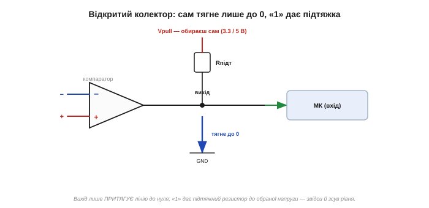
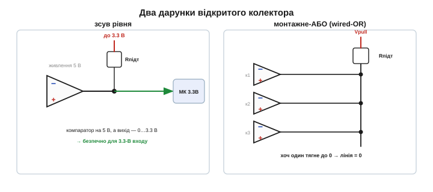

# 🔌 Компаратор-мікросхема: LM393-клас, відкритий колектор і підтяжка

> Каталог «Компоненти» · сектор `active`.

### Що це за клас пристроїв

Компаратор-мікросхема — це швидкий «майже-ОП», навмисне зроблений, щоб **жбурляти** вихід на рейку й назад за наносекунди, з виходом, який зазвичай має **відкритий колектор** (open collector, OC). Найпоширеніші — **LM393-клас** (два компаратори у 8-нозі), **LM339-клас** (чотири), однополярні, копійчані, усюдисущі.

Аби зрозуміти, чому компаратор поводиться інакше за операційний підсилювач, варто почати з того, для чого його взагалі зробили. ОП проєктують для лінійної роботи: він тримає вхідну різницю біля нуля, плавно регулює вихід і має внутрішню частотну корекцію (compensation), яка свідомо **уповільнює** його, щоб у схемі зі зворотним зв'язком він не самозбуджувався. Компаратор — протилежна філософія. Зворотного зв'язку в нього немає, лінійності не треба, і корекцію прибрали навмисно: чим швидше вихід перекинеться з одного стану в інший, тим краще. Тому компаратор — це фактично однобітний АЦП: на двох входах він питає «що більше?» і відповідає одним різким стрибком. Усе подальше — розпіновка, підтяжка, номінали — випливає саме з цієї мети «перекинутися якнайшвидше і якнайчистіше».

### Розпіновка й що всередині


*Рис. У LM393 — два незалежні компаратори в одному корпусі зі спільними живленням і землею; у кожного входи «+», «−» і вихід. Вихід — це просто транзистор, що або **притягує** ніжку до землі (логічний «0»), або **відпускає** її. Сам він «1» не видає — її створює зовнішній підтяжний резистор до обраної напруги.*

Прилад однополярний: працює від одної шини, а входи приймають напругу аж до самої землі — зручно міряти сигнали, що гуляють біля нуля. Така здатність входів дістати землю — не дрібниця: усередині вхідний каскад LM393 побудовано на **PNP**-транзисторах, у яких база може опускатися до нуля й навіть трохи нижче, не втрачаючи роботи. Якби вхід був на NPN, він би «осліп» за пару десятих вольта над землею — а саме там часто й живе цікавий сигнал (струмовий шунт, нижній край дільника).

Тепер про сам вихід, бо в ньому вся суть класу. «Відкритий колектор» означає буквально таке: останній транзистор у мікросхемі — це одиночний NPN, чий **емітер сидить на землі**, а **колектор виведений на ніжку й більше нікуди всередині не під'єднаний** — він «відкритий», вільний. Усередині немає ані верхнього транзистора, ані резистора до плюса. Тому фізично цей вихід здатний лише на одне: замкнути ніжку на землю або відпустити її. Звідки береться «одиниця» — і чому її доводиться добудовувати ззовні — диктує поведінка саме цього нижнього транзистора.

### Обов'язковий підтяжний резистор

Найголовніше, що треба засвоїти: відкритий колектор уміє лише **тягнути вниз**. Щоб побачити, *чому* він не вміє тягнути вгору, погляньмо на фізику цього вихідного NPN. Коли компаратор хоче видати «0», він заганяє в базу транзистора великий струм — такий, що транзистор входить у **насичення** (saturation). У насиченні обидва переходи (база-емітер і база-колектор) відкриті, транзистор уже не керує струмом як підсилювач, а поводиться як замкнутий ключ: між колектором і емітером лишається крихітна напруга **V_CE(sat)** — типово 0.1…0.4 В. Саме тому «нуль» компаратора — це не ідеальні 0 В, а ці кількадесят мілівольтів: то падіння на майже-замкнутому, але не надприровідному кремнієвому переході. Цей насичений транзистор міцно притискає ніжку до землі — ось вам надійний логічний «0».

А тепер ключове питання: що буде, коли компаратор захоче «1»? Він просто **прибирає струм з бази** — транзистор замикається (відсікається). І все. Колектор тепер ні до чого не під'єднаний: ні до плюса (його всередині немає), ні до землі (транзистор закритий). Ніжка просто **висить у повітрі** — це високоомний стан (high-Z). Напруга на ній не визначена нічим: вона плаває під дією наводок і витоків. Мікроконтролер, читаючи таку ніжку, побачить випадковість — то «0», то «1», як упіймає. Ось чому відкритий колектор фізично **не може** сам видати «1»: у ньому нема жодного елемента, який підтягнув би ніжку до плюса.

Тому до виходу **завжди** ставлять підтяжний резистор (pull-up) до тієї шини, яку хочете мати за «1». Логіка стає такою: транзистор закритий → резистор тихенько тягне ніжку до плюса → на ній чесна «1»; транзистор відкрився й насичився → він пересилює слабкий резистор і притискає ніжку до нуля → «0». Резистор тут — єдине джерело «одиниці» у всій схемі. Забута підтяжка — помилка №1 новачка: «компаратор не працює», а насправді його виходу просто нема за що вхопитися, коли він відпускає лінію.

### Який номінал підтяжки

Тут є компроміс, і обидва його боки тепер видно з фізики. **Замала** підтяжка (скажімо, 100 Ом) погана з двох причин. По-перше, у стані «0» крізь насичений вихідний транзистор марно тече чималий струм (I = V_pull/R), гріючи його даремно. По-друге — і це тонше — цей струм тече саме крізь V_CE(sat)-опір транзистора, тож чим більший струм, тим вище підіймається напруга «нуля»: замала підтяжка може зіпсувати рівень логічного нуля. У LM393 вихідний транзистор гарантує насичення лише до ~6…16 мА, тож опускатися нижче кількох сотень ом немає сенсу. **Завелика** підтяжка (мегаоми) погана інакше: фронт «угору» стає повільним. Коли транзистор відпускає лінію, заряджати паразитну ємність (ніжки, доріжки, входу МК) доводиться через резистор — а добуток R·C і є сталою часу того підйому. Велике R → млявий фронт і високоомна лінія, що жадібно ловить наводки. Золота середина — **1…10 кОм**.

**Розрахунок підтяжки для входу ESP32.**

```
Дано:  V_pull = 3.3 В,  R_pull = 4.7 кОм,  C_load ≈ 20 пФ
       I_OL(max) LM393 ≈ 6 мА (гарантоване насичення)

Струм у стані «0» (транзистор насичений):
  I_low = V_pull / R = 3.3 / 4700 = 0.70 мА
  → 0.70 мА « 6 мА, транзистор легко тримає насичення,
    V_CE(sat) лишається низькою → чесний «0»

Стала часу фронту «вгору» (заряд C через R):
  τ = R · C = 4700 · 20·10⁻¹² = 9.4·10⁻⁸ с ≈ 0.094 мкс
  час до ~99 % (5τ) ≈ 0.47 мкс

Висновок: 4.7 кОм — добрий компроміс. «Нуль» твердий
(струм утричі менший за «стелю» 6 мА), фронт «угору»
швидший за саму затримку LM393 (~1.3 мкс), тож не він
обмежує швидкість.
```

Якби нам конче треба було гострий фронт на ємнісній лінії, ми б не кидалися в дуже мале R (грітиме транзистор і псуватиме «нуль») — узяли б окремий push-pull-компаратор, який заряджає ємність активним верхнім транзистором, а не пасивним резистором.

### Перший «байт»: два дарунки


*Рис. Зсув рівня: компаратор живиться від 5 В, а підтяжка тягне до 3.3 В — і вихід гойдається 0…3.3 В, безпечно для 3.3-вольтового МК. Монтажне-АБО: кілька виходів на одну лінію з однією підтяжкою; хоч один тягне до нуля — і лінія в нулі.*

Те, що «1» бере не з компаратора, а з резистора, спершу здається незручністю — а насправді дарує два безкоштовні трюки. **Зсув рівня (level shift):** оскільки амплітуду «одиниці» задає підтяжка, а не живлення компаратора, ці дві напруги можна розв'язати. Компаратор живиться від 5 чи 12 В (і чудово міряє там свої сигнали), а підтяжку ведемо до 3.3 В — і вихід гойдається 0…3.3 В, прямо придатні 3.3-вольтовому мікроконтролеру. Жодного окремого перетворювача рівнів: вихідний транзистор однаково лише замикає на землю, а до якої «стелі» його відпускати — вирішує резистор. Працює це саме тому, що в OC немає верхнього транзистора, прибитого до власного живлення: «стеля» зовнішня й вільна.

**Монтажне-АБО (wired-OR):** з'єднайте кілька відкритих виходів на **один** провід з **однією** підтяжкою — і будь-який, що тягне до нуля, опускає всю лінію. Чому це безпечно, а на push-pull-виходах було б коротким замиканням? Бо кожен OC-вихід може лише тягнути вниз або відпускати: якщо один тягне до нуля, а решта відпустили, конфлікту немає — резистор просто програє єдиному активному транзистору, і лінія йде в нуль. Push-pull же мав би шину живлення проти шини землі — наскрізний струм і дим. Тож монтажне-АБО ідеальне для спільної лінії «аварія»: хоч один давач за порогом тягне її в нуль — і прапорець спрацював, незалежно від решти.

### Типові граблі

**Забута підтяжка** — вихід висить у high-Z, покази випадкові. Завжди став. **Діапазон входів:** входи LM393 дістають до землі (PNP-каскад), але **не** до самого верху живлення — на ~1.5…2 В нижче за плюсову рейку вхідний каскад втрачає роботу. Тримай входи в дозволеному вікні, інакше компаратор «перевернеться» хибно. **Не плутай ролі:** [ОП у ролі компаратора](book:electronics/comparator-2) млявий через внутрішню корекцію, а компаратор у лінійній схемі зі зворотним зв'язком може й не запрацювати — у нього **немає** тієї корекції, тож із від'ємним зв'язком він почне дзвеніти (самозбудження). **Брязкіт** — найпідступніше, тож розберемо механізм окремо. **Швидкість:** LM393 повільний (~1.3 мкс затримки поширення); для гострих фронтів (швидкі дані, синхронізація) бери спеціальний швидкий компаратор.

#### Чому голий компаратор «дзвенить» біля порога — і як це гасить гістерезис

Уяви повільний зашумлений сигнал, що поволі підповзає до опорного рівня — наприклад, напруга на терморезисторі чи світло на фотодіоді біля порога спрацювання. Корисний сигнал перетинає поріг **один** раз, але поверх нього завжди сидить шум у кілька мілівольт. Біля самого порога цей шум по черзі підкидає вхід то трохи вище опори, то трохи нижче. А компаратор нескінченно швидкий і безмежно чутливий: він чесно реагує на **кожен** такий мікроперетин. Результат — на виході не один чистий перепад, а ціла черга паразитних імпульсів — **брязкіт** (chatter). Мікроконтролер, що рахує фронти, нарахує десяток «спрацювань» там, де подія була одна; реле заклацає; лічильник збреше.

Корінь біди в тому, що поріг **один і нерухомий**, а сигнал крутиться навколо нього. Ліки — зробити так, щоб поріг **сам тікав** від сигналу, щойно компаратор перекинувся. Це і є **гістерезис** (hysteresis): два різні пороги замість одного — вищий для руху вгору (V_TH+) і нижчий для руху вниз (V_TH−). Реалізують його **додатним** зворотним зв'язком: невеликий резистор з виходу на вхід «+» (ось чому додатним — сигнал вертається на неінвертований вхід і підсилює сам себе). Працює так: коли вихід стрибнув у «1», частинка цього «1» через резистор піднімає опорний поріг — і щоб тепер повернути компаратор назад, сигналу треба впасти помітно **нижче**, аніж точка, де він щойно спрацював. Шуму в кілька мілівольт це вже не до снаги: він гойдається всередині «мертвої зони» між двома порогами й не може дотягтися до протилежного. Один чистий перепад замість черги — брязкіт придушено в зародку.

Ширину цієї зони (V_hys) задають співвідношенням резисторів зворотного зв'язку: бери її помітно більшою за розмах шуму (скажімо, 20…50 мВ при шумі ~5 мВ), але не надмірною — бо завеликий гістерезис притупить чутливість до справжнього малого сигналу. Деталі схемотехніки — у темі про [тригер Шмітта](book:electronics/schmitt-trigger); тут важливий сам механізм: рухомий поріг проти нерухомого шуму.

### Варіації

Окрім відкритого колектора бувають компаратори з **двотактним** (push-pull) виходом: усередині в них є і нижній, і верхній транзистор, тож вони самі дають і «0», і «1» (підтяжка не потрібна, фронти активні й швидкі). Платня за це — «1» прибита до власного живлення компаратора, тож вільного зсуву рівня вже не зробиш, а паралелити виходи в монтажне-АБО не можна (буде наскрізний струм). LM339-клас — це чотири компаратори в корпусі зі спільним живленням, зручно, коли треба багато порогів. Є й моделі з **вбудованим** опорним джерелом чи гістерезисом (менше зовнішніх деталей і менше шансів забути підтяжку логіки гістерезису), і «віконні» компаратори (два внутрішні пороги — відповідь «чи сигнал у заданій смузі», корисно для контролю напруги живлення).

> 🔧 **Навіщо це.** Беручи компаратор: пам'ятай головне — **відкритий колектор тягне лише вниз (вихідний NPN насичується в «0» і просто відпускає лінію в «1»), тож ОБОВ'ЯЗКОВО постав підтяжку** (1…10 кОм) до тієї напруги, що хочеш за «1». За це дістанеш два дарунки задарма: зсув рівня (вихід під будь-який МК, бо «стелю» задає резистор) і монтажне-АБО (спільні лінії без конфлікту, бо OC лише тягне вниз). А ще не забудь гістерезис проти брязкоту (рухомий поріг гасить мікроперетини шуму) й перевір, що входи не лізуть під саму плюсову рейку. Для швидких фронтів — окремий швидкий або push-pull-компаратор, а не LM393.
