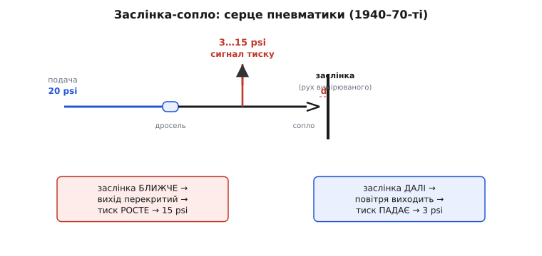
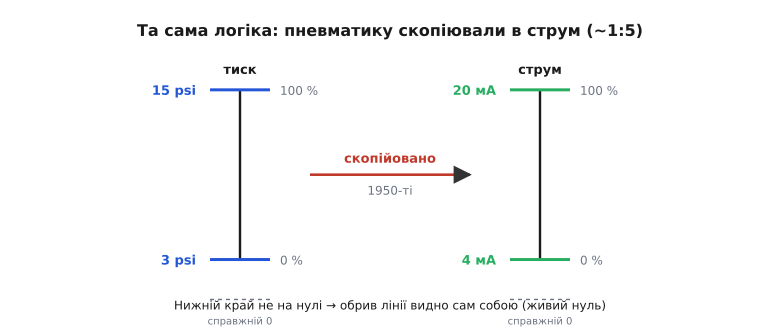

# 📜 Від стиснутого повітря до 4–20 мА

Сьогодні струмова петля 4–20 мА здається такою очевидною, що мимоволі думаєш: хтось сів, вивів усе з фізики й записав стандарт. Насправді цей сигнал народився не з чистого аркуша. Він — електрична копія значно старшої системи, яка керувала нафтопереробкою, хімією та електростанціями цілих пів століття, не маючи всередині жодного транзистора, жодної мікросхеми, а часто й жодного дроту. Та система працювала на **стиснутому повітрі**. І коли інженери в 1950-х переходили на електроніку, вони не вигадали логіку 4–20 мА — вони перенесли її майже один-в-один з пневматики, бо ця логіка вже довела свою цінність на тисячах заводів. Щоб зрозуміти, чому нуль шкали — це 4 мА, а не 0, треба спершу зрозуміти, чому до того нуль шкали був 3 psi, а не 0 psi.

## Завод, що думав повітрям

Уявіть нафтопереробний завод 1950 року. По ньому течуть гарячі вуглеводні під тиском, у колонах киплять фракції, скрізь пара й вибухонебезпечні пари. Десь нагорі — давач, що міряє рівень у колоні; за сотню метрів, у щитовій, оператор має цей рівень бачити й керувати клапаном. Як передати число?

Електрика тут лякала. Будь-яка іскра в атмосфері бензинових парів — це не збій каналу, а вибух. Тому замість дротів між давачем і щитовою тягли **мідні трубки**, а сигналом був **тиск стиснутого повітря** в них. Давач підвищував або знижував тиск у трубці пропорційно вимірюваній величині; на іншому кінці приймач (теж пневматичний) розгортав цей тиск назад у показ стрілки чи в команду клапанові. Жодного струму, жодної іскри — тільки чисте повітря, що нічого не підпалює.

Це не була кустарщина. Пневматична автоматика стала **повноцінною галуззю**: пневматичні регулятори вміли пропорційне керування, інтегральну й диференціальну складову — увесь ПІД-закон, який ми сьогодні зашиваємо в мікроконтролер, тоді складали з мембран, пружин, дроселів і камер тиску. Одним із піонерів була американська **Foxboro Company** (заснована 1908 року в містечку Фоксборо, штат Массачусетс): її контролер **Model 10 Stabilog** — за наявними даними, перший промисловий регулятор із пропорційною та інтегральною («reset») дією — з'явився ще наприкінці 1920-х і витягнув компанію крізь скруту 1930-х саме завдяки замовленням нафтової промисловості, що тоді стрімко зростала. Те, що Foxboro згодом стане і головним рушієм електричного стандарту 4–20 мА, не випадковість: вони знали пневматичну логіку зсередини, бо самі її будували.

> 🔧 **Навіщо це.** Коли ви бачите на сучасному давачі напис «два дроти, 4–20 мА, Ex» (вибухозахист), ви дивитеся на прямого нащадка тих мідних трубок. Сама ідея «передати слабкий, нешкідливий сигнал так, щоб він не підпалив цех» прийшла з пневматики — а 4–20 мА успадкував її, лише замінивши повітря струмом, ще й таким малим, що іскра від нього теж нічого не запалює.

## Заслінка й сопло: як тиск ставав числом

Щоб пневматика стала вимірювальною системою, потрібен був вузол, який перетворює **крихітний механічний рух** (вигин мембрани, поворот важеля від давача) на **тиск повітря**, що цей рух точно віддзеркалює. Таким вузлом був **механізм «заслінка-сопло»** (англ. *flapper-nozzle*, ще його звуть *baffle-nozzle* — «перепона-сопло»). Він настільки простий і настільки розумний, що варто розібрати його до кінця — бо саме його крива поведінки, як ми побачимо, і задала магічне число 3 psi.

Будова така. Стиснуте повітря подається в систему через **дросель** — навмисне звужене місце, що пропускає повітря тоненькою цівкою. Одразу за дроселем повітря йде в коротку камеру й виходить назовні через **сопло** — маленький отвір. Навпроти сопла, на крихітній відстані, стоїть **заслінка** — пласка пластинка, з'єднана з тим, що ми міряємо. Увесь фокус — у тому, що тиск у камері (саме його ми й знімаємо як сигнал) залежить від **зазору між соплом і заслінкою**.


*Подача йде через дросель до сопла; рух вимірюваної величини зсуває заслінку, змінюючи зазор. Близько — повітря перекрите, тиск росте; далеко — повітря виходить, тиск падає. Так механічний рух стає тиском.*

Розгорнімо механізм причинно. Повітря весь час підтікає через дросель — це постійна, незмінна цівка. Куди воно подінеться далі, вирішує сопло із заслінкою.

- Коли заслінка **далеко** від сопла, отвір сопла вільний, повітря легко витікає назовні — і тиск у камері **малий**: усе, що натекло через дросель, одразу й виходить.
- Коли заслінка **підходить упритул**, вона перекриває вихід із сопла, повітрю нікуди подітися — і тиск у камері **росте** майже до тиску подачі: натікає стільки ж, а вийти не може.

Виходить підсилювач переміщення в тиск: ворухнули заслінку на соті частки міліметра — тиск у камері змінився на цілі psi. Давач підводить заслінку до сопла своїм важелем — а на виході готовий тиск, що повторює вимір. (Самих лиш заслінки й сопла мало для точності, тому навколо будували **зрівноважування** — зворотний зв'язок мембраною, що віднімає вихідний тиск назад на важіль, лінеаризуючи й стабілізуючи відгук; але серце все одно отут, у зазорі.)

> 🔧 **Навіщо це.** Той самий принцип «перекрив потік — тиск підскочив» досі живе в пневматичних позиціонерах клапанів і в багатьох пневмоприводах на сучасних заводах. А головне — саме нелінійна крива «зазор → тиск» цього вузла, а не чиясь забаганка, пояснює, чому нижній край сигналу поставили не на нулі. Зрозумієш заслінку — зрозумієш, звідки взялося 3 psi.

## Звідки 3 і 15: межі живого діапазону

Тепер головне питання історії: чому **3–15 psi**, а не, скажімо, 0–10 чи 0–20? Тут треба бути чесним щодо доказів. У промислових джерелах раз за разом повторюється відверте зізнання: **точну причину, чому обрали саме 3 і 15, ніхто не задокументував**, і первісного документа з обґрунтуванням, схоже, не існує. Те, що ми маємо, — це переконливе **інженерне пояснення постфактум**, узгоджене між фахівцями, але не протокол наради 1940-х. Тож статус тут — **правдоподібно й узгоджено, але не доведено першоджерелом**. Розгляньмо це пояснення, чітко тримаючи в голові його статус.

Чому **верхній край 15 psi, а не вище**? Згадаймо криву заслінки-сопла. Залежність тиску від зазору лінійна лише **в середній частині**: біля повного перекриття тиск виходить на «полицю» — наближається до тиску подачі й перестає реагувати на рух (заслінка вже й так майже все перекрила). Якби робочий діапазон тягнули до самого тиску подачі, верхні відсотки шкали лягли б на цю нелінійну полицю, де однаковий рух заслінки дає дедалі менший приріст тиску — і точність нагорі шкали поповзла б. Тому верх свідомо лишили **нижче** насичення, у лінійній зоні: за типової подачі близько 20 psi це і є десь 15 psi. Розмах добрали так, щоб уся робоча смуга 3…15 сиділа на найпрямішій ділянці кривої.

Чому **нижній край 3 psi, а не 0**? Тут — два мотиви, обидва глибокі.

Перший — **технічний, із тієї ж кривої**. У зоні дуже малого тиску (заслінка геть відведена) залежність теж кривиться й стає в'ялою: тиск близько до нуля слабко реагує на рух. Піднявши нижній край до 3 psi, інженери знову лишилися в лінійній, чутливій частині, де однаковий рух заслінки дає однаковий приріст тиску по всій шкалі.

Другий мотив — той самий, що згодом успадкує електрика: **живий нуль** (англ. *live zero* — «живий нуль»). Якщо порожній резервуар — це 3 psi, а не 0, то **сам нуль тиску стає сигналом біди**. Лопнула трубка, від'єднався фітинг, упала подача — тиск падає до нуля, нижче робочого мінімуму, і це однозначно «лінія мертва», а не «вимір дорівнює нулю». Якби нижній край був 0 psi, чесний нуль вимірювання й розрив трубки виглядали б **однаково**, і оператор не відрізнив би норму від аварії. Живий нижній край робить несправність видимою саму собою.

> 🔧 **Навіщо це.** Ось вона, точка народження логіки 4–20 мА — за десятиліття до самих міліамперів. «Зсунь нуль шкали від абсолютного нуля, щоб обрив лінії впадав в око» — це пневматичне правило, перевірене мідними трубками. Електроніка згодом просто переписала його зі psi на мА.

## Перенесення в електрику: чому майже 1:5

У 1950-х на заводи прийшла практична електроніка, і пневматика почала здавати позиції. Причини зрозумілі: повітряний сигнал **повільний** (стиснене повітря не миттєво пробігає сотню метрів трубки, тому швидкі зміни «розмазувалися»), трубки **течуть і засмічуються**, а вологе чи брудне повітря з'їдає точність. Електричний сигнал біжить миттєво, не тече й легко заходить у нову електронну апаратуру керування.

Але **логіку** міняти не стали — її лише переклали іншою мовою. Інженери дивилися на робочу, звичну операторам пневматичну шкалу 3–15 psi й ставили природне питання: який електричний діапазон поводитиметься **так само**? Дві вимоги були священні. Перша — **живий нуль**: нижній край сигналу має бути помітно вище абсолютного нуля, щоб обрив лінії читався сам собою, точно як у пневматиці. Друга — зручне **співвідношення розмаху**: у пневматиці верх (15) уп'ятеро більший за низ (3), тобто 1:5, і шкала виходить рівна та симетрична для перерахунку. Електричний еквівалент відтворив саме це: **4 мА — нуль шкали, 20 мА — повна**, і 20 знову вп'ятеро більше за 4. Те саме 1:5, той самий зсунутий живий нуль — просто замість тиску тече струм.


*Електричний діапазон зробили дзеркалом пневматичного: нижній край піднятий над абсолютним нулем (живий нуль), а верх уп'ятеро більший за низ (1:5). Помінялася лише фізична величина — psi на мА.*

Зверніть увагу, наскільки це **прагматичне**, а не теоретичне рішення. Ніхто не виводив 4 мА з рівнянь Максвелла. Узяли працюючу систему, дістали з неї перевірену логіку («живий нуль + розмах 1:5») і перевдягли її в струм. Саме тому історія 4–20 мА — це не історія винаходу, а історія **спадкоємності**: краще доглянутий нащадок мідної трубки.

## Війна діапазонів: чому програв 10–50 мА

Тільки от перейти на струм — означало ще й **домовитися, який саме струм**. У ранні роки електронної автоматики єдиного діапазону не було: різні виробники штовхали різні шкали — траплялися 0–1 мА, 1–5 мА, 0–20 мА, **10–50 мА** і той самий 4–20 мА. Найсерйознішим суперником чотирьох-двадцяти став **10–50 мА**. Якийсь час обидва жили поряд: один і той самий прилад інколи випускали у двох версіях — під 4–20 мА і під 10–50 мА. Чому ж зрештою переміг саме 4–20, а 10–50 зник? Тут сходяться кілька причин, і чесно показати треба всі, бо в різних джерелах наголос різний.

**Причина перша — активний прилад своєї епохи.** Перші електронні передавачі будували не на транзисторах, а на тому, що було надійним і доступним: **електронних лампах** і **магнітних підсилювачах** (англ. *magnetic amplifier* — підсилювач на насиченні осердя трансформатора керованим струмом). Ці прилади мали спільну рису: щоб працювати в робочій точці стабільно, їм потрібен був чималий **мінімальний струм** — порядку десятка міліампер. Тому й діапазон починався високо: 10 мА як низ був природний для магнітного підсилювача, якому менше просто не вистачило б на нормальну роботу. Коли ж на зміну прийшов **транзистор**, картина перевернулася: напівпровіднику легко й точно даються малі струми, і тримати робочу точку на десятках міліампер стало непотрібним марнотратством. Транзисторний передавач чудово укладався в скромні 4–20 мА — і верхня межа 50 мА втратила сенс. Це пояснення прямо пов'язує діапазон із панівним активним приладом: лампа/магнітний підсилювач тягли вгору, транзистор відпустив униз.

**Причина друга — небезпека високого струму: напруга й потужність.** Щоб проштовхнути 50 мА через довгу петлю з її опором, потрібна помітно **вища напруга джерела**, ніж для 20 мА. За наявними згадками, ранні електронні системи Foxboro живилися напругою порядку **60–70 В** — а це вже область, небезпечна для людини: дотик до клем такого кола — не пощипування, а удар. На вибухонебезпечному заводі додається ще гірше: вища напруга й більший струм означають більше енергії, здатної дати іскру, отже — пряму загрозу **іскробезпеці** (англ. *intrinsic safety* — побудова кола так, щоб його енергії в принципі не вистачило підпалити вибухову атмосферу). 4–20 мА за малих напруг живлення укладається в іскробезпечні межі куди легше: малий струм, помірна напруга, мало запасеної енергії.

**Причина третя, з другої, — споживана потужність і тепло.** Потужність, що марно гріє коло, росте зі струмом (на резисторі — як квадрат струму). Петля на 50 мА розсіює помітно більше тепла на тих самих опорах, ніж петля на 20 мА, — гірше для живлення, гірше для нагріву приладів, гірше для двопровідних передавачів, яким той струм треба ще й роздобути. Менший струм 4–20 мА — це менше витрат, менше тепла й більша досяжна відстань за тієї самої напруги.

> 🔧 **Навіщо це.** Дешевший кабель, безпечніша напруга, скромніше живлення, довша лінія — кожен із цих практичних плюсів і досі змушує проєктанта обирати 4–20 мА. Перевага 10–50 мА була одна — він краще годував лампи й магнітні підсилювачі своєї доби. Щойно ця доба скінчилася (транзистор), у 10–50 мА не лишилося жодного козиря, лише вади: небезпека, споживання, тепло. Тому він і зник без сліду, а 4–20 мА живе досі.

Варто чесно сказати й про **інше річище**, яке часто плутають із цією історією. Передача даних струмом 20 мА існувала **й поза процесною автоматикою** — у телеграфі та телетайпі. Ще телеграфні лінії XIX століття гнали струми порядку десятків міліампер, а телетайпні апарати (як-от Teletype Model 33 початку 1960-х) керували селекторними магнітами **20-міліамперовою петлею** (а ранні системи — 60 мА). Це справді струмова петля, і вона теж стара. Але це **окрема лінія розвитку** — цифрова, «є струм / нема струму» для друку знаків, — а не джерело аналогового процесного 4–20 мА. Спокусливо звести все до одного кореня, та коректніше сказати так: ідея «передавати інформацію струмом по петлі» носилася в повітрі телекомунікацій, тоді як **аналоговий** стандарт 4–20 мА для вимірювань виріс саме з пневматики 3–15 psi. Дві гілки, спільний дух, різне коріння.

## Хто й коли це закріпив

Поки діапазон лишався неписаною звичкою кількох виробників, він не був стандартом — бо прилади різних фірм не гарантовано стикувалися. Перетворити популярну практику на **стандарт** мала галузева організація. У США цим зайнялося **ISA** (англ. *Instrument Society of America* — Товариство приладобудівників Америки; згодом перейменоване в *International Society of Automation*, але абревіатура лишилася). Його профільний комітет — **ISA50** (історична назва робочого проєкту — *SP50*, від *Standards and Practices*) — узявся за сумісність аналогових сигналів електронних приладів.

Із датами тут теж тримаймо чесність — джерела дають радше орієнтири, ніж єдину канонічну хронологію:

```
кінець 1920-х  Foxboro Model 10 Stabilog — пропорційно-інтегральний
               пневматичний регулятор (передісторія)
1940–1970-ті   панування пневматики 3–15 psi на заводах
середина 50-х  поява практичної електроніки; перші струмові передавачі,
               конкуренція діапазонів (10–50 vs 4–20 та інші)
~1966          перша редакція стандарту ISA (проєкт SP50) на 4–20 мА
1972           ANSI/ISA-50.1 закріплює значення; за галузевою згадкою,
               «технічних новацій у цій царині відтоді не було»
1975           ANSI/ISA-50.00.01-1975 (нині чинна редакція R2012):
               «Сумісність аналогових сигналів електронних промислових
               приладів процесу» — той самий 4–20 мА
1978 / 1982    міжнародні IEC 60381-2:1978 (постійна напруга, 1–5 В тощо)
               та IEC 60381-1:1982 (постійний струм, 4–20 мА)
```

Кілька застережень до цієї таблиці. По-перше, **середина 1950-х** як поява струмового сигналу — узгоджена згадка багатьох джерел, але не одна-єдина задокументована дата; ставтеся до неї як до десятиліття, а не до року. По-друге, **«SP50 близько 1966»** трапляється в галузевих оглядах, тоді як офіційна сторінка комітету впевнено називає вже **ANSI/ISA-50.1-1972** і **-50.00.01-1975**; різниця — між першими робочими редакціями проєкту та зрілими опублікованими стандартами. По-третє, не варто шукати **«єдиного винахідника»** 4–20 мА: за згадками сучасників, саме **Foxboro** найдужче просувала цей діапазон і зрештою «виграла перегони», але стандарт — це **колективна домовленість** виробників і комітету ISA, а не патент однієї людини чи фірми. Розрізняймо виміри: була **звична практика** (виробники), було **просування діапазону** (Foxboro як чільний гравець) і було **закріплення стандартом** (ISA, потім IEC) — три різні речі, і жодна не зводиться до «хтось один винайшов 4–20 мА».

## Чому ця спадковість так добре трималася

Лишилося пояснити дивну річ: чому стандарт, по суті, **застиг** ще на початку 1970-х — «технічних новацій відтоді не було» — і досі його приладів продають більше, ніж усіх цифрових польових шин разом узятих? Адже навколо змінилося все: транзистор поступився мікросхемі, з'явилися цифрові протоколи, мережі, оптика.

Відповідь у тому, що 4–20 мА вирішує свою вузьку задачу **майже ідеально** — і всі його чесноти ростуть із самої фізики, а не з технології епохи, тож технології можуть мінятися скільки завгодно, а сигнал лишається правильним. Передати одну повільну величину на велику відстань надійно, з умонтованою діагностикою обриву, по дешевій парі дротів, ще й живлячи давач тими ж двома жилами — ось його задача, і кращого розв'язку для неї не знайшли. Цифрові шини виграють там, де треба багато величин і двобічний обмін, але там, де потрібне **одне число, що мусить дійти за будь-яку погоду**, простота струмової петлі досі неперевершена.

Тут і змикається коло. Те, що 4–20 мА досі живе, — пряме продовження того, чому колись жило 3–15 psi: обидва народжені не як модна технологія, а як **надійний спосіб провести одне число крізь ворожий завод так, щоб несправність було видно одразу**. Помінялося середовище (повітря → струм), помінялися активні прилади (мембрани → лампи → транзистори → мікросхеми), а **логіка лишилася та сама**, бо вона була правильна з самого початку. Пневматичні інженери 1940-х, добираючи 3 psi на лінійній ділянці кривої заслінки, навряд чи уявляли, що закладають логіку, яку через сотню років мікроконтролер читатиме як 4 мА. Але саме так працює добра інженерія: вдалу ідею не винаходять щоразу заново — її **успадковують**, лиш міняючи носія.
