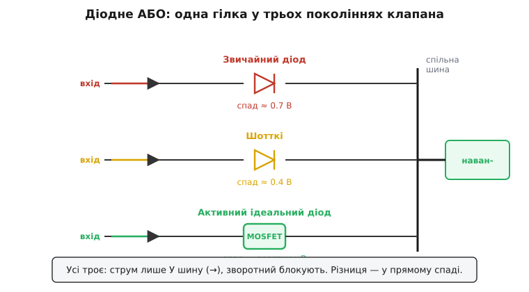

# 🔌 Розв'язувальні діоди для резервування: схема «діодне АБО»

Уявіть стійку обладнання, яке **не має права вимикатися**: телефонна станція, сервер, медичний монітор. Живлять його не від одного блока, а від двох (а то й трьох) одразу — щоб коли один помре, навантаження навіть не помітило. Але просто з'єднати виходи двох блоків паралельно не можна: щойно один блок просяде (вимкнувся, згорів запобіжник, замкнуло на вході), сусід почне **лити струм у його труп** замість навантаження. Той самий зрівнювальний струм, тільки тепер аварійний — і він може бути величезним, бо мертвий блок виглядає для живого як коротке замикання.

Потрібен пристрій, який пускає струм **тільки в один бік** — від блока до спільної шини, і ніколи назад. Природний кандидат на однобічний клапан — **діод**. Поставимо по діоду в кожну гілку, вістрям (катодом) до спільного вузла, і отримаємо клас схеми, який інженери звуть **діодним АБО** (англ. *diode-OR*). Це не конкретна мікросхема й не партномер — це **спосіб з'єднання**, який повторюється в тисячах пристроїв; тому й розбираємо його як узагальнений клас, а не як виріб.

> 🔧 **Навіщо це.** Будь-яке резервоване живлення «N+1» (на один блок більше, ніж треба) тримається на діодному АБО або його активному нащадку. Сервер із двома блоками, бортова мережа з основною й аварійною шиною, прилад із живленням від мережі та від батареї з безшовним переходом — усюди в точці, де два джерела сходяться на одну шину, стоїть саме ця схема. Зрозумієте її — зрозумієте, чому одне джерело може померти, а навантаження цього не відчує.

## Клас пристрою: однобічний клапан між джерелом і шиною

Назва «діодне АБО» — з логіки. Логічне АБО видає одиницю, якщо хоч на одному вході одиниця. Тут — те саме з напругою: на спільній шині буде напруга, якщо хоч **один** із входів живий. А самі діоди роблять так, що шину **завжди** живить той вхід, чия напруга зараз **найвища**: його діод відкритий, решта — під зворотною напругою й закриті. Помер найвищий — наступний за напругою тут-таки підхоплює, без жодного перемикача й керування.

Ключове слово — **розв'язка** (англ. *isolation*, *decoupling*). Діод **розв'язує** гілки: те, що діється в одній (просів, замкнув, вимкнувся), не пускається в інші. Звідси й українська назва вузла — **розв'язувальні діоди**. Англійською той самий вузол у силовому контексті звуть **ORing** (від *OR* — логічне АБО), а коли діод замінюють активним ключем — **ideal diode** чи **ORing controller**. Усе це той самий клас, різні покоління.

Чим клас **є** і чим **не є** — варто розмежувати одразу, бо плутанина тут коштує спаленого заліза:

- **Діодне АБО — це блокування зворотного струму.** Воно гарантує: струм тече лише **в** шину, ніколи назад у джерело. Це його єдина справжня робота.
- **Діодне АБО — це НЕ вирівнювання струму.** Воно й близько не змушує два живі блоки ділити навантаження порівну. Якщо обидва входи живі й один має трохи вищу напругу — саме він і тягне майже все, а другий діод стоїть закритий або ледь відкритий. Поділ струму лишається таким самим нерівним, як і без діодів; розв'язка лише не дає слабшому піти в **мінус**.

Іншими словами, діодне АБО розв'язує задачу **резервування** (один помер — другий тягне), але не задачу **складання потужності** (двоє разом тягнуть більше). Це два різні завдання, і їх постійно плутають. Хочете більше струму від двох блоків — вам потрібен баласт або вбудований розподіл струму, а не діоди. Хочете, щоб смерть одного блока була непомітною, — діодне АБО, і саме воно.

## Блок-схема: вузол, де гілки сходяться на шину

Намалюємо клас у найзагальнішому вигляді. Кілька джерел, у кожного на виході — свій клапан (діод чи його активний замінник), усі катоди зведені в один вузол, від вузла йде спільна шина на навантаження.


*Одна гілка діодного АБО у трьох поколіннях. Звичайний кремнієвий діод губить ~0.7 В, Шотткі ~0.4 В, активний «ідеальний діод» — MOSFET, яким керує контролер, — лише десятки мілівольт. Усі троє роблять одне: пропускають струм у спільну шину й блокують зворотний.*

Логіка вузла проста й нещадна. Назвімо напругу на спільній шині V_шина. Гілка з входом V_вх проводить струм **лише** поки V_вх > V_шина (плюс падіння на клапані); щойно V_вх просідає нижче — її клапан зачиняється, і ця гілка від'єднана. Тому:

```
V_шина ≈ max(V_вх₁, V_вх₂, …) − V_клапан
```

де V_клапан — падіння на відкритому клапані (про нього — далі, бо це головна біда класу). Шину живить найвищий вхід; решта чекають у резерві з закритими клапанами. Вмикається такий резерв сам собою: тільки-но активний вхід просів нижче резервного — резервний діод відкривається й підхоплює навантаження. Перехід безшовний, керування не потрібне — у цьому вся краса класу.

Зверніть увагу, чого тут **немає**: немає жодного дроту між гілками, жодної логіки вибору, жодного реле. Вибір «хто живить шину» робить сама фізика діодів. Це робить діодне АБО винятково надійним — ламатися майже нема чому.

## Типова розпіновка й підключення

Оскільки клас охоплює і голий діод, і активний контролер, «розпіновка» теж двох видів.

**Голий діод.** Два виводи: анод (плюс, ширший бік символу) і катод (риска, вістря). Підключення однозначне: **анод — до виходу джерела, катод — до спільної шини**. Полярність переплутати фатально: діод вістрям не в той бік або взагалі закриє гілку, або (якщо це частина мостової помилки) пропустить аварійний струм. Тому при монтажі першими перевіряють саме напрям катодної риски на корпусі — вона має дивитися **в бік навантаження**.

**Активний ідеальний діод (контролер + MOSFET).** Тут виводів більше, бо діод тепер «розумний». Узагальнено в контролера є:
- **IN** (вхід) — до виходу джерела;
- **OUT** (вихід) — до спільної шини;
- **GATE** — на затвор зовнішнього MOSFET, яким контролер керує;
- **GND** — спільна земля (або вивід живлення самого контролера);
- часто ще **вивід стану** (сигналить, відкритий клапан чи закритий — щоб система знала, який блок зараз живий).

MOSFET ставлять в розрив гілки, а контролер вимірює падіння **на самому MOSFET** (між IN і OUT) — і за знаком цього падіння вирішує, відкрити канал чи закрити. Це ключова деталь: контролер не має окремого датчика струму; він користується самим MOSFET як шунтом.

> 🔧 **Навіщо це.** Орієнтир монтажу єдиний для всіх виконань: **струм має текти від джерела до шини, тож «вхід» (анод / IN) — завжди з боку джерела, «вихід» (катод / OUT) — з боку навантаження.** Переплутали бік — або гілка мертва, або захист не працює. Перед увімкненням живлення подивіться на напрям клапана так само пильно, як на полярність електроліту.

## «Перший байт»: як зрозуміти, що схема працює

Перевірити діодне АБО на столі легко, і робити це треба **до** того, як довіриш йому навантаження.

**Крок 1 — напрям.** Подайте на один вхід трохи вищу напругу, на другий — трохи нижчу (скажімо, 12.0 В і 11.5 В). На шині має з'явитися **вища мінус падіння**: для Шотткі це близько 12.0 − 0.4 ≈ 11.6 В. Якщо бачите нижчу напругу — переплутали гілки чи полярність діода.

**Крок 2 — резерв.** Тепер **зніміть** вищий вхід (імітуючи смерть блока). Шина має тут-таки перескочити на нижчий вхід (≈ 11.5 − 0.4 ≈ 11.1 В), а не впасти в нуль. Перескок — підтвердження, що резерв працює й перехід безшовний.

**Крок 3 — зворотна блокада.** Подайте на один вхід напругу, на інший — нуль (мертвий блок), і виміряйте струм у мертву гілку. Для робочого діодного АБО він **близький до нуля** (лише крихітний зворотний витік діода). Якщо туди тече помітний струм — діод пробитий або ввімкнений не тим боком; така схема не захищає.

**Крок 4 (для активного) — спад.** Виміряйте падіння на відкритому клапані під робочим струмом. Звичайний діод дасть ~0.7 В, Шотткі ~0.3–0.4 В, справний активний ідеальний діод — **десятки мілівольт**. Якщо «активний» клапан губить вольт — контролер не відкрив MOSFET (немає живлення контролера, обрив затвора), і ви живите навантаження через паразитний діод тіла MOSFET, гріючи його даремно.

Цих чотирьох перевірок достатньо, щоб упевнитися: гілки розв'язані, резерв підхоплює, зворотного струму немає.

## Спад напруги: головна плата класу

Тепер — про ціну, яку платить діодне АБО, і чому навколо неї виросло ціле сімейство рішень. Діод не безкоштовний клапан: щоб проводити, він **губить напругу**, і ця втрата перетворюється на тепло.

**Звичайний кремнієвий діод** на p-n переході відкривається приблизно з 0.6–0.7 В і під струмом тримає десь стільки ж. (Перевірено: типове пряме падіння кремнієвого p-n діода — 0.6–0.7 В; усталений факт.) Здавалося б, дрібниця — поки не помножиш на струм. При 10 А це **7 Вт** тепла на одному діоді, які треба кудись подіти, та ще й 0.7 В, яких навантаженню вже не дістанеться. Для шини на 5 В втратити 0.7 В — це втратити 14 % напруги; неприйнятно.

**Діод Шотткі** (англ. *Schottky*, на бар'єрі метал-напівпровідник, а не p-n) відкривається з ~0.15–0.45 В — приблизно вдвічі менше. (Перевірено: пряме падіння Шотткі звичайно 0.15–0.45 В проти 0.6–0.7 В у кремнієвого; усталено.) Ті самі 10 А дають уже ~3–4 Вт, а не 7. Тому в діодному АБО **майже завжди** беруть Шотткі, а не звичайний діод — менший спад, менше тепла, більше напруги навантаженню. Здавалося б, перемога. Та Шотткі тягне за собою власну ваду, про яку — нижче.

**Активний «ідеальний діод».** Радикальне рішення: замінити діод **польовим транзистором** (MOSFET), яким керує спеціальна мікросхема-контролер. У відкритому стані MOSFET — це просто маленький опір (міліоми), тож спад на ньому під робочим струмом — **десятки мілівольт**, у десятки разів менше за Шотткі. (Перевірено: контролери ідеального діода дають пряме падіння порядку 8–22 мВ — на два порядки менше за кремнієвий діод; за даними виробників.) Звідси й назва — «ідеальний діод»: проводить майже без втрат, а блокує не гірше за справжній.

Як MOSFET узагалі вдає діод? Хитрість у його будові. Усередині будь-якого силового MOSFET є **паразитний діод тіла** (англ. *body diode*) — небажаний, але неминучий p-n перехід. MOSFET у схему ставлять так, щоб цей діод тіла дивився **в той самий бік**, що й заміщуваний діод: анодом до входу, катодом до шини. Далі — головна ідея:

- Поки струм має текти **вперед** (вхід вищий за шину), контролер **відкриває** канал MOSFET. Канал — це опір у міліоми, він **закорочує** діод тіла, і струм іде через канал майже без втрат (десятки мВ замість 0.7 В).
- Щойно струм пробує **повернути назад** (вхід просів нижче шини), контролер **зачиняє** канал. Тепер єдиний шлях для струму — через діод тіла, а він **закритий у зворотному напрямі** й блокує. Гілка від'єднана.

Виходить хитра двоїстість: вперед — поводимося як шматок дроту, назад — як справжній діод. Контролер увесь час дивиться на падіння **на самому MOSFET** (між IN і OUT): додатне (вхід вищий) — відкрити канал; від'ємне (струм пішов назад) — мерщій закрити. Окремого датчика не треба, MOSFET сам собі шунт.

## Граблі класу

Кожне покоління клапана має свій набір пасток. Зберемо їх — бо саме на них горить заліза найбільше.

**1. Зворотні втрати й нагрів — фундаментальна біда голого діода.** Спад × струм = тепло, постійно, поки тече струм. Це не аварія, це **штатний** режим: діод гріється завжди. Звідси — потреба в радіаторі, обмеження струму, втрата напруги на низьковольтних шинах. Що більший струм, то нестерпніший звичайний діод; на десятках ампер він просто непридатний. Саме це й виштовхнуло клас від p-n діодів спершу до Шотткі, а потім до активних рішень.

**2. Зворотний витік Шотткі, надто гарячого.** Шотткі виграє на прямому спаді, але **програє** на зворотному. Його зворотний витік (струм, що тече крізь «закритий» діод) набагато більший, ніж у p-n, і **стрімко росте з температурою**: грубо вдесятеро на кожні ~25 °C нагріву. (Перевірено: зворотний витік діода зростає приблизно на порядок на кожні 25 °C; для Шотткі ефект особливо виражений вище ~100 °C; усталено.) Діод, що при 25 °C тече мікроамперами, при 100 °C може текти **міліамперами** — і чим гарячіший, тим більший витік, тим більше тепла, тим гарячіший… Це знайома петля з додатним знаком — рідня [тепловому розгону](book:electronics/power-derating). Гарячий Шотткі може ввійти в **тепловий розгін** і піти в обрив. Висновок: Шотткі в діодному АБО **не можна перегрівати** — радіатор і запас за струмом обов'язкові, інакше виграш на прямому спаді обертається катастрофою на зворотному.

**3. Немає вирівнювання струму — пастка очікувань.** Найпідступніша грабля, бо не видно очима. Інженер ставить діодне АБО на два блоки, бачить, що «обидва підключені», і думає, що струм поділився. **Ні.** Як уже сказано, шину тягне найвищий вхід, решта закриті. Якщо два блоки мають різну напругу (а вони завжди мають, хоч на мілівольти), вищий тягне майже все, нижчий — нічого, аж поки вищий не просяде до рівня нижчого. У резервуванні це й треба (нехай один тягне, другий чекає). Але якщо хтось сподівався, що діодне АБО **поділить** струм для більшої потужності, — він помиляється, і перевантажений блок це швидко покаже. **Запам'ятайте: діодне АБО блокує зворотний струм, але НЕ вирівнює прямий.** Для вирівнювання — [баласт](book:electronics/current-sharing/math-ballast-sharing.md) або вбудований розподіл струму.

**4. Активний клапан вимагає живлення й справної логіки.** Голий діод працює завжди — це шматок кремнію. Активний ідеальний діод працює, **лише поки живий його контролер** і ціла керувальна логіка. Сів контролер (немає допоміжного живлення, обрив затвора, відмова мікросхеми) — і MOSFET лишається з відкритим лише **діодом тіла**. Гілка ще проводить (через тіло), але вже з повним діодним спадом ~0.7 В і повним діодним нагрівом — тобто активна схема тихо **деградує до звичайного гарячого діода**. Тому в надійних системах за станом контролера стежать (той самий вивід стану), а живлення керування дублюють.

**5. Швидкість реакції активного клапана на аварію.** Це вже не вада, а вимога — і її варто розуміти. Коли один із входів раптом **замикає** (внутрішнє коротке в блоці), шина починає **розряджатися в нього** через ще відкритий MOSFET. Поки контролер не помітив зворотний струм і не зачинив канал, у мертву гілку встигає піти потужний кидок струму з шини й сусідніх блоків. Тому в активному ідеальному діоді для резервування критична **швидкість зачинення**: щойно падіння на MOSFET стає від'ємним (струм пішов назад), контролер мусить «гахнути» затвор у нуль за сотні **наносекунд**. (Перевірено: контролери активного ORing зачиняють MOSFET за ~200–500 нс, спрацьовуючи на зворотному падінні близько −30 мВ на MOSFET; за даними виробників.) Голий діод тут, до речі, виграє: він блокує **миттєво**, бо це його природа, без жодної логіки й затримки. Активний клапан мусить **наздоганяти** цю миттєвість швидкодією контролера — звідси й гонитва виробників за наносекундами зачинення.

## Варіації класу

Усередині класу «діодне АБО» живе ціла еволюція, і кожна сходинка — відповідь на конкретну граблю попередньої.

**Звичайний p-n діод.** Найдешевший, найнадійніший, але найгарячіший (спад ~0.7 В). Прийнятний лише на малих струмах і високих напругах, де 0.7 В — мала частка. На 5-вольтовій шині під ампери — поганий вибір.

**Діод Шотткі.** Майже стандарт «за замовчуванням» для пасивного діодного АБО: удвічі менший спад, удвічі менше тепла. Плата — більший зворотний витік і чутливість до перегріву (грабля 2). Для більшості резервованих шин середньої потужності — розумний компроміс.

**Здвоєний Шотткі в одному корпусі.** Два діоди зі **спільним катодом** в одному корпусі — рівно топологія діодного АБО на дві гілки «з коробки»: два аноди до двох входів, спільний катод до шини. Зручно, компактно, тепловідвід один на обидва.

**Активний ідеальний діод (контролер + дискретний MOSFET).** Коли спад у вольт чи навіть третину вольта недопустимий (низьковольтні шини, великі струми, боротьба за ККД), діод викидають і ставлять MOSFET під керуванням контролера. Спад — десятки мВ, тепла майже немає. Плата — складність, потреба в живленні контролера, скінченна швидкість реакції на аварію.

**Активний ORing-контролер для резервування.** Підклас активного ідеального діода, заточений саме під N+1: головна цінність — **надшвидке** зачинення MOSFET при зворотному струмі (сотні нс), щоб коротке в одному блоці не просіло спільну шину. Часто має вивід стану й вхід керування для системного нагляду.

Спільна нитка всієї еволюції одна: **роби однобічний клапан із якомога меншим прямим спадом, не втрачаючи якості зворотної блокади.** Голий діод блокує ідеально, але губить багато на прямому ході. Активний клапан майже не губить на прямому, але мусить **доганяти** ідеальність зворотної блокади швидкодією контролера. Між цими полюсами — Шотткі як практичний компроміс. А завдання класу від покоління до покоління незмінне: пустити струм **у** шину й нізащо не пустити назад — щоб смерть одного джерела лишилася непомітною для навантаження.
