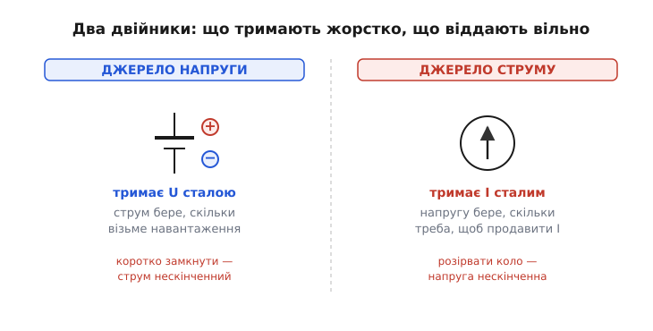
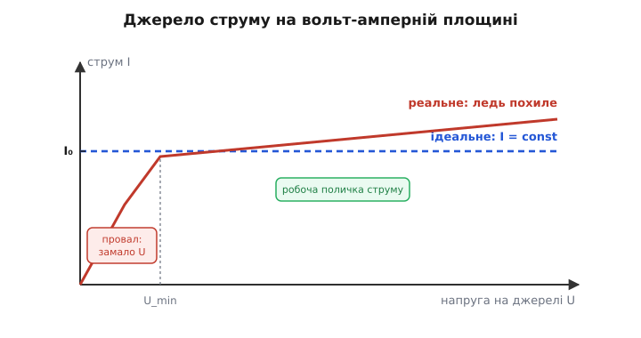
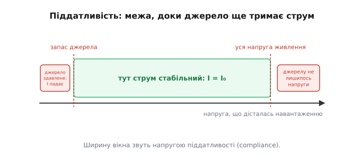
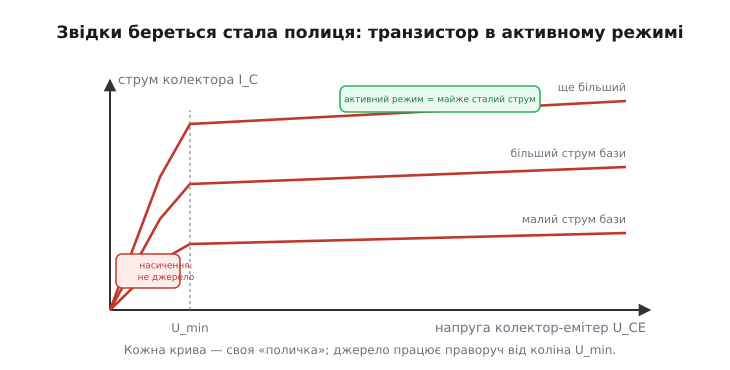

# Джерело струму

Майже кожен, хто вмикав батарейку, носить у голові той самий образ джерела: щось, що **тримає напругу**. Розетка дає свої 230 вольтів, пальчикова батарейка — півтора, і байдуже, що до них під'єднати — напруга та сама. Та існує другий, дзеркальний рід джерела, про який згадують рідше, хоч в аналоговій електроніці він не менш важливий: пристрій, що тримає не напругу, а **струм**. Скільки б не змінювалося навантаження, крізь нього тече той самий, наперед заданий струм — а напруга на ньому встановлюється сама, рівно така, якої цей струм потребує.

Назва пряма: **джерело струму** (англ. *current source*). І найважливіше про нього розуміти від самого початку — воно не якийсь дивний виняток, а **повноцінний двійник** звичного джерела напруги. Один тримає `U` і дозволяє струмові гуляти; другий тримає `I` і дозволяє гуляти напрузі. Щойно ви побачите цю симетрію, джерело струму перестане здаватися екзотикою.

*Два двійники. Джерело напруги тримає `U` сталою й віддає струм, скільки візьме навантаження (коротке замикання для нього згубне — струм рветься в нескінченність). Джерело струму тримає `I` сталим і само добирає напругу, скільки треба, щоб продавити цей струм (згубний для нього, навпаки, розрив кола — тоді в нескінченність рветься напруга). Символ ідеального джерела струму — коло зі стрілкою, що показує напрям струму.*

## Двійник джерела напруги

Найкоротший шлях зрозуміти джерело струму — поставити його поруч із джерелом напруги й помітити, що вони влаштовані за тим самим лекалом, лише ролі напруги й струму помінялися місцями.

Джерело напруги каже колу: «напруга на мені — `U₀`, а струм беріть який хочете». Якщо навантаження мале, потече великий струм; якщо велике — малий; джерелу однаково, воно лише тримає свою напругу. Гранична думка тут промовиста: **закоротіть** ідеальне джерело напруги нульовим опором — і за [законом Ома](topic:electronics/ohms-law) струм `I = U₀/0` рветься в нескінченність. Коротке замикання для джерела напруги — катастрофа саме тому, що воно вперто тримає напругу на нульовому опорі.

Джерело струму каже колу протилежне: «крізь мене тече `I₀`, а напруга на мені встановиться яка треба». Воно само піднімає на собі рівно стільки вольтів, скільки потрібно, аби продавити цей струм крізь те, що під'єднане. Велике навантаження — джерело підніме більшу напругу; мале — меншу; струм лишиться той самий. І дзеркальна гранична думка: **розірвіть** коло ідеального джерела струму — тепер уже напруга рветься в нескінченність, бо джерело відчайдушно намагається продавити свій струм крізь нескінченний опір. Для джерела струму згубний не короткий контакт, а **обрив**.

Ця симетрія не випадкова — вона глибока. Напруга й струм у теорії кіл — двоє **спряжених** величин, і майже кожне твердження про одну має дзеркального близнюка про другу. Те, що будь-який реальний двополюсник можна подати **або** як джерело напруги з послідовним опором ([еквівалент Тевеніна](topic:electronics/thevenin)), **або** як джерело струму з паралельним опором ([еквівалент Нортона](topic:electronics/norton)), — пряме свідчення цієї двоїстості. Та сама батарейка з її внутрішнім опором — це водночас і «майже джерело напруги», і «погеньке джерело струму»; яку модель брати, диктує лише те, що зручніше для конкретної задачі.

> 🔧 **Навіщо це.** Звичка бачити схему лише крізь напругу заводить у глухий кут там, де природна величина — струм. Світлодіодові байдуже до напруги на ньому — його яскравість і життя визначає **струм** крізь нього. Конденсатор інтегрує **струм** у напругу. Транзистор у підсилювачі хоче на вході сталий струм зміщення, а не сталу напругу. Кожного разу, коли ви ловите себе на думці «мені треба, щоб тут текло стільки-то міліампер, хай там що», — вам потрібне не джерело напруги з резистором (бо струм у нього попливе від найменшої зміни), а саме джерело струму.

## Ідеальне джерело: горизонтальна лінія

Найчесніший спосіб означити будь-яке джерело — намалювати його **вольт-амперну характеристику**: відкласти по горизонталі напругу на ньому, по вертикалі — струм крізь нього, і подивитися, яку лінію виводить пристрій, коли ми чіпляємо різні навантаження.

Для ідеального джерела струму ця лінія — **строго горизонтальна**. Хоч би яку напругу мало джерело на своїх затискачах, струм один і той самий — `I₀`. Горизонталь і означає «струм не залежить від напруги»: рушайте по ній ліворуч чи праворуч (тобто змінюйте напругу) — висота над віссю (струм) не змінюється. Для порівняння, ідеальне джерело напруги дало б на цій площині строго **вертикальну** лінію: напруга стала, струм будь-який. Знову та сама дзеркальність — горизонталь проти вертикалі.

*Джерело струму на вольт-амперній площині. Ідеальне (пунктир) — строго горизонтальна лінія: струм `I₀` за будь-якої напруги. Реальне (суцільна) збігається з ним лише на «робочій поличці»: зліва, доки напруги замало, струм провалюється, а сама поличка не точно горизонтальна — вона ледь росте з напругою. Що ця похила пряміша й горизонтальніша, то ближче пристрій до ідеалу.*

Горизонтальність характеристики має точну мову: **диференційний опір** джерела. Опір — це нахил вольт-амперної кривої, `ΔU/ΔI`. Якщо змінюєш напругу, а струм навіть не ворухнувся (`ΔI = 0`), то нахил нескінченний: **ідеальне джерело струму має нескінченний внутрішній опір**. І це знов дзеркало до джерела напруги, чий ідеал — **нульовий** внутрішній опір. Звідси одразу видно, що буде з неідеальністю: реальне джерело струму матиме внутрішній опір не нескінченний, а просто **дуже великий**, і його характеристика стане не строго горизонтальною, а ледь похилою.

## Реальне джерело: похила полиця й піддатливість

Ідеальних джерел струму не існує — як не існує ідеальних джерел напруги. Реальне джерело відрізняється від мрії двома цілком конкретними рисами, і обидві видно на тій самій характеристиці.

**Перше — полиця не строго рівна, вона ледь росте.** Реальний внутрішній опір великий, але скінченний, тож зі зростанням напруги на джерелі струм потроху збільшується. Нахил малесенький, та він є. Міра якості тут проста: чим **більший** внутрішній (його ще звуть вихідним) опір джерела, тим пологіша полиця й тим ближче воно до ідеалу. Гарне джерело струму на транзисторі має вихідний опір у сотні кілоом чи мегаоми — настільки крута характеристика, що для більшості задач полицю можна вважати рівною. Як саме нахил полиці перекладається в число вихідного опору й чому реальне джерело — це просто [еквівалент Нортона](topic:electronics/norton) з великим, але скінченним паралельним опором, розписано в [розборі вихідного опору джерела струму](topic:electronics/current-source/math-output-resistance.md).

**Друге — полиця не нескінченна, вона має край.** Джерело тримає струм, лише поки **здатне підняти на собі потрібну напругу**. А піднімати безмежно воно не може: будь-яке реальне джерело живиться від якоїсь шини живлення й не видасть напруги більшої, ніж та шина дає (мінус трохи на власні нутрощі). Тож на характеристиці зліва є **коліно**: доки напруги на джерелі замало, воно «здавлене» й струм провалюється нижче `I₀`; щойно напруги вистачає — струм виходить на полицю. Той діапазон напруг, у якому джерело ще чесно тримає струм, звуть **напругою піддатливості** (англ. *compliance voltage* — від *comply*, «коритися»; джерело «кориться» вимозі тримати струм, лише доки йому вистачає запасу напруги).

*Піддатливість. Струм тримається стабільним лише у вікні напруг: знизу його обмежує запас, потрібний самому джерелу (його нутрощам), згори — наявна напруга живлення. Якщо навантаженню віддали майже всю напругу й джерелу не лишилося запасу — воно «здавлюється» й струм падає. Ширину цього вікна й звуть напругою піддатливості.*

Звідси головне практичне правило роботи з джерелом струму: **завжди лишай йому запас напруги**. Якщо ви повісите на джерело струму завелике навантаження — таке, що для продавлювання заданого струму крізь нього треба більше вольтів, ніж джерело здатне підняти, — джерело вийде з вікна піддатливості, «здавиться» й струм впаде. Воно не зламається, просто перестане бути джерелом струму. Це дзеркало до правила для джерела напруги («не вантаж завеликим струмом, бо просяде»): джерело струму не можна вантажити **завеликим опором**, бо йому не стане напруги.

## Найпростіше реальне джерело: один транзистор

Найдешевша й найпоширеніша цеглинка, що поводиться як джерело струму, — звичайнісінький транзистор, виведений в **активний режим**. Щоб побачити чому, досить глянути на його вихідну характеристику — і та сама полиця, яку ми щойно малювали в теорії, з'явиться сама собою.

[Біполярний транзистор в активному режимі](topic:electronics/bjt-operation) має чудову властивість: його колекторний струм майже не залежить від колекторної напруги — він задається струмом бази (точніше, напругою база-емітер). Намалюйте вихідну характеристику — струм колектора проти напруги колектор-емітер — і ви побачите не пряму крізь початок, як у резистора, а **полицю**: після короткої крутої ділянки струм виходить на майже горизонтальний рівень і далі тримається, хоч би як росла напруга. Це і є поведінка джерела струму, подарована фізикою транзистора задарма.

*Звідки береться полиця. Вихідна характеристика транзистора: для кожного струму бази струм колектора після коліна `U_min` виходить на майже сталий рівень — готову «поличку» джерела струму. Доки напруги на транзисторі замало (зона ліворуч від коліна), він у насиченні й джерелом не працює — потрібен той самий запас напруги, що й вікно піддатливості. Полички ледь ростуть з напругою через ефект Ерлі — це і є скінченний вихідний опір реального джерела.*

Два знайомі дефекти лягають точно на свої місця. Коліно `U_min` зліва — це межа піддатливості: доки на транзисторі замало напруги, він провалюється в **насичення** й перестає тримати струм; йому потрібен запас (для біполярного — десь від 0.2 В). А легкий нахил полиць угору — це той самий скінченний вихідний опір, і в транзистора він має конкретну причину: [ефект Ерлі](topic:electronics/early-effect) (зі зростанням колекторної напруги ефективна база трохи стоншується, і транзистор проводить дужче). Чим слабший ефект Ерлі, то пологіша полиця, то ближче транзистор до ідеального джерела струму.

Лишається одна морока — **задати** цей струм точно. Колекторний струм керується напругою база-емітер, а та «пливе» з температурою (приблизно −2 мВ на градус), тож просто подати на базу фіксовану напругу й чекати стабільного струму не вийде. Цю задачу — як виставити транзисторові потрібний струм **точно й стабільно** — найелегантніше розв'язує [дзеркало струмів](topic:electronics/current-mirror): один транзистор «вимірює» опорний струм і виставляє відповідну напругу-мітку, а другий цю мітку повторює, відбиваючи струм у копію. Саме тому всередині аналогових мікросхем джерела струму майже завжди роблять дзеркалами, а не поодинокими транзисторами з резистором у базі.

А якщо джерело струму потрібне **назовні**, простим двополюсником, що його можна впаяти в схему, як деталь, — є ще дешевший трюк на польовому транзисторі. У [JFET](topic:electronics/jfet) можна закоротити затвор з витоком, і тоді крізь нього тече фіксований струм насичення `I_DSS`, заданий самою будовою транзистора, без жодного зовнішнього живлення керування. Такий двовивідний пристрій навіть продають готовим — як зробити з нього стабільне джерело струму, підібрати потрібний номінал і де чатують пастки, зібрано в [проєкті джерела струму на JFET](topic:electronics/current-source/proj-jfet-current-source.md).

## Керовані джерела струму

Усе дотепер було про **незалежне** джерело — те, що тримає наперед заданий, незмінний струм. Але в аналоговій схемотехніці не менш важливий другий рід: **кероване** джерело струму, чий струм не фіксований, а **підкоряється** якомусь керівному сигналу — найчастіше вхідній напрузі. Подав на вхід напругу — джерело прокачує в навантаження пропорційний їй струм, незалежно від того, що то за навантаження. По суті це перетворювач «напруга → струм», і в схемах його позначають не колом, а **ромбом** зі стрілкою — щоб одразу відрізнити кероване джерело від незалежного.

Навіщо воно? Бо величезний пласт електроніки керує саме струмом. Хочете плавно регулювати яскравість світлодіода напругою з мікроконтролера — вам потрібен не дільник напруги, а керована напругою «помпа струму», що жене в діод струм, пропорційний керівній напрузі, і не зважає на те, як падіння на діоді гуляє від нагрівання. Хочете прогнати точно відомий струм крізь невідомий опір, щоб виміряти цей опір (або крізь живу тканину, щоб виміряти її імпеданс) — знову треба джерело струму, кероване напругою.

Класична схема такого перетворювача на [операційному підсилювачі](topic:electronics/opamp) зветься помпою Хауленда. Її придумав Бредфорд Хауленд у Массачусетському технологічному інституті близько 1962 року, і цікаво вона тим, що вміє віддавати точний струм у **заземлене** навантаження — що геометрично не так просто влаштувати. Звідки взялася ця схема, як у ній грою опорів народжується нескінченний вихідний опір і де вона досі незамінна — у [розборі помпи Хауленда](topic:electronics/current-source/hist-howland-source.md).

## Де воно живе

Раз навчившись бачити джерело струму, ви впізнаватимете його скрізь, де природна величина — струм, а не напруга.

**Зміщення підсилювальних каскадів.** Найперше призначення джерела струму всередині будь-якого аналогового чипа — подати на каскади точний, стабільний робочий струм. Без нього робоча точка кожного транзистора «гуляла» б від температури й розкиду живлення. Саме джерело струму живить «хвіст» вхідної диференційної пари в операційному підсилювачі — той сталий струм, завдяки якому пара так добре відкидає синфазну заваду.

**Живлення світлодіода.** Яскравість і життя світлодіода визначає струм крізь нього, а не напруга. Падіння на діоді гуляє від екземпляра до екземпляра й від нагрівання, тож живити його сталою напругою через резистор — означає мати плаваючу яскравість і ризик спалити діод. Джерело струму дає незмінний струм незалежно від цих гулянь — тому всі пристойні драйвери світлодіодів усередині є саме джерелами струму.

**Лінійна зарядка конденсатора.** Конденсатор зв'язує струм і напругу через `I = C · dU/dt`. Якщо заряджати його **сталим** струмом, напруга наростає строго лінійно (прямою лінією) — а це основа генераторів пилкоподібної напруги, таймерів, аналого-цифрових перетворювачів подвійного інтегрування. Резистор так не вміє: він дає не пряму, а сповільнювану експоненту, бо струм крізь нього падає, щойно напруга на конденсаторі росте. Тільки джерело струму дає чесну пряму.

**Опорні джерела й давачі температури.** У бандгеп-джерелах опорної напруги та інтегральних термометрах усе тримається на струмах, пропорційних абсолютній температурі або, навпаки, від неї незалежних. Розводять ці струми теж джерелами струму.

> 🔧 **Навіщо це.** Джерело струму — це не екзотика, а друга половина базової пари «джерело напруги ↔ джерело струму». Бачите в задачі слова «хай тут тече стільки-то струму, хоч що під'єднано» — це знак, що потрібне джерело струму, а не напруга з резистором. Ідеальне має нескінченний вихідний опір (горизонтальна вольт-амперна полиця); реальне — дуже великий, але скінченний (полиця ледь похила), і працює лише у вікні піддатливості, тож завжди лишай йому запас напруги. Найдешевша реалізація — транзистор в активному режимі; точну й стабільну — роблять дзеркалом струмів; зовнішню двовивідну — на JFET; а кероване сигналом — помпою на операційному підсилювачі.

Уся ця тема тримається на одній простій думці, з якої ми почали: є двійко дзеркальних джерел, і друге з них тримає струм рівно так само вперто, як перше тримає напругу. Усе інше — нескінченний опір ідеалу, похила полиця й вікно піддатливості реалу, транзистор, дзеркало, помпа Хауленда — лише уточнює, **наскільки** добре конкретний пристрій справляється з цією впертістю. А сама суть лишається тією дзеркальною симетрією напруги й струму, що пронизує всю теорію кіл.
