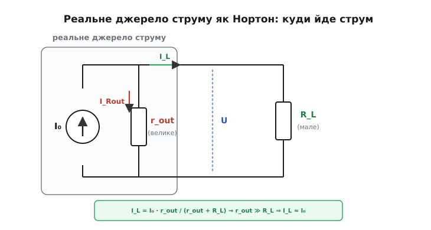

# 🧮 Вихідний опір джерела струму

Коли кажуть, що одне джерело струму «краще» за інше, майже завжди мають на увазі одне-єдине число — його **вихідний опір** (англ. *output resistance*). Воно й вирішує, наскільки джерело близьке до ідеалу: чи тримає воно струм залізно, хоч би що під'єднали, чи струм попливе від першої ж зміни навантаження. Усе, що в розмові про джерело струму звучить як похвала або докір — «жорстке», «м'яке», «пливе», «тримає мертво», — це насправді судження про одну величину. Розберімо її від самого означення до числа, яке можна виміряти приладом.

## Опір там, де нема резистора

Перше, що збиває з пантелику: при чому тут узагалі опір? Адже джерело струму — це не резистор, воно нічого не «опирає», навпаки, штовхає струм. Звідки в нього опір і чому саме він — мірило якості?

Уся річ у тім, що в теорії кіл слово **опір** має ширший зміст, ніж «гальмо для струму». Опір — це **нахил вольт-амперної кривої**: наскільки змінюється струм крізь пристрій, коли ми змінюємо напругу на ньому. Для звичайного резистора це знайомий закон Ома: `R = U/I`, і нахил усюди той самий, бо крива — пряма крізь початок. Та для будь-якого пристрою взагалі важливий не цей повний відносний нахил, а **локальний** — наскільки ворухнеться струм у відповідь на маленький поштовх напруги в робочій точці. Цю величину звуть **диференційним** (або **динамічним**) опором:

```
r = ΔU / ΔI
```

— наскільки треба змінити напругу (`ΔU`), щоб струм змінився на `ΔI`. Грецька «дельта» (Δ — від díaphora, «різниця») тут і означає «маленька зміна». Зверніть увагу: це **відношення приростів**, а не самих величин. Резистор `R = U/I` — окремий, найпростіший випадок, де приріст і повна величина дають те саме, бо крива пряма. Для джерела струму вони геть різні, і саме приростовий опір несе зміст.

Тепер дивимося на джерело струму його власною мовою — мовою вольт-амперної характеристики, де по горизонталі напруга на джерелі, по вертикалі струм крізь нього. Ідеальне джерело дає **горизонтальну** лінію: міняй напругу скільки хочеш, струм не ворухнеться. Підставмо це в означення:

```
ΔI = 0   (струм не змінюється, хоч би як рухали напругу)
r_out = ΔU / 0 = ∞
```

Ось і відповідь, чому ідеал — це **нескінченний** опір. Горизонтальна полиця означає `ΔI = 0` за будь-якого `ΔU`, а ділення скінченного на нуль і дає нескінченність. Це не математичний фокус і не випадковий збіг — це те саме твердження «струм не залежить від напруги», лише записане числом. Сказати «вихідний опір нескінченний» і сказати «струм абсолютно сталий» — це буквально одне й те саме, дві мови для однієї думки.

> 🔧 **Навіщо це.** Коли в даташиті на джерело струму (чи на «хвостове» джерело в підсилювачі) ви бачите рядок *output resistance: 2 MΩ* — це не якийсь паразит, який треба прибрати. Це **головна цифра якості**: чим вона більша, тим жорсткіше джерело тримає струм. Інженер читає її саме так — як «наскільки близько до ідеалу». Маленький вихідний опір (одиниці кілоом) — кепське джерело, струм гулятиме; мегаоми — добре; десятки й сотні мегаом (каскод, спеціальні схеми) — майже ідеал.

## Реал: полиця, що ледь росте

Ідеальних горизонталей у природі немає. Реальне джерело струму дає полицю, що **ледь-ледь росте** з напругою: піднімаєш напругу на джерелі — струм потроху повзе вгору. Нахил крихітний, але не нульовий. А раз `ΔI ≠ 0`, то й опір уже не нескінченний:

```
r_out = ΔU / ΔI   — велике, але СКІНЧЕННЕ число
```

Чим **пологіша** полиця (чим менший `ΔI` на той самий `ΔU`), тим **більший** `r_out` і тим ближче джерело до ідеалу. Це ключ до читання будь-якої вольт-амперної полиці на око: візьми її нахил — і ти знаєш якість джерела, без жодних формул про нутрощі.

Порахуймо на конкретній полиці, щоб число перестало бути абстракцією.

**Полиця піднялася на 2 мкА, коли напругу збільшили на 4 В. Який вихідний опір?**

```
ΔU = 4 В
ΔI = 2 мкА = 2·10⁻⁶ А
r_out = ΔU / ΔI = 4 / (2·10⁻⁶) = 2·10⁶ Ом = 2 МОм
```

Два мегаоми. Зверніть увагу, як працює це ділення: струм змінився на мікроампери, напруга — на вольти, і відношення «вольти на мікроампери» автоматично дає **мегаоми** (бо 1 В / 1 мкА = 10⁶ Ом). Тому добрі джерела струму майже завжди мають вихідний опір у мегаомах: природна одиниця тут — саме «вольти полиці» поділені на «мікроампери дрейфу».

І навпаки — якщо вам відомий `r_out` джерела, ви одразу знаєте, **наскільки попливе струм** від заданої зміни напруги на ньому, просто перевернувши формулу:

```
ΔI = ΔU / r_out
```

Це найкорисніша форма на практиці: вона прямо каже, скільки коштує неідеальність. Саме її ми зараз застосуємо до реального навантаження.

## Реальне джерело — це Нортон

Щоб рахувати, що робить вихідний опір у живій схемі, потрібна **модель** реального джерела. Найзручніша й найточніша — еквівалент Нортона: будь-яке реальне джерело струму подаємо як **ідеальне джерело `I₀` паралельно зі своїм вихідним опором `r_out`**.

Чому саме паралельно, а не послідовно? Бо `r_out` має робити рівно те, що ми спостерігаємо: давати струмові **шлях в обхід** заданого `I₀`. Поставте опір **послідовно** з ідеальним джерелом струму — і він нічого не змінить: крізь послідовне коло тече той самий струм, опір лише підніме на собі трохи напруги, але струм у навантаження лишиться `I₀` (це й була б знову ідеальна горизонталь). А поставте опір **паралельно** — і в нього потече власна частка струму, яка залежить від напруги на джерелі. Ось тоді струм у навантаження вже не дорівнює `I₀`, і полиця нахиляється. Тільки **паралельне** під'єднання `r_out` відтворює реальну поведінку, тому Нортон ставить його саме так.

> 🔧 **Навіщо це.** Це не абстракція для підручника — це те, як насправді влаштований кожен реальний підсилювальний каскад, що працює джерелом струму. Транзисторне джерело струму **і є** живий Нортон: ідеальна частина — це залежність струму від керування (струм бази чи напруга затвора), а `r_out` — паразитний канал, через який вихідна напруга «підкрадається» до струму попри керування. Намалювавши джерело як Нортон, ви отримуєте схему, яку можна рахувати тими самими законами Кірхгофа, що й будь-яке коло з резисторів. Без цієї моделі «вихідний опір» лишився б словом; із нею він стає вузлом, через який тече рахований струм.

Тепер у нас є все, щоб поставити головне запитання інженера: я хочу віддати в навантаження струм `I₀`, а скільки дійде насправді?


*Реальне джерело струму очима Нортона. Ідеальне джерело `I₀` штовхає струм у вузол, звідки той розходиться двома вітками: частина `I_Rout` тіче в обхід — крізь власний вихідний опір `r_out`, решта `I_L` доходить до навантаження `R_L`. Що більший `r_out` проти `R_L`, то тонша обхідна цівка й то ближче `I_L` до повного `I₀`. Обидві вітки під однією напругою `U` — це і є важіль, яким напруга крізь `r_out` краде струм у навантаження.*

## Як струм ділиться: дільник струму

Подивімося на схему Нортона очима Кірхгофа. Ідеальне джерело вганяє в спільний вузол повний струм `I₀`. З вузла є рівно два виходи: вниз через **власний** вихідний опір `r_out` і вбік через **навантаження** `R_L`. Обидві вітки висять між тими самими двома точками, отже на обох — **однакова напруга** `U`. А повний струм за першим законом Кірхгофа просто ділиться між ними:

```
I₀ = I_Rout + I_L
```

Тут `I_L` — те, що дійшло до навантаження (корисне), а `I_Rout` — те, що втекло крізь власний опір джерела (втрата). Кожну вітку проходить струм за законом Ома під спільною напругою `U`:

```
I_Rout = U / r_out
I_L    = U / R_L
```

Спільна напруга `U` нам наперед невідома — джерело само її встановить. Та її можна виключити, бо вона в обох виразах однакова. Поділимо одну вітку на другу — `U` скоротиться, і лишиться чисте відношення:

```
I_L / I_Rout = r_out / R_L
```

Прочитаймо це повільно, бо тут уся суть. Струми діляться **обернено** до опорів своїх віток: більший опір — менший струм крізь нього. У навантаження `R_L` (зазвичай малий опір) піде **більша** частка, у `r_out` (великий опір) — менша. І саме тому **великий `r_out` — це добре**: що він більший проти `R_L`, то меншою цівкою струм тікає повз навантаження, то ближче все `I₀` доходить, куди треба.

Тепер дотиснімо до прямої формули, скільки ж саме доходить. Підставмо `I_Rout = I₀ − I_L` у відношення вище й розв'яжемо щодо `I_L`. Вийде класичне **правило дільника струму**:

```
I_L = I₀ · r_out / (r_out + R_L)
```

Ось воно — серце всього розбору. Дріб `r_out/(r_out + R_L)` — це **частка** заданого струму, яка реально дістається навантаженню; решта губиться в `r_out`. Перевірмо його на двох крайнощах, бо добра формула мусить давати очевидне там, де відповідь і так ясна:

- **Ідеал `r_out → ∞`.** Дріб `r_out/(r_out + R_L) → 1`, тож `I_L → I₀`. Усе до краплі доходить — це й є ідеальне джерело. Нескінченний опір, нуль утрат.
- **Нікчема `r_out = R_L`.** Дріб дорівнює `1/2`: половина струму губиться. Джерело з вихідним опором, рівним навантаженню, віддає лише половину заданого струму — нікудишнє джерело.

Між цими крайнощами й живе вся практика, і вона диктує **золоте правило**:

```
r_out ≫ R_L   ⇒   I_L ≈ I₀   (джерело близьке до ідеалу)
```

Поки вихідний опір **набагато більший** за навантаження, дріб майже одиниця й копія струму майже точна. Щойно `R_L` підкрадається до `r_out` — джерело псується. Запам'ятайте цю нерівність: вона — єдиний критерій, чи можна вважати конкретне джерело «достатньо ідеальним» для конкретного навантаження.

> 🔧 **Навіщо це.** Звідси випливає тверезе інженерне рішення. Не питайте «який вихідний опір достатній» в абсолюті — питання завжди **відносне**: достатній **проти якого навантаження**. Джерело з `r_out = 100 кОм` чудове для навантаження в десятки ом, але кепське, якщо навантаження саме сотні кілоом. Тому, проєктуючи, ви тримаєте в голові не саме число `r_out`, а **запас** — у скільки разів воно більше за найбільший очікуваний `R_L`. Запасу в сотню разів зазвичай більш ніж досить (помилка ~1 %); запас удесятеро вже дає ~9 % недоливу — інколи забагато.

## Worked-приклад: 1 мА з вихідним опором 1 МОм

Тепер усе разом, на конкретних числах, як їх дають у даташиті.

**Джерело струму налаштоване на `I₀ = 1 мА`, його вихідний опір `r_out = 1 МОм`. Скільки струму дійде до навантаження `R_L = 1 кОм`? А до `R_L = 100 кОм`? І на скільки відсотків струм «попливе», коли навантаження зміниться з 1 кОм на 100 кОм?**

Спершу мале навантаження, `R_L = 1 кОм`:

```
I_L = I₀ · r_out / (r_out + R_L)
    = 1 мА · 1 000 000 / (1 000 000 + 1 000)
    = 1 мА · 1 000 000 / 1 001 000
    = 1 мА · 0.999001
    = 0.999 мА
```

Недолив — лише 0.1 %. Тут `r_out` більший за `R_L` у тисячу разів, тож майже все `I₀` доходить: дільник віддає 99.9 % заданого струму. Для більшості задач це чистий ідеал.

Тепер велике навантаження, `R_L = 100 кОм`:

```
I_L = 1 мА · 1 000 000 / (1 000 000 + 100 000)
    = 1 мА · 1 000 000 / 1 100 000
    = 1 мА · 0.90909
    = 0.909 мА
```

Уже 0.909 мА — недолив аж 9.1 %. Те саме джерело, той самий `r_out`, але запас упав до десятикратного — і похибка підскочила з 0.1 % до 9 %. Ось як працює відносність: **погіршало не джерело, а співвідношення** з навантаженням.

Тепер головне питання — **на скільки попливе струм** при переході навантаження з 1 кОм на 100 кОм:

```
ΔI_L = 0.999 мА − 0.909 мА = 0.090 мА = 90 мкА
```

Дев'яносто мікроампер дрейфу на мілліампері струму — це 9 % гуляння лише через зміну навантаження. Якби джерело було ідеальне, обидва навантаження отримали б рівно 1.000 мА й `ΔI_L = 0`. Уся ця хитавиця — плата за скінченний вихідний опір, і вона тим помітніша, чим ближче навантаження підбирається до `r_out`.

Корисно перевірити цей результат другим шляхом — через приростову формулу `ΔI = ΔU/r_out`, бо вона показує ту саму річ під іншим кутом. Коли навантаження виросло з 1 кОм до 100 кОм, напруга на джерелі (а отже й на `r_out`) піднялася приблизно з `1 мА · 1 кОм = 1 В` до `0.909 мА · 100 кОм ≈ 91 В`. (Така напруга в реальності неможлива — джерело давно вийшло б за межу піддатливості, — але як перевірка арифметики годиться.) Зміна напруги на джерелі `ΔU ≈ 90 В`, і вона жене крізь `r_out` додатковий струм:

```
ΔI_Rout = ΔU / r_out = 90 / 1 000 000 = 90·10⁻⁶ А = 90 мкА
```

Ті самі 90 мкА. Це не випадковість: струм, що «попливав» з навантаження, — це рівно той струм, що додатково втік крізь `r_out`, коли на ньому зросла напруга. Два погляди — дільник струму й приростовий опір — описують одну фізику й мусять збігатися завжди.

## Звідки полиця нахилена: вихідний опір транзистора

Лишилося замкнути коло й показати, звідки взагалі береться скінченний `r_out` у найпоширенішому джерелі струму — звичайному транзисторі в активному режимі. Адже в нього та сама полиця, лише дещо нахилена, і той нахил має конкретну фізичну причину.

У біполярного транзистора винуватець нахилу — **ефект Ерлі** (англ. *Early effect*, на честь Джеймса Ерлі з Bell Labs, який описав його 1952 року; статус — усталений факт, базова модель транзистора). Суть фізична: зі зростанням колекторної напруги збіднена область колекторного переходу ширшає й трохи «з'їдає» базу — ефективна база стоншується, і транзистор проводить дужче. Тому струм колектора не стоїть мертво, а повзе вгору з напругою — і полиця нахиляється.

Кількісно ефект Ерлі описують однією величиною — **напругою Ерлі** `V_A`. Геометрично це точка, у яку сходяться, якщо продовжити вліво за вісь, усі нахилені полиці транзистора; типово `V_A` лежить десь від 50 до 100 В (а в спеціальних «довгобазних» транзисторів і більше). А вихідний опір транзистора в робочій точці виходить простою формулою:

```
r_out = V_A / I_C
```

— напруга Ерлі поділена на робочий струм колектора. Звідки цей вигляд? Згадаймо `r_out = ΔU/ΔI`: нахил полиці тим крутіший (менший `r_out`), чим більший струм, на якому ми сидимо, бо всі полиці віялом розходяться з однієї точки `−V_A`. Більший `I_C` — крутіший промінь — менший опір; усе сходиться в одну формулу.

Порахуймо на типових числах, щоб відчути порядок:

**Транзистор із напругою Ерлі `V_A = 100 В` працює джерелом струму на `I_C = 1 мА`. Який його вихідний опір?**

```
r_out = V_A / I_C = 100 / 0.001 = 100 000 Ом = 100 кОм
```

Сто кілоом — пристойно, але далеко не мегаоми. Звідси відразу видно два важелі, якими піднімають якість транзисторного джерела. Перший: **менший робочий струм** дає більший `r_out` (на 0.1 мА вийшов би вже 1 МОм) — тому прецизійні джерела часто роблять «худими» за струмом. Другий, потужніший: схемами на кшталт **каскоду** ефективно множать `V_A` у десятки разів, заганяючи `r_out` у десятки мегаом, — там джерело вже майже ідеальне.

І останній місток назад до означення. Та сама нерівність `r_out ≫ R_L`, яку ми вивели з дільника струму, тепер набуває фізичного тіла: `r_out = V_A/I_C` каже, яким буде опір, а дільник `I_L = I₀·r_out/(r_out + R_L)` каже, що з цим опором станеться в схемі. Транзистор зі `100 кОм` віддасть свій струм у навантаження `100 Ом` майже без утрат (запас тисячократний), а в навантаження `100 кОм` — лише наполовину. Жодної нової фізики: усе те саме ділення струму між корисною віткою й паразитною, лише `r_out` тепер має ім'я та формулу. Ось чому вихідний опір — не дрібний параметр десь у кутку даташита, а **єдина цифра**, що ставить реальне джерело струму на шкалі між нікчемним і ідеальним.
