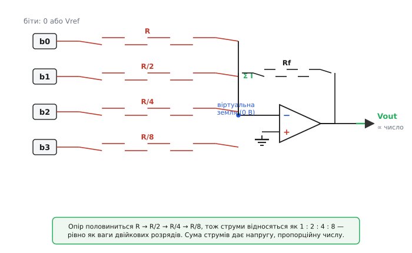
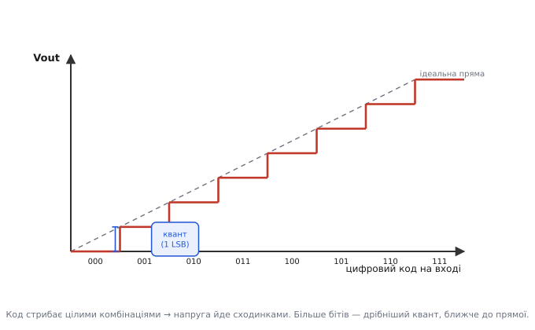
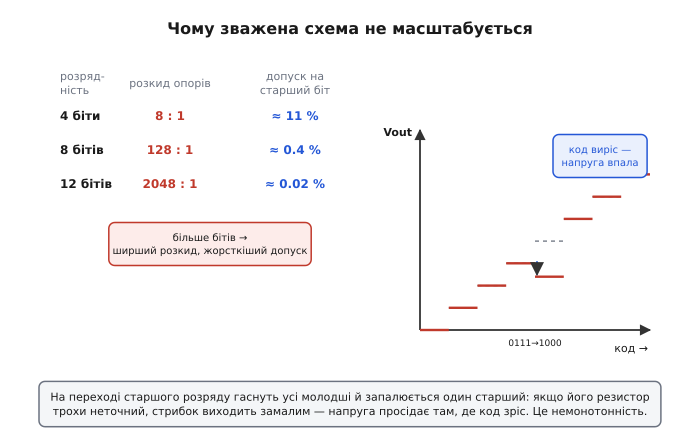

# ЦАП на зважених резисторах

Усередині мікроконтролера живуть самі числа — голі двійкові комбінації нулів і одиниць. А світ навколо аналоговий: гучномовцеві треба плавна напруга, антені — гладка хвиля, регулятору яскравості — будь-який рівень між темрявою і повним світлом. Тож десь має статися переклад: **число → напруга**. Пристрій, що його робить, звуть цифро-аналоговим перетворювачем (ЦАП, англ. *DAC — digital-to-analog converter*). А найпряміший, майже «лобовий» спосіб його збудувати — кілька резисторів, кожен своєї ваги, зведені на один [суматор](topic:electronics/summing-difference-amp). Розберімо саме його: він простий до прозорості, і на ньому видно **саму ідею** перетворення, перш ніж вона ховається в кремній.

## Що означає «вага» двійкового розряду

Почнімо з того, що взагалі означає двійкове число. Візьмімо чотири біти — `1011`. У звичній десятковій звичці кожна цифра має свою вагу: одиниці, десятки, сотні. У двійковій те саме, лише ваги — степені двійки. Старший біт коштує 8, далі 4, потім 2, наймолодший — 1:

```
1011₂ = 1·8 + 0·4 + 1·2 + 1·1 = 11
```

Ось і вся таємниця. Число — це **зважена сума розрядів**, де ваги подвоюються від молодшого до старшого. А ми вже знаємо схему, що вміє складати напруги зі **своїми коефіцієнтами** для кожного входу, — це [суматор на операційному підсилювачі](topic:electronics/summing-difference-amp). Думка визріває сама собою: якщо подати біти на входи суматора, а коефіцієнти підібрати рівно як двійкові ваги 8 : 4 : 2 : 1, то на виході з'явиться напруга, **пропорційна самому числу**. Перетворювач — це просто суматор із правильно дібраними резисторами.

> 🔧 **Навіщо це.** Майже в кожній платі є вихід, де треба видати плавну напругу: керувати яскравістю світлодіода чи екрана не вмиканням-вимиканням, а рівнем; задати опорну точку компаратора програмно; згенерувати звук або форму хвилі; виставити струм у драйвері двигуна. Усередині цих вузлів і сидить ЦАП. Зважені резистори — найпрозоріший його різновид: побачивши, **як** він рахує, ви розумієте принцип усіх інших ЦАП, навіть складніших.

## Як суматор перетворює число на напругу

Згадаймо механіку суматора в найкоротшому вигляді. Інвертуючий вхід операційного підсилювача утримується схемою точно на нулі — це [віртуальна земля](topic:electronics/virtual-ground): сам вузол нікуди не під'єднаний до землі дротом, але зворотний зв'язок ОП тримає його напругу нульовою. Кожен вхідний резистор жене в цей вузол свій струм, рівний (вхідна напруга)/(опір), бо інший його кінець — на нулі. У сам вхід підсилювача струм не тече, тож усі вхідні струми складаються й цілком ідуть крізь резистор зворотного зв'язку Rf, обертаючись там на вихідну напругу.

Тепер головний хід. Подамо кожен біт як напругу: логічний нуль — це 0 В, логічна одиниця — стала опорна напруга Vref (скажімо, 5 В). А резистори підберемо так, щоб **старший біт давав найбільший струм**. Найпростіше: наймолодший біт — крізь резистор R, наступний — крізь R/2 (удвічі менший опір → удвічі більший струм), далі R/4, а старший — крізь R/8. Опір половиниться — струм подвоюється, рівно як ваги розрядів.

```
біт b0 (вага 1):  струм = b0·Vref / R       (b0 — це 0 або 1)
біт b1 (вага 2):  струм = b1·Vref / (R/2) = b1·Vref·2 / R
біт b2 (вага 4):  струм = b2·Vref / (R/4) = b2·Vref·4 / R
біт b3 (вага 8):  струм = b3·Vref / (R/8) = b3·Vref·8 / R
```

Закон струмів Кірхгофа складає їх у віртуальній землі, а Rf обертає суму на напругу. Винесімо спільні множники:

```
Vout = − Rf · (Vref / R) · (8·b3 + 4·b2 + 2·b1 + 1·b0)
                            └──────────────┬──────────────┘
                              це і є саме двійкове число N
```

У дужках — точнісінько та зважена сума розрядів, з якої ми почали, тобто саме число N. Усе перед нею — спільний сталий коефіцієнт. Тобто **вихідна напруга прямо пропорційна числу**, яке ви записали в біти. Запишете 0000 — на виході 0; запишете 1111 (тобто 15) — на виході максимум; кожна одиниця, додана до числа, піднімає вихід рівно на одну сходинку Rf·Vref/R. Знак «мінус» — спадок інвертуючої схеми; його легко прибрати наступним інвертором або просто врахувати в розрахунку. Суматор буквально «зважив» біти й виставив напругу.


*Кожен біт через свій зважений резистор жене струм у спільну віртуальну землю. Опір половиниться від молодшого розряду до старшого, тож струми відносяться як 1 : 2 : 4 : 8 — точно як ваги двійкових розрядів. Закон Кірхгофа складає їх, а резистор зворотного зв'язку обертає суму на вихідну напругу.*

Чому це гарно саме як механізм? Складання тут робить не якась «логіка» — його робить **сама природа** у вузлі: кожен біт незалежно ллє свій струм (вузол на нулі, тож входи не «бачать» один одного), а закон Кірхгофа просто підсумовує струми. Підсилювач лише забирає суму й робить із неї напругу. Це той самий принцип, на якому аналогові обчислювачі додавали числа: напруги → струми → сума струмів → напруга.

## Сходинки: дискретний вихід

Варто одразу вловити, що вихід ЦАП **не безперервний**. Біти бувають лише цілими комбінаціями, тож і напруга стрибає **сходинками**. Чотири біти дають 2⁴ = 16 рівнів — від 0000 до 1111. Висота однієї сходинки — це внесок наймолодшого біта; її звуть **квантом** або одиницею молодшого розряду (англ. *LSB — least significant bit*). Між сусідніми рівнями ЦАП напруги видати не може — її там просто немає.

Звідси проста, але важлива думка: **кількість бітів — це роздільність**. Більше бітів — дрібніші сходинки, плавніший вихід. Вісім бітів дають 256 рівнів, дванадцять — 4096, шістнадцять — аж 65536. Чим тонше треба «намалювати» аналоговий сигнал, тим більше розрядів потрібно, тим менший квант:

```
квант = повний_розмах / (2^N − 1)
```

**Скільки коштує одна сходинка 8-бітного ЦАП.** Опорна напруга Vref = 5 В, повний розмах виходу теж 5 В, розрядність N = 8.

```
рівнів:   2⁸ = 256
кроків:   256 − 1 = 255
квант:    5 В / 255 = 0.0196 В ≈ 19.6 мВ
```

Отже, такий ЦАП виставляє напругу з кроком близько 20 мВ: значенню 0 відповідає 0 В, значенню 128 — приблизно 2.5 В, значенню 255 — повні 5 В. Хочете тонше — беріть більше бітів: 12-бітний ЦАП із тим самим розмахом дасть квант лише 5 / 4095 ≈ 1.2 мВ.


*Вихід ЦАП не плавний, а сходинковий: кожному цілому коду відповідає свій рівень напруги. Висота однієї сходинки — квант (LSB). Більше бітів — дрібніші сходинки, ближче до гладкої лінії, але між рівнями напруги немає за означенням.*

## Worked-приклад: подаємо число з мікроконтролера

Покажемо весь шлях наскрізно — від числа у програмі до напруги на виході. Хай у нас 4-бітний ЦАП на зважених резисторах: Vref = 5 В, наймолодший резистор R = 80 кОм, далі 40, 20, 10 кОм, а Rf підібрано так, щоб повний код 1111 дав рівно 5 В на виході (без урахування знака інверсії). Мікроконтролер виставляє біти на чотирьох виводах порту.

**Код для виставлення значення.** Хочемо вивести число 11 (`1011₂`) — тобто запалити біти b0, b1 і b3:

:::tabs
```c
#include <stdint.h>

// Чотири виводи, на яких висять резистори R, R/2, R/4, R/8.
// PIN_B0 — наймолодший біт (через найбільший резистор R),
// PIN_B3 — старший біт (через найменший резистор R/8).
#define PIN_B0  0   // вага 1
#define PIN_B1  1   // вага 2
#define PIN_B2  2   // вага 4
#define PIN_B3  3   // вага 8

// Виставити 4-бітне значення на ЦАП із зважених резисторів.
void dac_write(uint8_t value)
{
    gpio_write(PIN_B0, (value >> 0) & 1);   // наймолодший біт
    gpio_write(PIN_B1, (value >> 1) & 1);
    gpio_write(PIN_B2, (value >> 2) & 1);
    gpio_write(PIN_B3, (value >> 3) & 1);   // старший біт
}

int main(void)
{
    dac_write(11);   // 1011 → очікуємо рівень коду 11 із 15
    for (;;) { }
}
```
```python
from machine import Pin

# Чотири виводи, на яких висять резистори R, R/2, R/4, R/8.
# pins[0] — наймолодший біт (через найбільший резистор R),
# pins[3] — старший біт (через найменший резистор R/8).
pins = [Pin(n, Pin.OUT) for n in (0, 1, 2, 3)]   # ваги 1, 2, 4, 8

# Виставити 4-бітне значення на ЦАП із зважених резисторів.
def dac_write(value):
    for i, pin in enumerate(pins):
        pin.value((value >> i) & 1)   # біт i → від молодшого до старшого

dac_write(11)   # 1011 → очікуємо рівень коду 11 із 15
while True:
    pass
```
:::

**Що буде на виході.** Код 11 запалює b3, b1, b0 (на цих виводах Vref = 5 В), а b2 лишається на нулі:

```
зважена сума:  8·1 + 4·0 + 2·1 + 1·1 = 11
повний розмах: код 15 → 5 В
квант:         5 В / 15 = 0.3333 В
вихід:         11 · 0.3333 = 3.667 В
```

Записали в чотири біти число 11 — дістали 3.667 В. Поставите 15 — буде 5 В, поставите 8 — рівно 2.667 В. Жодної аналогової «магії»: програма керує бітами, резистори зважують їхні струми, суматор їх складає. Зверніть увагу на головне в коді: молодший біт іде на вивід із **найбільшим** резистором, старший — із найменшим. Сплутаєте порядок — і зважена сума розсиплеться, ЦАП почне видавати безлад.

> 🔧 **Навіщо це.** Такий ЦАП на кількох резисторах і вільних виводах порту іноді ставлять навмисне: коли в мікроконтролері немає вбудованого ЦАП, а треба, скажімо, плавно керувати опорним рівнем компаратора чи видати кілька градацій напруги. Для 3–4 бітів це дешево й працює. Але тільки-но захочеться більшої роздільності, вилазить вада, заради якої цей різновид майже не застосовують у серйозних пристроях, — про неї далі.

## Фатальна вада: розкид опорів

Здавалося б, рецепт ідеальний: хочеш більше бітів — додай ще резисторів удвічі меншого опору. Та саме тут схема й ламається. Кожен новий старший біт вимагає резистора **вдвічі меншого** за попередній, тож відношення між найбільшим і найменшим опором у схемі росте як 2^(N−1). Для чотирьох бітів це ще терпимо — 8:1. А для восьми вже **128:1**, для дванадцяти — більш ніж дві тисячі до одного.

```
N бітів  →  розкид опорів = 2^(N−1)
  4 біти  →  8 : 1        (наприклад, 80 кОм … 10 кОм)
  8 бітів →  128 : 1      (наприклад, 1.28 МОм … 10 кОм)
 12 бітів →  2048 : 1     (наприклад, 20.5 МОм … 10 кОм)
```

Це породжує одразу два лиха, і обидва смертельні.

Перше — **сам набір номіналів**. Щоб напруга була точною, кожен резистор має точно дорівнювати **подвоєному** сусідові: 10.000 кОм, 20.000, 40.000, 80.000 — і всі зі своїм власним малим допуском. Дістати десяток резисторів, що ідеально лягають у двійковий ряд, та ще й однаково «пливуть» від температури, — задача важка й дорога вже для восьми бітів.

Друге, тонше, але руйнівніше — **внесок старшого біта вимагає найвищої точності**, бо саме він важить найбільше. Підрахуймо: у 8-бітному ЦАП старший біт коштує 128 квантів. Щоб його похибка не перевищила навіть **одного** кванта (інакше вихід почне «брехати» помітніше за свою ж роздільність), резистор старшого розряду має бути точним краще ніж 1/128 — це приблизно **0.4 %**. А для 12 бітів старший біт важить 2048 квантів, і точність потрібна вже близько 0.02 % — такі резистори рідкісні й коштовні.

Звідси й найгірший наслідок — **немонотонність**. Уявімо перехід коду з 0111 на 1000 у нашому 4-бітному прикладі: гасимо три молодші біти й запалюємо один старший. В ідеалі вихід має піднятися рівно на один квант. Але якщо резистор старшого біта трохи завеликий (дає замало струму), а молодші трохи замалі, то вмикання старшого розряду може дати **менший** стрибок, ніж щойно згасла трійка молодших, — і напруга на виході **впаде там, де код виріс**. ЦАП перестає бути монотонним: ростиш число — а напруга місцями падає. Для регулятора чи звуку це справжня катастрофа.


*Чим більше бітів, тим ширший потрібний розкид опорів (зростає як 2^(N−1)) і тим жорсткіший допуск на старший резистор. Уже на 8 бітах треба точність краще 0.4 %, на 12 — близько 0.02 %. Найнебезпечніший наслідок — немонотонність на переході старшого розряду: код виріс, а напруга просіла.*

Саме тому ЦАП на зважених резисторах добрий хіба для **кількох розрядів** і як наочна модель самого принципу, а в реальних мікросхемах його майже не вживають. Замість десятка точно дібраних номіналів інженери знайшли спосіб обійтися лише **двома** значеннями опору — R і 2R, — поєднавши їх драбинкою. [Драбинковий ЦАП R-2R](topic:electronics/dac-r-2r) дає ту саму двійкову вагу, але всі резистори в ньому однакові (або вдвічі більші), тож їх легко підігнати один до одного просто поряд на кристалі — і немонотонність зникає. Через це майже всі ЦАП на резисторах будують саме драбинкою, а зважена схема лишається тим, з чого думку найкраще починати.

> 🔧 **Навіщо це.** Урок ширший за ЦАП: **точність схеми тримається не на абсолютних номіналах, а на тому, як добре елементи узгоджені між собою**. Зробити два резистори поряд на кремнії однаковими з точністю до тисячних — легко; зробити їх точно рівними якомусь абсолютному значенню чи витримати між ними відношення 2048:1 — майже неможливо. Тому вся точна аналогова схемотехніка (ЦАП, [дзеркала струму](topic:electronics/current-mirror), [різницеві підсилювачі](topic:electronics/summing-difference-amp)) будується на **узгодженні однакових елементів**, а не на доборі різних. Зважений ЦАП — наочний приклад того, як зневага до цього правила вбиває схему.

## Звідки взялася ідея

Сама думка «зважений дільник, що перетворює код на величину» старша за електроніку. Прообразом служить [подільник Кельвіна-Варлі](topic:electronics/dac-weighted-resistors/hist-dac-origins.md) — точний резисторний подільник напруги, де перемиканням відводів набирали потрібну частку, як набирають десяткове число. Перші ж справжні цифро-аналогові вузли народилися в 1950-х разом із цифровими обчислювачами й радарами, коли постала зворотна задача: машина рахує числами, а керувати треба аналоговим світом. Хто і коли зібрав перший комерційний перетворювач, на яких лампах він працював і скільки важив — у [короткій історичній вставці](topic:electronics/dac-weighted-resistors/hist-dac-origins.md).

Картина складається в одне ціле. ЦАП на зважених резисторах — це той самий [інвертуючий суматор](topic:electronics/inverting-noninverting), якому замість довільних резисторів дали двійковий ряд ваг. Він прозоро показує, **що таке перетворення числа на напругу**: зважити розряди струмами й скласти їх у вузлі. Уся його слабкість — у вимозі розкиду точних опорів, що швидко стає нездійсненною. І саме ця слабкість підказала розв'язок — драбинку з двох однакових значень, на якій стоїть майже вся реальна цифро-аналогова техніка. Тож зважена схема цінна не як робочий пристрій, а як **найясніша точка входу** в усе перетворення сигналів.
