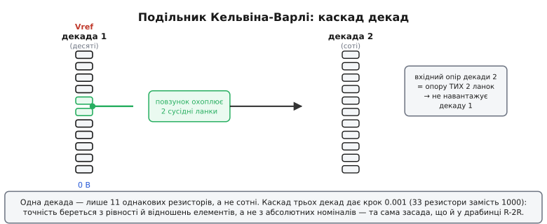
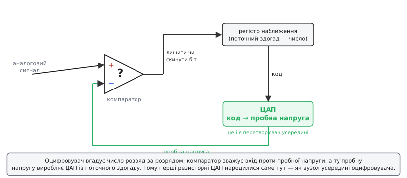

# 📜 Як народився цифро-аналоговий переклад: від відводів Кельвіна до перших ламп

Уявіть лабораторію кінця XIX століття. Електрику вже навчилися міряти, але **задавати** точну напругу — наперед, числом, поворотом ручки — ще ні. Якщо потрібна частка опорної напруги, скажімо 0.473 від еталона, її доводилося ловити пересувним контактом по дроту-реостату, на око зводячи стрілку гальванометра в нуль. Точно, повільно, і щоразу заново. А думка, яка з цього виросла, виявилася напрочуд живучою: **набирати потрібну величину розрядами, як набирають число** — десятки, одиниці, десяті, соті, — щоб кожен поворот ручки додавав свою «вагу». Через століття та сама думка ляже в основу будь-якого ЦАП на резисторах, тільки повертати ручки буде вже не людина, а біти.

Ця вставка — про те, звідки взялася ідея перекладу «число → величина» й хто зробив її залізом. Тут три дійові епохи: точний резисторний подільник, що лиш прообраз; перші справжні цифро-аналогові вузли, які народилися не самі по собі, а як **половинка** іншої машини — оцифровувача радарних та обчислювальних сигналів; і перша лампова стійка вагою з холодильник, яку справді можна було купити. Усе, що нижче, — усталена історія техніки; де закінчується факт і починається легенда, я кажу прямо.

## Подільник, який умів «набирати» напругу: Кельвін і Варлі

Найперший прообраз ЦАП — це навіть не перетворювач, а **точний дільник напруги**, який пізніше назвуть подільником Кельвіна-Варлі (англ. *Kelvin–Varley divider*). Названо його за двома британцями. Перший — **Вільям Томсон** (William Thomson), згодом лорд Кельвін (Lord Kelvin) — той самий фізик, чиїм іменем зветься абсолютна шкала температури; титул «Baron Kelvin» він отримав 1892-го за прокладання трансатлантичного телеграфу. Другий — **Кромвель Флітвуд Варлі** (Cromwell Fleetwood Varley), телеграфний інженер, один із головних людей того ж таки трансатлантичного кабелю. Це важлива дрібниця: подільник народився не з абстрактної цікавості, а з **телеграфної потреби** точно міряти й порівнювати опори довгих підводних ліній.

> Статус доказовості: усталено. Імена, ролі й телеграфний контекст підтверджені біографіями та історією метрології. Точне розмежування «хто саме що додав» між Кельвіном і Варлі — частково розмите часом, і я нижче кажу, де саме.

Розберімо саму ідею — вона напрочуд гарна. Хай треба ділити напругу з точністю до тисячної: дістати будь-яку частку від 0.000 до 0.999. «Лобовий» спосіб — ланцюг із тисячі однакових резисторів і повзунок, що знімає напругу з потрібного вузла. Тисяча точних резисторів — це дорого, громіздко й важко підігнати. Кельвін і Варлі знайшли витончений обхід: **каскад декад**, де одна декада — це лише одинадцять резисторів, а не сотні.

Працює так. Перша декада — ланцюг із одинадцяти однакових резисторів між опорними виводами; повзунок на ньому вибирає грубу частку — десяті: 0.1, 0.2, …, 0.9. Але повзунок не просто знімає напругу — він **охоплює два сусідні резистори** й подає їх на вхід наступної декади. Друга декада влаштована так, що її повний вхідний опір дорівнює рівно опору тих **двох** охоплених резисторів. Тому вона не збурює першу: для першої декади друга «виглядає» точнісінько як ті два резистори, які вона замінила. А всередині себе друга декада знову ділить цей проміжок на десять — додає соті. Третя декада так само додає тисячні. Каскад трьох декад дає будь-яке відношення від 0 до 1 кроком 0.001 — а резисторів усього тридцять три замість тисячі.

```
Одна декада = 11 однакових резисторів.
Повзунок охоплює 2 сусідні → подає їх на наступну декаду.
Наступна декада має вхідний опір = опору цих 2 резисторів,
   тому НЕ навантажує попередню (вона їх «заміщає» собою).
3 декади → крок 0.001 (33 резистори), а не 1000.
```


*Одна декада — лише одинадцять однакових резисторів. Повзунок охоплює два сусідні й подає їх на наступну декаду, вхідний опір якої дорівнює опору саме цих двох ланок, тож вона не навантажує попередню. Три декади дають крок 0.001 із тридцяти трьох резисторів замість тисячі — точність із рівності й відношень, не з абсолютних номіналів.*

> 🔧 **Навіщо це.** Тут — у чистому, ще «механічному» вигляді — та сама ідея, що й у ЦАП на зважених резисторах та в [драбинці R-2R](topic:electronics/dac-r-2r): **точність береться не з абсолютних номіналів, а з рівності й відношень елементів**. Одинадцять однакових резисторів зробити рівними між собою — посильно; тисячу різних із заданими номіналами — ні. Сучасний резисторний ЦАП будують на тій самій засаді, лиш «повзунки» в ньому — це ключі, якими керують біти.

Тепер про дати — і тут треба бути обережним, бо це місце люблять переказувати неточно. Варлі **запатентував** свою схему точного вимірювання опору 1860 року, а 1866-го доповів про «новий метод випробування електричного опору» (англ. *On a new Method of Testing Electrical Resistance*) Британській асоціації сприяння науці в Ноттінгемі. Кельвінів внесок у точне ділення й порівняння опорів лягає в ту саму епоху — 1860-ті. Тобто **сам прообраз — це 1860-ті роки**, доба трансатлантичного телеграфу, а не пізніше. (Брифи інколи кажуть «1930-ті» — це помилка: у 1930-х подільник лише дозрівав до промислового, лабораторного приладу, але **ідея й перші реалізації — на сімдесят років раніші**.)

> Статус доказовості: усталено для 1860-х як доби народження ідеї (патент Варлі 1860, доповідь 1866). «1930-ті» як дата винаходу — хибне обрамлення; коректно — доба індустріалізації приладу, не його поява.

Чому це лише прообраз, а не ЦАП? Бо керує ним **людина**, а не число. Повзунками ви руками «набираєте» частку — пристрій не приймає на вхід двійковий код і не перетворює його сам. Та концептуально все вже на місці: дискретний набір положень (розрядів) → точна аналогова частка на виході. Залишалося замінити пальці на електричні ключі, а ручне рішення «куди поставити повзунок» — на біти числа. Це й станеться за пів століття, коли з'явиться той, хто змусить машину рахувати числами.

## Чому ЦАП народився як половинка оцифровувача

Тут варто на мить спинитися й спитати: а навіщо взагалі знадобилося перетворювати **число на напругу**? Подільник Кельвіна-Варлі такої задачі не ставив — він ділив напругу на напругу. Справжня потреба в перекладі «код → аналог» з'явилася аж тоді, коли народилися машини, що **мислять числами**: цифрові обчислювачі й, що навіть важливіше історично, **радари та системи телеметрії** часів і одразу по Другій світовій.

Логіка була така. Радар бачить аналоговий світ — відбиту хвилю, кут, дальність. Щоб машина опрацювала це числом (відфільтрувала шум, відстежила ціль, порахувала траєкторію), сигнал треба **оцифрувати**: перетворити напругу на число. Це задача аналого-цифрового перетворювача (англ. *ADC — analog-to-digital converter*), і саме її гостро потребували військові обчислювальні системи 1950-х. А тепер ключова деталь, без якої не зрозуміти народження ЦАП: **найпоширеніший спосіб оцифрувати напругу містить усередині себе зворотний перетворювач — ЦАП**.

Працює це методом, який назвуть порозрядним зважуванням, або послідовним наближенням (англ. *successive approximation*). Машина вгадує число розряд за розрядом, від старшого до молодшого, як ви вгадували б вагу на терезах гирями: поклали найбільшу гирю — переважує? приберіть; не переважує? лишіть і додавайте меншу. Тільки «гирі» тут — це біти, а «терези» — компаратор, що порівнює вхідну напругу з пробною. А **пробну напругу для кожного здогаду виробляє саме внутрішній ЦАП**: він бере поточний здогад-число й перетворює його на напругу, яку компаратор зіставляє з входом.

```
Оцифровування методом послідовного наближення:
  здогад (число) → [внутрішній ЦАП] → пробна напруга
  компаратор: вхід > пробна?  → лишити біт, інакше скинути
  від старшого біта до молодшого → готове число
                    ▲
        ОСЬ ВІН — ЦАП усередині оцифровувача
```


*Серце оцифровувача-наближувача. Компаратор-«терези» порівнює вхідний сигнал із пробною напругою; рішення «лишити чи скинути біт» уточнює число-здогад у регістрі; а пробну напругу для кожного здогаду виробляє ЦАП. Саме тому перші резисторні ЦАП народилися як вузол усередині оцифровувача, а не самостійним приладом.*

Звідси й історичний парадокс: **ЦАП спершу знадобився не сам по собі, а як вузол усередині оцифровувача**. Перші серйозні резисторні ЦАП народилися в утробі ADC для радарів та обчислювачів. Лише згодом їх почали виймати назовні й застосовувати прямо — щоб машина керувала аналоговим світом: видавала напругу на самописець, на дисплей, на виконавчий механізм.

> 🔧 **Навіщо це.** Цей зв'язок живий і сьогодні. Найпоширеніша архітектура ADC у мікроконтролерах — той самий SAR (successive-approximation register), і всередині кожного такого ADC справді сидить ЦАП (зазвичай на перерозподілі заряду або на резисторній драбинці). Тобто, вивчаючи резисторний ЦАП, ви вивчаєте серце переважної більшості вбудованих оцифровувачів — вони працюють «задом наперед» через той самий перетворювач.

## «Coding by Feedback Methods»: коли драбинку описали на папері

Перш ніж дійти до заліза, треба назвати працю, яку в історії перетворювачів згадують як одну з засадничих: статтю **Б. Д. Сміта** (B. D. Smith) «Coding by Feedback Methods» (укр. *кодування методами зворотного зв'язку*), що вийшла в *Proceedings of the IRE* у **серпні 1953 року**.

Чим вона важлива? Сміт чітко й узагальнено описав сам **принцип зворотного зв'язку** в оцифровуванні: ставиш у петлю зворотного зв'язку перетворювач код→напруга (тобто ЦАП), а сам оцифровувач підлаштовує код, доки пробна напруга не зійдеться з входом. І, що тонше, Сміт зауважив глибоку річ: передавальна характеристика такого оцифровувача — це **обернена** характеристика того ЦАП, що стоїть у петлі. Поставиш у зворотний зв'язок ЦАП із нерівномірними, навмисно «кривими» вагами — і дістанеш оцифровувач із нелінійною характеристикою. Саме ця ідея згодом ляже в основу **компандування** в телефонії (стиснення динамічного діапазону голосу перед передачею), але корінь у неї — отут, у роботі 1953-го.

> 🔧 **Навіщо це.** Стаття Сміта — місток від «ручного» подільника Кельвіна-Варлі до автоматичного перетворення. У подільнику людина крутить ручки, доки стрілка не стане в нуль; у схемі Сміта це робить **петля зворотного зв'язку** сама, а ЦАП у ній — електричний еквівалент тих повзунків. Тут уперше ясно сказано: оцифровувач і ЦАП — дві сторони одного механізму.

> Статус доказовості: усталено. Стаття реальна, рік і журнал підтверджені історичними оглядами перетворювачів (зокрема канонічним нарисом історії перетворення даних від Analog Devices). Її роль як раннього опису петлі зі зворотним перетворювачем у ній — загальновизнана.

Звідси видно, що до середини 1950-х **думка вже дозріла на папері**: і подільник на однакових резисторах, і петля зі зворотним ЦАП усередині. Бракувало того, хто збере це в робочий, продаваний прилад. І така людина знайшлася.

## Бернард Ґордон і перший комерційний перетворювач: DATRAC

Головна постать у народженні промислового цифро-аналогового (і аналого-цифрового) заліза — **Бернард Маршалл Ґордон** (Bernard Marshall Gordon), американський інженер, якого в галузі звуть «батьком швидкого аналого-цифрового перетворення». Він народився **1927 року** в Спрінгфілді (штат Массачусетс), здобув ступені з електротехніки в Массачусетському технологічному інституті (MIT).

Шлях, яким він дійшов до перетворювачів, сам по собі промовистий. На зорі кар'єри Ґордон працював у Eckert-Mauchly Computer Corporation — фірмі творців ENIAC, — де відповідав за стандартні схеми, акустичну пам'ять і вузли вводу-виводу **першого комерційного цифрового обчислювача UNIVAC I**. Тобто людина прийшла в перетворювачі **з боку цифрових машин** — і це не випадковість. Той, хто будував перший комерційний обчислювач, найкраще відчував біль: машина рахує числами блискавично, а спілкуватися зі світом — діставати аналогові сигнали й видавати їх — їй майже нічим. Перетворювач був не примхою, а **тим містком, якого бракувало цифровій машині**, щоб торкнутися реальності.

> Статус доказовості: усталено. Рік народження, навчання в MIT, робота над UNIVAC I в Eckert-Mauchly, титул «батька швидкого аналого-цифрового перетворення», Національна медаль технологій (1986) — підтверджені біографіями та матеріалами наукових фундацій.

1953 року Ґордон разом із Джозефом Г. Дейвісом (Joseph H. Davis) заснував у Ньютоні (штат Массачусетс) фірму **Epsco, Inc.** І саме там, у **1953–54 роках**, він зробив те, заради чого ця вставка й написана: створив **DATRAC** — перетворювач, який вважають **першим комерційно доступним** перетворювачем такого штибу. Ось його паспорт, і кожна цифра в ньому варта погляду:

```
DATRAC (Epsco, 1954) — перший комерційний перетворювач:
  розрядність:   11 біт   (роздільність ~1 на 2048)
  швидкість:     ~50 000 вибірок за секунду  (~50 квибірок/с)
  елементна база: вакуумні ЛАМПИ (транзистор іще не панував)
  спожив. потужність: ~500 Вт
  габарити:      стійка під рекову шафу (≈ 19″ × 15″ × 26″)
  ціна:          ~8000–9000 доларів (тодішніх!)
```

Вчитаймося в ці числа очима інженера, бо вони розповідають цілу епоху. **Одинадцять біт** — це роздільність приблизно одна частина на дві тисячі; для 1954-го, на лампах, це було вражаюче. **П'ятдесят тисяч вибірок за секунду** — досить швидко, щоб оцифровувати не лише повільні покази приладів, а й звукові сигнали (наприклад, мову). **П'ятсот ватів** — споживання як у доброго електрообігрівача: усе це грілося від десятків ламп, бо кожна лампа — це розжарена нитка. **Ціла рекова стійка** — те, що сьогодні вміщається в кутку кристала розміром із макове зерно, тоді займало шафу заввишки з людину. А **вісім-дев'ять тисяч доларів** тодішніх грошей — це ціна доброго будинку: перетворювач був інструментом не для аматора, а для військової чи великої наукової лабораторії.

> Статус доказовості: усталено. Параметри DATRAC (11 біт, ~50 квибірок/с, ~500 Вт, рекова стійка, ціна $8000–9000, лампова база, 1954) узгоджено наводять історичні матеріали Analog Devices та біографічні джерела. «Перший комерційний» — загальновизнане формулювання; як завжди з «першими», воно стосується саме **комерційно доступного** приладу, а не першого лабораторного зразка взагалі.

Дуже важлива риса DATRAC, через яку його й називають **справжнім** перетворювачем для сигналів, а не лише цифровим вольтметром: він мав **схему вибірки-зберігання** (англ. *sample-and-hold* — на мить «заморозити» миттєве значення напруги, поки йде оцифровування). Без неї швидкозмінний сигнал «попливав» би просто під час перетворення. Саме вибірка-зберігання зробила DATRAC придатним для оцифровування **змінних** хвиль — зокрема мови, — а не лише повільних, майже сталих величин. Це й відрізняє перетворювач сигналів від простого вимірювача напруги.

> 🔧 **Навіщо це.** Той самий принцип вибірки-зберігання живий у кожному сучасному ADC: перед перетворенням вхід «заморожують» на конденсаторі, щоб число відповідало одному чіткому моментові, а не розмазаному інтервалу. Зрозумівши, **навіщо** Ґордонові знадобилася ця схема ще на лампах, ви розумієте, чому в даташиті будь-якого мікроконтролерного ADC є параметр «час вибірки» й чому його не можна нехтувати на швидких сигналах.

## R-2R на папері й у патенті: Ґордон і Талямбірас

І ось ми підходимо до місця, де історія прямо змикається з темою — зі **зважуванням розрядів резисторами**. Усередині DATRAC, у тій самій петлі послідовного наближення, мав сидіти перетворювач код→напруга. І Ґордон із колегою зробили його не на десятку точно дібраних, по-різному зважених резисторів (рецепт, що погано масштабується через розкид опорів), а на **драбинці R-2R** — мережі лише з двох значень опору, R та подвоєного 2R, яка дає ту саму двійкову вагу, але з однакових елементів.

Це задокументовано патентом. **Бернард М. Ґордон і Роберт П. Талямбірас** (Robert P. Talambiras) подали заявку на патент **«Signal Conversion Apparatus»** (укр. *апаратура перетворення сигналів*) **22 липня 1955 року**; патент США **№ 3,108,266** видали **22 жовтня 1963-го**. Цей патент описує саме той 11-бітний ламповий перетворювач послідовного наближення з Epsco — а його внутрішній ЦАП вважають **першим відомим застосуванням** мережі, де **рівні струми вливаються в драбинку R-2R**.

```
Патент US 3,108,266 «Signal Conversion Apparatus»
  винахідники:  B. M. Gordon і R. P. Talambiras
  заявка:       22 липня 1955
  видано:       22 жовтня 1963
  суть:         11-бітний ламповий перетворювач Epsco;
                всередині — перша відома R-2R мережа
                з рівними струмами в ланки драбинки
```

Тут варто чесно розкласти ролі — рівно так, як вимагає сумлінна історія техніки, бо «винаходи завжди колективні» й важливо не приписати все одному імені:

- **Ідея** зважувати розряди й ставити перетворювач у петлю зворотного зв'язку — старша за Ґордона: її загальний опис дав Сміт 1953-го, а корінь самого зважування тягнеться аж до подільника Кельвіна-Варлі.
- **Теорія** драбинки з двох опорів (R-2R) як спосіб дістати двійкову вагу однаковими елементами — математично прозора й, по суті, нікому конкретному не «належить» як відкриття; це властивість самої мережі.
- **Робоча реалізація** R-2R усередині справжнього, працюючого, **комерційного** перетворювача — заслуга саме Ґордона й Талямбіраса в Epsco (1953–55).
- **Патент** на цю апаратуру — спільний, Ґордона й Талямбіраса (заявка 1955, видано 1963).

Тобто коректне формулювання таке: **не «Ґордон винайшов R-2R»**, а «Ґордон і Талямбірас першими відомо застосували R-2R у робочому комерційному перетворювачі й це запатентували». Різниця принципова — і саме її так часто змазують популярні перекази, зводячи колективний, поетапний поступ до одного героїчного імені.

> Статус доказовості: усталено. Номер патенту, обидва імені винахідників (Robert P. **Talambiras** — саме так, через «a»), дати заявки (1955) і видачі (1963), формулювання «перше відоме застосування рівних струмів у драбинці R-2R» — підтверджені патентними даними та фаховими нарисами (Walt Kester, Analog Devices). Помилкове написання «Talimbaras», що інколи трапляється, не відповідає патенту.

## Що з цього лишилося в кожному ЦАП

Складімо нитку в одне ціле — і стане видно, що сучасний резисторний ЦАП на кристалі несе в собі сліди всіх трьох епох одразу.

Від **Кельвіна й Варлі** (1860-ті) лишилася сама засада: набирати точну величину розрядами на резисторах, де точність тримається на **рівності й відношеннях** елементів, а не на абсолютних номіналах. Їхні повзунки перетворилися на ключі.

Від **Сміта** (1953) лишилася ідея петлі: перетворювач код→напруга як вузол у зворотному зв'язку оцифровувача. Саме тому ЦАП і ADC у мікроконтролері — дві сторони одного механізму, і архітектура SAR досі найпоширеніша.

Від **Ґордона й Талямбіраса** (1953–55) лишилося головне залізне рішення: робити перетворювач не на десятку різних зважених резисторів, а на **драбинці з двох однакових значень**. Те, що в DATRAC грілося на лампах і важило як шафа, сьогодні живе невидимою мережею на кристалі — але **схема думки та сама**.

Через це зважений ЦАП на різних резисторах, з якого зручно **починати** розуміти перетворення, в реальному залізі поступився [драбинці R-2R](topic:electronics/dac-r-2r) майже відразу — ще на лампах 1950-х. Історія тут не просто фон: вона показує, що перехід від «зважених різних» до «двох однакових» стався не пізніше й не в кремнію, а **в самому першому комерційному перетворювачі**, бо інженер, який його будував, одразу впізнав ту саму істину про узгодження елементів, яку за сто років до нього вгадали телеграфісти трансатлантичного кабелю.
