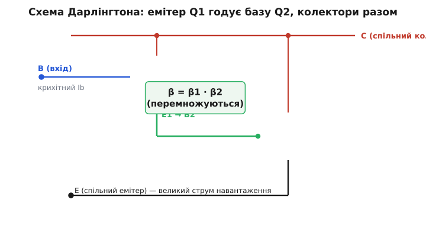
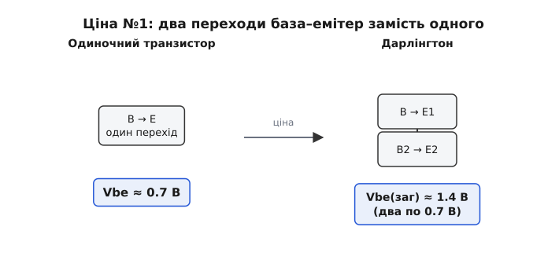
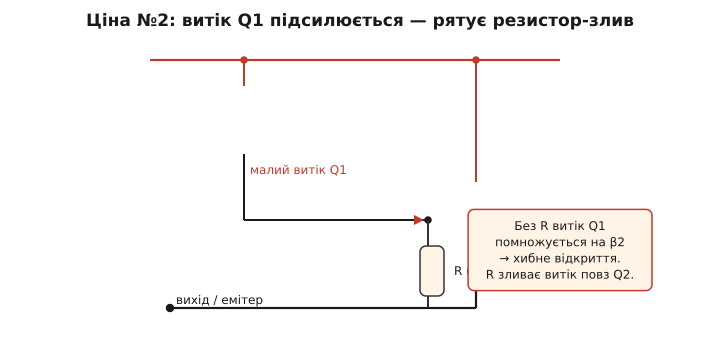
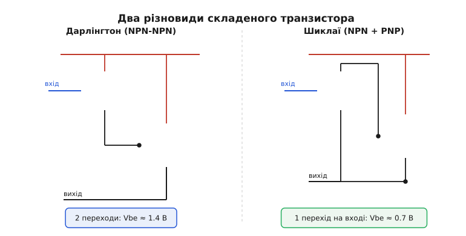

# Схема Дарлінгтона

Один [транзистор](book:electronics/transistor-idea) множить струм бази приблизно в сотню разів — [це і є його β](book:electronics/bjt-gain). Сто разів — багато, та не завжди досить. Що, як треба ввімкнути потужне реле чи двигун, а керувати хочеться з [виходу мікроконтролера](root:embedded/bjt-load-driving), здатного дати лише крихту струму? Сотні замало: міліампер від ніжки контролера, помножений на сто, дасть лише десяту частку ампера, а двигунові треба амперів зо два. Напрошується проста думка: якщо одного множення мало — помножмо двічі. Візьмімо вихід першого транзистора й заведімо його в **базу** другого. Тоді другий помножить уже й так підсилений струм — і загальне підсилення стане добутком двох. Саме це й робить **схема Дарлінгтона** (англ. за іменем винахідника, Sidney Darlington): два транзистори, з'єднані так, що один підсилює слідом за іншим, поводяться як один «супертранзистор» із колосальним β.

### Як це влаштовано

Ідея проста до краси. Беремо два [біполярні транзистори](book:electronics/bjt-operation) — назвімо їх Q1 і Q2 — і з'єднуємо їх так:

- **емітер першого** (Q1) під'єднуємо до **бази другого** (Q2);
- **колектори обох** з'єднуємо разом — це спільний колектор-вихід складеного приладу;
- **база Q1** стає базою всієї зв'язки (туди подаємо керування);
- **емітер Q2** стає спільним емітером (звідти тече великий струм навантаження).

Тепер простежмо за струмом. У базу Q1 ми подаємо крихітний струм Ib. Q1 множить його на своє β₁ — і весь цей підсилений струм (емітерний струм Q1) витікає з емітера Q1 **прямо в базу** Q2. Для Q2 це вже його вхідний, базовий струм. Q2 хапає його й множить ще раз — на своє β₂. Виходить, що крихітний початковий струм пройшов крізь два множники поспіль.


*Два транзистори в зв'язці Дарлінгтона. Емітер Q1 віддає свій підсилений струм просто в базу Q2; колектори обох з'єднані в спільний вихід. Малий струм бази Q1 множиться спершу на β₁, потім на β₂ — назовні зв'язка поводиться як один транзистор із підсиленням β₁·β₂.*

> 🔧 **Навіщо це.** Реальна потреба, з якої все починається: маломогутнє джерело керування (ніжка мікроконтролера, фотодавач, вихід операційника) мусить розгойдати важке навантаження — реле, лампу, соленоїд, мотор. Одного транзистора з β ≈ 100 не вистачає, бо джерело не дає й того міліампера, який потрібен у базу. Дарлінгтон знімає цю проблему: він просить у джерела так мало струму, що його стане навіть у найкволішого виходу, — а на виході тримає амперами.

### Підсилення перемножується

Порахуймо загальне β зв'язки. Струм бази Q1 — це Ib. Емітерний струм Q1, що йде в базу Q2, дорівнює (β₁ + 1)·Ib. Q2 множить його на β₂, тож струм колектора Q2 — це β₂·(β₁ + 1)·Ib. Додамо ще струм колектора самого Q1 (β₁·Ib), бо колектори з'єднані, — і дістанемо повний вихідний струм. Точна формула така:

```
β(заг) = β1·β2 + β1 + β2
```

На практиці β у транзисторів — це сотні, тож доданок β₁·β₂ величезний проти решти, і ними сміливо нехтують:

```
β(заг) ≈ β1 · β2
```

Ось де народжується «супертранзистор». Два звичайні транзистори з β ≈ 100 кожен дають зв'язку з підсиленням близько **десяти тисяч**. Тепер навіть мікроампери в базі рухають мілі- й цілі ампери в навантаженні.

**Приклад. Треба ввімкнути двигун, що споживає Ic = 2 А, а керувати — ніжкою мікроконтролера, яка чесно віддає лише 5 мА. Один транзистор із β = 100 тут безсилий: йому на 2 А потрібно Ib = 2/100 = 20 мА — учетверо більше, ніж є. Що дасть Дарлінгтон із β₁ = β₂ = 100?**
```
β(заг) ≈ β1 · β2 = 100 · 100 = 10 000
Ib = Ic / β(заг) = 2 А / 10 000 = 0.2 мА = 200 мкА
```
Зв'язці треба всього 200 мкА в базу, щоб провести 2 А. Ніжка контролера дає 5 мА — у двадцять п'ять разів більше за потрібне, із величезним запасом. Задача, безнадійна для одного транзистора, розв'язується зв'язкою граючись.

Звідси й головне застосування: Дарлінгтон — це підсилювач **струму** там, де керувальне джерело надто слабке. Великий вхідний опір (бо в базу треба зовсім мало струму) і здатність вести великий вихідний струм роблять його природним [буфером і драйвером навантаження](book:electronics/bjt-amplifier): слабке джерело крізь нього розгойдує важке навантаження, не просідаючи.

### За все треба платити

Якби в Дарлінгтона були самі переваги, одиночних транзисторів давно б не лишилося. Та зв'язка бере свою ціну, і знати її — половина вміння нею користуватися. Платимо трьома речами.

**Подвійне падіння на вході.** Щоб транзистор відкрився, на його переході база–емітер має впасти близько 0.7 В — [стільки коштує відкрити p-n перехід](book:electronics/bjt-operation). А в Дарлінгтоні таких переходів на шляху від бази до спільного емітера **два, послідовно**: спершу база–емітер Q1, потім база–емітер Q2. Тож відкрити зв'язку коштує вже не 0.7, а близько **1.4 В**.


*Між базою й спільним емітером Дарлінгтона лежать два переходи база–емітер один за одним. Кожен бере своє падіння ≈0.7 В, тож відкрити зв'язку треба вже близько 1.4 В замість 0.7 В в одиночного транзистора. Це звужує запас напруги, особливо при низьковольтному живленні.*

Це дрібниця при живленні 12 В, але справжній клопіт при 3.3 В: півтора вольта з трьох — це майже половина бюджету, і керувати таким Дарлінгтоном від логіки стає тісно.

**Транзистор не закривається до кінця.** Куди прикріша друга плата. Коли Дарлінгтон увімкнений «навстіж», напруга між колектором і емітером не падає до звичних для [насиченого ключа](book:electronics/bjt-switch) 0.2 В. Причина в самій схемі: щоб Q2 був повністю відкритий, його база має бути на ~0.7 В вище за емітер; а живить цю базу емітер Q1, тож колектор Q1 (він спільний із колектором Q2) ніяк не може опуститися нижче за «база Q2 плюс власне падіння Q1». У підсумку напруга на ввімкненій зв'язці лишається близько **0.7–1 В** — у кілька разів більша, ніж в одиночного транзистора в насиченні.

> 🔧 **Навіщо це.** Ця залишкова напруга не зникає просто так — на ній виділяється тепло: потужність втрат дорівнює добутку цієї напруги на струм. Веде Дарлінгтон 5 А при падінні 1 В — і вже розсіює 5 Вт, гріючись, мов невеликий паяльник. Тому потужні Дарлінгтони майже завжди сидять на радіаторі, а там, де лічать кожен ват (живлення від батареї, ККД), складений транзистор часто програє одиночному [польовому ключу](book:electronics/field-control), що відкривається майже до нуля опору. Знати цю ціну — значить не поставити Дарлінгтон туди, де він даремно палитиме енергію.

**Млявість і підсилений витік.** Третя плата — швидкість і шуми. Дарлінгтон **повільніший** за одиночний транзистор: Q1 мусить не лише відкрити Q2, а й активно **витягти** заряд із його бази, коли треба закритися, а робить він це мляво. Тому в швидких ключах зв'язку не люблять. До того ж навіть закритий транзистор пропускає крихітний **струм витоку** (англ. *leakage*). У Дарлінгтоні витік Q1 потрапляє прямо в базу Q2 — і той сумлінно множить його на β₂. Дрібний витік, помножений на тисячі, може хибно прочинити зв'язку.


*Крихітний струм витоку закритого Q1 тече просто в базу Q2 і множиться там на β₂ — закрита зв'язка починає підтікати. Резистор між базою та емітером Q2 («злив») відводить цей витік повз перехід Q2: поки струм малий, він іде крізь резистор і не вмикає Q2, а справжній керувальний струм, більший, усе одно відкриває зв'язку.*

Рятує проста хитрість: між базою та емітером Q2 ставлять резистор-**злив** (англ. *bleeder*). Поки струм через нього малий (а витік саме малий), він стікає крізь резистор і не доходить до відкривання Q2; а справжній керувальний струм, у рази більший, легко долає цей злив і відкриває зв'язку. У готових мікросхемах-Дарлінгтонах такий резистор уже вбудований всередині — про нього навіть не треба думати.

### Готовий «супертранзистор» в одному корпусі

Збирати Дарлінгтон із двох окремих транзисторів можна, та частіше беруть **готовий**: обидва транзистори (і той самий резистор-злив, і захисний діод) уже сидять в одному корпусі з трьома виводами — база, колектор, емітер. Зовні це звичайний транзистор, тільки з велетенським β: типові TIP120 чи BD681 дають підсилення в тисячі при струмах у кілька амперів. Користуються ним точно як одним транзистором — лише пам'ятають про два його норови: подвійне падіння на базі (≈1.4 В, щоб відкрити) і вищу залишкову напругу у ввімкненому стані.

> 📋 **Довідка з підключення:** [масив пар Дарлінгтона — будова, розпіновка, підключення](book:electronics/darlington-pair/api-darlington-array.md). Коли навантажень багато, беруть не поодинокий корпус, а масив — сім-вісім складених ключів в одному чипі з уже вбудованою обв'язкою. Що сховано в кожному каналі (складений транзистор, базовий резистор ≈2.7 кΩ, відкритий колектор, гасильний діод із вузлом COM), як улаштована дзеркальна розпіновка «вхід навпроти виходу», чотири з'єднання для підключення (входи, виходи, GND, COM) і які бувають різновиди класу — аж до дзеркального драйвера-джерела верхнього плеча.

Особливо зручні **збірки**: одна мікросхема містить сім чи вісім Дарлінгтонів поряд, кожен зі своїм входом, виходом і захисним діодом. Заводиш на входи сигнали логіки — а на виходах гойдаються потужні навантаження. Такими збірками класично керують рядками світлодіодних матриць, обмотками крокового двигуна, гірляндами реле — усім, де треба багато потужних ключів, кожним із яких порядкує квола цифрова ніжка.

> ⚙️ **Приклад-розрахунок:** [драйвер реле на масиві — крок за кроком](book:electronics/darlington-pair/proj-darlington-array-relay.md). Як завести котушку реле між плюсом і виходом, навіщо COM обов'язково веде на плюс живлення, який код ворушить каналами — і числом: чи вистачить струму з ніжки 5 В, щоб відкрити канал, який струм піде крізь котушку 12 В / 240 Ω і скільки тепла лишиться на каналі; плюс типові граблі, на яких горять масиви.

### Комплементарний Дарлінгтон (пара Шиклаї)

Подвійне падіння 1.4 В на вході муляє, тож винайшли спритну заміну. Якщо взяти **різнотипні** транзистори — один npn, другий pnp — і з'єднати їх інакше, дістанемо ту саму супер-β, але вже **з одним** переходом на вході, тобто звичні 0.7 В замість 1.4 В. Цю зв'язку звуть **комплементарною** (лат. *complementum* — доповнення), або **парою Шиклаї** (англ. за іменем George Sziklai), а часом — «комплементарним Дарлінгтоном».


*Ліворуч — класичний Дарлінгтон із двох однотипних (npn) транзисторів: два переходи база–емітер на вході, тож відкрити треба ≈1.4 В. Праворуч — пара Шиклаї з різнотипних (npn + pnp): підсилення так само β₁·β₂, але на вході лише один перехід, отже, звичні ≈0.7 В. Обидві зовні поводяться як один транзистор потрібного типу.*

Працює пара Шиклаї так: вхідний npn-транзистор своїм колекторним струмом керує базою потужного pnp — і той веде навантаження. Підсилення таке саме, β₁·β₂, бо знову два множники поспіль. Виграш — менше падіння на вході; програш — інша внутрішня поведінка (зокрема, ввімкнена пара Шиклаї тримає на собі залишкову напругу того порядку, що й одиночний насичений транзистор, але стабільність відкривання в неї своя). Через цю різницю обидві зв'язки живуть пліч-о-пліч: у вихідних каскадах підсилювачів потужності їх навіть **поєднують** — верхнє плече на класичному Дарлінгтоні, нижнє на парі Шиклаї, — щоб обидва плеча поводилися симетрично.

> 📜 **Історична вставка:** [хто й коли склав транзистори в пару](book:electronics/darlington-pair/hist-darlington-sziklai.md). Як 1953 року в Bell Labs Сідні Дарлінгтон, граючись зі щойно винайденими (і ще слабенькими) транзисторами, надумав каскадувати їх задля підсилення й запатентував зв'язку — причому в патенті йшлося про кілька транзисторів на одному кристалі, передбачивши інтегральні схеми; і як майже водночас угорець-емігрант Джордж Шиклаї запатентував комплементарний варіант. Дві гілки одного дерева, два інженери, два патенти.

### Де він живе

Дарлінгтон оселяється скрізь, де **слабке керування** мусить порядкувати **сильним навантаженням**, а втрати на залишковій напрузі терпимі. Драйвери реле й соленоїдів, ключі ламп і нагрівачів, керування двигунами, вихідні каскади старих підсилювачів звуку, входи деяких операційників (де велике β дає крихітний вхідний струм) — усе це його земля. Там, де головне — крихітний вхідний струм і велике підсилення, а швидкість і частка вата втрат не критичні, складений транзистор досі поза конкуренцією.

А там, де залишкова напруга й нагрів неприйнятні (живлення від батареї, високий ККД, швидке перемикання), його дедалі частіше витісняє [польовий транзистор](book:electronics/field-control): той у відкритому стані має майже нульовий опір, керується напругою (а не струмом, тож вхідного струму майже не просить) і не страждає на подвійне падіння. Та сама проста думка — «помножмо двічі» — лишається класикою інженерії: коли одного підсилення мало, поставити два каскади поспіль і дати їхнім підсиленням перемножитися.
