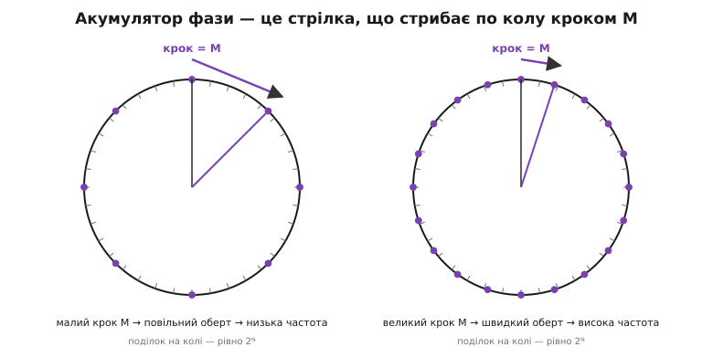
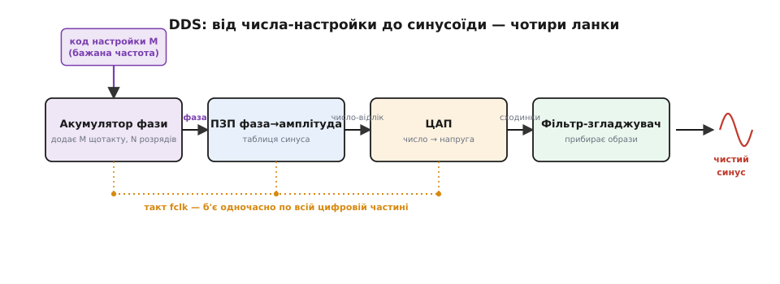
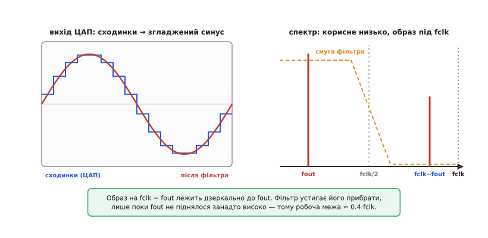
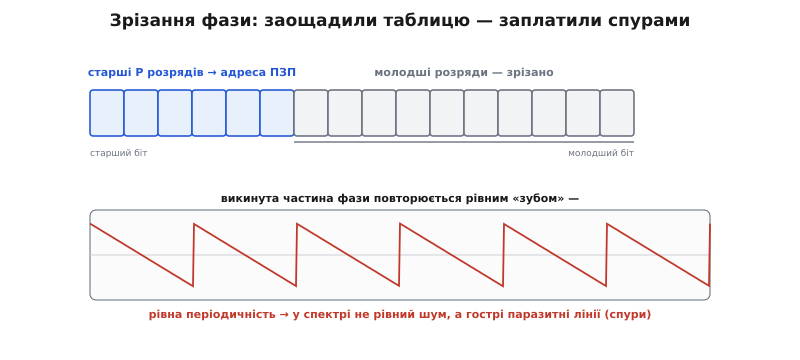

# Пряма цифрова синтеза (DDS): як зробити точну синусоїду з лічильника й таблиці

Уявіть, що вам потрібен генератор синусоїди, якому ви кажете «дай мені рівно 1000.000 герц», а через частку мікросекунди на виході стоїть саме ця частота — не 1001, не 999.7, а тисяча з точністю до сотих часток герца. І тут-таки, тим самим приладом, ви перестрибуєте на 1000.01 Гц, потім на 47 кГц, миттєво, без жодного підкручування, без «усталення» контуру, без дрейфу від нагрівання. Класичний аналоговий генератор так не вміє: там частоту задає резонансний контур або кварц, а щоб її змінити, треба фізично міняти ємність чи індуктивність — повільно, грубо, з розповзанням від температури. Пряма цифрова синтеза робить те, що для аналогового світу звучить майже нахабно: **будує коливання не з резонансу, а з арифметики**. Частота стає числом у регістрі, а не властивістю залізяки.

**Пряма цифрова синтеза** (англ. *direct digital synthesis*, скорочено DDS; ще кажуть *direct digital frequency synthesis*, DDFS) — це спосіб породжувати періодичний сигнал точно заданої частоти, обчислюючи його відліки цифрою й лише в самому кінці перетворюючи потік чисел на напругу. «Пряма» — бо частота виходить прямо з числа-настройки, без проміжного аналогового контуру, який треба ловити зворотним зв'язком. Уся хитрість тримається на трьох дуже простих ланках: лічильник, що рівномірно біжить по фазі; таблиця, що переводить фазу в амплітуду; і цифро-аналоговий перетворювач, що робить із чисел напругу. Розберімо, чому цієї трійці досить — і звідки беруться її межі.

> 🔧 **Навіщо це.** DDS стоїть усередині майже кожного сучасного приладу, де треба чиста керована частота: гетеродини приймачів і передавачів, генератори розгортки радарів, тактові джерела для АЦП, лабораторні генератори сигналів, синтезатори звуку, збудники для ультразвуку й п'єзомоторів. Причина скрізь та сама: частоту можна поставити числом із мікроконтролера по кількох дротах, змінити її за один такт і мати роздільність у частки герца на десятках мегагерц. Інженер, що розуміє DDS зсередини, не боїться його спурів і знає, чому вихід не тягнеться до половини такту — а отже, вибирає мікросхему й фільтр свідомо, а не за принципом «взяв, що було в прикладі».

### Головна ідея: фаза біжить по колу рівним кроком

Почнімо з питання, від якого все випливає: **що взагалі означає «частота» для синусоїди?** Синус — це проєкція точки, що рівномірно бігає по колу. Один повний оберт — один період. Швидше бігає точка — вища частота. Тобто частота — це просто **швидкість наростання фази**: скільки кола ми проходимо за одиницю часу. Ось ключ до всього DDS: якщо ми вміємо змусити «фазу» наростати з керованою швидкістю, ми вміємо задавати частоту.

А наростати рівномірно цифра вміє чудово — це найпростіша операція на світі. Візьмімо регістр (назвімо його **акумулятор фази**, від лат. *accumulare* — накопичувати) і щотакту додаваймо до нього те саме число. Регістр рахує: 0, крок, 2·крок, 3·крок… Це і є фаза, що рівномірно біжить. Число, яке ми додаємо щотакту, називають **кодом настройки** (англ. *frequency tuning word*, або приросток фази, *phase increment*); позначмо його M. Більший крок M — швидше набирається повний оберт — вища частота. Менший крок — повільніше — нижча частота. Уся частота сховалась в одному доданку.


*Ліворуч крок M малий — щоб обійти коло, треба багато тактів, оберт повільний, частота низька. Праворуч крок удвічі-втричі більший — оберт швидкий, частота висока. Поділок на колі рівно 2ᴺ: акумулятор — не звичайний лічильник, а той, що самочинно «перекочується» через нуль, домалювавши повний оберт.*

Тепер важлива тонкість, без якої нічого не працює. Регістр скінченний — скажімо, N розрядів. Він не рахує до нескінченності: дійшовши до найбільшого значення, він **переповнюється** й починає з нуля — рівно як стрілка годинника, що з 59-ї хвилини стрибає на нуль. І це не збій, а сама суть: переповнення акумулятора — це і є «пройшли повне коло, почали новий оберт». Тому N-розрядний акумулятор поводиться точнісінько як коло, поділене на 2ᴺ рівних крихіток фази. Додав M — стрибнув на M крихіток уперед; набралося 2ᴺ — це один повний період вихідного коливання.

Звідси частота виходить сама, якщо порахувати, скільки тактів іде на один оберт. Один оберт — це 2ᴺ крихіток; за один такт ми проходимо M крихіток; отже, оберт займає 2ᴺ/M тактів. Частота такту — fclk; ділимо на кількість тактів у періоді:

```
fout = M · fclk / 2ᴺ
```

Ось воно — головне рівняння DDS. Три речі, що ним керують: fclk (тактова частота — вона фіксована), N (розрядність акумулятора — теж фіксована в залізі), і M (код настройки — єдине, що ми міняємо). Частота лінійно залежить від M: подвоїв код — подвоїв частоту. Хочеш точну частоту — постав відповідне M. І оскільки M — ціле число розрядністю N, керувати частотою можна **дуже дрібними кроками**.

> 🔧 **Навіщо це.** Ця формула — робочий інструмент, а не прикраса. У прошивці ви не «настроюєте генератор», ви обчислюєте M і пишете його в регістр мікросхеми. Тому N (скільки розрядів у акумулятора) прямо визначає, наскільки дрібно ви ляжете в потрібну частоту, а fclk — стелю, докуди взагалі можна піднятися. Дві цифри з даташита — і ви наперед знаєте і роздільність, і діапазон, ще не взявши мікросхему в руки.

### Роздільність: чому крок по частоті буває мікроскопічний

Найменша частота, яку взагалі можна отримати, — це коли M = 1, тобто акумулятор повзе по одній крихітці за такт:

```
Δf = fclk / 2ᴺ          (крок настройки за частотою)
```

Це не лише найменша частота — це і **крок сітки частот**: будь-яка досяжна частота кратна цьому Δf, бо M цілочислове. І ось де ховається дивовижа DDS. Розрядність акумулятора N у реальних мікросхемах — 28, 32, а то й 48 біт. Число 2³² — це понад чотири мільярди. Поділіть навіть високу тактову на нього — і крок виходить мізерний.

**Приклад: крок настройки типової DDS-мікросхеми.** Візьмімо параметри реальної мікросхеми (AD9850): акумулятор 32 розряди, тактова 125 МГц.

:::tabs
```c
// Крок настройки за частотою (роздільність):
//   Δf = fclk / 2^N
double fclk = 125e6;          // 125 МГц
double df   = fclk / 4294967296.0;   // 2^32 = 4 294 967 296
// df ≈ 0.0291 Гц
```
```python
# Крок настройки за частотою (роздільність):
#   Δf = fclk / 2^N
fclk = 125e6                  # 125 МГц
df   = fclk / 2**32           # 2^32 = 4 294 967 296
# df ≈ 0.0291 Гц
```
:::

Крок — близько **три сотих герца** на частотах аж до десятків мегагерц. Тобто, працюючи на 40 МГц, ви можете зсунути частоту на 0.03 Гц — це роздільність, яку жоден кварцовий генератор не дасть навіть близько. А в мікросхемі з 28-розрядним акумулятором і тактовою 25 МГц (як-от AD9833) крок виходить близько 0.1 Гц. Саме ця тонкість сітки й робить DDS незамінним там, де треба точнісінько влучити в частоту: у зв'язку, у метрології, у синхронізації.

Обернене обчислення — те, що робить прошивка щоразу, коли ви задаєте частоту, — так само пряме: із fout = M·fclk/2ᴺ виражаємо M.

**Приклад: код настройки для потрібної частоти.** Треба рівно 10.000 кГц на тій самій мікросхемі (fclk = 125 МГц, N = 32).

:::tabs
```c
#include <stdint.h>
#include <math.h>

// Обчислити код настройки M для бажаної частоти:
//   M = round( fout * 2^N / fclk )
uint32_t dds_tuning_word(double fout, double fclk) {
    double m = fout * 4294967296.0 / fclk;   // fout·2^32/fclk
    return (uint32_t)(m + 0.5);              // округлення до найближчого цілого
}

// Приклад:
//   dds_tuning_word(10000.0, 125e6)
//   = round(10000 · 4294967296 / 125e6)
//   = round(343597.38) = 343597
```
```python
# Обчислити код настройки M для бажаної частоти:
#   M = round( fout * 2^N / fclk )
def dds_tuning_word(fout, fclk):
    m = fout * 2**32 / fclk        # fout·2^32/fclk
    return round(m)                # округлення до найближчого цілого

# Приклад:
#   dds_tuning_word(10000.0, 125e6)
#   = round(10000 · 4294967296 / 125e6)
#   = round(343597.38) = 343597
```
:::

Округлення тут не дрібниця. Ідеального M для довільної частоти зазвичай немає — 343597.38 не буває, бо регістр приймає лише цілі. Ми беремо 343597, і реальна частота виходить fout = 343597 · 125e6 / 2³² ≈ 9999.9989 Гц — на одну соту частки герца нижче замовленого. Ця дрібна різниця й є **похибка сітки частот**: DDS дає не будь-яку частоту, а найближчу вузлову. На великих N вона така мала, що майже завжди байдужа, — але вона є, і в метрології її враховують.

### Від фази до синусоїди: таблиця й перетворювач

Ми маємо фазу, що рівномірно біжить по колу. Але на виході потрібна не фаза, а **синусоїда** — напруга, що йде як sin. Фаза наростає лінійно (пилка: рівно вгору, стриб на нуль, знову вгору), а синус має гладко коливатися вгору-вниз. Хтось має перевести одне в друге.

Обчислювати синус наживо щотакту — надто повільно й дорого для мегагерцових швидкостей. Тому роблять простіше й геніальніше: **заздалегідь рахують синус для всіх значень фази й кладуть у таблицю**. Таблиця (її звуть **перетворювач фази в амплітуду**, англ. *phase-to-amplitude converter*, а фізично це найчастіше постійна пам'ять — ПЗП, англ. *ROM* — *read-only memory*) влаштована як довідник: подаєш на вхід число-фазу — на виході миттєво отримуєш число-амплітуду, наперед пораховане значення синуса для цього кута. Жодних обчислень у момент роботи — чисте зчитування з пам'яті, а це швидко.

Отже, потік такий: акумулятор видає поточну фазу → таблиця переводить її в число-амплітуду синуса → це число щотакту йде на **цифро-аналоговий перетворювач** (ЦАП, англ. *digital-to-analog converter*, DAC), який робить із нього напругу. На виході ЦАП з'являється синусоїда — але поки що не гладка, а **східчаста**: ЦАП тримає кожне значення сталим цілий такт, тоді стрибком переходить до наступного. Виходять сходинки, що обводять синусоїду.


*Чотири ланки DDS. Код настройки M задає частоту; акумулятор перетворює його на фазу, що біжить; таблиця — на відліки синуса; ЦАП — на східчасту напругу; фільтр згладжує сходинки в чистий синус. Один такт fclk синхронно рухає всю цифрову частину.*

Останній штрих — **фільтр-згладжувач** (англ. *reconstruction filter*, фільтр відновлення). Це аналоговий фільтр низьких частот, що зрізає різкі сходинки й лишає плавну синусоїду. Навіщо він строго потрібен і чому саме низьких частот — з'ясуємо за мить, бо це впирається в найглибшу властивість усього дискретного світу.

### Чому вихід не тягнеться до половини такту

Тут DDS зустрічається з фундаментальним законом усякого відлікового сигналу — **теоремою відліків**: сигнал, який ми творимо відліками з частотою fclk, чесно існує лише до половини цієї частоти, до fclk/2 (її звуть частотою Найквіста). Вище — не можна: на періодах, коротших за два відліки, дискретна форма перестає однозначно означати синусоїду. Тож теоретична стеля DDS — трохи менше fclk/2.

Але це ще не вся правда, і саме тут криється практичне обмеження, об яке спотикаються початківці. Східчастий вихід ЦАП несе не лише корисну частоту fout. Кожна сходинка — це різкий стрибок, а різкі стрибки — це домішка вищих частот. У спектрі поряд із корисною лінією fout виростають її **образи** (англ. *images*, дзеркальні копії): найближчий і найнеприємніший сидить на частоті fclk − fout. Що вище ми піднімаємо fout до fclk/2 — то ближче образ підповзає до корисного сигналу знизу-зверху, і то важче їх розділити.


*Ліва панель: сходинки ЦАП (низом) і те, що лишає фільтр (гладкий синус). Права: у спектрі корисне fout стоїть низько, а його образ — дзеркально під fclk. Фільтр-згладжувач устигає прибрати образ, лише поки fout лишається достатньо нижче за fclk/2 — тому робоча межа приблизно 0.4·fclk.*

Прибирає образи саме фільтр-згладжувач. Але фільтр не буває ідеальним «цегляним муром» — його спад завжди має скінченну крутість. Щоб фільтр устиг пригнітити образ на fclk − fout, не зачепивши корисне fout, між ними має лишатися відступ. Тому на практиці вихід DDS обмежують приблизно **40 % тактової частоти**:

```
fout(практ.) ≤ 0.4 · fclk
```

Ці зайві 10 % до Найквіста — «розгінна смуга» для фільтра: місце, де його амплітудна характеристика встигає спасти, перш ніж дійде до образу. Піднімешся вище 0.4·fclk — фільтр або пропустить образ, або почне зрізати корисне. До того ж сама амплітуда корисного сигналу спадає з частотою за законом **sin(x)/x** (це неминучий наслідок того, що ЦАП тримає кожен відлік цілий такт): що ближче fout до fclk/2, то помітніше проседає вихід. Тож правило «бери такт мінімум удвічі-втричі вищий за найвищу потрібну частоту» — не забобон, а прямий висновок із будови.

> 🔧 **Навіщо це.** Це те число, що рятує від найтиповішого розчарування: «мікросхема на 125 МГц, а чистих 60 МГц із неї не витягти». Не витягти — бо реально вона дає гарний сигнал десь до 50 МГц, а вище образи й sin(x)/x псують картину. Плануючи прилад, беріть тактову з добрим запасом над найвищою робочою частотою — і закладайте нормальний фільтр-згладжувач, інакше на виході буде корисна частота в супроводі непроханих дзеркальних ліній.

### Спури: ціна за скорочену таблицю

Є ще одне джерело паразитних ліній, тонше й суто цифрове, і воно варте окремого слова, бо саме воно визначає «чистоту» реальних DDS. Згадаймо акумулятор: він 28-, 32-, іноді 48-розрядний. Якби таблиця синуса мала окреме значення для кожного зі своїх 2ᴺ значень фази, вона була б астрономічно велика — таблиця на 2³² комірок фізично не влізе в жоден розумний чип. Тому роблять хитрість: **на адресу таблиці подають лише кілька старших розрядів фази**, скажімо 12–14, а молодші просто відкидають. Це називають **зрізанням фази** (англ. *phase truncation*).

Виграш очевидний — замість мільярдів комірок таблиця має кілька тисяч. Але за все треба платити. Молодші розряди, які ми викинули, — це дрібна похибка фази, з якою реально йде акумулятор проти того, що бачить таблиця. І ключове: ця похибка **не випадкова, а періодична** — вона наростає й скидається рівним «зубом» щоразу, коли молодші розряди переповнюються. А рівна періодичність у часі означає гострі лінії в спектрі. Тому зрізання фази породжує не рівномірний шумовий фон, а **паразитні тони** — їх звуть **спурами** (англ. *spurs*, від *spurious* — хибний, побічний): вузькі сторонні лінії на цілком конкретних частотах поряд із корисною.


*Старші розряди фази адресують таблицю, молодші відкидаються заради економії пам'яті. Викинута частина повторюється рівним «зубом» — і саме ця рівна періодичність обертається в спектрі не рівним шумом, а гострими спурами на конкретних частотах.*

Наскільки чистий вихід, міряють **вільним від спурів динамічним діапазоном** (англ. *spurious-free dynamic range*, SFDR) — це відстань за рівнем від корисної лінії до найбільшого спура; більший SFDR — чистіший сигнал. Скільки саме розрядів фази лишити до таблиці й куди сядуть спури — це не пальцем у небо: у 1987 році [Генрі Ніколас і Хенрі Самуелі докладно вивели, як зрізання фази ліпить спектр](topic:electronics/dds-synthesis/math-phase-truncation.md), і відтоді проєктувальники рахують SFDR наперед. Груба орієнтир-оцінка: кожен доданий старший розряд фази до таблиці зсуває спури приблизно на 6 дБ нижче. Тому 14-розрядна адреса таблиці дає десь під −84 дБ спурів — цього досить для більшості завдань.

Крім зрізання фази, чистоту псує ще й сам ЦАП: його скінченна розрядність квантує амплітуду, а неідеальна лінійність (кожна сходинка трохи «не тієї» висоти) додає власних гармонік. Тому підсумкова чистота DDS — це завжди сукупність трьох речей: скільки розрядів фази йде в таблицю, скільки розрядів і яка лінійність у ЦАП, і як добре фільтр прибирає образи.

### Звідки це взялося

Ідея не нова — вона старша за мікросхеми, що зробили її масовою. У 1971 році троє інженерів [Джосеф Тірні, Чарлз Рейдер і Бернард Голд із Лабораторії Лінкольна МТІ описали цифровий синтезатор частоти](topic:electronics/dds-synthesis/hist-dds-origins.md) в статті «A digital frequency synthesizer» — і саме там уперше з'явилися акумулятор фази й таблиця синуса як спосіб задавати частоту числом. Рейдер і Голд були серед піонерів цифрового оброблення сигналів узагалі — їхній підручник 1969 року «Digital Processing of Signals» став однією з перших книг цієї галузі (усталений факт). У 1971-му це була ідея, що випереджала залізо: швидких ЦАП і дешевої пам'яті ще не було. Масовим DDS став лише у 1980–90-ті, коли інтегральна техніка дозволила вкласти весь конвеєр в один недорогий чип.

### Де DDS сильний, а де ні

Підсумуймо чесно, бо кожен інструмент має межу застосовності. Сильні сторони випливають прямо з того, що частота — це число: **мікроскопічний крок настройки** (частки герца), **миттєве й точне перемикання** частоти (за один такт, без усталення), відсутність дрейфу від температури (арифметика не пливе), а ще — легке цифрове керування фазою й амплітудою, тож на DDS дуже природно лягає будь-яка модуляція. Це робить його ідеальним там, де цінують точність і гнучкість частоти на середніх швидкостях.

Слабкі сторони — теж не таємниця. Стеля частоти прив'язана до такту (реально ~0.4·fclk), тож для дуже високих частот DDS сам не дотягне — там його ставлять як точний «керунок», а вгору піднімають іншими засобами. І чистота спектра обмежена спурами й ЦАП: там, де потрібен гранично чистий сигнал без жодної паразитної лінії, аналоговий генератор чи система з фазовим автопідстроюванням часом виграє. Тому DDS не витісняє всі інші синтезатори, а посідає свою нішу — **точна, спритна, цифрово-керована частота там, де не треба гнатися під самий гігагерц**. І в цій ніші рівних йому небагато.
