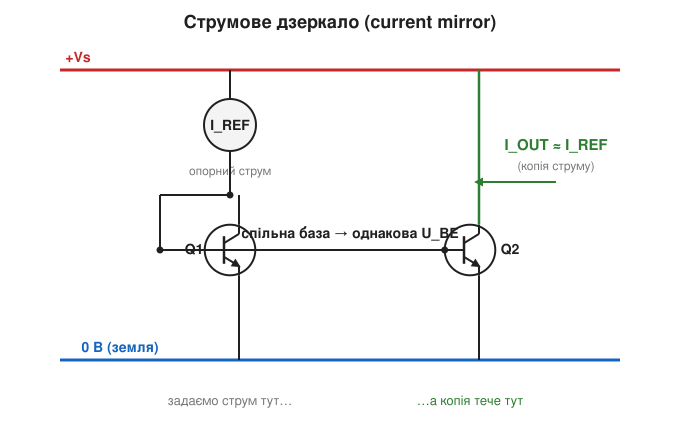
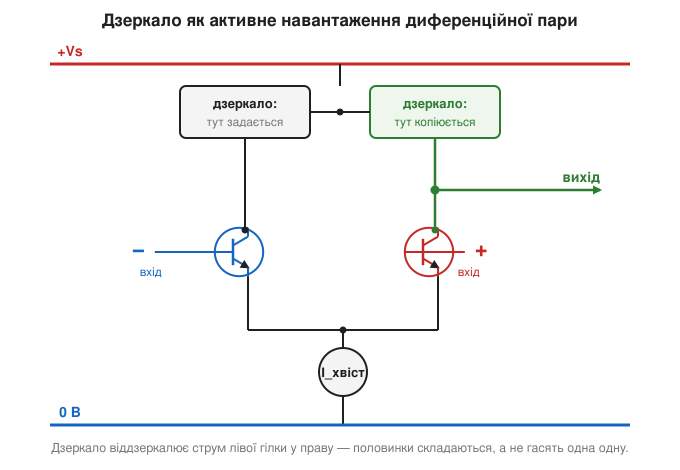

# 🧮 Струмове дзеркало: цеглинка всередині ОП

> У колекторах [диференційної пари](book:electronics/differential-pair) операційного підсилювача стоїть **дзеркало струму** *(current mirror)* — вузол, що «змушує один струм повторювати інший». Звучить як магія. Тут розберемо його на пальцях: що це таке, чому копія виходить точною й де він ховається в операційному підсилювачі. Дзеркало — одна з найпоширеніших цеглинок аналогового кремнію, і варто розуміти, як воно працює.

### Означення: пристрій, що копіює струм

**Струмове дзеркало** — це вузол із двох (чи більше) транзисторів, який бере **опорний струм** *(reference current, I_REF)* в одній гілці й видає в іншій його **точну копію** *(output current, I_OUT)*, майже не залежну від того, що до тієї гілки під'єднано. Простіше кажучи: «налаштуй струм тут — і такий самий потече там». Це не підсилювач напруги й не ключ; його робота — **тиражувати струм**.


*Рис. Базове дзеркало на двох однакових транзисторах. Лівий (Q1) увімкнений «діодно» — його база з'єднана з колектором, тож крізь нього тече опорний струм I_REF і встановлюється певна напруга U_BE. Бази обох транзисторів спільні, отже на Q2 — та сама U_BE, і він проводить такий самий струм. Праворуч маємо копію I_OUT ≈ I_REF незалежно від навантаження.*

### Інтуїція: однакова U_BE — однаковий струм

Уся хитрість тримається на одному факті про [режими біполярного транзистора](book:electronics/bjt-regions): струм біполярного транзистора **жорстко прив'язаний** до напруги база-емітер U_BE. Крива U_BE → I_C дуже крута, тож якщо у двох **однакових** транзисторів напруга U_BE однакова, то й струми майже збігаються.

Дзеркало саме це й влаштовує. Лівий транзистор вмикають «діодно» — коротять його базу з колектором. Крізь нього проганяють опорний струм, і транзистор **сам собі підбирає** ту U_BE, яка цьому струму відповідає (бо інакше струм не пройде). А далі цю готову U_BE просто **роздають** на бази решти транзисторів — вони з'єднані спільним проводом. Кожен бачить ту саму напругу й слухняно повторює той самий струм. Жодного підлаштування: фізика U_BE → I_C робить копіювання сама.

Аналогія — як зняти **зразок** і відлити за ним копії. Лівий транзистор — це форма: ми вганяємо в неї опорний струм, і вона набуває потрібної «глибини» (U_BE). Праві транзистори, відлиті в ту саму форму тим самим процесом, дають однакову деталь. І знову це працює **лише** тому, що транзистори [вирощені поряд на одному кристалі](book:electronics/mosfet-structure) — спарені за U_BE й температурою. Двійко окремих транзисторів із крамниці дзеркала точного не дадуть: їхні U_BE надто різні. Ось іще одна причина, чому ОП — інтегральний.

### Формальний апарат

Тепер запишемо цю «однакову U_BE — однаковий струм» точніше. Для однакових транзисторів зі спільною U_BE струми відносяться як **площі** їхніх емітерних переходів. Якщо площі рівні (звичайний випадок) — копія дорівнює опорному струму:

```
I_OUT / I_REF = A₂ / A₁
A₁ = A₂   →   I_OUT ≈ I_REF
```

Зробивши правий транзистор у **N разів** більшим (чи поставивши N однакових паралельно), дістанемо **масштабоване** дзеркало:

```
A₂ = N · A₁   →   I_OUT ≈ N · I_REF
```

тож одним опорним струмом можна роздати по чипу кілька різних, але **жорстко пов'язаних** струмів — зручно для зміщення багатьох каскадів відразу.

Лишилася невелика поправка — заради чесності. Копія не ідеальна з двох причин. По-перше, обидва транзистори віддають частину струму в бази (скінченний [коефіцієнт β](book:electronics/bjt-gain)), тож:

```
I_OUT ≈ I_REF · (1 − 2/β)
```

— при β у сотні це похибка часток відсотка. По-друге, копія **трохи** пливе з напругою на виході (ефект Ерлі) — реальне дзеркало не ідеальне джерело струму, а дуже хороше. Для нашого рівня досить запам'ятати: **I_OUT ≈ I_REF**, а точність обмежують спарованість транзисторів і β.

### Де воно працює

Дзеркало — не самоціль, а робоча деталь усередині ОП на [диференційній парі](book:electronics/differential-pair), причому одразу у двох місцях.

**Хвіст диференційної пари.** Той «сталий струм», що живить емітери пари, — це і є вихід дзеркала. Саме тому хвіст тримається незмінним, хоч би що робилося на входах, — і саме завдяки цьому [пара відкидає синфазне](book:electronics/differential-pair).

**Активне навантаження.** Друге дзеркало ставлять у колектори пари — і це найкрасивіше. Воно бере струм **однієї** гілки й віддзеркалює його в **другу**, де вже тече власний струм пари. На спільному вузлі дві половинки сигналу не гасять, а **складають** одна одну — і двобічний (диференційний) сигнал перетворюється в однобічний, придатний передати далі. Дрібниця на вигляд, а підсилення першого каскаду від неї зростає в рази, та ще й вузол виходить високоомним — що теж піднімає підсилення.


*Рис. Дзеркало як активне навантаження. Струм лівої гілки пари задає дзеркало, а воно повторює його в правій гілці. На спільному вузлі обидві половинки складаються — сигнал стає однобічним і вдвічі сильнішим. Так дзеркало водночас «збирає» диференційний сигнал і додає підсилення.*

> 🔧 **Навіщо це.** Дзеркало струму — це «копіювальний апарат» для струмів: задав один опорний — отримав скільки треба точних копій (чи масштабованих у N разів). Усередині ОП воно робить дві ключові речі: тримає **сталий хвіст** диференційної пари (звідси відкидання синфазного) і служить **активним навантаженням**, що складає обидві гілки в один підсилений сигнал. Побачивши в схемі ОП пару однакових транзисторів зі спільними базами — знайте: це дзеркало, і саме воно стоїть за половиною «магії» [диференційної пари](book:electronics/differential-pair).
