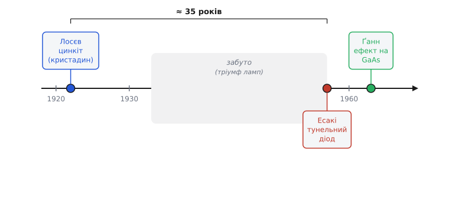

# 📜 Як приручали від'ємний диференційний опір

Уявіть прилад, до якого ви докинули трохи більше напруги — а він у відповідь пропустив **менше** струму. Не «майже стільки ж», не «нуль», а саме менше: піднімаєш — спадає. Звичайний резистор так не вміє; будь-яка знайома деталь на додаткову напругу відповідає додатковим струмом. А цей робить навпаки на цілій ділянці своєї характеристики. Інженер, який таке побачив уперше, мав відчути легке запаморочення: схоже, ніби прилад **віддає енергію** замість того, щоб її гріти. Це і є від'ємний диференційний опір — спадна ділянка вольт-амперної кривої, де нахил ΔU/ΔI стає від'ємним.

> 🔧 **Навіщо це.** Від'ємний диференційний опір — не цирковий фокус, а **єдиний спосіб** змусити пасивний двополюсник підсилювати й генерувати без жодної лампи й транзистора. Якщо на ділянці кривої r < 0, цей шматок здатен **компенсувати втрати** звичайного додатного опору в контурі: разом вони дають нуль втрат — і коливання, замість того щоб згаснути, тримаються або наростають. Звідси підсилювач і генератор з однієї кристалічної цяточки. Уся історія нижче — про те, як люди це **помітили, зрозуміли й приручили**, тричі, з проміжком майже в покоління.

Спочатку розберімося, чому тут немає порушення законів. Енергію, звісно, ніхто з нічого не дістає. Від'ємним є лише **диференційний** опір — реакція на *малу зміну* поверх робочої точки. Статичний опір U/I у цих приладах залишається додатним: вони споживають постійну потужність від джерела зміщення. Просто частину цієї постійної потужності прилад віддає назад **на частоті сигналу** — для маленького змінного ворушіння він поводиться як від'ємний опір, бо качає в коло те, що набрав від батареї. Тонкощі цього перетворення — у самій [статті про диференційний опір](book:electronics/differential-resistance): там видно, чому нахил кривої й статичне відношення — це два різні числа, і чому нахил узагалі може піти під нуль.

А тепер — троє людей, троє матеріалів, три способи дістати той самий нахил під нуль.


*Приручення від'ємного диференційного опору трьома незалежними шляхами. Олег Лосєв дістав його на точковому контакті з цинкітом ще на початку 1920-х — майже на 35 років раніше за тунельний діод Лео Есакі (1957) і ще далі від ефекту Ґанна (1963). Між першим і другим відкриттями — провал забуття: лампа перемогла, і кристалічну гілку покинули.*

## Самоук, що випередив транзистор на чверть століття: Олег Лосєв

Перший, хто **приручив** цей ефект — побудував на ньому робочі прилади, а не просто здивувався в лабораторії — був Олег Володимирович Лосєв (10 травня 1903, Твер, Російська імперія — 1942, блокадний Ленінград). Це постать, яку західна історія електроніки довго не помічала зовсім, а радянська — пам'ятала вибірково. Тож пройдімо обережно, з документами.

Лосєв не мав університетської освіти. Революція й громадянська війна зачинили йому дорогу у вищу школу; він прийшов у щойно засновану Нижньогородську радіолабораторію молодшим технічним працівником і фактично виховав себе сам — серед людей, які тоді робили радіо в Росії. Це важлива деталь: усе, що він зробив, він зробив руками й головою практика, без наукового апарату, який міг би підказати йому теорію наперед.

Працював він із **детектором** — кристалом, до якого притиснуто тонкий металевий вусик (так звана котяча лапка, cat's whisker). У ті роки такий точковий контакт правив за випрямляч у найпростіших радіоприймачах: він пропускав струм переважно в один бік і так виокремлював звук із радіохвилі. Кристали брали різні; Лосєв узяв **цинкіт** — природний оксид цинку (ZnO), мінерал червонясто-жовтогарячого кольору. І помітив дивне.

На певному цинкіті, **зміщеному** невеликою постійною напругою від батареї, контакт переставав бути просто випрямлячем. Коло з ним починало **свистіти** — породжувати власні незгасні коливання, навіть стійко ловити далекі станції з підсиленням. Кристал поводився так, ніби в нього вбудовано джерело енергії. Перші такі спостереження Лосєва датують **1922 роком** (рік, коли він прийшов у лабораторію й узявся за «осцилюючі кристали»); систематично досліджувати й будувати на цьому підсилювачі він став **від 1923-го**. *(Статус: усталено; точна межа 1922/1923 у джерелах трохи плаває — перші ознаки 1922, розгорнута робота з 1923.)*

Лосєв не зупинився на «дивно свистить». Він зрозумів механізм правильніше за багатьох сучасників: на певній ділянці вольт-амперної характеристики зміщеного контакту струм із напругою **спадає** — і саме ця спадна ділянка віддає енергію в коло, гасячи його втрати. Сьогодні ми кажемо: від'ємний диференційний опір. Він навіть знімав ці характеристики й користувався спадною ділянкою свідомо, обираючи робочу точку на ній. Це не випадкове тицяння — це **інженерія від'ємного опору** за чверть століття до того, як з'явився сам термін у підручниках.

> 🔧 **Навіщо це.** Лосєв зробив головне, що взагалі можна зробити з від'ємним опором: **поставив робочу точку на спадну ділянку** й увімкнув кристал у резонансний контур. Втрати контуру (його додатний опір) і від'ємний опір кристала врівноважилися — і коливання перестали згасати. Це **рецепт генератора** в чистому вигляді; той самий принцип через десятиліття оживить тунельний діод і діод Ґанна. Зрозуміти від'ємний опір — означає зрозуміти, як із пасивної цяточки виходить активний прилад.

На цьому Лосєв побудував цілу родину приладів — підсилювачі, регенеративні приймачі й **генератори високої частоти** (до ~5 МГц), повністю **без вакуумної лампи**. Це сталося приблизно **за 25 років до транзистора** (точковий транзистор Бардіна, Браттейна й Шоклі в Bell Labs — кінець 1947-го). На той момент Лосєв тримав у руках працюючу твердотільну альтернативу лампі.

Західний світ про це майже дізнався. Американський видавець-популяризатор Г'юґо Ґернсбек (Hugo Gernsback) — один із небагатьох, хто звернув увагу — назвав технологію **«Crystodyne»** (укр. кристадин) і розповів про неї в журналі *Radio News* у **вересні 1924-го** (статті «A Sensational Radio Invention» і «The Crystodyne Principle»). *(Статус: усталено — авторство терміна й публікація задокументовані.)* Тобто принцип твердотільного підсилення був надрукований і доступний — і світ майже одностайно його проігнорував.

Чому приручений від'ємний опір **забули** майже на покоління — питання не містичне, а інженерне. Збіглося кілька причин, і кожну варто назвати, бо вони повторяться згодом:

- **Лампа саме перемагала.** У 1920-х вакуумний триод стрімко дешевшав і ставав надійним; він давав **легке, передбачуване підсилення на трьох виводах**, де вхід і вихід природно розв'язані. На його тлі кристалічна гілка виглядала вчорашнім днем.
- **Двополюсник погано каскадувати.** Від'ємний опір живе у **двовивідному** приладі: вхід і вихід — це одна й та сама пара клем. Поставити кілька таких підсилювачів поспіль украй важко — каскади лізуть один в одного, бо нема окремого керувального електрода, яким лампа (а потім транзистор) розділяє «що керує» і «що тече».
- **Матеріал — рідкісний і примхливий.** Придатний цинкіт у промисловій кількості видобували мало де (значущі поклади — лише в Нью-Джерсі), а кожен точковий контакт доводилося **підлаштовувати вручну** тим самим вусиком. Відтворюваності масового виробництва тут не було й близько.

Тож Лосєв і сам із часом покинув кристадинну гілку. Але того самого кристалічного контакту він **зробив іще одне відкриття**, яке наздогнало нас аж у XXI столітті. Він помітив, що точковий перехід на **карборунді** (карбіді кремнію, SiC) під струмом **світиться** холодним зеленкуватим світлом, і ретельно це описав — публікація в радянському журналі 1927 року. Це було перше у світі дослідження **електролюмінесценції напівпровідникового переходу** — фактично пращур світлодіода (LED). *(Статус: усталено — пріоритет Лосєва в дослідженні цього явища визнаний міжнародно.)* Людина, яку не пустили в університет, незалежно намацала і твердотільний підсилювач, і світлодіод.

Доля її обірвалася трагічно й безглуздо. Незадовго до смерті Лосєв працював над **трьохелектродним** напівпровідниковим підсилювачем — тобто йшов саме туди, де згодом постане транзистор, до приладу з окремим керувальним виводом, що зняв би всі вади двополюсника. Закінчити не встиг: він **загинув від голоду 1942 року в блокадному Ленінграді**, у 38 років, разом із сотнями тисяч цивільних. *(Статус: усталено.)* Формально науковий ступінь він усе ж отримав — Фізико-технічний інститут (Іоффе) присудив йому докторську 1938 року **без захисту звичайної дисертації**, за сукупністю праць; самоука визнали, але запізно й неголосно.

Тут варто бути точним і чесним щодо ідентичності, бо навколо радянських імен наросло чимало імперських легенд. Лосєв — **етнічний росіянин**, який працював у радянських інституціях; жодних підстав приписувати йому інше походження немає, як немає й підстав для зворотного — применшувати реальне. Його заслуга справжня й **не потребує** ні приукрашування «радянського пріоритету», ні замовчування. Водночас твердження на кшталт «Лосєв винайшов транзистор/світлодіод» — **перебільшення**: він **дослідив явища** (від'ємний опір на цинкіті, електролюмінесценцію на SiC) і **побудував робочі прилади** на першому, але **сучасного транзистора** (з p-n переходами, керованого польовим чи інжекційним механізмом) і **сучасного LED** (ефективного, на прямозонному напівпровіднику) він не створив і створити тодішніми засобами не міг. Розрізняймо акуратно: **ідея й спостереження** — Лосєва; **робоча реалізація підсилення на від'ємному опорі** — теж його; **прилад, що змінив світ** (транзистор, промисловий світлодіод) — це вже інші люди й інші десятиліття. Саме таке розрізнення (ідея / теорія / реалізація / прилад / промисловий продукт) рятує від обох крайнощів — і від забуття, і від міфу.

## Теорія наздоганяє: що таке «від'ємний опір» строго

Перш ніж рушити далі в часі, корисно зрозуміти, чому Лосєву було так важко, а нам — легко: **теорія від'ємного опору дозріла окремо й трохи пізніше**, ніж практика.

Думку, що елемент із від'ємним опором може **підтримувати** коливання, строго оформив нідерландський фізик Балтазар ван дер Пол (Balthasar van der Pol) у роботах 1920-х про лампові генератори. Він записав рівняння автоколивань, у якому ключову роль грає член із **від'ємним загасанням** — тобто опором, що на малих амплітудах віддає енергію в контур, а на великих її забирає. Це знамените **рівняння ван дер Пола**; з нього видно загальний закон будь-якого такого генератора:

```
поки  |r_від'ємне|  <  r_втрат  →  коливання згасають
коли  |r_від'ємне|  =  r_втрат  →  амплітуда стала (поріг генерації)
коли  |r_від'ємне|  >  r_втрат  →  коливання наростають
```

Тобто від'ємний опір **компенсує** додатний опір втрат контуру. Зрівнялися — генератор «стоїть на порозі» й видає чисту синусоїду; від'ємний переважив — амплітуда росте, поки нелінійність сама її не обмежить. Лосєв намацав це руками; ван дер Пол дав мову, якою це рахувати. Прилад при цьому **байдужий**: що цинкіт Лосєва, що майбутній тунельний діод, що діод Ґанна — усі вони лише різні способи **виготовити той самий від'ємний опір**, а правило генерації для них спільне.

Тут же варто розрізнити дві **форми** від'ємного опору, бо вони поводяться по-різному в колі (детальна стаття розписує це повніше):

- **N-подібна** (керована напругою): струм як функція напруги має ділянку спаду — задаєш U, читаєш I. Так поводяться **тунельний діод** і кристадин Лосєва.
- **S-подібна** (керована струмом): навпаки, напруга спадає з ростом струму. Так поводяться газові розряди й деякі лавинні прилади.

Різниця не косметична: N-подібний прилад стабілізують **малим послідовним**, а S-подібний — **великим паралельним** опором, інакше робоча точка зривається. Але це вже механіка кола; нам тут важлива історія самого нахилу під нуль.

## Квант робить те саме: тунельний діод Лео Есакі

Минуло понад тридцять років. Лампу вже тіснив транзистор, кремній і германій стали робочим матеріалом, а від'ємний опір на кристалі здавався забутою екзотикою. І тут його **відкрили заново** — у новому матеріалі, з новим, по-справжньому квантовим механізмом.

Зробив це японський фізик **Лео (Реона) Есакі** (Leo Esaki, 江崎玲於奈) у серпні **1957 року**, працюючи в компанії **Tokyo Tsushin Kogyo** — тій самій, що невдовзі стане **Sony**. *(Статус: усталено — місяць і рік задокументовані; компанія тоді ще не звалася Sony.)* Есакі досліджував германієві p-n переходи з **дуже сильним легуванням** — коли обидва боки переходу напхані домішками так густо, що збіднений шар між ними стає неймовірно **тонким**, порядку десятка нанометрів.

І на такому надтонкому переході він побачив на прямій гілці характеристики **спад струму з ростом напруги** — той самий від'ємний диференційний опір. Але причина тут зовсім інша, ніж у Лосєва. Це **квантове тунелювання**: настільки тонкий бар'єр електрон долає не «перестрибуючи» через нього (як у звичайному діоді), а **просочуючись крізь** нього наскрізь — явище, яке класична фізика забороняє, а квантова механіка дозволяє. Картина така:

```
мала пряма напруга  →  зайняті рівні зліва дивляться на вільні справа
                       тунель ВІДКРИТИЙ → струм РОСТЕ
трохи більша напруга →  рівні розходяться, навпроти зайнятих — заборонена зона
                       тунель ЗАКРИВАЄТЬСЯ → струм ПАДАЄ  ← тут r < 0
ще більша напруга    →  вмикається звичайна дифузія → струм знову РОСТЕ
```

Саме на середній ділянці — де зростання напруги **розводить** рівні й закриває тунельний канал — струм спадає, і нахил іде під нуль. Есакі не просто помітив це, а **довів**, що це справді тунелювання, передбачене квантовою теорією, і зміряв усе кількісно. Робота вийшла в **Physical Review** 15 січня **1958 року** під назвою «New Phenomenon in Narrow Germanium p−n Junctions» (т. 109, вип. 2, с. 603–604); того ж року Есакі доповів про новий діод на конференції в Брюсселі. *(Статус: усталено — публікація й дата перевірені за журналом.)*

Різниця в долі — разюча. За **той самий по суті ефект** (від'ємний опір на напівпровідниковому переході) Лосєв помер забутим у блокаді, а Есакі **1973 року отримав Нобелівську премію з фізики** — «за експериментальне відкриття тунелювання електронів у напівпровідниках». *(Статус: усталено.)* Чому так по-різному? Бо змінилася не лише людина — змінився **час**. У 1958-му існували квантова теорія, що пояснювала ефект; промисловість напівпровідників, що вміла робити відтворювані переходи; і світова наукова спільнота, що читала Physical Review й одразу зрозуміла масштаб. Лосєв 1922-го не мав нічого з цього — ні теорії під рукою, ні технології відтворення, ні аудиторії. Однакове відкриття на іншому ґрунті дає інший урожай; це, мабуть, головний урок цієї історії.

> 🔧 **Навіщо це.** Тунельний діод виявився **феноменально швидким**: тунелювання — миттєвий квантовий процес, без повільного накопичення й розсмоктування зарядів, як у звичайному діоді. Тому на цьому від'ємному опорі будували надшвидкі генератори й перемикачі на гігагерци ще тоді, коли транзистори такого не вміли. Згодом транзистор наздогнав і перегнав, і тунельний діод відійшов у нішу — але як **найчистіший підручниковий приклад** N-подібного від'ємного опору він безцінний досі.

Цікавий історичний відросток: незалежно від Есакі ту саму ідею (від'ємний опір від тунелювання) **обмірковував** Роберт Нойс — майбутній співзасновник Intel — ще працюючи в Шоклі, але його відмовили розвивати тему. *(Статус: усталено за спогадами.)* Знову та сама картина: ідея визрівала у кількох головах одночасно, а в історію вписався той, хто довів справу до **виміряного, опублікованого, відтвореного** результату. Винаходи — колективні; пріоритет дістає не «хто перший подумав», а «хто перший показав і довів».

## Від'ємний опір зовсім без переходу: ефект Ґанна

І остання, найдивніша глава. Досі від'ємний опір завжди жив **на переході** — на контакті чи на p-n стику. А чи може ціла **однорідна** грудка напівпровідника, без жодного переходу всередині, сама по собі мати спадну ділянку характеристики? Виявилося — може.

У **1962–1963 роках** британський фізик **Джон Беттіскомб Ґанн** (John Battiscombe Gunn, 13 травня 1928, Каїр, Єгипет — 2 грудня 2008), що працював у дослідному центрі **IBM** у США, узявся за дрібні, але вперті несподіванки у зразках **арсеніду галію** (GaAs). Прикладена до однорідного бруска GaAs достатньо сильна постійна напруга породжувала на виході **коливання надвисокої частоти** — струм пульсував сам собою, хоча жодного контура чи переходу в зразку не було. Багато хто списав би це на «шум апаратури». Ґаннова заслуга в тому, що він **відмовився** так зробити: він наполіг, що неузгодженість реальна, і виміряв її як справжній фізичний ефект. *(Статус: усталено — перше спостереження 1962, доповідь 1963.)* Так народився **ефект Ґанна**, а прилад на ньому — **діод Ґанна**, він же **прилад на перенесенні електронів** (transferred-electron device, TED).

Механізм тут — третій, знову інакший, і дуже красивий. У GaAs зона провідності має не одну «долину», а кілька. У головній, **нижній** долині електрони **легкі й рухливі**. Поряд, трохи вище за енергією, є **бічна** долина, де електрони **важкі й неповороткі** (мала рухливість). При слабкому полі всі електрони сидять у легкій долині. Та коли поле перевищує поріг, воно **перекидає** частину електронів нагору, у важку долину — і ті різко гальмують:

```
слабке поле   →  електрони в легкій долині, висока рухливість, струм росте з полем
поле > поріг  →  електрони перекидаються у важку долину, рухливість ПАДАЄ
              →  середня швидкість (а отже й струм) спадає, хоча поле РОСТЕ  ← r < 0
```

Це **перенесення електронів між долинами** (звідси й назва TED), і саме воно дає об'ємний від'ємний опір — у товщі матеріалу, без жодного переходу. Тонкощі переходу від «опору матеріалу» до «коливань на виході» (як з від'ємного опору народжуються рухливі домени просторового заряду, що й створюють пульсації) — окрема глибока тема.

Тут — особливо повчальний для нашої теми сюжет про **теорію проти експерименту**. Об'ємний від'ємний опір саме такого роду **передбачили теоретично ще до Ґанна**. Британці Браян Рідлі (Brian Ridley) і Том Воткінс (Tom Watkins) **1961 року** висунули ідею, що в певних напівпровідниках сильне поле може загнати легкі рухливі електрони у важкий малорухливий стан і так створити об'ємний від'ємний опір. А Сиріл Гілсам (Cyril Hilsum) **1962 року** розрахував це конкретно для GaAs і навіть **передбачив порогове поле** близько 2800 В/см. Це **теорія Рідлі — Воткінса — Гілсама** (RWH). *(Статус: усталено.)* Сам Ґанн спершу **не знав** про ці роботи й не пов'язував свій ефект із ними; зв'язок указав інший фізик — **Герберт Кремер** (Herbert Kroemer, майбутній нобеліант) **1964 року**, показавши, що Ґаннові коливання — це і є RWH-механізм у дії. *(Статус: усталено.)*

Розкладімо ролі чесно, бо тут легко наплутати з пріоритетом:

- **Передбачили механізм** (об'ємний від'ємний опір через перенесення електронів): Рідлі й Воткінс (1961), уточнили для GaAs — Гілсам (1962). Це **теорія**.
- **Спостеріг ефект** експериментально й не дав списати його на шум: Ґанн (1962–1963). Це **реалізація-спостереження**.
- **Поєднав** експеримент із теорією: Кремер (1964). Це **пояснення**.

Тож «ефект Ґанна» — справедлива назва за **відкриття явища в досліді**, але честь **передбачення** належить теоретикам RWH, а честь **пояснення** — Кремеру. Жодного імперського вузла тут немає (усі четверо — британські й німецький фізики в західних лабораторіях), зате є чистий, навчальний приклад того, як **теорія, експеримент і пояснення** — це **три різні внески**, які варто називати окремо, а не зливати в одне ім'я. Той самий принцип розрізнення, що рятував нас від міфів про Лосєва, працює й тут — просто без політичного забарвлення.

> 🔧 **Навіщо це.** Діод Ґанна став **робочим джерелом надвисоких частот** — десятки гігагерц з крихітного бруска GaAs, без вакууму й без резонансних ламп. На ньому досі стоять автомобільні радари, давачі руху й мікрохвильові генератори. І знову це **той самий від'ємний диференційний опір** — лише дістали його з міждолинного перенесення електронів, а не з тунелю чи точкового контакту. Один нахил під нуль — три різні фізики під ним.

## Що залишилося від цієї історії

Якщо стерти дати й імена, лишається одна проста думка, заради якої й варто пам'ятати цей шлях. Від'ємний диференційний опір — це **не якийсь конкретний прилад**, а **властивість форми кривої**: спадна ділянка вольт-амперної характеристики, на якій нахил ΔU/ΔI стає від'ємним. Природа цієї спадної ділянки щоразу різна:

```
Лосєв, цинкіт   →  від'ємний опір на зміщеному точковому контакті
Есакі, германій →  від'ємний опір від квантового тунелювання крізь тонкий перехід
Ґанн, GaAs      →  від'ємний опір від перенесення електронів між долинами зони
```

Три різні фізичні причини — **один і той самий наслідок** у колі: ділянка, де прилад віддає енергію на частоті сигналу й здатен компенсувати втрати, давши підсилення або генерацію. Саме тому всі троє приладів роблять, по суті, одне: підсилюють і генерують з пасивного двополюсника. І саме тому інженер думає про від'ємний опір **узагальнено** — не «це тунельний діод», а «це елемент із r < 0 у такій-то точці», після чого решта (поріг генерації, спосіб стабілізації, форма N чи S) виводиться з самої кривої, байдуже, яка фізика її загнула.

А ще тут є людський урок, гіркіший за фізику. Однакова ідея на різному ґрунті дає геть різну долю: Лосєв приручив від'ємний опір першим — і помер забутим, бо навколо не було ні теорії, ні технології, ні аудиторії, що зрозуміли б його; Есакі дістав за майже те саме Нобеля, бо ґрунт уже визрів. Відкриття без свого часу — як насінина не в сезон. Тож коли в підручнику трапиться суха фраза «прилад із від'ємним диференційним опором», за нею варто чути цих трьох — і самотнього самоука з цинкітом, який побачив усе на чверть століття зарано.
