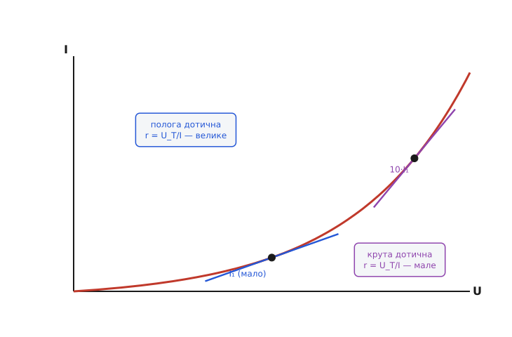
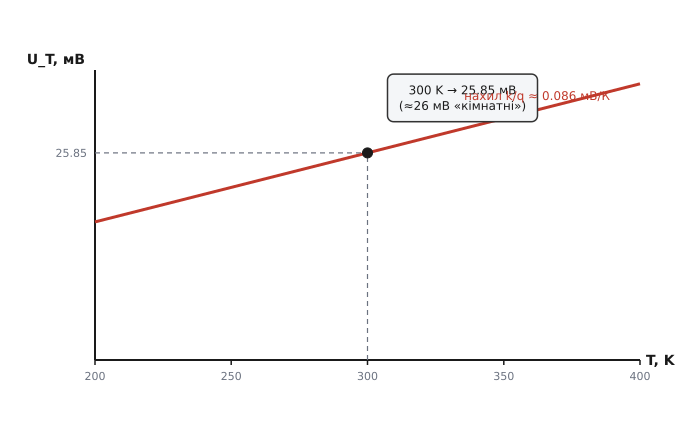

# 🧮 Звідки в діода береться r = 26 мВ / I

Готова формула диференційного опору p-n переходу виглядає підозріло простою: бери теплову напругу, ділив на струм — і маєш опір. Жодного діаметра, жодної довжини, жодного питомого опору матеріалу, нічого з того, чим звичайно описують опір провідника. Просто «26 мілівольт поділити на струм». Звідки взагалі таке береться? Чому опір переходу не залежить від його площі, від легування, від того, кремній це чи германій, — а тримається лише на струмі й температурі? І чому саме 26, а не 30 чи 10?

Усе це випливає з однієї речі — з того, що струм діода зростає з напругою **експоненційно**. Якщо чесно продиференціювати експоненту, проста формула вискакує сама, майже без зусиль, і кожна її дрібниця стає прозорою: видно, чому опір обернений до струму, звідки беруться ті 26 мВ, як вони повзуть із температурою й чому площа переходу безслідно зникає з відповіді. Зробімо це виведення повільно, від першопричини, бо на ньому стоїть мало не вся схемотехніка малого сигналу.

## Точка опертя: рівняння діода

Почнімо з того, що описує діод як такий. Зв'язок струму I через p-n перехід із напругою U на ньому задає рівняння, яке Вільям Шоклі вивів у 1949 році в довгій статті «Теорія p-n переходів у напівпровідниках і p-n транзисторів» (Bell System Technical Journal, т. 28) — звідси й назва «рівняння Шоклі»:

```
I = I_s · ( e^(U / (n·U_T)) − 1 )
```

Розберімо, що́ в ньому стоїть, бо кожен символ зараз спрацює.

- **I_s** — струм насичення (англ. *saturation current*). Це крихітна величина (наноампери й менше), що залежить від площі переходу, легування й матеріалу. Саме в ній сидить уся «фізика конкретного діода»: великий перехід — більший I_s, германій замість кремнію — більший I_s. Запам'ятаймо це: вся індивідуальність деталі захована тут.
- **U_T** — теплова напруга (англ. *thermal voltage*). Та сама, з якої вилізуть наші 26 мВ. До неї повернемось окремо й розберемо до кінця.
- **n** — коефіцієнт неідеальності (англ. *ideality factor*), число між 1 і 2. Для гарного діода близьке до 1; чому воно взагалі є — теж розберемо нижче.
- **e** — основа натурального логарифма, 2.718…; не плутати з зарядом електрона, для якого лишимо букву q.

Сенс рівняння інтуїтивно простий. Експонента e^(U/(n·U_T)) — це частка носіїв заряду, яким теплової енергії вистачає, щоб подолати потенціальний бар'єр переходу. Підняли напругу — знизили бар'єр — експоненційно більше носіїв його перестрибує — експоненційно більший струм. Одиниця, що віднімається, забезпечує лише, що при U = 0 струм нуль (e⁰ = 1, різниця нуль): без напруги нічого не тече. А при від'ємній U (зворотне ввімкнення) експонента прямує до нуля, лишається −I_s — отой малесенький зворотний струм насичення, звідки I_s і дістав ім'я.

> 🔧 **Навіщо це.** Експонента — не математична оздоба, а корінь усієї поведінки переходу. Саме через неї діод відкривається так різко («порогом» близько 0.6–0.7 В у кремнію), саме через неї струм здатний вибухнути від мізерної надбавки напруги — і саме з неї, як ми побачимо, виходить дивовижно проста формула диференційного опору. Хто розуміє, що в переході сидить експонента, той уже наполовину розуміє і транзистор: його перехід база-емітер описує те саме рівняння Шоклі, і крутість транзистора виходить із того самого диференціювання.

Для прямого ввімкнення, де нас і цікавить опір, напруга U помітно більша за n·U_T (тобто помітно більша за якісь 26–50 мВ), і експонента стає велетенською — багато тисяч, мільйонів. Поряд із нею одиниця — пил. Тому в робочій ділянці спокійно пишуть наближено:

```
I ≈ I_s · e^(U / (n·U_T))        (пряме ввімкнення, U ≫ n·U_T)
```

Це й буде наша робоча форма. Тепер — головна дія.

## Диференціювання: де народжується формула

Диференційний опір за означенням є похідна напруги по струму в робочій точці:

```
r = dU/dI
```

Тобто: на скільки треба зрушити напругу, щоб струм змінився на одиницю. Пряму похідну dU/dI рахувати незручно — у рівнянні в нас I виражене через U, а не навпаки. Та це й не потрібно: похідна оберненої функції є просто обернена величина похідної. Знайдімо легку похідну dI/dU, а тоді перевернімо:

```
r = dU/dI = 1 / (dI/dU)
```

Отже все зводиться до одного: продиференціювати струм по напрузі. Беремо робочу форму I ≈ I_s · e^(U/(n·U_T)) і диференціюємо по U. Похідна експоненти e^(ax) дорівнює a·e^(ax) — сама експонента, помножена на множник a при змінній у показнику. Тут роль a грає 1/(n·U_T):

```
dI/dU = I_s · e^(U / (n·U_T)) · 1/(n·U_T)
```

А тепер найкрасивіший крок усього виведення. Подивіться на добуток I_s · e^(U/(n·U_T)) — це ж і є сам струм I (та сама робоча форма рівняння). Тобто похідна струму по напрузі виражається через **сам струм**:

```
dI/dU = I / (n·U_T)
```

Зупинімося тут на секунду, бо це серце справи. Похідна експоненти пропорційна самій собі — це унікальна властивість експоненти, її «підпис». Через неї нахил вольт-амперної кривої в кожній точці виявляється просто пропорційним струмові в цій точці. Не якійсь складній комбінації параметрів — а просто струмові, поділеному на n·U_T. Уся громіздка індивідуальність переходу (той самий I_s із площею й легуванням) **зникла** з похідної: вона сховалась усередині I. Те, чим діод відрізняється від діода, лишилось у тому, *який струм тече при даній напрузі*, — а зв'язок нахилу зі струмом уже однаковий для всіх.

Лишилось перевернути, і ми вдома:

```
r = dU/dI = 1 / (dI/dU) = n·U_T / I
```

Ось вона — формула диференційного опору p-n переходу, виведена з першопричини:

```
r = n·U_T / I
```

При гарному діоді (n ≈ 1) і кімнатній температурі (U_T ≈ 26 мВ) це й дає ту робочу прикидку, яку інженер тримає в голові:

```
r ≈ 26 мВ / I        (n≈1, кімнатна температура)
```

Простота тут не випадкова й не груба — вона **точна**. Вона прямо успадкована від експоненційності переходу: похідна експоненти дорівнює собі, тож обернений нахил дорівнює одиниці на коефіцієнт при змінній, помноженій на… власне, нічого зайвого. Жоден інший вид характеристики не дав би такого охайного результату.

## Чому опір обернений до струму — і що це означає фізично

Формула r = n·U_T / I каже: подвоїв струм — удвічі впав опір; підняв струм удесятеро — опір упав удесятеро. Залежність строго обернена. Чому так — видно прямо з геометрії експоненти.

Диференційний опір — це обернений нахил вольт-амперної кривої в точці. Експонента влаштована так, що чим вище ви по ній піднялись, тим вона крутіша: на малих струмах крива майже полога, на великих — стрімко злітає вгору. А де крива крута, там малесенька зміна напруги дає велику зміну струму — нахил dI/dU великий, отже обернений до нього диференційний опір малий. Де крива полога (малі струми), той самий поштовх напруги дає мізерний приріст струму — нахил малий, опір великий.


*Вольт-амперна крива діода — експонента. У робочій точці малого струму I₁ дотична полога, її обернений нахил r = U_T/I великий. У точці з удесятеро більшим струмом дотична вже крута — той самий обернений нахил у десять разів менший. Сам нахил dI/dU пропорційний струмові, тож опір — обернено пропорційний: рівно це і є r = U_T/I.*

Можна сказати й інакше, через сам зміст експоненти. Згадаймо: щоб збільшити струм удесятеро, треба додати фіксовану дозу напруги — близько n·U_T·ln10 ≈ 60 мВ (бо e^(60мВ/26мВ) ≈ 10). Ці «60 мВ на декаду» однакові на будь-якому струмі: і щоб піти з 1 мА на 10 мА, і щоб піти з 10 мА на 100 мА, треба ті самі ~60 мВ. Але приріст струму в першому випадку — 9 мА, а в другому — 90 мА. Однакова надбавка напруги, удесятеро більший приріст струму — отже на великому струмі «опір зміні» удесятеро менший. Звідси й обернена пропорційність: чим більший струм, тим дешевше (у вольтах) обходиться його дальша зміна.

**Приклад: той самий діод, три робочі струми.** Порахуймо r = U_T / I (беремо n = 1, U_T = 26 мВ) для струмів 0.1 мА, 1 мА і 10 мА — і подивімося, як одна деталь міняє свій диференційний опір на два порядки лише від того, який струм спокою ми крізь неї пустили.

:::tabs
```c
// диференційний опір ідеального переходу: r = U_T / I
const float U_T = 0.026f;        // 26 мВ при кімнатній температурі

float r_junction(float I) {      // I в амперах -> r в омах
    return U_T / I;
}

float ra = r_junction(0.0001f);  // 0.1 мА:  0.026 / 0.0001 = 260 Ом
float rb = r_junction(0.001f);   //   1 мА:  0.026 / 0.001  =  26 Ом
float rc = r_junction(0.010f);   //  10 мА:  0.026 / 0.010  = 2.6 Ом
```
```python
# диференційний опір ідеального переходу: r = U_T / I
U_T = 0.026        # 26 мВ при кімнатній температурі

def r_junction(I):  # I в амперах -> r в омах
    return U_T / I

ra = r_junction(0.0001)  # 0.1 мА:  0.026 / 0.0001 = 260 Ом
rb = r_junction(0.001)   #   1 мА:  0.026 / 0.001  =  26 Ом
rc = r_junction(0.010)   #  10 мА:  0.026 / 0.010  = 2.6 Ом
```
:::

Від 0.1 мА до 10 мА струм виріс у сто разів — диференційний опір рівно в сто разів і впав, з 260 Ом до 2.6 Ом. Жодна паспортна величина деталі при цьому не змінювалась: це той самий діод, та сама площа, той самий I_s. Змінилась лише робоча точка. Звідси й головний інженерний висновок: **диференційним опором переходу керують струмом спокою**. Хочеш жорсткіший вузол — жени більший струм; готовий заплатити струмом — отримуєш малий r.

## Тепер про серце: що таке U_T і звідки 26 мВ

Лишилось пояснити те «26», що так зухвало стоїть у формулі без жодного посилання на деталь. Це теплова напруга, і її означення коротке:

```
U_T = k·T / q
```

де k — стала Больцмана, T — абсолютна температура (у кельвінах), q — елементарний заряд (заряд електрона за модулем). Що це за комбінація і чому вона має розмірність напруги?

Розмірність перевіряється відразу. Добуток k·T — це енергія (стала Больцмана якраз переводить температуру в енергію: k·T є характерна теплова енергія однієї частинки при температурі T). Поділити енергію на заряд — дістати напругу (вольт за означенням є джоуль на кулон). Отже k·T/q справді вольти. Але глибше: ця напруга має ясний фізичний зміст — це **напруга, що відповідає тепловій енергії носія**. Скільки вольтів треба, щоб робота електричного поля над одним зарядом q зрівнялася з тим тепловим шарпанням k·T, яке носій і так має від температури? Рівно U_T = k·T/q. Це природний масштаб напруги для всякого процесу, де електрика бореться з тепловим розкидом енергій, — а перехід діода саме такий процес: струм у ньому визначається тим, якій частці носіїв теплова енергія дозволяє перестрибнути бар'єр.

Підставмо числа для T = 300 K (це ≈ 27 °C, умовна «кімната»):

**Обчислення U_T при 300 K.** Беремо точні сталі: k = 1.380649·10⁻²³ Дж/К, q = 1.602177·10⁻¹⁹ Кл.

```
U_T = k·T / q
    = (1.380649·10⁻²³ · 300) / 1.602177·10⁻¹⁹
    = 4.141947·10⁻²¹ / 1.602177·10⁻¹⁹
    = 0.025852 В
    ≈ 25.85 мВ
```

Ось воно. При 300 K теплова напруга — 25.85 мВ, яку для усного рахунку округлюють до зручних 26 мВ (а часом і до 25 мВ — залежно від того, яку саме «кімнатну» температуру беруть; при 290 K ≈ 17 °C виходить 25 мВ рівно). Жодної фізики конкретного діода тут немає й близько — лише фундаментальні сталі й температура. Тому-то 26 мВ і стоять у формулі опору окремо від деталі: це властивість не переходу, а температури, при якій перехід працює.

> 🔧 **Навіщо це.** «26 мВ» — це число, яке аналоговий інженер знає, як таблицю множення. На ньому стоїть не лише опір діода: воно ж задає крутість транзистора (gₘ = I_C / U_T), нахил «60 мВ на декаду» в логарифмічних перетворювачах, температурну поведінку опорних джерел. Запам'ятавши, що U_T ≈ 26 мВ при кімнатній і що воно пропорційне абсолютній температурі, ви прикидаєте поведінку півсхеми усно. Це один із тих небагатьох чисел, заради яких варто витратити клітинку пам'яті назавжди.

## Як U_T повзе з температурою

У формулі U_T = k·T/q температура стоїть прямо в чисельнику, а k і q — сталі. Отже теплова напруга **прямо пропорційна абсолютній температурі**: нагрів перехід — U_T зростає, охолоди — спадає, строго лінійно від нуля кельвінів. Нахил цієї прямої — теж лише сталі:

```
dU_T/dT = k/q ≈ 0.0862 мВ/К
```

тобто на кожен градус нагріву теплова напруга підростає приблизно на 0.086 мВ.


*Теплова напруга прямо пропорційна абсолютній температурі: пряма з нахилом k/q ≈ 0.086 мВ/К, що йшла б у нуль при 0 K. Робоча точка 300 K дає 25.85 мВ — ті самі «кімнатні ~26 мВ». Нагрів на 100 K (з 300 до 400 K) піднімає U_T приблизно на 8.6 мВ.*

Перевірмо нахилом самі 26 мВ: 0.0862 мВ/К · 300 K = 25.85 мВ — сходиться, бо пряма йде з нуля. Підняли температуру з 300 до 400 K (на цілих 100 градусів) — U_T зросло з 25.85 до ≈ 34.5 мВ, на ті самі ~8.6 мВ. Тобто сама по собі теплова напруга з температурою росте, і не дуже стрімко: на побутових перепадах у десятки градусів — одиниці відсотків.

Здавалося б, звідси прямий висновок: r = n·U_T/I при фіксованому струмі росте з температурою, бо U_T росте. І це правда — **при заданому струмі** диференційний опір переходу теплішає разом із U_T, приблизно на ті самі 0.34% на градус (бо U_T росте на 0.0862/25.85 ≈ 0.33% на градус). Невелика, але реальна температурна залежність. Та тут чигає тонка пастка, у яку легко впасти, — і її варто розплутати окремо.

## Пастка: чому напруга на діоді з нагрівом падає, хоч U_T росте

Усі знають емпіричне правило: пряма напруга на кремнієвому діоді з нагрівом **спадає** приблизно на 2 мВ на градус (точніше, близько −1.8…−2 мВ/°C). Діод гарячіє — падіння на ньому меншає; на цьому навіть будують термометри. Але ж ми щойно з'ясували, що U_T із нагрівом **росте**. Як це поєднати? Якщо в показнику експоненти U_T у знаменнику росте, хіба напруга не мала б рости?

Розгадка в тому, що U_T — не єдине, що залежить від температури в рівнянні діода. Сильніше за все від температури залежить **струм насичення I_s**, і залежить він украй круто — росте з температурою майже вибухово (бо в ньому сидить власна експонента від ширини забороненої зони, e^(−E_g/kT), яка з нагрівом стрімко відпускає). Подивімося на пряму напругу при фіксованому струмі I, виразивши її з рівняння:

```
U = n·U_T · ln(I / I_s)
```

Тут конкурують двоє. Множник n·U_T попереду — росте з T (повільно). А логарифм ln(I/I_s) — **падає** з T, і падає сильно, бо I_s у знаменнику логарифма стрімко росте, тож відношення I/I_s меншає, а його логарифм проto зменшується. І ось друге пересилює перше з великим запасом: бурхливий ріст I_s тягне напругу вниз набагато потужніше, ніж кволий ріст U_T тягне її вгору. У сумі напруга на діоді при фіксованому струмі **падає** — ті самі ~2 мВ/°C, що їх знає кожен.

Мораль для нашого опору: не плутайте дві різні температурні залежності. Диференційний опір r = n·U_T/I залежить від T **лише через U_T у чисельнику** (струм I ми тримаємо фіксованим самі) — і тому з нагрівом помалу росте. А пряма напруга падає — але це інша величина, у ній грає ще й I_s, якого у формулі опору взагалі немає (він скоротився при диференціюванні!). Те, що ми позбулися I_s, виводячи r, — це якраз і причина, чому температурна поведінка опору проста (лише U_T), а температурна поведінка напруги складна (ще й I_s). Одне виведення розчепило ці дві історії.

> 🔧 **Навіщо це.** Ця розв'язка рятує від поширеної помилки. Інженер-початківець, побачивши «U_T росте з T», очікує, що й діод відкриватиметься при вищій напрузі на спеці, — а на практиці все навпаки. Розуміння, що в напрузі панує I_s, а не U_T, пояснює і термокомпенсацію опорних джерел, і чому транзисторні термометри лінійні, і чому диференційний опір переходу тим часом поводиться сумирно — на ньому температура позначається лише тими частками відсотка на градус, що йдуть від U_T. Дві формули — два різні температурні «характери», і обидва випливають з одного рівняння Шоклі.

## Останній штрих: коефіцієнт неідеальності n

Залишилось пояснити скромний множник n, що тихо стоїть у формулах. У ідеальному переході, який Шоклі вивів для випадку, де весь струм несуть носії, що дифундують крізь область переходу, коефіцієнт n = 1. Але реальні діоди — особливо на малих струмах і особливо кремнієві — поводяться так, ніби n більше за одиницю, десь між 1 і 2.

Причина — в області збіднення (англ. *depletion region*) самого переходу частина носіїв не встигає її проскочити, а **рекомбінує** просто там, усередині. Цей рекомбінаційний струм підкоряється трохи іншій залежності від напруги — ефективно «розтягнутій» удвічі експоненті, що відповідає n = 2. У реальному діоді течуть обидва струми водночас — і чистий дифузійний (n = 1), і рекомбінаційний (n = 2), — а сумарна крива поводиться так, ніби в неї проміжний коефіцієнт між 1 і 2, причому на малих струмах ближче до 2, а з ростом струму дифузійний механізм бере гору й n сповзає до 1.

Для нашої формули наслідок прямий: n стоїть множником при U_T, тобто **розтягує** диференційний опір. Якщо реальний n виявився 1.5, то й опір переходу в півтора раза більший за наївну прикидку 26 мВ/I:

```
r = n·U_T / I = 1.5 · 26 мВ / I = 39 мВ / I
```

Тому акуратна оцінка враховує n, узятий із даташита або з нахилу виміряної характеристики. Для прикидок же беруть n = 1 — і для гарних діодів на робочих струмах це майже точно. Добра новина: для переходу база-емітер біполярного транзистора в активному режимі n практично дорівнює 1 завжди — тому крутість транзистора рахують просто через 26 мВ/I, без поправок.

## Що звідси винести

Уся історія склалась з однієї властивості — експоненційності переходу — і одного руху руки — диференціювання. З них вийшло чотири речі, які варто тримати разом.

Перше: диференційний опір p-n переходу є r = n·U_T/I, і це **точний** наслідок експоненти, а не груба апроксимація. Похідна експоненти дорівнює собі — звідси й уся охайність.

Друге: опір **обернений до струму** (подвоїв струм — удвічі менший опір), бо нахил експоненти пропорційний струмові. Робочою точкою інженер прямо керує жорсткістю переходу.

Третє: множник 26 мВ — це теплова напруга U_T = kT/q при 300 K, властивість **температури, а не деталі**; уся індивідуальність діода (площа, легування, матеріал) сиділа в I_s, який при диференціюванні безслідно скоротився. Тому опір переходу не знає ні про діаметр, ні про матеріал — лише про струм і температуру.

Четверте: з температурою сам U_T (а отже й r при фіксованому струмі) помалу росте на ~0.33% на градус, тоді як пряма напруга на діоді, навпаки, падає на ~2 мВ/°C — і ця протилежність не суперечність, а наслідок того, що в напрузі панує бурхливий I_s, а в опорі його немає.

Саме на цій формулі — на тому, що перехід поводиться як резистор величиною 26 мВ/I, керований струмом, — стоїть малосигнальна модель діода й біполярного транзистора, а з нею й чималий шмат усієї аналогової схемотехніки.
