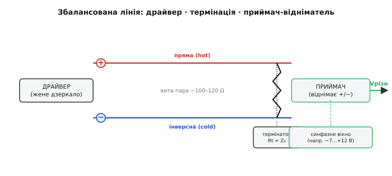
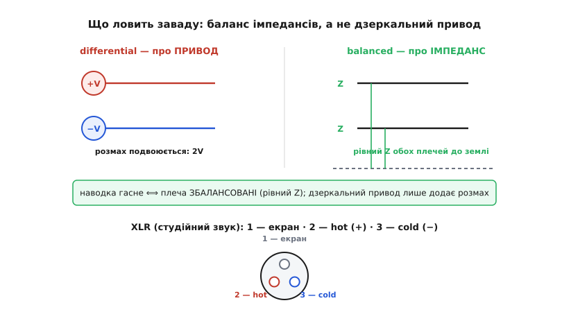

# 🔌 Драйвер і приймач збалансованої лінії: чип, ноги, термінатор

> Компонентна вставка про диференційну передачу — погляд **з боку плати**: не «що таке різниця двох проводів», а **який пристрій** жене цю різницю в дріт і **який** її на тому кінці зчитує. Цілий клас мікросхем — **диференційний драйвер** (line driver) і **диференційний приймач** (line receiver), часто в одному корпусі-**трансивері**; разом із витою парою й парою резисторів вони й утворюють робочу збалансовану лінію. Розберемо типову блок-схему, ноги, узгодження, «перший показ» — і ту тонку, але дорогу різницю між *balanced* і *differential*, яку плутають навіть бувалі.

### Що це за клас пристроїв

Диференційна передача — ідея; **лінійний драйвер і приймач** — її втілення в кремнії. Драйвер бере однопровідний логічний сигнал зсередини пристрою (один рівень відносно місцевої землі) і виставляє його на **два** виводи **дзеркально**: коли «A» йде вгору, «B» йде вниз. Приймач на дальньому кінці робить зворотне — бере дві напруги з лінії й видає назад **одну**, що дорівнює їхній **різниці**, відлічену вже від *його* землі. Між ними — пара проводів і термінальний резистор.

Чому це окремий клас, а не просто «два буфери»? Бо обидва кінці мусять виконувати свою роботу **точно**, інакше вся магія скорочення завади розсиплеться. Драйвер має гнати плечі справді симетрично й тримати **однаковий вихідний опір** на обох. Приймач має віднімати **чесно** — і робити це навіть тоді, коли спільний рівень обох входів далеко відплив від нуля (землі розійшлися, влучив кидок). Саме ця друга вимога — **широкий допустимий синфазний діапазон** (common-mode range) — і відрізняє лінійний приймач від звичайного логічного входу, який бачить лише вузьке вікно «0…живлення».

Ці двоє часто живуть в одному корпусі — **трансивері** (transceiver, від *transmitter* + *receiver*): один драйвер плюс один приймач плюс логіка, що перемикає, хто зараз говорить, а хто слухає. Так працює напівдуплексна шина, де по одній парі по черзі йдуть обидва напрямки. Бувають і чисті односторонні мікросхеми — лише драйвер або лише приймач — для повного дуплексу на двох окремих парах.

> 🔧 **Навіщо це.** Цей клас — стандартний «вихід у зовнішній світ» там, де сигнал має покинути спокій однієї плати: промислова шина між щитами, мережа давачів у машині, швидкий канал між мікросхемами, мікрофонна лінія в студії. Усередині пристрою сигнали бігають однопровідно й тихо; щойно треба в дріт — ставлять диференційний драйвер, на тому кінці приймач, і брудний світ між ними перестає псувати дані. Знати ноги й граблі цього класу — значить уміти провести сигнал туди, куди однопровідна доріжка не дотягнеться.

### Блок-схема: що між двома корпусами

Подивімося на типовий тракт цілком — від логіки одного пристрою до логіки іншого.


*Типовий збалансований канал. Зліва драйвер перетворює один логічний рівень на дзеркальну пару (пряма «hot» і інверсна «cold»). Між корпусами — вита пара з хвильовим опором ~100–120 Ω. На дальньому кінці, біля приймача, — термінальний резистор Rt ≈ Z₀, що гасить відбиття. Приймач віднімає плечі й видає Vрізн — але лише доти, доки спільний рівень обох проводів лишається в його синфазному вікні (наприклад, −7…+12 В).*

Ланцюг читається зліва направо так. Логіка передавача дає драйверу один біт. Драйвер виставляє його на пару дзеркально й **жене струм** у лінію. Лінія — вита пара — несе пару поряд, тримаючи наводку на обох однаковою. На дальньому кінці **термінатор** поглинає хвилю, щоб вона не відбилась назад. Приймач знімає дві напруги, **віднімає** їх і віддає своїй логіці чистий відновлений біт. Кожна ланка має призначення; викинь будь-яку — і канал або шумить, або дзвенить, або взагалі мовчить.

Два моменти на цій схемі коштовніші за інші й заслуговують окремої уваги: **термінатор** (праворуч, між проводами) і **синфазне вікно** приймача (підпис унизу під приймачем). До них і перейдемо, але спершу — ноги.

### Розпіновка й підключення

У реального корпусу ніг небагато, і кожна очевидна, щойно зрозуміла блок-схема. Драйвер виставляє назовні:

- **вхід даних** (логічний рівень зсередини пристрою — той єдиний біт, що його гнати в лінію);
- **дозвіл драйвера** (driver enable) — вмикає чи **відпускає** вихід у високоомний стан, щоб по спільній парі міг говорити хтось інший;
- **два виходи** на лінію — пряме плече «A»/«+» і інверсне «B»/«−»;
- **живлення й землю**.

Приймач — дзеркально:

- **два входи** з лінії (ті самі «A» і «B», тепер як джерело);
- **дозвіл приймача** (receiver enable) — за потреби глушить вихід;
- **вихід даних** — відновлений логічний рівень для місцевої логіки;
- **живлення й землю**.

У трансивері драйвер і приймач **ділять** ту саму пару контактів до лінії (їхні виходи й входи з'єднані всередині), а назовні стирчать окремі вхід даних, вихід даних і два сигнали дозволу. Часто два дозволи зводять в один вивід «напрямок»: один рівень — говори, інший — слухай.

Підключення двох пристроїв елементарне за принципом і вимогливе за дрібницею: **пряме плече одного йде до прямого плеча другого, інверсне — до інверсного**. Переплутав місцями — і приймач відніме навпаки, видавши інвертований сигнал (у звуці це «перевернута фаза», у даних — суцільна помилка). Між плечима, на **кожному фізичному кінці** лінії, ставлять термінальний резистор. І обов'язково тягнуть **спільну землю** (третій провід чи екран) — не для сигналу, а щоб синфазний рівень обох пристроїв не розбігся за вікно приймача.

> 🔧 **Навіщо це.** Вивід «дозвіл/напрямок» — серце напівдуплексної шини. Поки пристрій не «його черга», драйвер відпущено у високоомний стан (третій стан), і пара вільна для інших. Забув вчасно відпустити — два драйвери тягнуть пару в різні боки, б'ються струмами й гріються; це класична причина «німої» або гарячої шини. Тому в прошивці перемикання напрямку роблять рівно навколо передачі: підняв дозвіл → відіслав байт → дочекався, поки останній біт **фізично вийшов** → опустив дозвіл.

### Термінатор: чому 100–120 Ω і чому на кінцях

Тепер про резистор, що його новачки найчастіше забувають. Швидкий сигнал біжить парою як **хвиля**, і пара поводиться як **лінія передачі** з власним [хвильовим опором](book:electronics/power-matching) Z₀ — для типової витої пари це **100–120 Ω** (диференційно). Звідки саме таке число? Його задає геометрія пари: товщина проводів, відстань між ними, діелектрик, щільність скрутки. Високошвидкісні канали на платі цілять у 100 Ω, промислові кабелі — ближче до 120 Ω.

Якщо кінець лінії **не узгоджено** її хвильовим опором, хвиля доходить до кінця й **відбивається** назад, накладаючись на корисний сигнал, — виходить «дзвін», сходинки на фронтах, хибні перемикання. Лік той самий, що й для будь-якої лінії передачі: поставити на кінці резистор, що **дорівнює** Z₀, — тоді хвиля **поглинається** без відбиття. Для диференційної пари це резистор **між двома плечима**: він «бачить» різницеву хвилю й гасить її.

```
Z₀ витої пари ≈ 100–120 Ω  (диференційно)
правило:  Rt = Z₀         → хвиля поглинута, відбиття нема
```

Дві типові помилки тут — дзеркальні. Перша: **термінатора нема взагалі** — лінія дзвенить. Друга, підступніша: термінатор **не на кінці, а посередині**, або їх **наставили по одному на кожен пристрій**. На багатоточковій шині термінатори ставлять **рівно два** — на двох **найдальших** фізичних кінцях, у точках із найбільшою електричною відстанню. Кожен зайвий резистор посеред лінії — це зайве навантаження, що **просаджує** розмах і збиває узгодження. Думати треба не «термінатор на кожен пристрій», а «термінатор на кожен **кінець дроту**».

Є й виняток за швидкістю. На **повільних** і **коротких** лініях, де час фронту набагато довший за час пробігу хвилі туди-назад, відбиття встигають згаснути самі, і термінатор не потрібен — він лише дарма вантажив би драйвер. Тобто термінація — не ритуал, а відповідь на конкретне питання «чи встигає хвиля відбитись і зіпсувати фронт». Коротка тиха пара — ні; довга швидка — обов'язково.

### Перший показ: як оживити лінію

Послідовність запуску цього класу завжди та сама. Подаємо живлення на обидва корпуси. Виставляємо напрямок: на передавачі — «драйвер увімкнено», на приймачі — «слухати». Драйвер починає гнати пару, приймач — віднімати. «Перший показ» знімають **на виході даних приймача**: він має повторювати те, що подано на вхід даних драйвера.

Здоровий стан перевіряють трьома простими діями, кожна з яких сама себе пояснює:

- **Тиша на вході — визначений рівень на виході.** Подай на драйвер сталий 0 чи 1 — приймач має дати стабільний відповідний рівень, без тремтіння.
- **Заміряй спокій на парі.** У спокої між плечима має стояти невелика стала диференційна напруга потрібної полярності (драйвер тримає «холостий» рівень). Нуль різниці в спокої — підозра на обрив, переплутані плечі або вимкнений драйвер.
- **Смикни сигнал — простеж його на тому кінці.** Подай повільний меандр на вхід даних; на виході приймача має з'явитись той самий меандр. Прийшов **інвертований** — переплутані плечі «+»/«−».

Тонкість, на якій новачки гублять години: **вхід приймача в спокої не повинен «висіти»**. Якщо драйвер відпущено (високоомний стан) і пара ні до чого не підтягнута, входи приймача ловлять наводку, і його вихід **тремтить** випадковими бітами. Тому на шину додають **зміщувальні резистори** (bias): легка підтяжка плечей до різних рівнів живлення, що в спокої тримає на парі впевнену «одиницю». З цим вихід приймача в спокої спокійний; без цього — «шумить, коли ніхто не передає».

### Тонкість класу: balanced — не те саме, що differential

Тепер найважливіше непорозуміння цього класу, варте окремого розділу, бо плутанина веде шукати причину захисту не там, де вона є.


*Дві різні властивості тієї самої пари. Зліва — differential: про **привод**, плечі женуть протилежно (+V і −V), і це **подвоює розмах**. Справа — balanced: про **імпеданс**, обидва плеча мають **однаковий опір Z до землі**. Заваду гасить саме **баланс**: однаковий Z робить наводку однаковою на обох проводах, і приймач її віднімає. Дзеркальний привод — лише бонус розмаху. Знизу — стандартна розпіновка XLR у студійному звуці.*

Розведімо чітко.

**Differential** (differential) — властивість **приводу**. Драйвер жене плечі **протилежно**: +V на одному, −V на другому. Що це дає? **Подвоєний розмах**: різниця плечей дорівнює (+V) − (−V) = 2V. Корисний бонус, особливо при низькому живленні. Але стійкості до завад дзеркальний привод сам по собі **не гарантує**.

**Balanced** (balanced) — властивість **імпедансу**. Обидва плеча мають **однаковий опір до землі** — однаковий у драйвера, однаковий у лінії, однаковий у приймача. І ось ключ, який багато хто проминає: придушення завади дає **саме баланс**, а не дзеркальний привод. Механізм прямий. Наводка скорочується на відніманні тоді, коли вона на **обох** проводах **однакова**. А однаковою вона буде лише тоді, коли обидва проводи **однаково «бачать» джерело завади** — тобто мають однаковий імпеданс до землі. Розбалансуй плечі (різний опір) — і та сама наводка сяде на них **по-різному**, перетвориться частково на різницеву й **просочиться** в сигнал. Це не теорія на полях: у студійній практиці навіть **1 Ом** різниці імпедансів плечей здатен з'їсти 15–20 дБ придушення завади. Саме тому профільний стандарт (IEC 60268-3) прив'язує стійкість до завад **до балансу імпедансів драйвера, лінії й приймача**, а не до того, чи женуться плечі дзеркально.

Звідси практичний висновок, що рятує від хибних діагнозів: **дзеркальний привод — приємний бонус (двічі розмах); ловить заваду баланс імпедансів.** Лінія може бути збалансована й **не** диференційна: один провід несе сигнал, другий мовчить, але тримає **такий самий** опір до землі — і вона **все одно** глушить наводку, бо завада сідає на обидва однаково. І навпаки: дзеркальний привод на **розбалансованих** плечах захищає кепсько. Шукаючи, чому лінія раптом почала ловити гул, перевіряй **баланс імпедансів** (контакти, резистори, симетрію), а не полярність приводу.

> 🔧 **Навіщо це.** Це не схоластика, а діагностичний компас. «Гуде, хоча в нас же балансна лінія» — майже завжди означає **порушений баланс**: окислений контакт екрана, розбіжні зміщувальні резистори, асиметричне розведення плечей, дешевий роз'єм із різними плечима. Полярність приводу тут ні до чого. Хто плутає balanced із differential, місяцями міняє драйвери замість того, щоб дочистити контакт і вирівняти імпеданси.

### XLR: збалансований інтерфейс у звуці

Найвідоміший «фізичний» представник цього класу — **роз'єм XLR** у професійному звуці. Три контакти, і їхнє призначення закріплене стандартом (AES14-1992, у світі — IEC 60268-12):

- **контакт 1 — екран** (земля, оплетення кабелю);
- **контакт 2 — «гарячий»** (hot, пряма полярність, «+»);
- **контакт 3 — «холодний»** (cold, інверсна полярність, «−»).

Правило «контакт 2 — hot» сьогодні універсальне у профі-звуці по всьому світу, але таким було не завжди. До стандартизації панував різнобій: європейські та японські виробники вже тримали «2 hot», а **американські** робили навпаки — «3 hot, 2 cold». Коли два світи зустрічались в одному тракті, плечі віднімались навпаки — і виходила **перевернута полярність**: тонкі, провалені барабани, порожнисто звучні гітари там, де сигнали складалися протифазно. Саме щоб це припинити, конвенцію «контакт 2 — hot» і закріпили; стара «3 hot» лишилась хіба на вінтажній техніці. *(Усталений факт: пинаут XLR і пріоритет «pin 2 hot» зафіксовані стандартами AES14-1992 / IEC 60268-12; історія різнобою «2 проти 3» — добре задокументована.)*

XLR — наочна ілюстрація щойно розведеної тонкощі. Часто його **женуть диференційно**: контакт 3 несе дзеркало контакту 2, і це додає розмаху. Але навіть якщо передавач жене сигнал **лише** на «гарячий», а «холодний» просто тримає **такий самий** опір до землі мовчки, — лінія **все одно** глушить наводку, бо вона **збалансована**. Контакт 1 (екран) при цьому несе не сигнал, а захист: відводить зовнішні поля й тримає спільну землю, щоб синфазний рівень не поплив. Три контакти — три ролі: різниця (2 і 3) несе звук, баланс (рівний Z на 2 і 3) глушить гул, екран (1) тримає опору.

### Синфазне вікно: межа, за якою віднімання ламається

Повернімося до другого коштовного підпису з блок-схеми. «Однакова на обох» наводка скорочується — але приймач є реальною мікросхемою з власним живленням, і він здатен правильно віднімати лише доти, доки напруга **обох** проводів лишається в його робочому вікні. Це вікно й називають **допустимим синфазним діапазоном** (common-mode range).

Чому це окрема, тверда межа? Бо віднімач усередині приймача має «бачити» свої входи — а бачити він їх може лише в певному діапазоні напруг відносно своєї землі й живлення. Виповз спільний рівень за вікно (землі двох пристроїв розійшлися надто сильно, чи влучив потужний кидок) — вхідний каскад **упирається в стелю чи підлогу**, і віднімання ламається, **хоч різниця формально й правильна**. Тому стандарти задають це вікно **явно**: наприклад, поширена промислова шина гарантує роботу, поки спільний рівень тримається в межах **−7…+12 В** відносно землі приймача. Поки в цьому вікні — зсув земель і наводка не страшні; за ним — потрібні **ізолятори** (гальванічна розв'язка), що рвуть спільну землю й дають кожному боку свій нуль.

Ось чому третій провід — спільна земля чи екран — не розкіш. Він тримає синфазний рівень двох пристроїв **близько**, не даючи йому випливти за вікно. Лінію без спільної землі між пристроями з власними джерелами легко «викинути» за синфазний діапазон першим же зсувом потенціалів — і вона замовкне, дарма що проводи й приймач справні.

### Worked-приклад: коли віднімання чесне, а коли вже ні

Покажемо межу синфазного вікна в коді — так, як її «бачить» прошивка, що читає диференційний канал двома входами АЦП і сама формує різницю. Це наочно показує, де передача працює, а де тихо ламається.

**Умова.** Приймач (чи пара каналів АЦП) живиться від 3.3 В і чесно віднімає, поки **обидва** проводи лишаються в межах 0…3.3 В. Корисна різниця — 0.300 В. Спершу синфазний рівень 2.000 В (усе гаразд), потім зсув земель підняв обидва проводи на 1.100 В наводки.

```c
// Диференційний канал: два входи, корисне — РІЗНИЦЯ.
// Приймач чесний, лише поки ОБИДВА проводи в межах 0..VREF.
#define VREF      3.3f       // верх синфазного вікна тут, В
#define VFLOOR    0.0f       // низ вікна, В

float a = 2.150f;            // пряме плече, В
float b = 1.850f;            // інверсне плече, В

float v_diff = a - b;                 // = 0.300 В — корисний сигнал
float v_cm   = (a + b) * 0.5f;        // = 2.000 В — спільний рівень

// Зсув земель / наводка підняв ОБИДВА проводи на 1.100 В:
float shift = 1.100f;
float a2 = a + shift;                 // 3.250 В
float b2 = b + shift;                 // 2.950 В

// Перевірка синфазного вікна ДО того, як вірити різниці:
int in_window = (a2 <= VREF && a2 >= VFLOOR &&
                 b2 <= VREF && b2 >= VFLOOR);   // 3.250 ≤ 3.3 → ще так

float v_diff2 = a2 - b2;              // 0.300 В — поки чесно
```

**Висновок.** При зсуві 1.100 В верхнє плече піднялось до 3.250 В — ще **в** вікні (≤ 3.3 В), тож `in_window` істинне й різниця чесна: 0.300 В без змін. Тепер підстрибни наводка до **1.300 В** — пряме плече вийшло б на 3.450 В, **за** стелю 3.3 В; `in_window` стало б хибним, вхід уперся б у живлення, і `v_diff2` показав би вже **не** 0.300 В, а спотворене число, хоча на дроті різниця формально та сама. Мораль для прошивки: **спершу перевір синфазне вікно, тоді вір різниці**. Тиха межа синфазного діапазону — найпідступніша вада цього класу: дані «майже правильні», аж поки спільний рівень не перелізе через край, і тоді ламаються без явної ознаки.

### Типові граблі класу

Збираючи лінію на цьому класі, спотикаються на тому самому. Кожна граблина має чіткий механізм — тож і лік до неї однозначний.

- **Незбалансовані плеча — і захист зник.** Різний опір плечей до землі (окислений контакт, розбіжні зміщувальні резистори, асиметричне розведення, дешевий роз'єм) робить наводку **різною** на проводах — і вона просочується в сигнал. Лінія «балансна, а гуде» — майже завжди це. Лік: вирівнюй імпеданси, чисть контакти, бери симетричні компоненти; **не** міняй драйвер — привод тут ні до чого.
- **Вихід за синфазне вікно.** Спільний рівень виповз за діапазон приймача (землі розійшлись, кидок, нема спільної землі) — віднімання ламається, хоч різниця формально правильна. Лік: тягни спільну землю/екран; за великих зсувів — ізолятор.
- **Немає термінації (або вона зайва/не на кінці).** Без термінатора швидка лінія **дзвенить**; термінатор посеред лінії чи по одному на кожен пристрій **просаджує** розмах і збиває узгодження. Лік: рівно **два** резистори Rt ≈ Z₀ на двох **найдальших кінцях**.
- **Висячі входи приймача в спокої.** Драйвер відпущено, пара ні до чого не підтягнута — приймач **тремтить** від наводки. Лік: зміщувальні резистори, що тримають упевнену «одиницю», коли ніхто не передає.
- **Переплутані плеча «+»/«−».** Приймач віднімає навпаки — сигнал **інвертований** (у звуці «перевернута фаза», у даних — суцільна помилка). Лік: пряме до прямого, інверсне до інверсного; у звуці звіряй за «контакт 2 — hot».
- **Два драйвери одночасно на півдуплексі.** Хтось не відпустив вивід «напрямок» вчасно — два драйвери б'ються за пару, гріються, дані гинуть. Лік: перемикай напрямок рівно навколо передачі, відпускай драйвер **після** виходу останнього біта.

### Варіації класу

Під одну вивіску «диференційний драйвер/приймач» збирають кілька різновидів — корисно бачити, чим вони різняться.

За **напрямком**: чистий **драйвер** (лише жене), чистий **приймач** (лише слухає) і **трансивер** (обидва в корпусі, з перемиканням напрямку) — останній для напівдуплексної шини по одній парі.

За **рівнями й швидкістю**: одні родини гойдають плечі на **вольти** заради дальнього кабелю й завадостійкості (повільніші, промислові); інші — лише на **сотні мілівольтів** заради швидкості й малого споживання (наприклад, передача на сотні мегабіт малим струмовим розмахом ±175 мВ по 100-омній парі — це родина, до якої належить [LVDS](book:electronics/differential-signaling/hist-differential-lineage.md)). Менший розмах — менше випромінювання й менший струм, але й тонший запас над шумом, тож вимоги до балансу й термінації жорсткіші.

За **топологією приймача**: простий **віднімач** на одному операційному підсилювачі з парою рівних резисторів (дешево, але точність придушення завади тримається на тих резисторах), і повноцінний [інструментальний підсилювач](book:electronics/instrumentation-amp) — трисхемний вузол із високим [CMRR](book:electronics/cmrr) для слабких давачів, де синфазна завада велика, а сигнал мікроскопічний. Вибір диктує не мода, а **скільки придушення синфазного** реально треба під конкретну задачу.

За **захистом**: окремий підклас — **ізольовані** драйвери/приймачі, де вхід і вихід живляться нарізно й сигнал переходить бар'єр **без спільної землі**. Їх беруть саме тоді, коли синфазний зсув гарантовано виповзе за будь-яке розумне вікно (різні потенціали щитів, медицина, висока напруга) — ізоляція рве спільну землю й знімає питання синфазного діапазону взагалі.

Спільне в усіх варіацій одне: драйвер кладе корисне в **різницю** двох плечей, приймач цю різницю **віднімає**, а захист тримається на **балансі** імпедансів і на тому, щоб спільний рівень не виповз за вікно. Зрозумів ці три речі — і будь-який представник класу, від мікрофонного передпідсилювача до швидкої шини між мікросхемами, читається з першого погляду на ноги.
