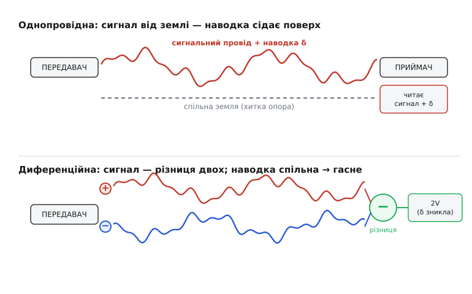
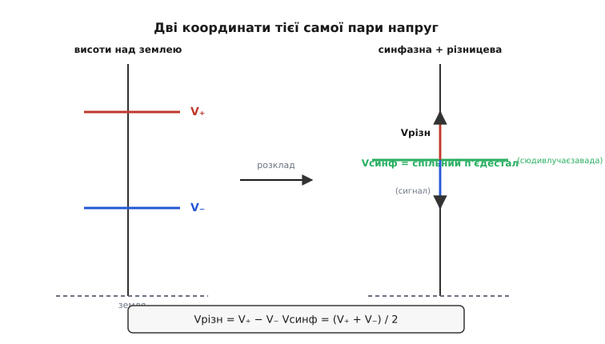

# Диференційна передача сигналу

Уявіть простий дослід. Треба передати на метр-два слабенький сигнал — голос із мікрофона, такти від давача, біти від однієї мікросхеми до іншої — звичайним способом: один провід несе напругу, а спільна земля служить опорою, від якої цю напругу відлічують. Усе працює на столі. Та щойно поряд опиняється імпульсний перетворювач, увімкнеться двигун чи просто подовжиться кабель — у сигнал лізе бруд: гудіння, тріск, помилкові біти. Питання, з якого виросла ціла галузь передавання даних, звучить так: чи можна передати ту саму напругу **інакше**, щоб завада, яка її псує, сама себе викинула на тому кінці? Відповідь — так, і називається вона **диференційна передача** (англ. *differential* — від лат. *differentia*, «різниця»): інформацію несе не напруга одного проводу відносно землі, а **різниця напруг двох проводів** між собою.

Це не дрібне вдосконалення, а зміна того, **що саме** вважати сигналом. І щоб побачити, чому вона така сильна, спершу треба чесно зрозуміти, чому звичайний, **однопровідний** (single-ended) спосіб такий вразливий.

### Чому однопровідна передача збирає бруд

Однопровідна лінія влаштована найочевидніше: передавач виставляє напругу на сигнальному проводі, приймач читає її **відносно спільної землі**. Уся інформація — у тому, наскільки сигнальний провід вищий за землю. Земля тут — мовчазний учасник: її вважають за нерухомий нуль.

Біда в тому, що нуль не нерухомий, а провід — не ізольований. Працює це так. Сигнальний провід тягнеться крізь простір, наповнений змінними полями: поряд силові кабелі, тактові лінії, антени, імпульсні джерела. Кожне змінне поле **наводить** на провід паразитну напругу — через ємнісний зв'язок (електричне поле) і через [магнітний зв'язок](topic:physics/inductive-coupling) (змінний струм у сусідньому проводі пронизує петлю нашого кола й наводить ЕРС). Приймач не вміє відрізнити корисну напругу від наведеної — він читає **суму**. Наведене сідає просто поверх сигналу, і це вже помилка.

> 🔧 **Навіщо це.** Та сама лінія, що бездоганно працює на макетній платі завдовжки 10 см, на реальному виробі завдовжки метр перетворюється на антену. Більшість «незрозумілих» збоїв — зниклі біти на шині, гудіння 50 Гц у звуці, плавання показів АЦП — це не «погана деталь», а наводка на однопровідну лінію. Вибір способу передачі вирішує цю проблему ще до того, як вона виникне, — і це дешевше за будь-яке екранування потім.

Є й друга, підступніша частина. Корисний сигнал відлічують **від землі приймача**, а сама ця земля — спільний провід, яким течуть зворотні струми всіх вузлів: цифри, що клацає мільйони разів на секунду, реле, що смикає ампери, силового каскаду. Спільний провід має ненульовий опір та індуктивність, тож ці струми створюють на ньому падіння напруги — земля передавача й земля приймача **гойдаються одна відносно одної** ([стрибок землі](topic:electronics/ground-power-rails) — звичне явище). А раз опора рухається, то й «висота над нею», тобто весь сигнал, теж пливе. Однопровідна лінія приречена міряти від хиткої точки відліку.

Підіб'ємо причину: однопровідний сигнал вразливий, **бо його опора (земля) спільна з усім брудом і фізично окрема від проводу**. Завада діє на провід, а опора пливе сама по собі — і приймачеві нічим їх розрізнити. Диференційна ідея б'є точно в цей корінь.

### Ідея: нести різницю, а не висоту

Зробімо так. Замість одного проводу візьмемо **два**, і пустимо ними один і той самий сигнал, але **дзеркально**: коли на одному напруга йде вгору на +V, на другому вона йде вниз на −V (відносно спільного середнього рівня). Перший провід назвемо прямим (часто його позначають **+**, або **D+**, «hot»), другий — інверсним (**−**, **D−**, «cold»). А приймач навчимо реагувати **не** на висоту кожного проводу над землею, а лише на **різницю** між проводами.

Тепер подивимось, що ці двоє дають разом. Корисна різниця дорівнює

```
Vсигнал = V₊ − V₋ = (+V) − (−V) = 2V
```

Уже приємно: розмах сигналу **подвоївся** просто тому, що проводи йдуть назустріч. Але головне — не це. Головне в тому, **що стається із завадою**.

Проведімо обидва проводи **поряд**, краще — [витою парою](topic:electronics/twisted-pair), щоб вони бачили простір однаково. Тоді будь-яке зовнішнє поле наводить на них **майже однакову** паразитну напругу: вони ж в одному місці, у тому самому полі, на однаковій відстані від джерела завади. Тож наводка δ сідає на **обидва** проводи разом — і на прямий, і на інверсний. Що тоді бачить приймач?

```
провід «+»  несе:  +V + δ
провід «−»  несе:  −V + δ
різниця:   (+V + δ) − (−V + δ) = 2V + δ − δ = 2V
```

І ось він, фокус. Завада **δ зникла**. Не послабла — **скоротилася тотожно**, бо приймач віднімає один провід від іншого, а наводка на обох була однакова й при відніманні зійшла нанівець. Корисні ж 2V лишилися цілими, бо вони на двох проводах **протилежні** і при відніманні складаються. Однопровідна лінія була беззахисна саме тому, що завада сідала «поверх» і її нічим було відрізнити; диференційна перетворює ту саму заваду на **спільну** обом проводам — а спільне приймач відкидає за побудовою.


*Угорі: однопровідна передача. Сигнал міряють від землі, наведена напруга δ додається до нього — приймач читає сигнал плюс бруд. Унизу: диференційна. Сигнал іде двома дзеркальними проводами, наводка δ сідає на обидва однаково; приймач бере різницю, і δ скорочується, а корисний розмах ще й подвоюється.*

Ось чому це працює не «трохи краще», а якісно інакше. Однопровідна лінія намагається **захиститись** від завади (екрануванням, фільтрами) — і завжди програє, бо завада вже в сигналі. Диференційна лінію **не захищає**: вона дозволяє заваді сісти на проводи, але робить так, що завада сідає у **спільну** складову, яку приймач і так не слухає. Боротьба перенесена з «не пустити бруд» на «зробити бруд однаковим на обох проводах» — а це геометрична задача (тримати проводи поряд), і розв'язується вона набагато надійніше.

### Спільне й різницеве: дві мови для тієї самої пари

Щоб говорити про це точно, корисно завести два імені для будь-якої пари напруг на двох проводах. Перше — **різницеве** (диференційне): різниця проводів, саме в ній сидить корисний сигнал. Друге — **синфазне** (common-mode, «спільного ладу»): спільний для обох рівень, середнє двох проводів; саме сюди й влучає вся наводка.

```
Vрізн = V₊ − V₋          ← корисний сигнал
Vсинф = (V₊ + V₋) / 2     ← п'єдестал і завада
```

Це не два різні сигнали, які хтось подає, а два **погляди** на ту саму пару: будь-яку пару (V₊, V₋) можна точно розкласти на синфазну й різницеву частини й скласти назад. Уся суть диференційної передачі в одному реченні: **корисне кладуть у різницеву складову, а завада — хоч-не-хоч — лягає у синфазну, і приймач читає лише різницеву, відкидаючи синфазну.**

Тепер видно, де проходить межа реальності. Ідеальний приймач реагував би **тільки** на Vрізн і геть не помічав Vсинф. Справжній теж трохи реагує на синфазну — недосконало віднімає, бо два його входи не абсолютно однакові. Наскільки добре в нього виходить придушити спільне на користь різниці, міряють одним числом — [коефіцієнтом придушення синфазного сигналу](topic:electronics/cmrr) (CMRR). Чим він більший, тим повніше зникає δ і тим чистіша диференційна передача. CMRR — це, по суті, паспорт якості «віднімання» в конкретному приймачі.


*Зліва — дві напруги проводів V₊ і V₋ як висоти над землею. Справа — той самий стан у двох інших координатах: синфазна Vсинф (спільний п'єдестал, куди сідає наводка) і різницева Vрізн (корисний сигнал, що гойдається на ньому). Передача кладе сигнал у різницеву вісь, а завада накопичується в синфазній — і її приймач відкидає.*

### Чому диференційна лінія байдужа до зсуву земель

Тепер повернімося до другої болячки однопровідної передачі — рухомої землі — і подивимось, що з нею робить різниця. Хай земля передавача й земля приймача розійшлися на цілий вольт (різні плати, довгий кабель, спільний силовий провід). В однопровідній лінії це катастрофа: цей вольт додається просто до сигналу, бо сигнал відлічують від землі, а вона з'їхала.

У диференційній лінії той самий вольт додається до **обох** проводів **однаково** — він же гойднув спільну для них землю-передавач відносно землі-приймача. А додане однаково до обох проводів — це чисто синфазний зсув. Різниця проводів його не помічає:

```
без зсуву:   V₊ = +V,        V₋ = −V        → різниця 2V
зсув земель на +1 В:
             V₊ = +V + 1 В,  V₋ = −V + 1 В   → різниця все одно 2V
```

Тому диференційну лінію не лякає те, від чого однопровідна вмирає: вона **несе власну опору з собою** — другий провід. Сигнал відлічують не від далекої хиткої землі, а від проводу-сусіда, що пройшов поряд ту саму дорогу й зазнав того самого зсуву. Це й дозволяє диференційним шинам працювати між пристроями з **різними** землями — рівно те, на чому тримаються промислові й автомобільні мережі.

> 🔧 **Навіщо це.** Саме завдяки байдужості до зсуву земель шина RS-485 тягнеться на сотні метрів між щитами на різних потенціалах, а CAN-шина в автомобілі живе серед іскор системи запалювання й кидків стартера. Якби ці лінії були однопровідні, перший же зсув землі між блоками зробив би з даних кашу. Диференційна передача — це те, що взагалі робить можливим зв'язок «довгий провід між незалежними пристроями».

Та межа все ж є, і важлива. «Однакова на обох» наводка скорочується, але приймач — реальна мікросхема з власним живленням, і вона здатна правильно віднімати лише доти, доки напруга проводів лишається в межах її робочого вікна. Цей діапазон і називають **допустимим синфазним діапазоном** (common-mode range). Виходить провід за нього (землі розійшлися надто сильно, чи влучив потужний кидок) — і приймач уже не «бачить» входи, віднімання ламається, хоч різниця формально й правильна. Тому стандарти задають синфазний діапазон явно: наприклад, RS-485 гарантує роботу, поки спільний рівень тримається в межах від −7 до +12 В відносно землі приймача. Поки в цьому вікні — зсув земель і наводка не страшні; за ним — потрібні ізолятори.

### Чому це ще й чистіший сигнал, а не лише захищеніший

Дві переваги ми вже бачили мимохідь, але їх варто назвати окремо, бо вони — про якість, а не лише про стійкість.

Перша — **подвоєний розмах**. Різниця двох дзеркальних проводів удвічі більша за розмах кожного окремо. А сам бруд лишається той самий або менший. Тож **відношення сигналу до завади** ([SNR](topic:electronics/signal-noise-ratio)) виграє двічі: чисельник подвоюється, бо сигнал складається, знаменник зменшується, бо синфазна наводка скорочується. Це особливо цінно там, де живлення низьке: при 3.3 В однопровідний сигнал має жалюгідний запас над шумом, а диференційний з тих самих рівнів дає вдвічі більший розмах — тому інтерфейси на кшталт [LVDS](topic:electronics/differential-signaling/hist-differential-lineage.md) гойдають проводи лише на ±175 мВ, а працюють надійно й на сотнях мегабіт.

Друга — **тиша назовні**. Два проводи з протилежними струмами випромінюють поля, що теж майже гасять одне одного: куди прямий провід штовхає поле «туди», інверсний штовхає «звідти». Здалеку пара виглядає як майже нейтральний об'єкт. Тож диференційна лінія не тільки **стійка до** завад — вона сама їх майже не **створює**, на відміну від однопровідної, що випромінює всім сусідам. Та сама геометрія, що тримає наводку синфазною, тримає й випромінювання взаємно скомпенсованим.

### Тонкість: «диференційне» і «збалансоване» — не одне й те саме

Тут легко сплутати два поняття, і їх варто чітко розвести, бо плутанина дорого коштує в розумінні.

**Диференційне** (differential) — про **передавач**: він жене проводи дзеркально, +V на одному, −V на іншому. **Збалансоване** (balanced) — про **імпеданс**: обидва проводи мають **однаковий опір до землі**. І ось ключ, який багато хто проминає: придушення завади дає **саме баланс**, а не дзеркальне керування. Наводка скорочується тоді, коли вона на обох проводах однакова, — а однаковою вона буде, якщо проводи однаково «бачать» землю, тобто **збалансовані**. Дзеркальний привод лише додає подвоєний розмах; стійкість до завад тримається на балансі.

Тому, скажімо, у студійному звуці поширений [роз'єм XLR](topic:electronics/differential-signaling/comp-balanced-line-driver.md): три контакти — земля (екран), «гарячий» (контакт 2, пряма полярність) і «холодний» (контакт 3, інверсна). Часто його женуть диференційно (контакт 3 несе дзеркало контакту 2), і це додає розмаху. Але навіть якщо передавач жене сигнал лише на «гарячий», а «холодний» просто тримає такий самий опір до землі мовчки, — лінія **все одно** глушить наводку, бо вона **збалансована**: завада сідає на обидва контакти однаково й при відніманні зникає. Звідси правило: **дзеркальний привод — приємний бонус (двічі розмах), а ловить заваду баланс імпедансів.** Плутати їх — значить шукати причину захисту не там, де вона є.

### Worked-приклад: приймач рахує різницю, а не висоту

Покажемо різницеву арифметику в коді — так, як її робить мікроконтролер, що замість одного аналогового входу бере **два** канали АЦП (прямий і інверсний) і сам формує диференційне читання. Це наочно показує, чому синфазна частина випадає.

**Умова.** Прямий канал виміряв 2.150 В, інверсний 1.850 В. Корисний сигнал — їхня різниця. Аж тут поряд увімкнувся перетворювач і підняв **обидва** канали на 0.400 В наводки. Перевірмо, що різницеве читання його не помітить.

```c
// Два канали АЦП міряють обидва проводи диференційної пари.
// Корисний сигнал — РІЗНИЦЯ; синфазну частину рахуємо окремо лише для діагностики.
float adc_plus  = 2.150f;   // прямий провід, В
float adc_minus = 1.850f;   // інверсний провід, В

float v_diff = adc_plus - adc_minus;            // = 0.300 В — корисний сигнал
float v_cm   = (adc_plus + adc_minus) * 0.5f;   // = 2.000 В — спільний п'єдестал

// Тепер на ОБИДВА проводи сіла однакова наводка 0.400 В:
float noise = 0.400f;
float p2 = adc_plus  + noise;   // 2.550 В
float m2 = adc_minus + noise;   // 2.250 В

float v_diff_noisy = p2 - m2;   // (2.550 − 2.250) = 0.300 В — без змін!
float v_cm_noisy   = (p2 + m2) * 0.5f;  // 2.400 В — уся наводка пішла СЮДИ
```

**Висновок.** Корисне читання `v_diff` лишилось рівно 0.300 В — наводка на нього не вплинула. Уся завада осіла в `v_cm`, піднявши синфазний рівень з 2.000 до 2.400 В, а різницю не зачепивши. Це і є диференційна передача в чистому вигляді: бери різницю — і бруд, що однаковий на обох проводах, випаде сам. Єдина умова справності — щоб обидва канали лишалися у вікні, яке АЦП здатен виміряти (тут до 3.3 В): 2.550 В усередині, тож усе чесно. Підстрибни наводка до 1.5 В — прямий канал уперся б у стелю, і різниця **зламалася** б, дарма що формально вона все ще 0.300 В.

### Що це коштує і де межа

Чесно про ціну. Диференційна передача бере **два проводи замість одного** — удвічі більше міді й контактів. Передавач має жени́ти дзеркальну пару, приймач — точно віднімати; це складніше за «виставив рівень — прочитав рівень». На дуже коротких лініях усередині однієї тихої плати ця ціна не окупається — там однопровідних доріжок цілком досить. Диференційна передача починає виправдовуватись, коли є **бодай одне** з трьох: лінія довга (антена для наводок), середовище гучне (мотори, силова частина, радіо поряд) або земля передавача й приймача не спільна (різні плати, різні пристрої).

Саме тому вона не «завжди краща», а **інструмент під певну задачу** — зате задачу, що трапляється всюди, де сигнал виходить за межі однієї спокійної плати: від мікрофонної лінії і промислової шини до USB, Ethernet і швидких каналів між мікросхемами. Скрізь, де треба провести слабкий сигнал крізь брудний світ цілим, відповідь та сама: не бережи висоту над хиткою землею — неси різницю двох проводів-близнюків, і світ, що б'є по обох однаково, сам себе викине на тому кінці.
