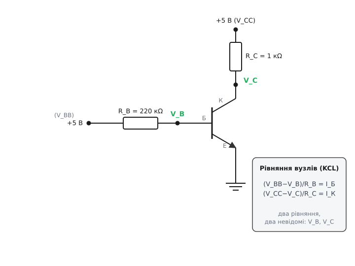
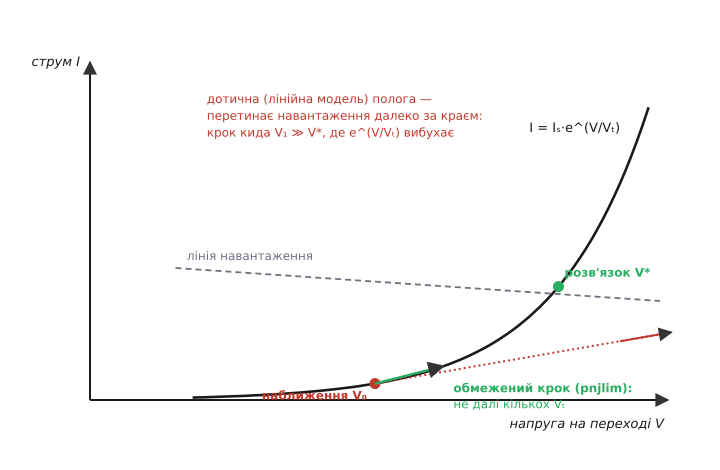
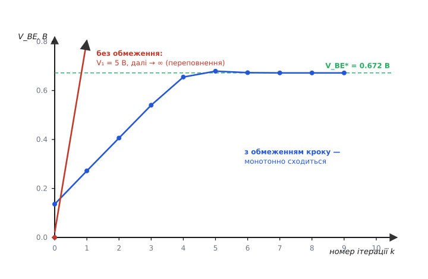

# ⚙️ Робоча точка з рівнянь Еберса — Молла: як DC-аналіз SPICE ловить її Ньютоном

Дайте резисторному дільнику напругу — і струм читається законом Ома за один крок, а вся схема з самих резисторів розв'язується одним матричним множенням. Додайте один транзистор — і ця охайна лінійність гине. Струм колектора росте експонентою від напруги на переході, тож рівняння, яким має задовольняти схема, стають трансцендентними: замкненої формули для робочої точки більше немає. Це та сама стіна, у яку впирається кожен симулятор кіл на першому ж рядку будь-якого аналізу. І вихід — метод Ньютона, накручений на рівняння Еберса — Молла, — варто раз зібрати руками, бо він до дна прояснює, що ж насправді робить кнопка «симулювати».

Задача звучить буденно: маємо схему з одного транзистора, двох резисторів і двох джерел (рисунок нижче), і хочемо знайти її **робочу точку** (operating point, у SPICE — «.op») — усі напруги вузлів і струми віток у спокої, коли ніщо не змінюється в часі. Ніяких малих сигналів, ніяких коливань: просто де схема сама собою «сідає».



*Транзистор зі спільним емітером. R_B зі свого джерела +5 В подає струм у базу, R_C зі свого — у колектор, емітер на землі. Невідомі — дві напруги вузлів V_B і V_C; струми у виводи транзистора задають рівняння Еберса — Молла. Праворуч — два вузлові рівняння, які й треба розв'язати разом.*

## Задача: два вузли, дві напруги — і жодної формули

Виберемо емітер за опорну точку (0 В). Тоді напруги на переходах виражаються через напруги вузлів прямо: V_BE = V_B, а V_BC = V_B − V_C. Невідомих рівно дві — V_B і V_C.

Кожен вузол дає рівняння за [законом струмів Кірхгофа](topic:electronics/kcl): струм, який резистор заганяє у вузол, мусить дорівнювати струмові, який транзистор у цей вивід забирає.

```
вузол бази:      (V_BB − V_B) / R_B = I_Б
вузол колектора: (V_CC − V_C) / R_C = I_К
```

Ліві частини лінійні й нудні. Уся нелінійність — праворуч, у струмах виводів, які беруться з рівнянь Еберса — Молла (додатний струм тече **у** вивід):

```
I_F = I_ES·(e^(V_BE/Vₜ) − 1)          ← прямий діод, перехід емітер–база
I_R = I_CS·(e^(V_BC/Vₜ) − 1)          ← обернений діод, перехід колектор–база

I_К = α_F·I_F − I_R
I_Б = (1 − α_F)·I_F + (1 − α_R)·I_R
```

Підставмо I_Б та I_К у вузлові рівняння й перенесімо все в один бік — дістаємо дві функції, які треба обнулити:

```
f_Б(V_B, V_C) = (V_BB − V_B)/R_B − I_Б(V_B, V_B−V_C) = 0
f_К(V_B, V_C) = (V_CC − V_C)/R_C − I_К(V_B, V_B−V_C) = 0
```

Два рівняння, дві невідомі — але невідомі сидять **усередині експонент**. Жодне алгебричне перетворення їх звідти не витягне: логарифм одного рівняння не розплутає суму двох експонент у другому. Розв'язок є (і єдиний, для розумної схеми), та дістати його можна лише **чисельно** — наближаючись до нього кроками.

> 🔧 **Навіщо це.** Саме це зчеплення — струм у кожен вивід залежить одразу від обох напруг, ще й через експоненту — і є причина, чому транзисторну схему не «прочитаєш очима», як резисторний дільник. Дільник розв'язується в голові; тут навіть із двома вузлами треба ітеративний розв'язувач. А в мікросхемі таких вузлів мільйони — і всі вони чекають на той самий метод.

## Ідея: не вгадуй розв'язок — вгадуй, а тоді виправляй

Метод, який тут працює, — [Ньютона — Рафсона](topic:math/newton-raphson). Думка проста до зухвалості. Розв'язати нелінійне рівняння важко; замінити функцію поблизу здогадки її **дотичною** — легко, бо дотична лінійна. Тож: візьми наближення, заміни функцію дотичною, розв'яжи лінійну задачу, отримай ближче наближення — і повторюй, поки не збіжишся. Для однієї змінної крок відомий кожному:

```
x ← x − f(x) / f′(x)
```

У нас змінних дві, тож похідну заступає **якобіан** (Jacobian) — матриця частинних похідних, названа на честь Карла Якобі. Крок стає лінійною системою: замість ділити на похідну, розв'язуємо матричне рівняння.

```
J · Δ = −f          Δ = (ΔV_B, ΔV_C) — поправка до наближення
                    f = (f_Б, f_К)   — нев'язки в поточній точці
```

Найкрасивіше тут ось що. Лінеаризувати транзистор у поточному наближенні — це буквально збудувати його [мала-сигнальну модель](topic:electronics/bjt-small-signal) саме в цій точці. Похідні діодних струмів

```
g_F = dI_F/dV_BE = (I_ES/Vₜ)·e^(V_BE/Vₜ) = (I_F + I_ES)/Vₜ
g_R = dI_R/dV_BC = (I_CS/Vₜ)·e^(V_BC/Vₜ) = (I_R + I_CS)/Vₜ
```

— це і є провідності переходів, ті самі, що в гібридній π-схемі. Тобто кожна ітерація Ньютона підмінює нелінійний транзистор його «компаньйон-моделлю» (резистор плюс джерело струму), розв'язує вже **чисто лінійну** схему — рівно те, що робить [вузловий аналіз симулятора](topic:electronics/spice-simulation/math-nodal-mna.md), — і за результатом підправляє напруги. Ньютон по нев'язках і компаньйон-модель у вузловому аналізі — це той самий метод, побачений з двох боків.

Зверни увагу на форму провідності: `g = (струм + струм насичення)/Vₜ`. Нахил експоненти пропорційний її **висоті**. Це водночас джерело сили методу (близько до розв'язку модель точна) і корінь усіх бід (далеко від нього нахил або нікчемний, або велетенський — про це нижче).

Лишилося виписати чотири елементи якобіана. Оскільки V_BE = V_B, а V_BC = V_B − V_C, ланцюгове правило дає:

```
J_11 = ∂f_Б/∂V_B = −1/R_B − [(1−α_F)·g_F + (1−α_R)·g_R]
J_12 = ∂f_Б/∂V_C = (1−α_R)·g_R
J_21 = ∂f_К/∂V_B = −α_F·g_F + g_R
J_22 = ∂f_К/∂V_C = −1/R_C − g_R
```

Ось і все, що потрібне: спосіб порахувати струми й провідності в будь-якій точці — і чотири числа якобіана. Далі — цикл.

## Робочий код

Нижче — цілий розв'язувач: обчислення приладу (`device`), обмежувач кроку (`limit`, до нього повернемося) і сам цикл Ньютона (`solve`). Ніяких бібліотек лінійної алгебри — систему 2×2 розв'язуємо за правилом Крамера просто в рядку, щоб було видно кожну дію. Той самий приклад подано двома мовами: Python — щоб алгоритм читався, і C — бо всередині справжнього SPICE він саме такий.

:::tabs
```python
import math

# --- Параметри транзистора (Еберс — Молл у формі з I_S) ---
Vt   = 0.02585                 # тепловий потенціал, В (26 мВ при кімнатній)
I_S  = 1e-14                   # струм насичення транзистора, А
aF, aR = 0.99, 0.5             # коефіцієнти передавання (прямий / обернений)
I_ES, I_CS = I_S/aF, I_S/aR    # струми насичення переходів

# --- Схема ---
VBB, RB = 5.0, 220e3
VCC, RC = 5.0, 1.0e3

def device(vbe, vbc):
    """Струми виводів і провідності переходів у точці (vbe, vbc)."""
    IF = I_ES*(math.exp(vbe/Vt) - 1.0)     # прямий діод
    IR = I_CS*(math.exp(vbc/Vt) - 1.0)     # обернений діод
    Ic = aF*IF - IR
    Ib = (1 - aF)*IF + (1 - aR)*IR
    gF = (I_ES/Vt)*math.exp(vbe/Vt)        # dIF/dVbe
    gR = (I_CS/Vt)*math.exp(vbc/Vt)        # dIR/dVbc
    return Ic, Ib, gF, gR

def limit(vnew, vold, isat):
    """Обмеження стрибка напруги на переході — pnjlim із SPICE."""
    vcrit = Vt*math.log(Vt/(math.sqrt(2.0)*isat))
    if vnew > vcrit and abs(vnew - vold) > 2*Vt:
        if vold > 0:
            arg = 1.0 + (vnew - vold)/Vt
            return vold + Vt*math.log(arg) if arg > 0 else vcrit
        return Vt*math.log(vnew/Vt)
    return vnew

def solve(vb=0.0, vc=0.0, tol=1e-9, maxit=100):
    for k in range(maxit):
        vbe, vbc = vb, vb - vc
        Ic, Ib, gF, gR = device(vbe, vbc)

        # Нев'язки вузлових рівнянь (KCL)
        fB = (VBB - vb)/RB - Ib
        fC = (VCC - vc)/RC - Ic

        # Якобіан ∂(fB, fC)/∂(vb, vc)
        J11 = -1.0/RB - ((1 - aF)*gF + (1 - aR)*gR)
        J12 =  (1 - aR)*gR
        J21 = -aF*gF + gR
        J22 = -1.0/RC - gR

        # Розв'язок 2×2  J·Δ = −f  (правило Крамера)
        det = J11*J22 - J12*J21
        b1, b2 = -fB, -fC
        dvb = (J22*b1 - J12*b2)/det
        dvc = (J11*b2 - J21*b1)/det
        vb_new, vc_new = vb + dvb, vc + dvc

        # Обмежуємо стрибки напруг на ПЕРЕХОДАХ, тоді відновлюємо вузли
        vbe_l = limit(vb_new,          vbe, I_ES)
        vbc_l = limit(vb_new - vc_new, vbc, I_CS)
        vb_new, vc_new = vbe_l, vbe_l - vbc_l

        step = max(abs(vb_new - vb), abs(vc_new - vc))
        vb, vc = vb_new, vc_new
        if step < tol:
            return vb, vc, k + 1
    raise RuntimeError("не збіглося")

vb, vc, n = solve()
vbe, vbc = vb, vb - vc
Ic, Ib, gF, gR = device(vbe, vbc)
print(f"V_BE={vbe:.4f} В  V_CE={vc:.4f} В  "
      f"I_C={Ic*1e3:.4f} мА  I_B={Ib*1e6:.2f} мкА  "
      f"β={Ic/Ib:.1f}  за {n} ітерацій")
```
```c
#include <stdio.h>
#include <math.h>

/* --- Параметри транзистора (Еберс — Молл у формі з I_S) --- */
static const double Vt = 0.02585;    /* тепловий потенціал, В   */
static const double I_S = 1e-14;     /* струм насичення, А      */
static const double aF = 0.99, aR = 0.5;

/* --- Схема --- */
static const double VBB = 5.0, RB = 220e3;
static const double VCC = 5.0, RC = 1.0e3;

typedef struct { double Ic, Ib, gF, gR; } Dev;

static Dev device(double vbe, double vbc) {
    double I_ES = I_S/aF, I_CS = I_S/aR;
    double IF = I_ES*(exp(vbe/Vt) - 1.0);   /* прямий діод   */
    double IR = I_CS*(exp(vbc/Vt) - 1.0);   /* обернений діод */
    Dev d;
    d.Ic = aF*IF - IR;
    d.Ib = (1 - aF)*IF + (1 - aR)*IR;
    d.gF = (I_ES/Vt)*exp(vbe/Vt);
    d.gR = (I_CS/Vt)*exp(vbc/Vt);
    return d;
}

/* Обмеження стрибка напруги на переході — pnjlim із SPICE */
static double limitv(double vnew, double vold, double isat) {
    double vcrit = Vt*log(Vt/(sqrt(2.0)*isat));
    if (vnew > vcrit && fabs(vnew - vold) > 2*Vt) {
        if (vold > 0) {
            double arg = 1.0 + (vnew - vold)/Vt;
            return arg > 0 ? vold + Vt*log(arg) : vcrit;
        }
        return Vt*log(vnew/Vt);
    }
    return vnew;
}

int main(void) {
    const double I_ES = I_S/aF, I_CS = I_S/aR;
    double vb = 0.0, vc = 0.0;

    for (int k = 0; k < 100; k++) {
        double vbe = vb, vbc = vb - vc;
        Dev d = device(vbe, vbc);

        double fB = (VBB - vb)/RB - d.Ib;      /* нев'язки KCL */
        double fC = (VCC - vc)/RC - d.Ic;

        double J11 = -1.0/RB - ((1 - aF)*d.gF + (1 - aR)*d.gR);
        double J12 =  (1 - aR)*d.gR;
        double J21 = -aF*d.gF + d.gR;
        double J22 = -1.0/RC - d.gR;

        double det = J11*J22 - J12*J21;        /* J·Δ = −f, 2×2 */
        double b1 = -fB, b2 = -fC;
        double dvb = (J22*b1 - J12*b2)/det;
        double dvc = (J11*b2 - J21*b1)/det;
        double vbn = vb + dvb, vcn = vc + dvc;

        double vbe_l = limitv(vbn,        vbe, I_ES);   /* обмеження */
        double vbc_l = limitv(vbn - vcn,  vbc, I_CS);
        vbn = vbe_l; vcn = vbe_l - vbc_l;

        double step = fmax(fabs(vbn - vb), fabs(vcn - vc));
        vb = vbn; vc = vcn;
        if (step < 1e-9) {
            printf("V_BE=%.4f В  V_CE=%.4f В  I_C=%.4f мА  за %d ітерацій\n",
                   vb, vc, d.Ic*1e3, k + 1);
            return 0;
        }
    }
    printf("не збіглося\n");
    return 1;
}
```
:::

**Що виводить.** Запуск дає робочу точку:

```
V_BE = 0.6720 В   V_CE = 3.0524 В
I_C  = 1.9476 мА  I_B  = 19.67 мкА   β = 99.0   за 11 ітерацій
```

Швидка перевірка на здоровий глузд: колектор при 3.05 В зворотно зміщений відносно бази (V_BC = 0.672 − 3.05 = −2.38 В), тож транзистор в активному режимі, і β = I_К/I_Б = 99 точно збігається з α_F/(1−α_F) = 0.99/0.01. Але розв'язувач дав більше, ніж прикидка «на пальцях»: він самоузгоджено знайшов і V_C (падіння на R_C відсунуло колектор до 3.05 В), і крихітну поправку від оберненого діода — те, що ручний рахунок в активному режимі просто відкидає.

## Пастка перша: без обмеження кроку воно вибухає

Викиньте з циклу два рядки з `limit` (лишіть `vb_new, vc_new` як є після Ньютона) — і чистий метод Ньютона на цій схемі **розвалюється** ще до першої розумної цифри. Подивімося, чому.

Старт холодний: V_B = V_C = 0. При нульовій напрузі переходу струм майже нульовий, а разом з ним і провідність — адже `g ∝ струм`. Нев'язка ж вузла бази цілком реальна: резистор R_B хоче заперти у вузол (5−0)/220к ≈ 22.7 мкА. Ньютон чесно ділить реальний струм на майже нульовий нахил — і пропонує стрибок аж до V_B ≈ 5 В за **один** крок.



*Механізм перестрибу. У наближенні V₀ струм малий, тож дотична (лінійна модель) полога. Опукла експонента росте куди швидше за свою дотичну, тому дотична перетинає лінію навантаження далеко за справжнім розв'язком V\*. Крок Ньютона кидає напругу туди — у ділянку, де справжній струм на порядки більший, і наступна нев'язка стає катастрофічною.*

А при V_BE = 5 В модель обчислює e^(5/0.02585) = e^193 ≈ 10⁸⁴. Струм виходить астрономічно хибним, наступний крок жбурляє напругу в інший бік, і за кілька ітерацій експонента переповнює число з рухомою комою. Ось справжній слід нашого коду без обмеження:

```
ітерація 0:  V_B = 5.00 В           (стрибок з нуля)
ітерація 1:  I_C ≈ 1·10⁷⁰ А         (експонента вже здуріла)
ітерація 2:  V_C ≈ 5·10⁵⁶ В
ітерація 4:  переповнення → нескінченність. Розбіжність.
```

Це не вада реалізації, а вбудована властивість Ньютона: метод припускає, що функція на всю довжину кроку схожа на свою дотичну. Жодна функція не зраджує це припущення так швидко, як експонента. Крок на один Vₜ (26 мВ) міняє її в e ≈ 2.7 раза, на десять Vₜ — у 22 000 разів. Лінійній моделі можна довіряти хіба на частку Vₜ — а Ньютон, не спитавши, пропонує кроки по кілька вольт.

## Ліки: обмеження напруги на переході

Рецепт, яким рятується SPICE, придумали разом із самим симулятором у Берклі (Лоуренс Нейджел під орудою Дональда Педерсона, меморандум ERL-M382, квітень 1973-го; сама модель Еберса — Молла й лягла в його ядро). Ідея: після того як Ньютон запропонував нову напругу переходу, **не дай їй стрибнути надто далеко за раз**. Функція називається `pnjlim`, і тримається вона на понятті **критичної напруги**:

```
V_crit = Vₜ·ln( Vₜ / (√2·I_S) )
```

Це, грубо, та напруга, за якою діодний струм зрівнюється зі своєю ж масштабною величиною нахилу, — поріг, за яким експонента вже стрімка. Для нашого транзистора V_crit(емітер) = 0.730 В, V_crit(колектор) = 0.712 В. Логіка обмежувача читається просто:

- напруга нижча за критичну або крок дрібний (< 2·Vₜ) — пропускаємо як є, тут дотична ще чесна;
- крок великий, а стартували з додатної напруги — дозволяємо зрости лише **логарифмічно**: `V ← V_old + Vₜ·ln(1 + ΔV/Vₜ)`, тобто на скільки б Ньютон не націлився, реально піднімаємося на керовану дещицю;
- стартували з нуля чи мінуса, а летимо високо — саджаємо в розумну лог-масштабовану точку `Vₜ·ln(V/Vₜ)`.

Тонкість, без якої обмеження було б безглуздим: SPICE обмежує напруги **на переходах** (V_BE, V_BC), а не напруги вузлів, — бо саме на переходах живуть експоненти. Тому в циклі ми беремо запропоновані Ньютоном значення, лімітуємо V_BE та V_BC, і лише тоді відновлюємо вузли (при заземленому емітері V_C = V_BE − V_BC). Той самий холодний старт тепер поводиться геть інакше:



*Напруга V_BE проти номера ітерації. З обмеженням (синє) розв'язувач лізе вгору контрольованими лог-кроками, поки не опиниться в межах кількох Vₜ від відповіді, — а там уже вмикається справжня квадратична збіжність Ньютона й за два кроки прибиває розв'язок до дев'яти значущих цифр. Без обмеження (червоне) перший же крок кидає напругу на 5 В, далі — переповнення.*

Одинадцять ітерацій — і надійно. Останні кроки показують фірмову рису Ньютона: щойно наближення близьке, помилка на кожному кроці підноситься до квадрата (7·10⁻⁴ → 1·10⁻⁵ → 3·10⁻⁹ В), і точність подвоюється щоразу. Обмеження не псує цю квадратичну кінцівку — воно лише проводить нас через небезпечний початок, де дотична бреше.

## Пастка друга: з чого починати

Ньютон збігається звідусіль лише для сумирних функцій; наша — норовиста, і **початкове наближення** вирішує і швидкість, і саме виживання. Старт з нульових напруг перекладає всю чорну роботу початку на обмежувач — звідси одинадцять ітерацій. Підкажіть розв'язувачеві правдоподібне: V_BE коло діодних 0.65 В, колектор десь посеред живлення — і той самий код збігається за **шість** кроків. Саме тому SPICE не стартує з нуля, а засіває переходи біля напруги відмикання (кілька десятих вольта): не з міркувань точності, а щоб оминути ту саму пласку ділянку, де нахил нікчемний і крок вибухає.

Коли ж і обмеження кроку не рятує — на «цупких» схемах із додатним зворотним зв'язком, засувках, багатьох стійких станах, — SPICE ескалює двома прийомами, і назвати їх варто чесно, бо на них тримається збіжність важких кіл:

- **gmin stepping** — тимчасово підвісити до кожного переходу крихітну провідність gmin, яка приборкує експоненту (робить задачу «лінійнішою»), розв'язати, тоді поступово прибирати цю провідність до нуля, щоразу стартуючи з попереднього розв'язку;
- **source stepping** — підняти джерела живлення від нуля до номіналу сходинками, кожну сходинку доводячи Ньютоном до збіжності й беручи її розв'язок за наближення для наступної.

Обидва — окремий випадок **продовження за параметром** (homotopy): плавно вести задачу від тієї, що розв'язується легко, до справжньої, не даючи Ньютонові згубити слід.

## Складність і що з цього маємо

Ціна однієї ітерації складається з трьох дій: обчислити прилад (пара викликів `exp`), зібрати матрицю з провідностей, розв'язати її. Для нашої 2×2 це дрібниця; для мікросхеми з 10⁵ вузлів матриця величезна, але **розріджена** (кожен вузол зчеплений лише з сусідами), і саме її розв'язання з'їдає весь час — через те симулятори живуть і вмирають на алгоритмах розрідженої лінійної алгебри й на евристиках збіжності. Кількість ітерацій — жменя, коли схема сумирна, і десятки (або відмова) на важкому зміщенні.

Ще одне, про що варто сказати чесно, — **критерій зупинки**. Наш код спиняється, коли дрібний крок напруги. SPICE суворіший: він оголошує перемогу, лише коли малі **водночас** і зміна напруг вузлів, і залишкова нев'язка струмів (нижче `reltol·|v| + vntol` та `reltol·|i| + abstol`; типово abstol ≈ 1 пА, vntol ≈ 1 мкВ, reltol ≈ 0.001). Перевіряти саму лише напругу небезпечно: на пласкій ділянці крок буває дрібний ще до збіжності, і розв'язувач спиниться на брехні.

І ось у чому підсумок. Той самісінький цикл — лінеаризуй, розв'яжи лінійну схему, підправ, повтори, — розмножений на мільйони невідомих і вбраний у розріджені розв'язувачі та прийоми продовження, і є DC-двигун усередині кожного SPICE. Рівняння Еберса — Молла дали нам струми як гладкі, диференційовні функції напруг; Ньютон обернув «розв'яжи експоненти» на «розв'яжи лінійну схему, тоді виправся»; а один-єдиний запобіжник проти норову експоненти — обмеження напруги на переході — і є вся різниця між відповіддю за одинадцять кроків і переповненням із рухомою комою.
