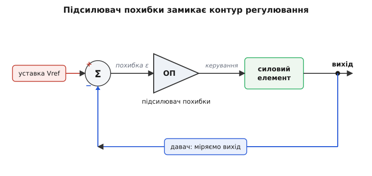
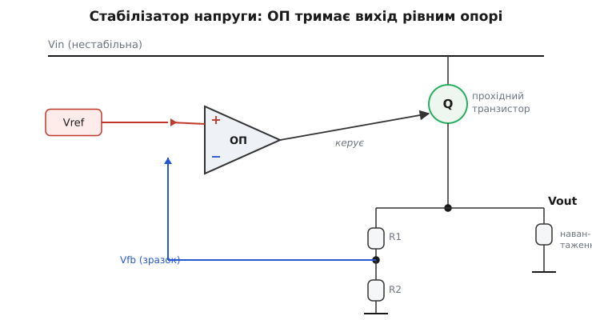
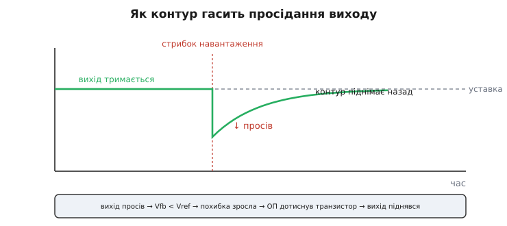

# Операційний підсилювач в контурі зворотного зв'язку

Поставте перед собою задачу: тримати на виході рівно 3.3 вольта — що б не коїлося. Живлення гойдається від 4 до 6 вольтів, навантаження то хапає струм, то відпускає, кристал нагрівається. А вольтів на виході має бути рівно 3.300, мовби прибиті цвяхом. Жоден дільник, жоден підібраний резистор цього не дасть: він задає напругу лише за відомих умов, а щойно умови попливли — попливе й вихід.

Потрібен інший підхід — не **виставити** напругу наперед, а **стежити** за нею й безперервно підправляти. Хай у схемі сидить щось, що раз у раз дивиться: «де я зараз і де мав би бути?» — і само тягне вихід туди, де треба. Це «щось» — операційний підсилювач у ролі **підсилювача похибки** (англ. *error amplifier* — підсилювач різниці-помилки). Не той самий ОП, що задає сталий коефіцієнт двома резисторами, а ОП, який став **мозком регулятора**: він порівнює бажане з дійсним і працює, щоб різниця між ними зникла.

Це інша іпостась знайомого приладу. У звичному вмиканні операційний підсилювач робить арифметику над сигналом — помножив на десять, додав два входи. Тут його робота — **керувати**: він замикає [контур зворотного зв'язку](book:electronics/negative-feedback) навколо цілої системи й тримає в ній лад. Розберімо, як саме одна мікросхема перетворює хаос умов на тверду незмінну величину.

## Уставка, давач і похибка

Почнімо з того, що взагалі означає «тримати величину». Щоб чимось керувати, треба три речі, і вони ті самі, хоч керуєш напругою, хоч струмом, хоч кутом повороту вала.

Перше — **уставка** (англ. *setpoint* — задана точка): число, до якого ми хочемо привести систему. Ті самі 3.3 вольта. У схемі уставка живе як тверда [опорна напруга](book:electronics/voltage-reference-sources) — еталон, з яким усе порівнюють.

Друге — **давач**: спосіб дізнатися, де система **зараз насправді**. Не наша надія, не розрахунок — реальний вимір виходу, повернений назад у схему. Найчастіше це простий [дільник напруги](book:electronics/voltage-divider), що знімає з виходу зменшену копію — **зразок** (англ. *feedback sample* — відгук-зразок), зручний для порівняння з опорою.

Третє — і це серце справи — **похибка** (англ. *error* — помилка, відхилення): різниця між тим, де ми хочемо бути, і тим, де є. Похибка — це сигнал «наскільки ми промахнулися й у який бік». Якщо вона нуль, усе ідеально й нічого робити не треба. Якщо вона додатна — недотягуємо, треба піддати. Від'ємна — перебір, треба прибрати.

Операційний підсилювач створений саме для цього третього кроку. У нього два входи, і всередині він віднімає один від одного: рахує **різницю**. Подайте на «плюс» уставку, на «мінус» — зразок виходу, і на виході ОП з'явиться ця різниця, помножена на велетенський власний коефіцієнт. Тобто ОП — природний **вимірювач похибки**: він нічого іншого й не вміє, лише вистежувати різницю між двома входами. Лишилося приставити до цієї похибки силу, що штовхатиме систему, — і контур замкнеться.


*Контур регулювання як ціле. Зліва задано **уставку** (опорну напругу). Вузол Σ віднімає від неї **зразок** із давача й дає **похибку ε**. Підсилювач похибки (ОП) множить цю похибку й керує **силовим елементом**, що формує вихід. Вихід міряє давач і повертає назад на «мінус» — петля замкнена. Поки похибка не нуль, контур не заспокоюється.*

> 🔧 **Навіщо це.** Цей самий трикутник «уставка → похибка → корекція» лежить в основі майже всякого регулятора, який ви зустрінете в залізі: стабілізатора живлення, драйвера струму світлодіода, термостата паяльної станції, контуру обертів двигуна. Навчившись бачити в схемі підсилювач похибки — який вхід задає мету, який міряє дійсність, куди йде корекція, — ви читаєте будь-який такий вузол з одного погляду. І навпаки: коли треба самому щось **утримати незмінним** попри завади, ви вже знаєте кістяк рішення — поставити еталон, давач і ОП між ними.

## Чому велике підсилення робить вихід точним

Тут ховається думка, що спершу здається парадоксальною. Операційний підсилювач **поганий** як прецизійний множник: його власний коефіцієнт нікому не відомий точно. У типового ОП він десь близько мільйона, але «десь близько» — може бути півмільйона в цього екземпляра й два мільйони в сусіднього, та ще й повзе з температурою. Як на такій трясовині збудувати щось точне?

А ось як. Саме тому, що підсилення **величезне**, вихід ОП мусить кинутися на рейку від найменшої похибки на входах. Поверніть це навспак: якщо вихід ОП **не** на рейці, а спокійно сидить десь усередині й керує системою, то різниця на його входах мусить бути **мікроскопічна** — бо інакше мільйонне підсилення вже жбурнуло б його в край. Виходить, поки контур працює в межах і не вперся в обмеження, ОП **сам себе** заганяє в стан, де його входи майже зрівнялися.

Простежмо цей ланцюжок повільно. Хай уставка 3.3 вольта, а вихід раптом просів до 3.2. Давач (для простоти 1:1) подає на «мінус» ці 3.2, на «плюс» сидить опора 3.3. Різниця — додатні 0.1 вольта. ОП множить її на мільйон і **щосили** піднімає свій вихід, дужче відкриваючи силовий елемент. Той підпирає вихід угору. Щойно вихід підріс — різниця на входах ОП поменшала, тиск трохи спав. Система котиться до точки, де різниця така крихітна, що добутку «різниця × мільйон» якраз вистачає тримати силовий елемент у потрібному стані — ні більше, ні менше. А ця точка — там, де вихід практично дорівнює уставці.

Ключове: **остаточну** напругу виходу задає не примхливе підсилення ОП, а **опора й давач**. Підсилення лише вирішує, **наскільки точно** вихід припасується до уставки: що воно більше, то меншою лишається залишкова похибка. Мільйон — це багато, тож похибка виходить десь у частках мілівольта. Капризна деталь дала точний результат — бо ми попросили її не **задавати** напругу, а **занулювати різницю**, а це вона робить тим краще, чим вона капризніша (тобто чим більше в неї підсилення).

Ось чому інженери кажуть, що зворотний зв'язок «обмінює» непотрібний надлишок підсилення на потрібну точність. Скільки саме точності купується за скільки підсилення — питання, яке має чисту кількісну відповідь через [підсилення в контурі](book:electronics/loop-gain): одне число, що показує, у скільки разів зворотний зв'язок придушує всі вади підсилювача. Тут досить інтуїції: багато підсилення → крихітна похибка → точний вихід.

## Лінійний стабілізатор: канонічний приклад

Зберімо все докупи на найвідомішому застосуванні — лінійному стабілізаторі напруги. Це той вузол, що з гойдливого живлення робить тверді 3.3 чи 5 вольтів для решти схеми.

Деталей небагато. Згори — нестабільне вхідне живлення Vin. Між ним і виходом стоїть **прохідний транзистор** (англ. *pass transistor* — той, крізь який проходить струм навантаження): він як кран, що пускає від входу до виходу більше чи менше струму, залежно від того, наскільки його відкрити. Вихід знімає **дільник** і повертає зразок Vfb на «мінус» ОП. На «плюс» сидить опора Vref. А вихід ОП керує тим самим краном-транзистором.


*Лінійний стабілізатор. Прохідний транзистор Q пускає струм від Vin до Vout, мов керований кран. Дільник R1–R2 знімає з Vout зразок Vfb і подає на «мінус» ОП; на «плюс» — опора Vref. ОП відкриває Q рівно настільки, щоб Vfb зрівнявся з Vref. Звідси вихід тримається на Vout = Vref · (R1 + R2) / R2 — і не залежить ні від Vin, ні від навантаження, поки транзистор має запас, щоб керувати.*

Простежмо роботу. Нехай навантаження раптом схопило більше струму. Кран не встигає — вихід трохи просідає. Зразок Vfb на «мінусі» падає нижче за опору Vref на «плюсі». ОП бачить додатну похибку й дужче відкриває транзистор — кран ширшає, струму проходить більше, вихід піднімається назад. Усе це безперервно й само собою, без жодного коду: проста фізика підсилення різниці. ОП **невпинно** правує кран так, щоб тримати Vfb = Vref.

А раз Vfb = Vref, то вихід виставлений дільником:

```
Vout = Vref · (R1 + R2) / R2
```

Опора задає точку відліку, дільник масштабує її до потрібного виходу. Хочемо 3.3 В від опори 1.25 В — підбираємо відношення резисторів. Усе інше робить контур.

**Worked-приклад: дільник стабілізатора під 3.3 В.** Маємо внутрішню опору Vref = 1.25 В (типове значення bandgap-еталона) і хочемо Vout = 3.3 В. Нижній резистор беремо R2 = 10 кОм. Знаходимо верхній R1:

```
Vout / Vref = (R1 + R2) / R2
3.3 / 1.25 = (R1 + 10000) / 10000
2.64       = (R1 + 10000) / 10000
R1 + 10000 = 26400
R1         = 16400 Ом   →   беремо 16.2 кОм (ряд E96)
```

Перевіримо в коді — це звичайна арифметика проєктування, яку зручно мати під рукою, коли крутиш номінали:

:::tabs
```c
// Підбір верхнього резистора дільника зворотного зв'язку стабілізатора.
// Vref — внутрішня опора, vout_target — бажаний вихід, r_bottom — нижнє плече.
// Повертає опір верхнього плеча в омах.
float feedback_top_resistor(float vref, float vout_target, float r_bottom)
{
    // З Vout = Vref·(R1+R2)/R2  →  R1 = R2·(Vout/Vref − 1)
    return r_bottom * (vout_target / vref - 1.0f);
}
// feedback_top_resistor(1.25f, 3.3f, 10000.0f) -> 16400 Ом, беремо 16.2 кОм
```
```python
# Підбір верхнього резистора дільника зворотного зв'язку стабілізатора.
# vref — внутрішня опора, vout_target — бажаний вихід, r_bottom — нижнє плече.
# Повертає опір верхнього плеча в омах.
def feedback_top_resistor(vref, vout_target, r_bottom):
    # З Vout = Vref·(R1+R2)/R2  →  R1 = R2·(Vout/Vref − 1)
    return r_bottom * (vout_target / vref - 1)

# feedback_top_resistor(1.25, 3.3, 10000) -> 16400 Ом, беремо 16.2 кОм
```
:::

Зверніть увагу, чого тут **немає**: у формулі ані Vin, ані струму навантаження, ані власного підсилення ОП. Вихід тримається на цифрі, заданій лише опорою й відношенням двох резисторів. Усе непостійне — гойдання входу, апетит навантаження, розкид транзистора — контур з'їдає сам. Це і є плата, яку дає підсилювач похибки: **незмінний вихід попри змінні умови**.

> 🔧 **Навіщо це.** Кожна цифрова плата живиться від такого вузла — рідко власноруч зібраного, частіше захованого в мікросхему-стабілізатор (LDO чи імпульсний). Та всередині будь-якого з них сидить цей самий підсилювач похибки з опорою й дільником. Розуміючи його, ви розумієте, **звідки беруться вольти живлення** й чому вони тверді; чому стабілізатор має «вихідний поріг» (коли Vin підходить до Vout, кранові-транзистору бракне запасу й контур здається); і чому в даташиті завжди є опора, дільник зворотного зв'язку та згадка про стійкість. Той самий кістяк ви впізнаєте і в драйвері струму, і в зарядному пристрої.

## Що ОП тут робить інакше

Варто чітко відокремити цю роль від звичного вмикання операційного підсилювача, бо схеми схожі, а думка різна.

У звичайному [інвертуючому чи неінвертуючому підсилювачі](book:electronics/inverting-noninverting) зворотний зв'язок іде **з виходу самого ОП назад на його ж вхід** через два резистори, і результат — фіксований коефіцієнт: вихід дорівнює входу, помноженому на відношення резисторів. ОП там — точний множник сигналу. Петля коротка й замкнена всередині того самого блоку.

У ролі підсилювача похибки петля **охоплює цілу систему**. Зворотний зв'язок іде не з виходу ОП, а з виходу **всього регулятора** — з-за прохідного транзистора, з-за навантаження. ОП тут не множить вхідний сигнал, а **виправляє** те, що накоїли вихідний каскад і навантаження. Його завдання — не «дай таке-то підсилення», а «зроби, щоб давач зрівнявся з опорою, чого б це не коштувало». Те, що між виходом ОП і точкою виміру стоять ще транзистор та навантаження, контур не бентежить: він однаково жене похибку до нуля.

Звідси й практична різниця в характері. Множник на ОП реагує миттєво й безпам'ятно: прибрав вхід — вихід одразу впав. Регулятор натомість має **триматися** в точці: коли все спокійно й похибка нуль, вихід ОП мусить лишатися там, де він був, ще секунду тому, бо кран треба тримати відкритим саме настільки. Підсилювач похибки **запам'ятовує** робочу точку — і це підводить до найглибшого, що в ньому є.

## Найглибше: інтеграл і нульова стала похибка

Поставмо незручне питання. Ми казали: контур тягне похибку «до нуля». Але чи справді **до нуля**? Адже ОП керує транзистором через своє підсилення: вихід ОП = похибка × підсилення. Щоб тримати транзистор відкритим (а вихід ОП — на якомусь ненульовому рівні), потрібна **якась** похибка на входах — бодай крихітна, бо нуль, помножений на скінченне підсилення, дає нуль, а нам треба не нуль. Виходить, чисто пропорційний підсилювач похибки лишає малесеньку **сталу похибку** — вихід трішки не дотягує до уставки, рівно настільки, щоб «годувати» силовий каскад.

Для багатьох задач цієї дрібки досить — мільйонне підсилення робить її незначною. Але є спосіб **прибрати її геть**, і він відкриває найгарнішу межу теми. Дайте підсилювачеві похибки **пам'ять, що накопичується**, — перетворіть його на [інтегратор](book:electronics/integrator-differentiator) (англ. *integrator* — той, що підсумовує в часі). Тоді його вихід залежить не від миттєвої похибки, а від **усієї історії** похибки, складеної докупи.

Думка тут проста й могутня. Поки лишається хоч якась похибка — хай зовсім крихітна, — інтегратор **усе додає й додає** її до свого виходу, неухильно сильніше відкриваючи транзистор. Він не заспокоїться, доки похибка тримається ненульовою: накопичення триватиме, аж поки вихід не доповзе точно до уставки. І тільки коли похибка стане **рівно** нуль, додавати буде нíчого — інтегратор завмре на тому рівні виходу, який цю нульову похибку й тримає. Стала похибка зникає **повністю**: інтегральна дія така настирлива, що здається лише тоді, коли промаху не лишилося зовсім.

Аналогія — наповнення відра до риски. Пропорційний регулятор — як рука, що ллє тим сильніше, чим нижче рівень за риску; коли рівень майже на рисці, рука ллє ледь-ледь, і випаровування може тримати рівень **трохи** нижче — баланс на маленькому недоливі. Інтегральний регулятор — як той, хто доливає **доти, доки риску не перетнуто точно**, скільки б повільно не випаровувалось: невелика течія не лишить сталого недоливу, бо рука не спиниться, поки бачить бодай волосину різниці. Аналогія ламається в одному: відро переповнити легко, бо рука інерційна; так само й інтегратор, накопичивши «з розгону» забагато, перескакує мету й коливається — за це інтегральну дію доводиться приборкувати, щоб контур не розгойдався.

**Worked-приклад: цифровий підсилювач похибки на мікроконтролері.** Той самий контур регулювання часто живе не в аналозі, а в коді: мікроконтролер міряє вихід АЦП, рахує похибку й керує силовим вузлом через ШІМ. Ось серце такого регулятора з пропорційно-інтегральною дією — прямий цифровий двійник аналогового підсилювача похибки:

```c
// Цифровий підсилювач похибки (ПІ-регулятор).
// Викликається з постійним кроком (наприклад, у перерві таймера).
// setpoint — уставка в тих самих одиницях, що й measured (відлік АЦП).
typedef struct {
    float kp;        // пропорційна частка: реакція на миттєву похибку
    float ki;        // інтегральна частка: прибирає сталу похибку
    float integ;     // накопичена історія похибки
    float out_min;   // межі виходу (наприклад, 0..1 для шпаруватості ШІМ)
    float out_max;
} ErrorAmp;

float error_amp_step(ErrorAmp *e, float setpoint, float measured)
{
    float error = setpoint - measured;       // та сама різниця «де треба − де є»
    e->integ += error;                       // інтегратор: усе додаємо в часі

    float out = e->kp * error + e->ki * e->integ;

    // Обмеження виходу + захист інтегратора від «розбухання» на упорі:
    if (out > e->out_max) { out = e->out_max; e->integ -= error; }
    else if (out < e->out_min) { out = e->out_min; e->integ -= error; }

    return out;                              // керує силовим вузлом (шпаруватість ШІМ)
}
```

Рядок `e->integ += error` — це і є інтеграл у коді: проста сума похибки за всі кроки. Поки `error` не нуль, `integ` повзе, і вихід зростає, доки `measured` не дожене `setpoint`. А відкочування `e->integ -= error` на упорі — необхідний запобіжник: коли вихід уперся в межу й більше керувати нічим, накопичувати похибку марно (вона лише «розбухне» й потім завадить вчасно відпустити). Це той самий переповнений-відром підступ, лише зловлений у двох рядках.

> 🔧 **Навіщо це.** Інтегральна дія — причина, чому термостат урешті виходить точно на задану температуру, а не зависає на градус нижче; чому регулятор обертів двигуна тримає саме задані оберти під будь-яким навантаженням; чому добрий стабілізатор дає рівно 3.300, а не 3.287. Коли вам треба, щоб величина сходилася **точно** до мети, а не «приблизно близько», — у контурі має бути інтегратор, аналоговий чи в коді. І та сама причина пояснює, чому регулятори схильні «перелітати» й коливатися: інтеграл накопичує із запізненням, тож його завжди доводиться зрівноважувати стійкістю.

## Чому корекція не миттєва — і чим це загрожує

Досі ми мовчки гадали, що контур реагує одразу. Насправді між «похибка з'явилася» і «корекція дійшла до виходу» завжди є **затримка**: сигнал біжить крізь ОП, відкриває транзистор, перезаряджає ємності, доходить до давача — і лише тоді ОП бачить плід своєї дії. А керування з запізненням — небезпечна річ.

Уявіть, що ви правуєте душем, де гаряча вода доходить за п'ять секунд. Холодно — додаєте гарячої, чекаєте — нічого — додаєте ще — і раптом окріп; смикаєте холодну — знову нічого — ще холодної — крижина. Ви розгойдуєте температуру замість тримати її, бо **реагуєте на застарілу картину**. Контур зворотного зв'язку з затримкою хворіє на те саме: якщо підсилення велике, а корекція спізнюється, система не заспокоюється в точці, а **коливається** навколо неї — або й розгойдується в стійку генерацію.


*Реакція контуру на раптовий стрибок навантаження. До збурення вихід рівно на уставці. У мить стрибка він провалюється — корекція ще не встигла. Контур бачить вирослу похибку, дотискає силовий елемент, і вихід по дузі повертається до уставки. Якість регулятора — у формі цієї дуги: добрий контур швидко й м'яко вертає вихід, поганий — або довго відновлюється, або проскакує мету й дзвенить.*

Звідси — необхідний компроміс, що проходить крізь усі контури з підсилювачем похибки. Хочеться багато підсилення (для точності) і швидкої реакції — але саме це наближає до коливань. Тому контур навмисне **пригальмовують** на високих частотах: ставлять конденсатор, що завалює підсилення там, де затримка стає небезпечною. Це зветься [частотною компенсацією](book:electronics/opamp-stability), і без неї жоден реальний регулятор не живе. Платять смугою — швидкістю реакції — заради того, щоб контур лишався **стійким** і не перетворився на генератор. Скільки можна виграти швидкості, перш ніж стійкість упаде, вимірюють [запасом фази](book:electronics/stability-margins) — наскільки далеко контур від краю самозбудження.

Тонкість, що ловить початківців: занадто **малий** конденсатор на виході стабілізатора буває гірший за відсутність — він додає в петлю свою затримку (зсуває фазу) рівно там, де її не можна додавати, і спокійний доти регулятор зривається в коливання. Тому даташити стабілізаторів так прискіпливі до вихідної ємності: це не примха, а пряме обмеження стійкості контуру.

## Та сама ідея під багатьма масками

Раз упізнавши кістяк «уставка → похибка → корекція», ви бачитимете підсилювач похибки повсюди — він універсальний, мов важіль.

**Стабілізатор напруги.** Розібраний вище: тримає вихідну напругу, керуючи прохідним транзистором. Серце кожного LDO й кожного імпульсного перетворювача — лише давач в імпульсному міряє та правує шпаруватість ключа замість опору крана.

**Джерело сталого струму.** Поставте давачем не дільник напруги, а маленький резистор у колі струму: спад на ньому пропорційний струмові. ОП порівнює цей спад з опорою й керує транзистором так, щоб струм був рівно заданий — світлодіод світить незмінно яскраво, акумулятор заряджається точним струмом. Та сама схема, інша вимірювана величина. Це робить ОП [джерелом струму](book:electronics/current-source), точнішим за пасивні способи.

**Сервопривід.** Уставка — бажаний кут вала, давач — потенціометр або енкодер, що міряє справжній кут, силовий елемент — двигун. ОП (чи його цифровий двійник у коді) жене мотор, доки кут не зрівняється з заданим. Слово «серво» (лат. *servus* — слуга) саме про це: вузол слухняно тримає те, що йому задали.

**Термостат, регулятор обертів, стабілізатор струму лазера.** Скрізь те саме: еталон мети, вимір дійсності, підсилювач їхньої різниці, що править силою. Змінюється лише фізична величина й силовий елемент — кістяк незмінний.

Сама назва «підсилювач похибки» прийшла не з теорії, а з практики регуляторів: інженери побачили, що в усіх цих різних на вигляд вузлах живе **той самий блок**, чия єдина робота — підсилити різницю-помилку й пустити її на корекцію. Назва описова, без єдиного винахідника — вона просто закріпила те, що вже працювало в стабілізаторах і сервомеханізмах. [Зворотний зв'язок](book:electronics/negative-feedback), на якому все тримається, винайшов 1927 року Гарольд Блек, але «підсилювачем похибки» цей вузол стали звати пізніше, коли регулятори зробилися щоденним залізом.

> 🔧 **Навіщо це.** Універсальність — головна вигода: опанувавши підсилювач похибки на одному прикладі, ви тримаєте ключ до всіх. Зустрівши незнайому регулівну схему — живлення, струму, температури, положення, — спершу знайдіть три речі: де **еталон** (уставка), де **давач** (вимір дійсності) і де **корекція** (силовий вихід). Щойно ви їх упізнали, схема відкрита: решта — деталі того, якою величиною вона керує. І коли вам самому треба щось **утримати точним** попри завади, ви вже знаєте відповідь — поставити ці три речі й замкнути ними петлю.

Підсилювач похибки гарний тим, що зводить керування до однієї простої думки: **дивись на різницю між бажаним і дійсним — і працюй, щоб вона зникла**. Уся точність береться з великого підсилення, що душить цю різницю майже до нуля; повне занулення дає інтеграл, який не здається, поки лишається бодай волосина помилки; а вся обережність — у тому, щоб корекція не спізнювалася й не розгойдала систему. Прибери всі ускладнення — компенсацію, інтегральну дію, конкретні величини — і лишиться той самий контур, з якого ми почали: еталон, вимір, різниця між ними, повернута на корекцію. У цьому й сила: одна ідея тримає в кулаці половину аналогової техніки керування.
