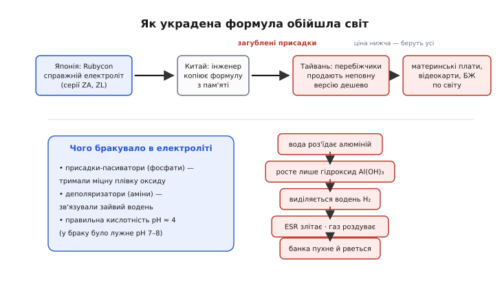

# 📜 Чума конденсаторів: як одна вкрадена формула повбивала мільйони комп'ютерів

Уявіть епідемію, що косить не людей, а машини. Комп'ютер працює тиждень, місяць, півроку — а тоді одного ранку не вмикається. Або вмикається, та зависає на логотипі. Або моргає індикатором живлення й мовчить. Майстер відкриває корпус, дивиться на материнську плату — і бачить характерну картину: кілька маленьких алюмінієвих «банок» біля процесора **роздуті горбом** угору, у деяких зверху проступила буро-руда кірка засохлого електроліту, наче з них щось википіло. Це не одна плата. Це сотні тисяч плат, по всьому світу, від десятків відомих марок — і всі вмирають однаково, від тих самих кількох конденсаторів.

Цю історію в англомовному світі назвали **capacitor plague** — «чума конденсаторів». Тривала вона приблизно з **1999 по 2007 рік** (бракові конденсатори робили десь з 1999-го по 2003-й, а масово вмирали вони у **2002–2005** роках). І хоча кінець у неї суто технічний — електроліт, що з'їдав власну банку зсередини, — зав'язка її радше детективна: вкрадена промислова таємниця, недокопійована формула, ланцюжок виробників, що гналися за дешевизною, і одна загублена дрібниця в хімії, яка обернулася сотнями мільйонів збитків. Розплутаймо її по нитці — бо в цій нитці видно все, що робить ESR такою живою інженерною величиною, а не рядком у даташиті.

> 🔧 **Навіщо це.** Чума конденсаторів — це найбільший в історії електроніки натурний експеримент на тему «що буває, коли ESR живого конденсатора повзе вгору». Мільйони однакових плат стали стендом, на якому фізика втрат показала себе у промисловому масштабі. Хто розуміє цю історію, той розуміє, чому інженер дивиться на конденсатор не лише за ємністю й чому слово «low-ESR» на корпусі — не маркетинг, а діагноз придатності.

## Чому саме алюмінієвий електроліт виявився вразливим

Щоб зрозуміти, що пішло не так, треба згадати, на чому взагалі тримається алюмінієвий електролітичний конденсатор. У ньому величезну ємність у малому об'ємі дає не що інше, як **надтонка плівка оксиду алюмінію** (Al₂O₃) на поверхні згорнутої в рулон фольги — лічені нанометри завтовшки. Тонкий діелектрик при великій площі згорнутої фольги — звідси й сотні мікрофарад у банці розміром із наперсток. А щоб ця плівка щільно прилягала до другої обкладки, всі закутки рулону заповнюють провідною рідиною — **електролітом**. Електроліт і є тут другою (рідкою) обкладкою; він-таки доносить струм до кожної ділянки фольги.

І ось тонкощі, які стануть осердям усієї трагедії. По-перше, та оксидна плівка — **жива**: вона не висічена раз і назавжди, а підтримується самим електролітом. Доки в електроліті є потрібні присадки, плівка лишається міцною й суцільною; варто хімії зіпсуватися — і плівка перестає лікувати власні дрібні пробої. По-друге, електроліт майже завжди має в собі **воду** — вона потрібна, бо саме вода постачає кисень для відновлення оксиду в місцях ушкодження. Вода — друг плівки, поки її приборкано присадками, і її ж смертельний ворог, щойно приборкання зникає.

Тепер з'єднаймо це з ESR — головним героєм усієї книги. [Опір втрат конденсатора](book:electronics/esr-capacitor) ESR складається насамперед з опору самого електроліту: струм мусить пройти крізь шар рідини до фольги, а рідина проводить незрівнянно гірше за метал. Тому **стан електроліту прямо керує ESR**. Свіжий, повний електроліт — низький ESR; електроліт, що висох, погустішав чи хімічно зіпсувався, — ESR підскакує. Конденсатор, у якому хімія електроліту пішла врознос, неминуче набуває високого ESR; а високий ESR під пульсівним струмом гріє сам себе ще дужче — петля, яку в статті про ESR названо саморуйнуванням. Чума конденсаторів — це і є та петля, запущена в мільйонах банок одночасно однією й тією самою хімічною помилкою.

## Детектив: украдена й недокопійована формула

А тепер сама зав'язка — і вона звучить як сюжет промислового шпигунства, бо ним і була. Це усталена, задокументована версія подій (її переказали газета *The Independent* 31 травня 2003 року в матеріалі Чарльза Артура (Charles Arthur), журнал *IEEE Spectrum* у лютому 2003-го (стаття Семюела Мура (Samuel K. Moore) та Ю-Цзу Чіу (Yu-Tzu Chiu)) і профільний *Passive Component Industry*; деякі деталі ланцюга в переказах різняться, але кістяк сходиться скрізь).

Рецепт доброго електроліту для алюмінієвого конденсатора — це не просто «солона вода». Це ретельно підібрана суміш: розчинник, провідна сіль і, найголовніше, **набір тонких присадок**, що тримають оксидну плівку в порядку й приборкують воду. Саме ці присадки — найцінніша, найсекретніша частина рецепта, відточена роками. У японської фірми **Rubycon** (один із провідних світових виробників) такий вивірений водний електроліт стояв за її добрими серіями конденсаторів — зокрема серіями **ZA та ZL**.

Далі, за усталеною оповіддю, сталося ось що. **Інженер-матеріалознавець, що працював у Rubycon, пішов із фірми й забрав із собою рецепт цього водного електроліту** — точніше, **недокопійований**, неповний його варіант. Він влаштувався в китайську компанію (її називають Luminous Town Electric) і там відтворив електроліт з пам'яті чи з неповних записів. А потім ланцюг розплівся ще на крок: **кілька працівників, що пішли вже з тієї китайської компанії, скопіювали вже й цю — неповну — версію формули й заходилися продавати її тайванським виробникам алюмінієвих електролітів**, збиваючи ціну японцям.

І ось у чому весь фокус трагедії: **переписана наспіх формула загубила саме ті присадки, що тримали хімію в шорах**. Те, що тайванські заводи купували й заливали у свої конденсатори, було електролітом-самозванцем: він проводив струм, він на вигляд робив свою справу, він коштував дешевше — і його охоче брали. Але без ключових присадок він був **нестабільний у запаяній банці**: вода в ньому лишалася не приборканою, а оксидна плівка — без захисту. Бомба сповільненої дії, що тихо цокала в кожному такому конденсаторі.


*Шлях помилки. Зверху — як формула мандрувала: повний рецепт Rubycon (серії ZA, ZL) → неповна копія в Китаї → дешевий продаж на Тайвань → бракові конденсатори в техніці по всьому світу. Ліворуч унизу — що саме випало з рецепта: присадки-пасиватори, деполяризатори водню й правильна кислотність. Праворуч — ланцюг наслідків: вода роз'їдає алюміній, росте гідроксид, виділяється водень, ESR злітає, банка пухне й рветься.*

> 🔧 **Навіщо це.** Зверніть увагу на головну причину: схибило не «китайське» чи «тайванське» виробництво як таке — японські, тайванські й китайські заводи однаково вміють робити чудові конденсатори, і чимало бездоганних електролітів тих років теж тайванські. Схибив **конкретний украдений і недокопійований рецепт**, що розійшовся ланцюгом дешевих перепродажів без розуміння, навіщо там кожна присадка. Урок не про географію, а про те, що в електроліті немає «зайвих» інгредієнтів: кожна присадка чимось тримає хімію, і випадання навіть однієї валить усе.

## Хімія смерті: чому зникли присадки — і банка почала газувати

Тепер найцікавіше — що саме коїлося всередині бракового конденсатора. І тут історія перестає бути детективом і стає чистою електрохімією, яку згодом розклали по поличках двоє дослідників із Університету Меріленду — **Брайан Гіллман (Brian Hillman) і Лео Гелмолд (Leo Helmold)** з центру CALCE. Вони взяли мертві конденсатори, проаналізували вміст іонною хроматографією та мас-спектрометрією — і знайшли всередині **водень**. Газ, якого там бути не мало.

Розберімо ланцюжок повільно, бо він прекрасний у своїй невблаганності.

Серце справного електроліту — **рівновага**. Алюміній — метал украй активний; він радо реагує з водою. Якби не захист, фольга в електроліті просто роз'їдалася б. Захищає її та сама оксидна плівка Al₂O₃ — щільна, міцна, нерозчинна в слабокислому середовищі. Тому добрий електроліт роблять **слабокислим**, з кислотністю десь pH ≈ 4: у такому середовищі алюміній під оксидом у безпеці, а присадки-**пасиватори** (зокрема сполуки фосфору) ще й активно латають плівку, щойно десь з'явиться мікропробій. Рівновага тримається роками.

А тепер заберімо присадки — як це й сталося в недокопійованій формулі. Стається ось що, крок за кроком:

```
1. Без пасиваторів кислотність електроліту повзе в ЛУЖНИЙ бік (pH 7…8).
2. У лужному середовищі оксид Al₂O₃ перестає бути неприступним:
   алюміній під ним стає доступний воді.
3. Вода добирається до голого металу й реагує з ним:
       2 Al + 6 H₂O  →  2 Al(OH)₃ + 3 H₂↑
   (замість міцного оксиду росте пухкий гідроксид — і виділяється ВОДЕНЬ)
4. Без деполяризаторів (амінів) цей водень нема чим зв'язати —
   він лишається газом і накопичується в банці.
```

Кожна ланка цього ланцюга важить, і кожна випливає з утрати своєї присадки.

Перша біда — **кислотність**. Загублені присадки-пасиватори не тримали середовище слабокислим, і воно дрейфувало в лужне. А в лужному середовищі (це усталений факт хімії алюмінію) захисний оксид перестає захищати: луг роз'їдає алюмінієвий оксид там, де слабка кислота його не чіпала. Плівка тоншає, з'являються пробої — і вода дістається до голого металу.

Друга біда — **який саме продукт росте**. Коли все гаразд, у місцях ушкодження плівки знову нарощується щільний оксид Al₂O₃ — і ремонт завершено. Але в зіпсованому електроліті не вистачало умов для перетворення на стабільний оксид, тож натомість безперешкодно ріс **гідроксид алюмінію Al(OH)₃** — пухка, гелеподібна речовина, що не лікує плівку, а лише наростає й наростає. Дослідники Гіллман і Гелмолд саме й показали цей **безперешкодний ріст гідроксиду** як осердя відмови.

Третя біда — і найвидовищніша — **водень**. Реакція алюмінію з водою виділяє газоподібний водень H₂. У справному конденсаторі його було б обмаль, та ще й спеціальні присадки-**деполяризатори** (ароматичні азотисті сполуки, аміни) хімічно зв'язували б цей водень, не даючи йому накопичитися. У недокопійованому електроліті деполяризаторів теж бракувало — і водень почав **збиратися газом усередині запаяної банки**.

> 🔧 **Навіщо це.** Бачите, як акуратно покладено всю провину на дрібні присадки? Пасиватори тримали кислотність — без них середолужніло й оксид роз'ївся. Перетворювачі давали стабільний оксид — без них ріс пухкий гідроксид. Деполяризатори зв'язували водень — без них він став газом. Це найчесніша ілюстрація того, що в добре спроєктованій хімії немає «декоративних» компонентів. Інженер, що бачить у даташиті слова про «спеціальний електроліт low-ESR», тепер розуміє: за ними стоїть саме така вивірена рівновага, у якій кожна присадка щось рятує.

Тепер з'єднаймо два наслідки — і побачимо, чому конденсатор і **роздувався**, і **втрачав ємність**, і **набирав ESR** одночасно.

**Газ роздуває й рве банку.** Водень накопичується, тиск у герметичній банці росте. До якогось моменту корпус терпить, тоді його верх вигинається горбом — звідси й та сама впізнавана «здута банка». Алюмінієві електроліти роблять з **запобіжним надрізом** угорі корпусу — спеціально проштампованою канавкою (часто хрестиком або «K»-подібним візерунком), що задумана так, щоб за надмірного тиску **луснути по надрізу й випустити газ**, а не дати банці вибухнути осколками. У чумних конденсаторах ці надрізи й розкривалися, випускаючи водень разом із бризками електроліту — той і лишав буру кірку на платі довкола.

**Гідроксид і висихання піднімають ESR.** Поки газ роздуває корпус, сам електроліт деградує: вода витрачається на реакцію, через нещільності й луснулий надріз волога виходить, рідина густішає й висихає. А [ESR](book:electronics/esr-capacitor), як ми пам'ятаємо, тримається насамперед на провідності електроліту — тож **висихання прямо й круто піднімає ESR**. Конденсатор, що мав десятки міліом, набирає вже соті ома й більше. І тут вмикається та сама петля саморуйнування: вищий ESR під пульсівним струмом виділяє більше тепла, тепло жене реакцію та висихання швидше, ESR росте ще, тепла ще більше. У живленні комп'ютера, де крізь ці конденсатори тече серйозна пульсація, петля розкручувалася особливо швидко.

Підсумок для конденсатора виходив подвійно смертельний: він і **переставав фільтрувати** (бо ESR підскочив і ємність упала), і **фізично руйнувався** (бо газ рвав корпус). А для материнської плати це означало нестабільне живлення процесора: спершу рідкісні зависання, далі — повна відмова.

## Як це вилізло назовні: вересень 2002-го й «банки» на форумах

Найпідступніше в цій епідемії було те, що вона **визрівала в тиші**. Конденсатор не вмирав одразу — він тихо газував і висихав місяцями. Тому перші згорілі плати виглядали як випадковий брак, і ніхто довго не складав їх в одну картину.

Першим публічно зв'язав відмови з **дефектною сировиною** профільний галузевий журнал — **Passive Component Industry — у вересні 2002 року**. Це усталена точка відліку: саме там уперше написали, що бракові конденсатори тягнуться до проблемного тайванського матеріалу. А вже у випуску за листопад–грудень 2002-го той самий журнал додав гострого: великі тайванські виробники електролітів **відмагалися від відповідальності** за дефектну продукцію.

Майже водночас історія прорвалася в широкий світ — і прорвалася знизу, від практиків. **Карі Голзман (Carey Holzman)**, складальник і ремонтник комп'ютерів, побачив ту саму картину «здутих банок» у машинах різних виробників, що проходили через його руки, і — за його словами, уперше за дванадцять років ремонту — стикнувся з чимось подібним за масштабом. Він описав свій досвід із «протікаючими конденсаторами» в спільноті оверклокерів, і саме звідти тема пішла в люди. У лютому 2003-го гучну статтю дав **IEEE Spectrum** — «Leaking Capacitors Muck up Motherboards» («Протікаючі конденсатори псують материнські плати»), де вже й виклали версію з украденою формулою.

Цікава деталь про чесність виробників. Серед виробників материнських плат **відкрито визнати проблему зголосилася тоді переважно одна — ABIT**; вона ж заявила, що переходить на конденсатори з Японії замість тайванських. Решта здебільшого відмовчувалася — і саме ця стіна мовчання живила народне розслідування на форумах, де ентузіасти роками складали списки «поганих» партій, фотографували здуті банки й училися перепаювати їх самотужки.

> 🔧 **Навіщо це.** Зверніть увагу, **звідки** прийшло розуміння: не згори, від виробників, а знизу — від ремонтників і ентузіастів, які бачили мертві плати щодня й першими помітили, що банки здуваються однаково. Це типове для електроніки: масову системну ваду часто першими ловлять не лабораторії, а практики з паяльником. Для інженера тут урок діагностики — здута «банка» з рудою кіркою згори є **візуальним симптомом високого ESR і газування**, який видно неозброєним оком ще до будь-яких вимірів.

## Масштаб: 420 мільйонів доларів і ціла епоха недовіри

Тепер про те, чому ця історія перестала бути курйозом для радіоаматорів і стала уроком для цілої індустрії, — про **гроші й репутації**. Бракові конденсатори осіли в техніці десятків відомих марок: серед уражених називають **Dell, Apple, HP, IBM, Intel** та інших — бо всі вони купували плати й блоки живлення в тих самих складальників, а ті ставили дешеві конденсатори з тим самим хибним електролітом.

Найвиразніша цифра, що стала символом масштабу, — це **Dell**. За даними, які наводить і Wikipedia, у **2005 році Dell витратила близько 420 мільйонів доларів США** на те, щоб **замінювати материнські плати** в уражених машинах і на саму логістику з'ясування, котрий комп'ютер уже потребує заміни, а котрий ще ні. Чотириста двадцять мільйонів — за конденсатори ціною в копійки. Пізніше навколо цього розгорнулися й судові тяжби: внутрішнє листування, що випливло на суді, показало, що компанія знала про масштаб біди й намагалася її применшувати в розмовах із клієнтами. Скандал боляче вдарив по репутації — гучний приклад того, як кілька грамів неправильної хімії здатні похитнути довіру до величезного бренду.

> 🔧 **Навіщо це.** Тримайте це число в голові як найдорожчий в історії урок про ESR: **420 мільйонів доларів — ціна економії на кількох присадках в електроліті.** Коли інженер вагається, чи варто ставити в живлення трохи дорожчий конденсатор із гарантованим низьким ESR та чесним даташитом замість дешевої «банки» без імені, — оце і є відповідь у грошах. Конденсатор, що коштує на копійку менше, але вмирає за рік, обходиться згодом у тисячі разів дорожче за різницю в ціні.

## Що чума навчила індустрію

Епідемія згасла приблизно до 2007-го — бракові партії доробили свій вік і повмирали, ланцюг краденої формули перервали, а виробники навчилися пильніше стежити за хімією електроліту. Але як **урок** вона лишилася назавжди, і слідів по собі лишила кілька.

Перший слід — **повага до ESR як до живої, мінливої величини**. До чуми ESR для багатьох був абстракцією з даташита; чума показала, що ESR конденсатора **росте з часом і з деградацією електроліту**, і що саме це зростання, а не якась раптова пробивка, найчастіше й убиває конденсатор у живленні. Відтоді в серйозних виробах закладають запас по ESR і нерідко перевіряють його в обслуговуванні — бо «банка», що набрала ESR, ще стоїть на платі ціла, а живлення вже дзвенить.

Другий слід — **діагностичний рефлекс**. Ціле покоління майстрів навчилося першим ділом оглядати конденсатори: здутий верх, руда кірка, тріснутий запобіжний надріз — і діагноз майже певний ще до приладів. «Перепаяти банки» стало стандартною першою дією при ремонті старих плат, блоків живлення, моніторів. Це прямий спадок чуми: вона зробила візуальний симптом високого ESR упізнаваним для всіх.

Третій слід — **поштовх до твердих електролітів**. Чума підштовхнула індустрію туди, де рідкого електроліту з його водою й присадками немає взагалі, — до **полімерних конденсаторів із твердим провідним полімером** замість рідини. У такого електроліту нема чому випаровуватися й нема воді роз'їдати алюміній, тому полімерні конденсатори мають дуже низький і стабільний ESR і не газують. Не випадково саме в роки після чуми написи «solid capacitors» / «полімерні» на материнських платах стали козирем у рекламі надійності. (Це не означає, що рідкі електроліти померли — вони чудово служать там, де хімія чесна; але чума прискорила прихід твердих туди, де ESR і надійність критичні.)

Уся ця історія вкладається в одну думку. Алюмінієвий конденсатор живе доти, доки живий його електроліт; ESR — це пульс цього життя, що повзе вгору, тільки-но хімія всередині починає псуватися. Чума конденсаторів була не загадковою пошестю, а ланцюжком цілком зрозумілих причин: украдена й недокопійована формула загубила присадки → середовище злужніло → вода роз'їла алюміній → виріс гідроксид і виділився водень → газ роздув банку, а висихання підняло ESR → конденсатор перестав фільтрувати й фізично луснув. Мільйони комп'ютерів стали мимовільним доказом того, про що говорить уся ця книга: у живленні **вирішує не ємність, а ESR** — і той, хто це затямив, дивиться на скромну алюмінієву банку зовсім іншими очима.

---

*Джерела (звірка фактів):* перебіг подій, украдена формула Rubycon (серії ZA/ZL), ланцюг через китайську Luminous Town Electric до тайванських виробників, хімія (лужний pH, ріст Al(OH)₃, виділення H₂, брак пасиваторів і деполяризаторів), дослідження Гіллмана й Гелмолда (Університет Меріленду, CALCE), дати (бракові вироби 1999–2003, відмови 2002–2005), перша публікація Passive Component Industry (вересень 2002), збитки Dell ~$420 млн (2005) — [Capacitor plague, Wikipedia](https://en.wikipedia.org/wiki/Capacitor_plague); журналістський виклад і роль ABIT та Карі Голзмана — [«Leaking Capacitors Muck up Motherboards», IEEE Spectrum, лютий 2003 (Samuel K. Moore, Yu-Tzu Chiu)](https://spectrum.ieee.org/leaking-capacitors-muck-up-motherboards); першоджерело про крадіжку формули — *The Independent*, 31 травня 2003 (Charles Arthur). Статус: **усталено** (механізм і ланцюг подій підтверджені кількома незалежними джерелами; окремі деталі ланцюга перепродажу в переказах різняться, кістяк збігається).*
