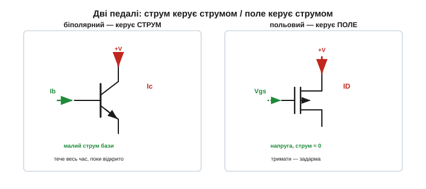
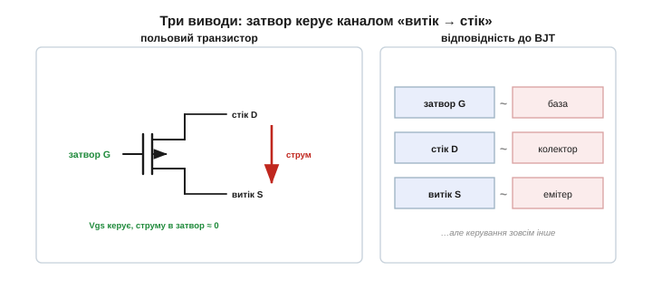

# Інша ідея: керувати струмом полем, а не струмом

### Дві філософії керування

У [біполярного транзистора](topic:electronics/bjt-operation) крізь базу тече невеликий струм Ib, і він «відмикає» у багато разів більший струм колектора, Ic = β·Ib. Керування — **струмом**: щоб транзистор пропускав струм, у його базу мусить **постійно** надходити свій, менший струм. Прибрав струм бази — закрився. Це **струмокерований** прилад.

Польовий транзистор питає інакше: а що, як керувати струмом **не другим струмом, а полем**? Уявімо брусок напівпровідника, крізь який може текти струм, і поруч — електрод, на який ми подаємо **напругу**. Заряд на електроді створює **електричне поле**; це поле проникає в напівпровідник і змінює, скільки в ньому вільних носіїв, а отже — наскільки добре він проводить. Більше поле — ширший провідний шлях, більший струм; прибрали поле — шлях зник. Керування — **напругою**, і головне: щоб **тримати** поле, струму майже не треба, бо поле тримає нерухомий заряд задарма. Це **напругокерований** прилад.

Ідея ця, до речі, не нова: саме її 1925 року запатентував Юліус Лілієнфельд ([📜 історія цього винаходу](topic:electronics/field-control/hist-mosfet.md)). Але збудувати робочий прилад змогли аж за тридцять років — коли навчилися вгамовувати поверхню напівпровідника шаром скла. Принцип же лишився той самий: керувати провідністю напругою через поле.

Сама назва каже про це: **польовий** — бо керує **поле**; ефект впливу поля на провідність так і звуть **польовим ефектом** *(field effect)*.


*Зліва — біполярний: щоб текли Ic, у базу весь час іде Ib. Справа — польовий: канал відмикає поле від напруги на затворі, а струму в керування майже не треба. Та сама мета — керувати великим струмом, — але різні «педалі».*

> 🔧 **Навіщо це.** Чому це не дрібна різниця, а ціла революція? Бо «керувати майже задарма» означає, що **мільярд** таких ключів можна тримати ввімкненими, не платячи за це струмом. Саме тому з польових транзисторів зробили цифрову техніку: процесор має мільярди ключів, і якби кожен, як біполярний, безперервно тягнув струм керування, чип би просто розплавився. Поле замість струму — ось чому MOSFET зміг те, чого не зміг біполярний.

Польових транзисторів є **два роди**. У **JFET** *(junction FET)* затвор відділено від каналу зворотно зміщеним [p-n переходом](topic:electronics/diode-bias); у **MOSFET** *(metal-oxide-semiconductor FET)* — тонким шаром ізолятора, скла. Обидва керуються полем, але саме MOSFET, з його повністю **ізольованим** затвором, став основою всієї цифрової техніки. Сама абревіатура MOSFET описує його [пошарову будову](topic:electronics/mosfet-structure) (метал–оксид–напівпровідник).

### Клапан, який тримає магніт

Тут стане у пригоді водяна аналогія. [Біполярний транзистор](topic:electronics/transistor-idea) — це кран, що його треба **тримати рукою**: відпустив — зачинився; а тримати — означає весь час докладати зусилля (струм). Польовий транзистор — це кран, заслінку якого тримає **електромагніт**. Подав напругу — магнітне поле підняло заслінку, і вода (струм) тече. І ось ключове: **щоб тримати заслінку піднятою, магнітові не треба нічого «лити»** — він тримає її одним лише полем, скільки завгодно довго, майже не споживаючи енергії. Прибрав напругу — поле зникло, заслінка впала, потік спинився.

Ця аналогія схоплює суть: керування **присутністю поля**, а не **потоком** чогось. Поставити поле — коштує лиш мить, а тримати його — задарма. Саме ця властивість, «постав і забудь», і відрізняє польове керування від біполярного, де руку з крана не можна прибрати ні на секунду, поки потрібен потік.


*Біполярний — кран, що його тримають рукою: відпустив — зачинився, тримати = докладати струм. Польовий — кран із «магнітною» заслінкою: поле тримає її задарма. Поставити поле — мить; тримати — нічого не коштує.*

### Три виводи: затвор, стік, витік

У польового транзистора, як і в біполярного, **три виводи** — але звуться інакше й роблять інше:

- **Затвор** *(gate, G)* — керівний електрод, та сама «заряджена пластина». Це аналог бази, але керує **полем**.
- **Стік** *(drain, D)* — вивід, **куди** стікає робочий струм. Грубо — аналог колектора.
- **Витік** *(source, S)* — вивід, **звідки** робочий струм виходить (його ще звуть **джерелом**, бо звідти «беруться» носії). Грубо — аналог емітера.

Робочий струм тече шляхом **витік → стік** (його так і звуть — **канал**), а **затвор збоку керує** тим, відкритий цей шлях чи ні. Запам'ятати легко: струм тече між стоком і витоком, а затвор — це «брама» *(gate і є «брама»)*, що цей потік відмикає або замикає, сама лишаючись осторонь.


*Канал «витік → стік» несе робочий струм; затвор збоку керує ним полем. Поряд — відповідність до біполярного: затвор ~ база, стік ~ колектор, витік ~ емітер, — але керування зовсім інше.*

Ще одна важлива деталь: керівна величина — це не просто «напруга на затворі», а напруга **затвор–витік**, яку позначають **Vgs**: наскільки затвор додатніший (чи від'ємніший) за витік. Витік тому й «джерело» — він точка відліку, від якої транзистор міряє керівне поле. Саме Vgs визначає [поріг](topic:electronics/mosfet-threshold) відмикання — напругу, з якої канал починає проводити.

### Затвор — це обкладка конденсатора

Звідки ж береться поле й чому затвор не споживає струму? Бо **затвор разом із каналом утворюють [конденсатор](topic:electronics/capacitor)**. Затвор — одна обкладка; напівпровідниковий канал — друга; а між ними тонкий **ізолятор** (в MOSFET — [шар скла](topic:electronics/mosfet-structure)). Подаючи на затвор напругу, ми **заряджаємо** цей конденсатор: на обкладці накопичується заряд, його поле «дивиться» крізь ізолятор у канал і притягує туди носії, відмикаючи провідність.

Інтуїтивно це так: додатний заряд на затворі **притягує** до поверхні каналу негативні носії (електрони), і там, де їх збереться досить, простягається провідна доріжка від витоку до стоку. Більший заряд на затворі — густіша доріжка — менший опір, більший струм. Прибрав напругу — носії розійшлися, доріжка зникла. Те, як саме виникає ця доріжка й чому лише починаючи з певного [порогу](topic:electronics/mosfet-threshold), — окрема тема; поки що досить образу «поле згущує носії в канал».

Тут діє головна властивість [конденсатора](topic:electronics/rc-time-constant): **заряджений конденсатор у спокої струму не пропускає**. Струм тече лише ту коротку мить, поки конденсатор **заряджається**; коли зарядився — настав спокій, і струм припиняється, хоч напруга й поле лишаються. Так само й затвор: щоб **поставити** напругу, на мить тече зарядний струм, а далі, поки тримаємо ту саму напругу, у затвор **струму не тече зовсім** — поле «висить» само, як заряд на конденсаторі.


*Затвор, ізолятор і канал — це конденсатор. Напруга заряджає його, поле відмикає канал. А заряджений конденсатор у спокої струму не тягне — тому затвор у статиці нічого не споживає.*

> 🔧 **Навіщо це.** Ця картинка — «затвор є конденсатор» — пояснює відразу **дві** речі. По-перше, чому в спокої струму нема (заряджений конденсатор не пропускає). По-друге, чому перемикання все ж потребує **миттєвого** струму — щоб **перезарядити** цю ємність, як і будь-який конденсатор. Тримати — задарма; а от **швидко перемикати** — це раз у раз заряджати-розряджати затвор, і саме ця [ємність затвора](topic:electronics/gate-capacitance) обмежує швидкість.

### Головна різниця: у затвор струм не тече

Зведімо контраст у числа — і він вражає. Хай нам треба ключем пропускати **1 А**.

```
Біполярний (β = 100):  Ib = Ic / β = 1 А / 100 = 10 мА — і ці 10 мА
                       треба лити в базу ВЕСЬ ЧАС, поки ключ відкритий.

Польовий:              струм затвора ≈ 0  (одиниці наноампер витоку)
                       — подав напругу й тримай задарма.
```

Десять міліампер проти майже нуля. Помножте на час — біполярний весь цей час марнує струм на саме лиш керування, польовий — ні. А тепер уявіть **мільярд** ключів у процесорі: для біполярних це були б десятки тисяч ампер тільки на керування — абсурд; для польових — крапля.

Є ще один бік тієї самої медалі — **вхідний опір**. У біполярного база — це прямо зміщений перехід, її опір невеликий (сотні ом — кілоом), тож вона **навантажує** те, що нею керує. Затвор польового — це ізольована обкладка конденсатора, його опір по постійному струму **колосальний** (трильйони ом, практично розрив). Тому польовий транзистор майже **не вантажить** джерело сигналу — він «слухає» напругу, нічого з неї не відбираючи. Це безцінно, коли керувати треба від кволого давача чи попереднього каскаду.

Порахуймо марну витрату на саме лиш утримання стану. Біполярний ключ на 1 А тримає в базі 10 мА при ~0.7 В — це **7 мВт**, що течуть **увесь час**, поки ключ відкритий, і йдуть просто в тепло. Польовий у тому самому стані — майже 0 мВт. Один ключ — дрібниця; але в пристрої їх бувають сотні, а в чипі — мільярди, і ця «дрібниця», помножена, вирішує, працює прилад від батарейки тиждень чи годину.


*Той самий ключ на 1 А: біполярному в базу треба лити 10 мА весь час, польовому в затвор — майже нічого. Звідси й величезний вхідний опір польового: він керується напругою, не відбираючи струму.*

### Чому це змінює все

Складімо переваги докупи — і стане ясно, чому польовий транзистор захопив світ:

- **Майже нульова потужність керування.** Тримати стан — задарма. Для батарейних і цифрових пристроїв вирішально.
- **Величезний вхідний опір.** Не вантажить джерело сигналу; легко керується від чого завгодно слабкого.
- **Масштабованість.** Раз керування нічого не споживає в спокої, на одному кристалі можна стиснути **мільярди** ключів, і вони не розплавлять чип. Звідси вся цифрова мікроелектроніка.
- **Простота керування потужністю.** Силовим польовим ключем керує просто напруга — не треба рахувати струм бази й резистор до неї, як [у біполярного](root:embedded/bjt-load-driving).

Ось чому майже все цифрове навколо вас працює на польових транзисторах: процесор і пам'ять телефона, флешки, відеокарти, мікроконтролери. Біполярний лишився у своїх нішах — аналогові тонкощі, дрібні ключі, підсилювачі, — а весь цифровий світ дістався польовому. І все це виросло з однієї-єдиної риси: керувати струмом **полем**, майже не витрачаючи струму на саме керування.


*Три наслідки «керування полем»: майже нульова потужність керування, величезний вхідний опір і змога стиснути мільярди ключів на чипі. Останнє й дало цифрову епоху ([КМОН-логіка](book:electronics/cmos)).*

Усе це — наслідок єдиної ідеї: **керувати струмом полем, а не струмом**. За цим принципом стоять глибші питання: як саме поле відмикає канал, з чого зроблено [затвор, ізолятор і канал](topic:electronics/mosfet-structure), чому є [«поріг»](topic:electronics/mosfet-threshold), нижче якого транзистор закритий, і чим [N-канальний відрізняється від P-канального](topic:electronics/nmos-pmos). Варто запам'ятати важливу рису: більшість силових MOSFET — «**нормально закриті**»: без напруги на затворі каналу немає, як і в біполярного ключа, і щоб його відкрити, потрібно перевищити певну напругу-[поріг](topic:electronics/mosfet-threshold).

> 🔧 **Навіщо це.** Не сплутайте дві речі: «у затвор не тече струм» стосується **постійного** режиму (тримати стан). Це не означає, що польовий транзистор «безкоштовний» геть в усьому — під час кожного **перемикання** доводиться перезаряджати [ємність затвора](topic:electronics/gate-capacitance), і на високих частотах це вже відчутна потужність. Але для логіки, що більшість часу стоїть у сталому стані, виграш величезний.
