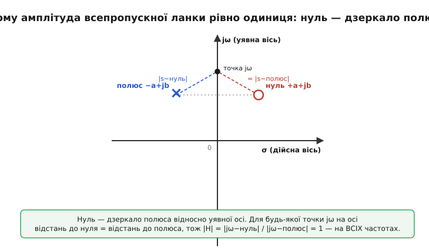
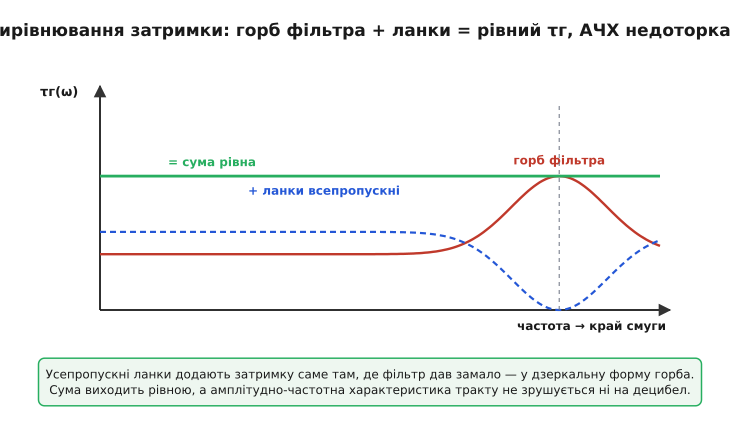

# 🧮 Математика фазової затримки й усепропускних ланок

Виникає природне бажання: маю крутий фільтр, він гарно ріже сусідній канал, але його груповий час горбатий під краєм смуги — і псує форму сигналу. Хочу **доправити лише фазу**, додавши затримку там, де її бракує, і **ні на децибел** не зрушити амплітуду. Спершу здається, що це неможливо: адже фаза й амплітуда кола пов'язані, не можна крутити одну, не зачепивши іншу. Виявляється, можна — але лише для одного особливого класу кіл. І те, чому саме для нього, ховається в дуже простій геометрії на комплексній площині: де стоять **нулі** й **полюси** передавальної функції.

Розберімо це від самого низу. Спершу — що таке амплітуда й фаза кола мовою його нулів і полюсів. Тоді — яке розташування цих нулів і полюсів дає рівно одиничну амплітуду на **всіх** частотах. Звідти випливе сама усепропускна ланка, її фаза й керований груповий час. А наприкінці складемо кілька таких ланок і побачимо, як їхньою сумою «підсипати» горбатий груповий час крутого фільтра до рівного.

## Амплітуда й фаза — це відстані й кути до нулів та полюсів

Будь-яке лінійне коло (фільтр, ланка) описують його **передавальною функцією** H(s) — відношенням виходу до входу як функцією комплексної частоти s. Тут s = σ + jω: уявна вісь jω — це звичайні усталені синуси частоти ω (саме на ній живе все, що ми чуємо й міряємо), а дійсна частина σ описує згасання чи наростання. Для усталеного відгуку на синус частоти ω підставляють s = jω — і H(jω) дає комплексне число, чий **модуль** — це коефіцієнт передачі за амплітудою на цій частоті, а **аргумент** (кут) — фазовий зсув φ(ω).

Передавальну функцію будь-якого зосередженого кола можна записати як відношення двох многочленів від s, а многочлен — розкласти на корені. Корені чисельника — це **нулі** (англ. *zero*, z₁, z₂, …): частоти, на яких H = 0, коло «глушить» сигнал. Корені знаменника — **полюси** (англ. *pole*, p₁, p₂, …): там H прямує в нескінченність, коло «дзвенить». Уся передавальна функція з точністю до сталого множника K — це

```
            (s − z₁)(s − z₂)…(s − zₘ)
H(s) = K · ──────────────────────────────
            (s − p₁)(s − p₂)…(s − pₙ)
```

Тепер ключовий крок, що робить усю геометрію наочною. Кожен множник (s − zₖ) — це **вектор** на комплексній площині: від точки нуля zₖ до точки s. Його довжина |s − zₖ| — відстань від нуля до s; його кут arg(s − zₖ) — напрям цього вектора. Те саме для полюсів. А модуль і аргумент **добутку** комплексних чисел — це добуток модулів і **сума** аргументів. Тож, підставивши s = jω (точка на уявній осі — на висоті ω), маємо два дуже фізичні правила:

```
|H(jω)| = |K| · (добуток відстаней від jω до всіх нулів) / (добуток відстаней від jω до всіх полюсів)

φ(ω)   = (сума кутів від нулів до jω) − (сума кутів від полюсів до jω)
```

Це не формальність — це **готовий рецепт**, як читати поведінку кола з картинки. Поставте олівець у точку jω на уявній осі й проведіть стрілки від кожного нуля й кожного полюса до цього олівця. Амплітуда — добуток довжин «нульових» стрілок, поділений на добуток довжин «полюсних». Фаза — сума кутів нульових стрілок мінус сума кутів полюсних. Рухайте олівець уздовж осі (міняйте ω) — стрілки повертаються й видовжуються, і ви бачите, як міняються амплітуда й фаза. Коли олівець підходить близько до полюса — полюсна стрілка коротшає, амплітуда злітає (резонанс). Коли близько до нуля — нульова стрілка коротшає, амплітуда провалюється. Уся теорія фільтрів — це танець цих відстаней.

> 🔧 **Навіщо це.** Цей погляд — не математична краса задля краси, а робочий інструмент проєктувальника. Коли ви рухаєте полюс ближче до уявної осі в симуляторі, ви наперед знаєте, що резонансний горб амплітуди підросте й загостриться (полюсна стрілка стане короткою на цій частоті). Коли ставите нуль прямо на вісь — отримуєте режекторну «яму» рівно на тій частоті (нульова стрілка там нульова). Розташування нулів і полюсів — це і є «ручки», якими крутять фільтр; усе інше — наслідок їхньої геометрії. І саме ця геометрія зараз пояснить, чому існує коло з рівною амплітудою.

## Дзеркальна пара: нуль навпроти полюса дає рівно одиницю

Тепер поставмо точне питання: яке розташування нулів і полюсів дасть амплітуду, що дорівнює **тій самій сталій** на всіх частотах ω? Бо саме така ланка нам потрібна — вона нічого не ріже за амплітудою, а працює лише фазою.

Візьмемо найпростіший випадок: один полюс і один нуль. Амплітуда — це відношення двох відстаней від рухомої точки jω: до нуля й до полюса.

```
            |jω − z|
|H(jω)| = ───────────
            |jω − p|
```

Щоб це відношення було сталим (скажімо, одиницею) **за будь-якого** ω, потрібно, щоб для кожної точки jω на уявній осі відстань до нуля **дорівнювала** відстані до полюса. Спитаймо геометрично: де має лежати нуль відносно полюса, щоб уся уявна вісь була **рівновіддалена** від обох? Множина точок, рівновіддалених від двох заданих, — це їхня **серединна перпендикулярна** (перпендикуляр через середину відрізка між ними). Нам треба, щоб цією серединною перпендикулярною була сама **уявна вісь**. А це означає одне: нуль — **дзеркальне відображення** полюса відносно уявної осі.

Якщо полюс стоїть у точці p = −a + jb (зліва від осі, де й мусять жити полюси стійкого кола — про це за мить), то нуль має стояти в **дзеркальній** точці z = +a + jb (стільки ж праворуч, на тій самій висоті). Тоді для будь-якого ω трикутник «нуль — точка jω — полюс» симетричний відносно осі, дві його сторони рівні, і відношення довжин — рівно одиниця.


*Полюс у точці −a+jb і нуль у дзеркальній точці +a+jb. Для будь-якої точки jω на уявній осі відстань до нуля дорівнює відстані до полюса (вісь — серединна перпендикулярна відрізка полюс–нуль). Тому |H| = |jω−нуль| / |jω−полюс| = 1 на всіх частотах без винятку. Амплітуда стала — коло нічого не ріже.*

Ось і весь секрет «всепропускності». Слово **всепропускний** (англ. *all-pass* — пропускає все) тепер не назва, а наслідок: дзеркальна пара нуль–полюс робить амплітуду рівною константі **на всіх** частотах, бо влаштовує уявну вісь так, що вона завжди посередині між нулем і полюсом. Жодна частота не виграє й не програє за рівнем.

> 🔧 **Навіщо це.** Звідси одразу видно межу можливого. «Доправити фазу, не чіпаючи амплітуди» вдається **лише** дзеркальною парою — бо лише вона тримає відношення відстаней сталим. Будь-яке інше розташування (нуль не точно навпроти полюса) неминуче зачепить і амплітуду. Тому вирівнювач затримки завжди будують саме з усепропускних ланок: це єдина конструкція, яка фізично здатна крутити груповий час, лишаючи амплітудно-частотну характеристику недоторканою. Якщо хтось обіцяє «вирівняти затримку» іншим колом — він обов'язково зрушить і АЧХ.

## Чому нуль праворуч — це не помилка стійкості

Тут варто зупинитися, бо око інженера сіпається: нуль у **правій** півплощині? Адже праву півплощину бояться — там живуть полюси нестійких кіл, що самозбуджуються. Чи не зробили ми коло нестійким?

Ні — і різниця принципова. Нестійкість визначають **полюси**, а не нулі. Полюс — це власна частота кола, режим, який саме по собі наростає чи згасає; полюс у лівій півплощині (σ < 0) дає згасний режим — коло стійке. У нашій ланці полюс стоїть **зліва** (p = −a + jb, a > 0), як і належить стійкому колу. А нуль — це лише частота, на якій **зовнішній** сигнал глушиться; нуль нічого сам не породжує, тож його положення на стійкість не впливає **взагалі**. Нуль у правій півплощині цілком законний.

Коло, у якого є нулі в правій півплощині, називають **немінімально-фазовим** (англ. *non-minimum-phase*). Назва каже суть: серед усіх кіл з тією самою амплітудною характеристикою таке коло має **не найменший** можливий фазовий зсув — навпаки, додатковий. Усепропускна ланка — крайній випадок: її амплітуда взагалі плоска, а весь її «надлишок» — це чиста додаткова фаза (і відповідний додатковий груповий час). Саме цей надлишок ми й використаємо, щоб надолужити затримку там, де її бракує. Усепропускна ланка — це чистий концентрат немінімальної фази, без жодного амплітудного «навантаження».

## Ланка першого порядку: фаза, що повертається на 180°

Тепер запишемо найпростішу усепропускну ланку — першого порядку, з дійсним полюсом (b = 0). Полюс у −a, нуль у дзеркалі +a (a > 0):

```
            s − a        −(a − s)        a − s
H(s) = ──────── = ─────────── = − ──────── ;  у стандартній формі беруть
            s + a          s + a          a + s

            a − s
H(s) = ────────         (усепропускна ланка 1-го порядку, a > 0)
            a + s
```

(Знак загального множника не міняє ні амплітуди, ні групового часу — це стала фаза 180°, тож беруть зручний запис із додатним сталим членом.) Підставмо s = jω і подивімося, що з амплітудою й фазою.

**Амплітуда.** Чисельник a − jω і знаменник a + jω — комплексно-спряжені: однакова дійсна частина a, протилежні уявні ∓ω. У спряжених чисел **однаковий модуль** (√(a² + ω²) в обох). Тож

```
            |a − jω|     √(a² + ω²)
|H(jω)| = ───────── = ───────────── = 1     для будь-якого ω
            |a + jω|     √(a² + ω²)
```

Рівно одиниця — як і обіцяла дзеркальна геометрія, тепер ще й алгеброю. Усе цікаве — у фазі.

**Фаза.** Аргумент частки — це аргумент чисельника мінус аргумент знаменника. Чисельник a − jω має кут arg = −arctan(ω/a) (уявна частина від'ємна). Знаменник a + jω має кут +arctan(ω/a). Віднімаємо:

```
φ(ω) = arg(a − jω) − arg(a + jω) = −arctan(ω/a) − arctan(ω/a) = −2·arctan(ω/a)
```

Ось вона, фаза усепропускної ланки першого порядку:

```
φ(ω) = −2·arctan(ω/a)
```

Прочитаймо її. На постійному струмі (ω = 0) фаза нульова — сигнал проходить як є. З ростом ω фаза монотонно спадає; на «характеристичній» частоті ω = a вона дорівнює −2·arctan(1) = −2·(π/4) = −π/2 (мінус 90°). Коли ω → ∞, arctan прямує до π/2, і фаза прямує до −π (мінус 180°). Тобто ланка повертає фазу плавно від 0 до −180°, проходячи −90° на частоті ω = a. Параметр a — єдина «ручка»: він задає, **де саме** відбувається цей фазовий поворот по частоті. Це і є та «перебудовна фаза», про яку йшлося: пересунув a — пересунув усю фазову криву по частоті.

## Груповий час ланки: виводимо τг = −dφ/dω

Тепер головне, заради чого все будувалося, — **додатковий груповий час**, який дає ця ланка. Груповий час за означенням τг = −dφ/dω (мінус нахил фазової кривої по частоті). Маємо φ(ω) = −2·arctan(ω/a) — лишилося продиференціювати.

Похідна arctan(u) дорівнює u′/(1 + u²). Тут u = ω/a, тож u′ = 1/a по ω:

```
dφ/dω = −2 · d/dω[arctan(ω/a)] = −2 · (1/a) / (1 + (ω/a)²)
```

А груповий час — мінус це:

```
τг(ω) = −dφ/dω = (2/a) / (1 + (ω/a)²)         (груповий час усепропускної ланки 1-го порядку)
```

Розгляньмо отриману криву — вона дуже промовиста. На постійному струмі (ω = 0) затримка найбільша:

```
τг(0) = 2/a         (максимум — на нульовій частоті)
```

З ростом частоти знаменник 1 + (ω/a)² росте, і груповий час **спадає**, прямуючи до нуля на високих частотах. На частоті ω = a він падає вдвічі від максимуму: τг(a) = (2/a)/2 = 1/a. Тобто ланка дає **горб затримки на низьких частотах**, що плавно сходить нанівець. Уся форма керується **однією ручкою** — параметром a, тільки він тягне за дві речі заразом: задає й **висоту** горба (2/a), і **частоту**, на якій той спадає вдвічі (ω = a). Зменшуєте a — горб одночасно вищає й сповзає до нижчих частот; збільшуєте — нижчає й посувається вгору. Розв'язати ці дві властивості нарізно ланка першого порядку не вміє; для незалежного контролю висоти й розташування горба потрібна ланка другого порядку — до неї зараз і дійдемо.

**Скільки затримки дає ланка з a = 2π·1000 (горб коло 1 кГц).** Візьмімо ланку, налаштовану так, що її характеристична частота — 1 кГц, тобто a = 2π·1000 ≈ 6283 рад/с. Яка затримка на постійному струмі й на 1 кГц?

:::tabs
```cpp
#include <cmath>

// Груповий час усепропускної ланки 1-го порядку H(s) = (a − s)/(a + s).
// a — характеристична частота ланки, рад/с.  f — частота, Гц.
// Повертає τг у секундах.  τг = (2/a) / (1 + (ω/a)²),  ω = 2π·f.
float allpass1_group_delay(float f, float a)
{
    float w = 2.0f * 3.14159265f * f;   // ω = 2π·f
    float r = w / a;                    // нормована частота ω/a
    return (2.0f / a) / (1.0f + r * r); // τг
}

// a = 2π·1000 ≈ 6283.2 рад/с:
//   на f = 0:     r = 0       → τг = 2/6283.2          = 3.183e-4 с ≈ 318 мкс
//   на f = 1000:  r = 1       → τг = (2/6283.2)/(1+1)  = 1.592e-4 с ≈ 159 мкс
//   на f = 5000:  r = 5       → τг = (2/6283.2)/(1+25) = 1.224e-5 с ≈  12 мкс
```
```python
import math

# Груповий час усепропускної ланки 1-го порядку H(s) = (a − s)/(a + s).
# a — характеристична частота ланки, рад/с.  f — частота, Гц.
# Повертає τг у секундах.  τг = (2/a) / (1 + (ω/a)²),  ω = 2π·f.
def allpass1_group_delay(f, a):
    w = 2.0 * math.pi * f    # ω = 2π·f
    r = w / a                # нормована частота ω/a
    return (2.0 / a) / (1.0 + r * r)  # τг


# a = 2π·1000 ≈ 6283.2 рад/с:
#   на f = 0:     r = 0       → τг = 2/6283.2          = 3.183e-4 с ≈ 318 мкс
#   на f = 1000:  r = 1       → τг = (2/6283.2)/(1+1)  = 1.592e-4 с ≈ 159 мкс
#   на f = 5000:  r = 5       → τг = (2/6283.2)/(1+25) = 1.224e-5 с ≈  12 мкс
```
```go
import "math"

// Груповий час усепропускної ланки 1-го порядку H(s) = (a − s)/(a + s).
// a — характеристична частота ланки, рад/с.  f — частота, Гц.
// Повертає τг у секундах.  τг = (2/a) / (1 + (ω/a)²),  ω = 2π·f.
func allpass1GroupDelay(f, a float64) float64 {
    w := 2.0 * math.Pi * f // ω = 2π·f
    r := w / a             // нормована частота ω/a
    return (2.0 / a) / (1.0 + r*r) // τг
}

// a = 2π·1000 ≈ 6283.2 рад/с:
//   на f = 0:     r = 0       → τг = 2/6283.2          = 3.183e-4 с ≈ 318 мкс
//   на f = 1000:  r = 1       → τг = (2/6283.2)/(1+1)  = 1.592e-4 с ≈ 159 мкс
//   на f = 5000:  r = 5       → τг = (2/6283.2)/(1+25) = 1.224e-5 с ≈  12 мкс
```
:::

Одна ланка дає 318 мкс затримки на постійному струмі, що спадає до 159 мкс на 1 кГц і майже зникає на 5 кГц. Це готовий «цеглинка»-горб: великий на низьких частотах, малий на високих. Зі сталих таких горбів (підбираючи a й додаючи ланки другого порядку, де горб можна посунути в середину смуги) і складають потрібну форму — до цього зараз дійдемо. Спершу — звідки беруться горби **не** на нулі частоти.

> 🔧 **Навіщо це.** Формула τг(ω) = (2/a)/(1 + (ω/a)²) — це те, що інженер підставляє в електронну таблицю чи скрипт, проєктуючи вирівнювач затримки. Маючи виміряний горб затримки фільтра, він підбирає набір {aₖ} (а для другого порядку — ще й резонансні частоти й добротності) так, щоб сума всіх τг ланок доповнила горб фільтра до рівного. Кожна ланка — це фізично пара операційних підсилювачів чи один LC-контур; параметри a, ωₒ, Q переводяться в номінали резисторів і конденсаторів. Без цієї формули підбір був би наосліп; з нею — це звичайна задача наближення.

## Ланка другого порядку: горб затримки можна поставити будь-де

Ланка першого порядку має горб затримки лише **на нулі частоти** — вона не вміє підсипати затримку в середину смуги, а саме там зазвичай сидить горб крутого фільтра. Тому потрібен інструмент, що ставить горб **на будь-якій** заданій частоті. Це усепропускна ланка **другого порядку** — з парою комплексно-спряжених полюсів і дзеркальною парою нулів.

Полюси стійкого кола другого порядку зручно задавати двома параметрами: резонансною частотою ωₒ (відстань полюса від початку координат) і добротністю Q (наскільки полюс близький до уявної осі — велика Q означає полюс майже на осі, гострий резонанс). Стандартний знаменник такого кола — s² + (ωₒ/Q)·s + ωₒ². Усепропускна ланка дзеркалить нулі відносно осі, що для многочлена означає **зміну знака** при непарному степені s (бо дзеркало s → −s̄ міняє знак дійсної частини кореня). Тож чисельник — той самий многочлен зі зміненим знаком середнього члена:

```
            s² − (ωₒ/Q)·s + ωₒ²
H(s) = ─────────────────────────         (усепропускна ланка 2-го порядку)
            s² + (ωₒ/Q)·s + ωₒ²
```

Чисельник і знаменник знову відрізняються лише знаком при непарному степені (s¹) — а отже на уявній осі вони знову комплексно-спряжені (бо парні члени s² і ωₒ² дійсні й однакові, а непарний — суто уявний ±j(ωₒ/Q)ω), тож модулі рівні й |H(jω)| = 1 на всіх частотах. Та сама дзеркальна магія, лише на порядок вище.

Фаза тепер повертається на повні **360°** (від 0 до −2π), бо два полюси й два нулі дають удвічі більший фазовий хід. А груповий час має **горб коло ωₒ**, і його висота й гострота керуються добротністю Q:

```
τг(ωₒ) ≈ 4Q / ωₒ         (пік групового часу на резонансі, для помітної Q)
```

Чим вища Q (полюси ближче до осі), тим **вищий і вужчий** горб затримки коло ωₒ. Тепер у нас повний інструмент: ланкою першого порядку (ручка a) кладемо широкий горб біля нуля частоти, ланкою другого порядку (ручки ωₒ і Q) ставимо горб потрібної висоти й ширини **в будь-якому місці** смуги. Складанням таких горбів і ліпиться будь-яка потрібна крива додаткової затримки.

> 🔧 **Навіщо це.** Параметри ωₒ і Q — це прямо те, що задають у проєкті активного фільтра (ланка Саллена–Кі чи на одному операційнику з мостом). ωₒ ставить, де по частоті буде пік затримки, Q — який він гострий. Вирівнювач затримки під конкретний фільтр — це зазвичай дві-чотири ланки другого порядку з різними ωₒ й Q, чиї горби разом доповнюють горб фільтра до рівної лінії. Цю задачу («підібрати ωₒ, Q ланок, щоб сума τг була рівна») розв'язують числовою оптимізацією, але починають завжди з прикидки руками: один великий горб фільтра — одна ланка з ωₒ на його вершині.

## Складання: чому затримки й фази просто додаються

Тепер — серце вирівнювання. Поставмо кілька ланок (і сам фільтр) **послідовно**, одну за одною. Що станеться з амплітудою, фазою й груповим часом усього ланцюга?

Послідовне з'єднання означає, що передавальні функції **перемножуються**: H(s) = H₁(s)·H₂(s)·…·H_N(s) (вихід однієї — вхід наступної). А далі — те саме правило про модуль і аргумент добутку, що ми вже бачили:

```
|H| = |H₁| · |H₂| · … · |H_N|           (амплітуди ПЕРЕМНОЖУЮТЬСЯ)
φ   = φ₁ + φ₂ + … + φ_N                  (фази ДОДАЮТЬСЯ)
```

Звідси два чудові наслідки. Перший: якщо кожна усепропускна ланка має |Hₖ| = 1, то й добуток усіх — рівно 1. **Скільки б усепропускних ланок ви не поставили, амплітуда тракту лишається недоторканою.** Це й дозволяє додавати їх до готового фільтра без жодного страху за АЧХ — кожна множить амплітуду на одиницю.

Другий, ще важливіший для нас. Груповий час — це мінус похідна фази. Похідна **суми** — це сума похідних. Тож:

```
τг = −dφ/dω = −d(φ₁+φ₂+…)/dω = τг₁ + τг₂ + … + τг_N
```

**Груповий час послідовних ланок просто додається.** Це й є математична основа всього методу: повний груповий час тракту — це сума групового часу фільтра й усіх усепропускних ланок. А додавання — найзручніша операція для наближення: щоб зробити суму рівною, треба підібрати доданки-ланки так, щоб вони доповнили горб фільтра до константи. Жодних добутків чи згорток — чиста сума кривих.


*Червона крива — горб групового часу крутого фільтра коло краю смуги. Синя пунктирна — додатковий груповий час усепропускних ланок, підібраний як «западина» там, де фільтр дав надлишок (і навпаки). Їхня сума (зелена) — рівна лінія. Усе це коштує нуль децибел зміни амплітуди: кожна ланка множить АЧХ на одиницю.*

## Метод вирівнювання затримки крок за кроком

Складімо тепер увесь метод в одну ясну процедуру — те, що насправді робить інженер чи скрипт.

**Крок 1. Виміряти горб.** Знаючи (з виміру чи симуляції) груповий час τг_ф(ω) основного фільтра, знаходять у потрібній смузі його **відхил**: де він мінімальний (зазвичай у середині смуги) і де злітає горбом (зазвичай під краєм). Мета — щоб сумарний груповий час був рівним, тож цільовий рівень беруть **трохи вищим за найбільший горб** фільтра (бо ланки вміють лише **додавати** затримку, віднімати — ні).

**Крок 2. Порахувати дефіцит.** Для кожної частоти потрібна додаткова затримка — це різниця між цільовим (рівним) рівнем і тим, що дав фільтр:

```
τг_дод(ω) = τг_ціль − τг_ф(ω)         (скільки ще треба підсипати на кожній частоті)
```

Там, де фільтр дав мало (середина смуги), дефіцит великий; під самим горбом фільтра — малий чи нульовий. Дефіцит — це і є форма, яку мусять разом зліпити усепропускні ланки.

**Крок 3. Підібрати ланки.** Цю криву дефіциту наближають сумою горбів усепропускних ланок: τг_дод(ω) ≈ Σ τгₖ(ω). Кожна ланка дає горб (формули вище): першого порядку — широкий горб біля нуля частоти (ручка a), другого порядку — горб заданої висоти й гостроти на заданій частоті (ручки ωₒ, Q). Підбирають їхні параметри так, щоб сума якнайточніше повторила криву дефіциту. Зазвичай це робить числова оптимізація (мінімізує максимальне відхилення суми від цілі — *мінімаксне* наближення), але початкову прикидку ставлять руками: «тут глибока западина дефіциту — кладу сюди ланку другого порядку з ωₒ на дні западини».

**Крок 4. Перевірити суму.** Складають груповий час фільтра й усіх ланок — і дивляться на **відхил суми**. Якщо рівність ще не та — додають ще одну ланку чи підправляють параметри. Що рівніший хочуть результат у ширшій смузі — то більше ланок треба (кожна додає кілька «ступенів свободи» формі).

:::tabs
```cpp
#include <cmath>
#include <cstddef>

// Сумарний груповий час фільтра ПЛЮС N усепропускних ланок 2-го порядку,
// на частоті f (Гц). Демонструє додавання τг (крок 3-4 методу).
//
//   tau_filt   — груповий час самого фільтра на f, с (з виміру/симуляції)
//   wo[k],Q[k] — резонансна частота (рад/с) і добротність k-ї ланки
//   N          — скільки ланок
// Повертає сумарний τг у секундах. Мета підбору: зробити це РІВНИМ по смузі.
float total_group_delay(float f, float tau_filt,
                        const float *wo, const float *Q, std::size_t N)
{
    float w   = 2.0f * 3.14159265f * f;     // ω = 2π·f
    float tau = tau_filt;                   // починаємо з затримки фільтра
    for (std::size_t k = 0; k < N; ++k) {
        // Точний груповий час усепропускної ланки 2-го порядку
        // H(s) = (s² − (ωo/Q)s + ωo²) / (s² + (ωo/Q)s + ωo²).
        // τг = (2·(ωo/Q)·(ωo² + ω²)) / ((ωo² − ω²)² + (ωo/Q)²·ω²).
        float wo2 = wo[k] * wo[k];
        float bw  = wo[k] / Q[k];           // ωo/Q — ширина смуги полюса
        float num = 2.0f * bw * (wo2 + w * w);
        float den = (wo2 - w * w) * (wo2 - w * w) + bw * bw * w * w;
        tau += num / den;                   // фази додаються → τг додаються
    }
    return tau;
}
```
```python
import math

# Сумарний груповий час фільтра ПЛЮС N усепропускних ланок 2-го порядку,
# на частоті f (Гц). Демонструє додавання τг (крок 3-4 методу).
#
#   tau_filt   — груповий час самого фільтра на f, с (з виміру/симуляції)
#   wo[k],Q[k] — резонансна частота (рад/с) і добротність k-ї ланки
# Повертає сумарний τг у секундах. Мета підбору: зробити це РІВНИМ по смузі.
def total_group_delay(f, tau_filt, wo, Q):
    w   = 2.0 * math.pi * f    # ω = 2π·f
    tau = tau_filt             # починаємо з затримки фільтра
    for wok, qk in zip(wo, Q):
        # Точний груповий час усепропускної ланки 2-го порядку
        # H(s) = (s² − (ωo/Q)s + ωo²) / (s² + (ωo/Q)s + ωo²).
        # τг = (2·(ωo/Q)·(ωo² + ω²)) / ((ωo² − ω²)² + (ωo/Q)²·ω²).
        wo2 = wok * wok
        bw  = wok / qk         # ωo/Q — ширина смуги полюса
        num = 2.0 * bw * (wo2 + w * w)
        den = (wo2 - w * w) ** 2 + bw * bw * w * w
        tau += num / den       # фази додаються → τг додаються
    return tau
```
```go
import "math"

// Сумарний груповий час фільтра ПЛЮС N усепропускних ланок 2-го порядку,
// на частоті f (Гц). Демонструє додавання τг (крок 3-4 методу).
//
//   tauFilt  — груповий час самого фільтра на f, с (з виміру/симуляції)
//   wo[k],Q[k] — резонансна частота (рад/с) і добротність k-ї ланки
// Повертає сумарний τг у секундах. Мета підбору: зробити це РІВНИМ по смузі.
func totalGroupDelay(f, tauFilt float64, wo, Q []float64) float64 {
    w   := 2.0 * math.Pi * f // ω = 2π·f
    tau := tauFilt           // починаємо з затримки фільтра
    for k := range wo {
        // Точний груповий час усепропускної ланки 2-го порядку
        // H(s) = (s² − (ωo/Q)s + ωo²) / (s² + (ωo/Q)s + ωo²).
        // τг = (2·(ωo/Q)·(ωo² + ω²)) / ((ωo² − ω²)² + (ωo/Q)²·ω²).
        wo2 := wo[k] * wo[k]
        bw  := wo[k] / Q[k]  // ωo/Q — ширина смуги полюса
        num := 2.0 * bw * (wo2 + w*w)
        den := (wo2-w*w)*(wo2-w*w) + bw*bw*w*w
        tau += num / den     // фази додаються → τг додаються
    }
    return tau
}
```
:::

Два рядки тут несуть усю ідею. Перший — `tau = tau_filt`: починаємо з горба фільтра. Другий — `tau += num/den` у циклі: **кожна ланка лише додає** свій горб до спільної суми, бо її фаза додається до спільної фази, а похідна суми — сума похідних. Підбір {ωₒ, Q} — це гра з формою цих доданків, щоб їхня сума з `tau_filt` вийшла горизонтальною. Точна формула τг ланки в коментарі — це та сама −dφ/dω, узята від фази ланки другого порядку (її виводять так само, як ми вивели першу: продиференціювати арктангенси аргументів чисельника й знаменника); тут вона дана готовою, бо алгебра другого порядку громіздка, а суть — у тому, що це горб коло ωₒ заввишки ≈ 4Q/ωₒ.

> 🔧 **Навіщо це.** Ціна вирівнювання — **завжди додаткова повна затримка**. Ланки вміють лише додавати τг, ніколи віднімати; щоб «підняти» провали до горба, доводиться підняти **весь** рівень — тож вирівняний тракт затримує сигнал більше, ніж сам фільтр. Для звуку чи даних це майже завжди прийнятно (важлива рівність, не величина — про що вся тема групового часу), але в системах із жорстким бюджетом затримки (керування з оберненим зв'язком, деякі радіолокатори) зайва затримка від вирівнювача може коштувати стійкості чи дальності. Тому вирівнювач затримки ставлять там, де рівність форми дорожча за абсолютну швидкість.

## Чому не можна вирівняти затримку, не додавши її

Лишилося замкнути одну принципову річ, яку метод весь час припускав: **усепропускна ланка вміє лише додавати груповий час, але ніколи його не зменшує.** Чому? Бо її груповий час — це τг(ω) = (2/a)/(1 + (ω/a)²) для першого порядку (і подібний додатний горб для другого), а цей вираз **завжди додатний**: чисельник 2/a > 0, знаменник 1 + (ω/a)² > 0. Усепропускна ланка фізично не може дати від'ємну затримку на жодній частоті — це означало б випередження сигналу, порушення причинності.

Глибша причина — у тій самій немінімальній фазі. Нулі усепропускної ланки сидять у **правій** півплощині, а кожен такий нуль, як і кожен полюс зліва, додає до фази **від'ємний** хід зі зростанням ω (його кутова стрілка повертається в той самий бік, що й полюсна) — тобто додатний груповий час. Мінімально-фазове коло (усі нулі зліва) має найменшу можливу затримку для своєї амплітуди; усепропускне — навпаки, чистий **надлишок** затримки понад мінімум. Тож додаючи усепропускні ланки, ми можемо тільки **доростити** затримку до рівного рівня, піднявши провали до горба — але не зрізати сам горб. Це не вада конкретної схеми, а закон: рівну затримку купують ціною того, що вся вона стає не меншою за найбільший горб вихідного фільтра.

Звідси й остаточна форма стратегії. Якщо горб фільтра під краєм смуги високий, а в середині затримка мала — вирівнювання підніме середину до горба, і весь тракт затримуватиме на висоту горба. Що крутіший (а отже горбатіший) фільтр — то дорожче коштує його вирівняти доданою затримкою. У якийсь момент дешевше від початку взяти пологіший фільтр із рівнішою затримкою (Бесселя), ніж крутий Чебишов плюс товстий вирівнювач. Математика усепропускних ланок не лише дає інструмент вирівнювання — вона ж чесно показує його ціну, і тим підказує, коли вирівнювати, а коли проєктувати рівним від початку.

## Звідки це взялося

Сама ідея виправляти фазову (а отже й часову) поведінку лінії окремим колом, що не чіпає згасання, виросла з телефонної інженерії лабораторій Белла 1930-х: довгі лінії й навантажувальні котушки спотворювали як амплітуду, так і фазу, а передавати треба було чисто. Теорію зв'язку амплітуди й фази, мінімально- й немінімально-фазових кіл і вирівнювальних мереж заклав **Гендрик Боде** (Hendrik Wade Bode, 1905–1982) — американський інженер нідерландського роду (народився в Медісоні, штат Вісконсин), що працював у Bell Telephone Laboratories; його патент на змінні вирівнювачі (US 2,096,027, виданий 1937 року, на компенсацію згасання ліній) і книга «Network Analysis and Feedback Amplifier Design» (1945) стали підмурком теорії вирівнювання. *(Усталений факт; патент 2,096,027 стосується саме вирівнювання згасання — фазові/затримкові вирівнювачі на всепропускних ланках розвинулися як окрема, споріднена гілка тієї самої школи. Усепропускні ланки й вирівнювачі затримки — колективний доробок багатьох інженерів зв'язку, не одне ім'я.)* Сам термін «всепропускний» і систематичне використання дзеркальних пар нуль–полюс для керування лише фазою закріпилися в теорії фільтрів і пізніше перейшли один в один у цифрову обробку сигналів, де всепропускні ланки тепер вирівнюють групову затримку в аудіо, зв'язку й радіолокації.

## Що лишається в голові

Уся математика тримається на одній геометричній думці: амплітуда й фаза кола — це відстані й кути від рухомої точки jω до **нулів** і **полюсів** його передавальної функції. Поставити нуль **дзеркально** до полюса відносно уявної осі — означає зробити вісь рівновіддаленою від обох, а отже амплітуду — рівно одиничною на **всіх** частотах. Так народжується **всепропускна ланка**: плоска амплітуда, уся робота — у фазі. Її фаза першого порядку φ = −2·arctan(ω/a) дає груповий час τг = (2/a)/(1 + (ω/a)²) — додатний горб, керований однією ручкою a; ланка другого порядку (ручки ωₒ, Q) ставить горб заввишки ≈ 4Q/ωₒ **будь-де** в смузі. Послідовні ланки множать амплітуди (одиниця на одиницю — недоторкано) і **додають** груповий час (бо фази додаються, а похідна суми — сума похідних). На цьому додаванні й стоїть **вирівнювання затримки**: підбираєш горби кількох усепропускних ланок так, щоб їхня сума доповнила горбатий груповий час крутого фільтра до рівної лінії — не зрушивши АЧХ ні на децибел. Ціна неминуча й чесно вписана в математику: ланки лише **додають** затримку (їхній τг завжди додатний — наслідок немінімальної фази), тож рівний тракт виходить повільнішим за вихідний фільтр, і що горбатіший фільтр, то дорожче його вирівняти.
