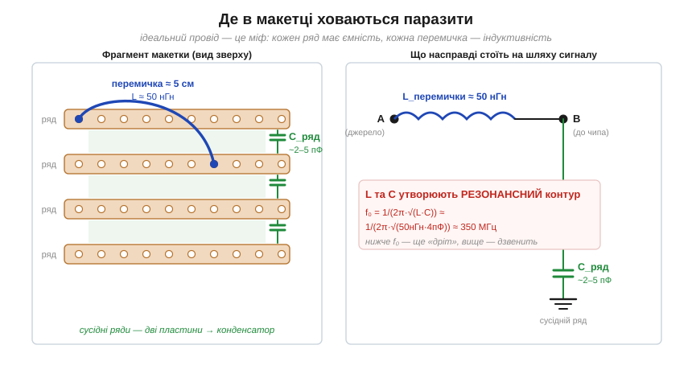
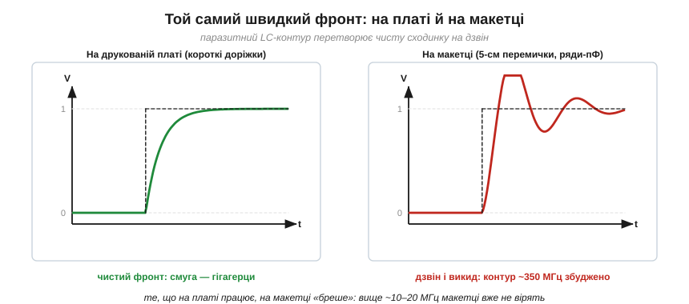

# 🔌 Чому макетка бреше: пікофаради рядів і наногенрі перемичок

Будь-яке [коло поводиться як фільтр](book:electronics/frequency-response) — навіть випадкове, якого ніхто не проєктував. Найбуденніший винуватець цього стоїть на кожному столі: безпаяльна макетка (*solderless breadboard*). На постійному струмі й на кілогерцах вона чесний друг; на десятках мегагерців — брехун, бо її ряди — це конденсатори, а перемички — котушки. Розберемо, де саме ховаються ці паразити, як вони зводяться в резонансний контур і з якої частоти макетці вже не можна вірити.

### Клас пристрою: ряди пружинних контактів

Макетка — це матриця підпружинених металевих затискачів під сіткою отворів із кроком 2.54 мм (0.1″). Усередині вона проста: кожен **ряд** із п'яти отворів з'єднаний однією металевою смужкою-затискачем, а вздовж країв ідуть довгі **шини живлення** (*power rails*). Жодної електроніки — лише метал і пластик. Саме ця геометрія й створює неприємності: дві сусідні металеві смуги, розділені тонким пластиком, — це за визначенням [конденсатор](book:electronics/capacitor) (будь-які два провідники вже мають ємність), а кожна перемичка має [індуктивність](book:electronics/inductor-coil) (струм у будь-якому провіднику огортає себе магнітним полем).


*Ліворуч — фрагмент макетки: сусідні ряди-смуги утворюють конденсатор C_ряд ≈ 2–5 пФ, а перемичка завдовжки ~5 см додає послідовну індуктивність L ≈ 50 нГн. Праворуч — що з цього виходить на шляху сигналу: послідовна L і паралельна C на землю складаються в резонансний контур.*

### Блок-схема паразитів: дві цифри, які треба знати

Двох щойно названих паразитів вистачає, щоб усе пояснити, тож замість блок-схеми чипа тут — карта саме цих двох елементів, і обидва мають запам'ятовувані порядки величин:

```
ємність сусідніх рядів     C_ряд ≈ 2…5 пФ   (метал-пластик-метал)
індуктивність перемички    L ≈ 0.7…1 нГн/мм → ~50 нГн на 5 см
```

Кожне з цих чисел окремо мізерне. П'ять пікофарад на кілогерці мають [ємнісну реактивність](book:electronics/capacitive-reactance) у десятки мегаом — повний розрив (Xc = 1/(2πfC)). П'ятдесят наногенрі на кілогерці — це мікроскопічні частки ома ([індуктивна реактивність](book:electronics/inductive-reactance) XL = 2πfL). Тому на низьких частотах макетка справді поводиться як ідеальний провід. Лихо починається, коли частота росте: Xc спадає, XL росте, і обидва паразити одночасно «прокидаються».

### Розпіновка біди: послідовна L і паралельна C

Складемо ці елементи так, як їх бачить сигнал, що йде з одного ряду в інший через перемичку (права панель рисунка вище). На шляху — **послідовна** індуктивність перемички; у вузлі призначення — **паралельна** на землю ємність сусіднього ряду. Це класична LC-ланка, а в неї є власна [резонансна частота](book:electronics/lc-resonance):

```
f₀ = 1/(2π·√(L·C))
f₀ ≈ 1/(2π·√(50×10⁻⁹ · 4×10⁻¹²)) ≈ 350 МГц
```

Нижче f₀ ланка ще схожа на провід. Поблизу f₀ вона **дзвенить**: реактивності L і C компенсують одна одну, і будь-яке збудження на цій частоті [розгойдує контур](book:electronics/lc-resonance). Вище f₀ перемичка стає переважно індуктивним опором, що відбиває швидкі фронти назад. Контур слабко задемпфований, бо послідовного опору в чистому металі майже нема, — тож [добротність](book:electronics/quality-factor) висока (велика Q = довгий дзвін), а викид затухає неохоче.

### «Перший байт»: з якої частоти не вірити

Знаючи, де ланка дзвенить, можна нарешті назвати головне число для практики. Аналог «першого байта» для макетки — це чесне правило, коли її показанням ще можна довіряти. Резонанс сидить десь на сотнях мегагерців, але псувати сигнал ланка починає **набагато раніше** — щойно паразитна реактивність стає сумірною з опорами в колі. Практичний поріг:

- **до ~1 МГц** — макетка чесна, паразити непомітні;
- **1…10 МГц** — з'являються перші спотворення фронтів і наводки між сусідніми рядами;
- **вище ~10–20 МГц** — макетці вже **не вірять**: те, що ви бачите, — це наполовину поведінка паразитного LC, а не вашої схеми.


*Однаковий швидкий цифровий фронт: ліворуч на короткій доріжці друкованої плати він приходить чистим, праворуч на макетці паразитний контур ~350 МГц збуджується фронтом і дає викид та затухлий дзвін. Та сама схема, інший «провід» — інша правда на екрані.*

Тут спрацьовує головна думка про [коло як фільтр](book:electronics/frequency-response): швидкий фронт несе в собі високі гармоніки, а саме їх паразитний контур макетки спотворює найсильніше. Цифровий сигнал «їде» з дзвоном; швидкий аналоговий каскад може й самозбудитися, бо паразитна індуктивність замикає непрошений зворотний зв'язок.

### Типові граблі

- **Довгі перемички через усю плату** — найгірше: індуктивність прямо пропорційна довжині, тож метрова перемичка опускає резонанс і збирає наводки як антена. Землю і живлення ведуть **найкоротшими** містками.
- **Дзвін на чужій частоті.** Якщо швидке коло на макетці «свистить» чи дає викиди, винна не обов'язково схема — спершу підозрюйте паразитний LC самої макетки.
- **Блокувальний конденсатор задалеко.** Блокувальний конденсатор живлення (*decoupling capacitor*), увіткнутий за кілька рядів від чипа, працює через ту саму паразитну індуктивність перемичок — і частково втрачає сенс. Його садять у сусідні з ніжкою отвори, найкоротшим містком до землі.
- **Кварц і високочастотні генератори на макетці** часто або не заводяться, або тікають за частотою — паразитні пФ збивають точні резонансні кола.

### Варіації класу

Якісні макетки відрізняються матеріалом затискачів і кроком, але фізику не оминає жодна: пружинні контакти й сітка отворів неминуче дають пікофаради й наногенрі. Тому правило просте: макетка чудова для логіки, давачів, живлення й усього, що повільніше за одиниці мегагерців; а швидку цифру, ВЧ-аналог чи точні резонансні кола відразу роблять на **паяній платі з суцільною землею**, де доріжки короткі, а земля — площина, а не дріт. Макетка не «гірша» — у неї просто є власна АЧХ, і вона мовчки додається до вашої. Це [фільтрувальна природа кола](book:electronics/frequency-response) у найчистішому вигляді: коло, якого ви не проєктували, все одно фільтрує ваш сигнал.
