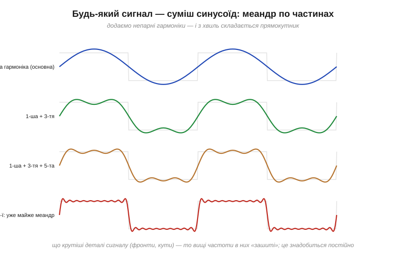
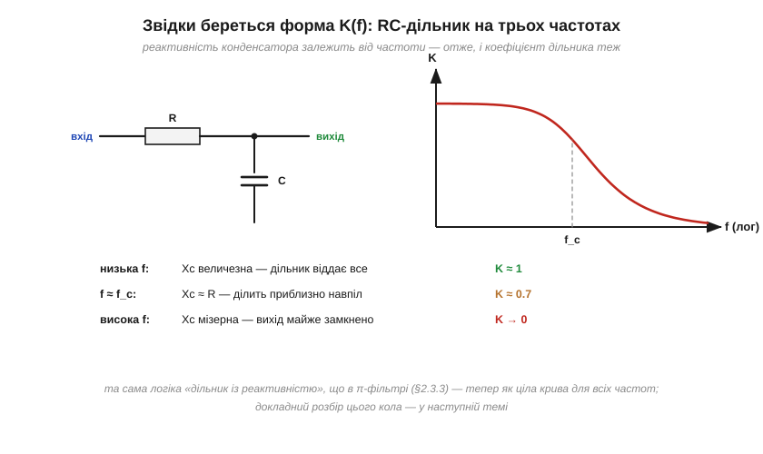
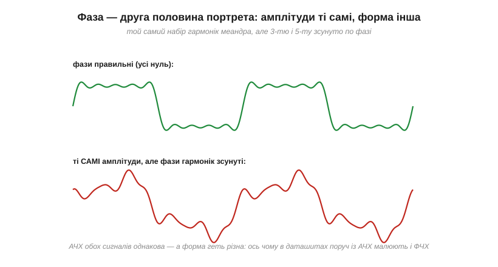

# Коло як фільтр: що таке частотна характеристика

Головна властивість [реактивних елементів](book:electronics/reactance) — конденсатор і котушка поводяться **по-різному на різних частотах**. Але звичні розрахунки реактивності стосуються однієї синусоїди за раз — однієї частоти, однієї амплітуди. А реальні сигнали не такі: голос у мікрофоні, музика в підсилювачі, цифровий фронт на шині, живлення з шумом перетворювача — це завжди **суміші** багатьох частот одразу. Постає питання, без якого далі нікуди: що коло робить із **усією сумішшю**? Невже доведеться рахувати кожен сигнал окремо? На щастя, ні. Є найпотужніша ідея всієї цієї теми: один **частотний портрет** кола, який раз і назавжди каже, що воно зробить із будь-яким сигналом. Цей портрет зветься частотною характеристикою — і щойно ви навчитеся його бачити, кожне коло з R, L і C перетвориться для вас на **фільтр**.

### Сигнали — це суміші синусоїд

Почнімо з твердження, яке спершу звучить неймовірно: **будь-який** періодичний сигнал можна скласти з синусоїд. Не приблизно, не «схоже» — точно. Прямокутний меандр, трикутник, пилка, запис голосу — все це суми синусоїд певних частот, амплітуд і фаз. Цей факт довів математик Жан-Батист Фур'є ще на початку XIX століття (для задач про теплоту, навіть не підозрюючи про електроніку), і доводити його ми не будемо — але подивитися, як це працює, варто на власні очі:


*Складаємо меандр із синусоїд-«гармонік»: основна частота, потім додаємо 3-тю гармоніку (утричі вищу за частотою, утричі меншу за амплітудою), 5-ту, 7-му… З кожним доданком сума дедалі більше схожа на прямокутник. Зверніть увагу: крутим фронтам потрібні високі гармоніки — швидкі деталі сигналу «зашиті» у високих частотах.*

Складники звуть **гармоніками** (*harmonics*): перша — основна частота сигналу, далі кратні їй. У меандра, наприклад, живуть лише непарні гармоніки (1-ша, 3-тя, 5-та…) зі спадними амплітудами — саме його «третя гармоніка» проступає привидом у [свіпі частотою](book:electronics/lc-resonance/proj-resonance-sweep.md). Набір «яка частота — скільки її в сигналі» називають **спектром** (*spectrum*) сигналу. Найважливіший практичний висновок: **що крутіші деталі сигналу, то вищі частоти в них зашиті**. Плавна хвиля — низькочастотна; гострий фронт чи вузька голка — це обов'язково високі гармоніки. Тримайте це в голові: на цьому тримається половина дальшого міркування.

### Лінійне коло розбирає суміш по одній синусоїді

Тепер другий складник ідеї. Є одна особлива форма, яку [похідна синуса](book:electronics/phase-shift/math-sine-derivative.md) пояснює до кінця: синусоїда — єдина форма, яку лінійне коло (з резисторів, конденсаторів, котушок) **не спотворює**. Подали синус частоти f — на виході отримаєте синус **тієї самої частоти** f; коло може лише змінити його амплітуду й зсунути фазу. Жодних нових частот лінійне коло не народжує.

А завдяки [суперпозиції](book:electronics/superposition) (у лінійному колі відгуки на кілька джерел додаються) коло обробляє кожну синусоїду суміші **незалежно від сусідок**: третя гармоніка «не знає», що поряд іде перша. Складіть це разом — і вийде разючий висновок: щоб знати, що коло зробить із *будь-яким* сигналом, досить знати, що воно робить із *кожною окремою частотою*. А це лише два числа на частоту:

```
K(f) — у скільки разів змінюється амплітуда синусоїди частоти f
φ(f) — на який кут зсувається її фаза
```

Пара функцій K(f) і φ(f) — це і є **частотна характеристика** (*frequency response*) кола. Графік K(f) звуть **амплітудно-частотною характеристикою** — **АЧХ** (*amplitude response*); графік φ(f) — **фазо-частотною**, ФЧХ. Один раз виміряв чи порахував — і маєш повний портрет кола на всі випадки життя.


*Як працює лінійне коло з сумішшю: вхідний спектр (сині стовпчики) проходить крізь коло, і кожен стовпчик множиться на «свою» висоту кривої K(f) — виходить вихідний спектр (зелені). Більше нічого не відбувається: уся дія кола на будь-який сигнал закодована в одній кривій.*

Найкраща побутова метафора — **еквалайзер** у музичному застосунку: ряд повзунків, кожен керує гучністю своєї смуги частот. АЧХ — це той самий еквалайзер, лише з нескінченно багатьма повзунками, положення яких задано не вашим смаком, а самою схемою. І ключове прозріння теми: **кожне лінійне коло — еквалайзер**, незалежно від того, чи ви його таким задумували.

### Звідки береться форма K(f): перший приклад

Подивімося, як схема «малює» свою характеристику, на найпростішому колі — резистор послідовно, конденсатор на вихід (це той самий дільник із реактивністю, що працює всередині [π-фільтра живлення](book:electronics/inductive-reactance/comp-lc-supply-filter.md), у найголішому вигляді). Міркуємо трьома опорними частотами, як підказує сама [реактивність](book:electronics/reactance):


*На низьких частотах Xc величезна — дільник майже не ділить, K ≈ 1. На високих Xc мізерна — вихід практично замкнено на землю, K → 0. Між ними, довкола частоти, де Xc = R, лежить плавний перехід. Ціла крива K(f) виросла з одного правила «Xc = 1/(2πfC)».*

На низькій частоті реактивність конденсатора Xc = 1/(2πfC) величезна порівняно з R — дільник віддає на вихід майже все: K ≈ 1. На високій — Xc крихітна, вихід «сидить» майже на землі: K → 0. А там, де Xc = R, коло ділить навпіл за потужністю (чому це «0.7 за амплітудою» — окрема розмова про [децибели](book:electronics/decibels)). Виходить плавна крива, що пропускає низ і ріже верх, — **фільтр нижніх частот**, докладно розібраний як [RC-фільтр нижніх частот](book:electronics/rc-low-pass). Тут важливий сам механізм: частотна залежність [реактивностей](book:electronics/reactance) **і є** причиною, чому в кола взагалі є нетривіальна АЧХ.

### Чотири характери

Комбінуючи реактивності, що тягнуть у протилежні боки (зі зростанням частоти [Xc спадає, а XL росте](book:electronics/inductive-reactance)), отримують чотири канонічні форми характеристики:


*Фільтр нижніх частот пропускає повільне і ріже швидке; верхніх — навпаки; смуговий вирізає й пропускає лише околицю однієї частоти (це [резонансний контур](book:electronics/lc-resonance) очима АЧХ); режекторний — пропускає все, КРІМ смуги. Складніші фільтри — комбінації цих чотирьох характерів.*

Зауважте: тут немає нічого принципово нового — смуговий фільтр це просто [RLC-вибірковість](book:electronics/rlc-selectivity), перемальована як K(f). Нова тут **мова**: замість «контур відгукується на свою частоту» кажемо «АЧХ має пік» — і ця мова однаково описує і резонанс, і розв'язку живлення, і аудіотракт.

### Як побачити характеристику наживо

Частотна характеристика — не абстракція з підручника: її можна виміряти на столі простим інструментом. Це **свіп** частотою — [покроковий прохід синусоїдою](book:electronics/lc-resonance/proj-resonance-sweep.md): подаємо на вхід кола синусоїду, крокуємо частотою, на кожному кроці міряємо амплітуду на виході й ділимо на вхідну — точка за точкою виростає крива K(f). Хочеться й фази — міряємо зсув на кожному кроці (зручніше за все [фігурами Ліссажу](book:electronics/phase-shift/proj-lissajous.md): форма петлі дає кут одразу). Застереження свіпу чинні й тут: дати колу встановитися, не перевантажувати його рівнем, пам'ятати про гармоніки меандра.

А є і швидкий якісний тест без жодного свіпу — подати **меандр** і подивитися на форму виходу. Логіка пряма: меандр везе в собі цілий віяр гармонік одразу, тож форма на виході розповідає про характеристику з одного погляду. Заокруглені кути — коло ріже верх (ФНЧ-характер); загострені «вуса» на фронтах і провисла полиця — ріже низ; [дзвін після фронту](book:electronics/inductor-kickback) — десь стирчить резонансний пік. Цей трюк «меандр як зонд» — улюблений прийом налагоджувальника.

### Межа портрета: лише лінійні кола

Перш ніж закохатися в нову ідею остаточно, чесно окреслимо її межі. Увесь фокус «коло повністю описане своєю K(f)» стоїть на **лінійності**: на тому, що синус проходить крізь коло, лишаючись синусом тієї самої частоти. Резистори, конденсатори, котушки — лінійні (поки котушка [не в насиченні](book:physics/saturation-hysteresis), а кераміка [не «пливе» від напруги](book:electronics/capacitor-parasitics)). А от **діод** із його [нелінійною ВАХ](book:electronics/diode-iv-curve) — ні: подайте на нього чистий синус, і на виході з'являться частоти, яких на вході **не було** — кратні гармоніки. Те саме робить будь-який підсилювач, загнаний у перевантаження: «зрізані» вершини синусоїди — це новонароджені високі гармоніки, і саме їх вухо чує як хрип.

Для нелінійних кіл частотний портрет у нашому простому сенсі не складається: мало знати, що коло робить із кожною частотою окремо, бо частоти в ньому **взаємодіють**. Це не робить ідею марною — навпаки: лінійна частина схеми описується АЧХ, а нелінійності розглядають окремо, як джерела нових частот. Інженерний словник тут такий: «спотворення» (*distortion*) — це поява гармонік, яких не було; «смуга» — властивість лінійної частини. Розрізняти ці два механізми псування сигналу — заокруглення від обмеженої смуги проти хрипу від нелінійності — означає одразу знати, **де** в тракті шукати винуватця.

### Фаза — друга половина портрета

Чому портрет складається з **двох** кривих, а не однієї? Здавалося б, фаза — дрібниця: ну зсунулась синусоїда трохи вбік, хто помітить? Для однієї синусоїди — справді ніхто. Але в суміші гармоніки складаються в форму сигналу **узгоджено**, і якщо коло зсуне їх по фазі по-різному, сума складеться вже в **іншу форму** — навіть якщо всі амплітуди незаймані:


*Два сигнали з однаковісінькими спектрами амплітуд: угорі фази гармонік правильні — меандр як меандр; унизу 3-тю, 5-ту й вищі гармоніки зсунуто по фазі — і форма попливла. АЧХ цих сигналів не відрізнити; різниця живе у ФЧХ. Ось чому в даташитах поруч із кривою підсилення малюють криву фази.*

Тож запам'ятаймо чесне правило: **АЧХ каже, що станеться з амплітудами; ФЧХ — чи збережеться форма**. Для багатьох задач (фільтр живлення, виділення станції) досить АЧХ; але там, де важлива форма сигналу — осцилографи, передача даних, якісне аудіо, — фаза стає повноправною половиною портрета. Найгостріше це чути в [історії Боде](book:electronics/frequency-response/hist-bode.md): саме фаза вирішує, чи завиє зворотний зв'язок.

### Фільтрує все

І останній поворот теми, найважливіший для практики. Слово «фільтр» звучить як назва спеціальної деталі, яку інженер *ставить навмисне*. Насправді нетривіальну частотну характеристику має **кожне** реальне коло — бо паразитні опори та ємності є скрізь (будь-які [два провідники — вже конденсатор](book:electronics/capacitor)):


*Кабель (опір жил + ємність між ними), вхід приладу (опір джерела + вхідна ємність), підсилювач (швидкість його каскадів скінченна) — у кожного є власний прихований ФНЧ. Наслідок: у кожної системи є СМУГА — діапазон частот, який вона чесно передає; усе швидше вона округлить.*

**Приклад (меандр крізь приховане RC).** Цифровий меандр 100 кГц біжить довгим кабелем, чиї паразитні R і C утворюють ФНЧ із переходом близько 200 кГц. Що станеться з формою? Розкладемо меандр на гармоніки і пропустимо кожну крізь характеристику RC-фільтра K(f) = 1/√(1 + (f/f_c)²):

```
1-ша гармоніка (100 кГц):  f/f_c = 0.5   →  K ≈ 0.89   (майже ціла)
3-тя гармоніка (300 кГц):  f/f_c = 1.5   →  K ≈ 0.55   (удвічі слабша)
5-та гармоніка (500 кГц):  f/f_c = 2.5   →  K ≈ 0.37   (утричі слабша)
```

Високі гармоніки — ті самі, що тримали круті фронти, — пригасли сильніше за основну. Сума недорахується швидких складників, і прямокутник на тому кінці кабелю приїде з **заокругленими кутами й затягнутими фронтами**. Упізнаєте? Це ж та сама картина, що дає RC-коло в часі ([експоненційне заряджання згладжує сходинку](book:electronics/rc-time-constant))! Часова мова («конденсатор не встигає зарядитися») і частотна («високі гармоніки зрізано») — **два описи одного явища**, і вміння перемикатися між ними — чи не найважливіша навичка в роботі з частотною характеристикою.

> 🔌 **Компонентна вставка:** [щуп осцилографа 10:1 — АЧХ просто в руках](book:electronics/frequency-response/comp-scope-probe.md). Найбуденніший приклад «фільтрує все»: усередині звичайного щупа — частотно-компенсований дільник, без конденсатора він був би фільтром на 160 Гц, а його характеристику ви самі вирівнюєте викруткою по меандру з клеми «PROBE COMP».

> 🔧 **Навіщо це.** Частотна характеристика — це мова, якою описано пів електроніки. «Смуга осцилографа 100 МГц», «підсилювач до 20 кГц», «фільтр перед вимірюванням», «кабель завалює фронти» — усе це твердження про K(f). Звикайте до питання «а яка тут АЧХ?» щодо будь-якого кола між джерелом сигналу і його споживачем: воно або збереже ваш сигнал, або непомітно перетворить його на щось інше. А далі цю криву варто навчитися рахувати, малювати за хвилину й читати з даташитів.

Підсумуймо. Реальні сигнали — **суміші синусоїд** (спектр), і що крутіші деталі сигналу, то вищі частоти в них зашиті. Лінійне коло не народжує нових частот: воно лише множить амплітуду кожної гармоніки на K(f) і зсуває фазу на φ(f) — тож пара кривих K(f) та φ(f), **частотна характеристика**, повністю визначає дію кола на будь-який сигнал. АЧХ буває чотирьох канонічних характерів (низ, верх, смуга, виріз), фаза відповідає за збереження форми, а нетривіальна характеристика є в *кожного* кола — навмисного фільтра чи випадкового. Щоб зробити цю мову кількісною — з формулою і характерною точкою зрізу, — найпростіший і найуживаніший випадок дає [RC-фільтр нижніх частот](book:electronics/rc-low-pass).

---
