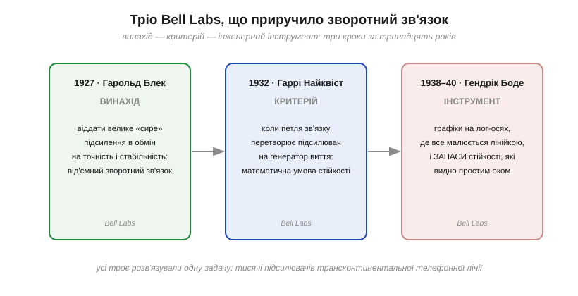
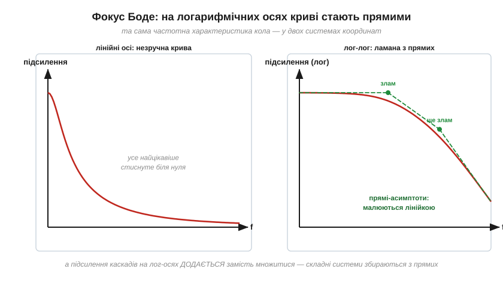

# 📜 Гендрік Боде: графіки, що приручили зворотний зв'язок

> [Діаграма Боде](topic:electronics/bode-plot) — графік підсилення й фази на логарифмічних осях, який трапляється в кожному даташиті операційного підсилювача чи стабілізатора, — має ім'я та прізвище. Гендрік Боде не відкрив нового явища природи: він придумав, **як малювати** вже відоме так, щоб інженер бачив відповідь оком, без обчислень. Це історія про те, як телефонна лінія завдовжки з континент породила підсилювачі, що вили, як троє людей у Bell Labs приборкали це виття — і чому з трьох найдовше прожив саме графічний трюк.

*Три кроки за тринадцять років: Блек винаходить від'ємний зворотний зв'язок (1927), Найквіст дає математичний критерій, коли петля завиє (1932), Боде перетворює все це на інженерний інструмент із прямих ліній і видимих оком запасів (1938–1940). Усі троє розв'язували одну задачу — телефонний кабель через континент.*

## Задача: розмова через континент

На початку XX століття американська телефонія вперлася в фізику. Сигнал у мідній парі загасає з відстанню через [опір провідника](topic:physics/resistance); щоб голос дійшов із Нью-Йорка до Сан-Франциско, його треба підсилювати знову й знову. Лінія 1915 року обходилася кількома ламповими підсилювачами; та коли захотіли не однієї лінії, а тисяч розмов одночасно, та ще й якісних, постала арифметика жаху: сигнал мав проходити крізь **сотні** підсилювачів поспіль. А кожен підсилювач — трохи кривий: лампа підсилює нелінійно, її параметри пливуть із прогрівом і старінням. Спотворення в один відсоток на каскад здаються дрібницею — але крізь сто каскадів «дрібниці» множаться, і на тому кінці дроту замість голосу хрип.

Потрібен був підсилювач не просто сильний, а **точний і стабільний** — на десятиліття вперед, у тисячах екземплярів, без підстроювання. Лампи такого не вміли. І рішення прийшло не від кращої лампи.

## 1927: ідея, записана на газеті

Інженер Bell Labs Гарольд Блек (*Harold Black*) бився над цією задачею роками. За переказом, осяяння наздогнало його вранці 2 серпня 1927 року на поромі через Гудзон дорогою на роботу — і він записав схему просто на полях свіжої газети. Ідея була зухвала до абсурду: взяти підсилювач **набагато** сильніший, ніж треба, і навмисне **повернути** частину виходу назад на вхід у протифазі — щоб вона гасила вхідний сигнал. Підсилення впаде в десятки разів; зате все, що підсилювач робить погано — спотворення, дрейф, нелінійність, — гаситиметься тим самим механізмом. Розміняти «сире» підсилення на точність: це і є [від'ємний зворотний зв'язок](topic:electronics/negative-feedback) (*negative feedback*), на якому сьогодні стоїть уся аналогова електроніка. Колеги спершу не повірили: патентне відомство роками вважало заявку черговим «вічним двигуном». Та разом із розв'язком Блек завіз у техніку нову проблему.

## Нова біда: підсилювачі, що виють

Петля зворотного зв'язку безпечна, поки повернений сигнал справді гасить вхідний. Але фаза сигналу в реальному колі залежить від частоти, бо [реактивний опір](topic:electronics/reactance) конденсаторів і котушок зсуває її: кожен конденсатор і кожна котушка на шляху докручують свій кут. І якщо на якійсь частоті накопичений зсув сягає 180°, «гасильний» сигнал повертається вже **в такт** — від'ємний зв'язок стає додатним. Підсилювач перетворюється на генератор: він збуджується сам і «виє» на цій частоті, без жодного вхідного сигналу.

Це той самий механізм самопідживлення, що завалив підвісний міст Такома-Нерроуз 1940 року: система з петлею, в якій енергія повертається в такт рухові. Флатер — це «виття» моста; виття підсилювача — його електричний близнюк. У телефонній мережі з тисячами петель таке самозбудження було не курйозом, а виробничою катастрофою: підсилювач, що працював на стенді, вив у полі — бо інша лінія, інша температура, інша лампа.

## 1932: Найквіст каже «коли»

Першим строгу відповідь дав колега Блека, математик Гаррі Найквіст (*Harry Nyquist*) — швед, що емігрував до Америки підлітком. У статті 1932 року він сформулював **критерій стійкості**: дивлячись на те, як підсилення і фаза петлі змінюються з частотою, можна точно сказати, завиє система чи ні. Це був прорив — уперше стійкість стала не питанням проб і помилок, а властивістю, яку **обчислюють до ввімкнення**. Але був і клопіт: критерій Найквіста жив у світі комплексних кривих на площині — тих самих чисел-стрілок, якими зображають амплітуду й фазу сигналу одразу, — і для щоденної інженерної роботи 1930-х, із логарифмічною лінійкою замість комп'ютера, це було важкувато.

## 1938: Боде малює прямими

Тут на сцену виходить головний герой. Гендрік Боде (*Hendrik Wade Bode*; прізвище нідерландське, тож вимовляється «Бо-де», хоч пів світу каже «Боуді») народився 1905 року в Медісоні в родині професора-нідерландця, закінчив школу в чотирнадцять років — і в Bell Labs починав із проєктування **фільтрів та еквалайзерів** для тих самих телефонних ліній. Тобто людина роками жила всередині частотних характеристик — і знала, наскільки незручно з ними працювати на лінійних осях.

Його внесок 1938 року виглядає до смішного просто, і в цьому його геніальність. Боде запропонував малювати підсилення і фазу **на логарифмічних осях** — і помітив, що в цих координатах характеристики реальних кіл майже скрізь **прямі лінії** зі стандартними нахилами, що ламаються в характерних точках — частотах зрізу. Дві вигоди одразу. По-перше, графік складного кола малюється **лінійкою** — за хвилину, без жодного обчислення. По-друге, на лог-осях підсилення послідовних каскадів **додається**, а не множиться (логарифм перетворює множення на додавання) — характеристику системи з десяти блоків збирають, як стос прозорих плівок.

*Та сама характеристика кола двічі. На лінійних осях — незручна крива, де все цікаве стиснуте біля нуля. На логарифмічних — ламана з прямих-асимптот зі зламами в характерних точках: її малюють лінійкою, а каскади просто додаються. Це і є діаграма Боде.*

А далі Боде зробив крок, що перетворив красиву картинку на інструмент безпеки. На своїх графіках він увів **запаси стійкості** (*gain margin, phase margin*): подивися, скільки фази лишається до фатальних 180° там, де підсилення петлі ще велике, — і ти знаєш не лише «завиє чи ні», а **наскільки далеко** система від виття. Запас, який видно оком на графіку, — це була мова, якою інженер міг розмовляти з виробництвом: «тут лишилося 20 градусів — мало, додай конденсатор». Стаття «Relations Between Attenuation and Phase in Feedback Amplifier Design» вийшла в липні 1940-го в журналі Bell System Technical Journal, а 1945-го Боде підсумував усе в книжці, що на десятиліття стала біблією проєктувальників.

## Війна: гармати, що цілилися самі

Щойно інструменти дозріли, історія підкинула їм застосування поза телефонією. У Другу світову Боде очолив у Bell Labs роботи над **системами керування зенітним вогнем**: радар веде ціль, обчислювач передбачає її положення, сервоприводи крутять гармату — і вся ця петля «вимірюй → обчислюй → рухай» мусить бути швидкою, точною і **не вити**, точнісінько як телефонний підсилювач. Електромеханічний директор M9, до якого доклалася команда Боде, разом із радарним наведенням і радіопідривниками виявився страхітливо ефективним проти літаків і крилатих бомб V-1 — за десятки збитих цілей на сотню снарядів там, де раніше витрачали тисячі. Так методи, народжені для розмов через континент, стали фундаментом нової дисципліни — **теорії автоматичного керування**, і сьогодні діаграмами Боде однаково користуються розробник підсилювача, інженер автопілота й проєктувальник стабілізатора напруги.

Сам Боде прожив у Bell Labs сорок років, дослужившись до віцепрезидента з військових розробок, а після відставки викладав у Гарварді. Помер він 1982 року — доживши до епохи, коли його графіки малювала вже кожна інженерна програма.

## Чому вижив саме графік

З тріо Bell Labs кожен лишив свій слід: зв'язок Блека став повітрям електроніки, критерій Найквіста — теоремою підручників. Але в щоденній роботі інженера найчастіше з'являється саме **діаграма Боде** — бо вона відповідає на практичні питання найдешевше. Розгорніть даташит будь-якого операційного підсилювача чи імпульсного стабілізатора: там буде графік підсилення з нахилами в децибелах на декаду і фаза з позначеним запасом. Це той самий малюнок 1938 року, лише комп'ютерний. Інструменти переживають теорії, коли вони дешеві у використанні: пряма, накреслена лінійкою, виявилася довговічнішою за покоління технологій — лампи, транзистори, мікросхеми змінювали одне одного, а графік лишався.

Тому варто навчитися збирати [діаграму Боде](topic:electronics/bode-plot) власноруч — читати й малювати частотну характеристику мовою децибелів і нахилів: кілька зламів на лог-осях розповідають про коло більше, ніж сторінка формул. А коли доводиться приборкувати самозбудження операційного підсилювача впритул, саме [запас фази](topic:electronics/real-opamp-limits) на цьому графіку стає мовою, якою інженер вимірює, наскільки далеко схема від виття.
