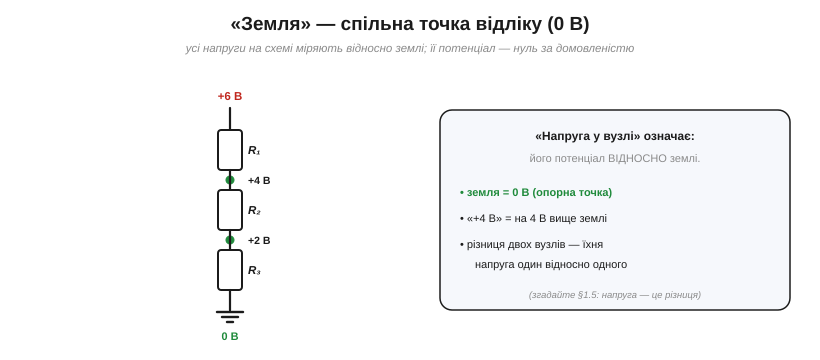
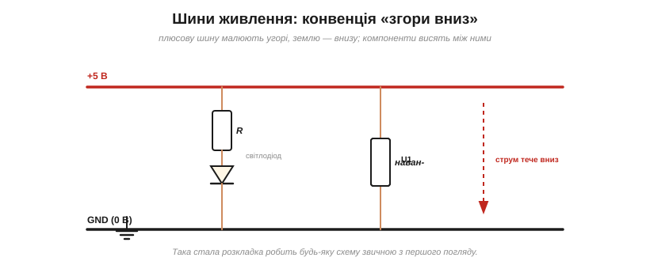
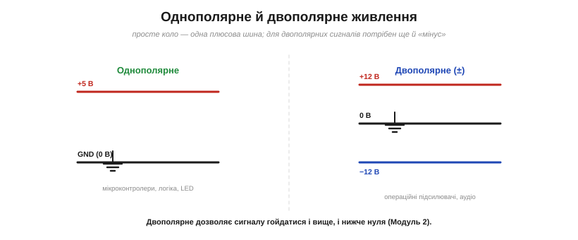

# «Земля» та шини живлення

Серед усіх ланцюгів схеми є один особливий, найважливіший — **«земля»**. Це спільна **точка відліку**, від якої міряють геть усі напруги. Розберімо, що це таке, чому без неї не обійтися, і як на схемі прийнято малювати живлення.

### Земля — спільна точка відліку

*«Земля» — спільна опорна точка з потенціалом 0 В, відносно якої міряють усі напруги. «Напруга у вузлі» означає його потенціал відносно землі: «+4 В» — це на 4 В вище землі.*

**Земля** (*ground*, GND) — це вузол, якому за домовленістю призначають потенціал **0 В**, і відносно якого відлічують напруги решти вузлів. Коли кажуть «у цьому вузлі +4 В», мають на увазі: його потенціал **на 4 В вищий за землю**. Земля — як рівень моря на географічній карті: сам по собі нуль умовний, але від нього зручно міряти всі «висоти». Без такої спільної опори числа напруг просто не мали б сенсу.

### Напруга завжди відносна

*Напруга — завжди різниця, тож нуль обираєш сам. Та сама батарея 9 В: поставиш землю на «−» — верх стане +9 В; поставиш на «+» — низ стане −9 В. Різниця однакова, змінюються лише імена.*

В основі тут лежить засадниче: [напруга — це завжди різниця](book:physics/volt) потенціалів між двома точками, а не щось абсолютне. Тому **нуль обираєте ви самі**. Візьміть батарейку 9 В: оголосите її «−» землею — і «+» стане +9 В; оголосите землею «+» — і «−» стане −9 В. **Різниця** між клемами однакова (9 В) у обох випадках; змінюються лише «імена» вузлів. Через це землю ставлять там, де **зручно** рахувати, — зазвичай на спільний мінус живлення. Працює та сама аналогія, що й із висотою: її теж міряють від обраного нуля — рівня моря, підлоги, столу. «Висота 2 метри» порожня, доки не сказано «над чим»; так і напруга: «5 вольтів» завжди означає «на 5 вольтів вище землі».

### Шини живлення: конвенція згори-вниз

*Конвенція розкладки: плюсову шину живлення малюють **угорі**, землю — **внизу**, компоненти висять між ними, а струм тече зверху вниз. Стала розкладка робить схему звичною з першого погляду.*

**Шина живлення** (*power rail*) — це лінія, що розносить напругу живлення (+5 В, +3.3 В, +12 В…) по всій схемі. Існує усталена **конвенція розкладки**: **плюсову** шину малюють **угорі** аркуша, **землю** — **внизу**, а компоненти підвішують між ними. Тоді струм на схемі тече зверху вниз — від плюса через навантаження до землі. Дотримання цієї звички безцінне: будь-яку схему, накреслену «правильно», досвідчене око читає миттєво, бо знає, де шукати живлення, а де землю. Самі шини часто й позначають [мітками ланцюгів](book:electronics/nodes-connections) — «+5В», «GND», — щоб не тягти лінії через увесь аркуш. У складніших пристроях шин буває **кілька**: скажімо, +5 В для одних мікросхем і +3.3 В для інших, а часом ще й +12 В для моторів. Кожну малюють своєю міткою, але **земля для всіх цих шин — спільна** (у межах одного пристрою): це той єдиний нуль, від якого відлічують усе живлення разом.

### Три «землі»: сигнальна, корпусна, захисна

*Три різні «землі» зі своїми символами: **сигнальна** (опорний 0 В кола — основна робоча земля), **корпусна** (з'єднання з металевим шасі) і **захисна** (справжнє з'єднання з ґрунтом, заради безпеки). Не плутайте їх.*

Слово «земля» приховує **три** різні поняття зі схожими, але різними символами. **Сигнальна** земля — це опорний 0 В кола (трикутничок зі смужок); саме вона є робочим нулем схеми. **Корпусна** (шасі) — з'єднання з металевим **корпусом** приладу. **Захисна** (*earth*, заземлення) — з'єднання з **ґрунтом** через контур заземлення, заради **безпеки** (щоб у разі пробою струм пішов [безпечним шляхом, а не крізь людину](book:physics/current-safety): захисний провід дає **низькоомний шлях назад до джерела**, щоб спрацював автомат, а не «стікає в ґрунт» як у стік). У побутовій електроніці на макетці ви майже завжди маєте справу з **сигнальною** землею; земля-заземлення — це вже про мережеве живлення й безпеку.

> 📜 А чому «землю» взагалі звуть **землею**? Бо колись струм і справді повертався крізь **ґрунт**: телеграфні лінії економили половину дроту, узявши саму землю за зворотний провідник. Звідти й назва — і навіть її сьогоднішня двозначність — у вставці [Чому «земля» — таки земля](book:electronics/ground-power-rails/hist-earth-return.md).

### Однополярне vs двополярне живлення

*Однополярне живлення — одна плюсова шина та земля (мікроконтролери, логіка, світлодіоди). Двополярне (±) додає «мінус», щоб сигнал міг гойдатися і вище, і нижче нуля (операційні підсилювачі, аудіо).*

Окрема важлива розвилка — два типи живлення. **Однополярне** (single-supply) має лише **одну** плюсову шину та землю (наприклад, +5 В і GND); його вистачає для мікроконтролерів, логіки, світлодіодів — для всього, що працює «від нуля вгору». **Двополярне** (split/dual, ±) додає ще й **від'ємну** шину (скажімо, +12 В, 0 і −12 В): воно потрібне, коли сигнал має гойдатися **і вище, і нижче** нуля — як в [операційних підсилювачах](book:electronics/ideal-opamp) та аудіотехніці. Для базового цифрового пристрою «мінусова» шина не потрібна, але варто знати, що вона буває й має сенс.

> 🔧 **Навіщо це.** Земля — це **опора всіх вимірів**: коли міряєте напругу мультиметром, чорний щуп ставлять саме на землю, бо «напруга» завжди означає «відносно землі». Звідси найважливіше практичне правило: **щоб дві частини системи розуміли одна одну звичайними (single-ended) сигналами, вони мусять мати спільну землю**. Дві плати, що так обмінюються сигналами, обов'язково з'єднують землі — інакше їхні «нулі» розійдуться, і жоден сигнал не буде прочитано правильно (це класична причина, чому «нічого не працює»). Виняток — **гальванічно розв'язані** чи [диференційні](book:communications/differential-pair) інтерфейси (оптопари, трансформатори, [RS-485](book:communications/rs-485)): вони передають сигнал і **без** спільної землі, бо не залежать від спільного нуля. Малюйте плюс угорі, землю внизу — і свою, і чужу схему читатимете легше. І не плутайте сигнальну землю із захисним заземленням: перша — опорний нуль кола, друга — про безпеку від мережі.
