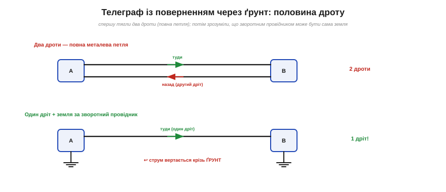
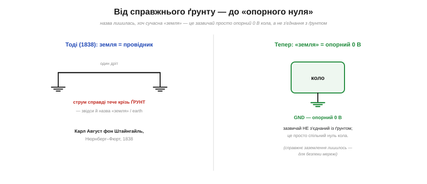

# 📜 Чому «земля» — таки земля: телеграф із поверненням через ґрунт

> Слово «[земля](book:electronics/ground-power-rails)» (*ground*, *earth*) у схемах вживають весь час — це опорний 0 В кола. Та чому саме **земля**? Назва не випадкова: це **скам'янілість** із тих часів, коли струм і справді повертався крізь **ґрунт** під ногами. Історія цього — про дотепну економію, що дала спільному вузлу його ім'я.

## Проблема: два дроти — це дорого

Будь-яке коло потребує **замкненої петлі**: [струм має кудись повертатися](book:electronics/kcl). Тому перші телеграфні лінії тягли **двома** дротами — один «туди», другий «назад». На столі це дрібниця, та коли лінія тягнеться на десятки кілометрів між містами, **другий** дріт із міді — це подвоєна вартість, удвічі більше стовпів-ізоляторів, удвічі більше клопоту. Напрошувалося питання: а чи можна якось без нього?

## Штайнгайль і несподіване відкриття (1838)

Відповідь знайшов баварський фізик і астроном **Карл Август фон Штайнгайль** (*Carl August von Steinheil*, 1801–1870) з Мюнхена. Він будував телеграф уздовж залізниці **Нюрнберг–Фюрт** — і, за порадою великого математика **Карла Фрідріха Гаусса** (який сам із Вебером поставив телеграф ще 1833 року), вирішив зекономити на дротах хитро: використати за два провідники самі залізничні **рейки**.

Задум **провалився**. Рейки погано ізольовані від землі, тож між ними весь час був паразитний струм крізь ґрунт — чистого сигналу не виходило. Та цей провал виявився **відкриттям**. Якщо струм так вільно тече між рейками **крізь землю**, міркував Штайнгайль, то земля сама — добрий **провідник**! А отже, другий дріт узагалі не потрібен: досить одного дроту вгорі, а на кінцях лінії вбити в ґрунт по металевому **штирю-заземленню** — і струм замкне петлю, повернувшись **крізь саму землю**.

*Рис. Угорі — класична лінія з двох дротів (повна металева петля). Унизу — відкриття Штайнгайля: один дріт угорі, а зворотний струм іде крізь ґрунт між двома заземлювальними штирями. Дроту вдвічі менше — а телеграф працює.*

Так **1838 року** Штайнгайль увів у дію перший телеграф із **поверненням через землю** (*earth-return*). Виграш був разючий: **удвічі** менше дроту на кожну лінію. Спершу піонери телеграфу поставилися до цього з недовірою, та економія була така очевидна, що земляне повернення швидко стало **нормою** — і саме воно зробило довгі телеграфні лінії доступними по всьому світу.

## Звідки взялася назва

І ось ключ до нашого слова. У тій схемі **сама земля була зворотним провідником** — повноправною частиною кола. Тому спільну точку, до якої під'єднували заземлювальний штир, природно й назвали **«землею»**: *ground* в Америці, *earth* у Британії. Не метафора, не умовність — буквальний ґрунт, крізь який тече струм.

## Скам'янілість, що лишилася

Минули десятиліття, телеграф поступився місцем електроніці — а **назва лишилася**, хоч її буквальний сенс давно вивітрився.

*Рис. Назва — скам'янілість. Тоді (1838) струм справді тік крізь ґрунт, і звідси «земля». Тепер «земля» в більшості схем — це просто **опорний 0 В** (як мінус батарейки), зазвичай **не** з'єднаний із жодним ґрунтом; буквальне заземлення лишилося хіба для безпеки мережі.*

Сьогодні «земля» в більшості кіл — це вже **не** ґрунт. Коли ви оголошуєте [мінус батарейки «землею»](book:electronics/ground-power-rails), ви просто обираєте опорний нуль — і ніякого штиря в ґрунт не вбиваєте; пристрій у руці працює, ні до якої землі не під'єднаний. Слово стало **скам'янілістю**: воно несе пам'ять про телеграфний ґрунт, та означає тепер абстрактний «спільний нуль».

І все ж буквальна земля нікуди не зникла — вона просто **розділила** значення зі своїм нащадком. Поряд із **сигнальною** землею (опорний 0 В) лишилася й [**захисна**](book:electronics/ground-power-rails) — справжнє з'єднання з ґрунтом заради безпеки від мережі. Тому те саме слово «земля» сьогодні приховує **два** поняття — абстрактний нуль кола й реальний ґрунт під будинком, — і плутати їх не варто. А корінь цієї двозначності — якраз тут, у телеграфній економії Штайнгайля: він зробив ґрунт провідником, ґрунт дав вузлу ім'я, а ім'я пережило сам ґрунт.

Тож, малюючи скромний значок землі, згадуйте: це не просто нуль, а **відлуння справжньої землі**, крізь яку півтора століття тому бігли телеграфні сигнали — і яка лишила нам своє ім'я.
