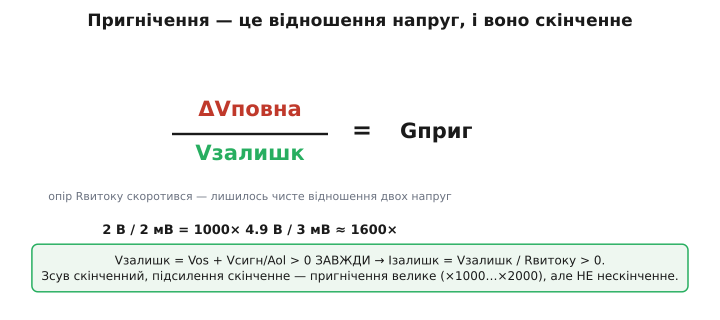
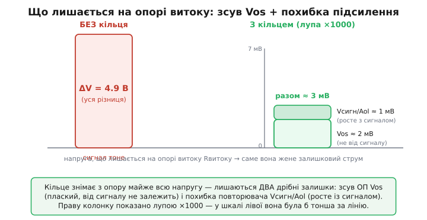

# 🧮 Скільки guard виграє: рахунок пригнічення витоку

Фраза «guard множить ізоляцію на тисячу» звучить переконливо, але інженеру з гасла схему не порахувати. Скільки саме разів — тисячу, сотню, десять тисяч? Від чого це число залежить — від опору поверхні, від підсилювача, від самого сигналу? І чому guard, хоч який гарний, **ніколи не дає рівно нуль витоку**, а лише пригнічення на кілька порядків? Усі ці відповіді ховаються в одному короткому виведенні, і завдання цієї вставки — дістати їх звідти строго, від першопричини, а не приймати «×1000» на віру.

Підемо так. Спершу означимо, що таке **коефіцієнт пригнічення**, і побачимо дивовижну річ: він не залежить від опору витоку взагалі — це чисте відношення двох напруг. Потім розберемо, звідки беруться ті дві напруги, що **лишаються** на опорі витоку навіть із кільцем, — їх рівно дві, і вони фізично різні. Звідти випливе і канонічне «×1000», і точна формула, і відповідь, чому нуля не буде. Наприкінці — робочий C, який прикидає пригнічення з паспортних цифр підсилювача.

## Коефіцієнт пригнічення: відношення напруг, у якому опір зникає

Почнімо з означення. Guard нічого не міняє в самому опорі витоку — той самий поганий гігаом лишається на місці. Міняється тільки **напруга**, прикладена до цього опору. Тож природна міра виграшу — у скільки разів менший струм тече з кільцем, ніж без нього:

```
            Iвитоку без кільця
Gприг = ───────────────────────
            Iвитоку з кільцем
```

Тепер підставмо [закон Ома](topic:electronics/ohms-law) у чисельник і знаменник. Без кільця на опорі витоку Rвитоку стоїть **повна** різниця потенціалів між брудним вузлом і входом — назвімо її ΔVповна. З кільцем на опорі лишається лише крихітна **залишкова** напруга Vзалишк (звідки вона береться — за мить). Струми:

```
Iбез  = ΔVповна / Rвитоку
Iз    = Vзалишк / Rвитоку
```

І ось ключова мить усього рахунку. Підставмо ці два струми у відношення:

```
        ΔVповна / Rвитоку      ΔVповна
Gприг = ──────────────────  = ──────────
        Vзалишк / Rвитоку     Vзалишк
```

**Опір витоку скоротився.** Він стояв у чисельнику й у знаменнику однаковий — і зник без сліду. Коефіцієнт пригнічення взагалі **не залежить** від того, який поганий той опір: тераом там чи кілоом, волога сіла чи поверхня суха — у відношенні струмів цей опір скорочується завжди, бо в обох випадках струм тече крізь **той самий** опір, лише під різною напругою.


*Пригнічення дорівнює відношенню повної різниці напруг до залишкової, а опір витоку в цьому відношенні скорочується — він стоїть однаковий у струмі до і після. Тож виграш guard диктує не якість поверхні, а лише те, наскільки мала залишкова напруга.*

Це не дрібниця, а серце всього прийому, тепер уже числом. Якість ізоляції впливає на **абсолютний** струм витоку — і до, і після кільця: за вологи обидва більші, за сухої менші. Але **відношення** їх — наскільки guard покращив справу — від ізоляції не залежить ні на йоту. Виграш guard диктує цілком інша річ: **наскільки малу залишкову напругу Vзалишк ми лишили на опорі**. Уся боротьба за пригнічення — це боротьба за маленьке Vзалишк, а не за великий опір.

> 🔧 **Навіщо це.** Звідси випливає несподіване й заспокійливе: коефіцієнт пригнічення guard можна порахувати наперед, **не знаючи опору поверхні** — а його ніхто й ніколи не знає точно, він гуляє на три порядки від вологості. Достатньо знати дві напруги: повну різницю, що була б без кільця, і залишкову, що лишається з кільцем. Перша — з топології плати (хто сусід, на якій напрузі). Друга — з паспорта підсилювача. Перемножувати на хисткий гігаом не треба; пригнічення — паспортна величина схеми, а не лотерея поверхні.

Лишилося єдине питання, але воно вирішує все: **звідки береться Vзалишк** і чому вона не нуль. Бо якби кільце повторювало вхід ідеально точно, Vзалишк була б нуль, пригнічення — нескінченне, і витоку не було б зовсім. Реальність скромніша, і причин рівно дві.

## Звідки залишкова напруга: два незалежні джерела

Кільце жене не сам слабкий вхід, а **вихід підсилювача** — низькоомну копію вхідної напруги. Уся справа в слові «копія»: вона не ідеальна. Вихід відрізняється від входу на маленьку похибку, і **саме ця похибка лишається напругою на опорі витоку** між входом і кільцем. Похибок дві, фізично різні, і додаються вони разом.

**Джерело перше: напруга зсуву (Vos).** Реальний підсилювач навіть в ідеальній рівновазі тримає на своїх входах не точно однакову напругу, а з невеличкою сталою різницею — [напругою зсуву](topic:electronics/cmrr) (англ. *input offset voltage*, Vos). Вона народжується з неминучого розкиду пар транзисторів на вході кристала: дві половинки вхідного каскаду ніколи не виходять однаковими до останнього атома. Для повторювача це означає, що вихід осідає не точно на вхідній напрузі, а зміщений на Vos:

```
Vвих = Vвх ± Vos
```

Типове Vos для пристойного операційного підсилювача — одиниці мілівольтів (прецизійні — десятки мікровольтів, дешеві — десяток мілівольтів). Головне для нас: Vos **стале** — воно не залежить від того, який сигнал на вході. Хоч вхід на нулі, хоч на повній шкалі — зсув той самий. Це **плаский поверх** залишкової напруги, нижче за який не опуститися навіть теоретично.

**Джерело друге: скінченне підсилення повторювача.** Тут тонше, і саме це місце зазвичай випускають. Підсилювач робить вихід рівним входу не магією, а **зворотним зв'язком**: він порівнює вихід зі входом і підкручує вихід, доки різниця не стане малою. Але «малою» — не «нульовою». Щоб операційний підсилювач видав на виході хоч якусь напругу, на його входах **мусить** лишатися крихітна різниця — бо вихід дорівнює цій різниці, помноженій на величезне, але **скінченне** власне підсилення Aol (англ. *open-loop gain*, підсилення без зворотного зв'язку). Запишемо це точно для повторювача. Підсилювач формує вихід як

```
Vвих = Aol · (Vвх − Vвих)
```

— різницю входів (а в повторювачі вихід заведено прямо на інвертувальний вхід, тож різниця — це Vвх − Vвих) помножено на Aol. Розв'яжемо щодо Vвих:

```
Vвих = Aol·Vвх − Aol·Vвих
Vвих·(1 + Aol) = Aol·Vвх
              Aol
Vвих = Vвх · ───────
            1 + Aol
```

Ось вона, чесна передавальна характеристика повторювача зі **скінченним** підсиленням. Множник Aol/(1+Aol) трішки менший за одиницю — рівно настільки, наскільки Aol не нескінченне. Порахуймо, яка ж **різниця** лишається між входом і виходом — а це і є та напруга, що сяде на опорі витоку:

```
                         Aol            (1 + Aol) − Aol         Vвх
Vвх − Vвих = Vвх · (1 − ───────) = Vвх · ───────────────  = ────────
                        1 + Aol             1 + Aol           1 + Aol
```

Для великого Aol (десятки тисяч і більше) одиницею в знаменнику можна знехтувати, і виходить напрочуд проста, прозора оцінка:

```
Vвх − Vвих ≈ Vвх / Aol
```

**Похибка повторювача — це вхідний сигнал, поділений на власне підсилення підсилювача.** І, на відміну від зсуву, ця похибка **пропорційна сигналу**: що вищий сигнал на вході, то більша абсолютна різниця між входом і кільцем. Стоїть вхід на нулі — похибки немає; піднявся до повної шкали — похибка максимальна. Тому в загальному вигляді залишкову напругу часто пишуть через сигнал як Vсигн/Aol, де Vсигн — поточний розмах сигналу на вході.

> 🔧 **Навіщо це.** Дві похибки поводяться по-різному, і це визначає, котра головна в конкретній схемі. Зсув Vos — плаский: він домінує, коли сигнал малий (давач біля нуля, віртуальна земля). Похибка Vсигн/Aol росте із сигналом: вона домінує, коли сигнал великий, а Aol скромне (швидкі ОП на високій частоті, де Aol уже просіло). Прикидаючи guard, інженер дивиться на обидві й бере ту, що більша в його робочій точці, — або їхню суму, коли вони співмірні.

Тепер складімо обидва джерела. Повна залишкова напруга на опорі витоку з кільцем:

```
Vзалишк = Vos + Vсигн / Aol
       └─зсув─┘   └─похибка підсилення─┘
```

Перший доданок сталий, другий росте із сигналом; обидва скінченні й обидва **строго більші за нуль** у будь-якого реального підсилювача. Запам'ятаймо цю суму — з неї випливе і число «×1000», і відповідь про нуль.


*Без кільця на опорі стоїть уся різниця (тут 4.9 В). З кільцем лишаються два дрібні залишки: сталий зсув Vos і похибка повторювача Vсигн/Aol, що росте із сигналом. Праву колонку показано лупою — у шкалі лівої вона була б тонша за лінію. Саме ця сума й жене залишковий струм.*

## Звідки беруться канонічні «×1000»

Тепер видно, звідки в довідниках і даташитах раз у раз спливає саме порядок тисячі. Це не магічна стала guard, а просто **відношення двох типових напруг** — повної різниці й зсуву, — порахований для звичайних значень.

Візьмімо найпоширеніший приклад, той, що наводить виробник підсилювачів: повна різниця без кільця ΔVповна = 2 В (типовий розмах між високоомним входом і сусіднім вузлом), залишкова напруга — лише зсув підсилювача, Vos ≈ 2 мВ. Тоді

```
        ΔVповна     2 В        2 000 мВ
Gприг = ──────── = ──────── = ────────── = 1000
        Vзалишк     2 мВ          2 мВ
```

— **рівно тисяча** (це усталений приклад із інженерної практики прецизійного проєктування ОП; підтверджено в нотатках виробників, напр. Microchip). Уся «магія тисячі» — це просто 2 вольти, поділені на 2 мілівольти. Зміни напруги — зміниться й число: сусід на 10 В замість 2 дасть ×5000; прецизійний підсилювач із Vos = 50 мкВ замість 2 мВ підніме до ×40000; дешевий ОП із Vos = 10 мВ опустить до ×200. **Тисяча — не закон природи, а просто типове відношення вольтів до мілівольтів.** Корисно тримати в голові як орієнтир порядку, але не як константу.

Тепер додаймо й другий доданок — похибку підсилення, — щоб побачити повну картину. Хай сигнал на вході Vсигн = 0.1 В, а власне підсилення підсилювача Aol = 100 000 (типове для ОП загального призначення на постійному струмі). Похибка повторювача:

```
Vсигн / Aol = 0.1 В / 100 000 = 1×10⁻⁶ В = 1 мкВ
```

Лише мікровольт — у п'ятдесят разів менше за зсув 2 мВ. На постійному струмі, де Aol величезне, **зсув домінує цілком**, а похибкою підсилення можна знехтувати; залишкова напруга ≈ Vos. Але на високій частоті Aol падає (для типового ОП воно валиться вже з кілогерців): нехай на робочій частоті Aol просіло до 1000. Тоді

```
Vсигн / Aol = 0.1 В / 1000 = 1×10⁻⁴ В = 100 мкВ = 0.1 мВ
```

— уже співмірне зі зсувом, і його треба враховувати. А якби сигнал був не 0.1 В, а 5 В (повна шкала) при Aol = 1000, похибка підсилення дала б цілих 5 мВ — і **переважила** би зсув. Ось чому на швидких високоомних входах guard працює гірше, ніж на повільних: не сам guard слабшає, а **підсилення підсилювача**, що жене кільце, — а з ним росте Vсигн/Aol і псує пригнічення.

## Залишковий витік у пікоамперах

Коефіцієнт пригнічення — гарна відносна міра, та зрештою інженера цікавить **абсолютний** залишковий струм: чи не зіпсує він вимір. Тепер його легко порахувати — Vзалишк ми вже маємо, лишилось поділити на опір.

**Залишковий витік через зсув підсилювача.** Високоомний вхід працює біля 0.1 В, опір витоку по вологій поверхні Rвитоку = 1 ГОм = 1×10⁹ Ом. Підсилювач має зсув Vos = 2 мВ; сигнал малий, тож похибкою підсилення нехтуємо (Vзалишк ≈ Vos). Який залишковий струм?

```
дано:   Vзалишк ≈ Vos = 2 мВ = 0.002 В
        Rвитоку = 1×10⁹ Ом
залишковий струм:
        Iзалишк = Vзалишк / Rвитоку = 0.002 / 1×10⁹
                = 2×10⁻¹² А = 2 пА
```

**Два пікоампери.** Для порівняння, без кільця на тому самому опорі стояли б повні 4.9 В і тік би струм 4.9 нА — у дві з половиною тисячі разів більший. Кільце зняло з опору майже всю напругу, лишивши тільки зсув, — і небезпечні наноампери стали невинними пікоамперами, **без жодної зміни ізоляції**. Два пікоампери для більшості високоомних давачів уже непомітні: фотодіод чи pH-електрод віддає десятки-сотні пікоампер корисного струму, на тлі яких 2 пА — припустима дрібка.

Та запам'ятаймо: це **не нуль**. Guard опустив витік на три з половиною порядки, але не прибрав його зовсім. І це не недогляд реалізації, а принципова межа, до якої ми тепер і підійдемо.

## Чому guard ніколи не дає нуль

Тепер видно строго, чому витік не зникає до кінця. Залишковий струм пропорційний залишковій напрузі:

```
Iзалишк = Vзалишк / Rвитоку = (Vos + Vсигн/Aol) / Rвитоку
```

Щоб Iзалишк став рівно нуль, чисельник мусив би бути нуль — тобто Vos = 0 **і** Vсигн/Aol = 0 одночасно. Але:

- **Vos = 0** означало б ідеально однакові транзистори на вході — фізично неможливо, два кристалічні переходи завжди трішки різні. Зсув можна зменшити (підбором, лазерним підгоном, автокомпенсацією), але занулити геть — ні.
- **Vсигн/Aol = 0** при ненульовому сигналі означало б **нескінченне** підсилення Aol. А скінченність Aol — не дефект, а сама природа підсилювача: вихід завжди дорівнює різниці входів, помноженій на скінченне число, тож якась різниця на входах **мусить** лишатися, поки вихід ненульовий.

Отже, **обидва доданки строго додатні** в будь-якого реального підсилювача — а раз залишкова напруга більша за нуль, то й залишковий струм більший за нуль. Guard не воює з природою опору поверхні (це була б програшна війна), але й сам спирається на неідеальний підсилювач, і ця неідеальність кладе підлогу. Пригнічення велике — тисячі разів, — але **скінченне**: коефіцієнт Gприг = ΔVповна / Vзалишк не може стати нескінченним, бо знаменник ніколи не нуль.

> 🔧 **Навіщо це.** Це межа, об яку б'ється проєктувальник найслабших струмів. Коли корисний струм давача сам у пікоамперах чи фемтоамперах (іонізаційна камера, електрометр), залишкові 2 пА від зсуву вже **не** дрібниця — вони співмірні з сигналом, і самого guard замало. Тоді йдуть далі: беруть електрометричний підсилювач із мікровольтовим зсувом і фемтоамперним власним струмом, додають активну компенсацію зсуву, тримають усе на тефлоні. Guard лишається першим і найдешевшим кроком, але він **не останній** — і знати його стелю (≈ Vos/Rвитоку струму) треба, щоб вчасно зрозуміти, коли його вичерпано.

Окрема тонкість — інвертувальна (трансімпедансна) схема, де кільце садять на землю, бо вхід там [віртуальна земля](topic:electronics/virtual-ground). Здавалося б, тут залишкової напруги нема зовсім: і вхід, і кільце на нулі. Та насправді той самий зсув Vos зміщує віртуальну землю від **справжньої** землі рівно на Vos — підсилювач тримає інвертувальний вхід не на чистому нулі, а на Vos відносно неінвертувального. Тож між входом (на Vos) і кільцем (на чистому 0) знову стоїть та сама напруга Vos, і той самий залишковий витік тече. Механізм ідентичний: куди б ми не вели кільце, зсув підсилювача лишається непереборним залишком на опорі витоку. Геть нуль недосяжний в обох увімкненнях з тієї самої причини.

## Те саме в коді

Зберімо рахунок у робочий C, який прикидає пригнічення й залишковий витік із паспортних цифр підсилювача — саме так інженер вирішує, чи вистачить guard для його давача, ще до паяння. Функція бере обидва джерела залишкової напруги (зсув і похибку підсилення) і чесно повертає те, що цікавить: коефіцієнт пригнічення й залишковий струм у амперах.

```c
#include <stdio.h>
#include <math.h>

// Залишкова напруга на опорі витоку З кільцем — сума двох джерел:
//   vos   — напруга зсуву ОП (В), стала, від сигналу не залежить
//   vsig  — розмах сигналу на вході (В)
//   aol   — власне підсилення ОП на робочій частоті (рази, без зворотного зв'язку)
// Похибка повторювача = vsig/aol (вихід не точно дорівнює входу через скінченне aol).
static float v_residual(float vos, float vsig, float aol) {
    return vos + vsig / aol;          // плаский зсув + пропорційна сигналу похибка
}

// Коефіцієнт пригнічення guard = повна різниця / залишкова напруга.
// ОПІР ВИТОКУ ТУТ НЕ ПОТРІБЕН — він скорочується у відношенні струмів.
static float guard_suppression(float dv_full, float vos, float vsig, float aol) {
    return dv_full / v_residual(vos, vsig, aol);
}

// Залишковий струм витоку З кільцем (А) — ось тут опір уже потрібен.
static float leak_residual(float vos, float vsig, float aol, float r_leak) {
    return v_residual(vos, vsig, aol) / r_leak;
}

int main(void) {
    // Типовий високоомний вхід:
    float dv_full = 4.9f;     // повна різниця без кільця (5 В сусід − 0.1 В вхід)
    float vos     = 2.0e-3f;  // зсув ОП: 2 мВ
    float vsig    = 0.1f;     // сигнал на вході: 0.1 В
    float r_leak  = 1.0e9f;   // опір витоку по вологій поверхні: 1 ГОм

    // Сценарій А: постійний струм, велике підсилення (aol = 100000)
    float aolA = 1.0e5f;
    float vresA = v_residual(vos, vsig, aolA);
    float gA    = guard_suppression(dv_full, vos, vsig, aolA);
    float iA    = leak_residual(vos, vsig, aolA, r_leak);

    // Сценарій Б: висока частота, підсилення просіло (aol = 1000), сигнал на повну шкалу
    float aolB = 1.0e3f;
    float vsigB = 5.0f;       // 5 В розмаху
    float vresB = v_residual(vos, vsigB, aolB);
    float gB    = guard_suppression(dv_full, vos, vsigB, aolB);

    printf("А (DC, Aol=1e5): Vзалишк = %.3f мВ, пригнічення = %.0f разів, витік = %.2f пА\n",
           vresA * 1e3f, gA, iA * 1e12f);
    printf("   (зсув домінує: похибка підсилення лише %.3f мкВ)\n",
           (vsig / aolA) * 1e6f);
    printf("Б (ВЧ, Aol=1e3, сигнал 5В): Vзалишк = %.2f мВ, пригнічення = %.0f разів\n",
           vresB * 1e3f, gB);
    printf("   (тепер домінує похибка підсилення: %.2f мВ проти зсуву %.1f мВ)\n",
           (vsigB / aolB) * 1e3f, vos * 1e3f);
    return 0;
}
```

Очікуваний вивід:

```
А (DC, Aol=1e5): Vзалишк = 2.001 мВ, пригнічення = 2449 разів, витік = 2.00 пА
   (зсув домінує: похибка підсилення лише 1.000 мкВ)
Б (ВЧ, Aol=1e3, сигнал 5В): Vзалишк = 7.00 мВ, пригнічення = 700 разів
   (тепер домінує похибка підсилення: 5.00 мВ проти зсуву 2.0 мВ)
```

Два сценарії показують усе. У сценарії А (постійний струм, велике Aol) залишкова напруга — це майже чистий зсув 2 мВ: похибка підсилення дає жалюгідний мікровольт і тоне. Пригнічення — ті самі ~2450 разів, що й у наскрізному прикладі теми, а залишковий витік — рівно 2 пА. У сценарії Б підсилення просіло до тисячі, а сигнал піднявся до повної шкали — і **похибка підсилення (5 мВ) переважила зсув (2 мВ)**, залишкова напруга підскочила до 7 мВ, а пригнічення впало з тисяч до семисот. Той самий guard, той самий опір поверхні; різниця лише в тому, наскільки точну копію входу видає підсилювач — а вона тим гірша, чим менше Aol і чим більший сигнал. Функція `guard_suppression` навмисно **не бере** опір витоку взагалі: він у відношенні скорочується, і пригнічення рахується з самих напруг — тоді як `leak_residual` опір уже вимагає, бо абсолютний струм без нього не знайти.

> 🔧 **Навіщо це.** Така функція — це «бюджет guard» на папері. Підставивши паспортні Vos і Aol свого підсилювача, робочий сигнал і прикинутий опір поверхні, інженер бачить наперед: вистачить пригнічення чи ні, домінує зсув чи похибка підсилення, і чи не вилазить залишковий витік за допуск давача. Найчастіший висновок такого підрахунку — або «guard вистачає з запасом, ставимо й забуваємо», або «залишкові пікоампери співмірні з сигналом, треба електрометричний ОП із мікровольтовим зсувом». І те, і те видно з двох цифр даташита, без жодного паяння.

## Що варто винести

Коефіцієнт пригнічення guard — це **відношення двох напруг**, ΔVповна / Vзалишк, у якому опір витоку **скорочується**: виграш guard не залежить від якості поверхні, а лише від того, наскільки малу залишкову напругу лишив підсилювач. Ця залишкова напруга має **два джерела**: сталий зсув підсилювача Vos і похибку повторювача через скінченне підсилення, Vсигн/Aol, що випливає з точної передавальної Vвих = Vвх·Aol/(1+Aol) і росте із сигналом. Канонічне «×1000» — це просто типова повна різниця, поділена на типовий зсув (2 В / 2 мВ), а не стала природи: прецизійний ОП дає десятки тисяч, дешевий — сотні. Залишковий витік рахується прямо: для зсуву 2 мВ на опорі 1 ГОм це 2 пА — у тисячі разів менше за наноампери без кільця, але **не нуль**. І нуля бути не може принципово: і Vos, і 1/Aol строго більші за нуль у будь-якого реального підсилювача, тож залишкова напруга, а з нею і струм, завжди додатні — guard дає велике, але скінченне пригнічення. Хто бачить guard так — як ділення повної напруги на залишкову, а не як магічну «кращу ізоляцію», — той знає і його силу (тисячі разів задарма), і його стелю (≈ Vos/Rвитоку), і коли її вже вичерпано.
