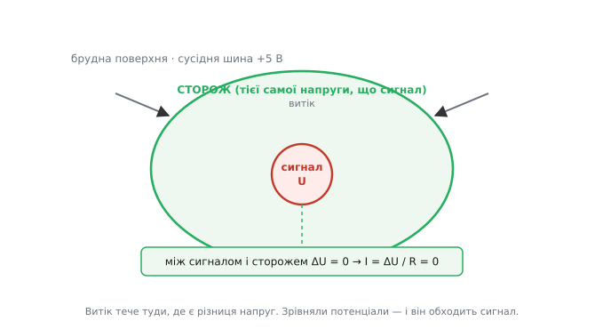
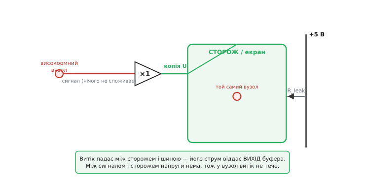
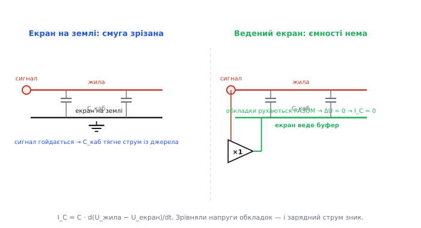

# Guard ring і ведений екран

Уявіть, що вам треба провести по платі або по кабелю **крихітний** струм — пікоампери, мільярдні частки міліампера — і чесно його зміряти. Здавалося б, провід є провід: причепив, та й годі. Але на цих рівнях усе, що ви досі вважали ізоляцією, перестає бути ізоляцією. Тонка плівка вологи й флюсу на платі між вашою доріжкою та сусідньою, на якій стоїть живлення, — це резистор. Хай у гігаоми, та все ж резистор: крізь нього з живлення у ваш чутливий вузол сочиться паразитний струм, і він — того самого порядку, що й сигнал, який ви ловите. Сигнал тоне у витоку ще до того, як дійде до підсилювача.

Лобове рішення — «зробити ізоляцію кращою» — не працює: ідеальних діелектриків немає, а волога з повітря осідає на будь-яку поверхню. Інженери знайшли хід тонший і красивіший. Не намагатися **перекрити** шлях витоку, а **прибрати причину**, що жене струм цим шляхом. Витік тече, бо на кінцях паразитного опору є **різниця потенціалів**. Прибери різницю — і струм зникне сам, хоч би яким поганим був діелектрик. Саме це робить **ведений екран** (англ. *driven guard*, *driven shield* — «ведений», бо його напругу веде за сигналом окремий підсилювач): оточуємо чутливий провідник сусіднім провідником — **екраном-сторожем** — і змушуємо його триматися **рівно тієї самої напруги**, що й сигнал. Між ними нуль вольтів — а нуль вольтів не жене струму крізь жоден опір, хоч який малий.


*Ведений екран як ідея: чутливий вузол оточено провідником-сторожем, який тримають на тій самій напрузі. Витік крізь поверхневий опір тече туди, де є різниця потенціалів; між сигналом і сторожем її нема, тож сигнал нічого не втрачає. Уся «брудна» різниця падає вже між сторожем і рештою світу — а її струм бере на себе підсилювач, не сигнал.*

## Чому витік — це проблема саме малого струму

Спершу домовмося, чому взагалі варто марудитися. Закон Ома байдужий до того, «провід» перед ним чи «ізоляція»: крізь будь-який скінченний опір під напругою тече струм `I = U/R`. Поверхневий опір чистої сухої плати — близько 1000 гігаомів між сусідніми доріжками; у вологому повітрі він падає до якихось одного гігаома. Здавалося б, гігаом — це майже розрив. Та порахуймо струм, який цей «розрив» пропускає від звичайної п'ятивольтової шини:

```
I_витік = U / R = 5 / 1×10⁹ = 5×10⁻⁹ А = 5 нА
```

П'ять наноамперів. Для логічного входу, що споживає міліампери, це пил під ногами. Та якщо ви будуєте [трансімпедансний підсилювач](book:electronics/transimpedance-amplifier) для фотодіода, який віддає **наноампери**, або міряєте струм витоку конденсатора в пікоамперах, — ці п'ять наноамперів затоплюють ваш сигнал із головою. Ось чому guard — техніка саме **слабкострумова**: чим менший корисний струм, тим більшою бідою стає те, на що сильнострумова схема й не глянула б.

> 🔧 **Навіщо це.** Ціла родина точних приладів живе або вмирає на цьому: електрометри, пікоамперметри, входи [зарядових підсилювачів](book:electronics/charge-amplifier) для п'єзодавачів, ємнісні сенсори, входи високоомних АЦП. Скрізь, де вхідний опір вузла йде на одиниці-десятки гігаомів і вище, поверхневий витік плати чи кабелю стає головним джерелом похибки — більшим за власний шум підсилювача. Guard ring і ведений екран — стандартна, майже обов'язкова відповідь: без них високоомний вузол просто не тримає свою напругу, а заявлені в даташиті фемтоампери лишаються на папері.

## Головна думка: прибрати не шлях, а напругу

Поглянемо ще раз на причину. Витік `I = U/R` тече, бо на опорі R є напруга U. Збільшити R до нескінченності ми не можемо — фізика діелектрика не дозволяє. Зате **U цілком у нашій владі**. Що, як зробити так, щоб на паразитному опорі, який під'єднаний до нашого чутливого вузла, було **нуль вольтів**? Тоді `I = 0/R = 0` — байдуже, який там R, хоч гігаом, хоч мегаом від брудної плати.

Як влаштувати нуль вольтів на опорі, один кінець якого сидить на сигналі? Другий кінець теж посадити на **ту саму напругу**, що й сигнал. Якщо обидва кінці однакові, різниці нема, струму нема. Ось уся ідея в одному реченні: **оточуємо чутливий провідник провідником-сторожем і тримаємо сторож на потенціалі сигналу.** Тоді поверхневий витік уже не може дотекти до сигналу — між сигналом і сторожем нема напруги, що гнала б струм. А той витік, що таки тече (бо між сторожем і рештою світу різниця є), затікає **в сторож**, а не в сигнал. Сигнал лишається недоторканним.

Аналогія — рів із водою тієї самої висоти. Уявіть замок (сигнал), який не можна затопити, і навколо нього болото (волога плата з її витоком). Зазвичай вода з болота просочується в замок. Та якщо вирити навколо замку рів і тримати в ньому воду **рівно на тому самому рівні**, що й усередині замку, — перетікання спиниться: вода не йде туди, де висота однакова. Болото надворі скільки завгодно вище — воно тисне на зовнішню стінку рову, але до замку не дістає. Аналогія ламається в одному: справжній рів треба весь час підживлювати, бо болото забирає з нього воду. Так і тут — сторож не тримає свою «висоту» сам; її **активно підтримує** окреме джерело, яке доливає рівно стільки струму, скільки висмоктує болото. Це джерело — буфер.

## Звідки береться потрібна напруга: буфер-повторювач

Сторож має триматися **точно** на напрузі сигналу — а вона не стала, вона гуляє разом із сигналом. Звідки взяти копію цієї напруги, яка йшла б за сигналом крок у крок і при цьому **не навантажувала** сам сигнал (бо найменший відбір струму з високоомного вузла — це вже та сама похибка, з якою ми боремося)?

Відповідь — [буфер-повторювач](book:electronics/voltage-follower): операційний підсилювач, увімкнений так, що його вихід точно повторює напругу на вході, але вхід при цьому майже нічого не споживає, а вихід здатний віддати чималий струм. Заводимо чутливий вузол на вхід буфера (вхід високоомний — сигналу це не коштує нічого), а виходом буфера живимо сторож. Тепер сторож автоматично сидить на тій самій напрузі, що й сигнал, **хоч би як та напруга мінялася** — буфер стежить за нею в реальному часі. І весь витік, який болото вганяє в сторож, бере на себе **вихід буфера**, а не високоомний вузол. Буфер — це насос, що тримає рівень у рові.


*Як ведеться екран. Високоомний вузол заходить на вхід буфера-повторювача (вхід нічого не споживає), а сторож живиться з його виходу — тож сторож завжди на напрузі сигналу. Паразитний витік R_leak тепер падає між сторожем і шиною, і його струм віддає вихід буфера. Чутливий вузол від цього струму відгороджено: між ним і сторожем напруги нема.*

Тонкість, про яку мовчати не можна: реальний буфер копіює напругу не ідеально — між його входом і виходом лишається крихітна похибка (зсув і скінченне підсилення). Тож на паразитному опорі лишається не строгий нуль, а **дуже мала** залишкова напруга — і витік не зникає геть, а **зменшується в стільки разів, у скільки буфер точніший за пряме коло**. На практиці це послаблення у тисячі й десятки тисяч разів: було п'ять наноамперів — стало одиниці пікоамперів. Скільки саме лишається і як це порахувати з похибки буфера — у вставці [скільки витоку лишає ведений екран](book:electronics/guard-ring/math-guard-residual.md).

> 🔧 **Навіщо це.** Звідси випливає просте правило монтажу, яке рятує даташитну точність: вихід буфера, що жене сигнал, **майже завжди можна задарма пустити ще й на guard** — той самий повторювач, який уже стоїть у схемі, заразом веде екран. Не треба окремої мікросхеми: один буфер робить дві роботи. Тому в добре спроєктованому високоомному вході ви побачите доріжку-сторож, під'єднану не до землі, а до виходу вхідного повторювача, — це і є ведений екран майже без додаткових деталей.

## Guard ring: той самий принцип на платі

На друкованій платі сторож набуває конкретної форми — **охоронного кільця** (англ. *guard ring*): мідної доріжки, що повністю **обводить** чутливий вузол з усіх боків, мов рів навколо замку. Усе, що зовні намагається дотекти до вузла поверхнею плати — від сусідньої доріжки живлення, від пальців, від вологи, — мусить спершу перетнути кільце. А кільце тримають на напрузі вузла (через буфер — ведене, або просто на землі, якщо вузол сам близький до землі). Витік упирається в кільце й стікає в нього, не діставшись вузла всередині.

Кілька правил, що прямо випливають з фізики, а не з примхи:

- **Кільце мусить бути замкнене.** Лишена щілина — ворота, крізь які витік обходить сторож. Рів із проломом не тримає води.
- **Обводити треба обидва боки плати** і саме той вивід мікросхеми, що йде на високоомний вузол; часто навіть лишають порожнім сусідній вивід корпусу, щоб подовжити шлях витоку.
- **Під кільцем і вузлом знімають паяльну маску** — сама маска та бруд під нею проводять; гола, чиста, відмита від флюсу поверхня — частина рішення.

Що ширше кільце і що чистіша плата, то менше витоку дотече до вузла — бо кільце шунтує його на контрольований потенціал. Деталі рисунка кільця, де знімати маску, як заводити сторож на буфер і типові помилки розведення — у вставці [як розводити охоронне кільце](book:electronics/guard-ring/proj-guard-ring-layout.md).

## Той самий хід проти ємності: ведений екран на кабелі

Тепер найкрасивіше. Та сама ідея «прибрати різницю напруг» лікує **другу** болячку слабкосигнальних вузлів — **паразитну ємність**, надто в кабелі. І тут вона працює навіть ефектніше.

Згадаймо, що ємність бере струм лише тоді, коли напруга на ній **змінюється**: `I = C · dU/dt`. Високоомний сигнал біжить по центральній жилі екранованого кабелю; екран зазвичай садять на землю. Між жилою і екраном — ємність кабелю, чималенька: десь сто пікофарадів на метр. Щойно сигнал на жилі ворухнеться, ця ємність вимагає зарядного струму — і висмоктує його з нашого тендітного вузла. Для високоомного джерела це подвійна біда: ємність разом із вихідним опором джерела утворює [фільтр нижніх частот](book:electronics/rc-low-pass), що ріже смугу, та ще й сповільнює встановлення напруги до повзких часів.

А тепер зробімо з екраном те саме, що з guard ring: під'єднаймо його не до землі, а до **виходу буфера**, який повторює сигнал жили. Що станеться з ємністю? Обидві її «обкладки» — і жила, і екран — тепер рухаються **разом**, на тій самій напрузі. Різниця напруг між ними завжди нуль, отже `dU/dt` між ними теж нуль:

```
U_жила − U_екран ≈ 0   (екран веде буфер)
I_C = C · d(U_жила − U_екран)/dt = C · 0 = 0
```

Зарядного струму нема! Ємність фізично нікуди не поділася — між жилою та екраном так само сто пікофарадів, — але **джерело сигналу її більше не відчуває**. Заряджати її не доводиться, бо обкладки не розходяться за напругою; а той заряд, що потрібен (між екраном і землею), доливає **буфер**, не сигнал. Ефективна ємність, яку бачить високоомне джерело, падає у стільки ж разів, у скільки буфер точний. Кабель був на сто пікофарадів — для джерела він став на частки пікофарада. Цей прийом так і називають — **bootstrap-нейтралізація ємності** (бо екран сам «підтягується» за сигналом); докладніше — у [бутстреп-каскаді](book:electronics/bootstrap-circuit).


*Ведений екран на кабелі. Зліва екран на землі: коли сигнал на жилі гойдається, ємність C_каб вимагає зарядного струму з джерела, ріже смугу й сповільнює встановлення. Справа екран веде буфер: жила й екран рухаються синхронно, різниця напруг на C_каб завжди нуль, тож джерело ємності майже не відчуває. Заряд між екраном і землею бере на себе вихід буфера.*

> 🔧 **Навіщо це.** Без цього прийому довгий кабель від високоомного давача — вирок: він додає сотні пікофарад, які з'їдають смугу й розмазують фронти. Ведений екран знімає вирок — давач можна винести на метри від підсилювача, і кабель майже не псує сигнал. Тому в осцилографічних щупах ×10, у п'єзо- та pH-електродах, у ємнісних сенсорах ви знайдете цей хід: внутрішній екран кабелю веде буфер, а не земля. Смуга виходу зростає в рази задарма — самим лише перепідключенням екрана.

## Триаксіальний кабель: два екрани, бо ролі різні

Тут спливає природне питання. Якщо внутрішній екран ми посадили на сигнал (ведемо ним), то він уже **не екранує** від зовнішніх електромагнітних наводок — він сам тепер гойдається разом із сигналом, а не сидить тихо на землі. А наводки нікуди не зникли: антена з кабелю ловить мережеву гуділку й радіо. Виходить, ведений екран і екран-від-наводок — це **дві різні роботи**, і одному провіднику їх не сумістити.

Розв'язок — дати кабелю **два** екрани. Так влаштований **триаксіальний кабель** (англ. *triaxial*, *triax* — «трьохосьовий», бо три співвісні провідники один в одному):

- **центральна жила** — сигнал;
- **внутрішній екран** — guard: його веде буфер, він тримає напругу сигналу й гасить витік та ємність;
- **зовнішній екран** — на землі: він приймає на себе електромагнітні наводки й не пускає їх усередину.

Між жилою та guard напруги нема — нема ні витоку, ні зарядного струму. Між guard і зовнішнім екраном напруга є, але вона нікому не шкодить: її струм бере буфер. А зовнішній екран чесно робить своє екранування, бо сидить на стабільній землі. Кожен провідник — на своїй роботі. Саме тому входи фемтоамперних приладів виводять не звичайним коаксіалом, а триаксом: він поєднує ведений guard і справжнє [екранування](book:electronics/shielding) в одному кабелі.

## Worked-приклади

**Скільки витоку прибирає guard ring.** Високоомний вузол на платі, поряд — доріжка з +5 В. Поверхневий опір між ними у вологому повітрі впав до 2 ГОм. Спершу без сторожа, тоді з веденим кільцем на буфері, що тримає вузол із похибкою 0.5 мВ (зсув повторювача). Який витік у вузол до і після?

```
без сторожа:  на опорі вся напруга шини
   I = U / R = 5 / 2×10⁹ = 2.5×10⁻⁹ А = 2.5 нА

з веденим кільцем: між вузлом і кільцем — лише похибка буфера 0.5 мВ,
   а шину від вузла кільце відгородило, тож у вузол тече тільки крізь
   залишок похибки на тому самому опорі:
   I = U_похибки / R = 0.5×10⁻³ / 2×10⁹ = 2.5×10⁻¹³ А = 0.25 пА
```

Витік у вузол упав із 2.5 наноампера до чверті пікоампера — у десять тисяч разів, рівно у стільки, у скільки 0.5 мВ менші за 5 В. Не покращенням ізоляції, а лише тим, що ми зрівняли потенціали.

**Як кабель «худне» для джерела.** Метр кабелю, 100 пФ, від давача з вихідним опором 1 ГОм. Порахуймо смугу [−3 дБ](book:electronics/bandwidth-3db) спершу зі звичайним заземленим екраном, а тоді з веденим (нехай буфер давить ємність у 1000 разів).

```c
// Смуга на виході високоомного джерела, що навантажене ємністю кабелю.
// f_3dB = 1 / (2*pi*R*C). Ведений екран ділить ефективну C на коефіцієнт буфера.
#include <math.h>

float bandwidth_hz(float r_source_ohm, float c_eff_farad) {
    return 1.0f / (2.0f * 3.14159265f * r_source_ohm * c_eff_farad);
}

int main(void) {
    float R = 1.0e9f;          // вихідний опір давача, Ом
    float C_cable = 100e-12f;  // ємність метра кабелю, Ф

    float f_plain  = bandwidth_hz(R, C_cable);          // екран на землі
    float f_driven = bandwidth_hz(R, C_cable / 1000.0f);// ведений екран

    // f_plain  = 1 / (2*pi*1e9*100e-12)  ≈ 1.6 Гц    — кабель убив смугу
    // f_driven = 1 / (2*pi*1e9*0.1e-12)  ≈ 1.6 кГц   — у 1000 разів ширше
    (void)f_plain; (void)f_driven;
    return 0;
}
```

Заземлений екран затиснув смугу до півтора гераца — давач став би безнадійно повільним. Ведений екран розсунув її до півтора кілогераца — у тисячу разів, бо ефективну ємність буфер придушив у тисячу разів. Жодної нової деталі: лише екран під'єднано до виходу буфера, а не до землі.

## Межі прийому: де ведений екран кусає за руку

Чесний інженер знає, чим платить. Ведений екран — не безкоштовний обід.

**Стійкість буфера.** Тепер вихід повторювача навантажений на чималеньку ємність екрана (між guard і землею вона нікуди не ділася). А ємність на виході [буфера](book:electronics/voltage-follower) — класична причина дзвону й самозбудження: вона додає зсув фази в петлю зворотного зв'язку. Тому повторювач для ведення екрана беруть стійким на ємнісне навантаження або додають невеликий розв'язувальний резистор між виходом і екраном. Інакше «лікування» обернеться генерацією.

**Скінченна точність — скінченне послаблення.** Ми вже бачили: guard прибирає витік і ємність не до нуля, а в стільки разів, у скільки буфер точний. Зсув, дрейф і скінченне підсилення повторювача ставлять стелю. Для фемтоамперних задач навіть мікровольти зсуву важать — там беруть надточні повторювачі й вилизують монтаж.

**Сам сторож має бути чистий.** Якщо кільце або внутрішній екран забруднені й самі течуть на щось третє — буферові доводиться доливати цей струм, і якщо його забагато, вихід не витягне. Guard не скасовує гігієни монтажу, а доповнює її.

**Guard — не панацея від наводок.** Ведений внутрішній екран **не** захищає від електромагнітних наводок (він же гойдається з сигналом). За наводки відповідає окремий заземлений екран — звідси й триакс. Плутати ці дві ролі — типова помилка: «у мене ж є екран» не означає «я захищений від витоку», і навпаки.

## Що варто винести

Ведений екран і guard ring — це одна думка у двох подобах: **прибери не шлях паразитного струму, а напругу, що його жене.** Оточуєш чутливий високоомний вузол провідником-сторожем і тримаєш сторож рівно на напрузі сигналу — через буфер-повторювач, що копіює напругу, не навантажуючи вузол. Тоді між сигналом і сторожем нуль вольтів: поверхневий витік `U/R` не дотікає до вузла (бо U між ними нуль), а зарядний струм ємності `C·dU/dt` зникає (бо dU між обкладками нуль). Обидві біди слабкострумового вузла — витік крізь брудний діелектрик і паразитна ємність кабелю — лікуються тим самим перепідключенням сусіднього провідника з землі на вихід буфера. На платі сторож набуває форми замкненого охоронного кільця з голою поверхнею; на кабелі — внутрішнього екрана, що його веде буфер, а від наводок ставлять окремий заземлений зовнішній екран, і кабель стає триаксіальним. Послаблення — у стільки разів, у скільки точний буфер: тисячі й десятки тисяч. Хто зрозумів, що тут б'ються не за ізоляцію, а за рівність потенціалів, той бачить guard скрізь — від pH-метра до фемтоамперного входу — і ставить його як належне.
