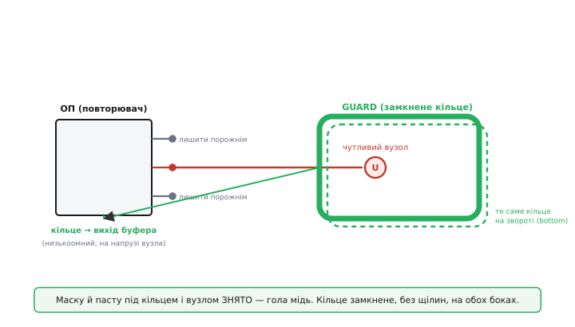
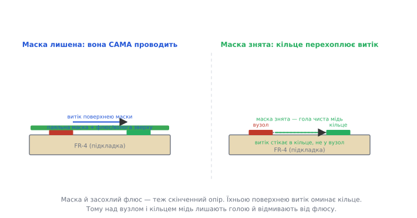
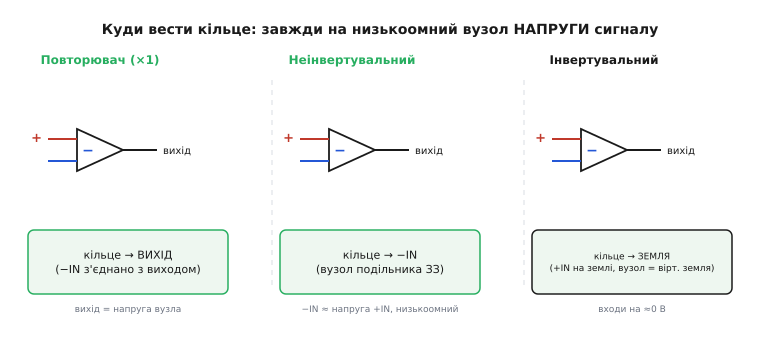

# ⚙️ Як розводити охоронне кільце

Принцип ведено­го екрана простий: оточи чутливий вузол провідником тієї самої напруги — і між ними не лишиться різниці, що гнала б витік. Та між «зрозумів принцип» і «плата справді тримає пікоампери» лежить розводка. Тут принцип або працює на всі сто, або тихо не працює зовсім — бо одна щілина в міді, одна смужка лишеної маски, один забутий перехід на зворот плати руйнують усю затію, і прилад мовчки бреше. Тому розведення кільця — не косметика наприкінці, а частина схемотехніки. Розберімо його як справжню задачу: що накреслити в редакторі плати, де зняти маску, куди завести кільце в кожній зі схем — і чому **кожне** правило випливає просто з фізики витоку, а не з традиції.

## Задача: накреслити рів так, щоб його не можна було обійти

Сформулюймо чесно, що ми робимо. Є **високоомний вузол** — вивід мікросхеми (найчастіше вхід операційного підсилювача) і коротка доріжка до давача, де опір на землю йде на гігаоми й вище. Поряд на платі — звичайні вузли: шина живлення +5 В чи +15 В, цифрові доріжки, інші виводи того ж корпусу. Між нашим вузлом і будь-яким із них поверхнею плати тече паразитний струм `I = U/R`: чистий сухий FR-4 дає поверхневий опір десь у тисячу гігаомів, але засохлий флюс, відбитки пальців і волога з повітря збивають його до одного-двох гігаомів. Від п'ятнадцятивольтової шини це дає, як свідчать виміри в апнотах, **понад десять наноамперів** витоку в сусідній вузол — а ми ловимо сигнал у пікоамперах. Сигнал тоне.

Наше завдання в редакторі плати — **прокласти між чутливим вузлом і рештою світу провідник-кільце**, який стоїть на тій самій напрузі, що й вузол, перехоплює весь поверхневий витік на себе й не лишає жодної лазівки в обхід. Рів навколо замку. Якщо рів суцільний і глибокий — болото до замку не дістане. Якщо в ньому пролом, тріщина чи місток поверх — вода знайде шлях. Уся складність розводки зводиться до одного: **зробити рів без жодного обходу**, у трьох вимірах плати, з урахуванням того, що витік повзе не лише по доріжках, а по будь-якій поверхні — по масці, по бруду, по торцю плати.

> 🔧 **Навіщо це.** Ціна помилки тут несиметрична. Добре розведене кільце коштує кількох міліметрів міді й знятого прямокутника маски — копійки. Погано розведене (зі щілиною, під маскою, лише з одного боку) **виглядає** як кільце на екрані, проходить візуальний огляд, плата виробляється — а прилад дає похибку в наноампери там, де даташит обіцяв фемтоампери. І знайти це потім украй важко: воно плаває з вологістю, з'являється після пайки (флюс!), зникає після промивання й вертається за тиждень. Тому розводку кільця доводять до пуття **один раз, на етапі плати**, а не вишукують поночі в готовому виробі.

## Ідея розводки: замкнене кільце, гола мідь, обидва боки, ведене на сигнал

Перш ніж лізти в редактор, тримаймо в голові чотири вимоги — усі прямо з фізики `I = U/R` поверхнею:

- **Замкнене.** Кільце мусить **повністю** обводити вузол — суцільна петля без жодної щілини. Будь-який розрив у міді — це ділянка, де витік проходить **повз** кільце прямо у вузол, бо там його ніщо не перехоплює.
- **Гола мідь.** Над кільцем і над вузлом **знімаємо паяльну маску й пасту** — бо сама маска та засохлий під нею флюс проводять, і витік потече **поверх** кільця, не торкнувшись міді.
- **Обидва боки.** Витік повзе обома поверхнями плати й торцями отворів, тож кільце дублюємо на **звороті** плати точно під верхнім і зшиваємо їх перехідними отворами — інакше зворот лишається відкритим обходом.
- **Ведене на сигнал.** Кільце під'єднуємо до **низькоомного вузла, що сидить на напрузі сигналу** (вихід буфера / −IN / земля — залежно від схеми), а **не** абикуди. Якщо напруга кільця не дорівнює напрузі вузла — між ними знову є різниця, і витік оживає.


*Розводка кільця в редакторі плати. Високоомний вивід (+IN) іде на чутливий вузол; навколо вузла — суцільне замкнене кільце голої міді (маску знято), продубльоване на звороті та зшите перехідними отворами. Кільце ведуть на вихід буфера — низькоомний вузол напруги сигналу. Сусідні виводи корпусу лишають непідключеними, щоб подовжити шлях витоку від найближчих «брудних» точок.*

Усе подальше — лише як виконати ці чотири вимоги акуратно й без типових промахів. Пройдімо по кожній.

## Замкнене кільце: чому щілина — це ворота

Намалювати кільце в редакторі плати — це провести **замкнену доріжку** (полігон-петлю) навколо вузла. Звучить тривіально, та найчастіша помилка саме тут: інженер веде кільце доріжкою, доходить майже до початку — і **лишає крихітний проміжок**, щоб «не закоротити саме на себе» або бо туди не влізла ще одна доріжка. Цей проміжок — пролом у рову.

Чому він критичний, видно з геометрії витоку. Витік шукає шлях **найменшого опору** поверхнею. Поки кільце суцільне, будь-яка лінія від зовнішньої «брудної» точки до вузла **перетинає мідь кільця** — а мідь має майже нульовий опір і сидить на напрузі вузла, тож витік стікає в неї й до вузла не доходить. Та щойно з'явилася щілина шириною хай навіть пів міліметра — крізь неї пролягає вузька доріжка діелектрика **прямо від зовнішнього світу до вузла, в обхід міді**. Опір цієї вузької перемички більший, ніж був би без кільця (бо шлях довший і тонший), але він **скінченний** — а отже витік тече. Кільце з щілиною не зменшує витік у тисячі разів; воно зменшує його в рази — тобто майже не працює.

```
суцільне кільце:  шлях вузол↔світ ПЕРЕТИНАЄ мідь → стікає в кільце → I_вузол ≈ 0
кільце з щілиною: лишається перемичка діелектрика крізь щілину →
                  I = U / R_перемички ≠ 0  (R велике, але не нескінченне)
```

Звідси правило без винятків: **кільце замкнене на всі 360°**. Якщо доріжку, що йде до вузла, треба провести крізь кільце (а її таки треба — вузол має з чимось з'єднатися), вона перетинає кільце **на тому боці, що веде до буфера**, або проходить **внутрішнім шаром** під кільцем, не розриваючи петлю на поверхні. Сам же зовнішній контур міді лишається суцільним. Думка проста: рів можна перетнути містком зсередини замку, але стінку рову проривати не можна ніде.

## Гола мідь: чому маску й флюс прибирають

Друга вимога часто дивує: ми ж навчені, що паяльна маска **захищає** плату — навіщо її здирати саме там, де нам найважливіше? Бо на цих рівнях струму маска з захисника перетворюється на винуватця.

Маска — це полімерна плівка, і як будь-який діелектрик вона має скінченний поверхневий опір; виміри дають близько 10⁷ Ом·см і нижче після кількох днів у вологому теплі, а з осілим зверху флюсом і брудом — ще менше. Тепер ключове: маска лежить **суцільним шаром поверх і вузла, і кільця, і зазору між ними**. Витік може піти не лише по голому FR-4 між мідними площадками, а **по поверхні самої маски** — а вона тягнеться неперервно прямо над кільцем, від вузла до зовнішнього світу. Кільце з міді сидить **під** цією плівкою й не може перехопити струм, що повзе **над** ним по масці. Рів накрили дошкою — і болото перейшло поверх.


*Чому маску знімають. Зліва маску лишено: засохлий флюс і волога на її поверхні утворюють провідну плівку, що тягнеться неперервно над кільцем — витік оминає мідь поверхнею маски. Справа маску над вузлом і кільцем знято: гола чиста мідь стоїть на напрузі вузла, і будь-який поверхневий витік стікає в кільце, не діставшись вузла.*

Тому в редакторі плати над вузлом, над кільцем і над зазором між ними **малюємо виріз у шарах паяльної маски** (top і bottom) і **в трафареті пасти** — щоб там лишилася гола мідь і голий FR-4, без жодної плівки, що проводить поверхнею. Гола мідь кільця тепер торкається того самого повітря й бруду, що й шлях витоку, і чесно його перехоплює.

Знята маска — половина справи; друга половина — **чистота**. Найпідступніший винуватець не волога з повітря, а **флюс після пайки**: активований флюс лишає по собі іонні залишки, що проводять навіть у сухому повітрі, і саме вони, а не FR-4, часто є головним шляхом витоку на свіжозмонтованій платі. Тому плату з високоомним вузлом **відмивають** після пайки (ультразвук чи спеціальна відмивка), а в особливо тонких приладах вузол і кільце ще й **лакують** вологозахисним покриттям — але лише **після** ретельної відмивки, бо лак, нанесений поверх флюсу, законсервує бруд назавжди. Канон тут: спершу прибрати причину (флюс), тоді захищати (лак), ніколи навпаки.

> 🔧 **Навіщо це.** Це пояснює загадку, на яку натикаються чи не всі, хто вперше будує електрометр: «на макеті працювало, спаяв на платі — попливло». Винна не схема — винен флюс, що ліг саме в зазор кільця й закоротив рів іонним містком. Тому в технологічній карті точного приладу промивання — не побажання, а операція з контролем: погано відмитий вузол зведе нанівець і ведене кільце, і дорогий малозсувний підсилювач. Один раз побачивши, як після відмивки витік падає на два порядки, інженер більше ніколи не лишає флюс на високоомному вузлі.

## Обидва боки плати: витік не знає, де верх

Третя вимога — кільце **з обох боків** плати, точно одне під одним, зшите перехідними отворами. Причина знов суто фізична: поверхневий витік повзе **будь-якою** поверхнею, а у плати їх дві плюс торці отворів. Якщо кільце лише зверху, то знизу під вузлом лишається відкрита поверхня FR-4, по якій витік із нижніх доріжок (а вони там є — живлення, земля, сигнали) спокійно дотікає до контактного отвору вузла, не зустрівши жодної міді. Рів вирили з одного боку пагорба — болото обійшло з іншого.

Тому в редакторі **дублюємо кільце на звороті**: та сама замкнена петля голої міді точно під верхньою, і обидві з'єднуємо рядком **перехідних отворів (via)** по периметру. Що дають ці отвори, крім електричного з'єднання двох кілець? Вони закривають **третю** поверхню — стінки самих отворів вузла й торці плати. Якщо вузол виходить на зворот через перехідний отвір, метал стінок цього отвору теж стає шляхом витоку всередину плати; кільце з via навколо нього перехоплює й цей шлях. Густо поставлений рядок via перетворює два пласкі кільця на суцільну **мідну стіну** крізь усю товщу плати — рів стає не канавою, а вертикальною греблею від поверхні до поверхні.

Практичний наслідок для розводки: під високоомним вузлом **не проводять жодних чужих доріжок** на внутрішніх і нижньому шарах. Будь-яка доріжка, що пройшла під вузлом, — це нова «брудна» поверхня близько до нього, всередині рову. Зону під кільцем і вузлом лишають порожньою на всіх шарах (або заливають тим самим потенціалом кільця), щоб ніщо не підлізло під греблю знизу.

## Лишити порожнім сусідній вивід: подовжити шлях витоку

Тонкий, але дієвий хід, що теж випливає з `I = U/R`. Найближча «брудна» точка до високоомного виводу мікросхеми — це **сусідні виводи того ж корпусу**: вони за частки міліметра, і якщо на сусідньому виводі сидить живлення чи вихід, то між ним і нашим виводом найкоротший, а отже найменш опірний шлях витоку прямо по корпусу й платі під ним.

Розв'язок елегантний: **лишити сусідні виводи непідключеними** (depopulate), якщо схема дозволяє. Багато точних підсилювачів навмисне роблять так, що поряд із чутливим входом стоять виводи, які **можна** не підключати, — і виробник у даташиті прямо радить лишити їх порожніми. Що це дає? Прибравши з'єднання із сусіднього виводу, ми **прибрали найближче джерело напруги** до вузла. Тепер найближча різниця потенціалів — аж за два виводи, шлях витоку вдвічі-втричі довший, опір відповідно більший, витік менший. А якщо сусідній порожній вивід ще й **під'єднати до кільця** (а не лишити висіти в повітрі), він сам стає частиною сторожа: тепер прямо біля чутливого виводу стоїть вивід тієї самої напруги, між ними нуль вольтів, і навіть та крихта витоку, що йшла по корпусу, зникає.

```
сусідній вивід на живленні: шлях витоку ≈ крок виводів (дуже короткий) → I великий
сусідній вивід порожній:    найближча напруга аж за 2 кроки → шлях ×2…3 → I менший
сусідній вивід на кільці:   біля вузла напруга = напруга вузла → ΔU = 0 → I ≈ 0
```

Це міркування — частина того самого рову: ми не лише риємо канаву навколо замку, а ще й **відсуваємо болото подалі** від стін, прибираючи найближчі його калюжі.

## Куди вести кільце: три схеми, одне правило

Тепер найважливіше рішення розводки, де помиляються найчастіше: **до чого під'єднати кільце**. Спокуса посадити його на землю — вона ж поряд, вона низькоомна, її багато. Але правило одне й невблаганне: **кільце веде на низькоомний вузол, що сидить рівно на напрузі чутливого вузла**. Де цей вузол — залежить від схеми, і тут є рівно три випадки. Канон цей не вигаданий — його дають апноти Microchip і Analog Devices для прецизійних підсилювачів, і кожен випадок виводиться з того, де в даній схемі лежить «копія» напруги входу.


*Куди заводити кільце для трьох типових увімкнень підсилювача. Повторювач: −IN з'єднано з виходом, тож кільце ведуть на вихід. Неінвертувальний: кільце ведуть на −IN — вузол подільника зворотного зв'язку, який стоїть на напрузі входу й низькоомний. Інвертувальний: входи сидять на віртуальній землі, тож кільце ведуть на землю. Спільне в усіх трьох — кільце завжди потрапляє на низькоомний вузол напруги сигналу.*

**Повторювач (буфер ×1).** Найпростіший випадок. Вихід підсилювача повторює вхід, а −IN з'єднано прямо з виходом. Напруга виходу = напруга чутливого входу, і вихід низькоомний за визначенням. **Кільце ведемо на вихід** — той самий вихід, що вже стоїть у схемі. Жодної додаткової деталі: повторювач, який буферизує сигнал, заразом веде кільце.

**Неінвертувальний підсилювач.** Сигнал заходить на +IN (високоомний вузол), підсилення задає подільник зворотного зв'язку з −IN на вихід. Здавалося б, вести кільце на вихід — але вихід тут **більший** за вхід у K разів (підсилення), і різниця між кільцем і вузлом була б величезна. Куди ж? На **−IN**. Завдяки роботі підсилювача напруга на −IN тримається **рівно дорівнює** напрузі на +IN (підсилювач зводить різницю входів до нуля), а сам −IN — низькоомний, бо його жорстко тримає подільник зворотного зв'язку. Отже −IN — це готова низькоомна копія напруги вузла. **Кільце ведемо на −IN.**

**Інвертувальний підсилювач.** Сигнал заходить через резистор на −IN, а +IN сидить на землі (чи на опорній напрузі). Тут −IN — це **віртуальна земля**: підсилювач тримає його на потенціалі +IN, тобто на нулі, майже не пускаючи туди струм. Обидва входи фактично на нулі вольтів. Отже напруга чутливого вузла тут ≈ 0, і низькоомна копія цього нуля — **сама земля** (через +IN). **Кільце ведемо на землю** — і це єдиний випадок, коли «кільце на землю» правильне, бо саме тут вузол справді близький до землі.

Звідси видно, чому бездумне «кільце на землю» — пастка: воно вірне лише для інвертувального ввімкнення. У повторювачі й неінвертувальному підсилювачі вузол гуляє разом із сигналом на вольти від землі — і кільце на землі дало б між собою й вузлом усю цю напругу, тобто **повний витік**, наче кільця нема. Правило, що покриває всі три: **знайди в схемі низькоомний вузол, напруга якого дорівнює напрузі чутливого входу, і веди кільце на нього.** У повторювачі це вихід, у неінвертувальному — −IN, в інвертувальному — земля.

## Робочий C: польова перевірка, що кільце справді працює

Розводку ми зробили — а як переконатися, що кільце **працює** на готовій платі, а не лише гарне на екрані? Тріщину в міді, флюсовий місток у зазорі чи маску, що лишилася, оком не побачиш, а мультиметром гігаоми не зміряєш. Зате їх можна **зміряти самим приладом**: подати на сусідню «брудну» точку відому напругу, лишити чутливий вузол на час висіти лише на власному (величезному) опорі й подивитися ацепе, **куди попливе** його напруга. Справне кільце тримає вузол на місці; кільце з обходом дає йому повзти — і за швидкістю повзіння ми обчислимо залишковий витік і винесемо вирок.

Це справжня прошивка етапу пуску плати: мікроконтролер сам тестує власний аналоговий вхід. Логіка така — заряджаємо вузол через буфер до середини шкали, відмикаємо приведення (лишаємо вузол на його гігаомному опорі), вмикаємо поряд «агресор» +5 В і за відомий час `Δt` міряємо зсув напруги вузла `ΔU` через ацепе. Витік `I = C·ΔU/Δt`, де `C` — відома сумарна ємність вузла. Порівнюємо з порогом — і кажемо «кільце ОК» або «кільце тече».

```c
// Польова self-test перевірка охоронного кільця.
// MCU заряджає високоомний вузол, відмикає приведення, вмикає агресор +5 В
// і за відомий час міряє дрейф напруги вузла через ADC.
// Витік I = C * dU/dt; великий витік => кільце має обхід (щілина / флюс / маска).
#include <stdint.h>
#include <stdbool.h>

// --- Платозалежні примітиви (заглушки під конкретний HAL) ----------------
extern void     node_drive_to(float volts);   // буфер жене вузол на volts
extern void     node_release(void);           // вузол лишається на власному R (буфер у Hi-Z)
extern void     aggressor_set(bool on);        // подати/зняти +5 В на сусідній «брудний» вузол
extern float    adc_read_node_volts(void);     // прочитати напругу вузла через ADC
extern void     delay_ms(uint32_t ms);
extern void     log_line(const char *s);

// --- Параметри вузла й тесту (з даташита й розрахунку) --------------------
#define NODE_CAP_F        22.0e-12f   // сумарна ємність вузла (вхід ОП + монтаж), Ф
#define SETTLE_DROP_V     2.5f        // заряджаємо вузол до середини шкали
#define DRIFT_WINDOW_MS   200u        // вікно вимірювання дрейфу
#define LEAK_LIMIT_A      5.0e-12f    // поріг придатності: 5 пА (з запасом над ціллю)

// Один прохід: повертає виміряний витік у вузол, А.
static float measure_node_leakage(void) {
    node_drive_to(SETTLE_DROP_V);   // підтягнули вузол на 2.5 В
    delay_ms(20);                   // дали встановитися
    float u0 = adc_read_node_volts();

    aggressor_set(true);            // увімкнули поряд +5 В — максимально провокуємо витік
    node_release();                 // ВІДМИКАЄМО приведення: тепер вузол тримає лише власний R
    delay_ms(DRIFT_WINDOW_MS);      // даємо витоку попрацювати фіксований час
    float u1 = adc_read_node_volts();

    aggressor_set(false);
    node_drive_to(SETTLE_DROP_V);   // повернули вузол у робочу точку

    // dU/dt за вікно; I = C * dU/dt. Беремо модуль: напрям залежить від того,
    // куди тягне переважний витік (до +5 В вузол повзе вгору).
    float du = u1 - u0;
    if (du < 0.0f) du = -du;
    float dt = (float)DRIFT_WINDOW_MS * 1.0e-3f;     // мс -> с
    return NODE_CAP_F * (du / dt);                    // А
}

// Вирок про кільце: усереднюємо кілька проходів проти шуму ADC.
bool guard_ring_self_test(void) {
    const int N = 8;
    float acc = 0.0f;
    for (int i = 0; i < N; ++i)
        acc += measure_node_leakage();
    float i_leak = acc / (float)N;

    // i_leak = C * dU/dt
    //   справне кільце:  dU за 200 мс мізерний  => одиниці фемто-пікоампер
    //   обхід у кільці:  вузол помітно повзе    => десятки пА і вище
    if (i_leak > LEAK_LIMIT_A) {
        log_line("GUARD: FAIL — вузол пливе, кільце має обхід (щілина/флюс/маска)");
        return false;
    }
    log_line("GUARD: OK — вузол тримається, кільце перехоплює витік");
    return true;
}
```

Чому ця перевірка ловить саме дефекти **розводки** кільця, а не щось інше? Бо вона міряє єдине, що кільце має забезпечувати, — **нерухомість високоомного вузла під дією сусіднього агресора**. Справне замкнене кільце голої міді, ведене на напругу вузла, перехоплює весь поверхневий витік, тож із увімкненим поряд +5 В вузол майже не зрушить за 200 мс, і `C·ΔU/Δt` дасть одиниці фемто- чи пікоампер. А **будь-який обхід** — щілина в міді, флюсовий місток у зазорі, лишена маска, відсутнє нижнє кільце — лишає шлях витоку повз сторож, вузол починає повзти до +5 В на десятки мілівольт за вікно, і та сама формула видасть десятки пікоампер, пробивши поріг. Прилад **сам показує**, що рів протікає, ще на столі, до того як піде до замовника.

Дві тонкощі коду, що теж із фізики. По-перше, `node_release()` викликаємо **після** ввімкнення агресора й заряду — бо поки буфер тримає вузол, він **маскує** будь-який витік (доливає скільки треба), і дефект кільця сховається. Вимірювати дрейф можна лише на **відпущеному** вузлі. По-друге, точність висновку впирається в **роздільність ацепе**: десятки фемтоампер дають за 200 мс мікровольтовий дрейф, який звичайний ацепе не побачить. Тому вікно `Δt` беруть довшим (секунди), вузол навмисне роблять із меншою ємністю `C`, аби той самий витік давав більший `dU/dt`, а агресор — більшим (15 В замість 5), щоб підсилити сигнал дефекту. Поріг же ставлять **не на цільові фемтоампери, а на наочні одиниці пікоампер** — нам тут треба не зміряти витік точно, а **зловити грубий обхід** у кільці, а він якраз дає пікоампери й вище.

## Маленький C-чеклист: статична перевірка нетлиста

Польовий тест ловить дефект на готовій платі — а добре б не дати помилці потрапити в плату взагалі. Частину правил кільця можна перевірити **статично**, ще на нетлисті, поки плата в редакторі. Не всі — «замкненість» петлі чи знята маска живуть у геометрії, не в нетлисті, — але **куди ведене кільце** й **чи лишені сусідні виводи порожніми** перевіряються простим проходом по з'єднаннях. Ось компактний помічник, який інженер вбудовує у свій DRC-скрипт етапу плати:

```c
// Статична перевірка під'єднання кільця за нетлистом (фрагмент DRC).
// Перевіряємо ДВА правила, що видно з нетлиста:
//   1) кільце ведене на ПРАВИЛЬНИЙ вузол для даної топології;
//   2) виводи, сусідні з високоомним, лишені порожніми або на кільці.
#include <string.h>
#include <stdbool.h>

typedef enum { CFG_FOLLOWER, CFG_NONINV, CFG_INVERTING } amp_cfg_t;

// Який вузол МУСИТЬ нести кільце для даної топології (канон ADI/Microchip).
static const char *expected_guard_net(amp_cfg_t cfg) {
    switch (cfg) {
        case CFG_FOLLOWER:  return "OUT";    // −IN з'єднано з виходом
        case CFG_NONINV:    return "INV_IN"; // −IN, вузол подільника ЗЗ
        case CFG_INVERTING: return "GND";    // входи на віртуальній землі
    }
    return "?";
}

// guard_net — до якої цепі реально під'єднане кільце в нетлисті.
bool check_guard_net(amp_cfg_t cfg, const char *guard_net) {
    const char *want = expected_guard_net(cfg);
    if (strcmp(guard_net, want) != 0) {
        // Найтиповіша пастка: кільце на GND там, де вузол гуляє з сигналом.
        return false;  // DRC error: кільце на хибному вузлі
    }
    return true;
}

// Сусідні виводи мають бути або не під'єднані (NC), або на тій самій цепі кільця.
bool check_adjacent_pins(const char *pin_net[], int n_adj, const char *guard_net) {
    for (int i = 0; i < n_adj; ++i) {
        bool nc       = (pin_net[i] == 0) || (pin_net[i][0] == '\0');
        bool on_guard = pin_net[i] && (strcmp(pin_net[i], guard_net) == 0);
        if (!nc && !on_guard)
            return false;  // DRC warn: біля вузла «брудний» вивід — подовж шлях витоку
    }
    return true;
}
```

Цей фрагмент не претендує замінити справжній DRC редактора — він показує **думку**: правила кільця, що стосуються **з'єднань**, формалізуються в кілька рядків, і їх варто гнати автоматично, бо саме на них (кільце на землю замість сигналу; живлення на сусідньому виводі) інженер спотикається найчастіше. Геометричні правила — замкненість, знята маска, дзеркало на звороті, via по периметру — лишаються на візуальний і геометричний контроль, але й їх у багатьох редакторах можна закрити власним правилом «над цепею GUARD нема маски» й «цеп GUARD присутній на обох боках».

## Складність і пастки: де рів протікає попри все

Зберімо в одному місці промахи розводки — кожен із них тихий, кожен видно лише як похибку приладу, не як помилку на екрані.

**Щілина в кільці.** Найчастіша й найпідступніша. Кільце майже замкнене, лишений проміжок пів міліметра — і крізь нього пролягає перемичка діелектрика прямо у вузол в обхід міді. Виглядає як кільце, працює як решето. Лік: вести кільце **суцільною замкненою петлею**, а доріжку до вузла заводити внутрішнім шаром або перетинати кільце лише з боку буфера, не розриваючи зовнішній контур.

**Маска лишена над кільцем чи зазором.** Витік іде поверхнею самої маски над міддю, кільце під плівкою його не бачить. Лік: виріз у шарах маски й пасти над вузлом, кільцем і зазором; гола мідь, гола FR-4.

**Флюс у зазорі після пайки.** Іонний місток засохлого флюсу прямо в рову — найкоротше замикання сторожа. Дає той сумнозвісний ефект «на макеті працювало, спаяв — попливло». Лік: відмивання вузла після пайки з контролем; лак — **лише** після відмивки, ніколи поверх флюсу.

**Кільце лише з одного боку.** Зворот плати лишається відкритим обходом, нижні доріжки дотікають до вузла знизу. Лік: дзеркальне кільце на звороті, зшите via по периметру, і **жодних чужих доріжок** під вузлом на всіх шарах.

**Кільце на землі замість сигналу.** Класична пастка в повторювачі й неінвертувальному ввімкненні: вузол гуляє з сигналом на вольти від землі, а кільце на землі лишає між собою й вузлом усю цю напругу — витік повертається в повному обсязі, наче кільця нема. Лік: вести кільце на **низькоомний вузол напруги сигналу** — вихід (повторювач), −IN (неінвертувальний), землю (лише інвертувальний, бо там вузол справді на нулі).

**Сусідній «брудний» вивід упритул.** Найкоротший шлях витоку — на сусідній вивід корпусу; якщо на ньому живлення чи вихід, кільце ледь устигає. Лік: лишити сусідні виводи непідключеними, а ще краще — завести їх на кільце, щоб поряд із вузлом стояла його ж напруга.

**Буфер не любить ємність кільця.** Ведене кільце (надто разом із продубльованим звороту й via) додає виходу буфера чималеньку ємність на землю, а ємність на виході повторювача — класична причина дзвону й самозбудження. Лік: брати підсилювач, стійкий на ємнісне навантаження, або ставити невеликий резистор (десятки-сотні ом) між виходом і кільцем — він розв'язує петлю, майже не псуючи ведення на повільних сигналах слабкострумового вузла.

Спільна нитка всіх пасток одна: **кільце працює рівно настільки, наскільки в нього нема обходу** — ні в площині міді (щілина), ні поверх неї (маска, флюс), ні під нею (зворот, нижні доріжки), ні по напрузі (хибний вузол ведення). Розводка кільця — це не «намалювати рамку навколо виводу», а **закрити всі чотири шляхи обходу одночасно**, бо витік знайде той єдиний, що ви лишили відкритим. Хто тримає в голові, що рів має бути суцільний у трьох вимірах і на правильній висоті води, той розводить кільце так, що заявлені в даташиті фемтоампери справді доходять до ацепе — а не лишаються на папері.
