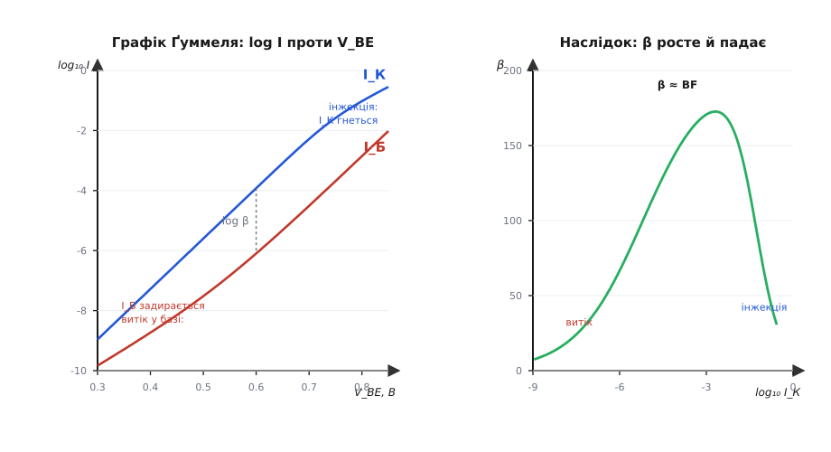
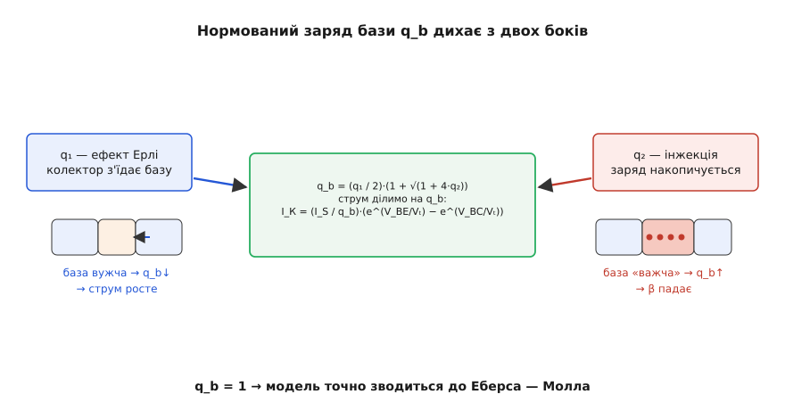
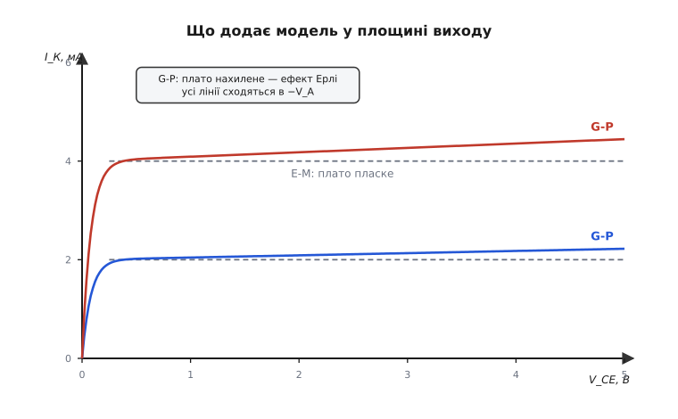

# Модель Ґуммеля — Пуна

<preknowlist>
- [Модель Еберса — Молла](book:electronics/ebers-moll) — велико-сигнальна модель BJT як двох зчеплених діодів; струми виводів із двох напруг переходів.
- [ВАХ діода](book:electronics/diode-iv-curve) — експонента Шоклі I = Iₛ·(e^(V/Vₜ) − 1) і тепловий потенціал Vₜ ≈ 26 мВ.
- [Робота BJT](book:electronics/bjt-operation) — три шари (емітер, база, колектор), тонка база, два p-n-переходи.
- [Підсилення β](book:electronics/bjt-gain) — коефіцієнт передавання струму β = I_К/I_Б.
- [Ефект Ерлі](book:electronics/early-effect) — зворотна напруга на колекторі звужує базу й трохи піднімає струм колектора.
</preknowlist>

[Модель Еберса — Молла](book:electronics/ebers-moll) ловить кістяк транзистора двома зчепленими діодами й трьома рядками рівнянь — і сімдесят років лишається правильною. Але в ній зашита одна тиха неправда: вона каже, що β — стале. Візьміть один транзистор, проженіть крізь нього струм від наноампера до сотень міліампер і щоразу поділіть I_К на I_Б — і побачите, що β не стоїть на місці. При крихітних струмах воно мале. Далі росте й виходить на пласке плато. А на великих струмах знову валиться. Накресліть β проти струму — і вийде не пряма, а дзвін.

Це не примха окремого зразка — так поводиться кожен біполярний транзистор. І щойно ви ставите його в реальну схему — рахуєте робочу точку підсилювача, кидаєте великий струм, шукаєте, де починаються спотворення, — пласке β Еберса й Молла бреше саме там, де ціна помилки найвища. Потрібна була модель, чесна на всьому діапазоні струмів. Її 1970 року в Bell Labs дали [Герман Ґуммель і Пун](book:electronics/gummel-poon/hist-gummel-poon.md), і саме вона з того часу сидить усередині кожного симулятора кіл як «той самий» транзистор.

## Чому β не стале

Щоб полагодити модель, спершу треба зрозуміти, звідки береться дзвін. Два його схили — це дві різні фізичні причини, кожна на своєму кінці струму.

**Малі струми: зайвий струм бази.** Струм бази — це втрати: те, що не долетіло крізь базу до колектора. У чистій картині ці втрати — рекомбінація в об'ємі бази, і вона дає ту саму експоненту, що й колекторний струм, тільки в β разів меншу. Але є ще одне джерело втрат, про яке Еберс і Молл мовчать: рекомбінація прямо в збідненому шарі переходу база–емітер. Її струм росте повільнішою експонентою — з іншим показником — і при малих напругах виявляється більшим за «чесний» струм бази. Тоді I_Б роздуте цим витоком, а I_К ще малий — і β виходить маленьке. Коли напругу піднімають, головна експонента наздоганяє й переганяє витік, і β росте до свого номіналу.

**Великі струми: високий рівень інжекції.** На іншому кінці ламається вже колекторний струм. Поки вприснутих у базу носіїв мало проти власного легування бази, усе лінійно. Та коли струм такий, що інжектованих електронів у базі стає стільки ж, скільки там рідних дірок, база мусить підтягти додаткові дірки, щоб лишитися електрично нейтральною. Цей надлишковий заряд гальмує перенос: колекторний струм перестає йти вгору повною експонентою, його показник ніби вдвічі слабшає. I_К відстає — і β знову падає. Такий режим називають високим рівнем інжекції (англ. *high-level injection*).

> 🔧 **Навіщо це.** Це не край для екзотики. Вихідний каскад звукового підсилювача, драйвер мотора, будь-що потужне ганяє транзистор саме в зону, де β просіло від інжекції — і якщо модель цього не знає, симулятор пообіцяє вам підсилення й розсіювану потужність, яких у залізі не буде. А датчикові кола на нанострумах живуть на лівому схилі дзвону, де β валить витік. Пласка модель бреше на обох кінцях робочого діапазону.



*Ліворуч: логарифми I_К і I_Б проти напруги V_BE. У середині — дві паралельні прямі, і вертикальний проміжок між ними є log β. На низьких напругах крива I_Б задирається (витік у переході), на високих — крива I_К гнеться донизу (інжекція). Праворуч: те саме, перераховане в β проти струму колектора, — той самий дзвін, що знімають на реальному транзисторі.*

## Заряд у базі керує струмом

Ключ до полагодження — змінити сам погляд на те, що керує колекторним струмом. Здається, ним керує напруга V_BE. Але глибша правда інша: колекторний струм задає **заряд, що сидить у базі**. Носії мусять продифундувати крізь базу, а швидкість цієї дифузії тим менша, чим більше заряду вже в базі накопичено — байдуже, рідне то легування чи вприснуті носії. Більше заряду в базі — важче переносити — менший струм при тій самій напрузі.

Скільки саме заряду в базі — величина не абстрактна. Проінтегрований по товщині бази заряд легування має власну назву — [число Ґуммеля](book:electronics/gummel-poon/math-base-charge.md), і саме воно задає струм насичення I_S: густіша й товща база — більше число Ґуммеля — менший струм. Ось цю думку Ґуммель і Пун і зробили серцем моделі.

Вони записали колекторний струм так само, як Еберс і Молл, але поділили його на **нормований заряд бази** — безрозмірне число q_b, що дорівнює одиниці в ідеальному випадку:

```
I_К = (I_S / q_b)·(e^(V_BE/Vₜ) − e^(V_BC/Vₜ))
```

Коли q_b = 1, це буква в букву транспортний струм Еберса — Молла. Уся нова фізика захована в одному: як q_b відхиляється від одиниці зі зміщенням. Заряд у базі не сталий — він дихає. І варто йому подихати, як обидва схили дзвону випадають самі.

## Як дихає q_b

Нормований заряд бази піддається двом впливам, і кожен тягне його у свій бік:

```
q_b = (q₁ / 2)·(1 + √(1 + 4·q₂))
```

**q₁ — звуження бази (ефект Ерлі).** Зворотно зміщений колектор розширює свій збіднений шар, і той з'їдає частину нейтральної бази. База тоншає — заряду в ній меншає — q_b стає трохи меншим за одиницю — струм колектора трохи більшим. Це рівно [ефект Ерлі](book:electronics/early-effect): нахил колись плаского плато вихідних характеристик угору. У Еберса й Молла плато було ідеально пласке; тут воно нахиляється саме собою, бо q₁ уже сидить у знаменнику.

**q₂ — високий рівень інжекції.** При великому струмі вприснутий заряд накопичується в базі, q_b росте понад одиницю — і колекторний струм гальмується. Це той самий правий схил дзвону: β падає, бо I_К ділиться на дедалі більший q_b.



*Один безрозмірний множник q_b несе обидва другорядні ефекти. Ліворуч q₁: збіднений шар колектора звужує базу — q_b меншає, струм росте (ефект Ерлі). Праворуч q₂: на великому струмі заряд накопичується — q_b більшає, β падає (інжекція). Коли обидва впливи мізерні, q_b = 1, і модель точно зводиться до Еберса — Молла.*

Зверніть увагу, яка це ощадність. Дві геть різні фізичні речі — розширення збідненого шару й перенасичення бази носіями — увіпхнуто в одне число, на яке ділиться струм. Модель не дописує окремих правил «а тепер урахуй Ерлі», «а тепер інжекцію». Вона лишає ту саму експоненту, що й раніше, і лише каже: поділи її на чесний заряд бази. Уся [математика нормованого заряду й повний набір рівнянь](book:electronics/gummel-poon/math-base-charge.md) — окрема, дуже показова історія.

## Струм бази з двох частин

Лівий схил дзвону вимагає ще однієї правки, уже в струмі бази. Ґуммель і Пун розписали його як **дві експоненти** замість однієї:

```
I_Б = (I_S/BF)·(e^(V_BE/Vₜ) − 1)  +  ISE·(e^(V_BE/(NE·Vₜ)) − 1)
```

Перший доданок — «ідеальний» струм бази, той, що дає номінальне β = BF (від *beta forward*). Другий — витік: рекомбінація в переході, зі своїм струмом ISE й показником NE (типово 1.5…2). Через більший NE друга експонента полога — на графіку Ґуммеля вона йде меншим нахилом. При малих напругах вона більша й панує (β мале), при більших головна експонента її переганяє (β виходить на BF). Ось чому на графіку Ґуммеля крива I_Б унизу задирається окремим, пологішим коліном, а крива I_К лишається прямою: витік сидить лише в базі.

## Графік Ґуммеля — як це бачать

Графік, що вже траплявся вище, — не просто ілюстрація, а робочий інструмент, і теж носить ім'я Ґуммеля. Знімається просто: сполучають базу з колектором (V_BC = 0), плавно піднімають V_BE й у логарифмі малюють обидва струми. Що видно:

- **У середині** — дві паралельні прямі. Прямі, бо струм іде чистою експонентою; паралельні, бо I_К і I_Б ростуть в унісон; а проміжок між ними по вертикалі й є log β. Стале β — це сталий проміжок.
- **Унизу** крива I_Б відхиляється вгору від прямої — прокинувся витік. Проміжок звужується, β падає.
- **Угорі** крива I_К загинається вниз — інжекція роздуває q_b. Проміжок знову звужується, β падає.

Уся модель Ґуммеля — Пуна, по суті, — це набір параметрів, підібраних так, щоб точно відтворити цей графік конкретного транзистора. Виміряли графік — витягли з нього I_S, BF, IKF, ISE, NE — і модель готова.

**Порахуймо β у трьох точках.** Візьмімо транзистор з I_S = 10⁻¹⁴ А, BF = 200, струмом коліна високої інжекції IKF = 50 мА, витоком ISE = 10⁻¹³ А, NE = 1.6. Знайдімо β при трьох напругах V_BE (Vₜ = 25.85 мВ).

```
V_BE = 0.45 В  (малий струм)
  e^(V_BE/Vₜ)  = e^17.41 = 3.6·10⁷
  I_К ≈ I_S·e   = 1e-14 · 3.6e7 = 3.6·10⁻⁷ А = 0.36 мкА      (q_b ≈ 1)
  I_Б = I_S/BF·e + ISE·e^(V_BE/(NE·Vₜ))
      = 1.8 нА + 1e-13·e^10.88 = 1.8 нА + 5.3 нА = 7.1 нА
  β   = 0.36 мкА / 7.1 нА ≈ 51            ← витік тягне вниз

V_BE = 0.70 В  (робочий струм)
  e^(V_BE/Vₜ)  = e^27.08 = 5.76·10¹¹
  q₂  = (I_S/IKF)·e = (1e-14/0.05)·5.76e11 = 0.115
  q_b = 0.5·(1 + √(1 + 4·0.115)) = 1.10
  I_К = I_S·e / q_b = 5.76 мА / 1.10 = 5.2 мА
  I_Б = 29 мкА + 2.2 мкА = 31 мкА
  β   = 5.2 мА / 31 мкА ≈ 168             ← близько до BF

V_BE = 0.80 В  (великий струм)
  e^(V_BE/Vₜ)  = e^30.95 = 2.75·10¹³
  q₂  = (1e-14/0.05)·2.75e13 = 5.5
  q_b = 0.5·(1 + √(1 + 22)) = 2.9
  I_К = 275 мА / 2.9 = 95 мА
  I_Б = 1.38 мА + 0.025 мА = 1.4 мА
  β   = 95 мА / 1.4 мА ≈ 68               ← інжекція тягне вниз
```

**Висновок.** Той самий транзистор дав β = 51, 168 і 68 — рівно дзвін. У середині q_b ще коло одиниці, витік уже позаду — β сягає майже BF. Ліворуч його рубає витік у базі, праворуч — роздутий інжекцією q_b (майже втричі!). Жодне з цих трьох чисел не вивелося б з моделі Еберса — Молла: вона на всі три струми дала б рівно 200.



*Вихідні характеристики: пунктир — ідеально пласке плато базової моделі, суцільні лінії — нахилене плато Ґуммеля — Пуна. Нахил дає ефект Ерлі (член q₁): продовжені вліво, усі лінії сходяться в спільній точці −V_A на осі напруги. Коло V_CE = 0 обидві криві однаково завалюються в насичення.*

## Не лише постійний струм

Дотепер ішлося про статику — струми при сталих напругах. Але модель Ґуммеля — Пуна несе й динаміку, і саме тому годиться на все. До неї добудовано: **опір бази** R_B (та ще й залежний від струму — при великому струмі шлях у базі коротшає); **ємності переходів**, що заряджаються й розряджаються при зміні напруг; і **часи прольоту** τ_F, τ_R — заряд, який встигає накопичитися в базі, поки транзистор веде струм. Саме цей накопичений заряд визначає, [як швидко транзистор перемикається](book:electronics/bjt-switching-speed): щоб замкнути його, заряд треба спершу вимести.

З цих динамічних елементів виходить і частотна поведінка, і швидкість комутації. А [мала-сигнальна модель](book:electronics/bjt-small-signal) — знаменита гібридна π-схема з крутістю g_m і опором r_π — випадає з великої простим диференціюванням у робочій точці. Одна велико-сигнальна модель годує і сталий струм, і змінний сигнал, і перехідний процес.

## Модель на роботі

Коли ви ставите транзистор у [SPICE](book:electronics/spice-simulation) і тиснете «симулювати», всередині рахується саме модель Ґуммеля — Пуна. Рядок `.model` з параметрами `IS`, `BF`, `VAF`, `IKF`, `ISE`, `NE`, `RB`, `CJE`, `CJC`, `TF` — це її параметри, один в один. Виробник знімає з реального транзистора графік Ґуммеля й вихідні характеристики, витягає з них ці числа й кладе в модель — щоб ви симулювали справжню деталь, а не абстракцію. [Як прочитати такий рядок і власноруч відтворити з нього графік Ґуммеля в коді](book:electronics/gummel-poon/proj-spice-bjt-params.md) — окрема практична вправа.

Модель не застигла. Для надшвидких і надточних приладів — НВЧ-транзисторів, кремній-германієвих гетеропереходів — її розширили в наступників: VBIC, Mextram, HICUM, що додають ефекти, яких Ґуммель і Пун 1970 року ще не мусили ловити. Але всі вони виросли з того самого ядра, і для переважної більшості звичайних кіл модель Ґуммеля — Пуна лишається робочою конякою — тим, що вивчають і чим рахують за замовчуванням.

І в цьому вся її краса. Еберс і Молл дали транзисторові скелет — два зчеплені діоди. Ґуммель і Пун додали до нього дихання: один безрозмірний заряд бази q_b, що меншає від звуження й більшає від перенасичення, — і крива підсилення в моделі нарешті збіглася з тією, яку тестер знімає з живого транзистора.
