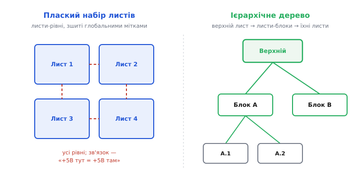
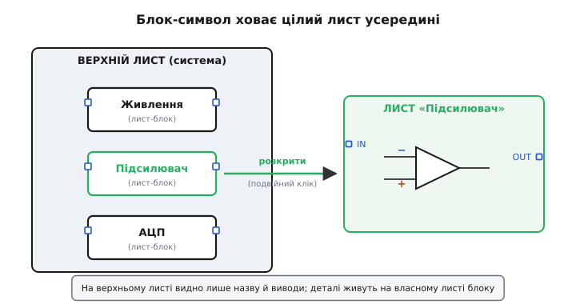
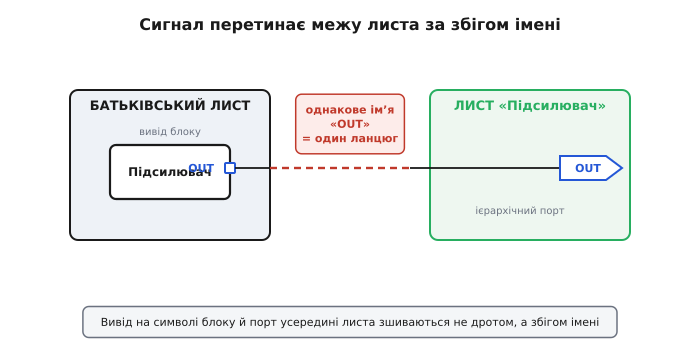
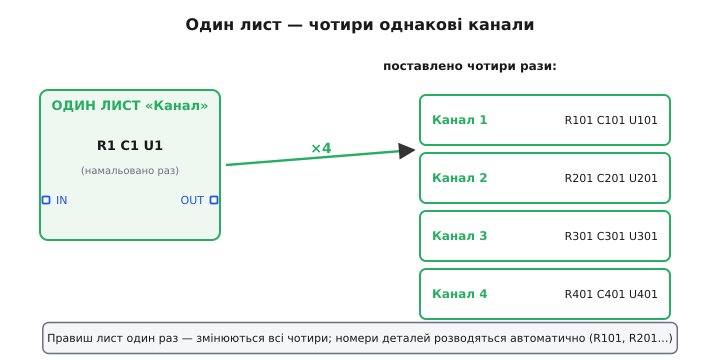

# Ієрархічні схеми і листи

Реальна електроніка не вміщається на один аркуш. Платка з мікроконтролером, кількома підсилювачами, живленням і десятком роз'ємів — це сотні деталей і ще більше ланцюгів; спробуйте втиснути все це на одну [принципову схему](book:electronics/schematic-purpose) — і вийде павутина, у якій ні автор, ні рецензент за тиждень не розбереться. Тож велику схему **ділять**. Питання лише — як саме. І тут є два різні устрої: розкласти все на кілька аркушів-рівних або вибудувати **ієрархію** (гр. *hierarkhía* — «священноначаліє», устрій із підпорядкуванням рівнів) — дерево, де верхній аркуш показує систему великими блоками, а кожен блок ховає в собі окремий аркуш із деталями. Розберімо обидва устрої від першопричини: навіщо ділити саме так, як при цьому зшиваються сигнали між аркушами й чому ієрархія дає те, чого плаский поділ дати не може.


*Два способи розкласти велику схему. Плаский: листи однакового рангу, зв'язані «за іменем» (мітка «+5В» тут = «+5В» там). Ієрархічний: верхній лист із блоками, кожен блок — вхід до свого листа, той — ще глибше; виходить дерево з підпорядкуванням.*

## Чому одного аркуша замало

Почнімо з очевидного болю. Принципова схема цінна **однозначністю** й тим, що її **читають очима**: інженер веде погляд від входу до виходу й розуміє, що коло робить. Щойно деталей стає кілька сотень, ця читабельність зникає. Лінії перетинаються десятками, [мітки ланцюгів](book:electronics/schematic-line-conventions) тягнуться через увесь лист, однакові вузли повторюються в різних кутах — і схема перетворюється на ребус. Друк теж не рятує: аркуш формату, де видно кожен напис, фізично не вміщає тисячу символів.

Отже, ділити доведеться. Та поділ — не лише про те, щоб «влізло на папір». Хороший поділ робить схему **зрозумілою на двох рівнях відразу**: згори видно, **з чого** складається пристрій (живлення, підсилювач, перетворювач, інтерфейс), а зайшовши всередину частини — **як** саме вона зроблена. Це той самий принцип, яким програміст розбиває код на функції: головна функція читається як план, а тіло кожної — окремо й детально.

> 🔧 **Навіщо це.** Поділ схеми — це насамперед інструмент **командної роботи й ревізії**. На плаский «простирадловий» лист неможливо посадити двох інженерів; ієрархію ж ділять природно — один веде аналоговий тракт, інший живлення, третій цифру, і кожен працює на своєму листі, не наступаючи на чужий. Рецензент так само перевіряє пристрій частинами: спершу верхній лист — чи правильно блоки з'єднані між собою, тоді кожен блок окремо. Помилка, схована в павутині одного аркуша, на охайному дереві просто не має де сховатися.

## Плаский поділ: листи як розділи книги

Найпростіший спосіб поділу — **плаский** (англ. *flat*): розрізати схему на кілька аркушів **однакового рангу**, як розділи в книзі. Лист 1 — живлення, лист 2 — аналоговий тракт, лист 3 — цифра. Жоден не «головніший» за інший; разом вони і є повна схема.

Лишається одне питання: коли сигнал народжується на одному листі, а потрібен на іншому, — як його туди провести, якщо дроту через межу аркуша не намалюєш? Відповідь — той самий прийом «**з'єднання за іменем**», що рятує й на одному листі. Мітку живлення «+5В» на листі 1 і таку саму «+5В» на листі 3 редактор **зшиває в один ланцюг** автоматично, хоч дроту між ними нема. Для сигналів, що ходять між листами, ставлять трохи особливі мітки — **міжаркушеві конектори** (англ. *off-page connector*, «конектор поза сторінкою»): значок-прапорець, що явно каже «цей сигнал іде звідси на інший лист». Він робить **видимою** межу: читач одразу бачить точку переходу, замість гадати, звідки взялася однойменна мітка. Як саме мітки, шини й порти зшивають ланцюги між аркушами — у статті про [лінії та з'єднання на схемі](book:electronics/schematic-line-conventions).

Плаский поділ швидкий і зрозумілий, та має стелю. Зв'язок «за іменем» **глобальний і пласкій**: будь-яка «+5В» сполучається з будь-якою «+5В» по всьому проєкту. Поки листів три-чотири — це зручно; коли їх двадцять, простежити, **куди** розбіглася якась мітка, стає важко, а випадковий збіг імен («CLK» у двох незалежних місцях) тихо закоротить два різні кола. І головне: плаский набір **не показує структури**. Чотири рівні листи нічого не кажуть про те, що з чого складається; ієрархії в них немає, бо за устроєм її там і нема.

## Ієрархія: блок, що ховає цілий лист

Ось де з'являється головна ідея. А що, як замість того щоб класти листи поряд, **вкласти** один лист в інший? На верхньому листі намалювати не деталі, а **блок** — простий прямокутник із назвою «Підсилювач» і кількома виводами, — а за цим блоком сховати **окремий лист**, на якому підсилювач намальовано вже зі схеми: транзистори, резистори, зворотний зв'язок. Згори видно лише назву й виводи; «всередині» (подвійним кліком у редакторі) розкривається повна схема блоку.


*Серце ієрархії: блок-символ на верхньому листі — це лише «обкладинка». Він показує назву частини та її виводи, а вся схема живе на власному листі цього блоку, який відкривають окремо.*

Цей прямокутник називають **листовим символом** або **символом-блоком** (англ. *sheet symbol*): на схемі він — звичайна деталь із виводами, але «начинка» в нього не транзистор, а **цілий підлеглий лист** (англ. *child sheet* — «дочірній лист»; той, що містить блок, — *parent*, «батьківський»). Виходить дворівнева картина: батьківський лист — це **план** системи, де блоки сполучені між собою товстими зрозумілими лініями; а кожен дочірній лист — **детальна реалізація** одного блоку. Нічого не заважає вкласти ще глибше: усередині дочірнього листа теж може стояти свій блок зі своїм листом. Так виростає **дерево** — верхній лист, його блоки, листи блоків, їхні блоки — рівно настільки глибоке, наскільки складний пристрій.

Аналогія з кодом тут майже точна, і нею варто скористатися. Блок-символ — це **виклик функції**: у місці виклику ви бачите лише ім'я й аргументи (`amplify(in, out)`), а тіло функції — окремо. Батьківський лист читається як головна програма: послідовність викликів, загальний задум. Дочірній лист — тіло функції: тут уже видно, **як** воно зроблено. Аналогія ламається в одному: функцію в коді **виконують**, передаючи керування всередину, а блок на схемі нічого не «викликає» — він просто **межа видимості на кресленні**. Електрично дерева немає взагалі: коли справа дійде до плати, уся ієрархія **сплющиться** назад в один великий список ланцюгів. Дерево — це зручність для **людини** й для **повторного використання**, а не фізична будова кола.

## Як сигнал перетинає межу блоку

Якщо начинка блоку схована на окремому листі, постає те саме питання, що й при плоскому поділі, але гостріше: як завести сигнал **ззовні** блоку (з батьківського листа) **всередину** (на дочірній)? Тут працює акуратний механізм із двох частин, що зшиваються — знову — **за іменем**.


*Дві половинки одного з'єднання. На символі блоку (батьківський бік) сигнал виходить через **вивід блоку** з іменем «OUT». На дочірньому листі той самий сигнал позначено **ієрархічним портом** «OUT». Збіг імен зшиває їх в один ланцюг — наскрізь через межу аркуша.*

З боку батьківського листа на краю блоку малюють **вивід блоку** (англ. *sheet entry* — «вхід листа», або *sheet pin*): маленький значок із іменем, скажімо «OUT». До нього на батьківському листі під'єднують звичайний дріт чи мітку — як до будь-якого виводу деталі. А на самому дочірньому листі ставлять його пару — **ієрархічний порт** (англ. *hierarchical port*, або *hierarchical label* — «ієрархічна мітка»): значок-прапорець із **тим самим іменем** «OUT», прив'язаний до тієї точки схеми, що має виходити назовні. Редактор, бачачи однакове ім'я на обох рівнях, **зшиває** їх: вузол усередині дочірнього листа й дріт зовні на батьківському стають **одним ланцюгом**. Сигнал проходить крізь межу аркуша, хоч жодна лінія її не перетинає.

Тонкість, на якій спотикаються початківці: зшиває саме **збіг імен**, а не геометрія. Вивід «OUT» на блоці й порт «OUT» усередині мусять називатися **точно однаково**; перейменуєте одне — з'єднання тихо розірветься, хоч на вигляд усе на місці. Тому виводи блоку й порти дочірнього листа тримають у строгій відповідності: скільки портів усередині — стільки виводів на символі, і назви — літера в літеру. Гарні редактори вміють **згенерувати** виводи символу з портів дочірнього листа автоматично, саме щоб людина не наплутала з іменами.

Через таку межу проводять не лише поодинокі сигнали, а й **[шину](book:electronics/net-bus-notation)** — жмут однотипних ліній на кшталт `DATA[0..7]`, згорнутий в одну. Тоді й вивід блоку, і порт усередині оголошують шиною з тим самим діапазоном — і всі вісім ліній перетинають межу одним охайним з'єднанням замість восьми.

## Справжній виграш: один лист — багато копій

Досі ієрархія виглядала як спосіб **прибрати безлад**. Але головна її сила в іншому, і саме вона робить ієрархію незамінною — **повторне використання**. Уявіть прилад на чотири однакові канали: чотиривходовий вимірювач, де кожен вхід — той самий підсилювач із тим самим фільтром. Малювати чотири однакові копії схеми вручну — це вчетверо більше роботи й, головне, **вчетверо більше місць для помилки**: виправив номінал резистора в трьох каналах, а в четвертому забув — і канал поводиться інакше, причому мовчки.


*Повторне використання: схему каналу малюють **один раз** на окремому листі, а на верхньому листі ставлять **чотири блоки**, що вказують на той самий лист. Правка одного листа змінює всі чотири канали разом.*

Ієрархія розв'язує це елегантно: схему каналу малюють **один раз** на окремому листі, а на верхньому листі ставлять **чотири блоки-символи**, кожен з яких указує на **той самий** дочірній лист. Один лист-визначення — чотири його **екземпляри** (англ. *instance* — «втілення»). Виправили резистор на тому єдиному листі — змінилися **всі чотири** канали відразу, бо вони не копії, а посилання на одне джерело. Помилці «забув у четвертому» просто немає де взятися.

Тут спливає одна тонкість, яку ієрархія мусить розрулити. На дочірньому листі резистор підписано «R1». Та якщо лист поставлено чотири рази, у пристрої з'являється **чотири** фізичні резистори «R1» — а так не можна: кожна деталь на платі повинна мати **унікальний** [позиційний номер](book:electronics/nodes-connections) (англ. *reference designator*), щоб монтажник і програма знали, який саме це елемент. Редактор розв'язує це **розведенням номерів за екземплярами**: у першому каналі «R1» стає «R101», у другому «R201», у третьому «R301» — той самий шаблон, але кожна копія дістає свій унікальний набір. На листі-визначенні ви бачите загальне «R1»; у конкретному екземплярі воно перетворюється на конкретний номер. Так зберігається і зручність (малюємо раз), і фізична однозначність (кожна деталь унікальна).

## Дерево існує лише на кресленні: плоский нетлист

Варто чітко зафіксувати межу аналогії з деревом, бо саме тут плутаються. Ієрархія — це устрій **креслення**, а не кола. Коли схему перетворюють на плату, редактор **сплющує** все дерево: проходить кожен лист, на кожному екземплярі підставляє унікальні номери деталей, зшиває ланцюги через виводи блоків і порти — і складає єдиний пласкій [нетлист](book:electronics/schematic-line-conventions/proj-netlist-build.md): простий перелік ланцюгів, де для кожного зібрано **всі** піни, що мусять бути сполучені, без жодного сліду рівнів і блоків. Платі байдуже, що канал намальовано раз і поставлено чотири; на ній стоять чотири окремі резистори R101, R201, R301, R401, і кожен має свою мідну доріжку.

Це означає просту, але важливу річ: **електрично ієрархія нічого не змінює**. Те саме коло можна накреслити плоско на двадцяти аркушах або деревом — нетлист вийде той самий, плата та сама. Ієрархія — суто про те, як **людині** зручніше це коло описати, прочитати й повторити. Тому й перевірка коректності з'єднань — **електрична перевірка правил** (англ. *Electrical Rule Check*, ERC) — працює вже на сплющеному нетлисті: вона ловить вивід блоку без пари-порту, порт без виводу, два виходи, зведені в один ланцюг, висячі піни — незалежно від того, на якому рівні дерева вони намальовані.

## Як це лягає у прошивку

Структура схеми зазвичай **дзеркалиться** в коді — і це не випадковість, а та сама декомпозиція, лише в іншому матеріалі. Якщо на схемі чотири однакові канали-екземпляри, то й у прошивці природно мати **одну** функцію обробки каналу, яку викликають для кожного з чотирьох. Блок на схемі й функція в коді — рідня: обидва ховають деталі за іменем і виводами/аргументами.

**Worked-приклад: чотири канали схеми → одна функція в коді.** Нехай кожен канал віддає своє виміряне значення на свій вивід АЦП. Лист каналу намальовано раз — і код каналу пишемо раз, а «розводимо за екземпляром» так само, як редактор розводить номери деталей: переліком пінів.

```c
// Один «лист-блок» каналу на схемі  →  одна функція в коді.
// Чотири екземпляри каналу  →  чотири піни АЦП у масиві.
#define N_CHAN  4
static const uint8_t CH_ADC_PIN[N_CHAN] = { 0, 1, 2, 3 };  // канали 1..4

float read_channel(uint8_t ch)          // = «дочірній лист», написаний раз
{
    uint16_t raw = adc_read(CH_ADC_PIN[ch]);   // вивід-порт цього екземпляра
    return raw * (3.3f / 4095.0f);             // код → вольти (12-бітний АЦП)
}

void scan_all(float out[N_CHAN])        // = «верхній лист»: ставить блок ×4
{
    for (uint8_t ch = 0; ch < N_CHAN; ch++)
        out[ch] = read_channel(ch);     // той самий блок, інший екземпляр
}
```

Логіка та сама, що в ієрархії: `read_channel` — це визначення (один лист), цикл у `scan_all` — чотири екземпляри, а масив `CH_ADC_PIN` грає роль «розведення виводів» — він каже, на який фізичний пін заведено порт кожного екземпляра. Виправили обчислення в `read_channel` один раз — змінилися всі чотири канали, точно як правка єдиного дочірнього листа міняє всі його екземпляри.

А «з'єднання за іменем» через межу блоку в коді виглядає як **узгоджена назва ланцюга та піна**. Якщо порт каналу зветься `OUT`, а на батьківському листі він заведений на конкретний вивід мікроконтролера, то в прошивці цей вивід підхоплює весь ланцюг `OUT` цього екземпляра:

```c
// Порт «EN» дочірнього листа, заведений на вивід блоку,
// у коді — просто номер піна. Увімкнути канал = підняти його лінію EN.
#define CH1_EN_PIN  12          // куди на батьківському листі заведено EN каналу 1

gpio_set_direction(CH1_EN_PIN, GPIO_OUT);
gpio_set_level(CH1_EN_PIN, 1);  // високий рівень на весь ланцюг EN каналу 1
```

## Коли ієрархія, а коли простіше без неї

Ієрархія — потужний, але не безкоштовний інструмент, і тверезо обрати рівень поділу важливіше, ніж застосувати його скрізь. Орієнтир простий і випливає з усього сказаного.

**Плаский поділ доречний**, коли схема велика, але **різнорідна** й невелика числом листів: три-чотири аркуші-розділи (живлення, аналог, цифра), що не повторюються. Тягнути сюди дерево — зайва церемонія; листи-рівні, зшиті кількома зрозумілими мітками, читаються чудово.

**Ієрархія виправдовує себе**, щойно з'являється **повторення** (кілька однакових каналів, фаз, портів — малюємо раз, ставимо багато) або коли система настільки велика, що її треба **бачити планом**: верхній лист із блоками як карта, по якій орієнтуєшся, перш ніж пірнати в деталі. Чим більше однакових частин — тим більший виграш, бо кожна правка робиться в одному місці.

А ось чого ієрархія **не** робить — вона не прискорює саме коло й не економить деталей на платі: чотири екземпляри каналу — це чотири повні набори фізичних компонентів, скільки б разів лист не був намальований. Помилка думати, що «вклав у блок — стало менше». Менше стає **роботи й місць для помилки на кресленні**; заліза рівно стільки, скільки його в сплющеному нетлисті.

> 🔧 **Навіщо це.** На практиці саме ієрархія перетворює одноразову схему на **бібліотеку багаторазових вузлів**. Відлагоджений блок живлення, аналоговий фронтенд чи інтерфейсний роз'єм оформлюють окремим листом — і переносять із проєкту в проєкт як готову, перевірену цеглинку, не перемальовуючи й не ризикуючи повторити стару помилку. Це той самий хід, що й бібліотека функцій у програмуванні: один раз зробив добре — користуєшся багато разів.

## Коротко про устрій схеми за рівнями

Велику схему не вмістити на один читабельний аркуш, тож її ділять — і ділять одним із двох устроїв. **Плаский** поділ кладе листи поряд як рівні розділи, зшиваючи сигнали між ними **за іменем** (мітки й міжаркушеві конектори); він швидкий, але без структури й зі стелею при багатьох листах. **Ієрархія** натомість вибудовує **дерево**: на верхньому листі стоять **блоки-символи**, кожен ховає окремий **дочірній лист** із деталями, а сигнал перетинає межу через пару «**вивід блоку ↔ ієрархічний порт**», зшиту знову ж таки **збігом імені**. Головний виграш ієрархії — **повторне використання**: один лист-визначення, багато екземплярів, унікальні номери деталей розводяться автоматично, а правка робиться в одному місці. Та хоч як накреслено — деревом чи плоско, — електрично це одне коло: редактор **сплющує** ієрархію в єдиний пласкій нетлист, і саме на ньому стоїть плата та працює перевірка з'єднань. Дерево живе для людини; коло про нього не знає.

Ширша абетка, на якій це тримається: [що таке принципова схема й навіщо вона](book:electronics/schematic-purpose), [електричний зміст вузла та з'єднання](book:electronics/nodes-connections), [граматика ліній, міток і шин](book:electronics/schematic-line-conventions). Хто й коли навчив креслярські редактори ховати лист у блоці й повторювати його екземплярами — у нарисі [звідки взялися ієрархічні схеми](book:electronics/hierarchical-schematics/hist-sheet-symbols.md).
