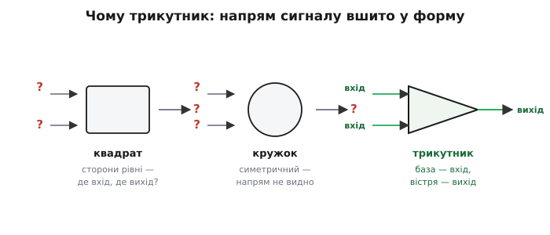

# 📜 Звідки трикутник: символ підсилювача й патент 1941 року

> Історична вставка до [символу мікросхеми на схемі](topic:electronics/ic-schematic-symbol). Чому підсилювач малюють саме **трикутником**, а не квадратом чи кружком? Питання здається дрібним — звичай і звичай. Та за трикутником стоїть ціла епоха: машини, що рахували **напругами**, а не цифрами; патент воєнного часу, поданий за пів року до Перл-Гарбора; зенітна гармата, що вперше навчилася влучати в літак, бо всередині неї стояв підсилювач, який «розв'язував рівняння»; і десятиліття, поки звичай малювати трикутник перетворився на офіційну норму з номером стандарту. Це історія про те, як **форма набула сенсу** — і чому той сенс пережив лампи, аналогові машини й кілька поколінь техніки.

Трикутник не намалював «хтось один певного дня». Він **виріс** — як виростає стежка там, де найзручніше ходити. Щоб зрозуміти, звідки він узявся, треба спершу побачити, **навіщо** взагалі знадобився підсилювач, який не просто гучніше грає, а **рахує**. Бо саме звідти — від машин, що рахували напругами, — і пішла форма.

---

## Машини, що рахували напругою

Сьогодні слово «комп'ютер» означає машину, що оперує **числами** — нулями й одиницями. Та до середини XX століття панував зовсім інший підхід: рахувати не цифрами, а **фізичними величинами**, які підкоряються тим самим рівнянням, що й задача. Хочеш додати два числа — візьми дві напруги й склади їх. Хочеш проінтегрувати — нехай напруга заряджає конденсатор, бо заряд на конденсаторі **і є** інтеграл струму за часом. Машину, що так працює, називають **аналоговим обчислювачем** (від гр. *análogos* — «відповідний, співмірний»): її напруги **відповідають** величинам задачі, поводяться за тими ж законами, тож відповідь можна просто **зміряти вольтметром**.

> 🔧 **Навіщо це.** Здавалося б, давнина — кому тепер рахувати напругами? Але саме звідси ростуть і назва «операційний підсилювач», і його символ, і пів аналогової схемотехніки. Інтегратор на ОП, суматор на ОП, масштабатор — це **прямі нащадки** блоків аналогового обчислювача. Зрозумівши, навіщо колись складали напруги, ви по-новому бачите, чому той самий підсилювач і досі вміє додавати, інтегрувати й множити сигнали.

Серцем такої машини був **підсилювач** особливого роду. Звичайний підсилювач у радіо просто робить сигнал гучнішим — і його точність нікого надто не турбує: на слух похибка в кілька відсотків непомітна. Обчислювальний підсилювач — інша річ. Якщо він має **чесно** складати чи інтегрувати напруги, його власні похибки мусять бути мізерні, інакше відповідь попливе. Тому такий підсилювач робили з **величезним запасом підсилення** і **загортали його у від'ємний зворотний зв'язок** (про сам принцип — нижче), щоб точність задавали не примхливі лампи, а **зовнішні резистори й конденсатори**, які можна підібрати точно. Підсилення слугувало не «гучності», а **точності операції**. Звідси й назва, що закріпиться згодом: **операційний** підсилювач — той, на якому виконують математичні **операції**.

А на схемі такої машини кожен підсилювальний блок треба було якось **намалювати**. І ось тут зародився трикутник.

## Чому саме трикутник

Уявіть інженера, що креслить схему аналогового обчислювача в 1940-х. У нього десятки однакових за роллю блоків: цей складає напруги, той інтегрує, той масштабує. Малювати в кожному повну лампову схему — божевілля: аркуш потоне в деталях, а сенс — «куди тече сигнал і що з ним роблять» — загубиться. Потрібен **знак-замінник**: проста фігура, що каже «тут підсилювач», і не каже нічого зайвого.

Чому з усіх фігур прижився трикутник? Бо він має **вбудований напрям**. У квадрата чи кружка всі сторони рівноправні — дивлячись на них, не вгадаєш, де вхід, а де вихід; доводиться кожен раз підписувати. А трикутник **сам показує течію**: широка сторона — це бік, куди сигнал **заходить**, гостре вістря — звідки **виходить**. Форма ніби стискає потік від багатьох входів до одного виходу, мов лійка чи вістря стріли. Око читає напрям **миттєво, без підпису** — а в схемі на сотні блоків це рятує години.

*Чому трикутник, а не квадрат. Квадрат і кружок симетричні — напрям сигналу в них непомітний, його доводиться підписувати щоразу. Трикутник асиметричний: широка база природно читається як «вхід», вістря — як «вихід». Форма сама вказує, куди тече підсилений сигнал, тож на великій схемі око орієнтується вмить.*

Цю саму логіку згодом закодували й у спорідненому світі — у блок-схемах систем керування, де трикутником позначають **ланку з коефіцієнтом підсилення** (множення сигналу на число). Скрізь, де щось **підсилює чи масштабує сигнал у певному напрямі**, рука інженера тягнеться до трикутника — бо напрям уже «вшитий» у форму. Це не випадковий збіг: і там, і там форму обрали за ту саму властивість — вона **показує, куди**.

Та одного зручного звичаю мало, щоб форма стала **галузевою нормою**. Для цього трикутник мав пройти крізь дуже конкретну, дуже серйозну техніку — і першим таким полем стала війна.

## Патент 1941 року: «підсумовувальний підсилювач» Шварцеля

Найраніший задокументований предок сучасного операційного підсилювача — патент США **US 2 401 779** з промовистою назвою **«Summing Amplifier»** («Підсумовувальний підсилювач»). Його автор — інженер лабораторій Белла **Карл Дейл Шварцель-молодший** (англ. *Karl Dale Swartzel Jr.*, 1907–1998). Дати варто назвати точно, бо саме навколо них пізніше виникла плутанина: заявку **подано 1 травня 1941 року** — за пів року до вступу США у війну, — а патент **видано 11 червня 1946 року**.

> Тут одразу варто зняти розбіжність у джерелах. Частина вторинних публікацій подає дату видачі як **11 липня** 1946 року. Це помилка переказу: і офіційний запис патентного відомства, і **титульна сторінка самого патенту** чітко стоять на даті **11 червня 1946 року** («June 11, 1946»). Тож **усталено**: подано 1.05.1941, видано **11.06.1946**; «липень» — похибка вторинних джерел, а не суперечка по суті.

Що ж було в тому патенті? **Триламповий** підсилювач постійного струму з дуже високим підсиленням — близько **90 дБ** (це коефіцієнт **порядку десятків тисяч разів**), що живився від двополярних шин **±350 В**. Слово «постійного струму» тут ключове: підсилювач чесно передавав і **повільні** зміни напруги, аж до нуля частоти, — а саме повільні напруги й несуть «числа» в аналоговому обчислювачі. Високе підсилення вкладали у **від'ємний зворотний зв'язок**, і тоді коефіцієнт усієї схеми задавали **зовнішні резистори**: кілька вхідних напруг через резистори зводилися в одну точку й **додавалися** — звідси й «summing», підсумовування.

> Залежність, без якої історія неповна. Те, що з підсилювача з велетенським «сирим» підсиленням виходить **точний** і передбачуваний блок, — заслуга **від'ємного зворотного зв'язку**: частину виходу повертають на вхід із протилежним знаком, і схема сама тримає рівновагу, а її поведінку диктують уже зовнішні резистори, не примхливі лампи. Саме цей принцип і робить підсилювач придатним для **чесних математичних операцій**. Докладніше — у статті [про від'ємний зворотний зв'язок](topic:electronics/negative-feedback).

Та звернімо увагу на одну деталь, важливу для нашої теми про **символ**. Підсилювач Шварцеля мав **один-єдиний вхід** — інвертувальний (сигнал на виході йшов у протилежний бік до входу). Звичних нам **двох** входів зі знаками «+» і «−» там ще **не було** — диференційна, двовхідна форма усталиться пізніше. Тобто трикутник на той час, якщо його й малювали, ще не носив на собі тих самих позначок, що сьогодні. Форма та її «начинка» — інвертувальний і неінвертувальний входи — складалися в сучасний символ **поступово**, не одним актом.

Важливо чесно розкласти, що тут чия заслуга, не зливаючи все в один міф «винайшов операційний підсилювач»:

- **Ідея** рахувати напругами й використовувати підсилювач зі зворотним зв'язком як «обчислювальний блок** — ширша за одну людину; вона визрівала в колі інженерів аналогових машин 1930–40-х.
- **Конкретна реалізація** саме підсумовувального підсилювача з високим підсиленням і ЗЗ, зафіксована в патенті, — **Шварцелева** (1941).
- **Назву** «операційний підсилювач» дав не він і не тоді — її **сформулював і ввів у вжиток** математик **Джон Раджаззіні** (англ. *John R. Ragazzini*) з Колумбійського університету в статті **1947 року**, уже описуючи клас таких підсилювачів для аналогових обчислень.
- **Патент** — це закріплення конкретного технічного рішення, а **не** доказ, що «ніхто доти не думав» у цьому напрямі; патент фіксує **реалізацію**, не саму лише ідею.

Отже статус: **усталено**, що Шварцелів патент — найраніший задокументований предок ОП; але «винахід операційного підсилювача» — **колективний** результат, де ідея, реалізація, назва й пізніша двовхідна форма належать **різним людям і рокам**. Малювати тут одного «батька» було б тим самим міфом про одинака-винахідника, якого варто уникати.

## Гармата, що навчилася влучати: M9 і радар SCR-584

Патент патентом, але справжню перевірку Шварцелів підсилювач пройшов **на війні** — і саме там непомітний обчислювальний блок зробив видиму, доленосну роботу. Щоб відчути її вагу, треба уявити задачу.

Літак летить високо й швидко. Зенітний снаряд летить до нього довгі секунди. За цей час літак встигне відлетіти далеко — отже стріляти треба **не туди, де він є, а туди, де він буде**. Це задача на **випередження**: узяти теперішнє положення й швидкість цілі, врахувати час польоту снаряда, вітер, балістику — і **обчислити точку зустрічі**, та ще й **безперервно**, бо ціль маневрує. Людина-навідник із цим не впорається: надто швидко, надто багато лічби.

Розв'язком став **директор вогню M9** (англ. *M9 gun director*) — електричний аналоговий обчислювач, розроблений у лабораторіях Белла. Він брав дані про ціль і **в реальному часі рахував напругами** кут і випередження для гармат. А «дані про ціль» постачав напарник M9 — радар **SCR-584**, що **сам стежив** за літаком, безперервно видаючи його координати. Радар каже, де ціль **зараз**; M9 рахує, куди стріляти, **щоб поцілити**; гармати наводяться автоматично. І в нутрощах M9, у тих ланцюгах, що складали й масштабували напруги-«числа», стояли **підсумовувальні підсилювачі** Шварцелевого роду.

Результат був разючий. У парі SCR-584 + M9 зенітники досягали небаченої доти влучності — у відомих епізодах кінця війни (зокрема проти німецьких крилатих ракет **V-1** над Англією та над Антверпеном) **частку збитих цілей** доводили до позначок **близько 90 %** на одну атаку, тоді як доти зенітна стрільба була переважно марнуванням снарядів.

> Тут — обережність із цифрою. «**~90 %**» — це **часто цитована**, добре задокументована оцінка для найкращих епізодів застосування зв'язки SCR-584 + M9 проти V-1; не варто читати її як «дев'ять із десяти будь-яких літаків будь-коли». Це **пік** ефективності в сприятливих умовах (повільна V-1 летить рівно, без маневру), а не середнє по всій війні. Статус: **усталено**, що система дала якісний стрибок влучності; конкретні відсотки — **залежать від епізоду** й умов.

> 🔧 **Навіщо це.** Цей епізод — найкращий доказ, **навіщо** обчислювальному підсилювачеві точність. Похибка в кілька відсотків на слух непомітна — але та сама похибка у випередженні зенітного вогню означає **промах**. Саме потреба **чесно рахувати напругами** під вогнем змусила робити підсилювачі з велетенським підсиленням і ЗЗ — а заразом дала формі трикутника серйозну, не «радіоаматорську» репутацію: це блок із **директора вогню**, не з підсилювача для грамофона.

Так трикутник пройшов хрещення найвимогливішою технікою свого часу. Війна скінчилася — і блоки аналогових обчислювачів, разом зі своєю формою, пішли у **цивільне** життя.

## Від воєнних машин до перших даташитів

Після війни аналогові обчислювачі вибухово поширилися: ними моделювали польоти ракет, хімічні реактори, електромережі, динаміку літаків — усе, що описується диференціальними рівняннями. Інженерові вже не хотілося щоразу **самому** паяти обчислювальний підсилювач із ламп; зручніше було купити **готовий блок** — «чорну скриньку», яку лишається ввімкнути.

Першим, хто перетворив обчислювальний підсилювач на **товар**, став американський інженер **Джордж Філбрик** (англ. *George A. Philbrick*, 1913–1974). Ще під час війни він робив для колег модульні «чорні скриньки», з яких ті збирали власні аналогові машини. А **1952 року** його фірма (*George A. Philbrick Researches*, GAP/R) випустила знаменитий **K2-W** — перший **серійний** операційний підсилювач у вигляді змінного модуля: восьмиштиркова октальна «лампа», усередині — пара здвоєних тріодів **12AX7**, ціна близько **22 доларів**. (За каталогами поставки розгорнулися від **січня 1953 року** — тож у джерелах трапляються обидві дати, 1952 й 1953; розбіжність не суперечність, а різниця між «зробили/оголосили» й «почали відвантажувати».)

І ось тут форма трикутника робить вирішальний крок зі світу **рукописних схем аналогових машин** у світ **друкованих даташитів**. Коли підсилювач став **продуктом**, його треба було зобразити в технічній документації — у застосуваннях, у прикладах схем. І малювали його **тим самим трикутником**, що вже десятиліття жив у блок-схемах обчислювачів. Покупець бачив у даташиті знайоме вістря — і одразу розумів: ось вхід, ось вихід, ось це підсилює. Документи перших комерційних ОП **успадкували** трикутник від аналогових машин і **рознесли** його по всій галузі.

> Чесний статус щодо «першого даташита з трикутником». Достеменно **пригвоздити один-єдиний документ**, який «уперше» намалював трикутник для ОП, **не можна** — і не варто вдавати, що можна. **Усталено** інше: трикутник (з варіаціями для підсилення, підсумовування, інтегрування) **вже був у вжитку** в документах аналогових обчислювачів 1940–50-х, а з виходом серійних ОП на початку 1950-х він **перейшов у їхні даташити** як уже звична форма. Тобто трикутник не «придумали для даташита» — його **успадкували**. Хто намалював найперший — **достеменно невідомо** (правдоподібно-але-недоведено, що це був хтось із кола аналогових обчислювачів).

Залишався останній крок: зручний галузевий звичай мав стати **записаною нормою** — щоб трикутник означав підсилювач не «за традицією», а **за стандартом**, однаково в будь-якій схемі світу.

## Як звичай став стандартом: IEEE/ANSI 315-1975

Доки символ живе лише як **звичай**, кожне підприємство може малювати його трохи по-своєму: інший нахил, інші позначки входів, інші пропорції. Поки схему читають свої — дрібниця. Та коли кресленнями обмінюються заводи, армія, університети й цілі країни, така сваволя дорого коштує: непорозуміння, помилки монтажу, переробки. Тому графічні позначення з часом **унормовують** — зводять у стандарт, де кожна фігура має чітко означений сенс.

Для електричних і електронних схем таким зведенням став стандарт **IEEE 315-1975**, він же **ANSI Y32.2-1975**, — «Графічні позначення для електричних та електронних схем» (англ. *Graphic Symbols for Electrical and Electronics Diagrams*). Його **затвердили 1975 року** одразу три організації — американський інститут інженерів **IEEE**, національний інститут стандартів **ANSI** і канадський **CSA**, — і він зібрав **сотні** усталених на той час символів в один канон. Серед них були й **позначення для аналогових обчислювачів і підсилювачів** — той самий трикутник, тепер уже з офіційно описаним змістом: трикутна форма як **підсилювач**, із чітко визначеними виводами входу й виходу.

Що дав цей крок? Трикутник перестав бути «як у нас прийнято» й став **означенням**: відкривши будь-яку схему, інженер на іншому кінці світу читає трикутник **однаково**. Стандарт не **вигадав** форму — він **зафіксував** те, що галузь уже виробила за тридцять років практики: від блок-схем директорів вогню через даташити Філбрикових модулів — до офіційного канону. Це типовий і здоровий шлях технічної норми: спершу зручний звичай **складається сам**, потім його **записують**, щоб усі читали однаково.

> 🔧 **Навіщо це.** Те, що трикутник означає підсилювач **за стандартом**, а не лише за традицією, — не бюрократична дрібниця. Саме завдяки цьому ваша САПР, чужий даташит, схема з підручника й креслення з іншої країни говорять **однією мовою символів**. Коли ви бачите трикутник, ви не гадаєте, що автор мав на увазі, — ви **знаєте**, бо за формою стоїть записана домовленість. Стандарт — це те, що перетворює приватний почерк інженера на спільну писемність галузі.

## Що тут головне

Трикутник підсилювача не з'явився готовим — він **визрів**. Усе почалося з машин, що рахували **напругами**: в аналогових обчислювачах підсилювач робив не «гучніше», а **математичні операції** — складав, інтегрував, масштабував напруги-«числа», і саме звідти пішла назва «операційний». Кожен такий блок треба було позначати, і прижився **трикутник** — бо він єдиний має **вбудований напрям**: широка база читається як вхід, вістря як вихід, око вловлює течію без підпису.

Найраніший задокументований предок ОП — патент Карла Шварцеля **US 2 401 779** «Summing Amplifier» (подано **1 травня 1941**, видано **11 червня 1946**; «липень» у частині джерел — помилка). То був **триламповий** підсилювач постійного струму, ~**90 дБ**, ±**350 В**, з **одним** інвертувальним входом — двовхідна форма зі знаками «+»/«−» прийшла пізніше, а назву «операційний підсилювач» увів **Джон Раджаззіні 1947 року**. Винахід тут **колективний**: ідея, реалізація, назва й сучасна форма символу належать різним людям і рокам — не одному «батькові».

Серйозну репутацію форма здобула на війні: підсилювачі Шварцелевого роду рахували випередження в **директорі вогню M9**, що в парі з радаром **SCR-584** дав небачену влучність зенітного вогню (часто цитоване «~90 %» — пік проти повільних V-1, не середнє). Звідти трикутник перейшов у **перші даташити** серійних ОП — насамперед Філбрикового **K2-W** (**1952**) — і нарешті був **записаний як норма** в стандарті **IEEE 315-1975 / ANSI Y32.2-1975**. Шлях типовий: зручний звичай склався сам, серйозна техніка дала йому вагу, а стандарт **зафіксував** його як спільну мову — тож і сьогодні, бачачи трикутник, ви читаєте «підсилювач» без жодних здогадів.
