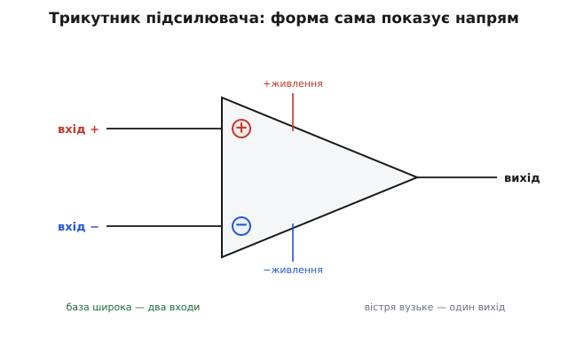
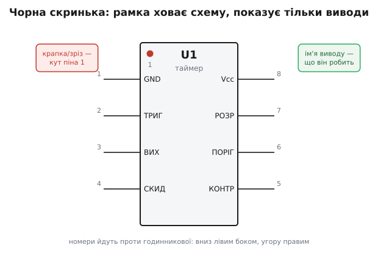
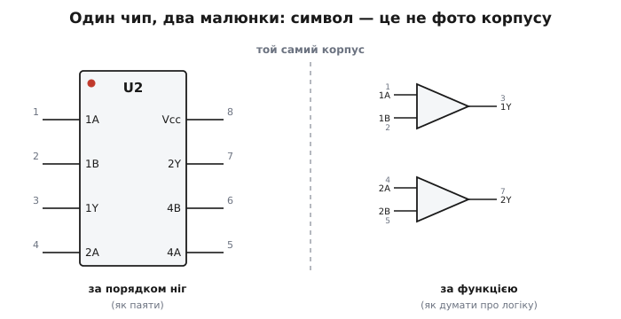

# Символ мікросхеми на схемі

Усередині однієї крихітної мікросхеми (англ. *integrated circuit*, IC — «вбудоване коло») можуть ховатися сотні транзисторів, десятки резисторів, конденсатори, цілий підсилювач чи навіть мікропроцесор. Якщо все це чесно намалювати на схемі, аркуш перетвориться на нечитабельне павутиння, а сенс кола потоне в деталях, які розробникові кола й не треба знати. Тому інженер чинить інакше: він малює не нутрощі, а **межу** — рамку чи трикутник, з якого стирчать виводи. Символ каже рівно те, що потрібно, щоб приєднати чип до решти кола, і свідомо мовчить про все інше.

Це не лінь і не спрощення «для краси». Це той самий хід думки, що й уся теорія кіл: щоб міркувати про струми й напруги, ми заміняємо складний фізичний об'єкт його **поведінкою на виводах**. Резистор — це не циліндрик із вуглецевою плівкою, а співвідношення U = R·I між двома кінцями. Так само мікросхема на схемі — це не кремній у пластмасі, а набір виводів і правило, як напруги й струми на них пов'язані. Символ — це коротке ім'я для цієї поведінки.

> 🔧 **Навіщо це.** Коли ви читаєте чужу схему підсилювача чи фільтра, ви маєте за секунду впізнати: ось тут стоїть операційний підсилювач, сюди заходить сигнал, звідси виходить, отут живлення. Якби замість трикутника стояла повна внутрішня схема з двадцяти транзисторів, ви б витратили пів години лише на те, щоб зрозуміти, що це взагалі підсилювач. Символ — це домовленість, яка робить схему читабельною з першого погляду.

## Трикутник: символ підсилення

Найважливіший для аналогової техніки символ — **трикутник**. Це загальне позначення підсилювача: будь-що, що бере слабкий сигнал і робить його сильнішим, малюють трикутником. Форма обрана не випадково — вона сама показує напрям. Широка сторона (база трикутника) — це **входи**; гостре вістря — це **вихід**. Сигнал ніби «звужується» від багатьох входів до одного виходу, як стрілка, що вказує, куди тече підсилений сигнал.



*Форма трикутника несе сенс: входи заходять у широку базу, підсилений сигнал виходить із вузького вістря. Знаки «+» і «−» позначають неінвертувальний і інвертувальний входи, а не плюс і мінус живлення.*

Коли підсилювач має **два** входи — а це майже завжди так для операційного підсилювача (англ. *operational amplifier*, op-amp; «операційний», бо колись на ньому виконували математичні операції аналогового обчислювача) — їх позначають знаками **«+»** і **«−»** просто біля бази трикутника, всередині нього. Тут криється класична пастка для початківця: ці знаки **не мають жодного стосунку до живлення**. «+» — це **неінвертувальний** вхід: підвищення напруги на ньому штовхає вихід **угору**. «−» — **інвертувальний** вхід: підвищення напруги на ньому штовхає вихід **униз**, у протилежний бік. Назви описують, у який бік вихід реагує на сигнал, а не полярність батареї.

Сам підсилювач теж треба живити, і живлення приходить **окремими виводами**, які малюють зверху й знизу трикутника (часто їх на спрощеній схемі взагалі не показують, щоб не захаращувати — мовляв, «зрозуміло, що чип десь живиться»). Тобто в трикутника насправді мінімум п'ять істотних виводів: два входи, один вихід і два живлення. А на символі видно лише три — бо для **сигнальної** логіки кола важать саме входи й вихід, а живлення — це інфраструктура, яку домовляються не малювати.

Чому взагалі трикутник, а не квадрат чи кружок? Коротка відповідь — звичай, що встояв і став стандартом. Довша й цікавіша — символ виріс із аналогових обчислювачів середини XX століття, де трикутниками малювали блоки, що додавали, інтегрували й масштабували напруги; звідти він і потрапив у даташити перших операційних підсилювачів. Хто перший намалював саме трикутник і як форма закріпилася як галузева норма — [окрема історія](book:electronics/ic-schematic-symbol/hist-opamp-triangle.md), де є і Карл Шварцель із його патентом «підсумовувального підсилювача» 1941 року, і шлях до стандарту IEEE.

## Чорна скринька: рамка з виводами

Не всяку мікросхему вдається звести до однієї простої функції на кшталт «підсилювати». Таймер, регулятор живлення, набір логічних вентилів, мікроконтролер — у них немає однієї природної форми. Для таких чипів існує універсальне рішення: намалювати **прямокутну рамку** і вивести з неї виводи (англ. *pins* — «ніжки»). Рамка нічого не каже про нутрощі; вона каже лише, **які виводи є, як вони називаються і де розташовані**. Це і є «чорна скринька» (англ. *black box*) у буквальному графічному вигляді — об'єкт, про який ми знаємо тільки те, що видно ззовні.



*Рамка показує тільки інтерфейс. Усередині біля кожного виводу — його функційне ім'я (що він робить), зовні — номер фізичної ніжки. Крапка в кутку позначає вивід номер 1, від якого ведеться відлік.*

Рамку наповнюють трьома видами підписів, і їх корисно не плутати.

**Ім'я кола (позначка-власник).** Усередині рамки — коротка позначка на кшталт `U1`, `U2`. Літера каже, **що це за деталь**, а число — котра вона за рахунком на цій схемі. Для мікросхем стандартна літера — **`U`** (від англ. *unit* — «вузол, одиниця»; колись писали довше `IC`, але коротке `U` витіснило його як норму). Резистор позначають `R`, конденсатор `C`, транзистор `Q`, діод `D` — і так далі. Ця позначка — головний ключ: за нею в переліку елементів (англ. *bill of materials*) знаходять, який саме чип сюди ставити. Літери закріплені стандартами (історично — військовий MIL-STD-16 ще з 1950-х, потім IEEE 200, нині ASME Y14.44 та міжнародний IEC 81346), тож `U` означає мікросхему в будь-якій схемі світу.

**Імена виводів (що вони роблять).** Усередині рамки, біля кожної ніжки, пишуть її **функцію**: `Vcc` — додатне живлення, `GND` — спільний (англ. *ground* — «земля»), `ВИХ` — вихід, `СКИД` — скидання, і так далі. Це найважливіша частина: вона каже, що приєднувати до цього виводу. Виводи зазвичай **групують за змістом** — живлення зверху й знизу, входи ліворуч, виходи праворуч, — щоб схема читалася природно, зліва направо, за течією сигналу. Знов-таки: символ малюють **за логікою**, а не за тим, як ніжки розташовані на справжньому корпусі.

**Номери виводів (де фізична ніжка).** Зовні рамки, біля кожної ніжки, ставлять **номер** — це адреса конкретної металевої ніжки на реальному корпусі. Саме за цим номером плата з'єднає вивід із доріжкою. Номери — місток від абстрактної схеми до фізичного чипа: на схемі ви бачите «вивід 3 — це вихід», а на платі знаходите третю ніжку й ведете до неї доріжку.

## Вивід номер 1 і чому це важливо

Якщо номери ніжок — це адреси, то має бути **початок відліку**. Ним завжди є **вивід 1**, і його на реальному корпусі обов'язково помічають: **крапкою** (заглибленням або точкою фарбою) біля цієї ніжки, **зрізом-півмісяцем** на одному торці корпусу, або і тим, і тим. Це не прикраса. Поставити чип «задом наперед» — переплутати, де перша ніжка, — означає подати живлення й сигнали не на ті виводи; найчастіше мікросхема від цього просто згоряє. Тому позначку піна 1 переносять і на символ (та сама крапка в кутку рамки), щоб око однаково орієнтувало і схему, і деталь на платі.

Від піна 1 номери йдуть у строго визначеному порядку — **проти годинникової стрілки**, якщо дивитися на чип згори, тримаючи зріз догори: спершу **вниз лівим боком**, далі **вгору правим боком**. Для восьмививідного корпусу це означає: ліворуч згори вниз — 1, 2, 3, 4; праворуч знизу вгору — 5, 6, 7, 8. Тому на правому боці рамки номери часто йдуть «навпаки» (8, 7, 6, 5 згори вниз) — це не помилка креслення, а наслідок того самого правила обходу.

> 🔧 **Навіщо це.** Коли ви розводите плату й тягнете доріжки, ви постійно звіряєте номер виводу на схемі з номером ніжки на посадковому місці (англ. *footprint*). Один зсув на одну ніжку — і вся мікросхема приєднана неправильно. Тому крапка піна 1 і напрям нумерації проти годинникової — це не дрібниця стилю, а те, що рятує від спалених деталей і годин пошуку, «чому не працює».

## Символ — це інтерфейс, а не фотографія

Тут варто зупинитися на головній думці, бо вона пояснює дуже багато непорозумінь. **Символ мікросхеми не зобов'язаний відповідати фізичному розташуванню ніжок.** Це частий шок для новачка: на схемі живлення вгорі, а на справжньому чипі вивід живлення може бути збоку чи внизу. Жодного протиріччя немає — символ і корпус відповідають за різні речі.

Корпус відповідає за **фізику**: де метал, як паяти, як орієнтувати при складанні. Символ відповідає за **зрозумілість**: він розставляє виводи так, щоб людині було легко простежити, що з чим з'єднано і як тече сигнал. Зв'язок між ними тримається **номером виводу** — спільним для обох. Тому ту саму мікросхему цілком законно намалювати кількома різними символами.



*Той самий корпус. Ліворуч — рамка з виводами в порядку ніжок (зручно паяти й перевіряти). Праворуч — той самий чип розбитий на окремі функційні блоки (зручно стежити за логікою). Номери виводів — однакові; різниться лише групування.*

Корпус, у якому всередині сидять, скажімо, чотири однакові логічні вентилі, можна намалювати **однією рамкою** з усіма виводами по порядку — так зручно перевіряти монтаж. А можна намалювати **чотири окремі вентилі**, розкидані по схемі там, де кожен працює, з підписом, якому фізичному виводу він відповідає — так зручно читати логіку кола. Обидва малюнки правильні; вони описують один і той самий чип, просто з різних боків. Вибір — про те, що зараз важливіше зрозуміти: монтаж чи функцію.

Та сама свобода є і всередині однієї деталі. Входи операційного підсилювача «+» і «−» можна намалювати в будь-якому вертикальному порядку — «+» зверху чи «−» зверху, — якщо це робить конкретну схему наочнішою; знаки біля входів зберігають однозначність незалежно від того, який вище. Важить не положення на малюнку, а підписаний знак і номер виводу.

## Як це читають у коді й на платі

Символ живе не сам по собі — він прив'язаний до реальної ніжки, і прошивка спілкується саме з ніжкою. У мікроконтролері кожен вивід має номер на корпусі та ім'я порту, і символ на схемі підписаний обома. Коли ви, дивлячись на схему, бачите, що світлодіод приєднано до виводу з іменем `PB5`, ви пишете в прошивці саме цей порт:

**Умова.** Світлодіод приєднано до виводу, підписаного на схемі як `PB5` (порт B, лінія 5). Треба ним блимнути.

```c
// На схемі: U1, вивід PB5 → доріжка → світлодіод.
// Ім'я PB5 з символу прямо стає адресою регістра в коді.
DDRB  |= (1 << PB5);   // PB5 — на вихід
PORTB |= (1 << PB5);   // подати високий рівень: світлодіод горить
PORTB &= ~(1 << PB5);  // подати низький рівень: світлодіод гасне
```

Ланцюжок замкнувся: **ім'я виводу на символі → номер фізичної ніжки → доріжка на платі → регістр у прошивці**. Символ — перша ланка цього ланцюжка; усе інше тримається на тому, що він названий чесно й однозначно. Якби виводи на схемі підписали абияк, ви б не знали, який порт смикати в коді, і код став би набором магічних чисел замість зрозумілих імен.

## Що тримати в голові

Символ мікросхеми — це **межа замість нутрощів**: рамка чи трикутник, що показує лише виводи й мовчить про схему всередині. Трикутник означає підсилення (широка база — входи, вузьке вістря — вихід; «+» і «−» — це інвертувальний та неінвертувальний входи, не живлення). Прямокутник — універсальна чорна скринька для всього іншого, з трьома видами підписів: позначка-власник (`U1` — що за деталь), імена виводів усередині (що вони роблять) і номери ніжок зовні (де вони фізично). Вивід 1 завжди помічений крапкою чи зрізом, а нумерація йде проти годинникової стрілки — це рятує від спалених деталей. І головне: символ розставляє виводи за **логікою сприйняття**, а не за фізикою корпусу; зв'язок між схемою, платою й кодом тримає спільний **номер виводу**. Зрозумівши це, ви читаєте будь-яку схему як речення: ось деталь, ось що входить, ось що виходить, ось куди це йде далі.
