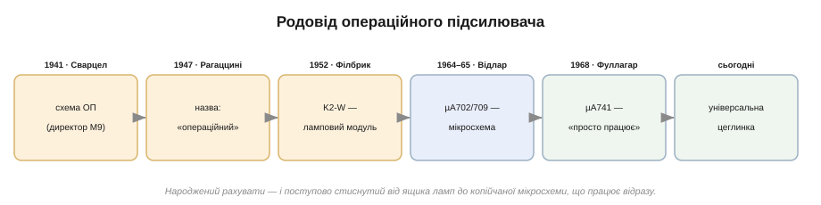
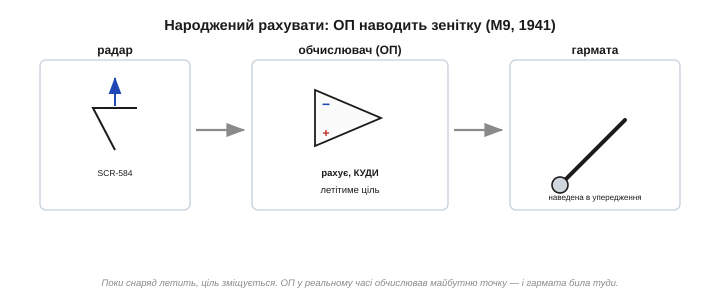
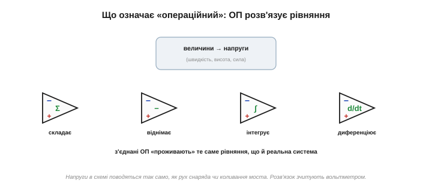
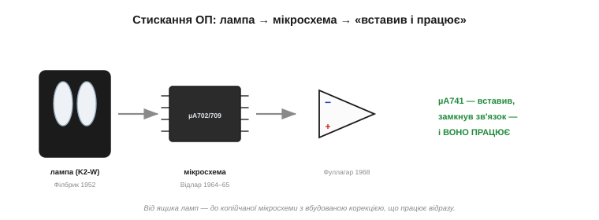
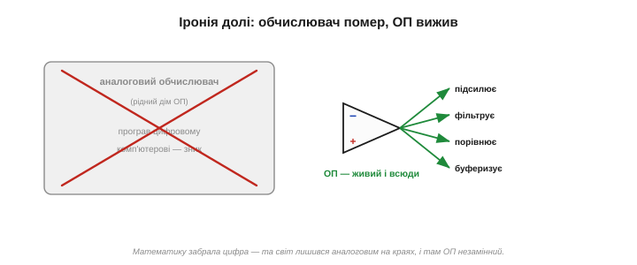

# 📜 Операційний підсилювач: від артилерії до µA741

> Операційний підсилювач — найуніверсальніша «цеглинка» аналогової електроніки: ним підсилюють, фільтрують, порівнюють, буферизують. Та народився він зовсім не для цього, а щоб **рахувати** — обчислювати траєкторії зенітних снарядів у розпал війни. А його найславетніше втілення, мікросхема **µA741**, — плід праці кількох людей упродовж трьох десятиліть. Це історія приладу, що пережив своє первісне призначення й став безсмертним.

Сама назва — «**операційний**» — звучить дивно для підсилювача. Чому «операційний»? Бо колись ним виконували математичні **операції**: додавання, віднімання, інтегрування. Щоб зрозуміти цей прилад, треба повернутися в часи, коли «комп'ютер» був не цифровим, а **аналоговим** — і рахував не нулями й одиницями, а напругами та струмами.

*Рис. Шлях операційного підсилювача. Народився як прилад для обчислень (Сварцел, 1941), дістав ім'я (Рагаццині, 1947), став товаром у вигляді лампового модуля (Філбрик, 1952), стиснувся до мікросхеми (Відлар, 1964–65) і нарешті — до «вставив і працює» (Фуллагар, µA741, 1968).*

---

## Народжений рахувати

Уявіть 1941 рік, війну. Зенітна гармата має поцілити в літак, що мчить на кілометровій висоті. Поки снаряд летить, ціль уже не там, де була, — треба передбачити, **куди вона буде** за кілька секунд, і навести гармату туди. Це безперервне обчислення в реальному часі, і робити його мусила… електроніка.

Саме для таких обчислень **Карл Сварцел** *(Karl D. Swartzel Jr.)* у Bell Labs 1941 року сконструював підсилювач, який і вважають **першим операційним**. Його патент називався промовисто — «**Сумувальний підсилювач**» *(Summing Amplifier)*: прилад, що з високим підсиленням, постійним струмом і від'ємним зворотним зв'язком умів **складати** вхідні сигнали. Цей підсилювач широко використали у приладі керування вогнем **M9** — електронному «мозку» зенітної батареї. У парі з радаром SCR-584 директор M9 наводив гармати так точно, що частка влучань сягала близько 90% — нечувано на ті часи. Особливо яскраво це виявилося наприкінці війни, коли на Лондон полетіли крилаті бомби-снаряди «Фау-1»: батареї з директорами M9 збивали їх там, де доти не зараджувала жодна ручна стрільба. За сухою назвою «сумувальний підсилювач» стояли врятовані життя. Операційний підсилювач почав своє життя як **обчислювач для війни**.

*Рис. Перше призначення ОП — обчислення. У приладі керування вогнем M9 підсилювачі в реальному часі рахували, куди летітиме ціль, і наводили гармати. Прилад народився не підсилювати звук, а розв'язувати рівняння руху.*

За цим стояла глибша ідея, теж із Bell Labs: **від'ємний зворотний зв'язок** Гарольда Блека (1927). Блек показав, що коли частину виходу підсилювача повертати на вхід «у протифазі», прилад стає напрочуд **точним і стабільним** — навіть якщо сам по собі він примхливий і непостійний. Операційний підсилювач — це Блекова ідея, доведена до краю: зроби власне підсилення велетенським, а тоді приборкай його зворотним зв'язком до потрібної, точної величини. Уся «магія стабільності» цього приладу — саме про це.

---

## Чому «операційний»

По війні цю ідею підхопила наука. 1947 року професор **Джон Рагаццині** *(John R. Ragazzini)* з Колумбійського університету в статті вперше формально **назвав** прилад: **операційний підсилювач**. Назва пояснювала суть — таким підсилювачем виконують математичні **операції**.

Як підсилювач може рахувати? У цьому й полягала ідея **аналогового обчислювача** *(analog computer)*. Кожну величину в задачі — швидкість, висоту, силу — подають не числом, а **напругою**. А операційний підсилювач із кількома резисторами й конденсаторами вміє над цими напругами щось робити: одна обв'язка **складає** напруги, інша **віднімає**, ще інша **інтегрує** (накопичує) чи **диференціює** (бере похідну). З'єднавши кілька таких блоків, можна змусити схему підкорятися тому самому рівнянню, що й реальна система, — і тоді напруги в схемі **поводяться так само**, як рух снаряда, коливання моста чи хімічна реакція. Розв'язок зчитують вольтметром, у реальному часі.

*Рис. Аналоговий обчислювач. Кожну величину подають напругою; операційні підсилювачі складають, віднімають, інтегрують ці напруги — і схема «проживає» те саме рівняння, що й реальна система. Звідси й назва: підсилювач для математичних операцій.*

> 🔧 **Навіщо це.** Ось чому в назві «операційний» — а не «підсилювальний». Прилад замислили як **універсальний математичний блок**: даєш йому потрібну обв'язку з резисторів — і він виконує задану операцію над сигналами. Ця універсальність нікуди не зникла: і сьогодні той самий ОП залежно від обв'язки то підсилює, то фільтрує, то порівнює. Він — не вузька деталь, а гнучкий інструмент, що набуває потрібної форми від кількох зовнішніх компонентів.

У свої найкращі роки аналогові обчислювачі були серйозною силою: на них моделювали політ ракет і літаків, роботу електромереж, хімічні реактори. Цілі зали таких машин — стійки з сотнями операційних підсилювачів, обплетені дротами-перемичками, — служили інженерам там, де цифрові машини ще були надто повільні чи дорогі. Кожна перемичка задавала рівняння; «програмувати» означало фізично **з'єднати** блоки в потрібну схему, а не написати код.

---

## Чорні скриньки Філбрика

Поки ОП лишався громіздкою саморобкою з ламп, користуватися ним могли тільки інженери-фахівці. Усе змінив **Джордж Філбрик** *(George A. Philbrick)* — піонер практичних аналогових обчислень. Він мислив **модулями**: робив для інженерів готові «чорні скриньки», з яких ті складали власні обчислювачі, не вникаючи в нутрощі.

1952 року його фірма **GAP/R** (George A. Philbrick Researches) випустила **K2-W** — операційний підсилювач у вигляді компактного змінного модуля на двох лампах-двотріодах 12AX7, що вставлявся у звичайну октальну панельку. Коштував він **22 долари** і став **першим комерційним операційним підсилювачем** — приладом, який можна було просто купити й застосувати. Серія K2 уперше зробила ОП по-справжньому популярним. Філбрик подарував інженерам **готовий блок** — і це був перший крок до того, щоб ОП став деталлю, а не проєктом.

*Рис. K2-W — перший комерційний операційний підсилювач (GAP/R, 1952): дві лампи-двотріоди в октальному модулі за 22 долари. Філбрик зробив ОП «чорною скринькою», яку купуєш і вставляєш, — і цим відкрив його широкому загалу.*

Філбрик був постаттю колоритною: його фірма не лише продавала «скриньки», а й невтомно **вчила** інженерів аналоговому мистецтву — випускала посібники, збірники застосувань, навіть власний часопис. Багато хто з того покоління опанував операційний підсилювач саме за матеріалами GAP/R. Для **поширення** ОП Філбрик зробив чи не більше, ніж для його винаходу: він перетворив екзотику для обраних на щоденний інструмент.

---

## Усе на одному кристалі

Лампи — це гаряче, велике й недовговічне; на зміну їм прийшов [транзистор](book:electronics/transistor-idea/hist-transistor.md). Справжня революція настала, коли ОП переселили з ламп у **кремній** — на єдиний крихітний кристал.

Зробив це **Боб Відлар** *(Bob Widlar)* у Fairchild — найперший «хрестоносець» аналогового проєктування мікросхем. 1964 року він створив **µA702** — **перший монолітний операційний підсилювач у вигляді мікросхеми**. Перший млинець вийшов глевкуватим: низьке підсилення, вузький діапазон, примхливе живлення — широкого успіху µA702 не мав. Але вже наступного, 1965 року, Відлар випустив **µA709** — і той став першим **по-справжньому масовим** ОП-мікросхемою, шаленим комерційним успіхом. Цілий операційний підсилювач, що колись був ящиком ламп, тепер уміщався в нігтику й коштував копійки.

Відлар був живою легендою Кремнієвої долини — блискучий, упертий і нестримний на вдачу, з ним пов'язано безліч історій. Та головне — він винайшов хитрі схемні прийоми (як-от **дзеркало струмів** — пара транзисторів, що змушує в одній вітці точно повторювати струм іншої), без яких узагалі годі було зробити добрий підсилювач на одному кристалі, де не поставиш ні точного резистора, ні великого конденсатора. Саме його винахідливість перетворила аналогову мікросхему з мрії на реальність.

---

## Той, що «просто працює»

У µA709 була прикра вада: щоб він не «заводився» (не самозбуджувався), до нього доводилося чіпляти зовнішні **конденсатори корекції** й ретельно розводити плату. Початківця це лякало.

Розв'язав проблему **Дейв Фуллагар** *(Dave Fullagar)* у Fairchild. 1968 року він випустив **µA741**, додавши **конденсатор корекції прямо всередину кристала**. Дрібниця — а наслідок величезний: тепер ОП можна було просто **вставити в схему, замкнути зворотний зв'язок — і він працював**, без жодних зовнішніх хитрощів і ризику самозбудження. µA741 став **найпопулярнішим операційним підсилювачем усіх часів** і зробив аналогове проєктування простим навіть для новачка. (Саме тому варто розрізняти: монолітний ОП винайшов Відлар, а класичний «зручний» 741 — Фуллагар; їх часто плутають.)

*Рис. Три кроки стискання. Ламповий модуль Філбрика → перша монолітна мікросхема Відлара (µA702/709) → µA741 Фуллагара з вбудованою корекцією, що «просто працює». ОП пройшов шлях від ящика ламп до копійчаної мікросхеми, яку вставляєш і забуваєш.*

Усередині µA741 — близько двох десятків транзисторів: диференційний вхід (порівнює два сигнали), каскад підсилення, витривалий вихід і та сама вбудована корекція. Схема вийшла такою показовою й збалансованою, що 741 на десятиліття став **навчальним еталоном** — на ньому й досі пояснюють студентам, як влаштований операційний підсилювач. Прилад, що мав просто працювати, заодно навчив цілі покоління інженерів самій аналоговій схемотехніці. Дивовижно, але 741 випускають і донині, понад півстоліття по тому, — рідкісне довголіття для мікросхеми.

> 🔧 **Навіщо це.** Винахід рідко робить одна людина — і ОП це показує яскраво. Сварцел дав схему, Рагаццині — назву та теорію, Філбрик — товарний модуль, Відлар — мікросхему, Фуллагар — зручність. Кожен додав свою ланку. Тому, кажучи «винахідник 741», варто бути точним: це Фуллагар, а не Відлар (хоча саме Відлар першим зробив ОП мікросхемою). Чесний кредит — це не дрібниця, а повага до кожного, хто доклав руку.

---

## Іронія: обчислювачі вмерли, а ОП — ні

Тут на історію падає тінь іронії. Аналогові обчислювачі — рідний дім операційного підсилювача, заради яких його й створили, — у 1960–70-х **програли** цифровим комп'ютерам і зникли майже безслідно. Здавалося б, разом із ними мав піти й ОП.

Та сталося навпаки. Прилад **пережив** своє первісне призначення — бо виявився надто корисним як універсальна аналогова цеглинка. Хай математику забрала цифра, але світ лишився **аналоговим** на своїх краях: будь-який давач, мікрофон, антена, акумулятор дають аналоговий сигнал, який треба підсилити, відфільтрувати, порівняти — перш ніж віддати цифрі. І скрізь на цих стиках стоїть він, операційний підсилювач. Інструмент пережив задачу, для якої народився.

*Рис. Інструмент, що пережив свою задачу. Аналогові обчислювачі програли цифровим і зникли — а народжений для них ОП лишився й розквітнув як універсальна цеглинка: підсилює, фільтрує, порівнює, буферизує на стику будь-якого аналогового світу з цифрою.*

Сьогодні операційні підсилювачі рахують уже не рівняння, а живуть у кожному пристрої непомітними трудівниками: підсилюють сигнал мікрофона, згладжують живлення, зчитують давачі температури й світла, порівнюють напруги в зарядних схемах. Один тип приладу — тисячі застосувань, і всі вони, по суті, варіації на ту саму тему: майже ідеальний підсилювач, приборканий зворотним зв'язком до потрібної форми.

У цьому й найбільший урок ОП: іноді найцінніший винахід — не той, що робить одну річ якнайкраще, а той, що робить **багато речей досить добре** й гнучко набуває потрібної форми від кількох зовнішніх деталей. Транзистор дав нам підсилення; операційний підсилювач загорнув його в зручну, майже ідеальну абстракцію, з якою інженер працює, не думаючи про нутрощі. Це сходинка вгору — від окремого «приладу» до універсального «будівельного блоку».

---

## Спадок

Отже, з цієї історії операційний підсилювач постає майже **ідеальним підсилювачем**, який кількома зовнішніми деталями приборкують під будь-яку задачу. Приборкують його тим самим прийомом, що дав йому життя в M9, — [від'ємним зворотним зв'язком](book:electronics/bjt-amplifier): зроби власне підсилення велетенським, а тоді поверни частину виходу на вхід «у протифазі» — і з кількох резисторів виходить точний, передбачуваний підсилювач, попри примхливе власне підсилення ОП. Саме ця ідея, доведена від Блека через Сварцела до µA741, і робить прилад тим, чим він є.
