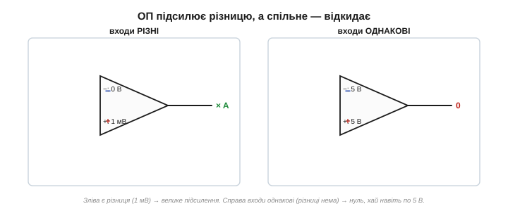
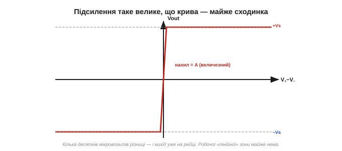

# Ідеальний операційний підсилювач

Операційний підсилювач здається складним — усередині нього десятки транзисторів ([📜 історія](topic:electronics/ideal-opamp/hist-opamp.md)). Та користуватися ним просто, бо для розрахунків його замінюють **ідеальною моделлю** — кількома сміливими припущеннями, які майже не брешуть. Опанувавши цю модель, ви зможете аналізувати схеми на ОП кількома рядками арифметики. Тож почнімо саме з неї.

Зверніть увагу й на сам **рівень** цього приладу. Щоб зробити підсилювач на [одному транзисторі](topic:electronics/bjt-amplifier), доводиться морочитися з робочою точкою, резисторами зміщення, з коефіцієнтом β, що «плаває» від екземпляра до екземпляра. Операційний підсилювач ховає всю цю кухню всередину: інженерові він дається як **готовий блок** із простими правилами, і будувати з нього схеми — однаково що складати з деталей конструктора, не думаючи про окремі транзистори. Це і є сила хорошої абстракції ([📜 історія](topic:electronics/ideal-opamp/hist-opamp.md)).

### Що це: підсилювач різниці

В операційного підсилювача **два входи** й **один вихід**. Входи нерівноцінні:

- **неінвертуючий вхід** *(non-inverting, позначають «+»)*;
- **інвертуючий вхід** *(inverting, позначають «−»)*.

А робить ОП одну-єдину річ: підсилює **різницю** напруг між своїми входами. Якщо назвати напруги на входах V₊ і V₋, то на виході:

```
Vout = A · (V₊ − V₋)
```

де **A** — власне підсилення приладу, **підсилення без зворотного зв'язку** *(open-loop gain)*. І воно **велетенське** — у реальних ОП сягає сотень тисяч чи мільйона. Запам'ятаймо цю формулу: усе подальше — її наслідки.

Самі назви входів кажуть про їхній вплив на вихід: підняти напругу на **неінвертуючому** «+» — і вихід піде **вгору**, у тому ж напрямі; підняти на **інвертуючому** «−» — вихід піде **вниз**, у протилежному (звідси й «інвертуючий»). Знак у формулі — V₊ **мінус** V₋ — це й відбиває.


*Операційний підсилювач. Трикутник із двома входами (інвертуючим «−» згори й неінвертуючим «+» знизу) та виходом на вістрі. Окремо підводять живлення (+Vs і −Vs). Вихід дорівнює різниці входів, помноженій на величезне підсилення A.*

### Йому байдужа абсолютна напруга — лише різниця

Найважливіше в цій формулі — слово **різниця**. ОП не цікавить, скільки вольтів на входах **самих по собі**: 0.001 В і 0.002 В чи 5.001 В і 5.002 В — для нього однаково, бо різниця в обох випадках та сама, 0.001 В. Підсилюється лише те, чим входи **відрізняються** (це звуть **диференційним** сигналом), а те, що на них **спільне** (**синфазний** сигнал, *common-mode*), — ігнорується.

Ця диференційність — велика чеснота. Скажімо, якщо на обидва входи наводиться однакова завада (від мережі, від сусідніх дротів), вона на них **спільна** — і ОП її просто **викине**, підсиливши лише корисну різницю. Тому ОП чудово витягує слабкий сигнал давача з-під шуму.


*Підсилювач різниці. ОП множить на A лише **різницю** V₊−V₋; те, що на входах спільне (синфазна завада), він відкидає. Тому однакова на обох входах завада не проходить на вихід — корисний сигнал лишається чистим.*

Приклад із життя. Тензодавач чи термопара дають крихітні мілівольти, а до них по двох довгих дротах наводиться 50-герцова завада від мережі — однакова на обох дротах (бо дроти поруч). Під'єднай давач до **двох** входів ОП — і завада, спільна для входів, відсіється, а корисна різниця підсилиться. Цю здатність відкидати спільне звуть **придушенням синфазного сигналу** — і вона одна з головних причин, чому ОП незамінний у вимірюваннях.

Ще яскравіше це у **вимірюванні струму**: щоб дізнатися струм, міряють крихітне падіння на маленькому резисторі, що «висить» на повних 12 чи 48 вольтах живлення. Абсолютні напруги на його кінцях величезні й майже однакові, а різниця — лічені мілівольти. ОП відкине спільні десятки вольтів і підсилить саму різницю. Без диференційного входу таке годі й виміряти.

### Ідеальна модель: три головні припущення

Щоб рахувати схеми на ОП легко, його заміняють **ідеальним**. Три припущення роблять усю магію.

1. **Нескінченне підсилення** (A → ∞). Найменша різниця між входами дає величезний вихід. У реальності A — сотні тисяч, але для розрахунків зручно вважати його нескінченним.
2. **Нескінченний вхідний опір** *(input impedance)*. Входи ОП **не споживають струму** взагалі — вони лише «дивляться» на напругу, нічого з джерела не відбираючи. (Пряма рідня високого вхідного опору [польового транзистора, керованого полем](topic:electronics/field-control); ОП із польовими входами підходять до цього ідеалу дуже близько.)
3. **Нульовий вихідний опір** *(output impedance)*. Вихід ОП — ідеальне джерело напруги: він видає задану напругу й тримає її **під будь-яким навантаженням**, не просідаючи.

(Є й дрібніші ідеалізації — нескінченна смуга частот і нульовий зсув; про їхні [реальні межі](topic:electronics/real-opamp-limits) йдеться окремо. Поки що — три головні.)


*Три припущення ідеального ОП. Підсилення нескінченне; вхідний опір нескінченний (у входи струм не тече); вихідний опір нульовий (вихід — ідеальне джерело напруги). Ці три «брехні» майже не брешуть — і роблять розрахунки тривіальними.*

> 🔧 **Навіщо це.** Навіщо ідеалізувати? Бо це **гігантськи спрощує** аналіз. «У входи струм не тече» — і ми відразу знаємо струми в усіх резисторах довкола. «Вихід тримає напругу під будь-яким навантаженням» — і нам байдуже, що до нього під'єднано. «Підсилення нескінченне» — і з нього випливає [золоте правило розрахунку — «віртуальне коротке замикання»](topic:electronics/virtual-short). Реальний ОП лише трохи відступає від цих ідеалів, і ці [відступи](topic:electronics/real-opamp-limits) — маленькі поправки, якими спершу можна знехтувати. Ідеальна модель дає 99% відповіді кількома рядками.

Наскільки ж близька ця ідеалізація до правди? Напрочуд близька. Вхідний струм у славетного µA741 — близько 80 наноампер (мізер проти робочих струмів), а в ОП із польовими входами — пікоампери, фактично нуль. Власне підсилення — сотні тисяч. Вихідний опір — одиниці ом. Тож, рахуючи схему за ідеальною моделлю, ви схибите хіба на частку відсотка, а виграєте в простоті незмірно.

А одне з припущень одразу дає робоче **правило**, яким користуються скрізь: **у входи ОП струм не тече**. Щойно побачивши в схемі операційний підсилювач, сміливо вважайте, що крізь його входи струму нема, — а отже, увесь струм у під'єднаних до входів резисторах легко простежити. Це перше «золоте правило»; друге, [«віртуальне коротке замикання»](topic:electronics/virtual-short), діє, коли ОП охоплено зворотним зв'язком.

### Підсилення таке велике, що майже все його «зашкалює»

Спинімося на першому припущенні — велетенському A — бо воно має дивовижний наслідок. Хай A = 100 000 (скромно як на ОП). Тоді щоб вихід дав, скажімо, 10 В, на входах має бути різниця всього:

```
V₊ − V₋ = Vout / A = 10 В / 100 000 = 0.0001 В = 0.1 мВ
```

Лише **десята частка мілівольта**! А якщо різниця буде хоч трохи більша — 1 мВ, — то формула обіцяє 100 В на виході. Стільки ОП дати не може (немає такого живлення), тож вихід просто **впирається в межу**. Виходить, що за велетенського A навіть **крихітна** різниця на входах кидає вихід в одну з крайніх позицій. ОП — украй «нервовий» прилад: майже будь-який вхід його зашкалює.


*Передатна крива ОП без зворотного зв'язку — майже вертикальна сходинка. Через величезне A досить десятків мікровольтів різниці, щоб вихід стрибнув від однієї межі до іншої. Лінійна ділянка посередині — мікроскопічно вузька.*

Одне застереження: це велетенське A — лише на **постійному струмі** й низьких частотах. Зі зростанням частоти власне підсилення ОП **спадає** (через ту саму внутрішню корекцію, що робить його стійким, [📜 історія](topic:electronics/ideal-opamp/hist-opamp.md)). Тому «нескінченне підсилення» — добре наближення для повільних сигналів, а на високих частотах його доводиться [уточнювати](topic:electronics/real-opamp-limits). Далі тримаймося постійного струму, де ідеал найточніший.

### Вихід не вискочить за межі живлення

Звідки беруться ті «межі»? Операційний підсилювач, як і будь-який [підсилювач на транзисторі](topic:electronics/bjt-amplifier), живиться від джерела — найчастіше **двополярного** (+Vs і −Vs, класично ±15 В, але буває й однополярне). І, хоч би що казала формула Vout = A·(V₊−V₋), вихід фізично **не може вийти за рейки живлення**: він гойдається лише десь між −Vs і +Vs, а далі впирається й **насичується** *(saturation)*. Поставити на вихід 100 В від живлення ±15 В неможливо — буде ~+14 В, і все.


*Вихід ОП живиться від рейок ±Vs і не може за них вискочити. Хоч скільки обіцяла б формула, вихід насичується трохи не доходячи до рейки. «Стеля» й «підлога» виходу — це напруги живлення.*

Класичне живлення ОП — **двополярне**, ±Vs (наприклад ±15 В): тоді вихід може гойдатися і вгору, і вниз навколо нуля, що зручно для змінних сигналів. Та багато сучасних ОП працюють і від **однополярного** живлення (скажімо, 0…5 В від того самого мікроконтролера) — тоді «нулем» для сигналу роблять середину живлення. Є й ОП «rail-to-rail», чий вихід дотягується майже до самих рейок. Вибір живлення — перше, що погоджують, ставлячи ОП у схему.

### Сам по собі він — ще не підсилювач

Складімо два спостереження докупи: підсилення велетенське, а вихід обмежений рейками. Виходить, що **сам по собі**, без жодної обв'язки, операційний підсилювач — кепський підсилювач. Найменша різниця на входах одразу кидає його вихід на одну з рейок: трішки V₊ більший за V₋ — вихід угорі (+Vs); трішки менший — вихід унизу (−Vs). Лінійна ділянка посередині така вузенька, що сигнал крізь неї не «протягнеш».

Натомість таке поводження — це готовий [**компаратор**: прилад, що каже, котрий із двох входів більший](topic:electronics/comparator). А от як **підсилювач** ОП у цьому стані некерований.

То як приборкати цей шалений мільйон підсилення, щоб дістати з нього **точний, передбачуваний** підсилювач? Відповідь — [**від'ємний зворотний зв'язок**](topic:electronics/negative-feedback): повернути частину виходу назад на вхід так, щоб ОП сам себе вгамовував. Це і є ключ, що перетворює некерований ОП на надійний підсилювач.


*ОП без обв'язки. Трохи більший «+» — вихід злітає до +Vs; трохи більший «−» — падає до −Vs. Як компаратор це чудово, а як підсилювач — некеровано. Щоб зробити з нього лінійний підсилювач, потрібен від'ємний зворотний зв'язок.*

> 🔧 **Навіщо це.** Тут — ключова думка, без якої ОП не зрозуміти: **велике підсилення саме по собі марне; цінним воно стає лише в парі зі зворотним зв'язком**. Запас підсилення — це «сировина», яку зворотний зв'язок обмінює на **точність і стабільність** (так само, як у [підсилювачі на транзисторі](topic:electronics/bjt-amplifier) підсиленням жертвують заради передбачуваності). Велетенський A потрібен не щоб сильно підсилювати, а щоб було **чим** платити за точність — і саме [зворотний зв'язок](topic:electronics/negative-feedback) здійснює цей обмін.

Корисний образ: уявіть кермо з шаленою чутливістю — ледь торкнувся, і машину кидає в кювет. Кермувати ним «наосліп», без жодного зворотного зв'язку, неможливо: будь-яка дрібниця — і ти в канаві (вихід на рейці). Але дай водієві **бачити** дорогу й безперервно підправляти кермо — і та сама шалена чутливість обертається на чесноту: машина точно тримає смугу, миттєво реагуючи на найменше відхилення. Так само велетенське підсилення ОП, охоплене [зворотним зв'язком](topic:electronics/negative-feedback), дає не хаос, а **точність** і блискавичну реакцію.
